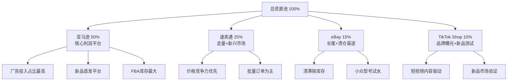

## 案例三：多平台运营的3C卖家——从亚马逊单品到四平台矩阵的进阶之路

### 案例背景

**卖家档案：**

| 项目 | 详情 |
|------|------|
| 卖家代号 | 张磊（化名） |
| 年龄 | 32岁 |
| 背景 | 深圳某电子公司产品经理，有5年3C行业供应链经验 |
| 启动资金 | 30万元人民币 |
| 启动时间 | 2022年3月 |
| 主营品类 | 手机配件、智能穿戴配件、音频设备配件 |
| 当前状态 | 亚马逊+速卖通+eBay+TikTok Shop 四平台运营 |

张磊的创业起点并非白手起家。在电子公司工作期间，他积累了对3C供应链的深度理解——知道哪些工厂的品控好、哪些元器件的成本结构、哪些产品在海外有需求缺口。但他真正决定辞职全职做跨境电商，是因为一个偶然的机会：2021年底，他帮朋友在亚马逊美国站上架了一款手机支架，三个月内月销突破2000单，单品利润率超过30%。

这次试水让他意识到：**3C配件品类虽然竞争激烈，但需求量大、复购率高、供应链成熟，只要选对细分赛道并做好差异化，完全有机会在红海中切出自己的份额。**

### 多平台战略的底层逻辑

#### 为什么3C卖家必须走多平台路线？

很多卖家在单平台取得成功后会问：为什么还要拓展其他平台？张磊的思考逻辑值得参考。

**核心原因有三个：**

**第一，分散平台风险。** 亚马逊的封号潮给所有卖家敲响了警钟。2021年亚马逊大规模封号事件中，超过5万中国卖家店铺被关停，其中不乏年销过亿的大卖家。单一平台依赖度越高，平台政策变动带来的风险就越大。张磊在2022年初做了一个测算：如果他的亚马逊店铺突然被封，他需要6-8个月才能在其他平台恢复到同等销售额。这个时间差足以让一个中小卖家资金链断裂。

**第二，覆盖不同消费人群。** 不同平台的用户画像差异显著：

| 平台 | 核心用户画像 | 价格敏感度 | 品牌意识 | 对3C配件的需求特征 |
|------|-------------|-----------|---------|-------------------|
| 亚马逊美国站 | 中产家庭，Prime会员 | 中等 | 较强，愿意为品牌溢价 | 注重品质和售后，偏好功能集成型产品 |
| 速卖通 | 新兴市场年轻用户 | 高 | 较弱，以性价比为导向 | 追求基础功能+低价，单件消费为主 |
| eBay | 多元化用户，DIY爱好者 | 中等 | 中等，认可口碑 | 寻找稀缺型号、小众配件、兼容替代品 |
| TikTok Shop | Z世代年轻消费者 | 高 | 弱，被内容驱动 | 冲动消费，偏好新奇特、视觉冲击力强的产品 |

同一条Type-C数据线，在亚马逊可以卖$9.99并强调MFi认证和编织工艺；在速卖通卖$2.49主打批量采购价；在eBay针对特定机型的兼容线卖$6.99；在TikTok Shop用短视频展示弯折测试卖$5.99。**同样的供应链，四倍的渠道覆盖，这就是多平台的杠杆效应。**

**第三，对冲季节性波动。** 3C配件的销售有明显的季节性：Q4（黑色星期五+圣诞）是旺季，Q1是淡季。不同平台的促销节奏不同——亚马逊Prime Day在7月，速卖通的"328大促"在3月，eBay的闪购活动不定期举行。多平台运营可以让全年的收入曲线更加平滑。

#### 多平台运营的资源分配模型

张磊采用的是"1+2+1"资源分配模型：



这个模型的核心原则是：**亚马逊打利润，速卖通打规模，eBay打长尾，TikTok打品牌。** 每个平台的角色定位清晰，资源投入有主次之分，而不是平均用力。

### 执行过程详解

#### 阶段一：亚马逊单点突破（2022年3月-2022年9月）

张磊没有一上来就铺四个平台。他深知多平台运营的前提是至少在一个平台上跑通完整闭环——从选品、采购、上架、运营到售后，每个环节都形成SOP。

**选品策略：**

3C配件品类极其庞大，张磊通过三步筛选法锁定了三个核心SKU：

**第一步：数据筛选。** 使用Jungle Scout和Helium 10分析亚马逊美国站3C配件品类，设定筛选条件：
- 月搜索量 > 50,000
- 竞品平均Review数 < 500
- 平均售价 $8-$25
- 首页Listing的平均BSR（Best Seller Rank）波动大（说明没有绝对垄断者）

**第二步：供应链验证。** 深圳华强北+1688+工厂直联三条渠道比价，每个SKU至少联系5家供应商。关键评估维度：

| 评估维度 | 权重 | 具体标准 |
|----------|------|---------|
| 品质稳定性 | 30% | 要求提供SGS/CMA检测报告，首批全检，不良率<1% |
| 起订量 | 20% | 首单MOQ≤500件，降低试错成本 |
| 交期 | 15% | 常规交期7-15天，旺季能加急 |
| 价格竞争力 | 20% | 同品质中位价以下 |
| 配合度 | 15% | 能接受定制包装、Logo印刷、小批量改款 |

**第三步：利润模型测算。** 每个SKU建立完整的利润模型：

以最终选定的第一个爆款——MagSafe磁吸无线充电宝为例：

| 成本项 | 金额（人民币） | 备注 |
|--------|-------------|------|
| 采购成本 | 45元/个 | 含定制Logo |
| 国际物流（FBA头程） | 8元/个 | 海运散货，按体积重计算 |
| 亚马逊FBA费用 | $4.75（≈34元） | 标准尺寸，轻小件 |
| 亚马逊佣金15% | $3.45（≈25元） | 售价$22.99 |
| PPC广告分摊 | $1.50（≈11元） | ACOS控制在25%以内 |
| 退货损耗 | $0.50（≈3.6元） | 3C配件退货率约5% |
| **单件总成本** | **≈126.6元** | |
| **售价** | **$22.99（≈165元）** | |
| **单件净利润** | **≈38.4元** | **利润率23.3%** |

**Listing优化要点：**

3C配件的Listing优化与其他品类有显著差异。消费者在购买3C配件时最关心的是**兼容性**和**技术参数**，而不是情感化描述。

张磊的Listing优化策略：

- **标题结构**：品牌名 + 核心功能 + 兼容设备 + 关键参数。例如："BrandX MagSafe Portable Charger 10000mAh, Magnetic Wireless Power Bank Compatible with iPhone 15/14/13/12 Series, PD 20W Fast Charging, Slim 0.5 Inch Ultra-Thin Design"
- **图片策略**：第一张白底主图强调产品外观；第二张对比图展示与iPhone的尺寸对比；第三张爆炸图展示内部电芯和电路板品质；第四张场景图展示磁吸使用；第五张参数图用信息图表展示充电速度对比；第六张包装全家福；第七张兼容性矩阵图
- **A+页面**：用对比表格展示与竞品的差异（容量、厚度、重量、充电速度、价格），用时间轴展示品牌故事
- **视频**：15秒短视频展示磁吸+充电过程，配合速度对比测试

**广告策略（新品期3个月）：**

| 广告类型 | 预算分配 | 目标 | 关键操作 |
|----------|---------|------|---------|
| 自动广告 | 30% | 跑词+发现长尾关键词 | 低竞价$0.35，跑2周后筛选出转化词 |
| 手动精准匹配 | 40% | 锁定核心转化词 | "magsafe power bank" "magnetic portable charger"等 |
| 手动广泛匹配 | 15% | 拓展流量覆盖面 | "wireless power bank" "portable charger"等 |
| 商品定向广告 | 15% | 截流竞品流量 | 定向排名前10的竞品ASIN |

三个月后，该SKU稳定在小类目BSR前50，日均出单30-50单，广告ACOS从初期的45%优化至22%。

#### 阶段二：速卖通拓展（2022年10月-2023年3月）

亚马逊跑通后，张磊开始拓展速卖通。**速卖通不是简单地把亚马逊的Listing翻译复制过去——这是新手最常犯的错误。**

**平台差异导致的运营调整：**

| 维度 | 亚马逊策略 | 速卖通调整 |
|------|----------|-----------|
| 定价 | $22.99，强调品质和品牌 | $12.99，强调性价比，走量 |
| 标题 | 品牌+功能+兼容+参数 | 功能+兼容+参数+促销词（如"Hot Sale"） |
| 图片 | 专业产品图+场景图 | 增加多语言标注图+使用教程图 |
| SKU组合 | 单品销售 | 推出2件装/3件装套装，提升客单价 |
| 物流 | FBA，2-3天送达 | 经济物流（15-30天）+ 快速物流（7-12天）选项 |
| 客服 | 邮件，24小时内回复 | 在线客服，响应时间<4小时 |

**速卖通的核心打法——活动驱动：**

速卖通的流量结构与亚马逊完全不同。亚马逊的核心流量来源是搜索（约60%），而速卖通约40%的流量来自平台活动和推荐。张磊的速卖通运营策略围绕"活动"展开：

1. **日常活动**：保持至少一个商品参加平台"限时折扣"或"满减活动"
2. **大促活动**：328大促、618、双11、黑五，提前1个月备货，活动期间投入占月预算的40%
3. **店铺活动**：每周设置一个"店铺优惠日"，用优惠券+满减组合拉动客单价

**速卖通的定价策略——阶梯定价：**

速卖通用户对价格极为敏感，但直接标最低价会压缩利润。张磊的策略是设置阶梯价格：

- 1件：$12.99（标准价）
- 2件：$10.99/件（9折）
- 5件：$9.49/件（73折，适合小B买家）
- 10件：$8.49/件（65折，批发客户）

这个策略的效果是：**约35%的订单是2件以上，平均客单价从$12.99提升到$18.50。**

#### 阶段三：eBay长尾布局（2023年4月-2023年8月）

eBay在张磊的战略中扮演两个角色：**清库存渠道**和**长尾型号试水平台**。

**清库存：** 亚马逊FBA退货、包装破损但功能正常的产品、滞销SKU的尾货，通过eBay以略低于成本价的价格快速清掉，回收资金。这类产品在eBay上标注"Open Box"或"Like New"，反而能卖出不错的价格——eBay用户对二手/翻新商品的接受度远高于亚马逊。

**长尾型号：** 3C配件有一个独特的市场特征——设备型号极多。以手机壳为例，仅iPhone就有15个以上的在售型号，每个型号还有不同颜色、不同存储容量的细分。这些长尾型号在亚马逊上单独建Listing往往流量不够，但在eBay上，用户搜索行为更精准（很多用户直接搜具体型号），长尾产品的转化率反而更高。

**eBay运营的关键细节：**

- **定价策略**：使用eBay的"Best Offer"功能，设置自动接受价（成本+15%利润）和最低价（成本+5%），让买家砍价的同时保证利润底线
- **运费设置**：提供免费经济运输（15-20天）+ $3.99快速运输（7-10天）选项。数据显示约60%的买家选择免费运输
- **卖家评级**：eBay的搜索排名与卖家评级高度相关。张磊坚持做到：24小时内发货、48小时内回复消息、退货率控制在3%以下。这些指标让他在6个月内获得了Top Rated Seller标识，搜索曝光量提升了约40%
- **eBay Promoted Listings**：佣金比例设置8%-12%，与亚马逊PPC不同，eBay的推广是"成交才收费"，风险更低

#### 阶段四：TikTok Shop内容破局（2023年9月-2024年3月）

TikTok Shop是张磊最后加入的平台，也是投入资源最少但增长最快的平台。

**为什么TikTok Shop适合3C配件？**

3C配件天然具备短视频内容的"可展示性"——充电速度可以计时对比，磁吸强度可以做趣味测试，防水性能可以做极端实验。这些都是能在3秒内抓住用户注意力的内容素材。

**内容策略：**

张磊没有自己拍视频，而是采用"达人分发+自运营账号"双轨模式：

**达人分发（70%精力）：**

1. **第一梯队：素人达人（1K-10K粉丝）**
   - 每月寄样50-80个，佣金20%-25%
   - 不限制创作方向，只要求挂购物车链接
   - 目标：铺量+获取真实UGC内容
   - 成本：产品成本+运费，约¥50/人

2. **第二梯队：腰部达人（10K-100K粉丝）**
   - 每月合作10-15个，佣金15%-20%+固定坑位费$50-$200
   - 提供内容脚本建议，但不强制执行
   - 目标：稳定出单+内容质量

3. **第三梯队：头部达人（100K+粉丝）**
   - 每季度合作1-2个，纯付费合作$500-$2000
   - 配合新品发布或大促节点
   - 目标：品牌曝光+冲销量

**自运营账号（30%精力）：**

建立品牌官方账号，发布以下内容类型：

| 内容类型 | 占比 | 目的 | 频率 |
|----------|------|------|------|
| 产品测试/对比 | 35% | 建立专业形象，展示产品优势 | 每周3-4条 |
| 使用教程 | 25% | 提供价值，增加收藏和分享 | 每周2-3条 |
| 工厂/仓库实拍 | 20% | 建立信任，展示供应链实力 | 每周1-2条 |
| 用户评价/反馈 | 15% | 社交证明，促进转化 | 每周2-3条 |
| 行业知识/科普 | 5% | 权威性建设 | 每周1条 |

**TikTok Shop选品的特殊逻辑：**

与亚马逊不同，TikTok Shop的选品更注重"视觉冲击力"和"话题性"。张磊在TikTok Shop上测试新品的方法是：

1. 先拍3-5条产品短视频，不挂购物车，纯测试内容数据
2. 如果单条视频播放量>10万且互动率>3%，说明产品有内容潜力
3. 挂购物车，投放$50-$100的Promote测试转化
4. ROI>2的产品正式上架，进入常规运营

这个方法让张磊避免了"产品好但拍不出好内容"的尴尬。他曾经想在TikTok上卖一款高端降噪耳机壳，产品本身品质很好，但短视频怎么拍都缺乏吸引力，测试视频播放量只有几千。果断放弃后，转而在亚马逊上主推，反而卖得不错。**不同平台适合不同的产品，这是多平台运营的核心认知。**

### 跨平台库存与供应链管理

多平台运营最大的挑战不是运营技巧，而是**库存管理**。四个平台同时卖，库存分配不当会导致两个灾难性后果：要么某个平台断货损失排名，要么某个平台积压库存占用资金。

#### 库存分配模型

张磊使用一个简单的Excel模型管理跨平台库存：

```text
总采购量 = 各平台预估月销量 × 1.5（安全系数）+ 备用库存

各平台分配比例（以MagSafe充电宝为例）：
├── 亚马逊FBA仓：60%（核心平台，必须保证不断货）
├── 速卖通国内仓：25%（出单后从国内直发）
├── eBay国内仓：10%（库存周转快，少量多次）
└── TikTok Shop国内仓：5%（内容驱动，波动大，少量试水）
```

**关键原则：亚马逊FBA库存用锁，其他平台库存用调。**

- **亚马逊**：通过亚马逊的"库存规划"工具+第三方工具（如RestockPro）预测补货周期，确保FBA仓始终有4-6周的库存
- **其他平台**：共用一个国内仓库存，根据各平台实时出单情况动态调配。某平台突然爆单时，从其他平台的配额中借调

#### 供应商管理

3C品类的供应链管理有一个特殊挑战：**产品迭代快，生命周期短。** 一款手机配件的平均热卖周期只有6-12个月，新机型发布后老型号的销量会断崖式下跌。

张磊的应对策略：

1. **多供应商备选**：每个核心SKU至少有2个合格供应商，主力供应商和备用供应商
2. **小批量高频次采购**：首单500件试销，验证后按1000-2000件/批次采购，避免大量库存积压
3. **新品快速跟进机制**：与供应商签订"新品优先合作协议"——供应商有新款时优先通知张磊，张磊承诺优先采购。这个机制让他在iPhone 15发布后第3天就上架了配套的MagSafe配件，抢占了宝贵的"新品红利期"
4. **库存预警线**：任何SKU的库存超过60天销量（按过去30天日均销量×60计算），立即启动促销清仓，不犹豫

### 成果数据

#### 整体经营数据

| 指标 | 第1年（2022.3-2023.2） | 第2年（2023.3-2024.2） | 增长率 |
|------|----------------------|----------------------|--------|
| 总营收 | ¥180万 | ¥520万 | 189% |
| 净利润 | ¥42万 | ¥135万 | 221% |
| 净利润率 | 23.3% | 26.0% | — |
| 在售SKU数 | 12个 | 38个 | 217% |
| 团队人数 | 1人（自己） | 3人（运营+客服+美工） | — |

#### 分平台经营数据（第2年）

| 平台 | 营收占比 | 月均营收 | 净利润率 | 核心优势发挥 |
|------|---------|---------|---------|-------------|
| 亚马逊 | 52% | ¥22.5万 | 28% | 利润核心，品牌溢价高 |
| 速卖通 | 28% | ¥12.2万 | 18% | 走量平台，东南亚和中东增长快 |
| eBay | 12% | ¥5.2万 | 32% | 清库存+长尾，利润率反而最高 |
| TikTok Shop | 8% | ¥3.5万 | 15% | 增速最快，月环比增长30%+ |

#### 关键运营指标

| 指标 | 亚马逊 | 速卖通 | eBay | TikTok Shop |
|------|--------|--------|------|-------------|
| 月均订单量 | 2,800单 | 4,500单 | 800单 | 1,200单 |
| 平均客单价 | $18.50 | $8.20 | $14.30 | $7.80 |
| 广告ACOS/推广成本占比 | 22% | 15% | 10% | 25% |
| 退货率 | 4.5% | 2.8% | 3.2% | 6.5% |
| 客户满意度 | 4.6/5 | 4.7/5 | 98.5%好评 | 4.5/5 |

### 遇到的挑战与解决方案

#### 挑战一：亚马逊A-to-Z索赔导致的账号风险

**问题描述：** 2023年Q1，张磊的亚马逊店铺连续收到3个A-to-Z索赔，全部来自同一款蓝牙耳机保护套。原因是产品与Listing描述的"适用于AirPods Pro 2"存在兼容性偏差——部分批次的模具尺寸有0.5mm误差，导致约5%的产品无法完美贴合。

**解决方案：**
1. **紧急措施**：立即下架问题批次，FBA库存中该批次标记为不可售
2. **根因修复**：飞去工厂，与模具师一起校准模具，要求每批次出货前做100%贴合测试
3. **Listing调整**：在产品描述中增加"适配公差说明"和"兼容性测试视频"
4. **长期机制**：建立"品控三级检查"——工厂自检→第三方抽检（每批次10%）→入库前全检（针对新品前3批次）

#### 挑战二：速卖通恶意竞争

**问题描述：** 速卖通上遭遇竞争对手恶意下单——用大量小号下单后立即退款，导致店铺退款率飙升，平台发出"经营异常"警告。

**解决方案：**
1. 收集恶意订单证据（相同收货地址、下单后秒退、买家账号注册时间异常），向平台提交申诉
2. 设置"买家信用门槛"——在速卖通卖家后台设置只接受信用分高于一定标准的买家订单
3. 调整定价策略：将部分利润转移到运费中，恶意退款只退商品费不退运费，增加对手的恶意成本
4. 该问题在向平台申诉后2周内得到解决，恶意订单被标记为"异常交易"不计入退款率

#### 挑战三：TikTok Shop退货率过高

**问题描述：** TikTok Shop上线初期退货率高达12%，远超其他平台。主要原因是TikTok用户的冲动消费比例高，收到货后容易产生"不想要了"的退货。

**解决方案：**
1. **内容优化**：调整短视频内容策略，减少"夸张效果"类内容，增加"真实使用场景"类内容，降低用户预期落差
2. **包装升级**：在产品包装内增加"使用指南卡片"和"好评返现卡"（返$1店铺优惠券），提升开箱体验
3. **尺码/兼容性提示**：在产品页面和短视频评论区置顶兼容性说明，减少因"买错型号"导致的退货
4. 三个月后退货率从12%降至6.5%，虽然仍高于其他平台，但考虑到TikTok的获客成本极低（达人分发模式），综合ROI依然可观

#### 挑战四：多平台ERP系统选型

**问题描述：** 最初用Excel手动管理四个平台的订单和库存，每天花3-4小时处理订单和更新库存，且频繁出现超卖（某个平台显示有货但实际已无库存）。

**解决方案：**

对比了三款主流跨境电商ERP后，选择了**马帮ERP**：

| ERP系统 | 月费 | 多平台支持 | 库存同步 | 学习成本 | 最终选择 |
|---------|------|----------|---------|---------|---------|
| 马帮ERP | ¥399/月 | 亚马逊+速卖通+eBay+TikTok | 实时同步 | 中等 | ✅ 选定 |
| 店小秘 | ¥299/月 | 平台覆盖全面 | 有延迟 | 低 | 备选 |
| 通途ERP | ¥499/月 | 功能最强 | 实时同步 | 高 | 功能过剩 |

ERP上线后，每日订单处理时间从3-4小时缩短至30分钟（主要是处理异常订单），超卖率从每月3-5次降至0次。

### 多平台运营的进阶策略

#### 跨平台定价的动态博弈

多平台定价不是简单地在不同平台设不同价格。张磊建立了一套**动态定价模型**：

```text
定价公式：
平台售价 = 采购成本 × (1 + 目标利润率) + 平台费用 + 物流费用 + 营销费用分摊

其中：
- 目标利润率：亚马逊25%-30%、速卖通15%-20%、eBay25%-30%、TikTok10%-15%
- 平台费用：包括佣金、月租、FBA费用等
- 营销费用分摊：广告支出 / 预计订单量

价格监控：
- 每周用Keepa（亚马逊）和AliPrice（速卖通）监控竞品价格变动
- 竞品降价超过10%时触发预警，评估是否跟进
- 亚马逊使用Repricer Express自动调价，保持在目标价位区间
```

#### 数据驱动的SKU跨平台分配

不同SKU在不同平台的表现差异巨大。张磊每月做一次"SKU-平台表现矩阵"分析：

| SKU | 亚马逊ROI | 速卖通ROI | eBayROI | TikTokROI | 最优平台 |
|-----|----------|----------|---------|-----------|---------|
| MagSafe充电宝 | 3.2x | 1.8x | 2.5x | 4.1x | TikTok→亚马逊 |
| 蓝牙耳机壳 | 2.1x | 2.8x | 1.5x | 1.2x | 速卖通 |
| 数据线套装 | 1.5x | 3.2x | 2.0x | 0.8x | 速卖通→eBay |
| 手机支架 | 2.8x | 1.2x | 3.5x | 5.2x | TikTok→eBay |

基于这个矩阵，张磊会调整各SKU的资源投入——把ROI最高的平台作为主推渠道，ROI低于1.0的SKU-平台组合逐步缩减投入甚至下架。

#### 品牌化路径：从卖货到建品牌

多平台运营的终极目标不是"在更多平台卖更多货"，而是**通过多渠道建立品牌认知**。张磊在第2年开始品牌化布局：

1. **统一品牌视觉**：四个平台使用统一的品牌Logo、配色方案、产品包装风格
2. **品牌注册**：在亚马逊完成Brand Registry，在速卖通注册品牌旗舰店
3. **品牌故事**：在各平台的品牌页面讲述"深圳3C创新者"的品牌故事
4. **私域沉淀**：在产品包装中放入品牌卡片，引导用户关注品牌独立站（正在筹备中）和社交媒体账号

### 经验总结与方法论提炼

#### 多平台运营的六个核心原则

**原则一：先深后广。** 至少在一个平台上做到细分品类前10%，再考虑拓展。没有单平台的深度能力，多平台只会分散精力。

**原则二：一盘货，差异化表达。** 同一批产品，在不同平台用不同的定价、不同的内容、不同的营销方式呈现。不是复制粘贴，而是因地制宜。

**原则三：用数据说话，不用直觉决策。** 每个SKU在每个平台的ROI、转化率、退货率都要量化追踪。数据不好的果断砍掉，数据好的加大投入。

**原则四：库存是命脉。** 多平台运营的库存管理难度是单平台的3-5倍。投资一个好的ERP系统，建立科学的库存模型，是多平台运营的基础设施。

**原则五：团队能力决定天花板。** 张磊在第2年招了3个人后，才真正具备四平台同时运营的能力。一个人最多管好2个平台，超过2个平台就必须有专人负责。

**原则六：保持敬畏，持续学习。** 跨境电商的平台规则、算法、政策一直在变。张磊每周花至少5小时学习各平台的政策更新和行业动态，参加卖家社群交流经验。

#### 常见误区

| 误区 | 正确做法 |
|------|---------|
| 一上来就铺多个平台 | 先在一个平台跑通全流程，建立SOP后再拓展 |
| 所有平台用同一套Listing | 每个平台的用户习惯不同，标题/图片/定价都要调整 |
| 平均分配资源给每个平台 | 按ROI和战略角色分配资源，核心平台投入最多 |
| 用同一个客服应对所有平台 | 不同平台的客户沟通风格差异大，最好专人负责 |
| 忽视平台间的库存协调 | 建立统一的库存管理系统，避免超卖和断货 |
| 追求SKU数量 | 精选SKU比铺海量SKU更有效，每个SKU都要有竞争力 |

### 可复制的关键动作清单

1. **选品阶段**：用Jungle Scout/Helium 10做数据化选品，至少筛选100个候选SKU再逐步淘汰到3-5个
2. **供应商阶段**：每个SKU联系至少5家供应商，实地验厂或要求寄样对比
3. **上架阶段**：主图用专业摄影（白底+场景图），Listing文案请母语人士润色
4. **运营阶段**：新品期广告预算不要省，用广告换排名和Review
5. **拓展阶段**：新平台上线前用1-2周研究该平台的规则、流量结构和用户习惯
6. **管理阶段**：投资ERP系统，建立日报/周报/月报机制
7. **风险控制**：每个平台的营收占比不超过总营收的60%，避免单平台依赖

---

> **本案例核心启示：** 多平台运营不是"把同一个产品放到更多地方卖"，而是"用不同策略在不同渠道触达不同用户"。成功的多平台卖家，本质上是一个**渠道策略专家**——他理解每个平台的独特生态，并能针对性地配置资源、内容和运营策略。3C配件品类由于其标准化程度高、供应链成熟、需求量大的特点，天然适合多平台运营。但切记：多平台是手段，不是目的。核心目标始终是——**在可控风险下实现利润最大化。**
