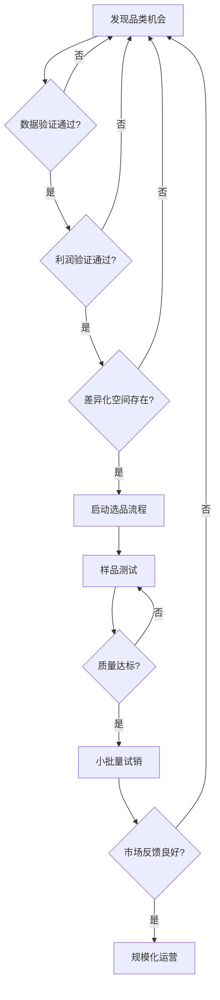
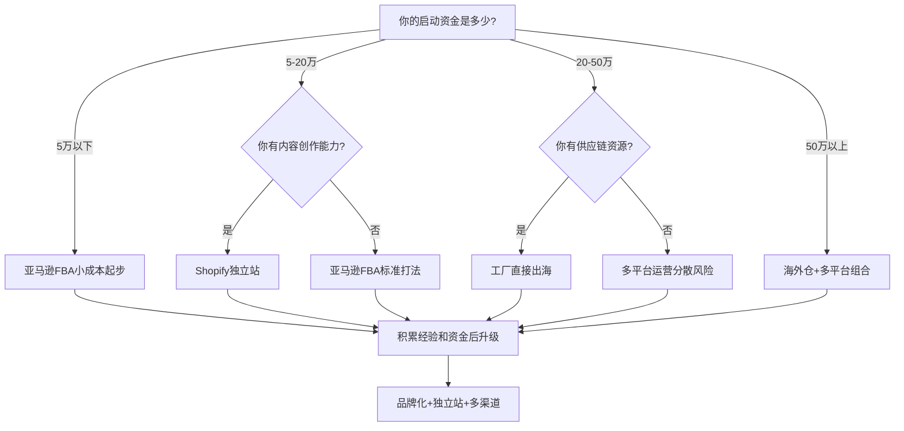

## 四大经典模式总结与核心启示

前四个案例分别展示了跨境电商最常见的四条路径：亚马逊FBA标品打法、Shopify独立站品牌出海、多平台协同运营、海外仓重资产模式。这四种模式并非互相排斥，而是代表了不同资源禀赋、不同风险偏好下的最优选择。本节从这四个案例中提炼共性规律、对比差异、总结可复用的方法论，为后续进阶案例（TikTok Shop爆款、品牌升级、工厂转型）奠定认知基础。

### 四大模式核心对比

| 维度 | 亚马逊FBA（案例一） | Shopify独立站（案例二） | 多平台运营（案例三） | 海外仓模式（案例四） |
|------|---------------------|------------------------|---------------------|---------------------|
| **启动资金** | 5-15万元 | 3-8万元 | 10-30万元 | 30-100万元 |
| **回本周期** | 3-6个月 | 4-8个月 | 6-12个月 | 8-18个月 |
| **核心壁垒** | 选品+Listing优化 | 品牌+内容+私域 | 多平台运营能力 | 供应链+资金+物流 |
| **流量来源** | 平台搜索流量 | 社媒广告+SEO | 各平台自然流量 | 平台流量+B2B |
| **利润率** | 15%-25% | 25%-40% | 10%-20% | 20%-35% |
| **运营复杂度** | ★★★ | ★★★★ | ★★★★★ | ★★★★ |
| **风险等级** | 中 | 中低 | 高 | 高 |
| **规模化天花板** | 中（受平台限制） | 高（品牌溢价） | 高（多渠道分散） | 高（B2B+B2C） |
| **适合人群** | 新手/个人卖家 | 有内容能力的创业者 | 有经验的成熟卖家 | 有资金和供应链资源者 |

### 从四个案例中提炼的六条铁律

#### 铁律一：选品决定生死，运营决定高低

四个案例无一例外都将选品放在了最重要的位置。刘先生的厨房收纳、独立站的瑜伽用品、3C卖家的电子配件、海外仓的大件家居——成功卖家的共同点是在选品阶段就做了充分的数据验证，而非凭直觉拍脑袋。

**选品的三层验证法：**

1. **数据验证**：通过Jungle Scout、Helium 10、Google Trends等工具确认市场容量和竞争强度。月搜索量>10万、竞品平均Review<500、售价在$15-$50区间的品类，新卖家切入的成功率最高。

2. **利润验证**：用完整的成本核算表（采购成本+头程物流+FBA费用+广告费+退货损耗）计算净利润率，低于20%的品类不值得做。很多新手只算采购成本和售价之间的差额，忽略了广告费和退货率，导致实际亏损。

3. **差异化验证**：分析竞品差评（1-3星评价），找到用户抱怨最多的3个问题，确认自己能否在产品层面解决这些问题。如果找不到差异化空间，宁可放弃这个品类。



#### 铁律二：现金流是生命线，不是财务问题

四个案例中最常见的"差点死掉"的原因不是选品失败，而是现金流断裂。跨境电商的资金占用周期极长——从采购到海运到入仓到销售到回款，一个完整周期通常是60-90天。如果再加上备货周期，实际资金占用可能长达4-6个月。

**现金流管理的核心公式：**

```text
安全备货资金 = 月均销售额 × (备货周期月数 + 安全库存月数) × (1 - 净利润率)

示例：
月均销售额 = $30,000
备货周期 = 2个月（含生产+海运）
安全库存 = 1个月
净利润率 = 25%

安全备货资金 = $30,000 × (2 + 1) × (1 - 0.25) = $67,500
```

**四个案例的现金流管理经验汇总：**

| 策略 | 具体做法 | 适用案例 |
|------|----------|----------|
| 预售测款 | 先用少量库存测试市场反应，验证后再大批量采购 | 案例一、三 |
| 账期谈判 | 与供应商谈30-60天账期，减少前期资金占用 | 案例四 |
| 阶梯备货 | 首批备30天销量，验证后逐步增加到60-90天 | 案例一、二 |
| 平台回款加速 | 使用亚马逊贷款、Shopify Capital等平台金融工具 | 案例一、二、三 |
| 多品类分散 | 不把所有资金押在一个品类上，降低单品类滞销风险 | 案例三 |
| 淡旺季规划 | 提前3-4个月为旺季备货，避免临时资金紧张 | 所有案例 |

#### 铁律三：产品差异化是避开价格战的唯一出路

案例一中刘先生面对竞争对手降价时，没有跟进价格战，而是通过改进材质、增加可调节功能、提升包装体验来维持溢价。案例二的独立站品牌更是通过品牌故事和社群运营实现了30%的品牌溢价。

**差异化的五个层次（由浅入深）：**

1. **外观差异化**：改变颜色、形状、包装设计。成本最低，但容易被模仿，护城河最浅。

2. **功能差异化**：在现有产品基础上增加功能或改进使用体验。案例一的可调节置物架就是功能差异化，需要一定的研发投入，但竞品跟进需要时间。

3. **品质差异化**：使用更好的材料、更严格的品控标准。成本较高，但能建立口碑壁垒。适合有供应链优势的卖家。

4. **服务差异化**：提供更好的售前咨询、更快的物流、更完善的售后。案例四的海外仓模式通过本地发货实现了3-5天送达，远超直邮的15-30天。

5. **品牌差异化**：建立品牌故事、用户社群、情感连接。这是最高层次的差异化，护城河最深，但需要最长的时间投入。案例二的独立站品牌就是典型。

#### 铁律四：平台规则是底线，不是天花板

案例三的多平台卖家尤其深刻地体会到了这一点——每个平台的规则不同，违规成本极高（亚马逊封号可能意味着几十万库存滞销）。但合规只是底线，真正的高手是在规则范围内最大化利用平台资源。

**各平台核心规则要点：**

| 平台 | 最常踩的红线 | 隐藏的红利 |
|------|-------------|-----------|
| 亚马逊 | 刷评、变体滥用、知识产权侵权 | Vine计划、Brand Referral Bonus（最高10%返佣） |
| Shopify | 违反支付网关政策、虚假宣传 | Shopify Capital贷款、免费流量工具Kit |
| eBay | 描述不符、延迟发货 | Promoted Listings广告、卖家保护计划 |
| 速卖通 | 低质量产品、虚假物流 | 直通车、联盟营销佣金 |

#### 铁律五：数据驱动决策，而非经验主义

四个案例中，成功卖家的共同特点是建立了完整的数据监控体系。他们不靠"感觉"做决策，而是用数据说话。

**跨境电商核心数据指标体系：**

```text
一级指标（每日必看）
├── 销售额 / 订单量 / 客单价
├── 广告花费 / ACOS / ROAS
└── 库存周转天数

二级指标（每周分析）
├── 转化率 / 跳出率 / 页面停留时间
├── 关键词排名变化
├── 差评率 / 退货率
└── 各SKU利润率

三级指标（每月复盘）
├── 品类市场份额变化
├── 客户获取成本(CAC) / 客户终身价值(LTV)
├── 复购率 / 客户满意度(NPS)
└── 现金流健康度
```

**数据驱动决策的实际操作流程：**

1. **发现问题**：通过数据异常（如转化率突然下降20%）定位问题
2. **假设验证**：列出可能原因（价格、评价、竞品、季节性等），逐个验证
3. **制定方案**：基于验证结果制定优化方案
4. **执行测试**：小范围测试，控制变量
5. **评估效果**：对比测试前后的数据变化
6. **规模化推广**：效果确认后全面推行

#### 铁律六：供应链是长期竞争力的根基

案例四的海外仓模式最依赖供应链能力，但事实上所有模式都需要稳定的供应链支撑。很多卖家在销售端做得很好，却因为供应链问题（质量不稳定、交期延误、起订量过高）而功亏一篑。

**供应链管理的四个关键动作：**

1. **多供应商策略**：核心产品至少有2-3个备选供应商，避免被单一供应商绑架。案例一的刘先生就曾因为主力供应商产能不足而被迫断货两周，损失了大量排名。

2. **QC流程标准化**：建立来料检验、过程抽检、出货全检的三级品控体系。尤其要关注一致性——第一批样品很好、后续批次偷工减料是供应商最常见的问题。

3. **深度绑定核心供应商**：对于销量稳定的主力产品，与供应商签订长期合作协议，换取更优的价格、更短的交期、优先排产权。案例四通过年度框架协议将采购成本降低了12%。

4. **供应链可视化**：使用ERP系统（如马帮、积加、赛盒）实时监控库存、在途货物、生产进度，做到心中有数。

### 不同阶段卖家的模式选择建议



**新手最佳起步路径：**

对于绝大多数新手卖家，最推荐的路径是"亚马逊FBA起步 → 积累经验后拓展独立站 → 最终实现品牌化多渠道运营"。原因如下：

1. **亚马逊提供现成流量**：不需要自己获取流量，降低了运营难度
2. **FBA简化物流**：亚马逊负责仓储和配送，新手只需要专注选品和运营
3. **数据反馈快**：上架后1-2周就能看到市场反应，快速迭代
4. **试错成本可控**：首批投入5-10万元，即使失败也在可承受范围内

### 四个案例的共性成功要素

归纳四个案例，成功卖家在以下五个方面做到了高度一致：

1. **前期调研充分**：每个案例的创始人都在选品阶段花了1-3个月做市场调研，而不是匆忙上架。他们使用数据工具验证需求，分析竞品找到切入点，甚至亲自购买竞品进行拆解研究。

2. **小步快跑验证**：没有人一上来就大批量备货。首批订单通常是500-2000件，用2-4周时间验证市场反应。只有数据确认可行后，才会追加投入。

3. **持续迭代优化**：成功不是一次性的。案例一的刘先生每周优化广告关键词，每月更新产品图片；案例二的品牌卖家每季度推出新品，持续丰富产品线。

4. **风控意识强烈**：他们会为最坏情况做准备——留出6个月的运营资金、为旺季提前3个月备货、为核心产品准备备选供应商。

5. **长期主义心态**：没有人期望一夜暴富。他们接受前6个月可能亏损的现实，把这段时间当作学习和验证期，而非急于求成。

### 从四大模式到进阶之路

掌握了以上四种经典模式的核心规律后，后面的三个案例将展示跨境电商的进阶玩法：

- **案例五（TikTok Shop）**：内容驱动的新流量红利，适合有内容创作能力的卖家
- **案例六（品牌升级）**：从平台卖家到品牌商的跃迁，展示独立站+亚马逊双渠道的协同效应
- **案例七（工厂转型）**：Temu等新平台如何帮助传统工厂直接触达海外消费者

这三个进阶案例并非独立于四大模式之外，而是在经典模式基础上的进化。理解了基础模式的底层逻辑，才能更好地理解进阶玩法的创新之处。

> **本节核心启示：跨境电商没有"最好的模式"，只有"最适合你的模式"。选择模式时，评估自己的资金、能力、资源三个维度，找到匹配度最高的路径。起步后，牢记六条铁律——选品为王、现金流为命、差异化为盾、合规为底、数据为眼、供应链为根——然后坚持执行，持续优化。**

***
