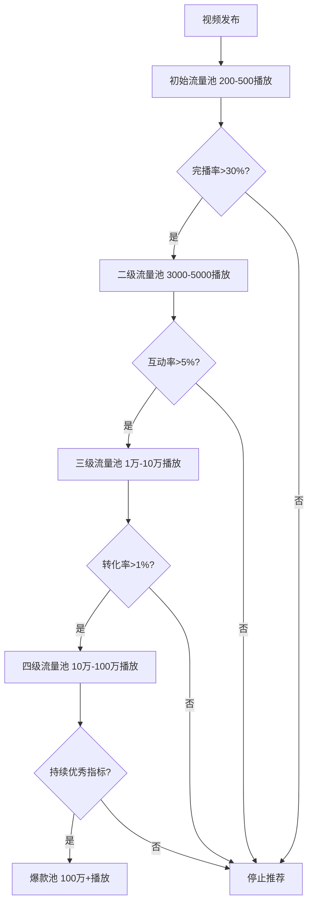

## 案例五：TikTok Shop爆款打造实录

### 一、背景介绍

陈先生，27岁，短视频内容创作者，2023年入驻TikTok Shop，专注于创意家居小物件。通过短视频内容驱动销售，3个月内打造出多个爆款产品，单品月销超过10万件，月销售额突破50万美元。

**个人背景：**
- 大学专业：数字媒体艺术
- 工作经历：2年MCN机构短视频编导经验
- 语言能力：英语CET-6，能进行基础英文脚本撰写
- 初始资金：约5万元人民币（个人积蓄）

**选择TikTok Shop的原因：**

陈先生在MCN工作期间发现一个关键趋势：传统电商平台（亚马逊、速卖通）的流量成本持续攀升，新卖家获客成本已超过$15/单。而TikTok Shop作为"兴趣电商"模式，用户从"发现"到"购买"的路径被大幅缩短——用户刷到视频后，只需点击购物车即可完成购买，无需跳转外部平台。

与传统搜索电商不同，TikTok Shop的核心逻辑是"货找人"而非"人找货"。平台通过算法将商品推荐给可能感兴趣的用户，这意味着即使没有粉丝基础，一条优质视频也能获得百万级曝光。这种去中心化的流量分配机制，为新卖家提供了弯道超车的机会。

### 二、TikTok Shop平台机制深度解析

#### 2.1 平台定位与用户画像

TikTok Shop是TikTok官方推出的电商平台，目前主要覆盖美国、英国、东南亚（印尼、泰国、越南、菲律宾、马来西亚）等市场。平台定位"兴趣电商"，核心用户画像如下：

| 用户群体 | 年龄分布 | 消费特点 | 偏好品类 |
|----------|----------|----------|----------|
| Z世代 | 18-24岁 | 冲动消费、追求新奇 | 美妆、服饰、创意小物 |
| 千禧一代 | 25-34岁 | 注重性价比、易被种草 | 家居、3C、厨房用品 |
| 年轻父母 | 28-38岁 | 关注实用性、安全 | 母婴、家居、清洁 |

美国市场的客单价平均在$15-$35之间，东南亚市场在$5-$15之间。陈先生选择美国市场，原因是客单价更高，物流体系更成熟，且消费者对创意家居产品的接受度较高。

#### 2.2 算法推荐机制

TikTok的推荐算法是其核心竞争力，理解算法逻辑是打造爆款的前提：

**关键指标权重（经验估算）：**
- 完播率：40%（用户是否看完整个视频）
- 互动率：30%（点赞、评论、分享、收藏）
- 转化率：20%（点击购物车、下单）
- 账号权重：10%（历史表现、粉丝量）

这意味着一个视频能否成为爆款，首要因素是"用户是否愿意看完"，其次才是"用户是否愿意互动"。陈先生的策略是优先优化完播率，通过强视觉冲击的前3秒吸引用户停留。

#### 2.3 TikTok Shop与传统电商的差异

| 维度 | TikTok Shop | 亚马逊 | 速卖通 |
|------|-------------|--------|--------|
| 流量来源 | 算法推荐 | 搜索+广告 | 搜索+广告 |
| 用户意图 | 被动发现 | 主动搜索 | 主动搜索 |
| 内容形式 | 短视频/直播 | 图文/详情页 | 图文/详情页 |
| 获客成本 | 低（内容驱动） | 高（广告驱动） | 中等 |
| 转化路径 | 视频→购物车→下单 | 搜索→详情页→下单 | 搜索→详情页→下单 |
| 适合品类 | 视觉冲击强、新奇特 | 标品、刚需品 | 标品、价格敏感型 |
| 启动资金 | 低（5-10万） | 高（20-50万） | 中等（10-20万） |
| 运营难度 | 内容创作能力 | 供应链+广告优化 | 供应链+价格竞争 |

### 三、选品策略：TikTok爆款的底层逻辑

#### 3.1 TikTok选品的四大原则

**原则一：视觉冲击力**

TikTok是视觉优先的平台，产品必须在3秒内抓住用户注意力。这意味着产品需要具备"可拍性"——能通过短视频直观展示其特点或功能。

陈先生总结的视觉冲击力评估框架：
- **对比感**：产品使用前后有明显对比（如清洁剂去污效果）
- **意外感**：产品功能超出预期（如可折叠的家具）
- **美感**：产品本身具有视觉吸引力（如渐变色餐具）
- **过程感**：产品使用过程具有观赏性（如解压玩具）

**原则二：新奇特**

TikTok用户习惯在平台上"发现"新事物，因此产品需要具备新鲜感。陈先生会定期浏览以下渠道寻找灵感：
- TikTok Creative Center（官方热门产品趋势）
- #TikTokMadeMeBuyIt 话题（累计播放超过800亿次）
- #TikTokFinds 话题
- #AmazonFinds 话题（交叉参考）

**原则三：价格友好**

TikTok用户的消费决策周期短，但对价格敏感。陈先生的产品定价区间分析：

| 价格区间 | 转化率 | 退货率 | 适合品类 |
|----------|--------|--------|----------|
| $5-$10 | 3.5% | 5% | 小配件、消耗品 |
| $10-$20 | 2.8% | 8% | 创意家居、美妆工具 |
| $20-$35 | 1.5% | 12% | 厨房电器、家居装饰 |
| $35+ | 0.8% | 15% | 高价值商品（需直播转化） |

陈先生最终选择$10-$20区间作为主力价格带，平衡转化率和利润率。

**原则四：易于展示**

产品功能需要能通过短视频直观展示，不需要复杂的文字说明。陈先生的评估方法：如果一个产品的核心卖点能在10秒内通过视频说清楚，就值得尝试；如果需要30秒以上才能解释清楚，就放弃。

#### 3.2 选品渠道与方法

**渠道一：TikTok Creative Center**

这是TikTok官方提供的创意趋势分析工具，可以查看：
- 热门产品趋势（按品类、地区筛选）
- 热门音乐和话题
- 竞品视频分析

访问地址：https://ads.tiktok.com/business/creativecenter/

**渠道二：1688跨境专供**

在1688搜索"TikTok同款"或"TikTok爆款"，可以找到大量供应链资源。陈先生的筛选标准：
- 工厂直供（非中间商）
- 支持小批量起订（50-100件）
- 能提供产品视频素材
- 支持定制包装

**渠道三：竞品平台交叉参考**

陈先生会同时查看Temu、亚马逊畅销榜、SHEIN等平台，寻找在其他平台已经验证过的产品。逻辑是：如果一个产品在亚马逊已经卖爆，说明需求存在；如果这个产品视觉冲击力强、易于展示，就适合在TikTok Shop上销售。

**渠道四：海外社交媒体监听**

除了TikTok，陈先生还会关注Instagram Reels、YouTube Shorts上的热门产品视频，以及Reddit上的"what is this product"类帖子，寻找用户需求痛点。

#### 3.3 成功选品案例：可折叠硅胶碗

**发现过程：**

陈先生在刷TikTok时看到一条海外博主分享便携餐具的视频，播放量超过500万。他注意到评论区有大量用户询问"where to buy"，但博主并没有挂购物链接。这是一个明确的市场信号——需求存在，但供给不足。

**产品评估：**

| 评估维度 | 评分（1-10） | 说明 |
|----------|-------------|------|
| 视觉冲击力 | 9 | 可折叠设计，展开过程有视觉张力 |
| 新奇特 | 8 | 市场上同类产品较少 |
| 价格友好 | 9 | 定价$12.99，低于用户心理阈值 |
| 易于展示 | 10 | 10秒内可展示折叠/展开全过程 |
| 利润空间 | 8 | 采购成本¥8，利润率约55% |
| 物流友好 | 7 | 体积小、重量轻，但需注意食品级认证 |

**供应链搭建：**

陈先生在1688找到3家供应商，分别打样对比：
- 供应商A：价格最低（¥6/个），但材质偏硬，折叠手感差
- 供应商B：价格中等（¥8/个），材质柔软，颜色丰富
- 供应商C：价格最高（¥12/个），食品级认证齐全，但起订量500个

最终选择供应商B，原因：
1. 质量与价格平衡
2. 支持100个起订（降低试错成本）
3. 能提供FDA食品级认证文件
4. 支持定制包装（印logo）

### 四、内容创作策略：从0到爆款的方法论

#### 4.1 视频类型矩阵

陈先生将视频内容分为五类，每类承担不同的营销目标：

| 视频类型 | 目的 | 发布频率 | 时长 | 核心指标 |
|----------|------|----------|------|----------|
| 产品展示 | 直接卖货 | 每日1-2条 | 15-30秒 | 转化率 |
| 使用场景 | 激发需求 | 每周3-4条 | 20-40秒 | 完播率 |
| 开箱视频 | 建立信任 | 每周1-2条 | 30-60秒 | 互动率 |
| 对比测试 | 突出优势 | 每周1条 | 20-30秒 | 分享率 |
| 用户反馈 | 社交证明 | 每周2-3条 | 10-20秒 | 评论数 |

**月均发布量：60-80条**

这个发布频率是陈先生经过测试得出的最优值。发布太少，算法给予的初始流量池不够；发布太多，内容质量会下降。他采用"矩阵账号"策略——主账号+3个辅助账号，主账号发高质量内容，辅助账号发测试性内容，验证哪些视频风格效果好后再放到主账号。

#### 4.2 爆款视频公式

陈先生总结的"黄金30秒"公式：

**前3秒——Hook（钩子）**

前3秒决定用户是否继续观看。陈先生测试过的高效Hook类型：
- **悬念型**："You're still using THAT?"（制造好奇）
- **对比型**："This $12 product replaced my $80 one"（价格冲击）
- **问题型**："Tired of your kitchen looking like this?"（痛点共鸣）
- **视觉冲击型**：直接展示产品惊艳效果（无需文字）

测试数据显示，悬念型Hook的完播率最高（38%），但转化率最低（1.2%）；视觉冲击型Hook的完播率中等（32%），但转化率最高（3.5%）。陈先生最终以视觉冲击型为主，悬念型为辅。

**3-10秒——核心卖点展示**

用最直观的方式展示产品核心功能或痛点解决方案。例如：
- 可折叠硅胶碗：展示从折叠状态到展开的全过程
- 清洁剂：展示喷在污渍上3秒后擦拭干净
- 厨房工具：展示切菜效率提升3倍

**10-20秒——效果展示与社会证明**

展示使用效果，或叠加用户好评截图。这一阶段的目标是建立信任感。

**最后5秒——CTA（行动号召）**

明确告诉用户下一步行动："Click the yellow basket"（点击黄色购物车）。陈先生测试发现，直接口头引导比文字提示的转化率高40%。

#### 4.3 达人合作体系

陈先生建立了三层达人合作体系：

**第一阶段：种子达人（1K-10K粉丝）**
- 合作方式：免费寄样
- 目标：获取真实用户评价视频，积累素材库
- 寄样数量：每周20-30个产品
- 成本：产品成本+运费（约¥50/个）
- 回收率：约60%的达人会发布视频

**第二阶段：腰部达人（10K-100K粉丝）**
- 合作方式：纯佣金合作（CPS）
- 佣金比例：15%-25%
- 目标：扩大产品曝光，获取精准流量
- 合作数量：每月10-15位

**第三阶段：头部达人（100K+粉丝）**
- 合作方式：付费合作+佣金
- 费用：$200-$1000/条视频 + 10%佣金
- 目标：打造现象级爆款
- 合作数量：每月2-3位

**达人筛选标准：**
- 粉丝互动率>3%（低于此值可能是僵尸粉）
- 近30天视频平均播放量>粉丝数的10%
- 内容风格与产品调性匹配
- 历史合作品牌的视频效果

**达人管理工具：**
陈先生使用TikTok Shop官方的"Affiliate Center"管理达人合作，可以：
- 批量邀请达人
- 设置不同佣金比例
- 追踪达人带货数据
- 自动结算佣金

### 五、运营数据与财务分析

#### 5.1 核心运营数据

| 指标 | 数据 | 行业对比 |
|------|------|----------|
| 月均视频发布 | 60-80条 | 行业平均30-40条 |
| 平均播放量 | 5万-50万 | 行业平均1万-5万 |
| 爆款视频播放量 | 500万+ | 行业平均50万 |
| 视频转化率 | 1.5%-3% | 行业平均0.5%-1% |
| 达人合作数量 | 每月20-30位 | 行业平均10-15位 |
| 退货率 | 约8% | 行业平均12%-15% |
| 客户复购率 | 15% | 行业平均8% |

#### 5.2 单品财务模型（以可折叠硅胶碗为例）

| 项目 | 金额 | 占比 |
|------|------|------|
| 售价 | $12.99 | 100% |
| 采购成本 | $1.10（¥8） | 8.5% |
| 国际物流 | $1.50 | 11.5% |
| 平台佣金（8%） | $1.04 | 8.0% |
| 支付手续费（2.9%） | $0.38 | 2.9% |
| 广告投放 | $1.30 | 10.0% |
| 达人佣金（15%） | $1.95 | 15.0% |
| 退货损失（8%退货率） | $1.04 | 8.0% |
| **净利润** | **$4.68** | **36.1%** |

月销10万件时，单品月净利润约$46.8万（约¥340万）。

#### 5.3 月度财务汇总（第3个月数据）

| 项目 | 金额 |
|------|------|
| 总销售额 | $512,000 |
| 产品成本 | $43,500 |
| 物流成本 | $76,800 |
| 平台费用 | $40,960 |
| 广告投放 | $51,200 |
| 达人佣金 | $76,800 |
| 退货损失 | $40,960 |
| 其他费用（包装、仓储） | $15,000 |
| **净利润** | **$166,780** |
| **净利润率** | **32.6%** |

### 六、关键挑战与解决方案

#### 6.1 挑战一：内容创作瓶颈

**问题描述：** 入驻第2个月，视频播放量从平均10万下降到平均5000，团队陷入"不知道拍什么"的困境。

**根本原因：** 内容同质化严重，用户审美疲劳。

**解决方案：**
1. 建立"内容素材库"，收集100+条竞品爆款视频，分析其共同特征
2. 引入"用户生成内容（UGC）"策略，鼓励买家拍摄使用视频
3. 尝试新内容形式：ASMR开箱、第一人称视角、对比实验
4. 每周进行"内容复盘"，分析数据找出高效内容类型

**效果：** 视频平均播放量在2周内恢复到8万，第3周突破20万。

#### 6.2 挑战二：供应链断裂

**问题描述：** 爆款产品突然日销3000件，但供应商库存不足，需要15天才能补货。

**根本原因：** 没有建立安全库存机制，过度依赖单一供应商。

**解决方案：**
1. 建立"安全库存"机制：爆款产品保持30天销量的库存
2. 开发2-3家备选供应商，避免单一供应商依赖
3. 与供应商签订"优先供货协议"，支付10%定金锁定产能
4. 使用海外仓（美国本土仓），将补货周期从15天缩短到3天

**效果：** 后续未再出现断货情况，库存周转率保持在30天以内。

#### 6.3 挑战三：差评危机

**问题描述：** 一批产品质量问题导致30条差评，店铺评分从4.8下降到4.2，流量明显下降。

**根本原因：** 供应商更换了原材料，质量下降。

**解决方案：**
1. 立即下架问题批次产品
2. 主动联系差评客户，提供全额退款+补发新品
3. 与供应商重新签订质量协议，明确原材料标准
4. 建立"入库质检"流程，每批产品抽检10%
5. 发布"质量改进声明"视频，展示质检流程

**效果：** 2周内店铺评分恢复到4.6，3周后恢复到4.8。

#### 6.4 挑战四：平台政策变化

**问题描述：** TikTok Shop调整佣金政策，部分类目佣金从5%上调到8%，压缩利润空间。

**解决方案：**
1. 优化供应链，将采购成本降低10%
2. 提高客单价，通过产品组合销售提升平均订单金额
3. 减少低效广告投放，优化ROI
4. 拓展高毛利品类，平衡整体利润率

**效果：** 调整后净利润率从36%下降到32.6%，仍在可接受范围内。

### 七、从0到50万的里程碑时间线

| 时间节点 | 关键事件 | 月销售额 |
|----------|----------|----------|
| 第1周 | 注册TikTok Shop，完成店铺装修 | $0 |
| 第2周 | 上架首批5个产品，发布第一条视频 | $200 |
| 第3周 | 第一条视频突破10万播放 | $1,500 |
| 第1个月 | 累计发布60条视频，找到第一个潜力品 | $8,000 |
| 第6周 | 第一条爆款视频（200万播放），日销突破100单 | $25,000 |
| 第2个月 | 与10位达人建立合作，产品线扩展到15个SKU | $85,000 |
| 第10周 | 爆款视频突破500万播放，日销突破1000单 | $180,000 |
| 第3个月 | 建立完整达人矩阵，月销突破50万 | $512,000 |

### 八、TikTok Shop运营工具箱

#### 8.1 必备工具清单

| 工具类别 | 工具名称 | 用途 | 费用 |
|----------|----------|------|------|
| 数据分析 | TikTok Creative Center | 热门趋势分析 | 免费 |
| 数据分析 | Kalodata | TikTok Shop销售数据 | $39/月 |
| 视频创作 | CapCut（剪映国际版） | 视频剪辑 | 免费 |
| 视频创作 | Canva | 封面设计 | 免费/付费 |
| 供应链 | 1688跨境专供 | 寻找供应商 | 免费 |
| 物流 | 云途物流 | 国际小包 | 按重量计费 |
| 仓储 | 万邑通海外仓 | 美国本土仓储 | 按件计费 |
| 客服 | Gorgias | 多渠道客服管理 | $60/月 |

#### 8.2 视频拍摄设备推荐

陈先生的设备清单（总投入约¥5000）：
- 手机：iPhone 14 Pro（主摄）
- 稳定器：DJI OM 6（防抖）
- 补光灯：环形补光灯（18寸）
- 收音：无线领夹麦克风
- 背景：白色/灰色背景布+简易摄影棚

### 九、可复制的方法论总结

#### 9.1 TikTok Shop爆款打造五步法

**第一步：选品（1-2周）**
1. 浏览TikTok Creative Center，筛选热门品类
2. 在1688找到3-5家供应商，打样对比
3. 用"四原则"评估产品可行性
4. 小批量试单（50-100个），测试市场反应

**第二步：内容测试（2-4周）**
1. 为每个产品拍摄5-10条不同风格的视频
2. 发布后观察数据，找出高效内容类型
3. 总结爆款视频的共同特征
4. 建立"内容模板"，提高生产效率

**第三步：达人合作（持续进行）**
1. 通过Affiliate Center批量邀请达人
2. 免费寄样给种子达人，获取真实评价
3. 与表现优秀的达人建立长期合作
4. 定期分析达人带货数据，优化合作策略

**第四步：规模放大（1-2个月）**
1. 爆款产品加大备货，开通海外仓
2. 增加广告投放，放大流量
3. 拓展产品线，打造关联销售
4. 建立客服团队，提升用户体验

**第五步：品牌沉淀（3-6个月）**
1. 注册品牌商标，建立品牌认知
2. 开发独家产品，形成竞争壁垒
3. 搭建私域流量（邮件列表、社媒粉丝）
4. 考虑拓展到独立站或其他平台

#### 9.2 常见误区与纠正

| 误区 | 正确做法 |
|------|----------|
| 盲目追求粉丝数量 | 关注转化率，1000精准粉丝>10万泛粉 |
| 一条视频打天下 | 多条视频测试，用数据说话 |
| 价格越低越好 | 合理定价，保证利润空间 |
| 忽视售后 | 快速响应差评，维护店铺评分 |
| 依赖单一爆款 | 产品矩阵，降低风险 |
| 忽视平台规则 | 定期学习TikTok Shop政策更新 |

### 十、进阶策略：从卖家到品牌

#### 10.1 品牌化路径

陈先生在第6个月开始品牌化转型：
1. 注册美国商标（通过马德里体系，费用约¥8000）
2. 设计品牌VI（logo、包装、色彩体系）
3. 开发独家产品（与供应商合作开模）
4. 建立品牌独立站（Shopify），沉淀私域流量

#### 10.2 多平台布局

在TikTok Shop稳定后，陈先生开始拓展其他渠道：
- **亚马逊**：将TikTok爆款产品上架亚马逊，利用TikTok流量带动亚马逊排名
- **独立站**：通过TikTok广告引流到独立站，提升利润率
- **线下渠道**：与美国本土零售商洽谈入驻

#### 10.3 团队搭建

第4个月，陈先生开始组建团队：
- 视频拍摄/剪辑：2人（负责内容生产）
- 达人对接：1人（负责达人合作管理）
- 客服：1人（负责售后处理）
- 供应链：1人（负责采购和物流）

团队月成本约¥5万，但人效提升3倍以上。

### 十一、关键成功因素深度分析

1. **内容为王，但数据驱动**：不是凭感觉拍视频，而是通过数据测试找到高效内容类型，再批量复制。陈先生的"内容模板"方法论，将爆款率从5%提升到15%。

2. **选品精准，四原则缺一不可**：视觉冲击力、新奇特、价格友好、易于展示——四个维度必须同时满足，否则即使视频火了也难以转化。

3. **达人矩阵，分层运营**：不是找一个大达人就能解决问题，而是建立"种子→腰部→头部"的金字塔结构，每个层级承担不同功能。

4. **快速迭代，小步快跑**：TikTok的算法变化快，用户喜好变化也快。陈先生每周都会调整策略，而不是一套打法用到底。

5. **供应链响应，决定天花板**：爆款出现时，谁能更快补货谁就能吃到红利。陈先生与供应商建立的"优先供货协议"，是其持续增长的关键保障。

6. **合规经营，长期主义**：严格遵守TikTok Shop政策，产品质量符合美国FDA标准，避免因违规导致店铺被封。

***

