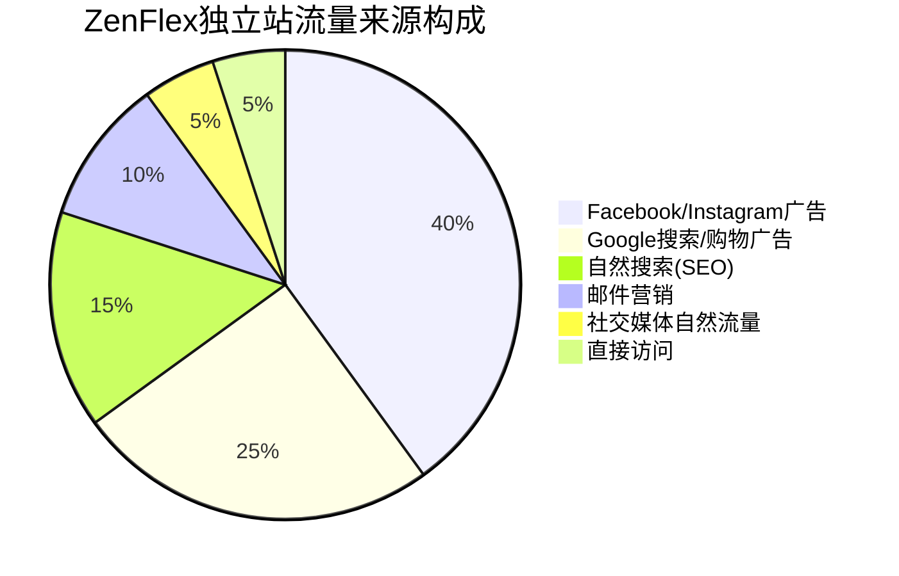
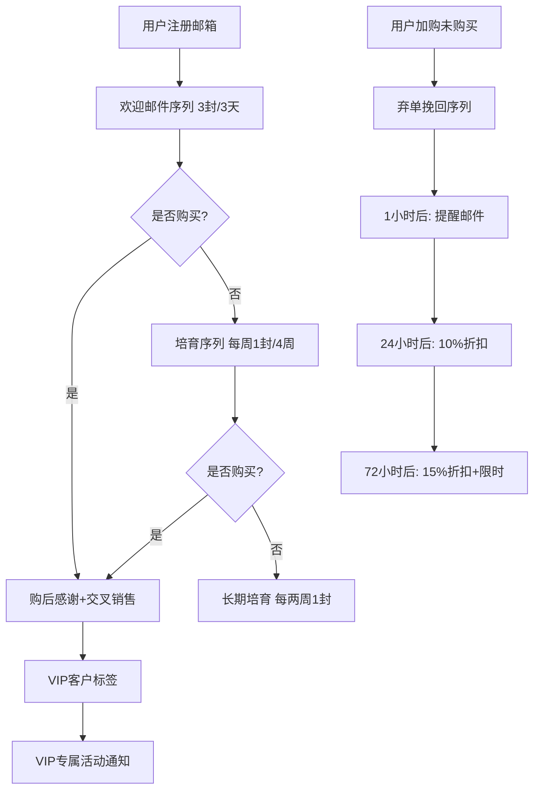
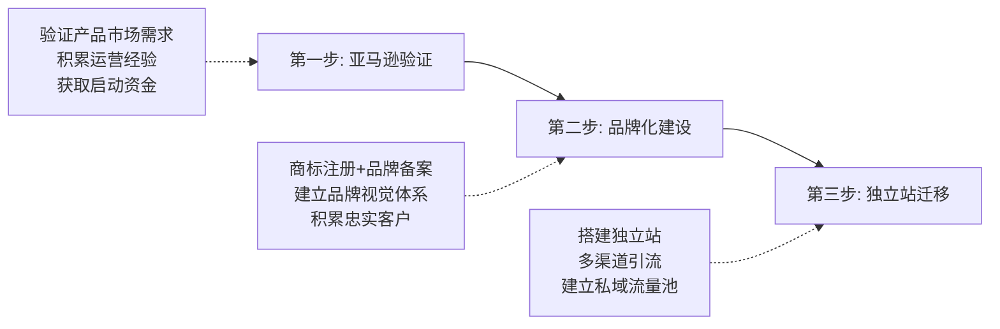

## 案例六：从亚马逊到独立站的品牌升级之路

### 背景与人物

赵女士，33岁，2012年毕业于广州美术学院视觉传达专业，先后在4A广告公司和电商品牌公司担任品牌设计师。2019年辞职创业，在亚马逊美国站开设瑜伽用品店铺，品牌名"ZenFlex"。经过3年深耕，亚马逊月销售额稳定在20万美元。

然而，赵女士始终感受到"平台寄人篱下"的不安——亚马逊随时可能调整算法、提高佣金、甚至封号。2022年初，她决定启动独立站项目，目标是将ZenFlex从一个"亚马逊卖家"升级为一个真正的"全球化DTC品牌"。

**创业前的行业背景分析：**

| 维度 | 2019年赵女士入局时 | 2022年启动独立站时 |
|------|-------------------|-------------------|
| 亚马逊瑜伽用品市场规模 | 约12亿美元 | 约18亿美元 |
| 亚马逊卖家平均利润率 | 25%-35% | 15%-25% |
| 广告CPC均价 | $0.8-$1.5 | $1.5-$3.0 |
| 独立站建站成本 | Shopify基础版$29/月 | Shopify基础版$39/月 |
| Facebook广告CPM | $8-$12 | $15-$25 |

利润率下降和广告成本上升，正是推动赵女士"出走"亚马逊的核心驱动力。

### 第一阶段：亚马逊品牌备案与品牌资产积累（2020年）

在启动独立站之前，赵女士先在亚马逊体系内完成品牌化建设，为后续独立站迁移打下基础。

#### 注册美国商标

赵女士通过美国专利商标局（USPTO）注册了"ZenFlex"商标，覆盖第28类（运动器材）和第25类（运动服装）。

**商标注册流程：**

1. **商标检索**：使用USPTO的TESS系统检索，确认"ZenFlex"未被注册
2. **选择申请基础**：基于"已在商业中使用"（1a）提交申请，因为产品已在亚马逊销售
3. **提交申请**：通过USPTO在线系统TEAS Plus提交，官费$250/类
4. **审查阶段**：约4-6个月，USPTO审查员审查商标的可注册性
5. **公告期**：审查通过后进入30天公告期，无异议则注册成功
6. **总耗时**：约8-12个月，总费用约$800-$1200（含代理费）

**关键提示**：商标注册是品牌备案的前提，建议在亚马逊店铺运营稳定后尽早启动。商标注册期间可以先用"TM"标志，注册完成后使用"®"标志。

#### 完成亚马逊品牌备案

商标注册完成后，赵女士在Amazon Brand Registry完成品牌备案，获得以下特权：

- **A+内容（Enhanced Brand Content）**：在产品详情页添加图文混排的品牌故事，转化率提升约10%
- **品牌旗舰店（Brand Store）**：搭建多页面品牌旗舰店，类似独立站的购物体验
- **品牌分析（Brand Analytics）**：查看搜索词报告、市场篮子分析、人口统计数据
- **品牌保护**：自动监控侵权行为，一键举报跟卖
- **Vine计划**：通过Amazon Vine获取早期高质量评论

**A+页面设计要点（赵女士的实际经验）：**

| 模块 | 内容 | 效果 |
|------|------|------|
| 品牌故事横幅 | 品牌理念+创始人故事 | 建立情感连接 |
| 产品对比表 | 与竞品的功能对比 | 突出差异化优势 |
| 使用场景展示 | 瑜伽馆、家庭、户外 | 拓展使用想象 |
| 材质工艺详解 | 环保材料、防滑技术 | 建立品质信任 |
| 用户评价展示 | 精选真实好评截图 | 社交证明强化 |

A+页面上线后，该产品的转化率从12%提升到16%，月销售额增长约$25,000。

#### 品牌视觉体系搭建

赵设计师的专业背景在此发挥了巨大优势。她为ZenFlex建立了完整的品牌视觉体系：

- **品牌色**：主色深靛蓝（#1A2B5F）+ 辅色薄荷绿（#4ECDC4），传达专业与活力
- **品牌字体**：标题用 Montserrat Bold，正文用 Open Sans，兼顾专业感与可读性
- **产品摄影**：统一采用白底+自然光拍摄，场景图使用瑜伽馆和自然环境
- **包装设计**：采用可降解材料，印有品牌Logo和环保标识，开箱体验设计为"仪式感"

这套视觉体系后来直接复用到独立站，保证了品牌一致性。

### 第二阶段：独立站冷启动（2022年Q1-Q2）

#### 为什么选择Shopify而非其他平台

赵女士对比了主流建站方案后选择Shopify：

| 方案 | 月费 | 技术门槛 | 生态完善度 | 适合阶段 |
|------|------|---------|-----------|---------|
| Shopify | $39-$399 | 低 | ★★★★★ | 全阶段 |
| WooCommerce | 免费（需主机$10-$50/月） | 高 | ★★★★ | 有技术团队 |
| BigCommerce | $39-$399 | 中 | ★★★★ | 中大型卖家 |
| Magento | 免费（需服务器） | 很高 | ★★★★★ | 大型企业 |
| Squarespace | $33-$65 | 低 | ★★★ | 品牌展示为主 |

**选择Shopify的核心理由：**
- 丰富的瑜伽/运动品牌主题（最终选择"Debutify"主题）
- 与Facebook/Google广告平台深度集成
- 强大的App生态（邮件营销、SEO、评论管理）
- Shopify Payments支持主流信用卡和PayPal
- 无需技术背景即可运营

#### 独立站搭建实操

**Step 1：域名与主机**

赵女士注册了 `zenflex.com` 域名（$12/年），通过Shopify自带托管，无需额外购买主机。

**Step 2：主题定制与页面搭建**

基于Debutify主题，赵女士搭建了以下核心页面：

| 页面 | 核心功能 | 设计要点 |
|------|---------|---------|
| 首页 | 品牌展示+产品推荐 | Hero视频+精选产品+品牌故事 |
| 产品集合页 | 分类浏览 | 筛选器+排序+快速预览 |
| 产品详情页 | 转化成交 | 大图轮播+视频+评价+FAQ |
| 品牌故事页 | 信任建设 | 创始人故事+品牌理念+工厂实拍 |
| 博客页 | SEO+内容营销 | 瑜伽教程+产品使用指南 |
| 联系我们 | 客服支持 | 在线表单+邮箱+FAQ |

**Step 3：支付与物流配置**

- **支付**：Shopify Payments（信用卡）+ PayPal + Apple Pay + Google Pay
- **物流**：与ShipBob合作，在美西（洛杉矶）和美东（新泽西）各设一个前置仓
- **退货**：提供30天无理由退货，退货地址设在美国境内仓库

**Step 4：核心App安装**

| App名称 | 功能 | 月费 |
|---------|------|------|
| Klaviyo | 邮件营销+SMS | $20起步 |
| Yotpo | 评论管理+UGC | 免费起步 |
| ReConvert | 追加销售+交叉销售 | $7.99 |
| SEO Manager | SEO优化 | $20 |
| Gorgias | 客服管理 | $10/月起 |

#### 从亚马逊导流到独立站

冷启动阶段最大的挑战是"零流量"。赵女士采用了以下策略从亚马逊向独立站导流：

**1. 包裹插卡（Insert Card）**

在亚马逊发货的每个包裹中放入品牌卡片：
- 正面：品牌Logo + "Thank you for choosing ZenFlex"
- 背面：QR码链接到独立站 + "扫码领取独家瑜伽指南 + 15%折扣码"
- 转化率：约5%的亚马逊客户会访问独立站，其中15%最终下单

**2. 品牌旗舰店引流**

在亚马逊Brand Store的"关于我们"页面加入独立站链接（注意：不能直接放URL，但可以引导用户搜索品牌名）。

**3. 社交媒体预热**

在Instagram和Facebook发布品牌内容，引导用户访问独立站：
- 每周发布3-5条瑜伽教程短视频
- 发布产品使用场景照片
- 分享用户UGC内容
- 在Bio中放置独立站链接

**4. 邮件列表建设**

通过独立站的弹窗（Popup）收集邮箱：
- 弹窗触发：用户浏览15秒或滚动50%后弹出
- 优惠内容：首次下单10%折扣 + 免费瑜伽指南PDF
- 3个月内收集到8,000个邮箱地址

### 第三阶段：独立站增长引擎搭建（2022年Q3-2023年）

#### 流量获取全景

经过一年多的运营，独立站月销售额从0增长到15万美元。流量来源构成如下：



#### Facebook/Instagram广告深度策略

Facebook广告是最大的流量来源，也是赵女士投入精力最多的渠道。

**广告账户结构：**

```text
广告账户
├── 测试系列（Testing Campaign）
│   ├── 兴趣定位测试组
│   ├── Lookalike测试组
│   └── 创意测试组
├── 扩展系列（Scaling Campaign）
│   ├── 表现最佳的兴趣组
│   └── 表现最佳的Lookalike组
├── 再营销系列（Retargeting Campaign）
│   ├── 网站访问者（7天）
│   ├── 加购未购买（14天）
│   └── 老客户交叉销售（30天）
└── 品牌系列（Brand Awareness）
    ├── 视频观看优化
    └── 触达优化
```

**各阶段广告策略详解：**

**冷启动期（第1-3个月）：日预算$50**

| 策略 | 目标受众 | 素材类型 | 预期CPM | 预期CTR |
|------|---------|---------|---------|---------|
| 兴趣定位 | 瑜伽爱好者、健身人群 | 产品展示视频 | $12-$18 | 1.5%-2.5% |
| 竞品受众 | 关注Lululemon、Manduka的人群 | 对比评测图文 | $15-$20 | 1.2%-2.0% |
| Lookalike 1% | 基于亚马逊客户邮箱 | 用户好评截图 | $10-$15 | 2.0%-3.0% |

**扩展期（第4-8个月）：日预算$200**

- 将测试期表现最佳的3-5个受众组合扩展
- Lookalike受众从1%扩展到3%-5%
- 加入动态产品广告（DPA），自动展示用户浏览过的产品
- 开始测试Reels广告格式

**成熟期（第9个月+）：日预算$500+**

- 全面再营销覆盖：网站访客、加购用户、邮件订阅者、老客户
- 使用Advantage+ Shopping Campaign（ASC）自动优化
- 广告素材每周更新，保持新鲜度
- 目标ROAS > 4.0

**广告素材测试方法论：**

赵女士每周测试3-5组新素材，采用"3x3测试法"：

1. **3种创意类型**：产品展示视频、用户UGC、品牌故事
2. **3种文案角度**：功能利益、情感利益、社会认同
3. **3种行动号召**：限时折扣、免费赠品、限量抢购

每组测试预算$20-$30，运行3天后根据CPA（单次获客成本）决定是否加预算。

#### Google广告策略

Google广告是第二大流量来源，主要覆盖有明确购买意向的用户。

**搜索广告：**

| 关键词类型 | 示例 | 出价策略 | 预期CPC |
|-----------|------|---------|---------|
| 品牌词 | "ZenFlex yoga mat" | 最大化转化 | $0.3-$0.5 |
| 竞品词 | "Lululemon yoga mat alternative" | 目标ROAS | $1.5-$2.5 |
| 通用词 | "best non-slip yoga mat" | 目标ROAS | $2.0-$3.5 |
| 长尾词 | "eco-friendly yoga mat for hot yoga" | 最大化点击 | $0.8-$1.5 |

**购物广告（Google Shopping）：**

- 使用Shopify的Google渠道自动同步产品Feed
- 优化产品标题：品牌名 + 核心关键词 + 材质 + 颜色 + 尺寸
- 产品图片使用白底高清图，符合Google Merchant Center规范
- 设置补充Feed，添加自定义标签区分产品系列

**Performance Max广告：**

2023年起，赵女士将部分预算转移到Performance Max广告，利用Google的AI自动优化跨渠道投放（搜索、购物、展示、视频、发现），ROAS达到3.5-4.2。

#### SEO策略

SEO是长期免费流量的来源，赵女士在独立站上线之初就开始布局。

**技术SEO：**

- 使用Shopify内置SEO功能，自动生成sitemap.xml和robots.txt
- 安装SEO Manager App，优化每个页面的Title和Meta Description
- 确保网站加载速度在3秒以内（使用TinyPNG压缩图片、启用Lazy Loading）
- 实现HTTPS全站加密
- 设置301重定向处理URL变更

**内容SEO：**

赵女士在独立站博客上持续发布高质量内容：

| 文章类型 | 发布频率 | 字数 | 目标关键词 |
|---------|---------|------|-----------|
| 瑜伽教程 | 每周1篇 | 2000-3000字 | "yoga for beginners"、"yoga poses for back pain" |
| 产品评测 | 每两周1篇 | 1500-2500字 | "best yoga mat 2023"、"non-slip yoga mat review" |
| 选购指南 | 每月1篇 | 3000-5000字 | "how to choose yoga mat"、"yoga mat thickness guide" |
| 品牌故事 | 每月1篇 | 1000-2000字 | 品牌相关长尾词 |

**SEO成果：**
- 上线12个月后，自然搜索流量占比达到15%
- "eco-friendly yoga mat"关键词排名Google第3页
- "ZenFlex yoga mat"品牌词搜索量增长300%
- 博客页面平均停留时间2分45秒

#### 邮件营销体系

邮件营销是ROI最高的渠道，赵女士使用Klaviyo搭建了完整的邮件自动化流程。

**自动化流程设计：**



**弃单挽回效果：**

| 邮件 | 发送时机 | 打开率 | 点击率 | 挽回率 |
|------|---------|--------|--------|--------|
| 第一封 | 弃单后1小时 | 45% | 12% | 8% |
| 第二封 | 弃单后24小时 | 35% | 8% | 5% |
| 第三封 | 弃单后72小时 | 28% | 6% | 3% |
| **综合** | — | — | — | **16%** |

**邮件营销关键数据：**
- 邮件列表规模：上线12个月后达到35,000人
- 邮件营销月均贡献：$15,000（占独立站总销售额10%）
- 平均打开率：32%（行业平均约20%）
- 邮件营销ROI：约40:1（每投入$1邮件成本，产出$40销售额）

#### KOL合作策略

瑜伽领域KOL合作是品牌建设的重要一环。

**KOL分层合作模型：**

| KOL层级 | 粉丝量 | 合作方式 | 单次成本 | 预期效果 |
|---------|--------|---------|---------|---------|
| 纳米KOL | 1K-10K | 免费寄样+佣金20% | 产品成本$20-$50 | 真实UGC内容 |
| 微型KOL | 10K-50K | 寄样+$100-$300合作费 | $120-$350 | 精准受众触达 |
| 中型KOL | 50K-200K | $500-$2000合作费+佣金 | $500-$2000 | 品牌曝光+销售 |
| 头部KOL | 200K+ | $3000-$10000合作费 | $3000-$10000 | 品牌背书 |

**赵女士的KOL合作流程：**

1. **筛选阶段**：通过Instagram搜索 #yoga #yogamat 等标签，筛选粉丝互动率>3%的博主
2. **接触阶段**：发送个性化DM或邮件，附品牌介绍和合作方案
3. **寄样阶段**：寄送产品+品牌资料包+拍摄指导
4. **内容审核**：审核博主创作的内容，确保品牌调性一致
5. **发布与追踪**：内容发布后追踪链接点击和转化数据
6. **长期关系**：表现优秀的KOL发展为品牌大使，签订季度合作协议

**成果**：通过KOL合作获取的用户，复购率达到42%，远高于广告获取用户的25%。

### 双渠道运营深度对比

经过一年多的双渠道运营，赵女士积累了丰富的对比数据：

| 维度 | 亚马逊 | 独立站 | 差异分析 |
|------|--------|--------|---------|
| 月销售额 | $200,000 | $150,000 | 独立站起步晚，但增速更快 |
| 毛利率 | 20% | 35% | 独立站无平台佣金（15%），但广告成本更高 |
| 净利润率 | 8%-12% | 15%-20% | 独立站利润率优势明显 |
| 获客成本 | $5-$8 | $15-$25 | 亚马逊自带流量，独立站需购买流量 |
| 客户终身价值 | $45 | $120 | 独立站复购率高，客户忠诚度更强 |
| 复购率 | 15% | 35% | 独立站可做邮件营销和会员体系 |
| 品牌溢价 | 基准 | +30% | 独立站可自由定价，不受比价插件影响 |
| 数据掌控 | 有限 | 完全 | 独立站拥有完整用户行为数据 |
| 风险集中度 | 高 | 低 | 不依赖单一平台，抗风险能力强 |
| 运营复杂度 | 中 | 高 | 独立站需要自主解决流量、支付、物流等 |

**利润率详细拆解：**

以一款售价$49.99的瑜伽垫为例：

| 成本项 | 亚马逊 | 独立站 |
|--------|--------|--------|
| 产品采购成本 | $8.00 | $8.00 |
| FBA物流费 | $6.50 | — |
| 独立站物流费 | — | $5.00 |
| 平台佣金（15%） | $7.50 | — |
| 广告费 | $4.00 | $8.00 |
| 仓储费 | $1.00 | $0.50 |
| 退货成本 | $1.50 | $1.00 |
| 其他费用 | $1.00 | $1.50 |
| **总成本** | **$29.50** | **$24.00** |
| **净利润** | **$20.49** | **$25.99** |
| **净利润率** | **41.0%** | **52.0%** |

虽然独立站广告成本更高，但省去了平台佣金和FBA费用，净利润率反而更高。

### 独立站独占产品线策略

为了避免亚马逊和独立站的内部竞争，赵女士实施了产品差异化策略：

**产品线划分：**

| 产品线 | 销售渠道 | 价格区间 | 定位 |
|--------|---------|---------|------|
| 基础系列 | 亚马逊+独立站 | $25-$45 | 入门级，走量 |
| 专业系列 | 亚马逊+独立站 | $45-$80 | 中端，利润款 |
| 限定系列 | 独立站独占 | $80-$150 | 高端，品牌溢价 |
| 联名系列 | 独立站独占 | $100-$200 | 与KOL联名，稀缺性 |
| 订阅盒子 | 独立站独占 | $59/季 | 季度瑜伽用品盒子 |

**限定系列的设计思路：**
- 使用更高端的材料（天然橡胶+有机棉）
- 与知名瑜伽师联名设计图案
- 每款限量500件，售完即止
- 附赠品牌周边（瑜伽毛巾、收纳袋）

限定系列的利润率高达60%以上，且因为稀缺性，用户更愿意在独立站购买。

### 会员体系建设

赵女士在独立站上线6个月后开始搭建会员体系，提升用户终身价值。

**会员等级设计：**

| 等级 | 条件 | 权益 |
|------|------|------|
| 铜牌会员 | 注册即享 | 首单10%折扣、生日礼 |
| 银牌会员 | 消费满$100 | 全场5%折扣、新品提前购 |
| 金牌会员 | 消费满$300 | 全场10%折扣、免费配送、专属客服 |
| 钻石会员 | 消费满$800 | 全场15%折扣、限量款优先权、线下活动邀请 |

**会员体系效果：**
- 会员复购率：48%（非会员仅12%）
- 会员平均订单金额：$67（非会员$45）
- 会员终身价值：$280（非会员$55）
- 会员占总客户比例：35%，但贡献了62%的销售额

### 踩过的坑与解决方案

#### 坑一：独立站初期流量断崖

**问题描述**：独立站上线第一周，日均UV不到20，几乎零订单。赵女士一度怀疑独立站能否做起来。

**根本原因**：独立站没有亚马逊那样的平台流量，冷启动阶段完全依赖付费广告和内容积累。

**解决方案**：
- 前3个月将亚马逊利润的30%投入独立站广告
- 每天发布1条Instagram Reel和1条TikTok视频
- 在瑜伽论坛和Reddit社区参与讨论，软性推广
- 与10位纳米KOL合作，获取第一批UGC内容

**教训**：独立站冷启动需要至少3-6个月的"亏损期"，卖家需要有足够的资金储备和心理准备。

#### 坑二：Facebook广告账户被封

**问题描述**：2022年8月，Facebook广告账户突然被封，日均$300的广告预算无法消耗，独立站流量骤降60%。

**根本原因**：新账户在短时间内大幅增加预算，触发了Facebook的风控系统。

**解决方案**：
- 立即提交申诉，附上营业执照、网站截图、产品图片等证明材料
- 同时开通第二个广告账户作为备用
- 将部分预算转移到Google广告
- 3天后账户恢复，但吸取教训，之后预算增幅控制在每天不超过20%

**教训**：永远不要把所有鸡蛋放在一个篮子里。建议同时运营Facebook和Google广告，并保持至少2个广告账户。

#### 坑三：退货率过高导致亏损

**问题描述**：独立站上线初期退货率达到18%，远高于亚马逊的8%。部分用户收到产品后因"与预期不符"退货。

**根本原因**：独立站产品图片过度美化，与实物存在色差；尺码说明不够详细。

**解决方案**：
- 重新拍摄产品图，使用自然光+真实场景
- 添加360度旋转视频和用户实拍图
- 在产品页面增加详细的尺码表和材质说明
- 引入AR试穿功能（瑜伽服品类）
- 优化后退货率降至6%

#### 坑四：邮件营销被标记为垃圾邮件

**问题描述**：使用Mailchimp发送营销邮件时，大量邮件进入垃圾箱，打开率不到5%。

**根本原因**：Mailchimp共享IP的信誉问题，加上邮件标题含有促销敏感词。

**解决方案**：
- 迁移到Klaviyo，使用独立发送IP
- 清理邮件列表，移除无效和不活跃邮箱
- 设置SPF、DKIM、DMARC邮件认证
- 优化邮件标题，避免"FREE""DISCOUNT"等敏感词
- 采用双Opt-in确认订阅

**效果**：打开率从5%提升到32%，进入垃圾箱的比例降至2%以下。

### 时间线与里程碑

| 时间 | 里程碑 | 关键数据 |
|------|--------|---------|
| 2019年Q1 | 亚马逊开店 | 月销售额$0 |
| 2020年Q1 | 品牌备案完成 | 月销售额$50,000 |
| 2020年Q4 | A+页面上线 | 月销售额$120,000 |
| 2021年Q4 | 亚马逊月销$20万 | 月销售额$200,000 |
| 2022年Q1 | 独立站上线 | 独立站月销$0 |
| 2022年Q2 | 邮件列表达8,000 | 独立站月销$15,000 |
| 2022年Q3 | Facebook广告稳定 | 独立站月销$50,000 |
| 2022年Q4 | 会员体系上线 | 独立站月销$80,000 |
| 2023年Q2 | KOL矩阵形成 | 独立站月销$150,000 |
| 2023年Q4 | 双渠道稳定运营 | 总月销$350,000+ |

### 可复用的方法论

赵女士的品牌升级之路，提炼出以下可复用的方法论：

**"先平台后独立站"的三步走策略：**



**具体执行清单：**

**准备阶段（6-12个月）：**
- [ ] 亚马逊店铺月销稳定在$10万以上
- [ ] 注册目标市场商标
- [ ] 完成亚马逊品牌备案
- [ ] 建立品牌视觉体系（Logo、色板、字体、摄影风格）
- [ ] 积累至少5,000个客户邮箱

**冷启动阶段（3-6个月）：**
- [ ] 搭建Shopify独立站
- [ ] 配置支付、物流、客服
- [ ] 通过包裹插卡和社交媒体导流
- [ ] 启动Facebook和Google广告测试
- [ ] 建立邮件自动化流程
- [ ] 与5-10位纳米KOL合作

**增长阶段（6-12个月）：**
- [ ] 优化广告ROAS至3.0以上
- [ ] 邮件列表达到20,000+
- [ ] SEO流量占比达到10%以上
- [ ] 建立会员体系
- [ ] 推出独立站独占产品线
- [ ] 与中型KOL建立长期合作

**成熟阶段（12个月+）：**
- [ ] 独立站月销超过亚马逊的50%
- [ ] 品牌搜索量持续增长
- [ ] 复购率超过30%
- [ ] 开拓新的销售渠道（批发、线下）
- [ ] 考虑拓展新品类

### 关键成功因素总结

1. **先亚马逊后独立站**：在亚马逊验证产品和市场后再做独立站，降低试错成本。不建议新手直接做独立站，除非有丰富的电商经验或强大的内容创作能力。

2. **品牌一致性**：所有渠道保持统一的品牌形象、价格体系和服务标准。消费者在亚马逊和独立站看到的应该是同一个品牌，而非两个割裂的店铺。

3. **私域流量积累**：通过邮件、SMS和社交媒体积累私域用户，降低对平台流量的依赖。邮件列表是独立站最核心的资产，每个邮箱地址都价值$5-$15。

4. **差异化产品策略**：独立站推出独占产品线，避免与亚马逊直接竞争，同时通过稀缺性和高端定位提升品牌溢价。

5. **长期投入心态**：品牌建设不是一朝一夕的事。赵女士用了一年时间才让独立站月销突破$15万，期间投入了约$8万广告费。前6个月几乎是在"养品牌"，而非"赚钱"。

6. **数据驱动决策**：所有营销决策都基于数据。广告素材好不好看CTR和ROAS，邮件效果好不好看打开率和转化率，产品好不好看复购率和NPS。

7. **专业团队支撑**：品牌升级不是一个人能完成的事业。赵女士后来组建了5人小团队（1名广告投手、1名内容运营、1名客服、1名物流、1名设计），才让双渠道运营成为可能。

***

