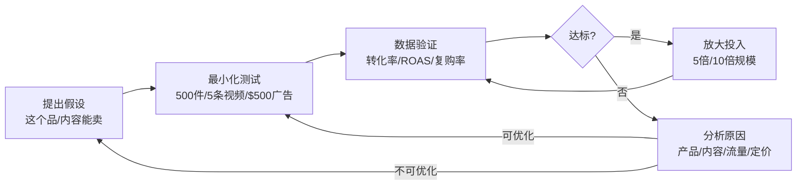
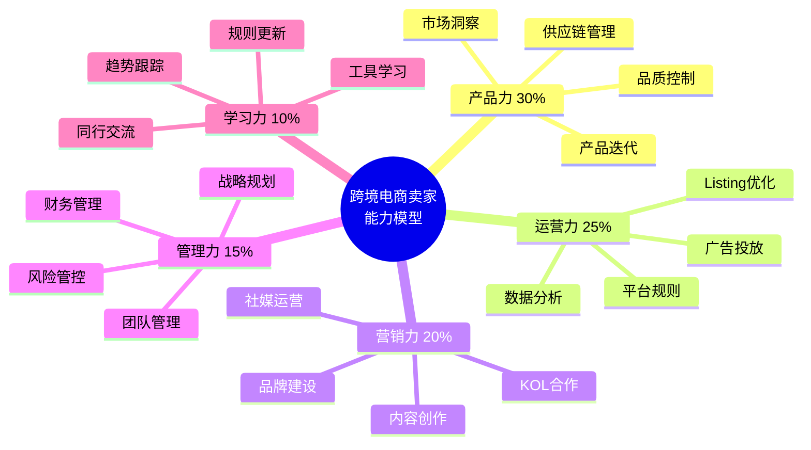
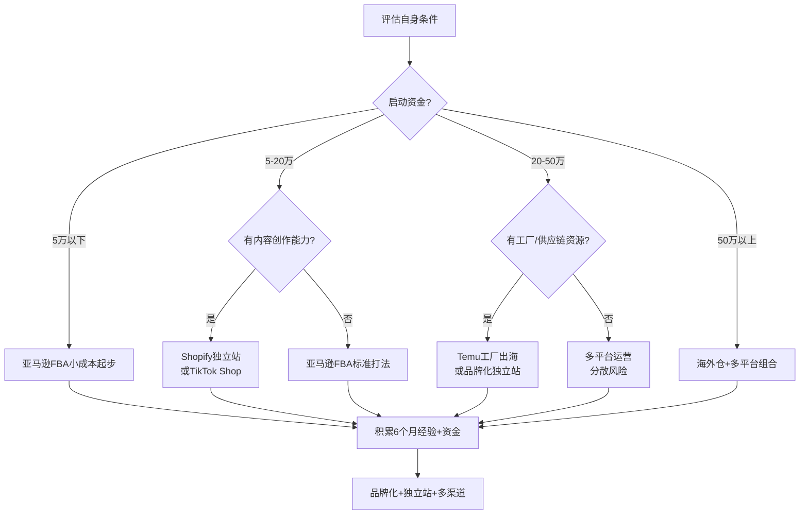

## 案例总结与深度启示

七个实战案例已经完整展示了跨境电商从入门到进阶的全貌：从亚马逊FBA标品打法（案例一）到Shopify独立站品牌出海（案例二），从多平台协同运营（案例三）到海外仓重资产模式（案例四），再到TikTok Shop内容电商（案例五）、品牌升级路径（案例六）、工厂转型Temu（案例七）。本章作为整个实战案例系列的收官之作，不再重复单个案例的细节，而是从更高的维度进行系统性总结——提炼跨案例的共性规律、构建可复用的决策框架、揭示成功与失败的深层机制，并为不同阶段的卖家提供可执行的行动指南。

### 七条路径的成功公式与底层逻辑

前四条经典路径和后三条进阶路径，表面打法各异，但拆解到底层，每条路径的成功都由四个核心变量决定。这四个变量的不同组合，构成了不同路径的"成功公式"：

```text
亚马逊FBA成功公式 = 精准选品 × Listing优化 × 广告效率 × 供应链管理
独立站成功公式 = 品牌定位 × 内容营销 × 流量获取 × 用户运营
TikTok Shop成功公式 = 爆款选品 × 短视频内容 × 达人合作 × 供应链响应
Temu成功公式 = 工厂成本优势 × 品质控制 × 快速响应 × 规模效应
```

这些公式不是简单的加法关系，而是**乘法关系**——任何一个变量趋近于零，整体结果都趋近于零。这意味着：选品再好，Listing做烂了等于零；内容再好，供应链跟不上也等于零。很多卖家在某一个维度做到了90分，却因为另一个维度只有10分而导致整体失败。

**七个案例的核心变量权重对比：**

| 变量 | 亚马逊FBA | 独立站 | 多平台 | 海外仓 | TikTok Shop | 品牌升级 | 工厂Temu |
|------|-----------|--------|--------|--------|-------------|----------|----------|
| **选品/产品** | ★★★★★ | ★★★ | ★★★★ | ★★★★ | ★★★★★ | ★★★ | ★★★★★ |
| **内容/品牌** | ★★ | ★★★★★ | ★★ | ★★ | ★★★★★ | ★★★★★ | ★ |
| **流量/营销** | ★★★★ | ★★★★ | ★★★ | ★★★ | ★★★★ | ★★★★ | ★★ |
| **供应链/物流** | ★★★ | ★★ | ★★★★ | ★★★★★ | ★★★ | ★★★★ | ★★★★★ |
| **资金门槛** | 低（5-15万） | 低（3-8万） | 中（10-30万） | 高（30-100万） | 低（3-10万） | 中（15-50万） | 中（10-30万） |
| **经验门槛** | 低 | 中 | 高 | 高 | 低 | 高 | 中 |

从这个对比中可以提炼出一个关键洞察：**低资金门槛的路径，往往对"软实力"（内容、选品眼光）要求更高；低经验门槛的路径，往往对资金或供应链要求更高。** 不存在"低资金、低经验、高回报"的路径——如果有人告诉你有，那大概率是割韭菜。

### 七个案例的成败关键因素深度拆解

#### 成功者的五个共性特质

回顾七个案例中所有成功的卖家，他们在以下五个方面表现出高度一致性。这不是巧合，而是跨境电商成功的必要条件：

**特质一：前期调研的深度远超常人**

七个案例中，没有一个是"拍脑袋就干"的。案例一的刘先生花了一个半月分析亚马逊厨房品类的200多个ASIN，逐个研究竞品的Review、定价、排名变化；案例二的品牌创始人在启动前就确定了"瑜伽+环保"的品牌定位，研究了目标用户群体的消费心理和媒体习惯；案例七的工厂老板在入驻Temu之前，已经对同类产品的线上价格带、品质标准、包装规格做了完整摸底。

这种调研不是随便看看就行，而是要有结构化的方法：

```text
选品调研清单（必做项）
├── 市场容量验证
│   ├── 月搜索量 > 目标值（亚马逊建议 > 5万）
│   ├── 品类年增长率（Google Trends 5年趋势）
│   └── 季节性波动幅度（避免强季节性品类作为主力）
├── 竞争强度评估
│   ├── 头部卖家Review数量（< 500为佳）
│   ├── 头部卖家品牌集中度（是否有垄断品牌）
│   └── 新品上榜难易度（近6个月新品进入前100的数量）
├── 利润空间核算
│   ├── 采购成本（含模具、包装、质检）
│   ├── 物流成本（头程+尾程+FBA费用）
│   ├── 广告成本（预估ACOS × 售价）
│   ├── 退货损耗（品类平均退货率 × 单位成本）
│   └── 净利润率 > 20%
└── 差异化可行性
    ├── 竞品差评分析（1-3星评价提炼TOP3痛点）
    ├── 供应商改良能力（能否在产品层面解决痛点）
    └── 知识产权风险排查（专利、商标、版权）
```

**特质二：小步快跑的验证节奏**

没有人一上来就大批量备货。案例一首批只备了800件；案例二先用50个SKU测试独立站转化率；案例五的第一条TikTok视频只花了200元拍摄成本。他们的共同逻辑是：**用最小成本验证核心假设，确认可行后再加注。**

这种验证节奏可以用"假设-测试-验证-放大"四步循环来概括：



关键指标的"达标线"参考值：

| 指标 | 亚马逊FBA | 独立站 | TikTok Shop | Temu |
|------|-----------|--------|-------------|------|
| 转化率 | > 10% | > 2% | > 3% | > 5% |
| ACOS/CPA | < 30% | < $15/单 | < 20% | N/A |
| 首月销量 | > 100件 | > 50件 | > 200件 | > 500件 |
| 退货率 | < 5% | < 8% | < 10% | < 8% |
| 差评率 | < 3% | N/A | < 5% | < 5% |

**特质三：持续迭代的优化习惯**

成功不是一次性事件，而是一个持续优化的过程。案例一的刘先生每周分析广告报表，淘汰表现差的关键词，加入新的长尾词；案例二的品牌卖家每月更新独立站内容，每季度推出新品；案例五的TikTok卖家每天复盘视频数据，优化拍摄脚本和发布节奏。

这种迭代不是漫无目的的"调一调"，而是有章法的PDCA循环：

1. **Plan（计划）**：基于数据分析确定本周/本月的优化重点。例如"本周重点优化广告结构，将ACOS从28%降到22%"
2. **Do（执行）**：按计划执行优化动作。例如"重新分组关键词，暂停低效词，增加精准匹配"
3. **Check（检查）**：对比优化前后的数据变化。例如"ACOS从28%降到24%，转化率从11%提升到13%"
4. **Act（行动）**：效果好的标准化，效果差的分析原因并调整。例如"精准匹配效果显著，下周推广到所有广告组"

**特质四：风险控制的底线思维**

七个案例中，几乎每个卖家都经历过"差点死掉"的时刻。案例一差点因为供应商断货而丧失排名；案例三因为亚马逊封号损失了30%的收入；案例四因为汇率波动吃掉了大部分利润。但他们之所以能挺过来，是因为在事前就做好了风险预案。

**跨境电商核心风险清单及应对策略：**

| 风险类型 | 具体表现 | 发生概率 | 影响程度 | 应对策略 |
|----------|----------|----------|----------|----------|
| **账号风险** | 平台封号、限流、降权 | 中 | 致命 | 多账号布局（合规）、严格遵守平台规则、购买商业保险 |
| **供应链风险** | 断货、质量下降、涨价 | 高 | 严重 | 多供应商策略、安全库存、长期协议锁价 |
| **资金风险** | 现金流断裂、汇率损失 | 中 | 严重 | 预留6个月运营资金、远期外汇锁汇、平台贷款 |
| **库存风险** | 滞销、积压、长期仓储费 | 高 | 中等 | 预售测款、阶梯备货、清货预案（站外deal、捐赠） |
| **合规风险** | 知识产权侵权、产品认证缺失 | 中 | 致命 | 提前做知识产权排查、获取必要认证（FDA/CE/FCC） |
| **市场风险** | 需求变化、竞品冲击、政策变动 | 中 | 中等 | 多品类分散、品牌化运营、持续关注行业动态 |

**特质五：长期主义的心态建设**

案例一的刘先生前3个月每月亏损2-3万；案例二的独立站前6个月几乎没有自然流量；案例四的海外仓前8个月一直在回本的路上。但他们都没有放弃，因为他们清楚地知道：跨境电商不是一个"月入十万"的快钱生意，而是一个需要6-12个月才能看到正向回报的长期生意。

这种心态建设的核心是：**接受不确定性，拥抱过程，用数据而非情绪做决策。** 具体做法包括：

- 设定"学费预算"：明确告诉自己"这笔钱就是学费，亏完就认"，避免因为投入焦虑而做出错误决策
- 建立"里程碑思维"：不以"赚钱"为唯一目标，而是设定阶段性里程碑——第一个月完成选品、第二个月完成上架、第三个月获得第一个好评……
- 找到"同行者"：加入卖家社群，和同阶段的卖家互相鼓励、分享经验，避免孤军奋战的心理压力

#### 失败者的六种典型死法

比起成功经验，失败教训往往更有价值。以下是从七个案例中提炼出的六种最常见的失败模式，每一种都有真实的案例支撑：

**死法一：选品凭感觉，不做数据验证**

> 案例三的多平台卖家在开拓新品类时，因为"觉得户外用品很火"就进了50万的货，结果发现这个品类的退货率高达15%（因尺寸问题），且头部品牌垄断严重，新品几乎无法获得曝光。最终这批货花了8个月才清完，亏损超过12万。

**教训**：选品阶段投入的1-2周调研时间，可以避免后续数月的亏损。永远用数据说话，不用直觉拍板。

**死法二：资金规划不足，现金流断裂**

> 案例一的刘先生在第4个月时，因为连续补了3批货（共12万），加上亚马逊回款延迟（14天结算周期），账上一度只剩下8000元。如果当时再遇到一次退货潮或者广告费超支，就会直接断链。

**教训**：启动资金至少要覆盖"6个月运营成本 + 首批备货 + 安全缓冲"。很多新手只算了"进货要多少钱"，完全忽略了广告费、平台费、退货损耗这些隐性成本。

**死法三：忽视知识产权，一朝封号归零**

> 案例三的一个SKU因为外观设计与某品牌专利相似，被投诉侵权后亚马逊直接下架了整个变体，同时冻结了该ASIN的所有库存价值（约6万）。虽然最后通过申诉解封，但整整3周无法销售，排名从大类前2000掉到了20000以外。

**教训**：在确定选品前，必须做知识产权三查——查商标（USPTO/EUIPO/CNIPA）、查专利（Google Patents）、查版权（产品图片、文案）。这不是可选项，而是生存底线。

**死法四：库存管理失控，滞销吞噬利润**

> 案例四的海外仓卖家因为对某个大件产品的市场需求过于乐观，一次性发了2000件到美国海外仓。结果市场需求不及预期，最终这批货花了14个月才卖完，长期仓储费就交了将近3万。如果算上资金占用的机会成本，实际亏损接近8万。

**教训**：备货要遵循"小批量、多频次"原则。首批备30天销量，验证后再逐步增加。宁可断货（可以通过涨价或调拨解决），也不要滞销（仓储费是持续出血）。

**死法五：单腿走路，过度依赖单一渠道**

> 案例三的卖家曾经80%的收入来自亚马逊。2024年某次亚马逊系统误判导致其账号被暂停审核了12天，这12天内损失了将近15万的销售额。虽然账号最终恢复，但这次经历让他深刻意识到"把所有鸡蛋放在一个篮子里"的风险。

**教训**：收入来源至少要分散到2-3个渠道。即使亚马逊是主力，也应该同步经营独立站或者其他平台作为"备份"。

**死法六：急于求成，跳过验证阶段**

> 案例七的某工厂老板看到Temu的流量红利后，直接投入了80万开模生产10个新SKU。结果首批产品上线后发现定价策略失误（Temu的价格竞争远比他想象的激烈），5个SKU的实际毛利率只有3%，另外5个因为品质问题退货率超过12%。最终80万的投入只收回了不到40万。

**教训**：无论资金多充裕，都必须从"最小可验证单元"开始。先用5-10个SKU测试，每个SKU首批只备500-1000件，用4-6周的时间验证市场反应。验证通过后再加大投入。

### 跨境电商卖家的能力模型与自评体系

一个优秀的跨境电商卖家不是"什么都会"的全才，而是知道自己的长板在哪里、短板在哪里，并有针对性地补齐。以下是从七个案例中提炼出的五维能力模型：



#### 产品力（权重30%）——决定你能走多远

产品力是跨境电商最核心的能力，没有之一。七个案例中，没有任何一个是靠"运营技巧"弥补了产品本身的缺陷。

**产品力的四个子维度：**

1. **市场洞察能力**：发现未被满足的需求。这不是靠刷社交媒体"发现灵感"，而是靠系统化的数据分析——用Jungle Scout分析品类趋势、用Helium 10研究关键词搜索量变化、用Google Trends观察长期趋势。案例一的刘先生发现"可调节厨房置物架"这个细分需求，是通过分析亚马逊厨房品类前100名竞品的差评，发现"高度不可调节"是用户抱怨第二多的痛点。

2. **供应链管理能力**：找到优质供应商并建立长期合作。好的供应商不是在1688上搜索出来的，而是通过展会、行业推荐、实地考察筛选出来的。案例四的海外仓卖家每年参加两次广交会，每次都会接触10-15家新供应商，最终只选择1-2家进入备选库。他们的供应商筛选标准包括：工厂规模（年产能匹配）、品控体系（是否有ISO认证）、配合度（打样速度、沟通效率）、价格竞争力。

3. **品质控制能力**：建立QC流程，确保产品品质稳定。品质问题不是"抽检查一查"就能解决的，需要建立三级品控体系——来料检验（IQC）、过程检验（IPQC）、出货检验（OQC）。每个环节都有明确的检验标准和抽样方案。案例七的工厂老板在转型Temu后，专门设立了"电商品控岗"，负责按照电商平台的品质标准（而非传统外贸标准）来把控产品质量。

4. **产品迭代能力**：根据市场反馈持续改进产品。很多卖家拿到第一个好评后就"守成"了，不再优化产品。但案例一的刘先生在产品上线6个月后，根据累计的200多条差评反馈，对产品做了3次迭代——第一次增加了防滑脚垫（用户反馈"容易滑动"），第二次改进了安装说明书（用户反馈"安装复杂"），第三次升级了包装材料（用户反馈"收到时有磕碰"）。每次迭代后，差评率都下降了30%-40%。

#### 运营力（权重25%）——决定你能跑多快

运营力是把好产品卖出去的能力。很多供应链很强的工厂型卖家（案例七），产品品质没问题，但因为运营能力不足，导致产品上架后"有好货却卖不动"。

**运营力的四个子维度：**

1. **平台规则理解**：不仅要了解"不能做什么"（合规红线），更要了解"可以做什么"（平台红利）。例如亚马逊的Vine计划可以快速获取早期评价、Brand Referral Bonus可以拿回10%的站外引流佣金、A+ Content可以提升转化率5%-10%。这些红利很多卖家不知道或者不会用。

2. **Listing优化能力**：高转化率的Listing不是"写得好看"就行，而是要符合平台的搜索算法逻辑。亚马逊A9算法的核心权重排序是：标题关键词 > 后台搜索词 > Bullet Points > 描述 > A+ Content。每个位置的关键词布局都有讲究——标题放核心大词+核心卖点，后台搜索词放长尾词+同义词，Bullet Points放功能卖点+使用场景。

3. **广告投放能力**：亚马逊广告的核心不是"花多少钱"，而是"钱花在哪里"。案例一的刘先生通过持续优化广告结构，将ACOS从初期的35%降到了18%，同时维持了稳定的单量。他的方法是：自动广告跑词→筛选高效词→建立手动精准匹配广告→持续否定低效词→每周调整竞价。

4. **数据分析能力**：不是"看数据"，而是"用数据做决策"。具体来说，要建立"日报-周报-月报"三级数据体系，每个层级关注不同的指标。日报关注异常值（如突然的销量下降、ACOS飙升），周报关注趋势（如关键词排名变化、转化率走势），月报关注全局（如品类市场份额、利润率变化、现金流状况）。

#### 营销力（权重20%）——决定你能卖多贵

营销力决定了你是卖"产品"还是卖"品牌"。前者只能赚供应链效率的钱，后者可以赚品牌溢价的钱。案例二的独立站品牌通过内容营销和社群运营，实现了比同类产品高30%的定价，且复购率达到22%。

**营销力的四个子维度：**

1. **内容创作能力**：在短视频电商时代，内容创作能力的重要性急剧上升。案例五的TikTok卖家总结了一套"爆款视频公式"：前3秒抓注意力（痛点场景/反常识/悬念）+ 中间15秒展示产品解决问题的过程 + 最后5秒引导行动（限时优惠/评论互动）。这套公式让他们的视频平均完播率达到42%，远超品类平均的25%。

2. **社交媒体运营**：不是"发帖就行"，而是要理解每个平台的内容分发逻辑。Instagram重图片质量、TikTok重视频创意、Pinterest重搜索优化、Facebook重社群互动。案例二的独立站品牌针对不同平台制定了差异化的内容策略，Instagram发产品美图和用户晒单、TikTok发瑜伽教程和产品使用场景、Pinterest发长图文和信息图。

3. **KOL合作能力**：达人合作不是"花钱买曝光"，而是要找到与品牌调性匹配的达人，并建立长期合作关系。案例五的TikTok卖家总结了一套达人筛选标准：粉丝画像与目标用户重合度>60%、近30天视频平均互动率>3%、过往带货视频的真实评论（非刷量）。他们首选中小达人（粉丝1万-10万），因为合作成本低、配合度高、粉丝信任度强。

4. **品牌建设能力**：品牌不是一个Logo或者一句Slogan，而是用户对你产品的整体感知。品牌建设的核心是"一致性"——从产品设计、包装、Listing页面、社媒内容到客服沟通，所有触点都要传递相同的品牌信息。案例六的品牌升级卖家在这方面做得最极致——他们甚至为客服编写了统一的"话术手册"，确保每次与客户的沟通都符合品牌调性。

#### 管理力（权重15%）——决定你能撑多久

管理力是规模化阶段的核心能力。很多卖家在"一个人干"的阶段做得很好，但一旦开始招人、扩团队，就陷入了混乱。

**管理力的四个子维度：**

1. **团队管理**：从"一个人干所有事"到"每个人干一件事"的转变。案例四的海外仓卖家在团队扩展到8人后，建立了明确的岗位分工——选品岗、运营岗、客服岗、物流岗、财务岗，每个岗位都有标准化的SOP（标准操作流程）。新员工入职后，按照SOP培训1-2周就能上手。

2. **财务管理**：跨境电商的财务管理比传统零售复杂得多——涉及多币种结算、跨境税务（VAT/GST）、平台费用核算、库存资产估值等。建议从一开始就使用专业的财务工具（如赛盒ERP、积加ERP），建立完整的财务核算体系。至少做到每周核算一次各SKU的真实利润率（而不是"感觉赚钱"）。

3. **风险管控**：前文已详细讨论，核心是"预案思维"——为每种可能的风险制定应对方案，而不是等风险发生后再临时应对。

4. **战略规划**：从"埋头做事"到"抬头看路"。每个季度至少做一次战略复盘——当前的核心竞争力是什么？未来6个月的主要机会和威胁是什么？资源应该如何分配？案例三的多平台卖家每季度都会做一次"品类组合调整"，淘汰利润率持续低于10%的品类，将资源集中到高增长品类上。

#### 学习力（权重10%）——决定你能走多新

跨境电商是一个变化极快的行业——平台规则月月更新、算法季季调整、新平台新玩法层出不穷。学习力不是"看几篇文章"就行，而是要建立系统化的信息获取和知识管理体系。

**学习力的四个子维度：**

1. **行业趋势跟踪**：订阅3-5个行业媒体（如雨果跨境、亿邦动力、跨境知道），每天花15-20分钟浏览行业动态。重点关注平台政策变化、品类趋势报告、头部卖家的公开分享。

2. **平台规则更新**：关注各平台的官方卖家论坛和公告邮件。亚马逊的Seller Central论坛、TikTok Shop的卖家中心公告、Temu的卖家群通知——这些是规则变更的第一手信息来源。

3. **新工具学习**：每半年评估一次是否有新的工具可以提升效率。2025年AI工具在跨境电商中的应用已经非常广泛——AI生成Listing文案、AI优化广告竞价、AI客服自动回复、AI选品分析。不学习新工具就是在主动降低竞争力。

4. **同行交流**：参加行业展会（如深圳跨境电商展、广州交易会）、加入卖家社群（如知无不言、跨境知道社区）、参加线下沙龙。同行的一句经验分享，可能帮你省下数月的试错时间。

### 跨境电商创业的阶段规划与里程碑

跨境电商创业不是一个"一口气干到底"的过程，而是需要分阶段推进。每个阶段有不同的目标、任务和风险点。以下是基于七个案例总结出的四阶段规划框架：

#### 第一阶段：学习和准备期（第1-3个月）

这个阶段的核心目标是"搞明白"——搞明白自己要做什么、怎么做、有什么风险。

| 周次 | 核心任务 | 产出物 | 预算 |
|------|----------|--------|------|
| 第1-2周 | 确定目标平台和品类方向 | 品类分析报告（含市场规模、竞争格局、利润测算） | 0 |
| 第3-4周 | 深度调研，锁定3-5个候选产品 | 竞品分析表（含差评分析、定价策略、Listing拆解） | 工具订阅费300-500元 |
| 第5-6周 | 寻找供应商，索要样品 | 供应商对比表（含价格、起订量、交期、品质评分） | 样品费500-2000元 |
| 第7-8周 | 注册公司、商标、平台账号 | 营业执照、商标受理通知书、平台账号 | 注册费2000-5000元 |
| 第9-12周 | 确定首批产品，完成采购和发货 | 采购订单、物流发货单 | 首批采购+物流5000-30000元 |

**本阶段里程碑**：完成首批产品的采购和发货，等待入仓。

#### 第二阶段：测试和验证期（第4-6个月）

这个阶段的核心目标是"跑起来"——产品上线、获取数据、验证市场。

| 周次 | 核心任务 | 产出物 | 预算 |
|------|----------|--------|------|
| 第13-14周 | 产品入仓，完成Listing上架 | 上线的Listing页面（含A+Content） | 0-2000元（图片/视频制作） |
| 第15-16周 | 启动广告，获取初始流量 | 广告活动数据报表 | 广告费3000-8000元 |
| 第17-18周 | 优化Listing和广告策略 | 优化后的Listing和广告结构 | 持续广告投入 |
| 第19-20周 | 积累评价（Vine/自然评价） | 10-30条真实评价 | Vine费用200美元/ASIN |
| 第21-24周 | 数据复盘，决定是否追加投入 | 数据分析报告（含利润测算、市场反馈） | 持续运营费用 |

**本阶段里程碑**：完成市场验证——确认产品有稳定出单、利润率达标、退货率可控。

#### 第三阶段：增长和优化期（第7-12个月）

这个阶段的核心目标是"做规模"——扩大产品线、优化供应链、提升利润率。

| 月份 | 核心任务 | 关键指标 |
|------|----------|----------|
| 第7个月 | 扩充产品线至10-20个SKU | 新品上架成功率 > 60% |
| 第8-9个月 | 优化供应链（谈账期、签长期协议） | 采购成本降低5%-10% |
| 第10-11个月 | 优化广告结构，提升ROAS | ACOS降至20%以下 |
| 第12个月 | 建立团队和运营流程 | 关键岗位SOP完成 |

**本阶段里程碑**：月销售额突破10万元，净利润率稳定在15%以上。

#### 第四阶段：品牌和扩展期（第13-24个月）

这个阶段的核心目标是"建壁垒"——打造品牌、拓展渠道、建立护城河。

| 月份 | 核心任务 | 关键指标 |
|------|----------|----------|
| 第13-15个月 | 注册品牌，建立品牌形象 | Brand Registry完成 |
| 第16-18个月 | 拓展新市场或新平台 | 新渠道月销售额 > 3万 |
| 第19-21个月 | 建立独立站，布局私域流量 | 独立站月流量 > 1万UV |
| 第22-24个月 | 优化管理体系，为规模化做准备 | 团队扩展至5-10人 |

**本阶段里程碑**：年销售额突破200万元，品牌认知度初步建立。

### 不同阶段卖家的模式选择决策树

七个案例展示了七条不同的路径，但并不意味着每个卖家都应该走同样的路。路径选择取决于三个核心变量：资金、能力、资源。以下是基于七个案例总结的决策框架：



**新手最佳起步路径**：对于绝大多数新手卖家，最推荐的路径是"亚马逊FBA起步 → 积累经验后拓展独立站 → 最终实现品牌化多渠道运营"。原因很简单——亚马逊提供现成流量、FBA简化物流、数据反馈快（上架1-2周就能看到市场反应）、试错成本可控（首批5-10万元）。

### 跨境电商未来趋势展望与应对策略

行业在快速变化，今天的最优策略可能明天就失效。以下是2025-2027年最值得关注的六大趋势，以及每个趋势对卖家的具体影响和应对建议：

#### 趋势一：AI驱动运营成为标配

AI工具正在渗透跨境电商的每一个环节。2025年，使用AI工具的卖家与不使用的卖家之间的效率差距正在急剧扩大。

**AI在跨境电商各环节的应用现状：**

| 环节 | AI工具/应用 | 效率提升 | 成熟度 |
|------|-------------|----------|--------|
| **选品分析** | AI市场趋势预测、竞品自动监控 | 调研时间缩短60% | ★★★★ |
| **Listing优化** | AI生成标题/Bullet Points/A+Content | 文案创作效率提升5倍 | ★★★★★ |
| **图片视频** | AI产品图生成、视频脚本创作 | 制作成本降低70% | ★★★★ |
| **广告投放** | AI自动竞价、关键词智能推荐 | ACOS降低15%-25% | ★★★ |
| **客服回复** | AI自动回复、多语言翻译 | 响应时间缩短80% | ★★★★ |
| **数据分析** | AI报表生成、异常预警 | 分析效率提升3倍 | ★★★ |

**应对建议**：不要抗拒AI，而是主动拥抱。从Listing文案生成和客服自动回复这两个"投入小、见效快"的场景开始，逐步扩展到广告优化和选品分析。

#### 趋势二：短视频电商持续爆发

TikTok Shop在2024年的GMV已经突破了300亿美元，2025年预计还将翻倍。短视频正在成为全球消费者发现新产品的主要渠道——尤其是在年轻用户群体中，"刷视频→被种草→下单购买"的消费路径已经非常成熟。

**应对建议**：如果你的产品适合视觉化展示（如美妆、家居、食品、服装），现在就是布局短视频电商的最佳时机。即使不直接在TikTok Shop卖货，也应该在TikTok/Instagram Reels/YouTube Shorts上建立品牌内容矩阵。

#### 趋势三：品牌化成为生存门槛

纯铺货模式的空间正在急剧缩小。亚马逊在2024年已经多次调整算法，降低了"无品牌"商品的搜索权重；Temu虽然流量大但利润极薄，长期来看不是一个可持续的品牌建设渠道。品牌化不再是一个"加分项"，而是一个"生存门槛"。

**应对建议**：从第一天起就有品牌意识。注册商标、设计品牌视觉体系、建立品牌故事。不要等到"赚到钱再做品牌"——在竞争日益激烈的市场中，没有品牌的产品几乎没有溢价空间。

#### 趋势四：本地化程度持续加深

"本地化"不再只是"把Listing翻译成当地语言"那么简单。2025年的本地化已经涵盖了产品设计本地化（符合当地审美和使用习惯）、营销本地化（用当地流行的社交媒体和KOL）、物流本地化（本地仓发货、本地退货）、甚至团队本地化（雇用当地人做客服和营销）。

**应对建议**：优先做产品本地化和物流本地化——前者直接影响转化率，后者直接影响用户体验。营销本地化和团队本地化可以在业务稳定后逐步推进。

#### 趋势五：合规化监管持续加强

欧盟的GPSR（通用产品安全法规）在2024年生效，要求所有在欧盟销售的产品必须有欧盟境内的授权代表；美国的INFORM Consumers Act要求平台验证卖家的真实身份；东南亚各国也在陆续出台跨境电商税收和认证新规。合规成本正在成为卖家不可忽视的经营成本。

**应对建议**：将合规成本纳入选品阶段的利润核算。对于利润率低于15%的品类，要谨慎评估新增合规成本是否会把利润吃掉。必要时可以聘请专业的合规顾问。

#### 趋势六：绿色可持续成为竞争要素

全球消费者对环保和可持续发展的关注度持续上升。在欧美市场，"可持续"已经从一个营销概念变成了影响购买决策的实际因素——超过60%的欧美消费者表示愿意为环保产品支付更高的价格。

**应对建议**：在产品设计和包装上融入可持续理念。使用可回收材料、减少过度包装、获取环保认证（如FSC、OEKO-TEX）。这些投入不仅能满足消费者期望，还可能获得平台的"绿色标签"加权。

### 全书总结：跨境电商的核心认知框架

走到这里，七个实战案例已经完整呈现了跨境电商从0到1、从1到10的全过程。最后，将所有内容浓缩为一个认知框架——"一个核心、两个维度、三条铁律"：

**一个核心**：跨境电商的本质是"把合适的产品，以合适的价格，通过合适的渠道，卖给合适的消费者"。所有运营技巧都是围绕这个核心展开的。

**两个维度**：

1. **效率维度**——如何用更少的成本获取更多的流量和转化。这包括选品效率、广告效率、运营效率、供应链效率。
2. **壁垒维度**——如何建立竞争对手难以复制的优势。这包括品牌壁垒、供应链壁垒、用户壁垒、数据壁垒。

**三条铁律**：

1. **验证先行，规模后置**：任何投入都要先小规模验证，数据确认可行后再放大。宁可慢一步，不要错一步。
2. **现金流为王，利润为辅**：账面利润不等于真金白银。永远关注现金流——回款周期、库存占压、应收账款，这些才是决定你能不能活下去的关键。
3. **长期主义，持续进化**：跨境电商不是一个"一夜暴富"的行业。接受前6-12个月可能亏损的现实，把这段时间当作学习投资。保持学习、持续迭代、拥抱变化，才能在这个快速变化的行业中生存和发展。

> **本章核心启示：跨境电商没有"最好的模式"，只有"最适合你的模式"。选择模式时，评估自己的资金、能力、资源三个维度，找到匹配度最高的路径。起步后，牢记验证先行、现金流为王、长期主义三条铁律。然后坚持执行，持续优化。七个案例已经为你展示了完整的路径地图——接下来，该你上路了。**

***
