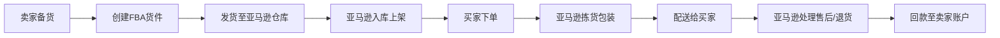
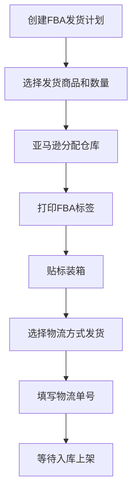

## 一、亚马逊FBA全流程操作

亚马逊FBA（Fulfillment by Amazon）是亚马逊提供的代发货服务：卖家将商品批量发送至亚马逊仓库，由亚马逊负责存储、拣货、包装、配送及售后。理解FBA的底层逻辑并掌握从开店到盈利的完整闭环，是跨境电商进阶的第一课。

### 1.1 FBA运作机制与核心优势

#### 1.1.1 FBA工作流程



#### 1.1.2 FBA vs FBM对比

| 维度 | FBA（代发货） | FBM（自发货） |
|------|-------------|-------------|
| 配送时效 | 1-2天（Prime标识） | 5-15天 |
| Buy Box竞争力 | 高（Prime权重加分） | 低 |
| 物流成本 | 仓储费+配送费，批量低 | 国际运费+尾程，单件高 |
| 售后处理 | 亚马逊全权处理 | 卖家自行处理 |
| 库存风险 | 滞销产生长期仓储费 | 按需发货，风险低 |
| 适用场景 | 标品、高周转、冲排名 | 大件、定制、测品阶段 |

**关键结论：** FBA的核心价值不仅仅是物流便利，更在于Prime标识带来的Buy Box权重提升。据统计，拥有Prime标识的Listing转化率比非Prime高出30%-50%。对于想在亚马逊长期经营的卖家，FBA几乎是必选项。

#### 1.1.3 FBA费用结构

FBA费用由三部分组成，直接影响利润率：

**① 配送费（Fulfillment Fee）**

按商品尺寸和重量分段收费，2024年美国站标准如下：

| 尺寸分级 | 重量范围 | 单件配送费（美元） |
|---------|---------|----------------|
| 小号标准 | ≤12oz | $3.22 |
| 大号标准 | 12oz-3lb | $3.22-$5.66 |
| 小号大件 | ≤70lb | $9.73起 |
| 大号大件 | >70lb | $40+（需报价） |

**② 仓储费（Storage Fee）**

| 时间段 | 标准尺寸（立方英尺/月） | 大件（立方英尺/月） |
|--------|---------------------|-------------------|
| 1-9月 | $0.87 | $0.56 |
| 10-12月（旺季） | $2.40 | $1.40 |
| 超龄库存（271-365天） | 额外$6.90 | 额外$6.90 |
| 超龄库存（>365天） | 额外$8.45-$13.40 | 额外$8.45-$13.40 |

**③ 其他费用**

- **月度订阅费：** 专业卖家$39.99/月，个人卖家按件收费$0.99/件
- **销售佣金：** 品类不同，通常8%-15%
- **退货处理费：** 服装等高退货率品类额外收费
- **标签服务费：** 若需亚马逊贴标，$0.55/件

**利润计算公式：**

```text
毛利润 = 售价 - 采购成本 - 头程运费 - FBA配送费 - 仓储费 - 销售佣金 - 广告费
毛利率 = 毛利润 / 售价 × 100%
```

建议使用亚马逊官方的FBA计算器（Revenue Calculator）在选品阶段就测算利润，目标毛利率不低于25%。

### 1.2 开店注册全流程

#### 1.2.1 注册所需资料

| 资料类型 | 具体要求 | 常见问题 |
|---------|---------|---------|
| 营业执照 | 企业或个体工商户，经营范围含进出口 | 个体户可以注册，但部分站点受限 |
| 法人身份证 | 正反面彩色扫描件，有效期>45天 | 身份证即将过期会被拒 |
| 双币信用卡 | Visa/Mastercard，持卡人不限于法人 | 推荐Visa，Mastercard偶尔验证失败 |
| 收款账户 | Payoneer/万里汇/连连/亚马逊官方收款 | 建议开Payoneer，费率0.3%-1.2% |
| 手机号码 | 未注册过亚马逊卖家账号 | 同一手机号不能重复注册 |
| 邮箱 | 未注册过亚马逊卖家账号 | 建议用企业邮箱 |

#### 1.2.2 注册六步流程

**第一步：访问亚马逊全球开店**

进入 sellercentral.amazon.com（美国站）或对应站点地址，点击"Sign up"。

**第二步：选择目标站点**

新手建议首选美国站（市场最大、工具最全），成熟后可拓展至欧洲（英德法意西）、日本、澳洲等站点。注意欧洲站需要VAT税号。

**第三步：填写公司信息**

- 公司名称（与营业执照一致）
- 注册地址
- 营业执照编号
- 法人姓名及身份信息

**第四步：填写法人信息**

- 上传身份证正反面
- 填写居住地址（需与水电账单一致）
- 填写手机号码并接收验证码

**第五步：完成视频验证**

亚马逊会安排视频面审，审核员会要求：
- 出示营业执照原件
- 出示身份证原件
- 回答基本经营问题

**第六步：等待审核**

审核周期通常3-10个工作日，期间保持电话和邮箱畅通。审核通过后即可登录Seller Central。

#### 1.2.3 注册关键注意事项

- **关联风险：** 一个公司只能注册一个同站点账号。同一网络环境、同一设备、同一信用卡注册多个账号会导致关联封号。如需多账号运营，必须做到公司主体、网络环境、设备、信用卡、收款账户完全独立。
- **信息一致性：** 注册信息（公司名、地址、法人名）必须与营业执照完全一致，哪怕多一个空格都可能被拒。
- **信用卡要求：** 必须是双币信用卡（支持美元结算），建议额度>$500，以备广告扣款。
- **二审准备：** 部分账号会触发二审（地址验证），需提供90天内的水电煤账单或银行对账单，地址与注册信息一致。

### 1.3 选品策略

选品是FBA成败的关键——选错产品，后续运营再努力也难以盈利。

#### 1.3.1 选品核心原则

**① 轻小件优先**

FBA配送费按尺寸和重量收费，轻小件（<2lb）配送费低、头程运费低、退货成本低。新手第一个产品建议控制在1lb以内。

**② 避开红海，寻找蓝海**

- **红海特征：** 头部Listing月销>5000、Review>1000、价格战激烈（如手机壳、数据线）
- **蓝海特征：** 月销1000-3000、Review<300、利润率>30%、竞争者<50个

**③ 非季节性刚需品**

避免节日装饰、泳衣等强季节性产品。优选厨房用品、家居收纳、办公配件等全年需求稳定品类。

**④ 避开侵权和合规风险**

- 不做迪士尼、漫威等IP相关产品
- 不做食品、化妆品、医疗器械（需FDA认证）
- 欧洲站不做电子产品（需CE认证成本高）

#### 1.3.2 选品工具与方法

| 工具 | 功能 | 费用 |
|------|------|------|
| Jungle Scout | 产品数据库、竞品分析、销量预估 | $49/月起 |
| Helium 10 | 关键词研究、选品、Listing优化 | $39/月起 |
| Keepa | 价格历史追踪、BSR排名变化 | $19/月 |
| 亚马逊Best Sellers | 免费查看各品类热销榜单 | 免费 |
| Google Trends | 验证搜索趋势、季节性 | 免费 |

**选品验证五步法：**

1. **市场容量验证：** 目标关键词月搜索量>5000（用Helium 10的Cerebro查）
2. **竞争度评估：** 首页Listing平均Review数<300
3. **利润测算：** 售价-所有成本后毛利率>25%
4. **供应链验证：** 1688能找到3家以上供应商，单价可控
5. **合规检查：** 确认目标站点无需额外认证

#### 1.3.3 供应商筛选

**1688选供应商标准：**

- 实力商家/超级工厂标识优先
- 成交额>100万，回头率>30%
- 支持样品寄送（付样品费+运费）
- 能提供定制包装和Logo印刷
- 最低起订量（MOQ）合理（新手要求50-200件试单）

**验厂重点：**

- 要求提供产品质检报告（SGS/BV等第三方）
- 确认生产周期（通常7-15天）
- 确认是否支持FBA标签和外箱唛头
- 首单建议少量多款测试，不要一次押宝单一产品

### 1.4 Listing优化实战

Listing质量直接决定转化率，是FBA运营的核心技能。

#### 1.4.1 标题优化

**标题公式：**

```text
品牌名 + 核心关键词 + 核心卖点 + 材质/规格 + 适用场景
```

**优化规则：**

- 字符控制在150-200个字符（不同类目限制不同）
- 核心关键词必须出现在标题前80个字符（移动端只显示前80字符）
- 不要堆砌关键词，保持可读性
- 每个首字母大写（介词、冠词除外）
- 不要使用特殊符号（如★、❤）

**优化示例：**

```text
❌ 差：Bluetooth Headphones Wireless Headphones Noise Cancelling Headphones

✅ 好：[Brand] Wireless Bluetooth Headphones - Noise Cancelling Over-Ear 
     Headphones with Microphone, 40H Playtime, Hi-Fi Stereo Sound, 
     Foldable Headset for Travel/Home/Office
```

#### 1.4.2 五点描述（Bullet Points）

每个Bullet Point突出一个核心卖点，结构为：

```text
【卖点关键词】 - 详细描述（包含使用场景和数据支撑）
```

**五点排列顺序建议：**

1. **核心功能/差异化卖点** — 最强的购买理由
2. **品质/材质** — 打消质量顾虑
3. **使用场景** — 帮助买家代入
4. **售后保障** — 降低购买风险
5. **包装/配件** — 补充信息

**写作要点：**

- 每条控制在200-500字符
- 自然融入2-3个关键词
- 使用具体数据（"续航40小时"而非"超长续航"）
- 避免主观表述（"最好的"、"顶级的"）

#### 1.4.3 产品图片

**主图要求：**

- 纯白背景（RGB 255,255,255）
- 产品占图片面积85%以上
- 无文字、Logo、水印
- 分辨率≥1000×1000像素（支持缩放）

**辅图策略（建议7-9张）：**

| 图片位置 | 内容 | 作用 |
|---------|------|------|
| 图2 | 产品多角度展示 | 全面了解产品外观 |
| 图3 | 核心功能/卖点图示 | 突出差异化 |
| 图4 | 尺寸/规格对比图 | 帮助判断大小 |
| 图5 | 使用场景图 | 激发购买欲 |
| 图6 | 材质/工艺细节图 | 展示品质感 |
| 图7 | 包装清单/配件展示 | 明确购买内容 |
| 图8 | 对比竞品优势图 | 突出差异化 |
| 图9 | 品牌故事/信任背书 | 建立品牌认知 |

**图片制作建议：**

- 主图建议白底实拍，辅图可以加文字说明和信息图（Infographic）
- 使用A+内容的图文模块可以大幅提高转化率（品牌注册卖家可使用）
- 图片中加入尺寸参照物（如硬币、手掌）帮助买家感知大小

#### 1.4.4 后台搜索词（Search Terms）

搜索词是买家看不到但影响搜索排名的隐藏字段：

- 填满250字节上限
- 不要重复标题中已有的词
- 使用同义词、缩写、常见拼写错误
- 不要用逗号分隔，直接用空格
- 不要放竞品品牌名（违规）

#### 1.4.5 A+内容（品牌注册卖家）

A+内容通过图文并茂的方式展示产品，平均可提升转化率5%-10%：

- **品牌故事模块：** 用轮播图讲述品牌理念
- **对比表格模块：** 与自家其他产品对比，引导交叉销售
- **图文模块：** 产品使用场景、功能详解、FAQ
- **建议总长度：** 6-8个模块，覆盖从感性到理性的购买决策链

### 1.5 FBA物流操作

#### 1.5.1 FBA发货全流程



#### 1.5.2 头程物流方式对比

| 方式 | 时效 | 成本（美国） | 适用场景 |
|------|------|------------|---------|
| 空运（快递） | 5-10天 | ¥35-50/kg | 紧急补货、小批量 |
| 空运（专线） | 10-15天 | ¥25-35/kg | 常规补货 |
| 海运（快船） | 20-25天 | ¥8-12/kg | 大批量、非紧急 |
| 海运（慢船） | 30-40天 | ¥5-8/kg | 大件、超大批量 |
| 海运+卡车 | 25-35天 | ¥6-10/kg | 大件商品 |

**头程物流选择建议：**

- 新品首批用空运（快速测品，降低库存风险）
- 稳定出单后转海运（大幅降低物流成本）
- 旺季（Q4）提前2-3个月海运备货
- 建议找货代比价，不要直接用亚马逊的全球物流（AGL），除非价格有优势

#### 1.5.3 FBA标签与包装要求

**商品标签（FNSKU）：**

- 每件商品必须贴FNSKU标签（在创建货件时下载）
- 标签尺寸：推荐1"×2-5/8"（Avery 5160）
- 贴在商品外包装可见位置，覆盖原有条码
- 不能贴在封口处（影响开箱）

**外箱要求：**

- 使用标准六面硬纸箱
- 单箱重量≤50lb（超重需贴"Team Lift"标签）
- 单箱尺寸≤25"×25"×25"
- 外箱贴FBA外箱标签（Shipment Label）
- 使用亚马逊专用胶带或普通胶带均可

**常见入库被拒原因：**

- 商品未贴FNSKU标签
- 标签扫描不清晰
- 外箱破损或变形
- 商品与发货计划不一致
- 危险品未申报

#### 1.5.4 库存管理

**补货公式：**

```text
补货量 = 日均销量 × (生产周期 + 头程运输时间 + 入库时间 + 安全天数) - 在途库存 - 在库库存
安全天数建议：15-30天
```

**库存管理工具：**

- 亚马逊后台"库存规划"页面查看IPI（库存绩效指标）
- IPI>400分：仓储空间无限制
- IPI<400分：仓储空间受限，需清理滞销库存
- 使用"Inventory Dashboard"监控库存状态

**避免长期仓储费的方法：**

- 设置自动移除规则（Automatic Removal）
- 滞销品创建移除订单（Removal Order），退回海外仓或销毁
- 促销清库存：Coupon+Lightning Deal组合
- 旺季前清理超龄库存（9月前处理10月前满271天的库存）

### 1.6 广告投放进阶

#### 1.6.1 三大广告类型详解

**① Sponsored Products（商品推广）**

最常见的广告类型，出现在搜索结果和商品详情页：

- **自动广告（Automatic Targeting）：** 亚马逊根据Listing内容自动匹配关键词。适合新品期收集数据。
  - 匹配类型：紧密匹配、宽泛匹配、同类商品、关联商品
  - 建议开4个自动广告活动，分别对应4种匹配类型，便于分析

- **手动广告（Manual Targeting）：** 卖家自行选择关键词或ASIN投放。
  - 广泛匹配（Broad）：搜索词包含关键词即触发，流量大但不精准
  - 词组匹配（Phrase）：搜索词包含完整词组，精准度适中
  - 精准匹配（Exact）：搜索词与关键词完全一致，最精准但流量小

**② Sponsored Brands（品牌推广）**

需品牌注册（Brand Registry）才可使用：

- 展示在搜索结果顶部，包含品牌Logo、自定义标题和最多3个产品
- 可链接到品牌旗舰店（Brand Store）
- 适合品牌曝光和多产品交叉推广

**③ Sponsored Display（展示型推广）**

基于受众定向的广告，可投放到亚马逊站外：

- **商品定向：** 投放到竞品Listing页面
- **受众定向：** 基于浏览/购买行为再营销
- 适合成熟期产品抢占竞品流量

#### 1.6.2 广告投放节奏

**新品推广期（第1-3个月）：**

```text
第1周：  开启自动广告（紧密匹配），竞价建议比建议竞价高20%，预算$20-30/天
第2周：  下载搜索词报告，提取高转化词
第3周：  开启手动精准匹配广告，投放高转化词
第4周：  对自动广告中表现差的词添加否定关键词
第2-3月：持续优化，将ACOS从初期的50%+逐步降至30%以下
```

**成长期（第3-6个月）：**

- 增加词组匹配和广泛匹配广告
- 测试Sponsored Brands和Sponsored Display
- 关注TACOS（总广告成本/总销售额），目标<15%
- 优化出价策略：高转化词加价，低转化词降价或暂停

**成熟期（第6个月+）：**

- 广告重心从"推排名"转向"守排名+拓流量"
- 投放竞品ASIN（Sponsored Products手动广告）
- 利用Sponsored Display做再营销
- 旺季前提前2周加大广告预算

#### 1.6.3 关键词优化实战

**关键词来源：**

1. 竞品Listing反查（Helium 10 Cerebro）
2. 亚马逊搜索框自动补全
3. 自动广告搜索词报告
4. 品牌分析（Brand Analytics）搜索词报告

**否定关键词策略：**

| 否定场景 | 操作 | 示例 |
|---------|------|------|
| 高点击低转化词 | 否定精准 | 点击20次0单→否定 |
| 不相关搜索词 | 否定词组 | 卖耳机出现"音箱"→否定 |
| 竞品品牌词 | 否定精准 | 避免无效竞争 |
| 已自然排名首页的词 | 广告降低竞价 | 节省广告费 |

#### 1.6.4 ACOS与TACOS

**ACOS（广告销售成本比）：**

```text
ACOS = 广告花费 / 广告带来的销售额 × 100%
```

- ACOS < 毛利率 → 广告盈利
- ACOS = 毛利率 → 广告盈亏平衡
- ACOS > 毛利率 → 广告亏损（但可能带动自然排名）

**TACOS（总广告成本比）：**

```text
TACOS = 广告花费 / 总销售额（广告+自然） × 100%
```

TACOS是更健康的指标，因为它反映了广告对整体销售的拉动效果。理想TACOS目标为8%-15%。

### 1.7 Review管理与客户维护

#### 1.7.1 获取Review的合规方法

亚马逊严禁刷评、操纵评价。合规获取Review的方法：

**① Amazon Vine计划**

- 亚马逊官方测评项目，邀请Top Reviewer免费试用并留评
- 费用：每个父ASIN $200（最多30个Vine评价）
- 要求：品牌注册+FBA库存+FBA新品（无评价或<30条评价）
- 效果：评价质量高，带"Vine Customer Review"标签

**② Request a Review按钮**

- 订单完成5-30天内，可在订单详情页点击"Request a Review"
- 亚马逊向买家发送评价请求邮件
- 无法自定义邮件内容，但合规无风险
- 建议每天批量操作（可用第三方工具如Jungle Scout自动请求）

**③ 产品插卡（Insert Card）**

- 随产品附带感谢卡/使用说明
- 可以引导客户关注品牌社媒、注册保修
- **严禁：** 要求好评、提供折扣换评价、引导站外留评
- 建议内容：感谢+使用提示+品牌社媒+客服邮箱

**④ 售后邮件跟进**

- 发货后发送感谢邮件+使用指南
- 询问是否满意，不满意可联系客服
- **注意：** 不要直接要求好评，不要发送多封邮件骚扰

#### 1.7.2 差评处理策略

**处理流程：**

1. **分析差评原因：** 产品缺陷？物流问题？买家误解？
2. **回复差评：** 用品牌身份公开回复，展示解决问题的态度
3. **联系买家：** 通过"Buyer-Seller Messaging"诚恳道歉并提出解决方案（退款/补发）
4. **申请删除：** 如果差评违反亚马逊评价政策（如侮辱性语言、与产品无关），可向亚马逊申请删除
5. **产品改进：** 如果差评反映产品问题，反馈给供应商改进

**差评回复模板：**

```text
Dear Customer,
We're sorry to hear about your experience with [产品名]. 
We take quality very seriously and would love to make this right.
Please contact us at [邮箱] so we can resolve this issue for you.
Best regards, [品牌名] Team
```

#### 1.7.3 客户服务要点

- **响应时效：** 24小时内回复买家消息（亚马逊考核指标）
- **退货处理：** FBA退货由亚马逊处理，但卖家需关注退货率（>5%触发审查）
- **A-to-Z Claim：** 买家发起索赔时，及时提供证据申诉或主动退款（影响ODR指标）

### 1.8 账号健康管理

#### 1.8.1 核心指标

| 指标 | 达标标准 | 影响 |
|------|---------|------|
| ODR（订单缺陷率） | <1% | 超标可能导致封店 |
| 迟发率 | <4% | 影响账号评级 |
| 退货率 | 因品类而异 | 超标触发审查 |
| IPI（库存绩效指标） | >400 | 影响仓储空间 |
| 有效追踪率 | >95% | FBA自动达标 |

**ODR（订单缺陷率）包含：**
- A-to-Z Claim（买家索赔）
- 差评（1-2星）
- 信用卡拒付（Chargeback）

#### 1.8.2 账号安全防护

- **开启两步验证（2FA）：** 所有账号必须开启
- **定期修改密码：** 每90天更换一次
- **权限管理：** 子账号按角色分配权限（运营、客服、财务分开）
- **监控登录记录：** 发现异常登录立即修改密码
- **品牌注册：** 防止Listing被篡改或跟卖

### 1.9 定价策略

#### 1.9.1 定价方法

**① 成本加成定价**

```text
售价 = 总成本 × (1 + 目标利润率)
总成本 = 采购成本 + 头程运费 + FBA费用 + 佣金 + 广告费 + 包装费
```

**② 竞品参考定价**

分析首页竞品价格区间，定位在中位数附近或略低（新品期）。

**③ 心理定价**

- $19.99 比 $20.00 更有吸引力
- 利用Coupon（优惠券）展示划线价，增加购买紧迫感

#### 1.9.2 价格调整策略

| 场景 | 操作 | 原因 |
|------|------|------|
| 新品上架 | 低于竞品10%-15% | 快速积累销量和评价 |
| 获得50+评价 | 逐步提价至目标价 | 已建立信任基础 |
| 旺季（Q4） | 提价5%-10% | 需求旺盛，可承受溢价 |
| 淡季清库存 | 降价+Coupon | 减少仓储费 |
| 竞品降价 | 评估是否跟进 | 避免无底线价格战 |

### 1.10 常见误区与避坑指南

#### 误区一：盲目追求低价格竞争

**错误做法：** 不断降价打价格战，导致利润归零。

**正确做法：** 通过产品差异化（材质升级、功能改进、包装设计）提升附加值，而不是单纯降价。宁可少卖，不可亏卖。

#### 误区二：忽视库存管理

**错误做法：** 一次性发大量库存到FBA，导致长期仓储费吞噬利润。

**正确做法：** 首批发50-200件测品，验证市场后再批量补货。使用补货公式计算每次发货量，保持库存周转在60-90天。

#### 误区三：过度依赖广告

**错误做法：** 广告一停就没单，TACOS高达30%+。

**正确做法：** 广告的终极目标是提升自然排名。当核心关键词自然排名稳定在首页后，逐步降低广告竞价，让自然流量接手。

#### 误区四：忽视Listing优化

**错误做法：** 随便写标题和描述，把精力全放在广告上。

**正确做法：** Listing是转化的基础。再好的广告流量，如果Listing质量差，转化率低，钱就白烧了。上架前花3-5天打磨Listing。

#### 误区五：不做品牌注册

**错误做法：** 觉得品牌注册麻烦，直接用通用品牌上架。

**正确做法：** 品牌注册（Brand Registry）解锁A+内容、品牌旗舰店、品牌分析、Vine计划等核心功能，是长期经营的基础。即使暂时没有商标，也应尽早申请。

#### 误区六：忽视合规风险

**错误做法：** 照搬国内热销产品到海外，不查认证和专利。

**正确做法：** 上架前必查：目标站点产品认证要求（如美国CPSC、欧洲CE）、外观专利（USPTO/EUIPO检索）、商标侵权风险。一次侵权可能导致账号永久封禁。

### 1.11 进阶策略

#### 1.11.1 多站点布局

当美国站运营成熟后，可拓展至：

| 站点 | 市场特点 | 注意事项 |
|------|---------|---------|
| 英国站 | 英语市场，消费力强 | 需VAT税号，脱欧后单独运营 |
| 德国站 | 欧洲最大电商市场 | 需德语Listing，EPR合规 |
| 日本站 | 高客单价，退货率极低 | 需日语Listing，包装要求严格 |
| 澳洲站 | 竞争小，增长快 | 市场规模有限 |

#### 1.11.2 品牌旗舰店（Brand Store）

- 利用亚马逊Brand Store搭建多页面品牌官网
- 可设置首页、分类页、产品详情页、About Us页
- 用于Sponsored Brands广告的落地页，转化率高于普通搜索页
- 数据追踪：查看访客数、页面停留时间、销售额

#### 1.11.3 数据驱动运营

**核心报表：**

| 报表 | 位置 | 分析价值 |
|------|------|---------|
| Business Reports | Reports > Business Reports | 流量、转化率、销售额趋势 |
| Search Term Report | Advertising > Campaign Manager | 关键词表现，优化广告 |
| Brand Analytics | Brands > Brand Analytics | 搜索词排名、市场份额、受众画像 |
| Inventory Report | Reports > Fulfillment | 库存状态、滞销品识别 |

**关键数据公式：**

```text
转化率 = 订单数 / 访客数 × 100%
Session = 独立访客数（非页面浏览量）
BSR（Best Sellers Rank）= 品类内的销量排名
```

目标转化率参考：一般品类10%-15%，服装类5%-8%，高单价品类3%-5%。

### 1.12 从零到盈利的运营时间表

| 阶段 | 时间 | 核心任务 | 预期投入 |
|------|------|---------|---------|
| 准备期 | 第1-2月 | 注册账号、选品、找供应商、打样 | ¥5,000-10,000 |
| 启动期 | 第3-4月 | 首批备货、上架Listing、开启广告 | ¥20,000-50,000 |
| 爬坡期 | 第5-8月 | 积累Review、优化广告、补货 | 持续投入，逐步回款 |
| 稳定期 | 第9-12月 | 降低ACOS、提升自然排名、扩品 | 广告占比降至10%-15% |
| 盈利期 | 第12月+ | 利润稳定、考虑拓站/拓品 | 月利润¥10,000-50,000+ |

**关键提醒：** 亚马逊FBA前期需要持续投入，从开店到盈利通常需要6-12个月。新手准备¥50,000-100,000的启动资金比较稳妥。如果资金有限，建议从单一产品起步，验证模式后再扩张。

