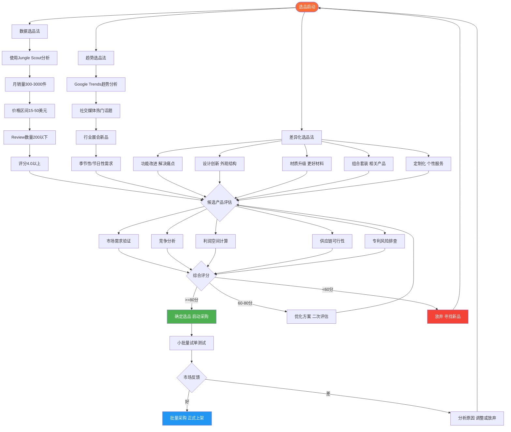
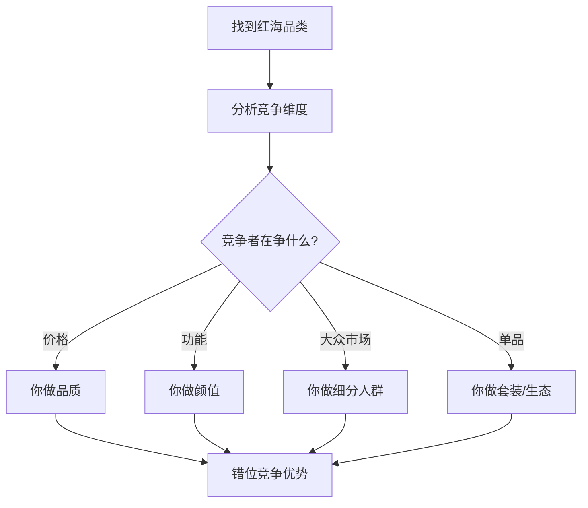
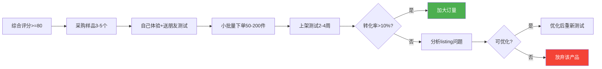

## 三、选品策略详解

选品是跨境电商的生死线。行业中流传一句话："七分靠选品，三分靠运营。"这句话并非夸张——一个优秀的运营团队无法拯救一个错误的产品选择，而一个正确的产品即使运营平庸也能带来可观利润。本章将从数据驱动、趋势捕捉、差异化创新三个维度，系统拆解选品的完整方法论，并给出可直接落地的实操流程。

### 跨境电商选品决策总流程



> **选品铁律：** ①数据驱动，不要凭感觉选品；②先小批量测试，确认市场后再大批量采购；③利润率必须在20%以上；④避免侵权产品，做好专利排查。

---

### 3.1 数据选品法

数据选品是目前最主流、最可靠的选品方法论。其核心逻辑是：**不靠直觉，靠数据说话**。通过对平台公开数据的分析，找到需求旺盛但竞争尚不饱和的产品机会。

#### 3.1.1 为什么数据选品是首选方法

在跨境电商早期，很多卖家靠"我觉得这个好卖"来选品，成功率极低。数据选品的价值在于：

- **消除主观偏见**：你认为好卖的产品，可能市场已经饱和；你觉得小众的品类，可能搜索量正在暴涨
- **量化评估标准**：用月销量、搜索量、竞争指数等客观指标代替主观判断
- **降低试错成本**：在投入资金之前，先用数据验证市场可行性
- **可复制可迭代**：同一套方法论可以反复使用，经验可以积累

数据选品的本质是**在需求和竞争之间找到甜蜜点**——有足够的市场需求保证销量，又不至于陷入红海价格战。

#### 3.1.2 核心工具矩阵

| 工具 | 功能定位 | 适用平台 | 价格区间 | 适合阶段 |
|------|----------|----------|----------|----------|
| Jungle Scout | 亚马逊选品全套 | Amazon | $49-$129/月 | 入门到专业 |
| Helium 10 | 关键词+选品+运营 | Amazon | $39-$249/月 | 进阶卖家 |
| Keepa | 价格历史追踪 | Amazon | €19/月 | 价格分析 |
| Sorftime | 中国卖家选品 | Amazon | ¥99-¥399/月 | 中文友好 |
| AliExpress Dropshipping Center | 趋势产品发现 | AliExpress | 免费 | 独立站选品 |
| Google Keyword Planner | 搜索量数据 | 全网 | 免费 | 需求验证 |
| Ahrefs/SEMrush | SEO关键词分析 | 全网 | $99-$199/月 | 独立站选品 |
| EcomHunt | 爆款产品发现 | 多平台 | $29/月 | Dropshipping |
| FindNiche | 速卖通选品 | AliExpress | $9-$59/月 | 入门选品 |

#### 3.1.3 Jungle Scout实操全流程

Jungle Scout是亚马逊卖家使用最广泛的选品工具，下面详细拆解其使用流程：

**第一步：关键词研究**

打开Jungle Scout的Keyword Scout，输入你感兴趣的品类大词。例如你想做家居类目，输入"storage organizer"。

工具会返回：
- 月搜索量（反映需求强度）
- 搜索趋势（上升/平稳/下降）
- 竞争度（广告竞价高低反映竞争激烈程度）
- 相关长尾词（细分机会）

**关键筛选标准：**

```text
月搜索量门槛：> 5,000次/月（太低说明需求不足）
趋势方向：上升或平稳（避免下降趋势品类）
竞争度：中低（广告CPC < $1.5为佳）
长尾词数量：越多越好（说明细分机会丰富）
```

**第二步：产品数据库筛选**

进入Product Database，设置以下筛选条件：

| 筛选维度 | 推荐范围 | 原因说明 |
|----------|----------|----------|
| 月销量 | 300 - 3000件 | 低于300说明市场太小，高于3000竞争过于激烈 |
| 价格区间 | $15 - $50 | 低于$15利润太薄，高于$50资金压力大且退货率高 |
| Review数量 | < 200条 | 说明竞争者尚未建立绝对壁垒 |
| 评分 | 4.0 - 4.7分 | 4.0以下说明产品有硬伤，4.7以上说明品质要求极高 |
| 上架时间 | < 2年 | 太老的listing权重已固化，新品难突破 |
| 卖家数量 | < 50个 | 太多卖家说明过度竞争 |

**第三步：竞品深度分析**

找到候选产品后，不要急着下结论。逐一打开排名前10-20的竞品listing，记录以下数据：

- **BSR（Best Seller Rank）走势**：用Keepa追踪，看是否稳定
- **价格波动范围**：如果竞品频繁降价，说明利润空间被压缩
- **Review增长速度**：增长太快说明竞争加剧
- **QA（问答）数量**：越多说明买家疑虑越多，你可以在listing中提前解答
- **图片质量**：如果竞品图片都很差，说明有通过视觉升级做差异化的空间
- **Listing完整度**：A+页面、视频、品牌故事——如果竞品都没做，这是你的机会

**第四步：利润空间计算**

数据选品最核心的一步是利润计算。以下是标准的利润计算模板：

```text
售价                    $30.00
─────────────────────────────
减：亚马逊佣金(15%)     -$4.50
减：FBA配送费           -$5.50
减：头程物流费(海运)    -$1.50
减：产品采购成本        -$6.00
减：包装费用            -$0.50
减：广告费(按15%预估)   -$4.50
减：退货损耗(按3%)      -$0.90
减：其他杂费            -$0.60
─────────────────────────────
毛利润                   $6.00
毛利率                   20.0%
```

**利润红线**：毛利率低于20%的产品不建议做。跨境电商的隐性成本（库存积压、汇率波动、平台罚款）远比想象中多，20%是安全底线。

**第五步：Jungle Scout评分判读**

Jungle Scout的Opportunity Score是一个0-10的综合评分：

| 评分区间 | 含义 | 建议行动 |
|----------|------|----------|
| 8-10分 | 高需求低竞争，黄金机会 | 重点研究，快速验证 |
| 6-7分 | 机会不错但有竞争 | 需要差异化策略 |
| 4-5分 | 一般机会，需要权衡 | 谨慎评估，寻找切入点 |
| 1-3分 | 高竞争或低需求 | 建议放弃 |

#### 3.1.4 进阶数据分析技巧

**销量天花板预估**

不要只看当前销量，要预估这个品类的天花板在哪里。方法：

1. 查看该关键词的月搜索量总量
2. 估算品类前10名的总销量占比（通常占品类总销量的60-70%）
3. 用前10名总销量除以品类集中度，得出品类总容量
4. 评估你能在其中拿到多少份额

**季节性判断**

很多产品有明显的季节性，如果你在旺季的数据来选品，会严重高估市场容量。正确做法：

1. 用Google Trends查看该关键词过去5年的搜索趋势
2. 计算旺季/淡季的搜索量比值
3. 如果比值超过3:1，说明季节性很强，需要更高的利润率来覆盖淡季
4. 全年型产品（搜索量波动<30%）更适合新手

**竞争格局分析**

用Seller Central的Brand Analytics（如果你有亚马逊卖家账号）或第三方工具，分析品类的竞争格局：

- **垄断程度**：前3名卖家的市场份额是否超过50%？如果是，新卖家很难突破
- **品牌占比**：大品牌（如Anker、3M）占比多少？如果超过70%，小卖家要慎重
- **新品存活率**：过去6个月新上架的产品，有多少还活着？

---

### 3.2 趋势选品法

趋势选品的核心逻辑是：**在需求爆发之前提前布局**。与数据选品看现有市场不同，趋势选品关注的是未来市场。这种方法的风险更高，但回报也更大——你能在竞争者反应之前抢占市场。

#### 3.2.1 趋势选品的底层逻辑

消费者的需求变化遵循一定规律：


趋势选品的目标是在**C阶段（社交媒体放大）到D阶段（搜索量上升）之间**介入。太早（A-B阶段）市场还没形成，太晚（E-F阶段）竞争已经激烈。

#### 3.2.2 Google Trends深度使用

Google Trends是趋势选品的基础工具，免费且数据权威。

**基础操作步骤：**

1. 访问 [trends.google.com](https://trends.google.com)
2. 输入产品关键词（建议用英文）
3. 设置时间范围为过去12个月或过去5年
4. 设置地区为目标市场（如美国、英国）
5. 分析曲线走势

**关键判读标准：**

| 趋势特征 | 图形表现 | 判断 | 行动建议 |
|----------|----------|------|----------|
| 持续上升 | 平滑上升曲线 | 强势趋势 | 重点布局 |
| 突然暴涨 | 急剧上升后回落 | 短期热点 | 快进快出，不建议新手 |
| 季节性波动 | 规律性峰谷交替 | 季节品 | 需要全年利润模型 |
| 平稳无变化 | 水平直线 | 成熟市场 | 适合存量竞争 |
| 持续下降 | 平滑下降曲线 | 衰退市场 | 避开 |

**进阶技巧——对比分析：**

在Google Trends中同时输入5个相关关键词，对比它们的搜索趋势。例如搜索"yoga mat"时，同时添加"yoga block""yoga strap""yoga wheel""yoga towel"：

- 如果"yoga wheel"的曲线斜率最陡，说明这个细分品类增长最快
- 如果"yoga mat"已经平稳而"yoga wheel"还在上升，说明后者是更好的切入点

**相关查询功能：**

在Google Trends页面下方，有一个"Related queries"（相关查询）板块，显示与你搜索词相关的上升搜索词。这些往往就是潜在的选品方向——人们正在搜索什么，就说明他们想买什么。

重点关注标注为"Breakout"（突破）的关键词，表示搜索量增长超过5000%，这是最强的趋势信号。

#### 3.2.3 社交媒体趋势捕捉

社交媒体是趋势最早的放大器。不同平台捕捉不同类型的消费趋势：

**TikTok/抖音**

- **关注标签**：#TikTokMadeMeBuyIt 是最大的选品金矿
- **观察周期**：从视频爆火到电商销量增长，通常有2-4周的窗口期
- **工具辅助**：使用Kalodata或FastMoss分析TikTok热销产品
- **注意事项**：TikTok爆款的生命周期通常只有2-6个月，不适合投入太重的品类

**Pinterest**

- Pinterest是消费趋势的"早期预警系统"，因为用户在这里搜索的是"想要的东西"
- 关注Pinterest Trends（trends.pinterest.com）的上升搜索词
- Pinterest的趋势通常比电商平台提前3-6个月

**Instagram/小红书**

- 关注网红带货的产品类型
- 注意评论区的"在哪里买""求链接"——这是最强的购买信号
- 小红书上的"好物分享"类内容是中文市场的趋势风向标

**Reddit/论坛**

- Reddit的r/BuyItForLife、r/ShutUpAndTakeMyMoney等子版块是发现产品机会的好地方
- 关注用户的吐槽和需求——"我希望有人能做一个XXX"就是选品灵感

#### 3.2.4 行业展会与供应链趋势

线下展会是发现未上市产品和供应链趋势的绝佳渠道：

| 展会名称 | 地点 | 时间 | 特色 |
|----------|------|------|------|
| 广交会（Canton Fair） | 广州 | 4月/10月 | 中国最大的综合性贸易展 |
| 义乌小商品博览会 | 义乌 | 10月 | 小商品品类最全 |
| 深圳礼品展 | 深圳 | 4月/10月 | 创意礼品、家居 |
| CES | 拉斯维加斯 | 1月 | 消费电子趋势前沿 |
| ASD Market Week | 拉斯维加斯 | 3月/8月 | 美国最大的消费品展 |
| Global Sources | 香港 | 4月/10月 | 电子产品、礼品 |

**展会选品技巧：**

1. 带着问题去，不要漫无目的闲逛
2. 重点关注"新品发布区"和"创新产品奖"展区
3. 与供应商交流时，主动询问"最近什么产品卖得好"
4. 拍照记录所有感兴趣的产品，回来后用数据工具验证

#### 3.2.5 季节性与节日性选品日历

跨境电商有明显的季节性周期，提前布局是关键：

| 时间节点 | 距离节日 | 选品方向 | 备注 |
|----------|----------|----------|------|
| 1月 | 距情人节3周 | 情侣产品、礼品、装饰 | 情人节是美国第二大消费节日 |
| 2-3月 | 距母亲节2个月 | 家居、美容、厨房用品 | 提前2个月备货 |
| 4-5月 | 距夏季1-2个月 | 户外、泳池、露营用品 | 夏季是户外品类黄金期 |
| 6-7月 | 距返校季1个月 | 文具、背包、电子配件 | 返校季是第三大消费季 |
| 8-9月 | 距Q4旺季2-3个月 | 全品类备货 | 为黑五/圣诞做准备 |
| 10-11月 | 旺季期间 | 节日装饰、礼品 | 黑五到圣诞是最大旺季 |

**重要提醒**：季节性产品的备货需要提前2-3个月。如果你在10月才开始研究圣诞产品，已经来不及了。正确的时间线是7-8月选品，9月到货，10月上架优化listing，11月迎接流量高峰。

#### 3.2.6 趋势选品的风险管理

趋势选品的最大风险是**把短期热点当成长期趋势**。如何区分：

| 判断维度 | 长期趋势 | 短期热点 |
|----------|----------|----------|
| 搜索持续时间 | 持续6个月以上上升 | 突然暴涨后快速回落 |
| 社交媒体讨论 | 多平台、多话题 | 集中在单一事件 |
| 媒体报道 | 行业媒体深度分析 | 娱乐媒体炒作 |
| 供应链反应 | 多家工厂开始生产 | 仅少数工厂跟风 |
| 消费者行为 | 复购、推荐行为出现 | 一次性尝鲜 |

**风险控制策略：**

- 趋势品的首批订单量控制在正常品的50%以内
- 设置止损线：上架30天无销量，果断清仓
- 不要all-in单一趋势品，保持产品组合的多样性
- 趋势品的利润目标可以适当提高（30%+），以覆盖更高的风险

---

### 3.3 差异化选品法

差异化选品的核心逻辑是：**不创造需求，而是在已有需求中做得更好**。你不需要发明一个全新产品，只需要找到现有产品的痛点，然后解决它。这是最适合中小卖家的策略——风险低，门槛适中，利润空间大。

#### 3.3.1 差异化的五个维度

**维度一：功能改进**

这是最直接的差异化方式。核心步骤：

1. 找到目标产品的差评（1-3星Review）
2. 归类买家抱怨的核心问题
3. 针对性改进这些问题
4. 在listing中强调"解决了XXX问题"

**实操案例：**

假设你选中了"硅胶烘焙模具"这个品类，通过分析100条差评，发现以下核心痛点：

| 差评归类 | 出现频率 | 改进方案 | 成本增加 |
|----------|----------|----------|----------|
| 脱模困难 | 35% | 表面做磨砂处理 | +$0.3 |
| 变形 | 28% | 增加厚度从2mm到3mm | +$0.5 |
| 异味 | 20% | 使用食品级铂金硅胶 | +$0.8 |
| 颜色单一 | 12% | 提供6色可选套装 | +$1.0 |
| 尺寸不合适 | 5% | 增加更多尺寸选项 | +$0.2 |

通过解决前三个核心痛点（成本增加$1.6），你可以把售价从$15提高到$22，并且获得更好的评价，形成正向循环。

**维度二：设计创新**

当功能改进空间有限时，外观和结构的创新是另一条路：

- **颜色创新**：市场上全是黑色产品？推出莫兰迪色系
- **造型创新**：方方正正的产品？试试圆润可爱的设计
- **包装创新**：用精美礼盒包装替代简单塑料袋，瞄准送礼场景
- **结构创新**：可折叠、可组合、模块化设计

设计创新的风险在于模具费用较高（通常$1,000-$5,000），因此必须在数据验证市场后再投入。建议先用3D渲染图测试市场反应，再开模生产。

**维度三：材质升级**

材质升级是提升产品溢价空间的有效手段：

- 不锈钢替代塑料（厨房用品）
- 实木替代MDF板（家具/装饰品）
- 纯棉替代涤纶（纺织品）
- 食品级硅胶替代普通硅胶（母婴用品）

材质升级的关键是**在listing中明确传达材质优势**。普通消费者看不懂技术参数，你需要用通俗语言解释："普通硅胶加热后可能释放有害物质，我们使用的铂金硅胶通过FDA认证，安全无毒。"

**维度四：组合套装**

组合套装的逻辑是**提高客单价和使用便利性**：

- 功能组合：把相关功能的产品打包（如瑜伽垫+瑜伽砖+瑜伽带+瑜伽毛巾）
- 场景组合：围绕特定使用场景组合（如"旅行化妆包套装"含化妆包+镜子+刷具+收纳袋）
- 消耗品组合：把主品和耗材组合（如电动牙刷+6个替换刷头）

组合套装的优势：

1. 提高客单价，分摊获客成本
2. 降低买家的决策成本（一次买齐）
3. 提高竞争门槛（竞品难以完全复制你的组合）
4. 降低差评率（完整解决方案比单个产品体验更好）

组合套装的定价策略：套装价格应该是单品总价的70-80%。例如三个单品分别$15、$10、$8，总价$33，套装定价$25，让买家感觉"省了$8"。

**维度五：定制化服务**

定制化是差异化策略中门槛最高但利润也最高的方式：

- **刻字/印花定制**：名字、日期、图案（适用于水杯、首饰、钥匙扣）
- **颜色定制**：让买家从多种颜色中选择
- **功能定制**：不同尺寸、不同配置
- **包装定制**：个性化礼盒、贺卡

定制化产品通常需要使用POD（Print on Demand）服务或与工厂协商小批量MOQ（最小起订量）。适合的平台有Printful、Printify、Gelato等。

#### 3.3.2 差异化的"错位竞争"策略

差异化不是让你做得比竞品好一点，而是让竞品无法直接与你比较。这就是错位竞争：



**具体案例：宠物用品市场**

宠物用品是典型的红海品类。直接做"宠物碗"几乎不可能成功。但通过错位竞争：

| 竞争者的定位 | 你的错位切入点 | 目标人群 |
|-------------|---------------|----------|
| 大众宠物碗 | 慢食碗（防狼吞虎咽） | 有进食过快问题的宠物主人 |
| 通用尺寸 | 大型犬专用碗 | 金毛、拉布拉多等大犬主人 |
| 功能导向 | 高颜值设计师碗 | 注重家居审美的宠物主人 |
| 单品销售 | 碗+餐垫+围嘴套装 | 想要一步到位的宠物主人 |
| 实体碗 | 可折叠旅行碗 | 经常带宠物出行的主人 |

#### 3.3.3 差异化的风险评估矩阵

不是所有差异化都值得投入。用以下矩阵评估：

| 评估维度 | 高分(3分) | 中分(2分) | 低分(1分) |
|----------|-----------|-----------|-----------|
| 专利风险 | 无相关专利 | 有相似但不相同专利 | 核心功能已被专利保护 |
| 成本增量 | 增加<10% | 增加10-30% | 增加>30% |
| 市场验证 | 差评中明确提到此需求 | 社交媒体有人讨论 | 仅凭个人判断 |
| 供应链 | 现有供应商即可实现 | 需要找新供应商 | 需要定制模具/设备 |
| 溢价空间 | 可提价20%+ | 可提价10-20% | 无法提价 |

**总分13-15分**：强烈建议执行差异化
**总分9-12分**：值得尝试，但控制投入
**总分5-8分**：差异化风险较大，谨慎考虑

#### 3.3.4 差异化的常见误区

**误区一：过度差异化**

差异化不是越多越好。如果你同时改了功能、材质、设计、包装，成本可能从$5涨到$12，售价从$20涨到$40，反而失去竞争力。

**正确做法**：每次只做1-2个核心差异化点，其他的保持行业中等水平。

**误区二：为差异化而差异化**

有些改进虽然不同，但消费者并不在意。比如给垃圾袋加"薰衣草香味"——听起来是创新，但消费者买垃圾袋的需求是"结实不漏"，香味只是锦上添花。

**正确做法**：差异化必须基于真实需求。差评、论坛吐槽、社交媒体评论是最好的需求来源。

**误区三：忽视成本可行性**

有些差异化方案理论上很好，但成本增加太多，导致产品失去价格竞争力。比如把不锈钢水杯换成钛合金——性能确实更好，但成本增加300%，目标人群大幅缩小。

**正确做法**：在设计差异化方案时，同步计算成本增量和售价增量。只有当售价增量明显大于成本增量时，差异化才有意义。

**误区四：没有验证专利风险**

你辛辛苦苦开发的差异化产品，上架后被竞争对手发起专利投诉，listing被下架，库存积压——这是最惨痛的教训。

**正确做法**：在投入差异化之前，必须进行专利检索：
1. 在USPTO（美国专利商标局）网站搜索相关专利
2. 在Google Patents搜索产品功能相关专利
3. 在亚马逊上搜索同类产品，查看是否有"Patent"标记
4. 如有疑虑，花$200-$500请专业律师做专利风险评估

---

### 3.4 选品综合评估框架

无论你用哪种选品方法找到候选产品，最终都需要一个统一的评估框架来做决策。以下是经过实战验证的五维评估模型：

#### 3.4.1 五维评分模型

| 评估维度 | 权重 | 评分标准（1-10分） |
|----------|------|-------------------|
| 市场需求 | 25% | 月搜索量、销量趋势、市场容量 |
| 竞争强度 | 25% | Review数量、卖家数量、品牌壁垒 |
| 利润空间 | 20% | 毛利率、客单价、退货率 |
| 供应链 | 15% | MOQ、交期、供应商数量、品质稳定性 |
| 风险控制 | 15% | 专利风险、季节性、合规性、退货率 |

**评分方法：**

每个维度打1-10分，然后按权重加权计算总分。总分80分以上的产品，可以进入下一阶段；60-80分的产品需要优化方案后重新评估；60分以下的产品直接放弃。

#### 3.4.2 快速验证流程

通过综合评估后，不要急于大批量采购。正确的验证流程：



**小批量测试的关键指标：**

- **点击率（CTR）**：主图是否有吸引力，目标>3%
- **转化率（CR）**：listing是否有说服力，目标>10%
- **退货率**：产品质量是否过关，红线<5%
- **Review评分**：早期评价的分数，红线>4.0
- **广告ACoS**：广告投入产出比，红线<40%

如果小批量测试的数据不达标，先检查listing优化（图片、标题、价格、A+页面），再考虑产品本身是否有问题。很多时候，不是产品不好，而是listing没有把产品的优势传达给消费者。

#### 3.4.3 选品决策检查清单

在做出最终选品决定前，用这个清单逐项确认：

- [ ] 月搜索量 > 5,000（市场需求充足）
- [ ] 月销量在300-3,000之间（不是太冷门也不是太红海）
- [ ] 前10名卖家平均Review < 200条（竞争壁垒可追赶）
- [ ] 售价$15-$50（适合冲动消费区间）
- [ ] 毛利率 > 20%（扣除所有成本后仍有利润）
- [ ] 重量 < 5磅（物流成本可控）
- [ ] 非易碎品（退货率可控）
- [ ] 无专利风险（USPTO已查证）
- [ ] 无需认证或已获取相关认证（FDA、CE、FCC等）
- [ ] 供应商至少3家（供应链安全）
- [ ] MOQ < 500件（资金压力可控）
- [ ] 非季节性产品或季节性已纳入利润模型
- [ ] 有差异化空间（至少一个明确的改进点）

全部勾选的产品，可以直接进入采购阶段。有1-3项未勾选的，需要评估风险后决定。超过3项未勾选的，建议放弃。

---

### 3.5 选品常见误区与纠正

#### 误区一：凭个人喜好选品

**错误表现**："我自己很喜欢这个产品，觉得肯定好卖。"

**纠正方法**：你的喜好不代表市场。你不喜欢的产品可能卖得很好，你喜欢的产品可能无人问津。永远用数据说话，个人喜好只能作为初筛的参考。

#### 误区二：盲目跟卖爆款

**错误表现**："这个产品月销10万件，我也要卖！"

**纠正方法**：当你看到一个产品已经月销10万件时，说明市场已经成熟，竞争已经白热化。你需要问的是：前10名卖家有多少条Review？他们的价格战打到什么程度了？你有什么差异化优势？如果答案是否定的，这个爆款和你无关。

#### 误区三：只看利润率不看周转率

**错误表现**："这个产品利润率50%，太好了！"

**纠正方法**：利润率50%但一个月只卖10件，不如利润率20%但一个月卖500件。真正重要的是**资金回报率**（ROI）= 利润率 × 周转率。一个产品一年能周转4次，每次利润率20%，年化回报80%；另一个产品一年周转1次，利润率50%，年化回报50%。前者明显更优。

#### 误区四：忽视合规和认证

**错误表现**："先卖着再说，有问题再处理。"

**纠正方法**：跨境电商的合规问题不是小问题。FDA（美国食品药品监管）、CE（欧盟认证）、FCC（美国通信认证）等认证是硬性要求。一旦被查，产品下架、库存扣押、罚款都是小事，严重的可能面临法律诉讼。在选品阶段就要确认目标市场是否需要认证，认证的时间和费用是否在预算范围内。

#### 误区五：忽略退货率对利润的侵蚀

**错误表现**："退货率8%，还可以接受。"

**纠正方法**：退货率8%意味着每100单有8单退货。退货不只是损失产品成本，还有来回运费（跨境运费通常$5-$15/单）、包装损耗、仓储费、二次质检的人工成本。实际上8%的退货率可能侵蚀15-20%的利润。选品时应优先选择退货率低的品类——功能性产品（如厨房工具）比主观性强的产品（如服装、化妆品）退货率低得多。

#### 误区六：选品范围太广

**错误表现**："今天研究厨房用品，明天看户外装备，后天看美妆工具。"

**纠正方法**：选品要有专注度。深入研究一个品类，比浅尝辄止十个品类有效得多。建议选定一个大类（如"厨房用品"），然后在这个范围内用数据工具找到细分机会。专注的好处是：你对这个品类的供应链、竞品、消费者需求都有深入了解，做出的决策质量更高。

---

### 3.6 进阶：AI辅助选品工作流

随着AI工具的发展，选品效率可以大幅提升。以下是用AI辅助选品的工作流：

#### 3.6.1 AI辅助Review分析

传统方法需要手动阅读数百条Review来找痛点。用AI可以批量处理：

```cpp
步骤一：用Helium 10或Jungle Scout导出竞品的Review数据
步骤二：将Review数据导入ChatGPT/Claude
步骤三：让AI完成以下分析：
  - 将差评归类为5-8个核心问题
  - 统计每个问题的出现频率
  - 识别买家最在意的3个改进方向
  - 总结买家对价格的敏感度
  - 分析好评中买家最看重的卖点
```

#### 3.6.2 AI辅助市场分析

```text
步骤一：收集品类数据（搜索量、销量、价格分布）
步骤二：让AI完成以下分析：
  - 市场集中度分析（前10名卖家的市场份额）
  - 价格带分布（哪个价位段竞争最少）
  - 趋势预测（基于历史数据的未来3-6个月走势）
  - 竞争策略建议（基于现有竞争格局的切入策略）
```

#### 3.6.3 AI辅助Listing优化

选品和listing优化是紧密关联的。在选品阶段就开始构思listing：

```text
步骤一：确定目标关键词
步骤二：让AI生成：
  - 5个标题方案（含主关键词和卖点）
  - 5条核心卖点（Bullet Points）
  - 产品描述的框架
  - A+页面的文案大纲
步骤三：用AI对比你的方案和竞品listing的差异
```

---

### 本节要点回顾

| 要点 | 核心内容 |
|------|----------|
| 数据选品 | 用Jungle Scout等工具，基于月销量、价格、Review数等指标筛选产品 |
| 趋势选品 | 用Google Trends、社交媒体、展会等渠道发现未来需求 |
| 差异化选品 | 从功能、设计、材质、组合、定制五个维度做差异化 |
| 综合评估 | 五维评分模型（需求25%+竞争25%+利润20%+供应链15%+风险15%） |
| 风险控制 | 先小批量测试，数据达标后再扩大；利润红线20% |
| 常见误区 | 不凭感觉、不盲目跟爆款、重视周转率而非单次利润率 |
