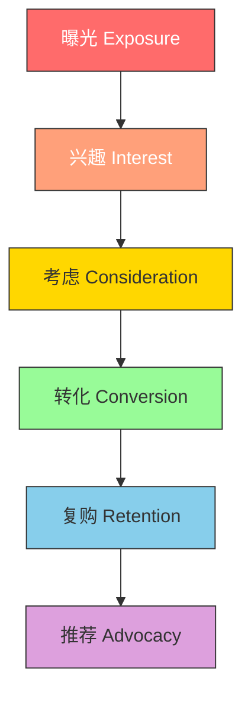
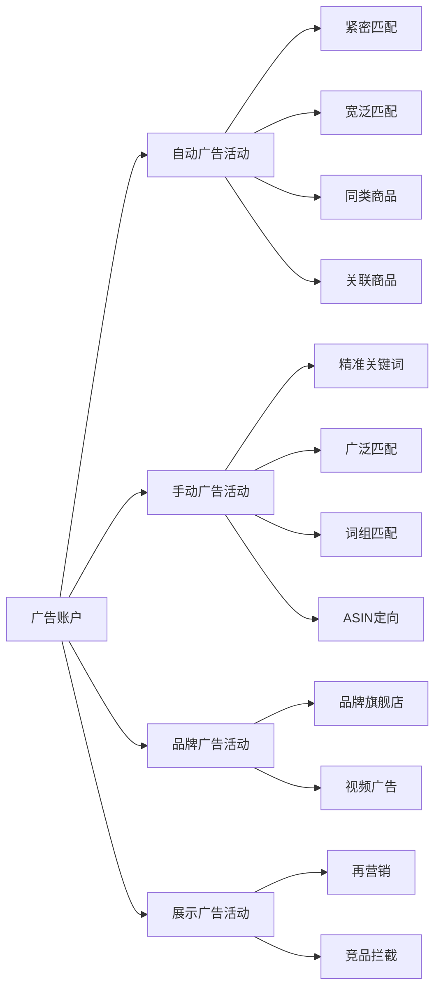
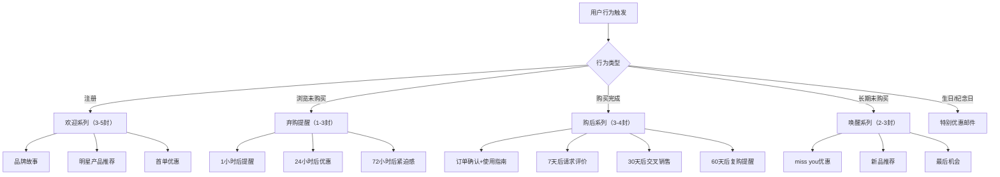
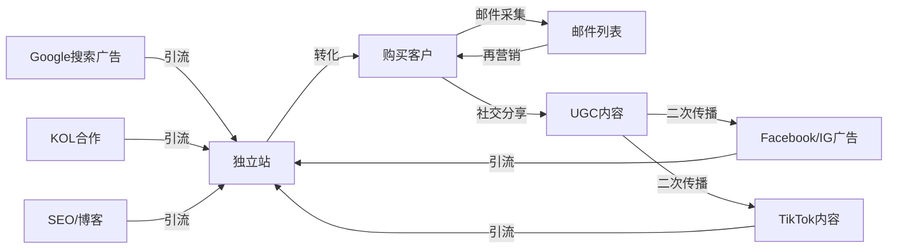

## 四、海外营销推广

跨境电商的竞争，本质上是流量的竞争。产品再好，没有精准的流量触达目标消费者，一切都是空谈。海外营销推广的核心逻辑可以用一句话概括：**在正确的时间，通过正确的渠道，把正确的信息传递给正确的人**。

本章将系统讲解跨境电商的主流推广渠道，从平台内广告到站外引流，从付费推广到自然流量获取，帮助你建立完整的海外营销知识体系。

### 1. 海外营销的底层逻辑

#### 1.1 流量漏斗模型

海外营销的本质是构建一个从曝光到转化的流量漏斗：



每一层都有对应的营销策略：

| 漏斗阶段 | 目标 | 核心指标 | 对应渠道 |
|----------|------|----------|----------|
| 曝光 | 让目标用户看到你 | 展示量（Impressions）、触达人数 | 品牌广告、社媒内容、SEO |
| 兴趣 | 引起用户关注 | 点击率（CTR）、互动率 | 信息流广告、KOL合作、短视频 |
| 考虑 | 建立信任和购买意向 | 页面停留时间、加购率 | 产品详情页优化、评价管理、A+页面 |
| 转化 | 完成购买 | 转化率（CVR）、ACoS | 促销活动、优惠券、再营销广告 |
| 复购 | 重复购买 | 复购率、客户终身价值（LTV） | 邮件营销、会员体系、订阅服务 |
| 推荐 | 口碑传播 | 推荐率、NPS评分 | 推荐奖励计划、UGC激励 |

#### 1.2 公域流量 vs 私域流量

理解公域和私域的区别，是制定营销策略的基础：

**公域流量**：平台分配的流量，你无法控制。典型代表是亚马逊搜索流量、Facebook广告流量。优势是量大、起效快；劣势是成本持续上升、受平台政策约束。

**私域流量**：你自己拥有的、可以反复触达的流量。典型代表是邮件列表、WhatsApp社群、品牌App用户。优势是成本低、可反复触达、不受平台限制；劣势是需要时间积累。

成熟的跨境电商卖家通常采用"公域获客、私域沉淀"的策略：通过亚马逊等平台获取第一批客户，然后通过包装卡片、邮件等方式将客户引导到自己的私域体系中。

#### 1.3 营销预算分配原则

新卖家常见的错误是把所有预算押在一个渠道上。合理的预算分配框架如下：

| 阶段 | 付费广告占比 | 内容/SEO占比 | KOL/社媒占比 | 预留测试占比 |
|------|-------------|-------------|-------------|-------------|
| 冷启动期（0-3月） | 60-70% | 10-15% | 10-15% | 10% |
| 增长期（3-12月） | 40-50% | 20-25% | 20-25% | 10% |
| 成熟期（12月+） | 30-40% | 25-30% | 20-25% | 10% |

冷启动期需要快速获取数据验证产品，因此付费广告占比最高。随着品牌认知度提升，自然流量和内容流量的占比应该逐步提高，降低对付费流量的依赖。

### 2. 亚马逊站内广告（Amazon PPC）

亚马逊站内广告是跨境电商卖家最核心的推广手段，直接决定了产品在平台上的可见度和销量。

#### 2.1 广告类型全解析

亚马逊提供三种主要广告类型，各有适用场景：

**Sponsored Products（商品推广）**
- 展示位置：搜索结果页、商品详情页
- 适用场景：所有阶段的卖家，推新品、打排名、防御竞品
- 计费方式：CPC（按点击付费）
- 这是使用最广泛、ROI最可控的广告类型

**Sponsored Brands（品牌推广）**
- 展示位置：搜索结果顶部横幅位
- 适用场景：已注册品牌备案（Brand Registry）的卖家
- 计费方式：CPC
- 优势：展示品牌Logo和多个产品，提升品牌认知

**Sponsored Display（展示型推广）**
- 展示位置：亚马逊站内外（包括第三方网站）
- 适用场景：再营销、竞品拦截、拓展站外流量
- 计费方式：CPC 或 vCPM（按千次展示付费）
- 优势：可以定向竞品的详情页、浏览过你产品的用户

#### 2.2 广告架构搭建

一个高效的广告架构应该包含多个广告活动（Campaign），每个活动有明确的目标：



**新品推广的广告组合策略**：

1. **第1-2周：自动广告探路**
   - 开启自动广告，竞价略高于建议竞价
   - 目的：让亚马逊的算法探索你的产品适合哪些关键词
   - 每天预算 $20-50，观察7-14天数据

2. **第3-4周：手动广告精准投放**
   - 从自动广告的搜索词报告中，筛选出转化好的关键词
   - 建立手动精准匹配广告组，提高竞价
   - 同时开启手动广泛匹配，持续拓词

3. **第5-8周：品牌广告+展示广告**
   - 开启Sponsored Brands，展示品牌Logo和多个产品
   - 开启Sponsored Display，定向竞品ASIN
   - 建立再营销广告组，覆盖浏览未购买的用户

4. **持续优化**
   - 每周分析搜索词报告，添加否定关键词
   - 根据ACoS调整竞价
   - 测试新的广告素材和文案

#### 2.3 关键词策略

关键词是亚马逊广告的核心。一个完整的关键词策略包含三个层次：

**核心关键词（Head Keywords）**
- 搜索量大、竞争激烈的短词，如"wireless earbuds"
- 通常由大品牌和头部卖家占据
- 新卖家不建议直接竞争，先用长尾词积累权重

**中尾关键词（Mid-tail Keywords）**
- 搜索量中等、竞争适中的词，如"wireless earbuds for running"
- 转化率通常比核心词高
- 新卖家的主要战场

**长尾关键词（Long-tail Keywords）**
- 搜索量小、竞争低、意图明确的词，如"wireless earbuds for running with ear hooks ipx7"
- 转化率最高，ACoS最低
- 用自动广告和工具挖掘

**关键词挖掘工具**：

| 工具 | 功能 | 价格 | 推荐指数 |
|------|------|------|----------|
| Helium 10 | 关键词研究、竞品分析、Listing优化 | $29-229/月 | ★★★★★ |
| Jungle Scout | 关键词研究、选品、销量预估 | $29-84/月 | ★★★★☆ |
| Sellics (Perpetua) | 广告自动化、关键词追踪 | $250+/月 | ★★★★☆ |
| Amazon Brand Analytics | 品牌备案卖家免费使用 | 免费 | ★★★★★ |
| Google Keyword Planner | 跨平台关键词研究 | 免费 | ★★★☆☆ |

#### 2.4 广告优化核心指标

| 指标 | 含义 | 健康范围 | 优化方向 |
|------|------|----------|----------|
| ACoS（广告销售成本比） | 广告花费/广告销售额 | 15-30% | 越低越好，但新品期可接受30-50% |
| TACoS（总广告成本比） | 广告花费/总销售额 | 5-15% | 反映广告对整体业务的贡献 |
| CTR（点击率） | 点击数/展示数 | 0.3-0.8% | 低于0.3%需优化主图和标题 |
| CVR（转化率） | 订单数/点击数 | 10-20% | 低于10%需优化详情页和价格 |
| CPC（每次点击成本） | 广告花费/点击数 | 因品类而异 | 通过提高质量得分降低 |
| ROAS（广告回报率） | 广告销售额/广告花费 | 3-10 | 越高越好 |

#### 2.5 常见广告问题诊断

**问题1：高曝光、低点击（CTR低）**
- 原因：主图不吸引人、标题不相关、价格无竞争力
- 解决：A/B测试主图（使用Amazon Manage Your Experiments）、优化标题包含核心卖点、检查价格是否在竞品区间内

**问题2：高点击、低转化（CVR低）**
- 原因：详情页质量差、评价少或评分低、价格偏高
- 解决：优化A+页面和视频、积累评价（Vine计划、Request a Review）、设置优惠券或促销

**问题3：ACoS居高不下**
- 原因：关键词不精准、竞价过高、产品竞争力不足
- 解决：否定无效搜索词、降低竞价使用"动态竞价-仅降低"策略、暂停转化差的关键词

**问题4：广告依赖症（停广告就没单）**
- 原因：自然排名没有起来、产品缺乏差异化
- 解决：用广告推动核心关键词自然排名上升、优化Listing提升自然搜索权重、同时发展站外流量

### 3. 搜索引擎优化（SEO）

SEO是获取免费流量的长期策略。对于独立站卖家，SEO几乎是最核心的流量来源；对于亚马逊卖家，Listing SEO直接影响站内搜索排名。

#### 3.1 亚马逊Listing SEO

亚马逊的A10算法决定了搜索结果排名。影响排名的核心因素：

**相关性因素**
- 标题（Title）：包含核心关键词，前80个字符最重要
- 要点（Bullet Points）：每条一个卖点，自然融入关键词
- 后台搜索词（Search Terms）：250字节，填入标题中未出现的关键词
- 产品描述/A+内容：深度使用场景描述，覆盖更多长尾词

**转化率因素**
- 销量和销售速度（BSR排名）
- 评价数量和评分
- 价格竞争力
- 图片质量和数量（建议7张以上，包含生活场景图和信息图）

**Listing优化模板**：

```text
标题结构：[品牌名] + [核心关键词] + [关键属性1] + [关键属性2] + [使用场景/人群] + [规格/数量]

示例（差）：Bluetooth Earbuds Wireless Headphones
示例（好）：SoundCore by Anker Life P3 Wireless Earbuds, Active Noise Cancelling, 
           6 Microphones, Deep Bass, IPX5 Waterproof, 35H Playtime, App Control
```

#### 3.2 独立站Google SEO

独立站SEO是一个系统工程，核心分为三个层面：

**技术SEO（Technical SEO）**
- 网站加载速度：移动端加载时间控制在3秒以内
- 移动端适配：Google采用移动优先索引
- SSL证书：HTTPS是排名信号
- 网站结构：清晰的URL层级，如 `/collections/wireless-earbuds/product-name`
- Sitemap和Robots.txt：确保搜索引擎能正确抓取
- 结构化数据（Schema Markup）：产品Schema可以展示价格、评分等富片段

**页面SEO（On-page SEO）**
- 标题标签（Title Tag）：50-60字符，包含核心关键词
- 元描述（Meta Description）：150-160字符，包含行动号召
- H1标签：每页一个，包含主关键词
- 图片Alt文本：描述图片内容，自然包含关键词
- 内容质量：产品描述不少于300字，博客文章不少于1500字
- 内部链接：相关产品和文章之间建立链接

**外链建设（Off-page SEO）**
- 客座博客（Guest Posting）：在行业相关网站发布文章并嵌入链接
- PR外链：通过新闻稿获取权威媒体链接
- 社交媒体信号：虽然不是直接排名因素，但能增加曝光和引荐流量
- 目录提交：向行业目录和购物指南网站提交

**SEO工具推荐**：

| 工具 | 主要功能 | 适用场景 |
|------|----------|----------|
| Ahrefs | 外链分析、关键词研究、竞品分析 | 综合SEO分析 |
| SEMrush | 关键词追踪、站点审计、竞品情报 | 内容营销+SEO |
| Google Search Console | 索引状态、搜索表现、技术问题 | 免费必备工具 |
| Screaming Frog | 站点爬取、技术SEO审计 | 技术SEO诊断 |
| Ubersuggest | 关键词建议、内容建议 | 入门级免费工具 |

### 4. 社交媒体营销

海外社交媒体是品牌建设和内容营销的主战场。不同平台有不同的用户画像和内容形态，需要针对性制定策略。

#### 4.1 主流平台对比

| 平台 | 月活用户 | 核心用户群 | 内容形态 | 电商适配度 | 广告起投门槛 |
|------|----------|------------|----------|------------|-------------|
| Facebook | 30亿 | 25-55岁，全球覆盖 | 图文+视频+直播 | ★★★★☆ | $1/天 |
| Instagram | 20亿 | 18-35岁，时尚/生活 | 图片+Reels+Stories | ★★★★★ | $1/天 |
| TikTok | 15亿 | 16-30岁，娱乐导向 | 短视频+直播 | ★★★★☆ | $20/天 |
| Pinterest | 5亿 | 25-45岁，女性为主 | 图片+信息图 | ★★★★★ | $1/天 |
| YouTube | 25亿 | 全年龄段 | 长视频+Shorts | ★★★☆☆ | $10/天 |
| Twitter/X | 5亿 | 25-50岁，新闻/科技 | 图文+短视频 | ★★☆☆☆ | $1/天 |

#### 4.2 Facebook/Instagram营销

Facebook和Instagram（同属Meta）共享广告后台，是跨境电商最成熟的社交媒体营销渠道。

**内容策略**：
- 产品展示：高质量产品图片和视频，展示使用场景
- 用户故事：分享客户使用体验和评价
- 幕后花絮：工厂、仓库、团队的工作日常，增加品牌亲和力
- 教育内容：产品使用教程、行业知识科普
- 互动内容：投票、问答、挑战赛

**广告投放流程**：

1. **安装Meta Pixel**
   - 在Shopify后台安装Facebook Channel应用
   - 配置Pixel追踪事件：ViewContent、AddToCart、Purchase
   - 验证Pixel是否正常工作（使用Meta Pixel Helper浏览器插件）

2. **创建自定义受众**
   - 网站访客（过去30/60/90天）
   - 加购未购买用户
   - 已购买用户（用于排除或复购营销）
   - 邮件列表上传（Look-alike扩展）

3. **广告系列结构**

```text
广告账户
├── 品牌认知系列（目标：覆盖人数）
│   ├── 兴趣定向广告组
│   └── Look-alike广告组
├── 流量系列（目标：链接点击）
│   ├── 博客内容推广
│   └── 产品页面引流
├── 转化系列（目标：购买）
│   ├── 再营销广告组
│   ├── 核心受众广告组
│   └── Look-alike广告组
└── 目录销售系列（DPA动态广告）
    ├── 浏览过的产品
    └── 加购未购买的产品
```

4. **素材测试方法**
   - 每个广告组准备3-5组素材
   - 测试变量：图片vs视频、不同文案风格、不同行动号召
   - 使用CBO（Campaign Budget Optimization）让算法自动分配预算到最优素材
   - 每3-7天分析数据，关闭表现差的素材，保留并迭代表现好的

#### 4.3 TikTok营销

TikTok已成为跨境电商不可忽视的流量平台，特别适合视觉冲击力强的产品。

**内容创作原则**：
- 前3秒必须抓住注意力（黄金3秒法则）
- 内容要"原生感"，不能太像广告
- 善用热门音乐和挑战赛
- 展示产品的"Wow Moment"（令人惊叹的瞬间）
- 时长控制在15-60秒

**TikTok广告类型**：
- **In-Feed Ads**：信息流广告，出现在用户的"For You"页面
- **Spark Ads**：将有机内容转化为广告，保持原生感
- **TopView**：打开App时的全屏广告，曝光量最大但成本高
- **Branded Hashtag Challenge**：品牌话题挑战，适合大预算品牌

**TikTok Shop**：
TikTok Shop已在多个国家开通，实现了"边看边买"的闭环：
- 达人带货：与TikTok创作者合作，通过短视频和直播带货
- 直播卖货：品牌自播或与达人合作直播
- 商品橱窗：在主页展示可购买的商品
- 联盟计划：设置佣金比例，吸引达人主动推广

#### 4.4 Pinterest营销

Pinterest是被严重低估的电商平台。与其他社交媒体不同，Pinterest用户的使用意图就是"发现和购买"，转化率远高于其他平台。

**为什么Pinterest适合电商**：
- 97%的搜索是无品牌搜索（用户在寻找解决方案，而非特定品牌）
- Pin的生命周期长达3-6个月（对比Facebook帖子的几小时）
- 用户购买力强：Pinterest用户平均消费比非用户高29%
- 特别适合家居、时尚、美妆、食品、DIY等视觉驱动品类

**Pinterest SEO要点**：
- 优化Pin标题和描述，包含目标关键词
- 使用Rich Pins（富图钉），自动同步产品价格和库存
- 创建主题看板（Board），按产品类别或使用场景组织
- 保持规律发布：每天5-15个Pin
- 使用竖版图片（2:3比例），信息图效果最佳

### 5. Google广告体系

Google广告是独立站最重要的付费流量来源，覆盖搜索、展示、购物、视频等多个渠道。

#### 5.1 Google Ads广告类型

**Google Search Ads（搜索广告）**
- 展示位置：Google搜索结果页顶部和底部
- 适用场景：捕获有明确购买意向的搜索流量
- 关键词匹配类型：
  - 广泛匹配（Broad Match）：覆盖最广，但可能不精准
  - 词组匹配（Phrase Match）：搜索词包含指定词组
  - 精准匹配（Exact Match）：搜索词与关键词完全匹配
- 推荐策略：先用词组匹配测试，找到高转化词后添加精准匹配

**Google Shopping Ads（购物广告）**
- 展示位置：搜索结果页顶部，展示产品图片、价格和店铺名
- 前提条件：需要Google Merchant Center账户和产品数据Feed
- 优势：视觉化展示，CTR通常比文字广告高30-50%
- 数据Feed优化：标题包含关键词、高质量图片、准确的价格和库存信息

**Google Performance Max（效果最大化广告）**
- 覆盖Google全渠道：搜索、购物、展示、YouTube、Gmail、Discover
- 使用机器学习自动优化投放
- 适合预算有限但想全面覆盖的卖家
- 需要提供足够的素材（标题、描述、图片、视频）

**YouTube Ads**
- 适用场景：品牌认知、产品演示、教育内容
- 广告格式：可跳过广告（TrueView）、不可跳过广告、Bumper广告、信息流广告
- 成本相对较低：CPV（每次观看成本）通常$0.01-0.30

#### 5.2 Google广告账户结构

```text
广告账户
├── 品牌词系列（保护品牌搜索流量）
│   ├── 品牌名称
│   └── 品牌+品类词
├── 产品词系列（核心转化来源）
│   ├── 核心关键词广告组
│   ├── 长尾关键词广告组
│   └── 竞品词广告组
├── 购物广告系列
│   ├── 高利润产品
│   ├── 引流产品
│   └── 全品类
├── 再营销系列
│   ├── 网站访客
│   ├── 加购未购买
│   └── 已购买客户
└── Performance Max系列
    └── 全渠道自动优化
```

#### 5.3 Google广告优化要点

**质量得分（Quality Score）** 是Google广告的核心概念，直接影响广告排名和CPC。质量得分由三个因素决定：
- 预期点击率：广告被点击的可能性
- 广告相关性：广告与搜索意图的匹配程度
- 落地页体验：用户点击后到达页面的质量

提高质量得分的具体方法：
1. 确保广告文案包含目标关键词
2. 落地页内容与广告承诺一致
3. 提升网站加载速度（使用Google PageSpeed Insights检测）
4. 优化移动端体验
5. 使用广告附加信息（附加链接、促销信息、电话等）

### 6. KOL/网红营销

KOL（Key Opinion Leader）营销是快速建立品牌认知和信任的有效方式。一个好的KOL合作可以在短时间内带来大量精准流量。

#### 6.1 KOL分类与选择

| KOL层级 | 粉丝量 | 特点 | 合作成本 | 适用场景 |
|---------|--------|------|----------|----------|
| 头部KOL（Mega） | 100万+ | 曝光量大，但互动率低 | $10,000-100,000+/次 | 品牌发布、大促活动 |
| 腰部KOL（Macro） | 10-100万 | 曝光和互动较平衡 | $1,000-10,000/次 | 日常推广、产品测评 |
| 尾部KOL（Micro） | 1-10万 | 互动率高、粉丝忠诚 | $100-1,000/次 | 口碑建设、长期合作 |
| 纳米KOL（Nano） | 1,000-1万 | 极高信任度、真实感 | $50-200/次或免费置换 | 产品测试、UGC内容 |

**新卖家推荐策略**：优先与尾部和纳米KOL合作。原因：
1. 成本低，可以用产品置换代替现金
2. 互动率高（尾部KOL平均互动率3-8%，头部仅1-2%）
3. 粉丝信任度高，推荐更像朋友建议
4. 内容更真实、原生

#### 6.2 KOL合作流程

**第一步：寻找KOL**

| 平台/工具 | 功能 | 费用 |
|-----------|------|------|
| TikTok Creator Marketplace | TikTok官方达人平台 | 免费 |
| Instagram搜索 | 通过Hashtag和竞品分析找到KOL | 免费 |
| Grin | KOL管理平台 | $500+/月 |
| Upfluence | KOL搜索和管理 | $478+/月 |
| AspireIQ | KOL营销自动化 | 定制报价 |
| Fiverr/Upwork | 自由职业者平台 | 按项目付费 |

**第二步：评估KOL质量**

不要只看粉丝数量，要关注以下指标：
- **互动率**：点赞+评论+分享 / 粉丝数。低于1%要警惕
- **粉丝真实性**：检查是否有大量僵尸粉（粉丝增长曲线突变、评论内容雷同）
- **内容质量**：是否与你的品牌调性匹配
- **受众画像**：KOL的粉丝是否与你的目标客户重叠
- **过往合作案例**：是否有成功的品牌合作经验

**第三步：谈判合作方式**

常见的合作模式：
- **产品置换**：免费提供产品，KOL发布内容。适合纳米/尾部KOL
- **固定费用**：一次性付费。适合有明确报价的KOL
- **佣金模式**：通过联盟链接或折扣码追踪销售，按比例分成。风险最低
- **混合模式**：固定费用+佣金。平衡双方利益

**第四步：合同要点**

合作合同应包含：
- 内容形式和数量（几条帖子、视频时长等）
- 发布时间和平台
- 品牌信息和产品卖点的传达要求
- 审核和修改流程
- 付款条件和时间节点
- 内容使用权（是否可以在品牌自有渠道二次使用）
- 竞品限制条款（合作期间不推广竞品）

#### 6.3 KOL合作内容策略

高效的内容形式（按转化效果排序）：
1. **开箱视频**：展示产品到手的真实反应，真实感强
2. **使用教程**：展示产品功能和使用方法，解决用户疑虑
3. **对比评测**：与竞品对比，突出差异化优势
4. **生活方式融入**：将产品自然融入日常生活场景
5. **挑战/创意内容**：通过创意玩法展示产品特性

### 7. 邮件营销（Email Marketing）

邮件营销是ROI最高的数字营销渠道之一，平均每投入$1可获得$36-42的回报。对于跨境电商，邮件营销是维护客户关系、促进复购的核心手段。

#### 7.1 邮件营销工具

| 工具 | 价格 | 特点 | 适用场景 |
|------|------|------|----------|
| Klaviyo | 免费-$$$ | Shopify最佳集成、强大的自动化 | Shopify独立站首选 |
| Mailchimp | 免费-$350/月 | 界面友好、模板丰富 | 入门级邮件营销 |
| Omnisend | 免费-$150/月 | 全渠道（邮件+短信+推送） | 多渠道营销 |
| Drip | $39/月起 | 强大的自动化工作流 | 电商邮件自动化 |

#### 7.2 自动化邮件流程

一个成熟的电商邮件营销系统应包含以下自动化流程：



**弃购挽回邮件的关键要素**：
- 第一封（弃购后1小时）：友好的提醒，展示购物车中的商品
- 第二封（弃购后24小时）：提供5-10%的折扣码，解决常见顾虑
- 第三封（弃购后72小时）：制造紧迫感（库存紧张、折扣即将过期）

**弃购邮件模板示例**：

```yaml
Subject: You left something behind! 🛒

Hi [Name],

We noticed you were checking out [Product Name] but didn't complete your order.

Your cart is saved and waiting for you. As a special offer, here's 10% off 
your order:

[COMPLETE MY ORDER] → 使用折扣码 COMEBACK10

This offer expires in 48 hours.

Questions? Reply to this email and we'll help you out.

Best,
[Brand Name] Team
```

#### 7.3 邮件列表增长策略

邮件列表是私域流量的核心资产。增长策略包括：

- **网站弹窗**：提供10-15%首单折扣换取邮箱订阅
- **退出意图弹窗**：当用户即将离开网站时弹出
- **结账页面**：默认勾选"接收营销邮件"（注意合规）
- **社交媒体**：通过内容引导用户订阅
- **线下渠道**：包装卡片、活动签到
- **Lead Magnet**：提供免费指南、电子书、清单等换取邮箱

**重要提醒**：邮件营销必须遵守各国反垃圾邮件法规：
- **美国CAN-SPAM法案**：必须提供退订链接，不能使用欺骗性标题
- **欧盟GDPR**：必须获得明确的同意（不能默认勾选）
- **邮件列表清洗**：定期清理无效邮箱，保持投递率

### 8. 内容营销与品牌建设

内容营销是建立品牌认知和信任的长期策略。优质的内容不仅能带来自然流量，还能提升品牌形象和客户忠诚度。

#### 8.1 博客内容策略

对于独立站，博客是SEO和内容营销的核心阵地。

**内容类型矩阵**：

| 内容类型 | 示例 | 目的 | 更新频率 |
|----------|------|------|----------|
| 产品指南 | "2024年最佳无线耳机选购指南" | SEO流量+产品推荐 | 每月2-4篇 |
| 使用教程 | "如何正确清洁和保养蓝牙耳机" | 解决用户问题+建立信任 | 每月1-2篇 |
| 行业趋势 | "无线耳机技术发展趋势分析" | 思想领导力+SEO | 每月1篇 |
| 用户故事 | "客户Sarah如何用我们的耳机提升跑步表现" | 社会证明+情感连接 | 每月1-2篇 |
| 对比评测 | "AirPods Pro vs Sony WF-1000XM5深度对比" | SEO+转化 | 根据热点 |

**内容创作工具**：
- ChatGPT/Claude：内容大纲和初稿生成
- Canva：图片和信息图设计
- Grammarly：英文语法检查
- Hemingway Editor：提升内容可读性
- SurferSEO：SEO内容优化建议

#### 8.2 视频内容策略

视频是当前最有效的内容形态。YouTube是全球第二大搜索引擎，TikTok和Instagram Reels的视频内容互动率远高于图文。

**视频内容规划**：

| 视频类型 | 平台 | 时长 | 目的 |
|----------|------|------|------|
| 产品展示 | YouTube/独立站 | 2-5分钟 | 详细展示产品功能和卖点 |
| 使用教程 | YouTube/TikTok | 3-10分钟 | 教用户如何使用产品 |
| 开箱视频 | TikTok/Instagram | 15-60秒 | 制造期待和惊喜感 |
| 幕后花絮 | Instagram Stories | 15-30秒 | 增加品牌亲和力 |
| 客户见证 | YouTube/独立站 | 1-3分钟 | 社会证明 |
| 对比测试 | YouTube | 5-10分钟 | 突出产品优势 |

#### 8.3 用户生成内容（UGC）

UGC是最具说服力的营销素材，因为它来自真实用户的真实体验。

**激励UGC的策略**：
- 在产品包装中放入卡片，邀请客户分享使用体验并@品牌账号
- 创建品牌专属Hashtag，鼓励用户在社交媒体上使用
- 举办UGC比赛，奖励最佳内容创作者
- 在网站上设立"客户画廊"展示用户照片
- 对于高质量UGC，给予折扣码或小礼品作为感谢

### 9. 联盟营销（Affiliate Marketing）

联盟营销是按效果付费的推广模式，联盟伙伴（Affiliate）通过推广你的产品赚取佣金，你只为实际产生的销售付费。

#### 9.1 联盟营销平台

| 平台 | 特点 | 费用 | 适用场景 |
|------|------|------|----------|
| Amazon Associates | 亚马逊官方联盟计划 | 佣金1-10% | 亚马逊卖家 |
| ShareASale | 老牌联盟平台，覆盖广 | 设置费$625+交易佣金20% | 独立站卖家 |
| CJ Affiliate | 全球最大联盟平台之一 | 定制报价 | 大中型品牌 |
| Impact | 技术先进，追踪精准 | 定制报价 | 品牌卖家 |
| Refersion | Shopify集成良好 | $99/月起 | Shopify独立站 |
| GoAffPro | Shopify应用，易上手 | 免费-$199/月 | 小型独立站 |

#### 9.2 联盟计划设置

**佣金结构设计**：
- 标准佣金：5-15%（根据品类利润空间设定）
- 阶梯佣金：销售越多，佣金比例越高（如0-50单8%，50-100单12%，100+单15%）
- 首单加码：新联盟伙伴首月佣金额外+5%
- 季节性加码：大促期间提高佣金比例

**联盟招募渠道**：
- 行业博主和评测网站
- 社交媒体KOL
- 优惠券和返利网站
- 邮件列表所有者
- 行业论坛和社区活跃用户

### 10. PR与媒体推广

媒体报道可以快速提升品牌可信度和曝光度，特别适合新品牌冷启动。

#### 10.1 PR策略

**获取媒体报道的渠道**：

1. **HARO（Help a Reporter Out）**
   - 记者在HARO上发布采访需求，你可以作为专家回复
   - 如果被采纳，你的品牌会出现在权威媒体上
   - 免费使用，但需要每天查看需求并快速响应

2. **新闻稿发布**
   - 使用PR Newswire、Business Wire等平台发布新闻稿
   - 适用于产品发布、融资、重大合作等新闻事件
   - 费用：$300-2,000/次

3. **媒体投稿**
   - 向行业媒体投稿署名文章（Thought Leadership）
   - 展示专业度，同时获取高质量外链
   - 适合有行业专业知识的品牌创始人

4. **产品评测**
   - 将产品寄给媒体编辑和评测博主
   - 针对科技产品、美妆、家居等品类效果显著
   - 准备好媒体资料包（Press Kit）：品牌介绍、产品信息、高清图片、创始人故事

#### 10.2 媒体资料包（Press Kit）

一个专业的媒体资料包应包含：
- 品牌介绍（1页，中英文）
- 创始人/团队简介
- 产品信息和卖点
- 高清产品图片（白底图+场景图）
- 品牌Logo（不同尺寸和格式）
- 过往媒体报道链接
- 联系方式

### 11. 营销数据分析与归因

没有数据支撑的营销就是盲目烧钱。建立完善的数据追踪和分析体系，是优化营销ROI的关键。

#### 11.1 核心营销指标

| 指标类别 | 核心指标 | 计算方式 | 健康范围 |
|----------|----------|----------|----------|
| 流量指标 | UV（独立访客）、PV、跳出率 | Google Analytics | 跳出率<50% |
| 转化指标 | 转化率、客单价、购物车放弃率 | 订单数/UV | 转化率2-5% |
| 获客指标 | CAC（获客成本）、ROAS | 广告花费/新客户数 | CAC<LTV的1/3 |
| 留存指标 | 复购率、客户终身价值（LTV） | 平均订单额×购买频次×客户寿命 | LTV/CAC>3 |
| 品牌指标 | 品牌搜索量、社媒提及量、NPS | 工具追踪 | 持续增长 |

#### 11.2 归因模型

归因模型决定了如何分配各营销渠道的"功劳"：

- **最后点击归因（Last Click）**：100%功劳归于最后一个点击的渠道。最简单但不准确
- **首次点击归因（First Click）**：100%功劳归于第一次点击的渠道。适合评估获客能力
- **线性归因（Linear）**：平均分配给所有参与的渠道。公平但可能稀释重要渠道
- **时间衰减归因（Time Decay）**：越接近转化的渠道获得越多功劳。较为合理
- **数据驱动归因（Data-Driven）**：由算法根据历史数据自动分配。最准确但需要大量数据

**建议**：新卖家使用最后点击归因开始，积累足够数据后切换到数据驱动归因。同时关注TACoS（总广告成本比）来评估广告对整体业务的影响，而不仅仅看单个广告活动的ACoS。

#### 11.3 数据分析工具

| 工具 | 功能 | 价格 |
|------|------|------|
| Google Analytics 4 | 网站流量分析、用户行为追踪 | 免费 |
| Google Tag Manager | 代码管理和事件追踪 | 免费 |
| Triple Whale | 电商归因和数据分析 | $100+/月 |
| Northbeam | 多触点归因 | 定制报价 |
| Hotjar | 用户行为热图和录屏 | 免费-$80/月 |

### 12. 常见误区与纠正

**误区1：只依赖单一渠道**
- 表现：把所有预算都投在亚马逊PPC或Facebook广告上
- 风险：渠道政策变化或成本上升时，业务受到致命影响
- 纠正：至少开发3个以上的流量渠道，保持流量来源多元化

**误区2：只关注获客，忽视留存**
- 表现：不断投入拉新，但老客户流失严重
- 风险：获客成本持续上升，利润被侵蚀
- 纠正：将20-30%的营销预算用于邮件营销、再营销等留存策略

**误区3：盲目追求粉丝数量**
- 表现：花大量资源涨粉，但互动率和转化率很低
- 风险：粉丝质量低，不产生实际价值
- 纠正：关注互动率和转化率，而非单纯的粉丝数。1000个精准粉丝比10万泛粉更有价值

**误区4：不做A/B测试**
- 表现：凭直觉决定广告素材、落地页设计
- 风险：错过优化机会，浪费广告预算
- 纠正：每个重要元素都做A/B测试（主图、标题、价格、CTA按钮颜色）

**误区5：忽视移动端体验**
- 表现：网站在手机上加载慢、排版混乱、结账流程复杂
- 风险：超过70%的电商流量来自移动端，移动端体验差直接损失大量订单
- 纠正：采用移动优先的设计理念，定期在真实手机上测试购买流程

**误区6：营销和产品脱节**
- 表现：广告承诺与产品实际体验不符
- 风险：退货率高、差评多、品牌口碑受损
- 纠正：营销团队和产品团队紧密协作，确保广告内容真实反映产品价值

### 13. 进阶策略

#### 13.1 全渠道营销整合

成熟的跨境电商应该建立全渠道营销体系，让各渠道相互协同：



#### 13.2 营销自动化

随着业务增长，手动执行营销活动变得不可持续。营销自动化可以：
- 根据用户行为自动触发邮件和短信
- 自动调整广告预算和竞价
- 自动识别高价值客户并给予VIP待遇
- 自动生成营销报告和洞察

推荐的自动化工具：
- **Klaviyo**：邮件和短信自动化
- **Zapier/Make**：连接不同工具的自动化平台
- **ReConvert**：购后交叉销售自动化
- **LoyaltyLion**：忠诚度计划自动化

#### 13.3 本地化营销

进入新市场时，简单的翻译远远不够。本地化营销需要考虑：
- **语言本地化**：不只是翻译，而是用当地人习惯的表达方式
- **支付方式**：不同国家偏好的支付方式不同（如欧洲的iDEAL、巴西的Boleto）
- **节日和文化**：了解当地的节日和文化习俗，制定相应的营销活动
- **KOL选择**：选择当地市场的KOL，而非跨国KOL
- **定价策略**：考虑当地的购买力和竞争环境

本章系统讲解了跨境电商海外营销推广的各个核心渠道和策略。营销是一个不断测试、优化、迭代的过程，没有放之四海而皆准的公式。关键在于理解每个渠道的底层逻辑，根据自己的产品特点、目标市场和预算，制定合理的营销组合，并通过数据驱动持续优化。在下一章中，我们将讨论多平台运营策略，帮助你将这些营销能力应用到不同的电商平台。
