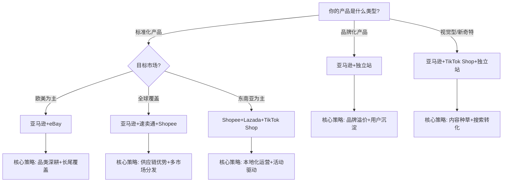
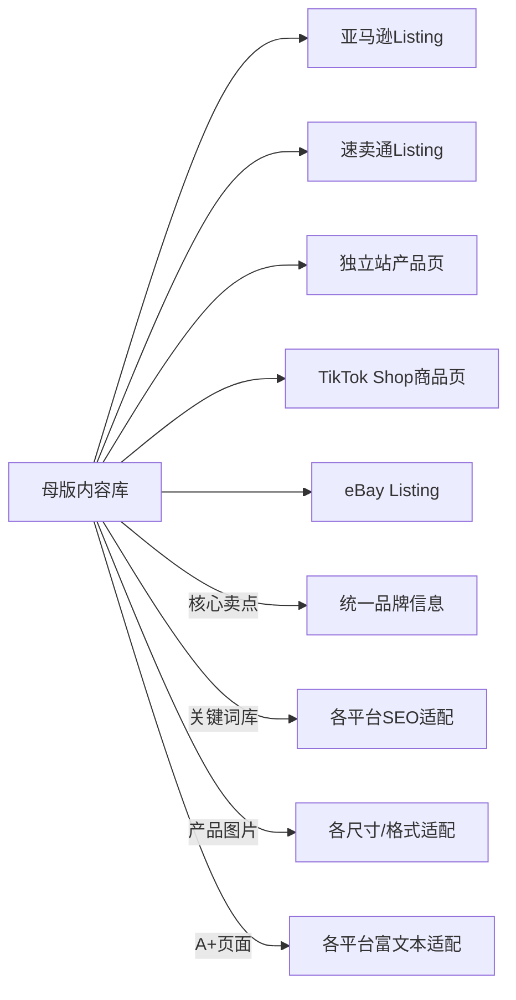
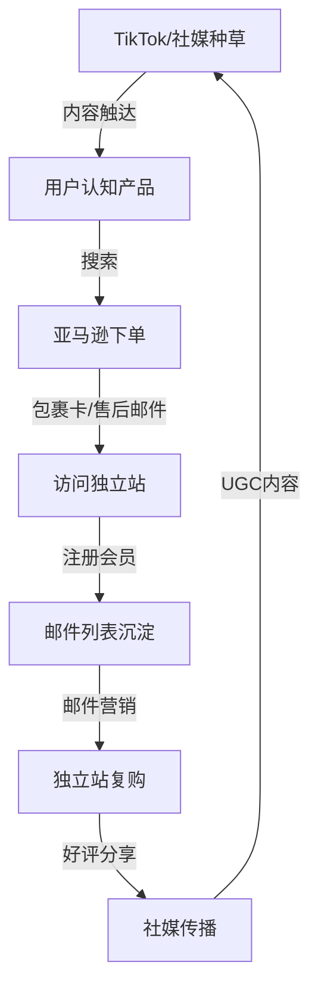

## 五、多平台运营策略

单平台运营把所有鸡蛋放在一个篮子里——一旦账号出问题、政策变动或流量下滑，收入可能归零。多平台运营是跨境电商从"副业试探"走向"稳定生意"的关键跃迁。但多平台不是简单地把同一个产品复制粘贴到不同网站，而是根据每个平台的基因差异，制定差异化的运营策略，在统一的品牌框架下实现资源最大化利用。

### 5.1 为什么要做多平台运营

#### 5.1.1 单平台的三大风险

**平台政策风险**：亚马逊2021年大规模封号事件波及超过5万中国卖家，大卖家帕拓逊、傲基、通拓等账号被冻结，累计损失超千亿。单一依赖亚马逊的卖家在一夜之间失去全部收入来源。这不是个例——平台规则随时可能变化，Review政策、广告算法、佣金比例的调整都会直接影响利润。

**流量天花板**：每个平台都有流量上限。当你的产品在某个平台达到类目Top 10后，增长空间就变得非常有限。多平台可以突破单一流量池的天花板，将同一款产品推向不同用户群体。

**价格竞争陷阱**：在单一平台上，同类产品卖家互相压价，利润越做越薄。而在不同平台上，用户群体不同、竞争格局不同，同一产品可以获得不同的定价空间。

#### 5.1.2 多平台的协同效应

多平台运营不只是"多开几个店"，真正的价值在于协同：

- **数据互补**：亚马逊的搜索数据告诉你用户在找什么，TikTok的互动数据告诉你什么内容能打动人，独立站的用户行为数据告诉你客户从哪里来、为什么买
- **供应链复用**：同一款产品、同一套库存、同一条物流链路，多平台分摊了固定成本
- **品牌交叉引流**：各平台之间互相导流，形成"用户在亚马逊搜索→到独立站复购→在社交媒体分享"的闭环
- **风险对冲**：某个平台政策变化时，其他平台继续运转，保障现金流不断裂

#### 5.1.3 什么时候启动多平台

不是越早越好。在以下条件满足时再考虑扩展：

| 判断维度 | 达标标准 |
|----------|----------|
| 主平台稳定运营 | 至少6个月，月销稳定在$5000以上 |
| 供应链成熟 | 有稳定的供应商，补货周期可控 |
| 团队/资源充足 | 至少有1-2个人可以分出精力负责新平台 |
| 资金充裕 | 有3-6个月的运营资金储备，不影响主平台 |
| 已验证选品逻辑 | 产品在主平台有稳定的好评率和复购率 |

**反面教训**：很多卖家在亚马逊刚出第一单就急于开通速卖通、eBay、Temu，结果每个平台都做得半生不熟，库存管理混乱，客服响应迟缓，反而把主平台也拖垮了。

### 5.2 主流平台定位与组合策略

#### 5.2.1 各平台的战略定位

不同平台在多平台矩阵中扮演不同角色：

| 平台 | 战略角色 | 流量特征 | 利润空间 | 运营重心 |
|------|----------|----------|----------|----------|
| **亚马逊** | 主力营收平台 | 搜索驱动，精准但竞争激烈 | 中等偏高 | Listing优化、广告投放、FBA库存管理 |
| **Shopify独立站** | 品牌沉淀阵地 | 需自行获客，但用户可沉淀 | 最高 | 内容营销、SEO、邮件营销、用户运营 |
| **速卖通** | 新兴市场入口 | 自然流量+平台推荐 | 中等偏低 | 价格竞争力、物流时效、活动报名 |
| **eBay** | 长尾/特殊品类渠道 | 搜索+拍卖，品类差异大 | 中等 | 产品描述细节、售后服务、信誉积累 |
| **Temu** | 走量清货渠道 | 平台分配流量 | 最低（薄利多销） | 成本控制、供货能力、品控 |
| **TikTok Shop** | 兴趣电商+品牌曝光 | 内容驱动，爆发力强 | 波动大 | 短视频内容、达人合作、直播运营 |
| **Shopee/Lazada** | 东南亚市场入口 | 平台推荐+活动流量 | 偏低 | 本地化运营、活动参与、物流配合 |

#### 5.2.2 三种经典组合模式

**模式一：亚马逊+独立站（品牌型组合）**

适合有品牌意识、产品有一定溢价空间的卖家。亚马逊提供稳定的搜索流量和销售基础，独立站用来沉淀品牌用户、收集邮件列表、做DTC（直接面向消费者）销售。

运营节奏：
1. 先在亚马逊跑通产品验证（3-6个月）
2. 同步搭建Shopify独立站，将亚马逊客户引流到独立站
3. 通过邮件营销、社媒运营在独立站上做复购
4. 逐步将独立站销售占比提升到30%-50%

**模式二：亚马逊+速卖通+Shopee（市场覆盖型组合）**

适合标准化产品、希望覆盖全球市场的卖家。亚马逊主打欧美成熟市场，速卖通覆盖俄罗斯、中东、南美等新兴市场，Shopee深耕东南亚。

运营节奏：
1. 以亚马逊为主阵地，打磨产品和供应链
2. 将验证过的产品适配到速卖通和Shopee（价格调整、包装本地化）
3. 利用速卖通和Shopee处理亚马逊的滞销库存
4. 根据各平台销售数据动态调整库存分配

**模式三：亚马逊+TikTok Shop+独立站（内容驱动型组合）**

适合视觉冲击力强、容易产生内容传播的产品（美妆、家居、时尚等）。TikTok负责种草和曝光，亚马逊承接搜索转化，独立站做品牌沉淀。

运营节奏：
1. TikTok短视频/直播做产品种草
2. 引导用户到亚马逊搜索购买（利用亚马逊的信任感）
3. 通过包裹卡、售后邮件将用户引导到独立站
4. 在独立站做品牌社区和复购运营

#### 5.2.3 平台组合决策流程图



### 5.3 多平台运营的核心挑战与解决方案

#### 5.3.1 挑战一：库存管理混乱

**问题**：同一款产品在多个平台销售，库存如果分散管理，很容易出现某个平台超卖、另一个平台积压的情况。

**解决方案：统一库存管理系统**

不要用Excel手动管理。推荐使用专业的ERP工具进行统一库存管理：

| 工具 | 适用规模 | 月费 | 核心能力 |
|------|----------|------|----------|
| **马帮ERP** | 中小卖家 | ¥200-800/月 | 多平台订单汇总、库存同步、利润核算 |
| **店小秘** | 入门卖家 | 免费-¥500/月 | 多平台刊登、订单处理、物流对接 |
| **通途ERP** | 中大卖家 | ¥500-2000/月 | 深度库存管理、采购建议、财务报表 |
| **SellerCloud** | 欧美卖家 | $100-500/月 | 多渠道库存同步、自动化规则引擎 |
| **Linnworks** | 中大卖家 | £150+/月 | 全渠道管理、自动库存分配、仓储集成 |

**库存分配策略**：

```text
总库存 = 安全库存 + 各平台分配库存 + 备用库存

安全库存 = 日均销量 × 补货周期 × 1.5
各平台分配库存 = 该平台日均销量 × 补货周期 × 1.2
备用库存 = 总库存 × 10%（用于应对突发需求）
```

实操建议：
1. 设置库存同步频率为每4小时一次（太频繁会增加API调用成本，太稀疏可能超卖）
2. 为每个平台设置最低库存阈值，低于阈值自动下架或标记为"预售"
3. 每周做一次库存盘点，核对系统数据与实际库存是否一致
4. 滞销超过60天的库存优先在Temu/速卖通清货，不要在主平台打折损害品牌

#### 5.3.2 挑战二：定价策略混乱

**问题**：不同平台的费用结构、用户购买力、竞争环境完全不同，如果统一定价，要么在高费平台亏钱，要么在低费平台没竞争力。

**解决方案：差异化定价模型**

定价公式（按平台调整）：

```text
平台售价 = 产品成本 + 头程物流 + 平台费用 + 广告预算 + 目标利润

各平台费用率参考：
  亚马逊：佣金8-15% + FBA费$3-8/件 + 广告费占比15-25%
  速卖通：佣金5-8% + 年费分摊
  Shopee：佣金6-10% + 支付手续费2%
  Temu：平台定价（工厂价 + 10-20%利润）
  独立站：支付手续费2.9% + 广告费占比20-40%
```

**各平台定价策略**：

| 平台 | 定价策略 | 价格区间（以亚马逊为基准100%） |
|------|----------|-------------------------------|
| 亚马逊 | 标准定价 | 100% |
| 独立站 | 品牌溢价 | 110-130%（含品牌故事和会员权益） |
| 速卖通 | 略低于亚马逊 | 80-95% |
| eBay | 参考市场行情 | 90-110%（取决于品类稀缺度） |
| Temu | 成本+微利 | 50-70%（薄利走量） |
| TikTok Shop | 活动价为主 | 70-90%（利用冲动消费溢价空间） |

**重要提示**：亚马逊有"最低价格保证"机制（Buy Box算法会对比全网价格），如果你在其他平台定价明显低于亚马逊，可能丢失Buy Box。建议在不同平台使用略微不同的产品变体（颜色、配件组合、包装规格），避免直接价格对比。

#### 5.3.3 挑战三：内容和Listing管理

**问题**：每个平台的Listing规范、图片尺寸、关键词规则都不同，手动维护多个平台的内容工作量巨大。

**解决方案：内容中台+平台适配**

建立一个"母版内容库"，然后针对各平台做适配：



**母版内容库应包含**：
1. **核心卖点文档**：3-5个核心卖点 + 支撑论据 + 使用场景
2. **关键词库**：各平台的搜索关键词、长尾词、竞品词（用Helium 10/Jungle Scout/卖家精灵采集）
3. **图片素材库**：主图（白底）、场景图、细节图、尺寸对比图、使用图（至少8张，各尺寸版本）
4. **视频素材库**：产品展示视频、使用教程、开箱视频（横版16:9 + 竖版9:16）
5. **文案模板库**：标题模板、五点描述模板、详细描述模板、FAQ模板

**各平台适配要点**：

| 维度 | 亚马逊 | 速卖通 | 独立站 | TikTok Shop |
|------|--------|--------|--------|-------------|
| 标题长度 | 200字符内 | 128字符内 | 无限制（SEO优化） | 34字符内（精炼） |
| 主图要求 | 1000×1000px白底 | 800×800px | 灵活（推荐1200px） | 1:1或3:4 |
| 描述风格 | 卖点导向、结构化 | 功能导向、详细 | 故事化、品牌调性 | 口语化、场景化 |
| 关键词策略 | 后台Search Terms | 标题+属性词 | SEO长尾词 | 标签+话题 |
| A+/富文本 | A+ Content | 平台模板 | 完全自由设计 | 短视频为主 |

#### 5.3.4 挑战四：团队精力分散

**问题**：每个平台都有独特的运营规则和流量玩法，样样都做意味着样样都做不好。

**解决方案：分层运营，主次分明**

根据平台贡献度和战略价值，将平台分为三层：

| 层级 | 定位 | 精力分配 | 运营深度 |
|------|------|----------|----------|
| **核心层** | 主力营收平台（1-2个） | 60%精力 | 深度运营：每日优化、数据分析、广告精细化 |
| **增长层** | 有增长潜力的平台（1-2个） | 30%精力 | 中度运营：每周优化、定期活动、基础广告 |
| **补充层** | 走量/清货/试水平台（1-2个） | 10%精力 | 轻度运营：自动刊登、被动出单、库存清理 |

**自动化工具降低运营负担**：

- **Listing同步**：使用ERP工具一键将产品刊登到多个平台
- **库存同步**：设置自动库存同步规则，无需手动更新
- **订单处理**：统一在ERP中处理所有平台的订单
- **客服管理**：使用多合一客服工具（如Zendesk）统一管理各平台的买家消息
- **数据报表**：设置自动化日报/周报，异常数据自动预警

#### 5.3.5 挑战五：财务核算困难

**问题**：不同平台的结算周期不同（亚马逊14天、速卖通15天、Shopee周结）、费用结构不同、汇率波动，导致真实利润难以计算。

**解决方案：分平台独立核算体系**

每个平台建立独立的利润核算表：

```text
平台净利润 = 销售收入 - 产品成本 - 头程物流 - 平台费用 - 广告费 - 退货损失 - 其他费用

关键指标：
  - 毛利率 = (销售收入 - 产品成本 - 平台费用) / 销售收入
  - 广告占比 = 广告花费 / 销售收入（健康范围：10-20%）
  - 退货率 = 退货订单数 / 总订单数（警戒线：品类不同，一般<5%）
  - 净利率 = 净利润 / 销售收入（健康范围：>15%）
```

推荐核算工具：
1. **积加ERP**：自动抓取各平台费用明细，生成利润报表
2. **店透视**：亚马逊专用的利润核算工具，精确到SKU级别
3. **自建表格**：用Google Sheets + 各平台API接口，定制化利润看板

### 5.4 多平台运营实操流程

#### 5.4.1 新平台上线五步法

**第一步：平台调研（1-2周）**

不要盲目入驻。先做充分调研：

1. 注册买家账号，在目标平台实际购物2-3次，体验整个购买流程
2. 搜索你的品类关键词，分析排名前20的竞品：
   - 价格区间是多少？
   - 评分和Review数量？
   - 主图和Listing质量如何？
   - 有哪些竞品在做广告？
3. 查看平台卖家中心的费用明细，计算你的产品在该平台的真实利润
4. 加入该平台的卖家社群（如Facebook群组、知无不言论坛），了解真实卖家的反馈

**第二步：入驻准备（1-2周）**

| 准备事项 | 亚马逊 | 速卖通 | Shopee | TikTok Shop |
|----------|--------|--------|--------|-------------|
| 营业执照 | 必须 | 必须 | 必须 | 必须 |
| 品牌商标 | 推荐（品牌备案） | 推荐 | 可选 | 推荐 |
| 入驻保证金 | 无（专业卖家月租$39.99） | $500-$10000 | 视站点而定 | 视站点而定 |
| 审核周期 | 1-2周 | 1-4周 | 3-7天 | 1-2周 |
| 特殊资质 | 部分品类需FDA/CE等 | 部分品类需资质 | 部分品类需资质 | 部分品类需资质 |

**第三步：Listing创建与优化（1周）**

1. 从母版内容库提取素材，按目标平台的规范适配
2. 优化标题（核心关键词前置）、图片（符合平台尺寸规范）、描述（符合平台风格）
3. 填写所有属性字段（属性越完整，搜索权重越高）
4. 上传A+/富文本内容（如果平台支持）

**第四步：冷启动（2-4周）**

新平台冷启动策略与主平台不同，核心是快速积累初始销量和评价：

- **定价策略**：初期定价略低于竞品5-10%，快速获取前10-20单
- **广告策略**：先跑自动广告1-2周收集关键词数据，再转手动精准投放
- **评价获取**：利用平台合规的Vine/试用计划获取早期评价
- **活动参与**：积极报名平台的新品活动、闪购、限时折扣
- **社交引流**：利用已有的社媒渠道为新平台引流

**第五步：数据监控与迭代（持续）**

上线后前30天重点监控以下指标：

| 指标 | 健康值 | 异常处理 |
|------|--------|----------|
| 日均访客 | 持续增长 | 检查关键词、广告投放 |
| 转化率 | >5%（视品类） | 优化主图、价格、评价 |
| 广告ACOS | <30% | 调整出价、否定无效词 |
| 退货率 | <5% | 检查产品质量、描述准确性 |
| 客服响应率 | 95%+ | 设置自动回复模板 |

#### 5.4.2 多平台日常运营SOP

建立标准化的每日/每周/每月运营流程：

**每日任务（30-60分钟）**：

```text
□ 检查各平台订单，确认发货状态
□ 处理买家消息（24小时内回复）
□ 检查库存水位，低于阈值的及时补货
□ 查看广告花费，异常花费及时暂停
□ 检查是否有差评/纠纷需要处理
```

**每周任务（2-3小时）**：

```text
□ 分析各平台销售数据，对比上周变化
□ 优化广告：暂停低效关键词，增加新关键词
□ 检查竞品动态：价格变化、新品上架、广告策略
□ 更新库存预测，安排采购计划
□ 回复平台买家评价（感谢好评、解决差评）
```

**每月任务（半天-1天）**：

```text
□ 生成各平台利润报表，分析盈亏
□ 复盘各平台运营策略，调整资源分配
□ 更新产品Listing（季节性优化、新关键词补充）
□ 策划下月促销活动（大促准备、优惠券更新）
□ 评估是否需要调整平台层级（升级/降级/淘汰）
```

### 5.5 平台间流量互导策略

多平台运营的高级玩法是让各平台之间形成流量闭环，而不是各自为战。

#### 5.5.1 从亚马逊到独立站的引流

亚马逊不允许在Listing中放外部链接，但有几种合规的引流方式：

1. **包裹卡引流**：在FBA发货的产品中放入品牌卡片，引导用户访问独立站获取"产品使用指南/保养手册"或"注册会员享专属折扣"
2. **品牌旗舰店引流**：利用Amazon Brand Store讲述品牌故事，底部放品牌官网信息
3. **售后邮件**：通过亚马逊的"Request a Review"功能获取评价后，发送品牌邮件
4. **社交媒体引流**：在品牌社媒账号上同时提及亚马逊店铺和独立站

**注意**：亚马逊明确禁止将流量引导到外部网站。包裹卡上不要直接放URL，而是用品牌名+搜索引导（如"搜索 XXX 品牌官网"），降低被检测的风险。

#### 5.5.2 从TikTok到各电商平台的引流

TikTok Shop可以直接成交，也可以作为内容种草渠道：

- **短视频挂车**：直接在TikTok Shop内完成购买
- **评论区引导**：在评论区置顶"在亚马逊搜索XXX"的引导语
- **达人合作**：与达人合作时，要求在视频中提到产品品牌名，用户可自行搜索
- **直播间引导**：直播中展示产品，引导用户到各平台搜索购买

#### 5.5.3 流量闭环的最终形态



这个闭环一旦跑通，每个新客户的价值就不只是一次购买，而是持续的复购和口碑传播。

### 5.6 多平台库存与物流策略

#### 5.6.1 物流模式选择

| 物流模式 | 适用平台 | 优点 | 缺点 |
|----------|----------|------|------|
| **FBA** | 亚马逊 | Prime标识、配送快、转化高 | 费用高、库容限制、退货成本 |
| **海外仓** | 独立站、eBay | 配送快、灵活管理 | 需要提前备货、仓储费 |
| **直发（Dropshipping）** | 速卖通、独立站 | 零库存风险 | 配送慢、品控难 |
| **平台仓** | Shopee、TikTok Shop | 平台流量加权 | 各平台仓库独立，需分别备货 |
| **虚拟海外仓** | 多平台 | 显示为本地发货 | 成本介于直发和海外仓之间 |

#### 5.6.2 多平台物流整合方案

当产品同时在亚马逊FBA和独立站海外仓销售时，可以考虑以下整合方案：

1. **亚马逊MCF（Multi-Channel Fulfillment）**：利用亚马逊FBA仓库为其他平台的订单发货。优点是无需额外备货到其他仓库，缺点是费用比FBA更高（约高20-30%），且包裹上会有亚马逊标识。

2. **第三方海外仓共享**：使用万邑通、谷仓、递四方等第三方海外仓，一个仓库同时服务多个平台。优点是统一管理，缺点是不能享受亚马逊FBA的流量加权。

3. **分仓策略**：核心SKU放在亚马逊FBA（保证Prime体验），长尾SKU和清货SKU放在第三方海外仓（降低成本）。根据各SKU在各平台的销售占比动态调整库存分配。

#### 5.6.3 补货计划模板

```text
月度补货计划：

1. 统计各平台过去30天的销量
2. 预测未来30天销量（增长趋势 × 历史销量）
3. 计算各平台安全库存：
   安全库存 = 日均销量 × (补货周期 + 安全天数)
4. 对比当前库存与安全库存，差额即为补货量
5. 考虑季节性因素和促销计划，调整补货量
6. 下达采购订单，跟踪生产进度和物流时效

关键时间节点：
  - 正常补货：库存低于30天用量时下单
  - 紧急补货：库存低于15天用量时走空运
  - 大促备货：提前45-60天下单，提前30天入库
```

### 5.7 多平台运营的常见误区

#### 误区一：所有平台用同一套运营方法

**错误表现**：把亚马逊的运营思路直接搬到速卖通或Shopee，结果水土不服。

**纠正方法**：每个平台的流量逻辑不同。亚马逊是"搜索电商"——用户带着明确需求搜索，所以关键词优化是核心。TikTok Shop是"兴趣电商"——用户没有明确购买意图，靠内容激发冲动消费。Shopee是"活动电商"——大促活动贡献了超过50%的GMV。独立站是"信任电商"——需要通过内容和品牌建立信任才能成交。

#### 误区二：铺货模式多平台复制

**错误表现**：在主平台做铺货（大量上架不同产品），然后把同样的SKU批量搬到其他平台。

**纠正方法**：多平台运营应该是"精品化+差异化"。每个平台选择最匹配该平台用户特征的5-15个核心SKU深耕，而不是把所有产品都铺上去。产品越多，管理难度呈指数级增长。

#### 误区三：忽视各平台的合规差异

**错误表现**：在亚马逊合规的Listing内容，直接复制到其他平台，但不同平台对产品描述、图片、声明的要求不同。

**纠正方法**：
- 亚马逊：严格禁止在描述中做疗效声明（尤其保健品、美容类）
- 速卖通：对产品图片的要求相对宽松，但对知识产权审查严格
- 欧洲市场：GDPR合规、CE认证、WEEE注册等要求独立于平台规则
- TikTok Shop：内容审核严格，避免夸大宣传和绝对化用语

#### 误区四：定价一视同仁

**错误表现**：所有平台统一定价，不做差异化。

**纠正方法**：每个平台的费用结构、用户支付意愿、竞争格局都不同。应该根据各平台的成本结构和竞争情况独立定价。核心原则是：在每个平台上都能保证合理的利润率（>15%），同时保持价格竞争力。

#### 误区五：过早扩张到太多平台

**错误表现**：一上来就同时开通亚马逊、速卖通、eBay、Shopee、TikTok Shop、独立站，结果每个都半死不活。

**纠正方法**：遵循"1+N"原则——先在1个平台做到稳定盈利（月销$5000+且持续3个月），再逐步拓展到第2个、第3个平台。每扩展一个新平台，预留3个月的学习和冷启动期。建议最多同时深度运营3个平台。

### 5.8 进阶：多平台数据分析框架

#### 5.8.1 统一数据看板

建立一个跨平台的数据看板，核心监控以下指标：

| 指标维度 | 具体指标 | 监控频率 |
|----------|----------|----------|
| **销售** | 各平台GMV、订单数、客单价、转化率 | 每日 |
| **流量** | 各平台访客数、流量来源、跳出率 | 每日 |
| **广告** | 各平台广告花费、ACOS/ROAS、关键词表现 | 每日 |
| **利润** | 各平台毛利、净利、ROI | 每周 |
| **库存** | 各平台库存周转天数、滞销SKU、缺货SKU | 每周 |
| **客户** | 各平台退货率、差评率、复购率、客户满意度 | 每月 |

#### 5.8.2 资源分配决策模型

当资源有限时，如何决定给哪个平台投入更多？用以下公式计算各平台的"投入产出比"：

```text
平台优先级得分 = (平台月净利润 × 增长潜力系数) / (所需额外投入 × 运营复杂度系数)

其中：
  增长潜力系数 = 该平台品类增长率 × 1.0 + 竞争饱和度 × (-0.5) + 平台政策红利 × 0.3
  运营复杂度系数 = 1.0（简单）到 3.0（复杂）
  所需额外投入 = 广告预算 + 人力成本 + 库存成本
```

定期（每季度）用这个模型重新评估各平台的优先级，动态调整资源分配。

#### 5.8.3 多平台退出决策

不是所有平台都值得长期投入。当某个平台连续3个月出现以下情况时，考虑退出：

- 净利润率低于5%且无改善趋势
- 平台政策频繁变动且不利于卖家
- 退货率持续高于品类平均水平的2倍
- 投入的人力和资金回报率远低于其他平台
- 平台流量或GMV出现持续下滑趋势

退出时的善后工作：
1. 提前清完库存（利用平台促销或转移到其他平台销售）
2. 处理完所有售后纠纷
3. 保留店铺数据和客户评价（截图或导出）
4. 如果未来有需要，可以重新激活（大多数平台保留店铺历史）

### 5.9 本节要点回顾

| 要点 | 核心内容 |
|------|----------|
| 多平台时机 | 主平台稳定运营6个月、月销$5000+、供应链成熟后再扩展 |
| 组合策略 | 根据产品类型和目标市场选择"品牌型""覆盖型"或"内容型"组合 |
| 库存管理 | 统一ERP管理，设置同步频率和安全库存阈值 |
| 差异定价 | 各平台独立定价，保证每个平台净利率>15% |
| 内容管理 | 母版内容库+平台适配，避免重复劳动 |
| 精力分配 | 核心层60%、增长层30%、补充层10% |
| 流量闭环 | TikTok种草→亚马逊转化→独立站复购→社媒传播 |
| 退出机制 | 连续3个月净利润率<5%时考虑退出 |
