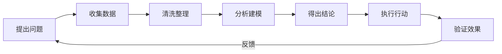
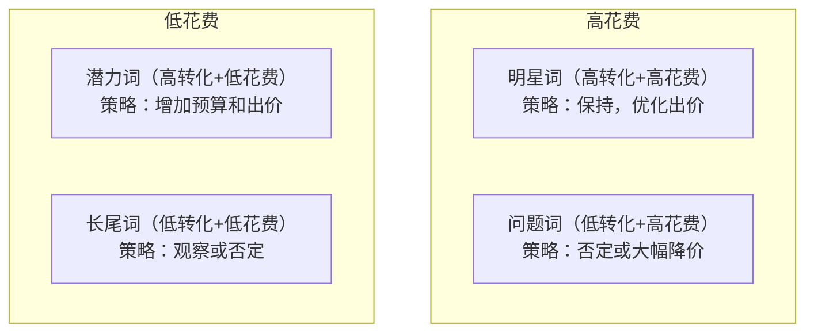
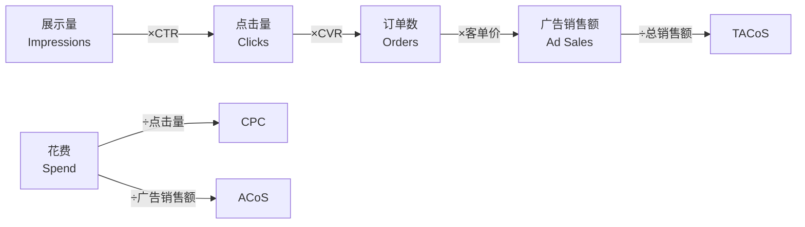

## 六、数据分析与优化

跨境电商的本质是数据生意。每一个运营决策——选品、定价、广告投放、库存备货——背后都应该有数据支撑。凭感觉做决策的卖家，或许能赢一时，但无法建立可复制的增长模型。本章从实战角度出发，系统讲解跨境电商数据分析的完整方法论，涵盖店铺诊断、Listing优化、广告调优、利润核算、竞品监控等核心场景，并提供可直接套用的分析模板和决策框架。

### 6.1 数据分析的底层思维

#### 6.1.1 数据分析不是看报表

很多卖家对"数据分析"的理解停留在"每天打开后台看看销量和广告花费"。这不是数据分析，这只是数据浏览。真正的数据分析是一个完整的闭环：



**关键区别：**

| 层级 | 行为 | 示例 |
|------|------|------|
| 数据浏览 | 看看今天卖了多少 | "今天出了30单" |
| 数据描述 | 对比变化趋势 | "比昨天多了5单，增长20%" |
| 数据分析 | 找到变化原因 | "增长来自新广告活动AC-3，该活动CVR从8%提升到12%" |
| 数据决策 | 基于分析采取行动 | "AC-3活动转化率高，增加预算从$20到$50" |

多数卖家停留在前两层，只有进入第三、四层，数据才能真正产生价值。

#### 6.1.2 分析框架：MECE原则

MECE（Mutually Exclusive, Collectively Exhaustive，相互独立、完全穷尽）是麦肯锡的核心分析方法。应用到跨境电商：

**销售额拆解公式：**

```text
销售额 = 流量 × 转化率 × 客单价

其中：
  流量 = 自然流量 + 广告流量 + 外部流量
  转化率 = f(价格, 图片, 标题, 评论, A+页面, 配送方式)
  客单价 = 产品售价 + 关联销售 + 捆绑销售
```

当销售额下降时，按这个公式逐层拆解，就能精准定位问题所在。比如销售额下降10%，可能是：
- 流量不变、转化率下降10% → Listing出了问题（差评、价格变动、竞品降价）
- 转化率不变、流量下降10% → 曝光减少（关键词排名下降、广告预算耗尽、季节性波动）
- 两者都在下降 → 需要全面排查

#### 6.1.3 建立数据敏感度

数据敏感度不是天赋，是训练出来的。核心方法：

1. **每日记录关键指标**：用Excel或Google Sheets记录每日销量、流量、转化率、广告花费、ACoS。连续记录30天后，你对"正常值"会有直觉。
2. **设定波动阈值**：比如日销量波动超过±20%就需要排查原因，ACoS超过目标值的1.5倍就需要干预。
3. **对比基准**：不要只看绝对值，要对比——同比（去年同期）、环比（上一周/月）、对标（行业平均或主要竞品）。

### 6.2 店铺健康度诊断

#### 6.2.1 店铺诊断仪表盘

开店如看病，需要定期体检。以下是跨境电商店铺的核心诊断指标：

| 维度 | 指标 | 健康值 | 预警值 | 危险值 |
|------|------|--------|--------|--------|
| 流量 | Session增长率 | >5%/月 | 0-5%/月 | <0% |
| 转化 | 整体CVR | >10% | 7-10% | <7% |
| 广告 | TACoS | <10% | 10-15% | >15% |
| 利润 | 净利率 | >15% | 8-15% | <8% |
| 库存 | IPI评分 | >500 | 400-500 | <400 |
| 评论 | 好评率 | >4.3星 | 4.0-4.3星 | <4.0星 |
| 账号 | 绩效指标全绿 | 全绿 | 1项黄色 | 任何红色 |

> 注意：以上健康值适用于亚马逊标准品类（售价$15-$50）。高客单价品类（>$100）的CVR通常较低（3-7%），TACoS容忍度也不同。

#### 6.2.2 周度诊断流程

每周固定时间（建议周一上午）执行以下诊断流程：

**第一步：核心指标趋势检查（5分钟）**

打开业务报告（Business Reports），对比本周 vs 上周：
- Sessions变化 → 流量是否正常
- Ordered Revenue变化 → 收入是否正常
- Conversion Rate变化 → 转化是否正常
- Buy Box Percentage → 是否有丢购物车的情况

**第二步：广告表现检查（10分钟）**

打开广告后台（Campaign Manager），按活动维度查看：
- 总花费 vs 总销售额 → 整体ACoS趋势
- 各Campaign的ACoS → 是否有"烧钱"活动
- 搜索词报告 → 是否有新的高转化词或无效词

**第三步：竞品动态扫描（10分钟）**

用Helium 10或Jungle Scout查看：
- 核心关键词排名变化
- 主要竞品是否有价格调整
- 是否有新竞品入场
- 竞品是否有新的促销活动

**第四步：库存状态检查（5分钟）**

- 各ASIN的可售库存天数
- 在途货件状态
- 滞销库存清单（超过90天未售出的ASIN）

#### 6.2.3 月度深度分析

月度分析要比周度更深入，重点关注趋势和结构性问题：

```python
# 月度分析模板（用Excel或Google Sheets实现）

# 1. 销售趋势分析
月度数据 = {
    "月份": ["1月", "2月", "3月", "4月", "5月"],
    "销售额": [15000, 18000, 22000, 19000, 25000],
    "订单数": [300, 350, 420, 370, 480],
    "客单价": [50, 51.4, 52.4, 51.4, 52.1],
    "转化率": [0.08, 0.09, 0.10, 0.085, 0.11],
    "Sessions": [3750, 3889, 4200, 4353, 4364]
}

# 2. 拆解增长来源
# 假设4月到5月销售额增长 = 25000-19000 = 6000
# 流量贡献 = (4364-4353) × 0.085 × 51.4 = 48元（几乎为零）
# 转化率贡献 = 4353 × (0.11-0.085) × 51.4 = 5,586元
# 客单价贡献 = 4353 × 0.11 × (52.1-51.4) = 335元
# → 5月增长主要来自转化率提升，应排查转化率提升的原因
```

### 6.3 Listing数据分析与优化

#### 6.3.1 Listing核心数据指标

一个Listing的健康度由以下指标综合决定：

| 指标 | 含义 | 数据来源 | 优化方向 |
|------|------|----------|----------|
| 曝光量（Impressions） | Listing被展示次数 | 广告报告/Brand Analytics | 优化关键词覆盖 |
| 点击率（CTR） | 曝光到点击的比率 | 广告报告 | 优化主图、标题、价格 |
| 转化率（CVR） | 点击到购买的比率 | 业务报告 | 优化图片、A+、评论 |
| 会话数（Sessions） | 独立访问次数 | 业务报告 | 综合流量能力 |
| Buy Box占比 | 获得购物车的时间比 | 业务报告 | 价格、物流、绩效 |
| 自然排名 | 核心关键词的搜索排名 | Helium 10/手动搜索 | SEO综合能力 |

#### 6.3.2 CTR优化：主图是第一战场

CTR（点击率）是Listing漏斗的第一层。在搜索结果页，用户平均只花1-2秒决定点哪个Listing。

**CTR基准值：**
- 搜索广告CTR：0.3%-0.5%为正常，>0.5%为优秀
- 自然搜索CTR：取决于排名位置，第1名通常3-5%，第5名约1-2%

**主图优化数据驱动法：**

```text
测试方法：A/B测试（Manage Your Experiments）

测试周期：至少2周，确保样本量>1000次曝光
测试变量：一次只改一个元素

测试优先级：
1. 主图（影响CTR最直接）
   - 白底产品图 vs 场景图
   - 单品图 vs 使用效果图
   - 不同角度（正面 vs 45度 vs 俯视）
2. 价格展示（Coupon vs 直降）
3. 标题关键词顺序（核心词前置 vs 品牌词前置）
```

**真实案例：**

某家居卖家的主图测试结果：

| 版本 | 主图风格 | CTR | CVR | 结论 |
|------|----------|-----|-----|------|
| A | 纯白底产品图 | 0.42% | 11.2% | 基准 |
| B | 产品+使用场景（客厅） | 0.58% | 10.8% | CTR提升38%，CVR略降 |
| C | 产品+尺寸标注 | 0.39% | 12.1% | CTR略降，CVR提升8% |

最终选择版本B作为主图，因为CTR提升带来的流量增量远大于CVR微降的影响。总订单量 = 曝光 × CTR × CVR，B方案的总订单量最高。

#### 6.3.3 CVR优化：转化率的系统提升

转化率是Listing质量的综合体现。当CVR低于品类基准时，需要逐项排查：

**CVR诊断清单：**

```text
转化率下降 → 按以下顺序排查：

1. 价格因素
   - 竞品是否降价？
   - 自己的价格是否有竞争力？
   - 是否有Coupon/促销可以展示？

2. 评论因素
   - 差评是否增加？最新差评说了什么？
   - 评分是否下降到4.0以下？
   - 评论数量是否被竞品超越？

3. 图片因素
   - 主图是否清晰、有吸引力？
   - 副图是否展示了使用场景、尺寸对比、卖点？
   - A+页面是否完整且有说服力？

4. Listing文本
   - 标题是否包含核心关键词和卖点？
   - Bullet Points是否解决了用户的购买疑虑？
   - 描述是否详细且有说服力？

5. 物流和配送
   - 是否有Prime标识？
   - 配送时间是否比竞品长？
   - 是否有FBA库存？

6. 竞品因素
   - 搜索结果页是否有更吸引人的竞品？
   - 竞品是否在做促销活动？
   - 是否有新品以更低价格入场？
```

#### 6.3.4 关键词数据分析

关键词是连接用户需求和产品的桥梁。关键词数据分析的目标是：找到高转化词、淘汰低效词、发现新机会词。

**关键词四象限分析法：**



**具体操作步骤：**

1. **下载搜索词报告**（Amazon → 广告 → 搜索词报告），导出最近30天数据
2. **按以下维度分类每个搜索词：**
   - 花费（Spend）
   - 销售额（Sales）
   - ACoS
   - 点击次数（Clicks）
   - 订单数（Orders）
   - 转化率（Orders/Clicks）

3. **应用决策规则：**

| 条件 | 操作 | 原因 |
|------|------|------|
| 花费>$20，订单=0 | 加入精准否定词 | 持续烧钱无转化 |
| 花费>$20，ACoS>目标×2 | 降低出价30-50% | 转化差，减少损失 |
| 花费>$20，ACoS在目标范围内 | 保持或微调 | 效率可接受 |
| 花费>$20，ACoS<目标×0.5 | 提高出价20-30% | 高效词，争取更多流量 |
| 花费<$5，订单≥1 | 观察或小幅加价 | 数据不足，暂不下结论 |
| 花费<$5，订单=0 | 继续观察 | 数据量太少，不能判断 |

> **重要提示：** 单个搜索词需要至少20-30次点击才能做出统计显著的判断。如果只有3-5次点击就下结论，可能会误杀有潜力的词。

#### 6.3.5 搜索词报告深度挖掘

搜索词报告不仅是优化广告的工具，更是发现用户需求的金矿：

**挖掘新机会词：**
```text
方法：从搜索词报告中筛选出以下类型的词：

1. 高转化长尾词（CVR>15%，点击≥10）
   → 加入手动精准匹配广告组
   → 考虑加入Listing标题或Bullet Points

2. 品牌相关词
   → 竞品品牌词：加入广告投放
   → 自己品牌词：确保自然排名第一位

3. 场景/用途词
   → 如"office desk organizer"、"kitchen storage box"
   → 反映用户使用场景，可用于优化A+页面和副图

4. 属性词
   → 如"large capacity"、"waterproof"、"portable"
   → 反映用户关注的产品属性，可用于优化Bullet Points
```

### 6.4 广告数据分析与优化

#### 6.4.1 广告数据指标体系

广告数据分析需要理解各指标之间的关系：



**核心指标计算公式：**

```text
CTR = Clicks / Impressions
CVR = Orders / Clicks
CPC = Spend / Clicks
ACoS = Spend / Ad Sales × 100%
ROAS = Ad Sales / Spend（ACoS的倒数）
TACoS = Spend / Total Sales × 100%（含自然订单）
CPA = Spend / Orders（每单获客成本）
```

**关键公式：盈亏平衡ACoS**

```text
盈亏平衡ACoS = 毛利率

示例：
产品售价 = $29.99
产品成本 = $8
FBA费用 = $5.50
平台佣金 = $4.50（15%）
毛利 = 29.99 - 8 - 5.50 - 4.50 = $11.99
毛利率 = 11.99 / 29.99 = 40%

→ 盈亏平衡ACoS = 40%
→ 目标ACoS（含利润）= 20-25%
```

#### 6.4.2 广告活动结构分析

一个健康的广告账户应该有清晰的活动结构：

```text
推荐广告结构（以单个ASIN为例）：

1. 自动广告（Auto Campaign）
   - 作用：发现新关键词、获取长尾流量
   - 预算占比：20-30%
   - 出价策略：紧密匹配 > 宽泛匹配 > 同类 > 关联

2. 手动广泛匹配（Manual Broad）
   - 作用：覆盖更多搜索变体
   - 预算占比：15-20%
   - 关键词：5-10个核心词

3. 手动词组匹配（Manual Phrase）
   - 作用：平衡覆盖和精准
   - 预算占比：20-25%
   - 关键词：10-20个表现好的词

4. 手动精准匹配（Manual Exact）
   - 作用：精准收割高转化词
   - 预算占比：30-40%
   - 关键词：从广泛/词组中筛选出的高效词

5. 竞品定向广告（ASIN Targeting）
   - 作用：截取竞品流量
   - 预算占比：10-15%
   - 目标：3-5个直接竞品的ASIN
```

#### 6.4.3 广告优化决策矩阵

不同广告数据表现对应不同的优化动作：

| ACoS vs 目标 | CTR | CVR | 诊断 | 优化动作 |
|--------------|-----|-----|------|----------|
| 远高于目标 | 低 | 低 | Listing吸引力差 | 优先优化主图和标题 |
| 远高于目标 | 高 | 低 | 点击了但不买 | 优化详情页、价格、评论 |
| 远高于目标 | 低 | 高 | 展示给了错误人群 | 检查关键词相关性 |
| 接近目标 | 正常 | 正常 | 正常运营 | 微调出价，测试新词 |
| 低于目标 | 正常 | 正常 | 效率良好 | 增加预算，拓展关键词 |
| 低于目标 | 高 | 高 | 优质广告 | 大幅增加预算 |

**ACoS优化的四个杠杆：**

```text
ACoS = CPC / (CVR × 客单价)

降低ACoS的方法（按优先级排序）：
1. 提高CVR（最有效）→ 优化Listing质量
2. 降低CPC → 优化出价策略、否定低效词
3. 提高客单价 → 捆绑销售、优惠券策略
4. 精准否定词 → 排除不相关搜索词
```

#### 6.4.4 广告竞价策略详解

**动态竞价策略选择：**

| 策略 | 适用场景 | 特点 |
|------|----------|------|
| 动态竞价-仅降低 | 新品测试期 | 转化可能性低时自动降低出价，最保守 |
| 动量竞价-提高和降低 | 成熟产品 | 转化可能性高时提高出价（最多+100%），激进 |
| 基于规则的竞价 | 有明确ROAS目标 | 系统自动调整出价以达成目标ROAS |

**竞价调整实操：**

```python
# 广告竞价计算模型

def calculate_bid(target_acos, cvr, avg_order_value):
    """
    根据目标ACoS计算最优出价
    """
    # 盈亏平衡出价 = CVR × 客单价 × 目标ACoS
    optimal_bid = cvr * avg_order_value * target_acos
    return round(optimal_bid, 2)

# 示例
# 目标ACoS: 25%
# 转化率: 12%
# 客单价: $35
# 出价 = 0.12 × 35 × 0.25 = $1.05

# 实际操作中建议在计算值基础上加10-20%作为起始出价
# 因为实际转化率可能波动，需要留出优化空间
```

#### 6.4.5 TACoS：广告效率的终极指标

ACoS只看广告维度的效率，而TACoS（Total Advertising Cost of Sales）反映了广告投入占总销售额的比例，是衡量广告对整体业务影响的关键指标。

```text
TACoS = 广告花费 / (广告销售额 + 自然销售额) × 100%

TACoS趋势解读：
- TACoS下降 → 自然订单在增长，广告在带动自然流量（健康）
- TACoS上升 → 对广告依赖度在增加（需警惕）
- TACoS稳定 → 增长模式稳定（可持续）
```

**TACoS优化路径：**

```text
第一阶段（新品期）：TACoS 15-25%
  → 目标：通过广告推动关键词排名，获取初始评论
  → 策略：接受较高广告投入，重点关注CVR和评论增长

第二阶段（成长期）：TACoS 10-15%
  → 目标：自然排名稳定，自然订单占比提升
  → 策略：优化广告效率，减少低效投放

第三阶段（成熟期）：TACoS 5-10%
  → 目标：自然流量为主，广告为辅
  → 策略：仅保留高效广告活动，集中预算于高ROI词

第四阶段（品牌期）：TACoS 3-8%
  → 目标：品牌词自然排名第一，广告用于防御和拓展
  → 策略：品牌广告+展示型广告，覆盖全链路
```

### 6.5 利润数据分析

#### 6.5.1 单品利润核算模型

很多卖家只看销售额不看利润，这是最危险的数据盲区。一个售价$29.99的产品，实际利润可能只有$3，也可能有$12。

**完整的利润核算公式：**

```text
单品净利润 = 售价
  - 产品采购成本
  - 头程物流成本（分摊到每个产品）
  - FBA费用（配送费 + 仓储费）
  - 平台佣金（通常8-15%）
  - 广告成本（分摊到每个订单）
  - 退货成本（退货率 × 单次退货损失）
  - 其他成本（样品、拍摄、工具订阅分摊）
```

**利润核算模板：**

| 成本项 | 金额 | 占售价比 | 计算说明 |
|--------|------|----------|----------|
| 售价 | $29.99 | 100% | 产品售价 |
| 产品成本 | -$6.00 | 20% | 采购价（含包装） |
| 头程物流 | -$1.50 | 5% | 海运分摊（$800/CBM÷500件） |
| FBA配送费 | -$5.50 | 18% | 标准尺寸非服装 |
| 月度仓储费 | -$0.30 | 1% | 月均库存×仓储费率 |
| 平台佣金 | -$4.50 | 15% | 售价×15% |
| 广告成本 | -$3.00 | 10% | TACoS 10% |
| 退货损失 | -$0.90 | 3% | 退货率5%×退货处理费$18 |
| **净利润** | **$8.29** | **28%** | |

#### 6.5.2 利润分析的常见陷阱

**陷阱一：忽略隐性成本**

很多卖家只计算产品成本和FBA费用，忽略了以下隐性成本：
- 退货处理费（FBA退货通常损失$3-$8/单）
- 长期仓储费（超过365天的库存每立方英尺$6.90/月）
- 移除/弃置费用
- 工具订阅费（Helium 10、Jungle Scout等，分摊到每个SKU）
- 产品拍摄、A+页面设计费
- 品牌注册、商标维护费

**陷阱二：平均成本 vs 边际成本**

```text
错误思维："我的产品成本是$6，所以每多卖一个就多赚$X"

实际情况：
- 第1-100单：利润$8.29/单（含固定成本分摊后）
- 第101单起：边际利润$12.79/单（固定成本已被前100单覆盖）
- 广告第101-200单：边际利润可能只有$5（因为广告效率递减）

→ 应该关注的是边际利润，而不是平均利润
→ 增长决策应该基于"下一个订单的增量成本和收益"
```

**陷阱三：只看月度利润，不看现金流**

```text
现金流陷阱示例：

月度利润 = $5,000（看起来不错）

但是：
- 本月支付供应商货款 = $15,000（90天账期到期）
- 本月补货新一批 = $20,000
- FBA入库等待中，45天后才能开始销售

→ 本月实际现金流出 = $35,000
→ 虽然账面利润$5,000，但现金为负$30,000

解决方法：
1. 保持3-6个月运营资金储备
2. 使用Excel/Sheets做现金流预测表
3. 合理安排付款周期和补货节奏
```

#### 6.5.3 利润优化策略

当单品利润率低于15%时，需要启动利润优化：

| 优化方向 | 具体措施 | 预期提升 |
|----------|----------|----------|
| 降低采购成本 | 批量采购谈判、寻找替代供应商、简化包装 | 3-8% |
| 降低物流成本 | 优化产品尺寸重量、对比不同货代、合理选择运输方式 | 2-5% |
| 提高售价 | 逐步提价测试、增加产品价值（捆绑/升级）、品牌溢价 | 5-15% |
| 降低广告成本 | 优化关键词、否定低效词、提升自然排名占比 | 3-10% |
| 降低退货率 | 改进产品质量、优化产品描述准确性、改善包装 | 1-3% |

### 6.6 库存数据分析

#### 6.6.1 库存健康度指标

| 指标 | 计算方法 | 健康范围 | 说明 |
|------|----------|----------|------|
| 可售天数 | 当前库存÷日均销量 | 30-90天 | 低于30天断货风险高 |
| 库存周转率 | 年销量÷平均库存 | 6-12次/年 | 越高越好 |
| IPI评分 | 亚马逊综合评分 | >500分 | 低于350会限制仓储 |
| 滞销比例 | 滞销SKU数÷总SKU数 | <10% | 超过20%需要清理 |
| 缺货率 | 缺货天数÷总运营天数 | <5% | 缺货损失远大于库存成本 |

#### 6.6.2 补货数据模型

科学的补货决策需要综合考虑多个变量：

```text
补货量 = 预计销量 + 安全库存 - 在库库存 - 在途库存

预计销量 = 日均销量 × 预计覆盖天数
安全库存 = 日均销量 × 安全天数（7-14天）
覆盖天数 = 生产时间 + 头程运输时间 + 入仓时间

示例计算：
日均销量 = 25件
生产时间 = 12天
海运时间 = 35天
入仓时间 = 7天
安全天数 = 10天

覆盖天数 = 12 + 35 + 7 = 54天
预计销量 = 25 × 54 = 1,350件
安全库存 = 25 × 10 = 250件
当前在库 = 600件
在途库存 = 500件

补货量 = 1,350 + 250 - 600 - 500 = 500件
```

**季节性修正：**

```text
对于有明显季节性的产品，需要在基础补货量上加季节系数：

旺季（黑五、Prime Day前60天）：补货量 × 1.5-2.0
平季：补货量 × 1.0
淡季：补货量 × 0.6-0.8

关键提醒：
- 黑五/网一的备货需要在9月初完成发海运
- Prime Day（7月）的备货需要在4月底完成发海运
- Q4旺季FBA入仓截止日期通常在10月中旬
```

#### 6.6.3 滞销库存处理决策

当产品超过60天未售出时，需要启动滞销处理流程：

```text
滞销处理决策树：

库存天数 60-90天：
  → 降价5-10% + 开启Coupon
  → 增加广告预算推动清货
  → 优化Listing（可能是Listing问题导致滞销）

库存天数 90-180天：
  → 降价15-25%
  → 捆绑热销产品出售
  → 考虑站外deal渠道（Slickdeals等）

库存天数 >180天：
  → 计算继续持有 vs 移除/弃置的成本对比
  → 移除费用约$0.50-0.75/件
  → 长期仓储费$6.90/立方英尺/月
  → 如果持有成本 > 移除成本 + 产品残值，果断移除
```

### 6.7 竞品数据分析

#### 6.7.1 竞品监控指标

竞品分析不是偶尔看看竞品的Listing就完了，而是需要系统性地跟踪关键指标：

| 监控维度 | 具体指标 | 工具 | 频率 |
|----------|----------|------|------|
| 价格 | 售价、Coupon、Lightning Deal | Keepa | 每日 |
| 排名 | 核心关键词自然排名 | Helium 10 Cerebro | 每周 |
| 评论 | 评分、评论数、新增差评 | ReviewTracker | 每日 |
| 销量 | 预估月销量、BSR变化 | Jungle Scout | 每周 |
| 广告 | 广告关键词、SP/SB/SD投放 | Helium 10 Adtomic | 每两周 |
| Listing | 标题、图片、A+页面变化 | 手动检查 | 每月 |

#### 6.7.2 竞品关键词反查

通过分析竞品的关键词策略，可以快速发现自己的优化机会：

```text
操作步骤（以Helium 10 Cerebro为例）：

1. 输入竞品ASIN
2. 筛选条件：
   - 搜索量 > 500
   - 排名位置 < 20（自然排名）
   - 关键词数量 > 10
3. 导出关键词列表
4. 分类整理：
   - 竞品有排名但我没有的词 → 需要覆盖的关键词
   - 竞品排名比我高的词 → 需要优化的关键词
   - 竞品没有但我有的词 → 差异化优势词
5. 将发现的关键词应用到：
   - Listing标题和Bullet Points
   - 手动广告活动
   - 后端搜索词
```

### 6.8 A/B测试方法论

#### 6.8.1 亚马逊官方A/B测试（Manage Your Experiments）

亚马逊为品牌注册卖家提供了官方A/B测试工具，支持测试以下元素：

| 测试元素 | 影响指标 | 最小样本量 | 推荐测试时长 |
|----------|----------|------------|--------------|
| 主图 | CTR、CVR | 1000次点击 | 2-4周 |
| 标题 | CTR、关键词覆盖 | 1000次点击 | 2-4周 |
| A+页面 | CVR | 500次点击 | 2-3周 |
| Bullet Points | CVR | 500次点击 | 2-3周 |

**A/B测试注意事项：**

```text
1. 一次只测试一个变量
   错误：同时改主图和标题
   正确：先测主图，得出结论后再测标题

2. 确保足够的样本量
   错误：测试3天就下结论
   正确：至少收集1000次点击或2周数据

3. 关注统计显著性
   错误：A版本CVR 11.2%，B版本11.5%，选B
   正确：差异太小，可能是随机波动，需要更多数据

4. 考虑外部干扰
   - 测试期间避免参加Deal
   - 避免大幅调整广告
   - 避免在旺季/淡季切换期测试
```

#### 6.8.2 独立站A/B测试

Shopify独立站的A/B测试更灵活，推荐工具：

- **Google Optimize**（免费）：与Google Analytics深度集成
- **VWO**（$199/月起）：功能全面，支持多变量测试
- **Optimizely**（企业级）：适合高流量站点

**独立站高优先级测试项：**

```text
按ROI排序的测试优先级：

1. 结账流程优化（影响最大）
   - 单页结账 vs 多步结账
   - 游客结账 vs 必须注册
   - 支付方式展示顺序

2. 产品页优化
   - 加购按钮颜色和文案
   - 社会证明位置（评论、销量）
   - 信任标识展示

3. 首页/落地页
   - 主视觉和CTA
   - 产品展示方式（网格 vs 轮播）
   - 优惠信息展示
```

### 6.9 数据报表体系搭建

#### 6.9.1 日报/周报/月报模板

**日报模板（5分钟完成）：**

```text
日期：____年__月__日
┌─────────────────────────────────────────┐
│ 核心指标                今日    昨日    变化  │
├─────────────────────────────────────────┤
│ 订单数                  __      __    ±__%  │
│ 销售额($)               __      __    ±__%  │
│ 广告花费($)             __      __    ±__%  │
│ ACoS(%)                 __      __    ±__pp │
│ Sessions                __      __    ±__%  │
│ CVR(%)                  __      __    ±__pp │
└─────────────────────────────────────────┘
异常事项：_________________________________
待办事项：_________________________________
```

**周报框架：**

```text
一、核心数据概览（本周 vs 上周）
  - 销售额、订单数、客单价、转化率趋势
  - 广告花费、ACoS、TACoS趋势

二、关键词排名变化
  - TOP10核心关键词排名变化表
  - 新进入/退出前20的关键词

三、广告优化进展
  - 本周优化了哪些活动
  - 否定了哪些关键词
  - 新增了哪些关键词

四、竞品动态
  - 主要竞品价格变化
  - 新入场竞品
  - 竞品促销活动

五、下周计划
  - 优先级任务清单
```

#### 6.9.2 自动化数据收集

手动收集数据效率低且容易出错。以下是几种自动化方案：

**方案一：Google Sheets + API**

```python
# 使用Python自动拉取亚马逊SP-API数据写入Google Sheets
# 核心逻辑：

import requests
from datetime import datetime, timedelta

# 1. 通过SP-API获取销售数据
def get_sales_data(start_date, end_date):
    """
    调用亚马逊SP-API的Sales Dashboard接口
    返回每日销售数据
    """
    # SP-API endpoint: /sales/v1/orderMetrics
    pass

# 2. 通过SP-API获取广告数据
def get_advertising_data(campaign_id, start_date, end_date):
    """
    调用Amazon Advertising API
    返回广告活动级别的数据
    """
    # Advertising API endpoint: /v2/sp/campaigns/{id}/report
    pass

# 3. 写入Google Sheets
def update_sheet(sheet_id, data):
    """
    使用gspread库写入Google Sheets
    """
    import gspread
    gc = gspread.service_account()
    sheet = gc.open_by_key(sheet_id).sheet1
    # 写入数据
    pass
```

**方案二：第三方工具自动报表**

| 工具 | 功能 | 价格 | 适合阶段 |
|------|------|------|----------|
| Sellerboard | 自动利润计算、PPC分析 | $15.99/月起 | 所有阶段 |
| Helium 10 Profits | 利润追踪、库存分析 | $29/月起 | 中级卖家 |
| DataDive | 深度广告分析 | $50/月起 | 广告重度用户 |
| Sellics/Perpetua | 广告自动化+报表 | $250/月起 | 大卖家 |

### 6.10 常见数据分析误区

#### 误区一：样本量不足就下结论

```text
错误示例：
"这个关键词昨天出了2单，今天0单，说明不稳定，要否定掉"

正确做法：
- 单个关键词至少需要30次以上点击才能做判断
- 计算置信区间：如果CVR=10%，30次点击的预期订单=3单
- 实际结果在0-6单之间都属于正常波动范围
- 使用统计显著性检验（p<0.05）来判断差异是否真实
```

#### 误区二：只看ACoS不看TACoS

```text
错误思维："我的ACoS从20%降到了15%，广告优化效果很好"

可能的真相：
- ACoS下降可能只是因为减少了广告预算
- 总销售额也跟着下降了
- TACoS可能反而上升了（自然订单也在减少）

正确方法：同时跟踪ACoS和TACoS
- ACoS下降 + TACoS下降 = 真正的效率提升
- ACoS下降 + TACoS上升 = 可能在损害整体业务
```

#### 误区三：忽视数据的因果关系

```text
错误推断："销量下降了，同时竞品价格也降了，所以是因为竞品降价"

正确排查：
1. 先确认销量是否真的下降（排除周末/节假日波动）
2. 检查自己的Listing是否有变化（差评、库存、价格）
3. 检查广告是否有变化（预算耗尽、关键词被否定）
4. 检查平台是否有政策变化（搜索算法更新）
5. 最后才考虑竞品因素

→ 相关性 ≠ 因果性
→ 排除法是数据分析的基本功
```

#### 误区四：过度优化广告而忽略Listing

```text
数据现象：ACoS持续高于30%，反复调整出价和关键词但没有改善

常见错误操作：
- 不断降低出价 → 流量更少 → 订单更少 → 进入恶性循环
- 频繁否定关键词 → 可投放的词越来越少
- 不断开新活动 → 预算分散，每个活动数据都不够

根本问题：Listing本身转化率差
- 主图不够吸引人
- 评论评分太低
- 价格没有竞争力
- A+页面空白或质量差

正确做法：先优化Listing，再优化广告
广告是放大器——放大好的Listing效果，也会放大差的Listing问题
```

#### 误区五：不做归因分析

```text
场景：产品A的销量突然增长了50%

错误结论："广告优化效果好，继续加大投入"

需要做的归因分析：
1. 检查增长来源
   - 自然订单增长 → 可能是关键词排名提升或季节性因素
   - 广告订单增长 → 才是广告优化的效果
   - 外部流量增长 → 可能是社交媒体或deal带来的

2. 检查增长持续性
   - 1天增长可能是波动
   - 持续7天增长才是趋势
   - 需要排除促销、节日等临时因素

3. 检查增长质量
   - 利润率是否变化
   - 退货率是否上升
   - 新客vs老客比例
```

### 6.11 数据分析进阶：从描述到预测

#### 6.11.1 销量预测模型

基于历史数据建立简单的销量预测：

```python
# 移动平均法预测销量（适用于稳定期产品）

def moving_average_forecast(historical_sales, window=7):
    """
    使用7日移动平均预测次日销量
    """
    if len(historical_sales) < window:
        return sum(historical_sales) / len(historical_sales)
    
    recent = historical_sales[-window:]
    return sum(recent) / window

# 示例
# 最近7天销量：[28, 32, 25, 30, 35, 29, 31]
# 预测次日销量 = (28+32+25+30+35+29+31) / 7 = 30件

# 季节性修正
def seasonal_adjustment(base_forecast, current_month, seasonal_factors):
    """
    根据历史季节性系数调整预测
    seasonal_factors = {1: 0.8, 2: 0.7, ..., 11: 1.5, 12: 1.8}
    """
    return base_forecast * seasonal_factors.get(current_month, 1.0)
```

#### 6.11.2 广告预算分配优化

```python
# 基于ROAS的广告预算分配模型

def allocate_budget(campaigns, total_budget):
    """
    按各活动的ROAS表现分配预算
    ROAS高的活动获得更多预算
    """
    total_roas = sum(c['roas'] for c in campaigns)
    
    for campaign in campaigns:
        weight = campaign['roas'] / total_roas
        campaign['allocated_budget'] = round(total_budget * weight, 2)
    
    return campaigns

# 示例
campaigns = [
    {"name": "Auto", "roas": 3.0},
    {"name": "Broad", "roas": 4.5},
    {"name": "Phrase", "roas": 5.2},
    {"name": "Exact", "roas": 7.0},
]
# 总预算$200/天
# Auto: $30, Broad: $46, Phrase: $53, Exact: $71
```

#### 6.11.3 建立数据驱动的运营节奏

将数据分析嵌入日常运营节奏，而不是"想到才看"：

| 频率 | 分析内容 | 耗时 | 工具 |
|------|----------|------|------|
| 每日 | 销量、广告花费、库存状态 | 5-10分钟 | 亚马逊后台/Sellerboard |
| 每周 | 关键词排名、广告效率、竞品动态 | 30-60分钟 | Helium 10 + Excel |
| 每月 | 利润核算、SKU健康度、趋势分析 | 2-3小时 | Excel/Google Sheets |
| 每季 | 品类趋势、产品线优化、战略调整 | 半天 | 多工具综合分析 |

### 6.12 本节要点

1. **数据分析是闭环**：从提出问题到验证效果，不是看看报表就结束
2. **掌握MECE拆解法**：销售额 = 流量 × 转化率 × 客单价，逐层定位问题
3. **建立诊断仪表盘**：每周固定时间检查店铺健康度指标
4. **Listing优化以数据为驱动**：用A/B测试验证假设，不凭感觉改Listing
5. **广告优化看TACoS**：ACoS只看广告效率，TACoS反映广告对整体业务的影响
6. **利润核算要完整**：不能只算产品成本和FBA费用，隐性成本同样重要
7. **库存管理要科学**：用公式计算补货量，旺季提前60天备货
8. **竞品监控要持续**：价格、排名、评论、广告，系统化跟踪
9. **避免数据误区**：样本量不足不下结论、相关性不等于因果性
10. **建立运营节奏**：日报5分钟、周报30分钟、月报2小时、季报半天
