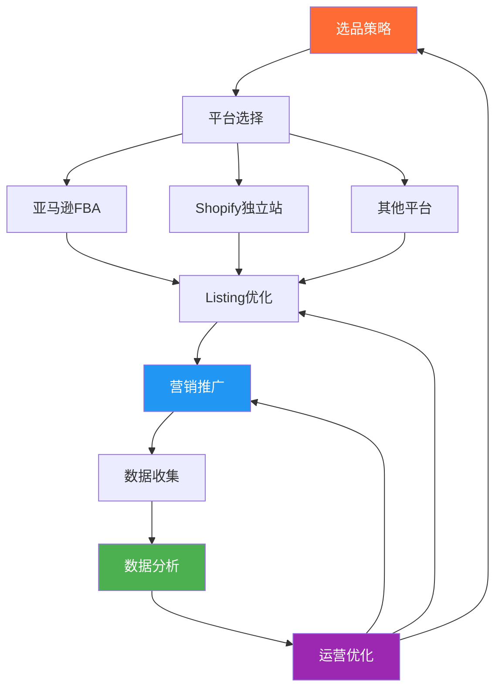

## 本节小结

本节围绕跨境电商运营的七大核心技巧进行了系统讲解，从平台操作到独立站搭建，从选品策略到营销推广，从多平台布局到数据驱动优化，再到实战进阶技巧。以下是每个模块的关键要点回顾、核心方法论总结，以及将这些技巧串联为完整运营体系的实践框架。

---

### 1. 亚马逊FBA全流程操作要点

亚马逊FBA是跨境电商最主流的运营模式之一，其核心在于"选品—上架—推广—优化"的闭环管理。

**开店与合规：** 注册亚马逊全球开店需要营业执照、法人身份证、双币信用卡和收款账户（如Payoneer、连连支付）。一个公司只能注册一个同站点账号，注册信息必须真实准确。视频验证环节需提前准备好所有原件资料，确保网络稳定、环境安静。

**Listing优化是转化率的生命线：**

Listing的质量直接决定了产品的曝光量和转化率。优化的核心公式为：

```text
标题 = 品牌名 + 核心关键词 + 产品特性 + 规格参数 + 适用场景
```

五点描述（Bullet Points）的结构应遵循"卖点—材质—场景—规格—保障"的递进逻辑，每个要点使用"[关键词/卖点] + [具体描述] + [用户收益]"的写作公式。图片方面，主图必须是纯白底且产品占画面85%以上，辅图应包含场景图、细节图、对比图、尺寸图和信息图，总数建议7-9张，分辨率至少2000×2000像素。A+页面（EBC）能提升转化率3%-10%，应包含品牌故事模块、对比模块、使用场景模块、技术参数模块、FAQ模块和交叉销售模块。

**广告投放需要分阶段管理：**

| 阶段 | 广告预算占比 | ACoS目标 | 核心策略 |
|------|------------|----------|----------|
| 新品期（1-2月） | 30-50% | 不限 | 关键词收集，快速积累Review |
| 成长期（3-6月） | 20-30% | < 35% | 优化转化，提升排名 |
| 成熟期（6月+） | 10-20% | < 20% | 精细化管理，利润最大化 |
| 清仓期 | 5-10% | 不限 | 快速清库存 |

关键词应按ACoS分为核心词（<20%）、潜力词（20-35%）和测试词（>35%）三层管理，分别分配50%、30%、20%的预算。否定关键词是降低ACoS的重要手段——每周下载搜索词报告，识别点击多但无转化的关键词进行精准否定。

**Review管理决定了产品的长期竞争力：** Amazon Vine计划是新品获取早期评价的官方渠道，订单完成后应主动使用"Request a Review"功能。差评需第一时间联系买家表达歉意并提供退款/补发/折扣方案，但绝不能用利益诱导修改评价，这是亚马逊的红线。

---

### 2. Shopify独立站搭建要点

独立站是品牌化运营的必经之路。与平台模式相比，独立站的最大优势是拥有客户数据和品牌自主权，但流量获取完全依赖自身能力。

**建站五步流程：** 注册Shopify账号→选择主题（免费主题如Dawn、Brooklyn适合起步，付费主题$140-$180功能更丰富）→基础设置（支付接入PayPal/Stripe、物流运费模板、域名绑定）→产品上架（标题、描述、图片、SKU、变体）→页面设计（首页、产品页、关于我们、联系页面）。

**SEO是独立站的长期流量引擎：** 关键词研究使用Google Keyword Planner，重点关注长尾关键词和搜索意图匹配。页面优化的核心要素包括Title Tag（60字符内含核心关键词）、Meta Description（160字符内吸引点击）、H1标签（每页一个）、图片Alt标签和简洁的URL结构。技术层面需关注网站速度优化（压缩图片、使用CDN）、移动端适配和结构化数据（Schema标记）。

**转化优化是独立站的核心挑战：** 独立站的转化率通常在1%-3%，远低于亚马逊的10%-15%。提升转化率的关键在于：高质量产品图片和详细描述、简化结账流程（减少步骤）、信任建设（安全支付标识、退换货政策、客户评价）和促销策略（首单优惠、满减、限时折扣）。购物车弃单挽回是必须配置的功能——弃单邮件应在1小时、24小时、72小时分三次发送，配合折扣码激励。

**独立站与平台的协同策略：** 亚马逊用于快速验证产品和获取初始销量，独立站用于品牌建设和客户沉淀。成熟卖家应将亚马逊作为流量入口之一，同时通过独立站积累私域流量，降低对单一平台的依赖。

---

### 3. 选品策略详解要点

选品是跨境电商成败的第一道关卡。数据显示，约70%的跨境电商失败案例与选品失误直接相关。选品必须遵循"数据驱动、小批量测试、利润率20%以上、避免侵权"四大铁律。

**三种主流选品方法各有适用场景：**

| 方法 | 核心工具 | 适用场景 | 优势 | 局限 |
|------|----------|----------|------|------|
| 数据选品法 | Jungle Scout/Helium 10 | 亚马逊平台选品 | 数据客观，可量化 | 竞争激烈，需差异化 |
| 趋势选品法 | Google Trends/社媒 | 发现新兴需求 | 先发优势，蓝海机会 | 不确定性高，需快速验证 |
| 差异化选品法 | 竞品分析/用户反馈 | 已有品类的细分切入 | 壁垒较高，利润率好 | 需要供应链配合 |

**数据选品的筛选标准：** 使用Jungle Scout输入目标品类关键词，筛选月销量300-3000件、价格区间$15-$50、Review数量200以下、评分4.0以上的产品。核心关注月搜索量（市场需求）、竞争指数（竞争程度）、平均售价（定价参考）和利润率（盈利空间）四个指标。

**差异化选品的五个方向：** 功能改进（解决现有产品痛点）、设计创新（外观或结构创新）、材质升级（使用更好的材料）、组合套装（相关产品组合销售）和定制化（提供个性化定制服务）。差异化方案必须评估专利风险、成本可行性、市场接受度和供应链可行性。

**候选产品评估流程：** 从需求验证→竞争分析→利润空间计算→供应链可行性→专利风险排查，综合评分≥80分确定选品启动采购，60-80分优化方案后二次评估，<60分直接放弃寻找新品。小批量试单测试是必经步骤，根据市场反馈决定是否大批量采购。

---

### 4. 海外营销推广要点

海外营销推广是将产品触达目标消费者的关键环节，核心在于"渠道选择—内容策略—投放优化"的系统化执行。

**主流营销渠道及特点：**

| 渠道 | 适用品类 | 成本水平 | 见效周期 | 核心优势 |
|------|----------|----------|----------|----------|
| Google Ads | 高客单价/功能性产品 | 中高 | 即时 | 精准意图匹配 |
| Facebook/Instagram Ads | 视觉类产品/生活方式 | 中 | 1-3天 | 精准人群定向 |
| TikTok Ads | 年轻受众/新奇特产品 | 低中 | 1-7天 | 病毒传播潜力 |
| 红人营销（KOL） | 美妆/时尚/3C | 中高 | 1-4周 | 信任背书 |
| SEO内容营销 | 长尾品类/专业产品 | 低 | 3-6月 | 长期免费流量 |
| 邮件营销 | 复购型产品 | 低 | 即时 | 高ROI |

**社交媒体营销实操：** Facebook广告的核心是受众定位——使用Lookalike Audience基于已购客户扩展相似人群，测试不同素材（图片/视频/轮播）的点击率和转化率。Instagram适合视觉类产品，Reels短视频的自然流量远高于图片帖。TikTok的内容必须"原生化"，硬广效果极差，应与创作者合作制作自然融入产品的短视频。

**Google Ads投放框架：** 搜索广告适合有明确购买意图的产品，Shopping广告适合电商产品的图片展示，展示广告适合品牌认知和再营销。关键词出价策略：高转化词提高出价抢占首位，中等转化词保持竞争出价，低转化词降低出价或暂停。

**红人营销的执行流程：** 确定目标受众→筛选匹配的红人（关注粉丝互动率而非粉丝数量）→发送合作邀约（提供免费样品+佣金或固定费用）→审核内容质量→发布后追踪数据（使用UTM链接或专属折扣码）→评估ROI决定是否长期合作。微型红人（1万-10万粉丝）的性价比通常远高于头部红人。

---

### 5. 多平台运营策略要点

多平台运营是分散风险、扩大收入来源的战略选择。不同平台有不同的规则、用户群体和运营逻辑，盲目铺开不如聚焦深耕。

**主流平台对比：**

| 平台 | 核心市场 | 入驻门槛 | 佣金比例 | 流量特点 |
|------|----------|----------|----------|----------|
| 亚马逊 | 北美/欧洲/日本 | 中（需营业执照） | 8-15% | 搜索流量为主，转化率高 |
| eBay | 北美/欧洲 | 低 | 10-13% | 拍卖+固定价格，二手友好 |
| Shopify独立站 | 全球 | 低 | 0%（支付手续费2-3%） | 需自主引流 |
| TikTok Shop | 东南亚/北美 | 中 | 2-8% | 内容驱动，冲动消费 |
| Temu | 北美/欧洲 | 中 | 平台定价 | 极致低价，平台控价 |
| Shopee/Lazada | 东南亚 | 低 | 2-6% | 移动端优先，社交属性强 |

**多平台运营的核心原则：**

1. **先精后广**：在一个平台验证产品和运营能力后，再扩展到第二个平台。建议的扩展路径为亚马逊→独立站→TikTok Shop→其他平台
2. **差异化运营**：不同平台的产品线应有差异，避免同款产品在多平台价格竞争。例如亚马逊主推标准款，独立站主推定制款
3. **统一供应链**：多平台共享供应链和库存，降低采购成本和物流成本
4. **数据打通**：使用ERP系统（如马帮、店小秘、通途）统一管理多平台的订单、库存和财务数据

**多平台库存管理：** 使用ERP系统实时同步各平台库存，设置安全库存线防止超卖。海外仓模式下，同一仓库可以同时服务多个平台的订单。FBA库存和独立站库存需要分别管理，但采购和头程物流可以合并。

---

### 6. 数据分析与优化要点

数据驱动是跨境电商从"凭感觉"到"科学决策"的分水岭。运营优化的本质是通过数据分析发现问题、制定方案、验证效果的持续循环。

**核心数据指标体系：**

| 指标类别 | 关键指标 | 计算方式 | 优化方向 |
|----------|----------|----------|----------|
| 流量指标 | 访客数、页面浏览量、跳出率 | 平台后台/Google Analytics | SEO优化、广告投放 |
| 转化指标 | 转化率、加购率、弃单率 | 订单数÷访客数 | Listing优化、定价策略 |
| 广告指标 | ACoS、ROAS、CPC、CTR | 广告花费÷广告销售额 | 关键词优化、出价策略 |
| 财务指标 | 毛利率、净利率、ROI | 利润÷总投入 | 成本控制、效率提升 |
| 客户指标 | 复购率、客户终身价值（LTV） | 重复购买客户÷总客户 | 客户维护、邮件营销 |

**A/B测试是优化的核心方法：** 对标题、主图、价格、广告文案等关键变量进行A/B测试，每次只改变一个变量，运行至少2周或积累足够样本量后分析结果。亚马逊的"Manage Your Experiments"功能支持品牌卖家直接在后台进行标题和A+页面的A/B测试。

**广告数据分析的频率和重点：**

| 分析频率 | 分析重点 | 行动项 |
|----------|----------|--------|
| 每日 | 广告花费、ACoS、订单量 | 异常波动及时调整 |
| 每周 | 搜索词报告、关键词表现 | 否定无效词，提高有效词出价 |
| 每月 | 广告架构效果、预算分配 | 调整广告策略和预算分配 |
| 每季 | 整体ROI、产品线表现 | 制定下季度广告计划 |

**利润核算的精细化管理：** 售价 = 产品成本 + 头程物流 + FBA费用 + 平台佣金 + 广告费 + 其他费用（退货、仓储等） + 利润。各项成本占比参考：产品成本25-35%、头程物流5-10%、FBA费用15-25%、平台佣金8-15%、广告费10-20%、其他费用5-10%，净利润目标15-25%。使用FBA Revenue Calculator精确计算每款产品的FBA费用，确保定价覆盖所有成本。

---

### 7. 跨境电商运营实战进阶技巧要点

进阶技巧是从"能做"到"做好"的关键跨越，涵盖Listing深度优化、广告精细化管理、客服体系搭建、节庆运营规划和成本利润管理五大板块。

**Listing深度优化的进阶策略：** 标题优化需使用Helium 10的Cerebro工具反查竞品关键词，将搜索量最高的关键词放在标题前80个字符内，并通过A/B测试选择CTR更高的版本。A+页面应设计品牌故事模块建立情感连接、对比模块突出产品优势、使用场景模块扩大用户想象空间。图片可考虑3D渲染图，效果比实物拍摄更专业。

**广告架构的进阶设计：** 成熟的广告账户应包含自动广告组（数据收集）、手动广告组（精准投放，分精确/词组/广泛匹配）、品牌广告组（旗舰店+品牌视频）和展示广告组（再营销+竞品定向）。否定关键词策略需每周下载搜索词报告，识别点击多但无转化的关键词进行精准否定或词组否定。

**客服管理的多语言方案：**

| 方案 | 成本 | 质量 | 适用场景 |
|------|------|------|----------|
| 自建团队 | 高 | 高 | 大卖家，日订单量500+ |
| 外包客服 | 中 | 中 | 中小卖家，多语种需求 |
| AI客服+人工 | 低-中 | 中高 | 标准化问题为主 |
| 翻译工具 | 低 | 低 | 初期过渡使用 |

常见客服场景的处理原则：退货请求应了解原因后提供部分退款/换货/全额退款三种方案；差评处理需第一时间联系买家，问题解决后礼貌请求修改评价（但不能用利益诱导）；产品咨询应使用模板回复，24小时内响应，提供专业建议增加购买信心。

**节庆运营是旺季爆发的关键：** 北美市场全年有12个重要营销节点，其中Prime Day（7月）和黑五网一（11月）是全年最大的两个促销节点。Q4旺季备战需提前4个月启动：7月确定主推产品和预算→8月发送海运库存+准备素材→9月设置促销活动→10月确认库存到位+启动预热广告→11-12月实时监控+动态调整。

**成本核算与利润提升方法：** 使用FBA Revenue Calculator精确计算每款产品的FBA费用。提升利润率的五个方向：优化采购成本（批量采购、多家比价、谈判降价）、优化物流成本（选择合适物流方式、优化包装减少体积）、优化广告效率（降低ACoS、提高自然流量占比）、提升客单价（捆绑销售、交叉销售）、降低退货率（提升产品质量、优化描述准确性）。

---

### 8. 七大技巧的系统化整合

以上七个模块不是孤立的知识点，而是一个相互支撑的运营体系。理解它们之间的逻辑关系，才能真正将核心技巧转化为实际的运营能力。



**系统化运营的核心逻辑：**

1. **选品是起点**：数据选品、趋势选品、差异化选品三种方法综合运用，确保选品有数据支撑而非凭感觉
2. **平台是载体**：根据产品特性和目标市场选择合适的平台，亚马逊适合快速验证，独立站适合品牌建设
3. **Listing是基础**：标题、图片、描述、A+页面的优化直接决定转化率，这是一切运营动作的前提
4. **推广是杠杆**：付费广告快速获取流量，SEO和内容营销建立长期流量基础，红人营销提供信任背书
5. **数据是指南针**：所有运营决策都应基于数据分析，A/B测试验证假设，持续优化提升效率
6. **进阶是护城河**：精细化运营、客服体系、节庆规划、成本管理是从普通卖家到优秀卖家的分水岭

**从入门到精通的阶段性目标：**

| 阶段 | 时间跨度 | 核心任务 | 关键指标 |
|------|----------|----------|----------|
| 起步期 | 1-3个月 | 选品+开店+首批上架 | 完成首单，验证模式 |
| 成长期 | 3-6个月 | 广告投放+Review积累+Listing优化 | 月销$1000-5000，ACoS<35% |
| 扩张期 | 6-12个月 | 多平台扩展+独立站搭建 | 月销$5000-20000，净利率>15% |
| 成熟期 | 12个月+ | 品牌化运营+团队搭建+供应链优化 | 月销$20000+，建立品牌壁垒 |

---

### 9. 常见误区与纠正

**误区一：先铺大量SKU再看哪个跑出来。** 纠正：精选5-10款产品深度运营，远比铺100款产品却不优化效果好。每款产品都需要投入时间和资源进行Listing优化、广告投放和Review积累，铺货模式在当前竞争环境下已经难以持续。

**误区二：独立站建好就有流量。** 纠正：独立站的流量100%依赖自身获取，建站只是第一步。必须通过SEO、Google Ads、Facebook Ads、红人营销、邮件营销等多种方式持续引流。独立站的价值在于品牌建设和客户数据积累，而非"建好就能卖"。

**误区三：广告ACoS越低越好。** 纠正：ACoS需要结合产品生命周期和利润率综合判断。新品期ACoS可以较高（30-50%），目的是快速积累Review和排名；成熟期ACoS应控制在20%以内。更重要的是看TACOS（总广告销售成本比，即广告花费÷总销售额），健康的TACOS应低于15%。

**误区四：只看销量不看利润。** 纠正：销量高但利润为负是不可持续的。必须精确核算每一款产品的全链路成本（产品成本+头程物流+FBA费用+平台佣金+广告费+退货损耗），确保净利润率在15%以上。使用FBA Revenue Calculator和自建利润核算表，每月复盘每款产品的实际利润。

**误区五：差评是灾难，需要想办法删除。** 纠正：差评是改进产品的宝贵信息来源。正确的做法是：第一时间联系买家表达歉意并提供解决方案，从中提取产品改进点反馈给供应商或产品团队。亚马逊允许删除违反平台政策的差评（如恶意评价、与产品无关的内容），但正常的差评不能也不应该被删除。

---

### 10. 学习资源推荐

**工具类：**
- Jungle Scout / Helium 10：亚马逊选品和关键词研究的行业标准工具
- Google Keyword Planner：独立站SEO关键词研究的免费工具
- Keepa / CamelCamelCamel：亚马逊产品价格和排名历史追踪
- FBA Revenue Calculator：亚马逊FBA费用精确计算
- 马帮/店小秘/通途ERP：多平台订单和库存统一管理

**学习类：**
- 亚马逊卖家大学（Seller University）：亚马逊官方的免费培训课程
- Shopify Academy：Shopify官方的独立站运营课程
- 跨境电商行业报告（亿邦动力、雨果跨境）：行业趋势和平台政策的权威信息源

**社区类：**
- 知无不言（跨境电商社区）：国内最大的亚马逊卖家交流社区
- Reddit r/FulfillmentByAmazon：英文亚马逊卖家社区
- Shopify Community：Shopify独立站卖家社区

---

> **本节核心启示：** 跨境电商的核心技巧不是七个独立的技能点，而是一个有机运转的系统。选品决定了方向，平台决定了载体，Listing决定了转化，推广决定了流量，数据决定了效率，进阶技巧决定了天花板。掌握这个系统，才能在跨境电商的竞争中建立可持续的优势。
