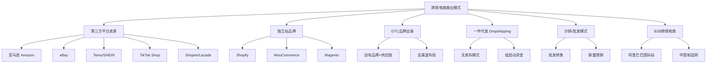
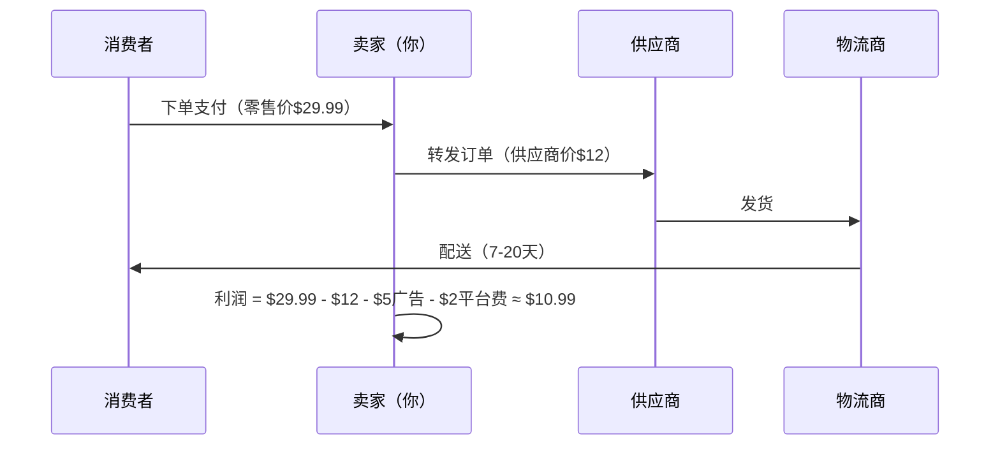
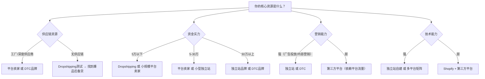
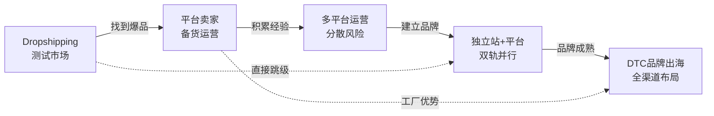

## 一、跨境电商商业模式解析

跨境电商的本质是跨越国境的商品交易——但这个"跨越"二字背后，是物流、支付、税务、合规、语言、文化六个维度的系统性挑战。理解商业模式，就是在理解"用什么结构把这六个维度串起来，形成可持续盈利的闭环"。

### 1. 跨境电商与国内电商的本质差异

很多新手把跨境电商理解为"国内电商的海外版"，这是一个危险的误解。两者在底层逻辑上存在根本性差异：

| 维度 | 国内电商 | 跨境电商 |
|------|----------|----------|
| **物流链路** | 国内快递，1-3天签收 | 跨国运输，7-45天，涉及清关、关税、最后一公里 |
| **支付体系** | 支付宝/微信即时到账 | 多币种结算，回款周期7-14天，涉及汇率波动 |
| **合规要求** | 国内统一法规 | 每个国家/地区独立法规体系（认证、税务、知识产权） |
| **客服语言** | 中文沟通 | 多语言客服，时差导致响应延迟 |
| **退货成本** | 几元运费 | 跨国退货运费可能超过商品价值 |
| **竞争格局** | 充分竞争，信息透明 | 信息不对称仍有红利，但正在快速消失 |
| **资金周转** | 快速回款 | 冻结期+回款周期，资金压力更大 |

这些差异决定了跨境电商的商业模式选择必须考虑"跨国链路摩擦成本"——在国内电商中可以忽略的因素，在跨境电商中可能直接决定盈亏。

### 2. 六大主流商业模式全景

跨境电商的商业模式可以从两个维度进行分类：**渠道维度**（在哪里卖）和**供应链维度**（怎么交付）。由此衍生出六种主流模式：

#### 2.1 第三方平台卖家模式

**定义与原理：** 依托成熟的电商平台（如亚马逊、eBay、Shopee）进行商品销售。平台提供流量、支付基础设施、物流网络和信任背书，卖家支付佣金和广告费换取成交机会。

**核心运作机制：**

- **流量来源：** 平台内搜索流量（用户主动搜索）+ 推荐流量（算法推送）+ 活动流量（大促/闪购）。以亚马逊为例，约55%的流量来自搜索，30%来自推荐，15%来自外部引流。
- **竞争逻辑：** 在同一搜索结果页内，多个卖家争夺点击和转化。排名由算法决定（亚马逊A10算法考量相关性、转化率、客户满意度、库存状态等数十个因素）。
- **成本结构：** 以亚马逊美国站为例——平台佣金8%-15%（按品类不同）、FBA费用（仓储+配送，按尺寸重量计算约$3-$10/件）、广告费（ACOS通常在15%-35%之间）、退货成本（约2%-5%的退货率对应额外损失）。综合来看，净利润率通常在8%-20%之间。

**盈利模型拆解：**

以一款售价$29.99的家居收纳产品为例：

| 成本项目 | 金额（美元） | 占售价比例 |
|----------|-------------|-----------|
| 采购成本 | $4.50 | 15.0% |
| 头程物流（海运分摊） | $1.80 | 6.0% |
| FBA配送费 | $5.40 | 18.0% |
| 平台佣金（15%） | $4.50 | 15.0% |
| FBA仓储费（月均） | $0.60 | 2.0% |
| 广告费（ACOS 25%） | $4.50 | 15.0% |
| 退货损耗（3%退货率） | $0.90 | 3.0% |
| **总成本** | **$22.20** | **74.0%** |
| **净利润** | **$7.79** | **26.0%** |

**优势：**
- 平台自带巨大流量，无需从零获客
- 支付、物流基础设施成熟，降低运营复杂度
- 信任背书强（亚马逊A-to-Z保障、买家评价体系）
- 适合新手快速验证产品和市场

**劣势与风险：**
- 平台规则频繁变更，卖家处于被动地位（2021年亚马逊大规模封号事件导致数万卖家损失惨重）
- 同质化竞争激烈，容易陷入价格战
- 用户数据归属平台，无法建立私域流量
- 账号被封即"生意归零"，风险集中度高

**适合人群：** 有供应链资源但缺乏品牌运营经验的工厂/贸易商，启动资金3万-20万元的中小卖家，希望快速验证市场的新入局者。

#### 2.2 独立站（DTC独立站）模式

**定义与原理：** 卖家自建电商网站，通过Facebook/Google/TikTok等渠道主动获取流量，直接面向终端消费者销售。核心价值在于"拥有客户关系"——用户数据、邮箱列表、购买行为全部归卖家所有。

**核心运作机制：**

- **流量来源：** 100%依赖自主获客。主要渠道包括：付费广告（Facebook Ads、Google Ads、TikTok Ads）、SEO自然搜索、社交媒体内容营销、KOL/KOC合作、EDM邮件营销、联盟营销。
- **竞争逻辑：** 不在同一搜索结果页内与竞品直接竞争，而是通过品牌故事、内容营销、用户体验建立差异化壁垒。
- **转化率参考：** 独立站平均转化率在1.5%-3%之间（低于亚马逊的10%-15%），但客单价和复购率通常更高。

**成本结构分析：**

以Shopify建站为例的月度固定成本：

| 项目 | 月成本 |
|------|--------|
| Shopify Basic套餐 | $39 |
| 域名 | ~$1（年均$12） |
| 主题（一次性分摊） | ~$10 |
| 必备插件（评价/邮件/SEO等） | $50-$200 |
| 支付网关手续费 | 每笔2.9%+$0.30 |
| 广告费 | 按预算，通常$500-$5000+ |

**关键指标对比：**

| 指标 | 第三方平台 | 独立站 |
|------|-----------|--------|
| 获客成本（CAC） | 较低（平台内流量免费/低成本） | 较高（$5-$30/新客户） |
| 客户终身价值（LTV） | 较低（用户忠于平台） | 较高（可反复触达） |
| 利润率 | 8%-20% | 20%-40% |
| 品牌资产积累 | 弱 | 强 |
| 启动难度 | 低 | 中高 |
| 流量可控性 | 低（依赖平台算法） | 高（自主掌控） |

**优势：**
- 品牌资产完全归属自己，可积累长期价值
- 用户数据可反复利用（邮件列表、再营销像素）
- 定价自主权强，不受平台比价约束
- 利润率更高（无平台佣金）
- 可灵活测试新市场、新品类

**劣势与风险：**
- 流量获取成本高，且需要持续投入
- 技术门槛较高（建站、支付接入、物流对接）
- 信任建立慢（无平台背书，新站转化率低）
- 广告账户随时可能被封（Facebook/Google政策变化）
- 需要同时掌握产品、运营、营销、技术多种能力

**适合人群：** 有品牌意识和营销能力的团队，有一定资金实力（启动资金5万-50万元），愿意长期投入品牌建设的卖家，已有平台经验想提升利润率的进阶卖家。

#### 2.3 DTC（Direct to Consumer）品牌出海模式

**定义与原理：** DTC不是简单的"开个独立站"，而是"品牌+供应链+全渠道"的一体化战略。品牌方直接掌控从产品研发、生产、营销到销售的全链路，不依赖任何中间渠道。

**DTC与独立站的核心区别：**

| 维度 | 独立站卖家 | DTC品牌 |
|------|-----------|---------|
| 产品来源 | 采购现货或贴牌 | 自主研发设计 |
| 品牌定位 | 以销售为导向 | 以品牌价值为导向 |
| 渠道策略 | 单一独立站 | 独立站+平台+社交电商+线下 |
| 用户关系 | 交易关系 | 社群关系 |
| 典型案例 | 大量Shopify杂货铺 | Anker、SHEIN、PatPat |

**DTC品牌的核心能力要求：**

1. **产品力：** 自主研发能力，能持续推出差异化产品。Anker每年研发投入占营收约4%，拥有数百项专利。
2. **品牌力：** 清晰的品牌定位、视觉体系、品牌故事。SHEIN通过社交媒体内容营销建立了"快时尚+高性价比"的品牌认知。
3. **数据力：** 通过用户行为数据驱动产品迭代和营销决策。PatPat通过分析用户购买数据，精准预测母婴用品的需求趋势。
4. **供应链力：** 深度绑定供应商，甚至自建工厂。SHEIN的"小单快反"供应链模式——首单100-500件测试市场反应，畅销款7天内追加生产——是其核心竞争壁垒。

**投入与回报：**

DTC模式启动资金通常在50万-500万元，前期投入大、回报周期长（通常需要18-36个月才能实现盈利），但一旦品牌建立，利润率和抗风险能力远超前两种模式。成熟DTC品牌的净利润率可达30%-50%，且不受单一平台政策影响。

#### 2.4 一件代发（Dropshipping）模式

**定义与原理：** 卖家不持有库存，当消费者下单后，卖家将订单信息转发给供应商，由供应商直接发货给消费者。卖家赚取的是"零售价-供应商价-运营成本"之间的差价。

**运作流程：**

**优势：**
- 启动资金极低（$100-$500即可起步）
- 无需仓储和库存管理
- 可快速测试大量产品
- 风险低——失败的代价仅是广告费

**劣势与风险：**
- 利润率低（通常5%-15%）
- 物流时效长（7-30天），客户体验差
- 品质无法把控，退货率高
- 供应商断货/涨价时完全被动
- 竞争壁垒极低，容易被模仿
- 亚马逊等平台已明确限制或禁止Dropshipping

**适用场景：** 适合用于市场测试——在投入大量资金备货前，先通过Dropshipping验证产品是否有市场需求。不建议作为长期商业模式。

#### 2.5 分销与联盟营销模式

**分销模式：** 从供应商处批量采购商品，再通过线上渠道零售。与平台卖家类似，但不局限于单一平台，可以同时在多个渠道销售。核心能力是选品和渠道管理。

**联盟营销（Affiliate Marketing）：** 不直接销售商品，而是通过内容（博客、视频、社交媒体）推荐商品，用户通过你的专属链接购买后，你获得佣金。佣金率通常在3%-20%之间。

**适合场景：** 联盟营销适合有内容创作能力但不想处理供应链的创业者。通过建立细分领域的权威内容站（如"best outdoor gear reviews"），用SEO获取免费流量，被动赚取佣金收入。成熟联盟营销站点月收入$5000-$50000不等。

#### 2.6 B2B跨境电商模式

**定义与原理：** 企业对企业的大宗跨境贸易，通过线上平台完成询盘、报价、下单、支付全流程。代表平台包括阿里巴巴国际站（Alibaba.com）、中国制造网（Made-in-China.com）、环球资源（Global Sources）。

**核心差异：**

| 维度 | B2C跨境电商 | B2B跨境电商 |
|------|-----------|-----------|
| 客单价 | $10-$200 | $1000-$100万+ |
| 决策周期 | 即时决策 | 数天到数月 |
| 交易频次 | 高频复购 | 低频大额 |
| 营销方式 | 广投广告、社媒营销 | SEO+展会+询盘跟进 |
| 交付方式 | 小包裹快递 | 集装箱海运/空运 |
| 核心能力 | 流量运营 | 供应链管理+客户关系 |

**适合人群：** 有工厂或深度供应链资源的制造商/贸易商，产品适合大宗交易（如工业品、原材料、定制品）。

### 3. 模式选择决策框架

选择哪种商业模式，本质上是一个资源匹配问题。以下是基于不同资源禀赋的决策矩阵：

**四种典型入局路径：**

**路径一：工厂/贸易商转型（有供应链，缺运营）**
- 起步：亚马逊FBA + Temu供货
- 进阶：加入TikTok Shop + Shopee
- 目标：建立自有品牌，过渡到DTC模式
- 预算：10万-30万元
- 周期：6-12个月见初步成效

**路径二：营销人才创业（有流量能力，缺供应链）**
- 起步：Dropshipping测试产品 → Shopify独立站
- 进阶：找到爆品后寻找稳定供应商备货
- 目标：建立品牌独立站，多渠道分发
- 预算：3万-10万元
- 周期：3-6个月验证模型

**路径三：资本充裕的品牌创业（有钱，全缺）**
- 起步：聘请专业团队，同时启动独立站+亚马逊
- 进阶：快速测试多个品类，数据驱动聚焦
- 目标：建立DTC品牌，全渠道布局
- 预算：50万-200万元
- 周期：12-24个月建立品牌

**路径四：兼职副业（时间有限，预算有限）**
- 起步：联盟营销或轻量Dropshipping
- 进阶：验证成功后逐步增加投入
- 目标：月入$1000-$5000的副业收入
- 预算：1万-3万元
- 周期：持续积累

### 4. 模式演变与升级路径

成功的跨境电商业务通常不是一成不变的，而是沿着"低风险验证 → 规模化运营 → 品牌化升级"的路径演进：

**模式升级的关键转折点：**

1. **从Dropshipping到备货：** 当某款产品月销稳定超过200单，且退货率低于10%时，说明市场验证通过，可以开始备货以提升利润率和客户体验。

2. **从单平台到多平台：** 当亚马逊月销超过$30,000时，应开始布局第二平台（独立站或TikTok Shop），分散"把鸡蛋放在一个篮子里"的风险。

3. **从卖货到做品牌：** 当累计客户超过5,000人，复购率超过15%时，说明产品有足够的用户认可度，可以投入品牌建设（品牌视觉升级、内容营销、社群运营）。

### 5. 常见误区与纠正

**误区一："独立站比平台高级"**

纠正：两种模式没有高下之分，只有适合与否。大量DTC品牌（如Anker）在亚马逊上同样做到了年销数十亿。独立站的真正价值在于"拥有客户数据"，而不是模式本身的优越感。新手建议从平台起步，验证产品和供应链后再拓展独立站。

**误区二："Dropshipping不能做"**

纠正：Dropshipping作为长期商业模式确实竞争力弱，但作为市场验证工具价值极高。投入$200的广告费测试5-10款产品，比花$5000囤一堆卖不出去的货要明智得多。正确用法是"Dropshipping测试 → 备货运营 → 品牌升级"。

**误区三："越便宜越好卖"**

纠正：低价策略在跨境电商中往往死得更快。考虑国际物流成本后，低价商品的利润空间被严重压缩。售价$10以下的产品，扣除物流和平台费用后几乎无利可图。行业共识是：跨境电商的"甜蜜价位"在$20-$80之间——足够高的客单价覆盖物流成本，又不至于超出冲动消费的门槛。

**误区四："找到一个好模式就能躺赚"**

纠正：跨境电商是"重运营"生意。即使是Dropshipping，也需要持续优化广告、跟进客服、处理退货、管理供应商关系。没有哪种模式能让你"设置好就忘掉"。

**误区五："多平台就是多开几个店"**

纠正：多平台运营不是简单的复制粘贴。每个平台的用户画像、算法逻辑、内容偏好都不同。亚马逊用户重视功能和评价，TikTok用户重视视觉冲击和情感共鸣，独立站用户重视品牌故事和信任感。同一个产品在不同平台需要不同的Listing策略、定价策略和营销策略。

### 6. 2025年商业模式趋势预判

**趋势一：社交电商崛起**

TikTok Shop、Instagram Shopping、YouTube Shopping正在改变"搜索→比价→下单"的传统购物路径，转向"内容种草→即时购买"的社交电商模式。2024年TikTok Shop全球GMV突破330亿美元，同比增长超过300%。对于有内容创作能力的卖家，社交电商是最大的增量机会。

**趋势二：AI驱动的选品和运营**

AI工具正在降低跨境电商的运营门槛。从AI选品分析（通过大数据预测趋势品类）、AI生成Listing（多语言标题、描述、关键词自动优化）、AI客服（多语言自动回复）到AI广告投放（自动化竞价和素材测试），全流程AI化正在成为现实。

**趋势三：合规门槛持续提高**

欧盟的GPSR（通用产品安全法规）2024年12月生效，要求所有在欧盟销售的产品必须有欧盟境内的责任人。美国的INFORM Consumers Act要求平台验证卖家身份。合规成本上升将加速行业洗牌，合规能力强的卖家将获得竞争优势。

**趋势四：供应链前置**

越来越多的卖家将库存前置到目标市场国的海外仓，甚至在当地建立轻量级供应链（如在美国本土找代工厂做最后的组装和包装）。这不仅能大幅缩短配送时效，还能规避部分关税风险。

### 7. 本节核心要点

1. 跨境电商不是"国内电商的海外版"，跨国链路的摩擦成本是商业模式选择的核心变量。
2. 六大主流模式各有适用场景，没有绝对优劣，关键在于匹配自身资源禀赋。
3. 新手建议从第三方平台起步，验证产品和市场后再拓展独立站和品牌化。
4. 模式选择的核心公式：**商业模式 = 供应链能力 × 资金实力 × 营销能力 × 技术能力**。
5. 成功的跨境电商业务通常沿着"低风险验证 → 规模化运营 → 品牌化升级"的路径演进。
6. 2025年的关键趋势：社交电商崛起、AI驱动运营、合规门槛提高、供应链前置。
