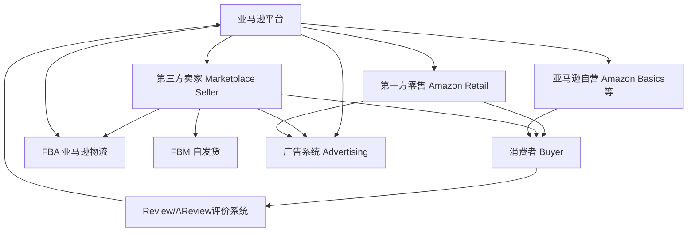
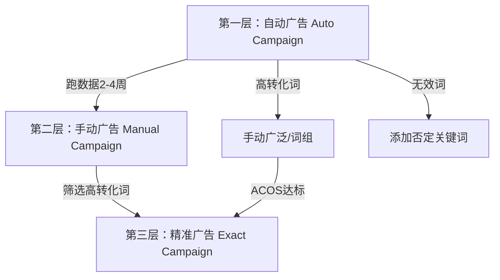

## 二、亚马逊平台深度解析

亚马逊（Amazon）是全球最大的电商平台，2024年净销售额达6380亿美元，第三方卖家贡献了超过60%的平台销售额。对于跨境电商从业者而言，亚马逊既是最大的机遇，也是竞争最激烈的战场。本节从平台生态、运营机制、流量算法、费用结构、风险管控五个维度，对亚马逊进行系统性深度解析。

### 2.1 平台生态全景

#### 2.1.1 全球站点布局

亚马逊目前在全球运营超过20个站点，各站点的市场体量、竞争烈度、准入门槛差异显著：

| 站点 | 市场规模 | 竞争程度 | 准入门槛 | 语言 | 特点 |
|------|----------|----------|----------|------|------|
| 美国站（US） | 最大，占全球电商约40% | 极高 | 中等 | 英语 | 流量最大，FBA成熟，竞争白热化 |
| 欧洲站（UK/DE/FR/IT/ES） | 大，五国统一账号 | 高 | 较高（VAT/CE认证） | 多语言 | 需处理VAT税务，EPR合规 |
| 日本站（JP） | 中等 | 中高 | 低 | 日语 | 对品质要求极高，退货率低 |
| 加拿大站（CA） | 中等 | 中等 | 低 | 英/法 | 与美国站库存可互通（NARF） |
| 澳大利亚站（AU） | 较小 | 中等 | 低 | 英语 | 市场增长快，卖家数量少 |
| 印度站（IN） | 大，但客单价低 | 中等 | 高（需本地实体） | 英/印地语 | 价格敏感，FBA成本高 |
| 中东站（AE/SA） | 较小 | 低 | 中等 | 阿拉伯语/英语 | 蓝海市场，COD占比高 |
| 新加坡站（SG） | 小 | 低 | 低 | 英语 | 东南亚跳板，体量有限 |

**站点选择策略：**

- **新手入门**：美国站（流量大、教程多、FBA成熟）或日本站（竞争相对小、退货率低）
- **有经验卖家**：欧洲站（利润空间大，但合规成本高）或中东站（蓝海机会）
- **大卖家**：多站点布局，利用品牌全球化

#### 2.1.2 平台角色与关系

亚马逊生态中存在多方参与者，理解各方关系是运营的基础：



关键认知：
- **亚马逊自营与第三方卖家是竞合关系**。亚马逊会根据数据决定哪些品类自营、哪些留给第三方。自营商品通常占据搜索结果的有利位置，但第三方卖家通过差异化选品仍可获得大量订单。
- **Buy Box（购物车）是订单入口**。约82%的亚马逊销售额通过Buy Box完成，赢得Buy Box是运营的核心目标之一。

#### 2.1.3 卖家账户类型

| 类型 | 月费 | 佣金 | 适用场景 | 限制 |
|------|------|------|----------|------|
| 个人卖家（Individual） | 无月费 | 每件$0.99+品类佣金 | 月销<40件的试水阶段 | 无法使用广告、Buy Box竞争力低 |
| 专业卖家（Professional） | $39.99/月 | 品类佣金（8%-17%） | 正式运营 | 需持续付费，长期不用可能被降级 |

**建议**：只要月销量超过40件，就应该使用专业卖家账户。专业卖家还可以使用促销工具、批量上架、API接口等高级功能。

### 2.2 核心运营机制

#### 2.2.1 Buy Box 算法解析

Buy Box 不是简单地给"最便宜"的卖家，而是一个多因素加权算法。以下是影响 Buy Box 的核心因素及其权重估算：

| 因素 | 权重 | 说明 |
|------|------|------|
| 配送方式 | 极高 | FBA > SFP（卖家配送Prime）> FBM |
| 价格（含运费） | 高 | 不是最低价，而是在同级别配送中的竞争力价格 |
| 卖家绩效指标 | 高 | ODR<1%，发货延迟率<4%，预取消率<2.5% |
| 配送时效 | 中高 | 2日达 > 3-5日达 > 7日以上 |
| 库存状态 | 中 | 有货 > 缺货（缺货直接失去Buy Box） |
| 客户满意度 | 中 | A-to-Z索赔率、退货率、负面反馈率 |
| 账户历史 | 中 | 账户年龄、销售历史、违规记录 |
| 响应时间 | 低-中 | 24小时内回复买家消息 |

**Buy Box 轮转机制**：当多个卖家条件相近时，Buy Box 会在他们之间轮转（time-share）。轮转比例取决于各卖家的综合评分。一个评分90分的卖家可能获得70%的Buy Box时间，评分80分的获得30%。

**定价策略（Repricer）**：
- 手动定价适合SKU少的卖家
- 自动调价工具（如RepricerExpress、Informed.co）适合多SKU卖家
- 设置价格底线（floor price），避免价格战导致亏损
- 关注"同条件竞争"而非盲目降价——FBA卖家和FBM卖家的价格不在同一维度竞争

#### 2.2.2 FBA vs FBM 深度对比

FBA（Fulfillment by Amazon）和 FBM（Fulfillment by Merchant）是两种核心配送模式，选择错误会直接影响利润率和竞争力：

| 维度 | FBA | FBM | SFP（Seller Fulfilled Prime） |
|------|-----|-----|-------------------------------|
| 配送主体 | 亚马逊仓库 | 卖家自发货 | 卖家发货，Prime标签 |
| Buy Box竞争力 | 极高 | 低 | 高 |
| Prime标签 | 有 | 无（普通FBM） | 有 |
| 物流成本 | 仓储费+配送费（按件计） | 自付物流费 | 自付物流费 |
| 退货处理 | 亚马逊处理 | 卖家处理 | 亚马逊/卖家协商 |
| 库存控制 | 较弱（需补货计划） | 完全自主 | 完全自主 |
| 适合品类 | 小件、标品、高周转 | 大件、定制、低周转 | 有物流能力的卖家 |
| 典型费率 | 小件$3.22/件起 | 取决于物流商 | 取决于物流商 |

**FBA费用构成详解**（2024年美国站标准）：

| 尺寸段 | 标准尺寸（1lb以下） | 标准尺寸（1-20lb） | 大件 |
|--------|---------------------|---------------------|------|
| 配送费 | $3.22-$5.90 | $5.90-$10.00+ | $8.26-$150+ |
| 月度仓储费（1-9月） | $0.87/立方英尺 | $0.87/立方英尺 | $0.56/立方英尺 |
| 月度仓储费（10-12月） | $2.40/立方英尺 | $2.40/立方英尺 | $1.40/立方英尺 |
| 长期仓储费（181-365天） | $3.80/立方英尺或$0.15/件 | 同左 | 同左 |
| 长期仓储费（>365天） | $6.90/立方英尺或$0.15/件 | 同左 | 同左 |

**FBA vs FBM 决策模型**：

```mermaid
flowchart TD
    A[开始] --> B{商品单价>15美元?}
    B -->|否| C{日销>10单?}
    B -->|是| D{体积/重量比?}
    C -->|否| E[FBM 自发货]
    C -->|是| F{利润率>25%?}
    D -->|小件标品| G[FBA]
    D -->|大件/定制| H{有Prime物流能力?}
    F -->|否| E
    F -->|是| G
    H -->|是| I[SFP]
    H -->|否| E
```



#### 2.2.3 Listing 优化体系

Listing 是亚马逊运营的核心资产，一个优化良好的Listing直接决定转化率和搜索排名。

**A10搜索算法核心排名因素**（按权重排序）：

1. **相关性（Relevance）**：关键词匹配度，包括标题、五点描述、后台搜索词
2. **转化率（Conversion Rate）**：点击→购买的比例，是算法最重视的信号
3. **销售速度（Sales Velocity）**：近期销售量和销售趋势
4. **客户满意度（Customer Satisfaction）**：Review评分、退货率、A-to-Z率
5. **库存状态（Availability）**：有货 > 缺货
6. **配送方式（Fulfillment）**：FBA有天然加权

**标题优化公式**：

```text
[品牌名] + [核心关键词] + [关键属性1] + [关键属性2] + [使用场景/人群] + [规格/尺寸/颜色]
```

示例（差）：`Water Bottle`
示例（好）：`HydroPeak 32oz Insulated Stainless Steel Water Bottle - Double Wall Vacuum, BPA Free, Leak Proof Lid, Keeps Cold 24hrs Hot 12hrs, for Gym Sports Outdoor`

标题优化要点：
- 长度控制在150-200字符（移动端截断约80字符，把最重要的放在前面）
- 核心关键词必须出现在标题中
- 不要堆砌关键词，保持可读性
- 不要使用促销语（如"Best Seller""Hot Deal"）

**五点描述（Bullet Points）优化**：

每个Bullet Point应遵循"功能→好处→场景"结构：
- **功能**：这个产品有什么特性
- **好处**：这个特性为买家带来什么价值
- **场景**：在什么情况下使用

示例：
```text
✅ DOUBLE WALL VACUUM INSULATION - Keeps drinks ice-cold for 24 hours or steaming hot for 12 hours, so you stay refreshed during long hikes, gym sessions, or road trips
```

**A+ Content（图文版品牌描述）**：
- 仅品牌注册卖家可用
- 可提升转化率3%-10%
- 包含图文模块、比较图表、品牌故事
- 高级A+（Premium A+）支持视频和交互模块

**后台搜索词（Search Terms）**：
- 250字节限制（不是250个字符）
- 不要重复标题中已有的词
- 使用同义词、缩写、常见拼写错误
- 不要用逗号分隔，直接空格分隔
- 不要使用竞品品牌名（违规）

#### 2.2.4 Review（评论）体系

Review是影响转化率的最关键因素之一。一个产品的Review评分和数量直接决定其在搜索结果中的表现。

**亚马逊评价体系演变**：

| 阶段 | 时间 | 特点 |
|------|------|------|
| 纯Review | 2015年前 | 评价和评分混合，允许有偿评论 |
| Vine计划 | 2016年起 | 亚马逊官方送样评论项目 |
| Rating整合 | 2019年起 | 星级评分和文字评论合并显示 |
| AI摘要 | 2023年起 | AI生成Review摘要，一目了然 |

**合规获取Review的方法**：

1. **Request a Review按钮**：订单完成4-30天内，可一键发送评论请求邮件
2. **Vine计划**：向亚马逊提交免费样品，Vine Voices成员撰写评论。费用：每个父ASIN最多30个Vine评论，每个$200（前30天）
3. **售后卡片**：产品包装中放感谢卡（可引导到品牌官网，但不能直接索要好评）
4. **优质产品+体验**：根本之道——产品质量好、包装精美、说明清晰

**违规行为（会导致封号）**：
- 刷评、买评
- 用折扣/返现换好评
- 让朋友/家人刷评
- 评论操纵（只删差评）

### 2.3 广告系统深度解析

#### 2.3.1 广告类型全览

| 广告类型 | 缩写 | 展示位置 | 计费方式 | 适用阶段 |
|----------|------|----------|----------|----------|
| 商品推广广告 | SP | 搜索结果页、商品详情页 | CPC | 所有阶段，基础必备 |
| 品牌推广广告 | SB | 搜索结果顶部横幅 | CPC | 品牌注册卖家 |
| 品牌推广视频 | SBV | 搜索结果页视频位 | CPC | 有视频素材的品牌卖家 |
| 展示型推广 | SD | 亚马逊站内外展示 | CPC/vCPM | 再营销、拉新 |
| DSP广告 | DSP | 亚马逊站内外全渠道 | CPM/vCPM | 大预算品牌卖家 |

#### 2.3.2 SP广告核心策略

SP广告是最基础也是最重要的广告类型，约占大多数卖家广告预算的70%-80%。

**三种匹配方式**：

| 匹配类型 | 说明 | 示例（关键词：wireless earbuds） | 流量特点 |
|----------|------|----------------------------------|----------|
| 广泛匹配 | 包含关键词的各种排列组合、相关词 | "cheap bluetooth wireless earbuds for running" | 流量大，精准度低 |
| 词组匹配 | 包含完整词组，前后可加词 | "best wireless earbuds under 50" | 流量中，精准度中 |
| 精准匹配 | 与关键词精确匹配或紧密变体 | "wireless earbuds""earbuds wireless" | 流量小，精准度高 |

**广告架构设计——三层漏斗模型**：



- **自动广告（Auto）**：让亚马逊跑数据，发现潜在关键词和ASIN，预算$10-20/天
- **手动广告（Manual）**：按匹配类型分组，预算根据数据分配
- **精准广告（Exact）**：只放经过验证的高转化词，追求利润

**关键指标与优化目标**：

| 指标 | 含义 | 健康范围 | 优化方向 |
|------|------|----------|----------|
| ACoS | 广告花费/广告销售额 | 15%-30%（视品类） | 越低越好，但不能太低（说明曝光不够） |
| TACoS | 广告花费/总销售额 | 8%-15% | 反映广告依赖度，越低越好 |
| CTR | 点击率=点击/展示 | 0.3%-1.0% | 低于0.3%需优化主图和标题 |
| CVR | 转化率=订单/点击 | 10%-20% | 低于10%需优化Listing |
| CPC | 每次点击成本 | $0.5-$2.0 | 取决于品类竞争度 |
| 展示量Impressions | 广告被展示次数 | 越多越好 | 关键词/出价/预算不足都会限制展示 |

**否定关键词（Negative Keywords）策略**：
- 每周从搜索词报告中筛选无效词
- ACoS>目标值2倍且花费>$5的词→添加否定精准
- 明确不相关的词→添加否定词组
- 否定词是降低广告浪费最有效的手段

#### 2.3.3 SB广告与品牌建设

品牌推广广告（Sponsored Brands）对品牌注册卖家至关重要：

- **头条搜索广告**：展示品牌Logo+自定义标题+最多3个产品，出现在搜索结果最顶部
- **品牌旗舰店链接**：广告可直接指向Amazon Storefront
- **视频广告**：15-45秒视频，CTR通常比图片广告高2-3倍

SB广告的核心价值不仅是直接转化，更是品牌曝光和认知建设。建议将SB广告预算占比控制在15%-25%。

### 2.4 费用结构与利润计算

#### 2.4.1 全链路费用拆解

做亚马逊必须清楚每一笔费用，否则看似赚钱实则亏损：

| 费用项 | 比例/金额 | 说明 |
|--------|----------|------|
| 平台佣金 | 8%-17%（按品类） | 消费电子15%，服装配饰17%，家居15% |
| FBA配送费 | $3.22-$150+/件 | 按尺寸和重量阶梯计费 |
| FBA仓储费 | $0.56-$2.40/立方英尺/月 | Q4（10-12月）费率翻倍 |
| 广告费 | 通常占销售额5%-15% | 新品期可能更高 |
| 头程物流 | $4-$12/kg（空运）$1-$3/kg（海运） | 从中国到亚马逊仓库 |
| 采购成本 | 因品类而异 | 商品成本+包装+质检 |
| 退货成本 | 约2%-5%（品类不同） | 服装品类退货率可达15%-25% |
| 长期仓储附加费 | $6.90/立方英尺（>365天） | 库存管理不善的隐性杀手 |

#### 2.4.2 利润计算公式

**单件利润 = 售价 - 采购成本 - 平台佣金 - FBA费用 - 头程分摊 - 广告分摊 - 退货分摊**

示例计算（一款售价$29.99的手机壳）：

| 项目 | 金额 |
|------|------|
| 售价 | $29.99 |
| 平台佣金（15%） | -$4.50 |
| FBA配送费 | -$3.85 |
| 月仓储费（分摊） | -$0.15 |
| 头程物流（分摊） | -$0.60 |
| 采购成本 | -$2.50 |
| 包装 | -$0.30 |
| 广告费（10%） | -$3.00 |
| 退货分摊（3%） | -$0.90 |
| **单件利润** | **$14.19** |
| **利润率** | **47.3%** |

**注意**：利润率>25%的产品才值得做，低于15%不建议进入。新品推广期广告占比可能达到20%-30%，此时可能是亏损的。

#### 2.4.3 库存周转与资金效率

亚马逊运营是资金密集型生意，库存管理直接影响现金流：

| 指标 | 健康值 | 计算方式 |
|------|--------|----------|
| 库存周转天数 | 30-60天 | 平均库存成本 / 日均销售成本 |
| IPI分数 | >400 | 亚马逊库存绩效指标 |
| 售罄率 | >80% | 90天内售出的FBA库存占比 |
| 补货频率 | 每2-4周 | 取决于交期和安全库存 |

**资金占用公式**：
```text
单次备货资金 = 单件成本 × 日均单量 × (生产天数+海运天数+FBA入仓天数+安全库存天数)
```

示例：日均20单，单件成本$5，生产15天+海运35天+入仓7天+安全库存14天=71天
单次备货资金 = $5 × 20 × 71 = $7,100

### 2.5 风险管控

#### 2.5.1 账号安全

亚马逊账号是卖家最核心的资产，一旦被封（suspension），损失巨大。

**常见封号原因**：

| 风险等级 | 原因 | 预防措施 |
|----------|------|----------|
| 极高 | 售假/知识产权侵权 | 做好品牌调研，注册商标，保留供应链凭证 |
| 极高 | 操纵评论 | 不刷评、不买评，只用合规方式 |
| 高 | 关联账号 | 一人一店，不同店铺用不同网络/设备/公司 |
| 高 | 账号健康度差 | ODR<1%，及时处理A-to-Z |
| 中 | 违反商品政策 | 不卖禁售品，遵守品类审核要求 |
| 中 | 绩效指标不达标 | 发货延迟率<4%，预取消率<2.5% |

**账号被封后的申诉流程**：

1. 分析封号通知邮件，确定根本原因
2. 撰写POA（Plan of Action），包含：根本原因分析、已采取的纠正措施、预防措施
3. 通过卖家后台提交申诉
4. 等待审核（通常3-7天，复杂情况可能更久）
5. 如被拒，修改POA后重新提交

**POA撰写原则**：
- 承认问题，不要推卸责任
- 用数据和事实说话
- 纠正措施要具体可执行
- 预防措施要系统化，不是临时补丁

#### 2.5.2 知识产权风险

知识产权是亚马逊卖家面临的最大法律风险之一：

| 风险类型 | 说明 | 应对 |
|----------|------|------|
| 商标侵权 | 使用他人注册商标 | 上架前在USPTO/EUIPO/WIPO查询 |
| 专利侵权 | 产品外观或功能侵犯他人专利 | 查询Google Patents、USPTO |
| 版权侵权 | 盗用他人图片、描述、设计 | 使用原创素材，不抄袭Listing |
| 假冒投诉 | 被品牌方投诉售假 | 保留供应商发票、授权书 |

**自查工具**：
- USPTO（美国商标局）：https://www.uspto.gov/trademarks
- Google Patents：https://patents.google.com
- 亚马逊品牌注册（Brand Registry）：品牌保护工具

#### 2.5.3 合规风险

随着全球监管趋严，合规成本持续上升：

| 合规要求 | 适用范围 | 费用 | 影响 |
|----------|----------|------|------|
| FDA注册 | 食品、药品、化妆品、医疗器械（美国） | $5,000-$20,000 | 无注册无法上架 |
| FCC认证 | 电子产品（美国） | $3,000-$10,000 | 无线设备必须认证 |
| CE标志 | 电子产品（欧盟） | $2,000-$8,000 | 无CE无法在欧洲销售 |
| REACH/ROHS | 化学品/电子产品（欧盟） | $1,000-$5,000 | 化学物质限制 |
| EPR注册 | 包装/电子废弃物（欧盟） | $500-$3,000/年 | 法国、德国强制要求 |
| UL认证 | 电气安全（美国） | $5,000-$15,000 | 非强制但买家和亚马逊可能要求 |
| CPC证书 | 儿童产品（美国） | $500-$2,000 | 12岁以下儿童产品必须 |
| WEEE注册 | 电子废弃物（欧盟） | $300-$1,000/年 | 电子产品必须注册 |

### 2.6 运营节奏与数据驱动

#### 2.6.1 新品推广周期

新品上线后的前90天是关键期，亚马逊对新ASIN有"流量扶持期"（Honeymoon Period）：

| 阶段 | 时间 | 核心任务 | 广告策略 | 预期目标 |
|------|------|----------|----------|----------|
| 准备期 | 上架前1-2周 | Listing优化、库存入仓、关键词调研 | 开启自动广告 | - |
| 起步期 | 第1-2周 | 收集数据、积累Review、测试转化 | 自动+手动广泛 | 日均5-10单 |
| 增长期 | 第3-6周 | 优化广告、加大预算、参加促销 | 加入手动精准+SB | 日均15-30单 |
| 稳定期 | 第7-12周 | 控制ACOS、提升利润率、拓展变体 | 优化否定词、调整出价 | 日均30+单，ACOS<25% |

#### 2.6.2 关键数据看板

运营亚马逊需要每日监控的核心数据：

| 指标 | 查看频率 | 健康标准 | 异常处理 |
|------|----------|----------|----------|
| Session（访问量） | 每日 | 稳定或增长 | 下降>20%：检查排名和广告 |
| 转化率 | 每日 | >10%（品类相关） | 下降：检查Review、价格、Listing |
| 广告ACoS | 每日 | <目标值（通常20%-30%） | 超标：优化关键词和出价 |
| 库存可售天数 | 每周 | 30-60天 | <14天：紧急补货；>90天：促销清仓 |
| IPI分数 | 每季度 | >400 | <350：清理滞销库存 |
| ODR | 实时 | <1% | 超标：立即处理差评和A-to-Z |

#### 2.6.3 旺季与淡季运营

亚马逊有明显的季节性波动，提前规划是关键：

| 时间 | 事件 | 运营重点 |
|------|------|----------|
| 1-2月 | 年后淡季 | 清理滞销库存、优化Listing、准备新品 |
| 3-4月 | 春季回暖 | 备货夏季产品、测试新品 |
| 5-6月 | Prime Day预热 | 参加LD/BD促销、加大广告 |
| 7月 | Prime Day | 全力冲量、清库存、拉新客 |
| 8-9月 | Q4备货期 | 大量备货发FBA、优化广告策略 |
| 10月 | 万圣节/黑五预热 | 开始提价空间、优化转化 |
| 11月 | 黑五/网一 | 全年最大促销节点，最大化曝光 |
| 12月 | 圣诞季 | 控制库存、准备退货应对 |

### 2.7 与竞品平台对比

| 维度 | 亚马逊 | eBay | 独立站（Shopify） | Walmart Marketplace |
|------|--------|------|-------------------|---------------------|
| 流量来源 | 平台自带海量流量 | 平台流量为主 | 需自主引流 | 平台流量+Google Shopping |
| 用户质量 | 高购买意向 | 价格敏感/收藏型 | 取决于引流质量 | 中高购买意向 |
| 运营难度 | 中高（规则复杂） | 中等 | 高（需建站+引流） | 中等 |
| 费用 | 佣金+FBA+广告 | 佣金+PayPal手续费 | 平台费+广告费 | 佣金+WFS费用 |
| 品牌建设 | 中等（受限于平台） | 弱 | 强（完全自主） | 弱 |
| 数据掌控 | 有限 | 有限 | 完全 | 有限 |
| 适合阶段 | 成长期到成熟期 | 全阶段 | 品牌化阶段 | 成熟期扩展渠道 |

**建议**：以亚马逊为主战场（60%-70%精力），独立站做品牌沉淀（20%-30%精力），其他平台作为补充渠道（10%精力）。

### 2.8 常见误区与纠正

| 误区 | 真相 | 正确做法 |
|------|------|----------|
| 价格越低越有竞争力 | Buy Box考虑的是同配送条件下的竞争力价格 | FBA卖家不需要和FBM卖家比价格 |
| 广告开越多单越多 | 无效广告只是浪费钱，降低利润率 | 用数据驱动，定期优化否定词和出价 |
| Review越多越好 | 100条4.0星不如30条4.8星 | 产品质量和售后体验才是根本 |
| 铺货模式可以长期做 | 无品牌、无壁垒，被跟卖和竞争淘汰 | 建立品牌护城河，深耕垂直品类 |
| FBA一定比FBM好 | 大件、定制品、低周转品用FBM更划算 | 根据产品特性和利润率选择 |
| 新品期亏钱没关系 | 如果产品本身不行，推广期的亏损不会在后期弥补 | 先验证市场需求，再加大投入 |
| 多站点铺开风险分散 | 多站点运营复杂度指数级上升 | 先在一个站点做到盈利，再逐步拓展 |
