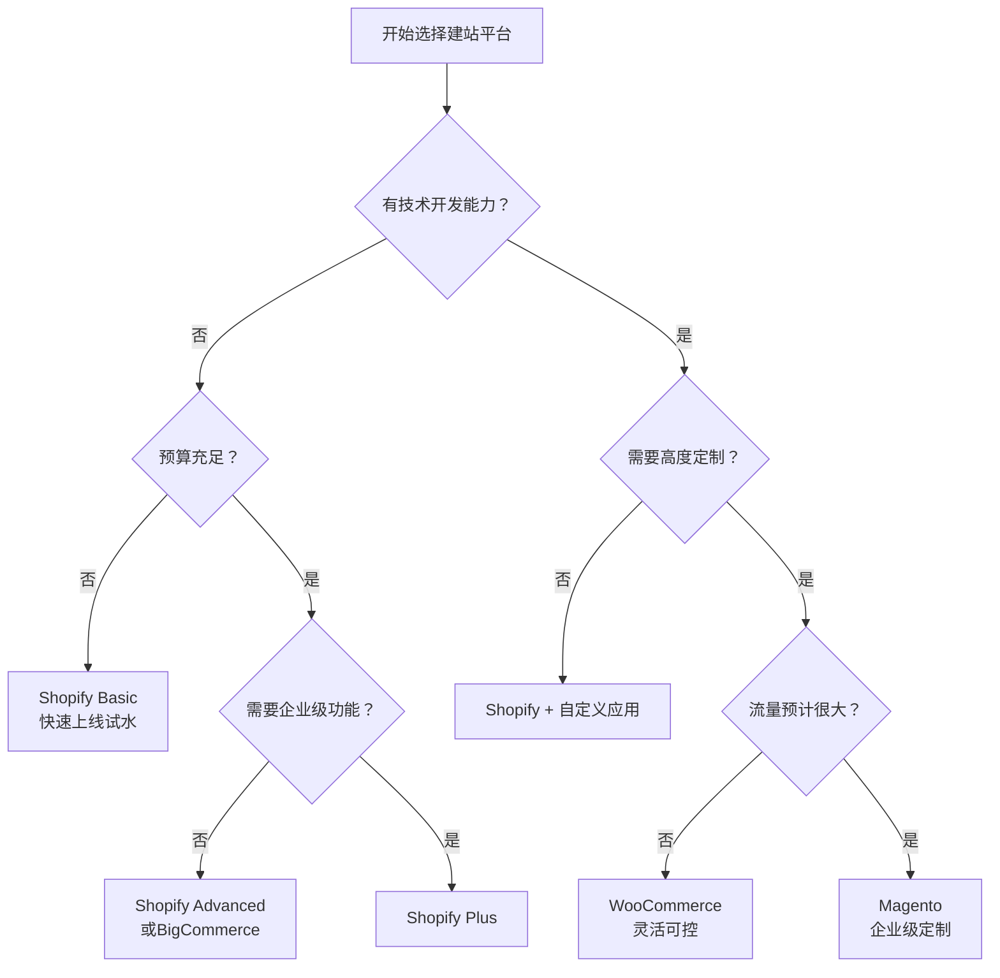
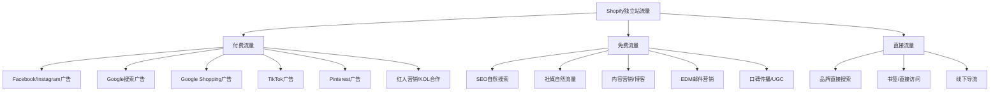
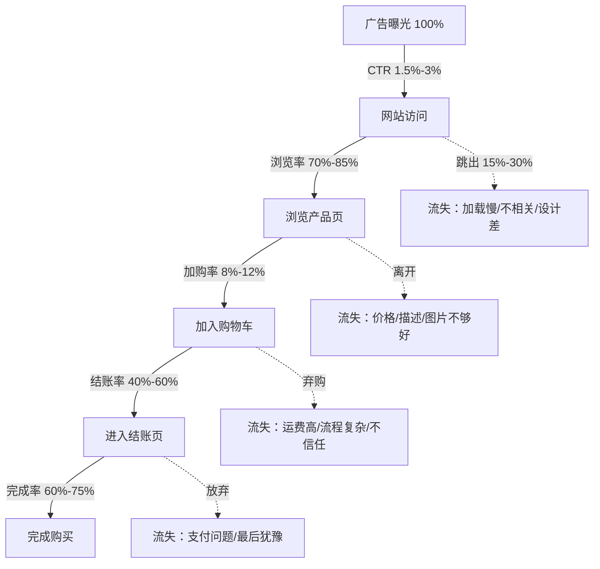

## 三、Shopify独立站生态

### 1. 为什么需要独立站

在跨境电商的三大模式中，独立站占据着独特而关键的位置。理解独立站的生态价值，首先要厘清它与平台模式的本质区别。

**平台模式的根本限制：**

在亚马逊、eBay等第三方平台上经营，卖家本质上是在"租用"平台的流量和基础设施。这带来了三个结构性限制：

1. **用户资产不属于你**——平台控制着用户数据、购买行为和复购入口。你在亚马逊上积累了10万粉丝，这些粉丝的品牌认知建立在"亚马逊购物"这个场景上，而非你的品牌本身。
2. **规则随时可能改变**——2021年亚马逊大规模封号事件中，超过5万中国卖家店铺被封，累计损失超过千亿元人民币。这不是偶发事件，而是平台模式下卖家无法掌控自身命运的结构性风险。
3. **利润空间被持续压缩**——平台佣金、广告费用、仓储费用、退货政策等层层叠加。以亚马逊为例，综合费率（佣金+FBA+广告）通常占售价的30%-45%，留给卖家的利润空间极其有限。

**独立站的核心价值：**

独立站（Self-hosted E-commerce Website）是指卖家自主搭建、自主运营的电商网站，拥有完整的域名所有权、用户数据所有权和运营自主权。其核心价值体现在三个层面：

| 价值维度 | 平台模式 | 独立站模式 |
|----------|----------|------------|
| 品牌资产 | 品牌弱化，用户记住的是平台 | 品牌独立，用户认知直接关联品牌 |
| 数据资产 | 平台掌控用户数据 | 完整拥有用户行为、偏好、购买数据 |
| 利润结构 | 综合费率30%-45% | 综合费率15%-25%（含广告） |
| 流量自主 | 依赖平台分配 | 自主获取，可通过SEO/社媒/内容持续积累 |
| 客户关系 | 一次性交易 | 可建立长期关系，提升LTV |
| 规则风险 | 高，平台政策不可控 | 低，自主掌控运营规则 |

**独立站适合什么样的卖家？**

并非所有卖家都适合独立站。独立站最适合以下几类：

- **有品牌意识的卖家**：愿意投入时间建设品牌，而非单纯卖货
- **有内容能力的团队**：能够持续产出优质的营销内容（视频、图文、社媒）
- **有一定资金储备**：独立站前期需要在广告投放上投入资金获取初始流量
- **追求高利润率的卖家**：愿意用前期投入换取长期更高的利润空间
- **想要掌控命运的卖家**：不希望自己的生意完全受制于平台规则

### 2. Shopify平台全景解析

#### 2.1 Shopify是什么

Shopify是全球最大的电商SaaS（Software as a Service）平台，由加拿大人Tobias Lütke于2006年创立。创立的初衷是Lütke想在网上卖自己设计的滑雪板，但发现当时的建站工具极其难用，于是自己写了一套电商系统——这就是Shopify的雏形。

截至2025年，Shopify的全球数据：

- **活跃商家**：超过200万家企业在Shopify上经营
- **GMV（商品交易总额）**：2024年全年GMV超过2350亿美元
- **覆盖国家**：175个国家和地区
- **员工数量**：约12,000人
- **市值**：超过1200亿美元（2025年数据）

Shopify的定位不是亚马逊那样的"市场"（Marketplace），而是"基础设施提供商"。它不参与买卖双方的交易，不控制流量分配，不与卖家竞争——它只是提供工具，让卖家能够快速搭建自己的在线商店。

#### 2.2 Shopify的商业模式

Shopify的收入来源分为两大板块：

**1. 订阅解决方案（Subscription Solutions）**——占总收入约28%

即卖家按月/年支付的平台使用费。不同套餐的价格和功能差异如下：

| 套餐 | 月费（美元） | 信用卡费率 | 员工账号 | 核心差异 |
|------|-------------|-----------|----------|----------|
| Basic | $39/月 | 2.9% + $0.30 | 2 | 基础功能，适合新手试水 |
| Shopify | $105/月 | 2.6% + $0.30 | 5 | 专业报表，适合成长期卖家 |
| Advanced | $399/月 | 2.4% + $0.30 | 15 | 高级报表、自定义运费、关税预估 |
| Plus | 起价$2,300/月 | 可协商 | 无限 | 企业级功能，B2B批发，多店铺管理 |

**2. 商家解决方案（Merchant Solutions）**——占总收入约72%

这是Shopify更大的收入来源，包括：

- **Shopify Payments**：Shopify自有的支付处理服务，每笔交易收取手续费（已在套餐表中列出）
- **Shop Capital**：向商家提供商业贷款和现金预支
- **Shopify Shipping**：与USPS、DHL、UPS合作的折扣运费
- **Shopify Markets**：跨境销售工具，自动处理关税、税费、货币转换
- **Shopify POS**：线下零售点销售系统
- **Shopify Fulfillment Network**：物流履约网络（正在扩展中）
- **应用商店佣金**：对第三方应用开发者收取15%-20%的收入分成
- **Shopify Balance**：商家银行账户和借记卡服务

这种商业模式意味着Shopify的利润与商家的销售额直接绑定——商家卖得越多，Shopify赚得越多。这保证了Shopify有强烈的动力帮助商家成功。

#### 2.3 Shopify的技术架构

理解Shopify的技术架构有助于做出更明智的建站决策：

```text
Shopify技术栈层次结构：

┌─────────────────────────────────────────────┐
│              商家运营层                       │
│  后台管理 │ 主题定制 │ 应用安装 │ API集成     │
├─────────────────────────────────────────────┤
│              Shopify核心引擎                  │
│  商品管理 │ 订单处理 │ 支付网关 │ 物流API     │
│  客户管理 │ 库存同步 │ 分析报表 │ SEO引擎     │
├─────────────────────────────────────────────┤
│              Liquid模板引擎                   │
│  主题渲染 │ 动态内容 │ 自定义页面 │ 邮件模板   │
├─────────────────────────────────────────────┤
│              基础设施层                       │
│  全球CDN │ 自动扩容 │ SSL证书 │ 数据备份     │
└─────────────────────────────────────────────┘
```

**关键技术特点：**

- **Liquid模板语言**：Shopify使用自研的Liquid作为主题模板语言，它是一种安全的模板引擎，不直接执行服务器端代码，这使得主题安装不会带来安全风险。
- **全球CDN**：Shopify使用Fastly和Cloudflare的全球CDN网络，确保全球各地的访客都能快速加载页面。
- **自动扩展**：商家无需担心流量高峰（如黑五）导致网站崩溃，Shopify的基础设施会自动处理流量扩容。
- **API优先架构**：Shopify提供完整的REST和GraphQL API，允许开发者构建自定义应用、集成第三方系统、甚至创建无头电商（Headless Commerce）。

#### 2.4 Shopify应用生态

Shopify的应用商店（App Store）是其生态系统中最具价值的部分之一。截至2025年，应用商店中超过10,000款应用，覆盖电商运营的各个环节。

**核心应用分类及代表产品：**

| 类别 | 功能描述 | 代表应用 | 典型价格 |
|------|----------|----------|----------|
| **营销推广** | 社媒整合、广告投放、红人营销 | Klaviyo、Omnisend、Privy | $20-$300/月 |
| **SEO优化** | 搜索引擎优化、站内搜索 | SEO Manager、Searchanise | $10-$50/月 |
| **评价管理** | 产品评价收集和展示 | Judge.me、Loox、Yotpo | $0-$50/月 |
| **邮件营销** | 自动化邮件、弃单挽回、EDM | Klaviyo、Mailchimp | $20-$200/月 |
| **客服支持** | 在线聊天、工单系统、FAQ | Gorgias、Tidio、Zendesk | $10-$300/月 |
| **物流履约** | 多渠道物流、物流追踪 | ShipStation、AfterShip | $10-$100/月 |
| **数据分析** | 高级分析、热力图、用户行为 | Lucky Orange、Hotjar、GA4 | $0-$50/月 |
| **转化优化** | 弹窗、倒计时、信任标识 | Vitals、ReConvert | $10-$50/月 |
| **社交证明** | 最近购买通知、访客计数 | Sales Pop、Proof Bear | $0-$20/月 |
| **产品定制** | 定制化产品、3D展示 | Infinite Options、Zakeke | $10-$100/月 |

**应用选型原则：**

应用不是越多越好。每安装一个应用，都会在网站前端加载额外的JavaScript代码，直接影响页面加载速度。建议遵循以下原则：

1. **优先选择官方或Shopify Plus认证应用**——质量有保障，兼容性更好
2. **功能覆盖度优先于数量**——选择一个综合型应用（如Vitals覆盖30+功能），胜过安装10个单一功能应用
3. **关注应用对页面速度的影响**——安装前在Google PageSpeed Insights测试前后对比
4. **定期清理未使用的应用**——每季度审计一次，删除不再使用的应用及其残留代码
5. **付费应用的ROI要可量化**——每个付费应用都应该能证明其带来的收益超过其成本

### 3. 独立站建站平台深度对比

Shopify虽然是市场领导者，但并非唯一选择。选择建站平台是独立站的第一个关键决策，需要从多个维度进行评估。

#### 3.1 四大主流建站平台对比

| 维度 | Shopify | WooCommerce | Magento | BigCommerce |
|------|---------|-------------|---------|-------------|
| **本质** | SaaS托管平台 | WordPress插件 | 开源电商平台 | SaaS托管平台 |
| **技术门槛** | 低，无代码即可上手 | 中，需要WordPress基础 | 高，需要专业开发团队 | 低，类似Shopify |
| **启动成本** | $39/月起 | 免费（插件），但需服务器$5-$50/月 | 社区版免费，企业版$22,000+/年 | $39/月起 |
| **主题生态** | 200+官方主题，数千第三方 | 数千免费/付费主题 | 数百专业主题 | 200+主题 |
| **应用/插件生态** | 10,000+应用 | 60,000+插件 | 5,000+扩展 | 1,000+应用 |
| **SEO能力** | 优秀，内置基础SEO | 极强，Yoast等插件加持 | 极强，完全自定义 | 优秀 |
| **性能** | 优秀，自动CDN+扩展 | 取决于服务器和优化 | 取决于服务器和优化 | 优秀，自动CDN |
| **定制性** | 中等，通过Liquid和API | 高，完全开源可改 | 极高，完全开源 | 中等，API驱动 |
| **适合卖家** | 中小卖家，快速上线 | 有技术能力的团队 | 大型企业，高流量站点 | 中等规模卖家 |
| **学习曲线** | 1-2周 | 2-4周 | 2-6个月 | 1-2周 |

#### 3.2 如何选择适合自己的平台

选择建站平台的核心逻辑不是"哪个最好"，而是"哪个最适合你当前的阶段和资源"。

**决策矩阵：**



**各平台典型用户画像：**

- **Shopify**：独立站新手、中小品牌、DTC品牌、Dropshipping卖家、注重快速上线和易用性的团队
- **WooCommerce**：有WordPress经验的团队、内容驱动型电商（博客+电商）、预算有限但有技术能力的卖家
- **Magento/Adobe Commerce**：年销售额超过1000万美元的大型企业、需要高度定制的B2B业务、有专业开发团队的公司
- **BigCommerce**：从Shopify需要更多内置功能（如多渠道、B2B）但不想自建的中型卖家

#### 3.3 为什么Shopify成为跨境电商首选

在跨境电商场景下，Shopify之所以成为大多数中国卖家的首选，有几个关键原因：

1. **全球化基础设施**：175个国家覆盖、多语言支持、多币种结算、关税和税费自动计算——这些是跨境电商的刚需功能，Shopify全部内置。
2. **Shopify Markets**：这是一个专门为跨境卖家设计的工具套件，可以自动根据访客所在国家展示对应的语言、货币和税率，大大降低了跨境运营的复杂度。
3. **支付集成最完整**：Shopify Payments（覆盖主要市场）+ 支持100+第三方支付网关，几乎可以接入全球所有主流支付方式。
4. **物流生态最成熟**：Shopify Shipping提供折扣运费，Shopify Fulfillment Network提供履约服务，还有大量第三方物流应用可选。
5. **学习资源最丰富**：Shopify官方博客、Shopify Academy、Shopify Community、YouTube教程——新手最容易找到帮助。

### 4. Shopify独立站的盈利模型

独立站能否盈利，核心在于是否理解并管控好成本结构。

#### 4.1 完整成本结构拆解

一个典型的Shopify独立站的成本结构如下（以月销售额$10,000为基准）：

| 成本项 | 占售价比例 | 月成本（基于$10,000销售额） | 说明 |
|--------|-----------|---------------------------|------|
| **商品采购成本** | 20%-35% | $2,000-$3,500 | 1688/工厂直接采购 |
| **国际物流** | 15%-25% | $1,500-$2,500 | 小包直发或海外仓 |
| **平台订阅费** | 0.4%-3.9% | $39-$399 | 取决于套餐等级 |
| **支付手续费** | 2.4%-2.9% + $0.30/笔 | $240-$290 | Shopify Payments费率 |
| **广告投放** | 15%-30% | $1,500-$3,000 | Facebook/Google/TikTok广告 |
| **应用费用** | 1%-3% | $100-$300 | 各类Shopify应用 |
| **退货损失** | 3%-8% | $300-$800 | 退货率×退货处理成本 |
| **客服/人力** | 3%-5% | $300-$500 | 客服外包或自建团队 |
| **其他杂费** | 1%-3% | $100-$300 | 域名、邮件工具、设计素材等 |

**综合利润率计算：**

按中位数计算：售价$10,000时，总成本约$6,500-$8,500，净利润约$1,500-$3,500，净利润率约15%-35%。

与亚马逊平台对比，独立站少了平台佣金（8%-15%），但多了广告投放成本（15%-30%）。在经营初期，独立站的利润率可能低于亚马逊；但随着品牌认知度提升、自然流量增长（SEO、口碑、复购），广告依赖度下降，利润率会显著提升。

#### 4.2 盈亏平衡分析

独立站的盈亏平衡点受多个变量影响。以下是一个简化模型：

```text
盈亏平衡公式：

月固定成本 = 平台费 + 应用费 + 基本人力成本
月变动成本 = (采购成本 + 物流成本 + 支付手续费) × 订单数
月广告支出 = CPC × 点击量 = CPC × (订单数 / 转化率)
月收入 = 客单价 × 订单数

盈亏平衡点：月收入 = 月固定成本 + 月变动成本 × 订单数 + 月广告支出

假设：
- 平台费 $105/月（Shopify标准套餐）
- 应用费 $200/月
- 客单价 $45
- 单位采购成本 $12
- 单位物流成本 $8
- 支付手续费 2.7%
- CPC $0.80
- 转化率 2.0%

每笔订单的毛利：
$45 - $12 - $8 - $1.22(支付手续费) = $23.78

每笔订单的广告成本：
$0.80 × (1 / 0.02) = $40

每笔订单的净利润：
$23.78 - $40 = -$16.22（亏损！）

这意味着在转化率2%、CPC $0.80的情况下，仅靠广告拉客是亏钱的。
```

**盈亏平衡的关键杠杆：**

| 杠杆 | 从亏损到盈利的方向 | 具体行动 |
|------|-------------------|----------|
| 转化率 | 提高到3%以上 | 优化落地页、产品页、结账流程 |
| 客单价 | 提高到$60以上 | 捆绑销售、交叉推荐、高价值品类 |
| CPC | 降低到$0.50以下 | 优化广告素材、精准定向、长尾关键词 |
| 复购率 | 提高到20%以上 | 邮件营销、会员体系、品牌忠诚度 |
| 自然流量占比 | 提高到40%以上 | SEO、内容营销、社交口碑 |

**核心结论**：独立站盈利的关键不是"降低广告费"，而是"提升转化率和复购率"。一个转化率3%、复购率20%的独立站，即使CPC更高也能盈利；而一个转化率1%、复购率0%的独立站，再怎么降低广告费也很难盈利。

### 5. Shopify独立站的流量获取体系

独立站没有平台自带流量，流量获取是最大的挑战，也是最大的壁垒。一旦建立起稳定的流量体系，就是竞争对手难以复制的护城河。

#### 5.1 流量来源全景图



#### 5.2 付费流量核心策略

**Facebook/Instagram广告：**

Facebook广告是独立站最主流的流量来源，适合大多数品类。核心在于素材和受众定位。

- **冷启动策略**：使用Broad Targeting（广泛定向），让Facebook的算法自动寻找高转化人群。不要过早限制受众，给算法足够的数据学习空间。
- **素材为王**：2025年的Facebook广告，素材的重要性超过定向。一个好素材+广泛定向，远胜于差素材+精准定向。投入80%的精力在素材制作上。
- **创意测试框架**：每周测试5-10个新素材，每个素材$20-$50的测试预算。保留CTR（点击率）>1.5%、CPA（获客成本）达标的素材，淘汰其余。
- **广告结构**：推荐CBO（Campaign Budget Optimization）+ Advantage+ Shopping Campaign的组合，让Facebook算法自动分配预算到最优广告组。

**Google广告：**

Google广告适合有明确搜索需求的产品（功能性产品、解决问题型产品）。

- **搜索广告**：捕捉"有购买意图"的搜索流量。关键词选择上，优先高购买意图的词（如"buy waterproof hiking boots"而非"hiking boots"）。
- **Google Shopping**：产品图片直接展示在搜索结果中，转化率通常高于搜索广告。需要配置Google Merchant Center，优化产品Feed。
- **Performance Max（PMax）**：Google的全自动广告类型，覆盖搜索、展示、YouTube、Gmail等多个渠道。适合缺乏广告经验的卖家，但需要提供足够的素材资源。

**TikTok广告：**

TikTok广告适合时尚、美妆、家居等视觉化品类，以及面向年轻受众的产品。

- **素材要求**：必须像原生TikTok内容，不能像传统广告。前3秒必须抓住注意力，整体节奏要快。
- **Spark Ads**：将自然表现好的视频转化为广告，效果通常好于品牌自制素材。
- **TikTok Shop整合**：如果开通了TikTok Shop，可以直接在TikTok内完成购买，缩短转化路径。

#### 5.3 SEO长期策略

SEO是独立站最重要的免费流量来源，但需要6-12个月才能看到显著效果。

**SEO的基础框架：**

| SEO层面 | 关键动作 | 工具 |
|---------|----------|------|
| **技术SEO** | 确保网站可被爬取、加载速度快、移动端友好、结构化数据 | Google Search Console、PageSpeed Insights |
| **页面SEO** | 标题标签、Meta描述、H1标签、图片Alt文本、URL结构 | Ahrefs、SEMrush |
| **内容SEO** | 博客文章、产品描述优化、FAQ页面、购买指南 | ChatGPT辅助写作、SurferSEO |
| **外链建设** | 客座博客、PR媒体报道、红人链接、行业目录 | HARO、BuzzStream |
| **本地SEO** | Google Business Profile、本地目录注册 | Google Business |

**Shopify特有的SEO注意事项：**

- **重复内容问题**：Shopify的产品可能通过多个URL访问（带/不带集合前缀），需要使用canonical标签指向主URL。
- **URL结构限制**：Shopify的URL结构固定为`/collections/xxx`、`/products/xxx`，无法完全自定义。这是SEO的一个小劣势，但实际影响有限。
- **博客功能**：Shopify内置博客功能，但功能较WordPress弱。如果内容营销是核心策略，可以考虑用WordPress搭建博客子域，再链接到Shopify主站。
- **站点地图**：Shopify自动生成sitemap.xml，但无法自定义。如果需要更精细的控制，可以使用应用或手动提交页面到Google Search Console。

#### 5.4 内容营销与社交媒体

内容营销是建立品牌认知和获取免费流量的长效手段。

**内容矩阵建议：**

| 内容类型 | 发布频率 | 平台 | 目的 |
|----------|----------|------|------|
| 博客文章 | 每周1-2篇 | Shopify博客 | SEO+内容权威 |
| 短视频 | 每天1-3条 | TikTok、Instagram Reels | 品牌曝光+引流 |
| 产品教程 | 每周1-2条 | YouTube | SEO+信任建立 |
| 用户UGC | 持续收集 | Instagram、TikTok | 社会证明+素材复用 |
| EDM邮件 | 每周1-2封 | Klaviyo | 客户留存+复购 |
| 社区互动 | 每天 | Facebook Groups、Reddit | 品牌口碑+洞察 |

### 6. Shopify独立站的转化率优化（CRO）

流量获取只是第一步，将访客转化为付费客户才是盈利的关键。独立站的行业平均转化率约为1.5%-2.5%，优秀的独立站可以达到3%-5%，顶级品牌可以做到5%以上。

#### 6.1 转化漏斗分析



#### 6.2 各环节优化策略

**落地页优化：**

- **首屏3秒法则**：访客在3秒内决定是否继续浏览。首屏必须包含：价值主张（你能解决什么问题）、核心视觉（产品图片或视频）、信任要素（评价数量、认证标识）
- **移动端优先**：超过70%的Shopify流量来自移动端。所有设计必须以移动端体验为优先，桌面端作为补充。
- **页面加载速度**：每延迟1秒，转化率下降约7%。目标是LCP（最大内容绘制）<2.5秒。优化手段包括：压缩图片（使用WebP格式）、减少应用加载的JS代码、使用Shopify的原生功能替代第三方应用。

**产品页优化：**

- **高质量产品图片**：至少5-8张图片，包含白底主图、场景图、细节图、尺寸对比图、使用场景图。2025年的趋势是产品视频和360度展示。
- **产品描述结构**：使用"问题→解决方案→功能特点→社会证明→行动号召"的结构。避免纯参数堆砌，用客户能理解的语言描述产品价值。
- **评价展示**：有评价的产品转化率比无评价的高约270%。使用Judge.me或Loox等应用自动收集图文评价，展示在产品页关键位置。
- **信任要素**：安全支付标识（信用卡图标、PayPal标识）、退换货政策、物流时效承诺、实时购买通知。

**结账流程优化：**

- **Guest Checkout（游客结账）**：强制注册账号是弃购的头号杀手。允许游客直接结账，注册作为可选项。
- **进度指示器**：在结账页面显示"信息→配送→支付"的进度条，让客户知道还剩几步。
- **多种支付方式**：除了信用卡，必须支持PayPal、Apple Pay、Google Pay、Shop Pay。提供越多支付选择，弃购率越低。
- **运费透明化**：在产品页就显示运费信息，避免在结账页面给客户"价格惊喜"。包邮门槛是提升客单价的有效手段。
- **弃单挽回邮件**：配置三封自动邮件序列：
  - 第1封（弃单后1小时）：提醒客户购物车中的商品，不附带折扣
  - 第2封（弃单后24小时）：提供5%-10%折扣码
  - 第3封（弃单后72小时）：提供15%折扣码或免运费，制造紧迫感

#### 6.3 A/B测试方法论

转化率优化不是靠猜测，而是靠数据驱动的持续测试。

**A/B测试的基本流程：**

1. **数据分析**：通过Google Analytics和热力图（Hotjar/Lucky Orange）找到转化漏斗中的瓶颈环节
2. **提出假设**：例如"将'加入购物车'按钮从灰色改为橙色可以提高点击率"
3. **设计测试**：创建A版本（原始）和B版本（修改），确保只有一个变量不同
4. **运行测试**：使用Shopify的原生A/B测试功能（需Plus套餐）或Google Optimize等工具，运行至少2周或直到样本量达到统计显著性
5. **分析结果**：确认胜出版本的提升是否具有统计显著性（p值<0.05）
6. **实施胜出版本**：将胜出版本设为默认，进入下一轮测试

**值得优先测试的元素：**

| 测试元素 | 预期影响 | 测试难度 |
|----------|----------|----------|
| 产品主图 | 高 | 低 |
| CTA按钮文案和颜色 | 中 | 低 |
| 价格展示方式 | 高 | 低 |
| 免运费门槛 | 高 | 低 |
| 产品页布局 | 中 | 中 |
| 结账流程步骤 | 高 | 高 |
| 首页首屏设计 | 中 | 中 |

### 7. Shopify独立站运营的常见误区

#### 误区一：盲目追求网站"好看"

很多卖家花费大量时间和资金在网站的视觉设计上，追求"高大上"的效果。但转化率最高的独立站往往不是最好看的，而是最"好用"的。

**纠正方法**：以转化数据为标准而非审美偏好。简洁清晰的设计 > 复杂华丽的设计。参考行业标杆（如Gymshark、Allbirds、MVMT）的布局逻辑而非视觉效果。

#### 误区二：安装过多应用

每个Shopify应用都会加载额外的JavaScript代码到前端。安装20-30个应用后，页面加载速度可能从2秒恶化到5-6秒，直接导致大量访客流失。

**纠正方法**：每安装一个应用前，先用Google PageSpeed Insights测试基准速度，安装后再测试对比。速度下降超过0.5秒的应用需要慎重评估其必要性。定期（每月）审计已安装应用，删除不活跃或重叠功能的应用。

#### 误区三：忽视邮件营销

很多卖家认为"邮件营销是欧美市场的做法，不适合我们"，或者觉得"发邮件太老套了"。事实上，邮件营销是Shopify独立站ROI最高的营销渠道之一，平均每投入$1可带来$36-$45的回报。

**纠正方法**：从Day 1开始收集邮箱。使用弹窗（Popup）提供首单折扣换取邮箱，配置欢迎邮件序列、弃单挽回邮件、购后跟进邮件、VIP客户专属邮件。推荐使用Klaviyo，它与Shopify的集成最深度。

#### 误区四：只靠广告获取流量

纯依赖广告流量的独立站，本质上是"给Facebook/Google打工"。一旦广告成本上升或政策变化，生意立刻受冲击。

**纠正方法**：从建站第一天就规划SEO和内容营销策略。即使短期内看不到效果，6-12个月后的自然流量将成为最稳定、最低成本的流量来源。目标是6个月内将自然流量占比提升到30%以上。

#### 误区五：不重视数据

"感觉还行"是独立站经营中最危险的判断。很多卖家不安装Google Analytics、不看数据报表、不做A/B测试，凭感觉做决策。

**纠正方法**：必须配置Google Analytics 4（GA4），建立核心指标看板（日UV、转化率、客单价、ROAS、弃购率），每周至少分析一次数据，每月做一次全面复盘。

### 8. Shopify独立站的发展趋势

#### 8.1 AI驱动的电商体验

Shopify在2024-2025年大力投入AI能力：

- **Shopify Magic**：AI自动生成产品描述、邮件文案、博客内容
- **Sidekick**：AI助手，帮助商家分析数据、优化运营决策
- **AI个性化推荐**：基于用户行为的个性化产品推荐，提升转化率
- **AI客服**：智能客服机器人处理常见问题，降低人工客服成本

#### 8.2 社交商务（Social Commerce）深度融合

Shopify与TikTok、Instagram、Facebook、Pinterest等社交平台的集成越来越深。商家可以在Shopify后台直接管理社交平台上的商品目录、广告投放和订单处理，实现"社媒种草→独立站转化→社媒再营销"的闭环。

#### 8.3 无头电商（Headless Commerce）

无头电商是指将前端展示与后端逻辑分离，使用React/Vue等现代前端框架构建前端，通过Shopify的Storefront API获取数据。这种架构提供了极致的定制能力和页面速度，但需要开发者资源。代表案例包括Nike、Staples等大型品牌。

Shopify的Hydrogen框架（基于React）为无头电商提供了官方支持，降低了技术门槛。

#### 8.4 B2B电商功能

Shopify Plus新增了大量B2B功能：公司账户、批发定价、采购订单、自定义支付条款等。这意味着传统B2B外贸企业也可以用Shopify搭建在线批发平台，而不仅仅是B2C零售。

### 9. 本节要点回顾

| 知识点 | 核心要点 |
|--------|----------|
| 独立站价值 | 品牌资产、数据自主、利润空间、规则自主 |
| Shopify商业模式 | SaaS订阅+商家解决方案，与商家利益绑定 |
| 平台选择 | Shopify适合大多数跨境电商卖家，WooCommerce适合有技术能力的团队，Magento适合大型企业 |
| 盈利模型 | 关键杠杆是转化率和复购率，而非单纯降低广告费 |
| 流量体系 | 付费流量（Facebook/Google/TikTok）+ 免费流量（SEO/内容/邮件）双轮驱动 |
| 转化优化 | 移动端优先、页面速度、信任要素、弃单挽回、A/B测试 |
| 常见误区 | 追求好看忽视好用、应用过多拖慢速度、忽视邮件营销、只靠广告、不看数据 |
