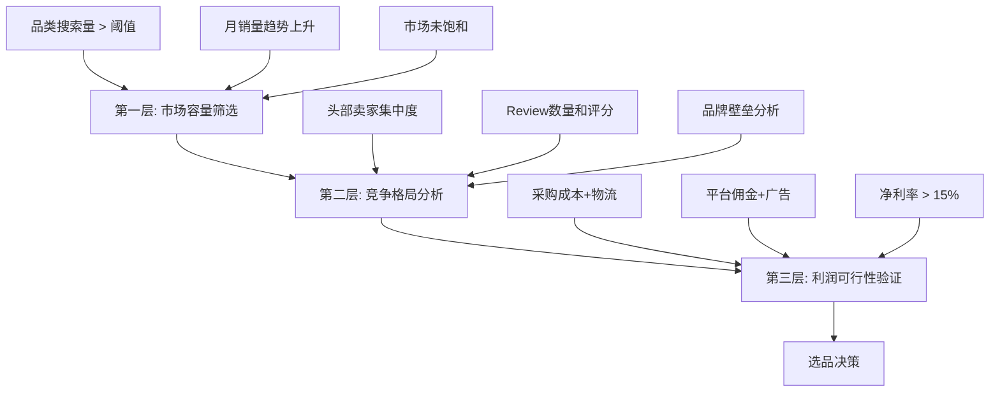
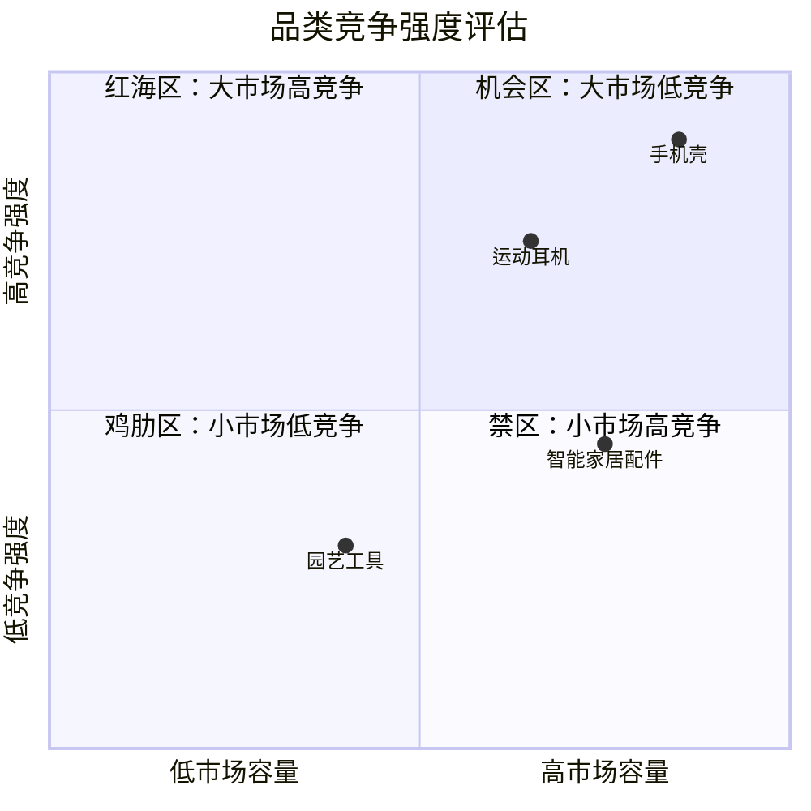
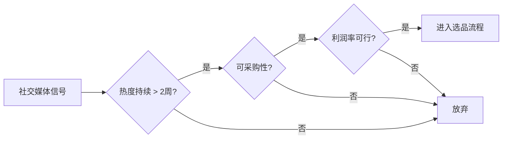
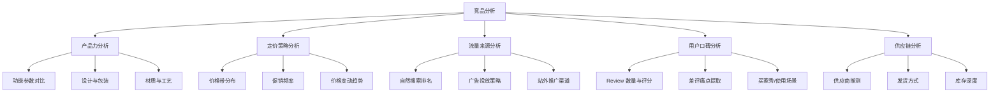
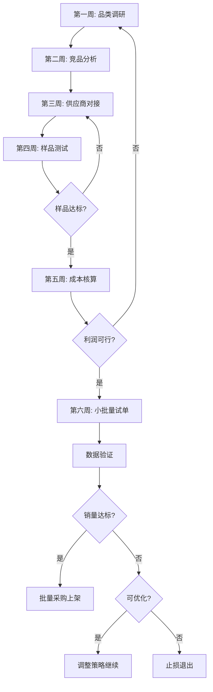

## 四、选品策略与市场分析

选品是跨境电商的生死线。业内有"七分靠选品，三分靠运营"的说法——一款对的产品可以让运营事半功倍，一款错的产品即使投入再多广告费也无力回天。本章系统讲解从零到一的选品方法论：如何用数据驱动决策、如何建立可复制的选品框架、如何规避常见的选品陷阱。

### 1. 选品的底层逻辑

#### 1.1 为什么选品是第一优先级

跨境电商的商业链条是：**选品 → 供应链 → 物流 → 运营 → 售后**。选品位于链条最上游，决定了后续所有环节的上限：

| 环节 | 好选品 | 差选品 |
|------|--------|--------|
| 利润空间 | 成本可控，溢价能力强 | 同质化严重，被迫打价格战 |
| 运营难度 | 差异化明显，自然转化率高 | 需要大量广告才能出单 |
| 售后压力 | 品质可靠，退货率低 | 质量问题多，差评不断 |
| 供应链 | 稳定供应商容易找到 | 小众品控难，断货频繁 |

选品错误的代价不仅是货款损失，还包括时间成本、仓储费用、广告支出和店铺权重的下降。一个失败的选品周期通常要 3-6 个月才能完全消化，这段时间的机会成本往往比直接损失更大。

#### 1.2 选品的三层筛选模型

优秀的选品不是灵感式的"我觉得这个好卖"，而是层层递进的数据筛选过程：



- **第一层**筛选掉没有需求的产品（搜索量太低、市场太小）
- **第二层**筛选掉竞争过于激烈的产品（巨头垄断、无法进入）
- **第三层**筛选掉算不过账的产品（成本太高、利润太薄）

只有通过三层筛选的产品，才值得投入资源开发。

#### 1.3 选品的核心原则

**需求真实性原则**：区分"伪需求"和"真需求"。真需求有持续稳定的搜索量和购买行为支撑；伪需求往往是一时热点，热度消退后库存变成废品。判断方法：查看 Google Trends 的 12 个月趋势，如果呈现稳定或上升态势，说明是真需求。

**差异化原则**：不进入完全同质化的市场。如果你的产品和前 10 名没有任何区别，你唯一能竞争的就是价格——而价格战是跨境卖家最不愿意打的仗。差异化可以体现在功能、设计、包装、组合、服务等多个维度。

**利润安全边际原则**：选品时必须预留足够的利润安全边际。汇率波动、物流涨价、平台政策变化都可能侵蚀利润。建议初始利润率不低于 25%，即使在最坏情况下也能保持 10% 以上的净利率。

**合规优先原则**：不同市场有不同的产品合规要求。欧盟的 CE 认证、美国的 FDA/FCC 认证、日本的 PSE 认证等，合规成本必须纳入选品考量。一些看似利润丰厚的品类（如电子产品、食品、儿童用品），合规门槛可能直接劝退中小卖家。

### 2. 市场调研方法论

#### 2.1 宏观市场分析：找到大赛道

宏观分析的目标是确定进入哪个品类赛道。核心关注三个维度：

**市场规模**：一个品类的年度 GMV（Gross Merchandise Value）决定了天花板。通常选择年 GMV 在 1-50 亿美元之间的品类——太小缺乏增长空间，太大则巨头林立。可以通过以下渠道获取数据：

- **平台公开报告**：Amazon 会定期发布品类增长报告
- **第三方数据工具**：Jungle Scout、Helium 10 提供品类销量估算
- **行业报告**：Statista、Euromonitor 提供宏观消费趋势

**增长趋势**：品类处于生命周期的哪个阶段直接影响进入策略：

| 生命周期阶段 | 特征 | 进入策略 |
|------------|------|----------|
| 导入期 | 搜索量低但增速快 | 高风险高回报，适合有供应链优势的卖家 |
| 成长期 | 搜索量快速增长，卖家涌入 | 最佳进入窗口，速度是关键 |
| 成熟期 | 增速放缓，格局稳定 | 需要差异化突破，成本较高 |
| 衰退期 | 搜索量下降，价格战激烈 | 不建议进入 |

**消费趋势**：关注消费行为的变化方向。当前跨境电商的重要趋势包括：
- **可持续消费**：环保材质、可降解包装、碳中和产品的需求持续增长
- **个性化定制**：消费者愿意为个性化产品支付溢价
- **健康与安全**：后疫情时代，健康相关品类持续增长
- **智能家居**：IoT 设备、智能家居配件的需求不断扩大
- **银发经济**：老年人用品在欧美市场增长迅速

#### 2.2 中观竞争分析：看清格局

确定赛道后，需要深入分析该赛道的竞争格局。

**竞争强度评估矩阵**：



**竞争分析的具体方法**：

1. **头部卖家集中度分析**：搜索目标关键词，统计前 20 名卖家的品牌、价格、销量、Review 数量。如果前 5 名占据了 60% 以上的市场份额，说明该品类已被头部垄断。

2. **Review 分析**：统计目标品类 Top 100 listing 的 Review 分布：
   - 平均 Review 数量 < 100：竞争门槛低，新品有机会
   - 平均 Review 数量 100-500：中等竞争，需要一定的运营投入
   - 平均 Review 数量 > 500：竞争激烈，需要长期投入

3. **品牌占比分析**：统计前 100 名中知名品牌和白牌卖家的比例。如果知名品牌占比超过 70%，说明品牌壁垒高，白牌进入困难。

4. **新品存活率**：统计过去 6 个月内新上架的产品，有多少存活到今天并获得了一定销量。存活率 > 30% 说明市场对新进入者相对友好。

#### 2.3 微观需求分析：理解消费者

微观分析是深入理解消费者的具体需求和痛点，是差异化选品的关键。

**Review 挖掘法**：系统性地阅读竞品的 1-3 星差评，提取消费者的真实痛点。具体操作步骤：

1. 收集目标品类 Top 20 竞品的 1-3 星 Review
2. 将 Review 内容分类整理（材质问题、功能缺陷、尺寸不符、使用困难等）
3. 统计每类问题出现的频率
4. 识别高频痛点，作为产品改进的方向

**关键词分析法**：通过消费者的搜索行为洞察真实需求：

- **长尾关键词**：搜索量不高但意图明确的关键词，代表细分需求
- **修饰词分析**：消费者在搜索时常用的修饰词（如 "portable"、"waterproof"、"lightweight"）反映了对产品属性的偏好
- **比较关键词**：消费者搜索 "A vs B" 时，说明在做购买决策，这类关键词对应的细分市场往往有差异化机会

**社交媒体监听**：通过 Reddit、Facebook Groups、YouTube 评论、TikTok 等平台了解消费者的讨论热点：

- Reddit 的相关 subreddit（如 r/BuyItForLife、r/EDC）经常有真实的产品讨论
- Facebook Groups 中的用户提问反映了未被满足的需求
- YouTube 产品评测视频的评论区是金矿，经常出现"我希望这个产品能..."的表述

### 3. 主流选品方法详解

#### 3.1 数据驱动选品法

数据驱动选品是最科学、最可复制的方法，核心工具是平台数据 + 第三方分析工具。

**Amazon BSR 分析法**：

Best Seller Rank (BSR) 是 Amazon 的热销排名，直接反映了产品的销售表现。选品步骤如下：

1. **锁定目标品类**：通过 Amazon 的品类树状结构，找到你的目标细分品类
2. **采集 BSR 数据**：记录 Top 100 产品的 BSR、价格、Review 数量、上架时间
3. **计算月销量**：使用 Jungle Scout 或 Helium 10 的销量估算功能，将 BSR 转化为月销量
4. **分析价格分布**：统计价格区间分布，找到主流价格带
5. **计算市场容量**：Top 100 月销量之和 ≈ 该品类月度市场容量

**BSR 与月销量的对应关系**（以 Amazon 美国站为例，不同品类有差异）：

| BSR 排名范围 | 预估月销量（件） |
|-------------|---------------|
| 1 - 10 | 3,000 - 30,000 |
| 11 - 100 | 500 - 3,000 |
| 101 - 500 | 100 - 500 |
| 501 - 1,000 | 50 - 100 |
| 1,001 - 5,000 | 20 - 50 |
| 5,001 - 10,000 | 10 - 20 |

**Google Trends 验证法**：在确定候选产品后，用 Google Trends 验证需求趋势：

1. 搜索产品核心关键词的过去 12 个月趋势
2. 对比不同产品的趋势曲线
3. 优先选择趋势稳定或上升的产品
4. 注意季节性产品（如圣诞装饰）的周期性波动

#### 3.2 供应链反向选品法

这种方法从供应链端出发，适合有工厂资源或靠近产业带的卖家。

**产业带选品逻辑**：中国各产业带有成熟的生产集群，了解产业带分布可以直接找到有供应链优势的产品：

| 产业带 | 主要品类 | 优势 |
|--------|---------|------|
| 深圳/东莞 | 电子产品、数码配件 | 供应链完整，新品迭代快 |
| 义乌 | 小商品、日用品 | 品类齐全，价格极具竞争力 |
| 广州 | 服装、箱包、美妆 | 设计能力强，快时尚响应快 |
| 佛山 | 家具、建材 | 品质好，定制能力强 |
| 宁波 | 文具、小家电 | 品控好，适合中高端定位 |
| 中山 | 灯具、家电 | 产业集群成熟 |
| 泉州 | 鞋服、食品 | 品牌意识强，质量稳定 |

**反向选品的操作步骤**：

1. 走访产业带工厂，了解其产品线和产能
2. 筛选适合跨境销售的产品（考虑物流体积、合规要求）
3. 查询目标平台上的竞争情况
4. 评估差异化空间（工厂是否支持定制）
5. 核算完整的成本模型

#### 3.3 差异化创新选品法

差异化选品的核心是在现有品类中找到被忽视的需求，通过产品改进创造竞争优势。

**差评驱动改进法**：

这是最经典的差异化方法。以一个具体案例说明：

某卖家计划进入瑜伽垫品类，通过分析 Top 50 竞品的差评，发现以下高频痛点：

1. **防滑性不够**（出现频率 35%）：出汗后打滑
2. **异味严重**（出现频率 25%）：新垫子有刺鼻气味
3. **容易开裂**（出现频率 20%）：使用几个月后表面开裂
4. **厚度不够**（出现频率 15%）：关节不适
5. **收纳不便**（出现频率 5%）：没有配套收纳方案

基于这些数据，该卖家制定了差异化策略：
- 采用双层防滑设计（底部天然橡胶防滑 + 表面微纹理）
- 使用 TPE 环保材料，零异味
- 加厚至 8mm，同时保持重量可控
- 附赠收纳带和清洁喷雾

最终该产品定价比市场均价高 30%，但凭借差异化卖点实现了月销 2000+ 的成绩。

**组合创新法**：将两个相关产品组合成套装，创造新的使用场景：

- 宠物喂食碗 + 慢食垫 → 防噎慢食套装
- 瑜伽垫 + 瑜伽砖 + 伸展带 → 瑜伽入门套装
- 厨房秤 + 量杯 + 计时器 → 烘焙工具套装

组合的关键是提升使用体验的完整性，而不是简单捆绑。

#### 3.4 社交趋势选品法

社交媒体正在成为选品的重要信号源，尤其是 TikTok、Instagram、Pinterest 等视觉化平台。

**TikTok 选品法**：

1. 关注 #TikTokMadeMeBuyIt 标签，该标签下产品的转化率通常很高
2. 使用 TikTok Creative Center 查看热门产品和趋势
3. 关注产品的"种草-拔草"周期：如果一个产品在 TikTok 上火了 2-4 周内搜索量飙升，说明是真实需求；如果热度在几天内消退，可能是泡沫

**趋势识别框架**：



### 4. 选品数据工具体系

#### 4.1 专业选品工具对比

| 工具 | 平台支持 | 核心功能 | 价格（月） | 适用场景 |
|------|---------|---------|-----------|---------|
| Jungle Scout | Amazon | 选品数据库、销量估算、关键词研究 | $49-$129 | Amazon 选品首选 |
| Helium 10 | Amazon | 全套选品+运营工具 | $39-$249 | 深度数据分析 |
| Keepa | Amazon | 历史价格和 BSR 追踪 | €19 | 价格趋势分析 |
| Sorftime | Amazon | 选品数据库、市场分析 | $9.9-$39.9 | 性价比之选 |
| AliExpress Dropshipping Center | AliExpress | 热销产品、供应商分析 | 免费 | 选品灵感和验证 |
| Google Trends | 通用 | 搜索趋势分析 | 免费 | 需求验证 |
| Semrush / Ahrefs | 通用 | 关键词研究、竞争分析 | $99-$199 | SEO 和市场需求分析 |
| Exploding Topics | 通用 | 新兴趋势发现 | $39 | 发现早期趋势 |

#### 4.2 免费选品工具和数据源

除了付费工具，还有大量免费资源可以辅助选品：

**Amazon 自身数据**：
- **Best Sellers 页面**：浏览各品类的热销产品
- **Movers & Shakers**：24 小时内排名上升最快的产品
- **New Releases**：新上架产品的热销排名
- **Wish List**：消费者的愿望清单反映潜在需求
- **Customer Questions**：消费者的提问反映了购买决策中的疑虑

**Google 免费工具**：
- **Google Trends**：搜索趋势、地区分布、相关查询
- **Google Keyword Planner**：搜索量和竞争度数据
- **Google Shopping**：产品价格分布和竞争情况

**社交媒体数据**：
- **TikTok Creative Center**：热门产品和广告趋势
- **Pinterest Trends**：视觉消费趋势
- **Reddit**：真实的用户讨论和需求反馈

#### 4.3 构建自己的选品数据表

建议用 Google Sheets 或 Excel 建立标准化的选品评估表，每次选品都填写统一的维度，便于横向对比。推荐以下字段：

```markdown
| 字段 | 说明 | 示例 |
|------|------|------|
| 产品名称 | 候选产品描述 | 硅胶折叠水杯 |
| 核心关键词 | 主搜索词 | collapsible water bottle |
| 月搜索量 | 关键词月度搜索量 | 45,000 |
| Top10 均价 | 前 10 名平均售价 | $14.99 |
| Top10 月均销量 | 前 10 名月均销量估算 | 3,200 |
| Top10 均 Review | 前 10 名平均 Review 数 | 1,850 |
| 采购成本 | 1688/工厂报价 | ¥12 |
| 头程物流 | 单件物流成本 | $1.50 |
| FBA 费用 | 平台物流费用 | $3.48 |
| 广告成本 | 预估单件广告费 | $2.00 |
| 毛利率 | 计算公式 | 35% |
| 差异化空间 | 从差评中发现的机会 | 密封性改进、颜色定制 |
| 合规要求 | 需要的认证 | FDA（接触食品） |
| 评分 | 综合评分 1-10 | 7.5 |
```

### 5. 利润模型与成本核算

#### 5.1 完整成本结构

跨境电商的成本远不止采购价和运费。很多新手卖家在选品时只计算了采购成本，忽略了大量隐性成本，导致实际利润远低于预期。

**完整成本公式**：

```text
单位净利润 = 售价 - 采购成本 - 头程物流 - 平台佣金 - FBA/仓储费 
             - 广告费 - 退货损耗 - 产品摄影/样品费摊销 - 合规认证费摊销
```

**各成本项详解**：

| 成本项 | 占售价比例（参考） | 说明 |
|--------|------------------|------|
| 采购成本 | 15%-30% | 产品出厂价，含包装 |
| 头程物流 | 5%-15% | 从工厂到海外仓的运费（海运/空运/快递） |
| 平台佣金 | 8%-15% | Amazon 通常 15%，不同品类有差异 |
| FBA 费用 | 10%-20% | 包括配送费和仓储费 |
| 广告费 (ACoS) | 10%-25% | 新品期更高，成熟期可降至 10% 以下 |
| 退货损耗 | 2%-8% | 不同品类差异大，服装类最高 |
| 其他费用 | 2%-5% | 测评、摄影、工具订阅等 |

**利润率红线**：

- **毛利率低于 30%**：危险区域，任何意外都可能导致亏损
- **毛利率 30%-40%**：合格，但需要精细运营
- **毛利率 40%-50%**：良好，有足够空间应对变化
- **毛利率高于 50%**：优秀，但需要确认是否存在竞争壁垒

#### 5.2 FBA 费用计算实例

以一个实际产品为例展示完整计算过程：

**产品：硅胶折叠水杯**

```text
售价:                    $16.99
采购成本（含包装）:        ¥18 ≈ $2.50
头程海运（含关税）:        $0.80
平台佣金 (15%):           $2.55
FBA 配送费:               $3.68
FBA 月度仓储费:            $0.30（按季度均摊）
广告费 (ACoS 20%):        $3.40
退货损耗 (3%):            $0.51
其他费用:                  $0.30
---------------------------
单位净利润:               $2.95
净利率:                   17.4%
```

这个利润率在合格范围内，但需要注意：
- 广告费在新品期可能达到 30%-40%，会大幅压缩利润
- 如果采购成本上涨 10%，利润率会降到 12%
- 如果汇率从 7.2 变为 6.8，利润率会进一步下降

#### 5.3 利润敏感性分析

选品时必须做敏感性分析，评估关键变量变化对利润的影响：

| 变量变化 | 对净利率的影响 |
|---------|--------------|
| 售价 +$1 | +5.9% |
| 售价 -$1 | -5.9% |
| 采购成本 +20% | -2.9% |
| 广告 ACoS 从 20% 涨到 30% | -5.9% |
| 汇率从 7.2 变为 6.8 | -1.4% |
| 退货率从 3% 涨到 8% | -2.9% |

敏感性分析的核心目的是找到**利润安全边际**——即使最坏情况同时发生（广告费上涨 + 汇率不利 + 退货率上升），你的产品仍然能保持正利润。

### 6. 竞品深度分析框架

#### 6.1 竞品分析的维度

选品阶段的竞品分析不同于运营阶段——选品阶段关注的是"能不能赢"，运营阶段关注的是"怎么赢"。

**竞品分析五力模型**：



#### 6.2 价格带分析

价格带分析是选品决策中最关键的一步。错误的价格定位意味着要么没有利润，要么没有销量。

**价格带分析步骤**：

1. 搜索目标关键词，采集前 50 名的价格数据
2. 绘制价格分布直方图
3. 识别主流价格带（集中度最高的区间）
4. 计算各价格带的平均销量和 Review 数量
5. 选择进入哪个价格带

**价格带策略**：

| 策略 | 适用场景 | 风险 |
|------|---------|------|
| 低价切入 | 产品同质化高，靠量取胜 | 利润薄，容易被更低价替代 |
| 主流价格带 | 产品有一定差异化 | 竞争最激烈 |
| 高价差异化 | 产品有明显独特卖点 | 需要更强的运营能力证明溢价合理 |
| 高端空白 | 发现高端需求未被满足 | 市场验证难度大 |

#### 6.3 Review 深度分析

Review 是消费者最真实的反馈，也是选品最有价值的数据来源。

**Review 分析模板**：

针对每个竞品，按以下维度整理 Review 数据：

```markdown
竞品名称: [产品名称]
Review 总数: [数量]
平均评分: [分数]
评分分布: 5星 XX% | 4星 XX% | 3星 XX% | 2星 XX% | 1星 XX%

好评关键词 TOP5:
1. [关键词] - 出现次数
2. [关键词] - 出现次数
3. ...

差评关键词 TOP5:
1. [关键词] - 出现次数
2. [关键词] - 出现次数
3. ...

未满足的需求:
- [需求1]
- [需求2]

产品改进方向:
- [改进1] - 可行性: 高/中/低
- [改进2] - 可行性: 高/中/低
```

### 7. 多平台选品差异

#### 7.1 Amazon 选品特点

Amazon 是全球最大的电商平台，也是大多数跨境卖家的首选。Amazon 选品有以下特殊考量：

- **重产品轻店铺**：Amazon 的算法更看重单个 listing 的表现，而非店铺整体。选品可以更聚焦。
- **Review 极其重要**：在 Amazon 上，Review 数量和质量直接影响转化率。新品前期获取 Review 的难度决定了选品门槛。
- **FBA 是标配**：使用 FBA 可以获得 Prime 标识，显著提升转化率。但 FBA 费用是重要成本项。
- **品类限制**：部分类目需要申请开通（如珠宝、食品），部分产品需要合规认证。
- **长尾理论适用**：Amazon 的飞轮效应让长尾产品也能获得曝光。

#### 7.2 Shopee/Lazada 选品特点

东南亚市场与欧美市场有显著差异：

- **价格敏感度高**：东南亚消费者对价格更敏感，客单价普遍较低（$5-$30 为主流价格带）
- **移动优先**：超过 90% 的订单来自手机端，产品主图和标题需要适配移动端
- **社交属性强**：直播带货和社交分享在东南亚非常重要
- **物流时效要求低**：消费者对 7-15 天的物流时效接受度较高
- **COD（货到付款）比例高**：部分市场的 COD 比例超过 50%，退货率相对较高

#### 7.3 独立站选品特点

Shopify 等独立站的选品逻辑与平台完全不同：

- **视觉驱动**：产品需要有好的视觉呈现能力，适合通过图片和视频展示
- **故事性**：品牌故事和产品故事是独立站的核心竞争力
- **社交电商**：大量流量来自 Facebook/Instagram/TikTok 广告，产品需要有"种草"属性
- **利润要求更高**：独立站没有平台自然流量，所有流量都需要购买，因此需要更高的利润率（通常 > 50% 毛利）
- **数据积累慢**：不像平台有现成的搜索流量，选品验证周期更长

### 8. 选品避坑指南

#### 8.1 十大选品常见错误

**错误一：盲目跟卖热销品**

看到别人卖得好就跟进，是最常见的选品错误。当你看到某产品热销时，往往已经是红海。从决定跟进到产品上架通常需要 2-3 个月，这段时间市场可能已经饱和。

**纠正方法**：关注增长率而非绝对销量。选择增速快但卖家数量还不多的品类。

**错误二：只看利润率不看周转率**

有些产品利润率高达 60%，但月销只有 50 件。有些产品利润率只有 20%，但月销 5000 件。后者的绝对利润远高于前者，资金周转效率也更高。

**纠正方法**：用 ROI（投资回报率）而非利润率来评估。ROI = 月利润 / 初始投入（包括货款、物流、广告）。

**错误三：忽视合规成本**

很多卖家在选品时没有考虑目标市场的认证要求，产品到港后才发现无法清关或被平台下架。

**纠正方法**：在选品阶段就确认目标市场的合规要求，并将认证费用和时间纳入成本模型。

**错误四：体积重量比不合理**

体积大但重量轻的产品（如毛绒玩具），物流按体积计费，运费占比极高。这类产品看似利润率高，但被物流成本吃掉了大部分利润。

**纠正方法**：计算体积重和实际重的比值。比值 > 2 的产品要特别谨慎。

**错误五：季节性产品押注**

把所有资源押在季节性产品上（如万圣节装饰、圣诞灯饰），一旦判断失误或库存滞销，将面临巨大的清仓压力。

**纠正方法**：季节性产品最多占总 SKU 的 30%，主力产品选择全年需求稳定的产品。

**错误六：忽视知识产权风险**

销售外观相似或使用知名 IP 元素的产品，面临侵权投诉和法律风险。Amazon 对知识产权投诉的处罚非常严厉，严重的会导致店铺永久关闭。

**纠正方法**：在选品阶段进行知识产权检索（USPTO、EUIPO 商标数据库），避免使用任何可能涉及商标、外观专利、版权的元素。

**错误七：过度追求差异化**

差异化是好事，但过度差异化意味着需要定制模具、开发新工艺，增加了前期投入和风险。对于新手卖家，建议先从微创新开始。

**纠正方法**：采用"70% 标准品 + 30% 差异化"的策略。70% 使用成熟的公模产品保证基本竞争力，30% 进行定制化改进创造差异点。

**错误八：忽视退货率**

不同品类的退货率差异巨大。服装类退货率可达 30%-40%，而家居日用品通常只有 3%-5%。高退货率不仅增加成本，还影响 listing 的权重。

**纠正方法**：在选品评估中加入退货率预估，并将其计入成本模型。

**错误九：只选便宜货**

低价产品虽然采购成本低，但往往利润率也低，而且竞争更激烈。一个 $5 的产品即使卖了 1000 件，利润也可能不如一个 $50 的产品卖 100 件。

**纠正方法**：考虑客单价与利润的关系。建议新手卖家从 $15-$50 的价格带起步，既有足够的利润空间，又不会因为单价太高影响转化。

**错误十：不做样品验证**

仅凭线上数据就下单采购，不做实际样品验证，是风险极高的做法。产品实际质量可能与描述严重不符。

**纠正方法**：在批量采购前，必须采购样品进行实际体验和测试。样品成本是必要的前期投入，可以避免后续更大的损失。

#### 8.2 选品红线清单

以下情况直接排除，不做进一步评估：

- 🔴 **明确侵权产品**：仿冒品牌、使用知名 IP 形象
- 🔴 **禁售品类**：平台明确禁止的产品（武器、成人用品等，具体看平台政策）
- 🔴 **合规门槛过高**：认证费用超过产品预期利润的 50%
- 🔴 **利润安全边际不足**：最坏情况下毛利率为负
- 🔴 **供应链不可控**：无法找到可靠的供应商，或供应商只有一家
- 🔴 **季节性过强**：仅在特定时间段有需求，且无仓储条件

### 9. 选品流程标准化

#### 9.1 标准选品工作流

将选品过程标准化，可以提高效率、减少遗漏、便于团队协作：



#### 9.2 选品评估打分卡

为每个候选产品建立量化评分，便于横向比较：

| 评估维度 | 权重 | 评分标准 (1-5) |
|---------|------|---------------|
| 市场容量 | 15% | 1=极小, 5=巨大 |
| 增长趋势 | 15% | 1=下降, 5=快速增长 |
| 竞争强度 | 15% | 1=极度激烈, 5=竞争温和 |
| 利润空间 | 20% | 1=毛利<15%, 5=毛利>50% |
| 差异化空间 | 10% | 1=完全同质化, 5=明显差异点 |
| 供应链稳定性 | 10% | 1=供应商少/不稳定, 5=多供应商/稳定 |
| 合规难度 | 5% | 1=认证复杂/昂贵, 5=无特殊要求 |
| 物流适配性 | 5% | 1=体积大/易碎, 5=标准尺寸/耐运输 |
| 季节稳定性 | 5% | 1=强季节性, 5=全年需求稳定 |

**综合得分 = Σ（各维度得分 × 权重）**

- **4.0 分以上**：优秀候选，优先推进
- **3.5-4.0 分**：合格候选，条件允许时推进
- **3.0-3.5 分**：一般候选，需要明确的差异化策略
- **3.0 分以下**：不建议进入

### 10. 进阶：数据化选品实战案例

#### 10.1 案例一：从数据中发现蓝海品类

**背景**：一位卖家希望进入家居品类，预算有限，需要找到竞争不太激烈但有稳定需求的细分市场。

**操作过程**：

1. **品类筛选**：在 Jungle Scout 中设置筛选条件——月搜索量 > 20,000，平均 Review 数 < 500，平均售价 $15-$40

2. **候选清单**：筛选出 15 个品类，包括冰箱收纳盒、硅胶烘焙模具、竹制牙刷架、磁吸刀架、折叠晾衣架等

3. **深入分析**：对每个品类进行竞品分析和利润核算，淘汰了利润不达标的 5 个和合规复杂的 3 个

4. **最终选择**：竹制牙刷架——原因如下：
   - 月搜索量 28,000，需求稳定
   - Top 10 平均 Review 仅 320，竞争门槛低
   - 采购成本 ¥8，售价 $14.99，毛利率 42%
   - 差评中高频痛点：发霉、不稳固——改进空间明确
   - 体积小重量轻，物流成本低
   - 不需要特殊认证

5. **结果**：上架 3 个月后实现 BSR Top 50，月销 800+，净利润率达到 28%

#### 10.2 案例二：通过社交趋势选品

**背景**：某卖家发现 TikTok 上"Water Beads Challenge"（水珠挑战）相关内容爆火，决定评估是否可以选品跟进。

**分析过程**：

1. **趋势验证**：Google Trends 显示搜索量在过去 4 周内上升 400%，但同时出现安全警告
2. **风险评估**：多个新闻报道儿童误吞水珠导致危险，Amazon 已经开始下架相关产品
3. **决策**：放弃跟进，高收益预期被安全风险和平台政策风险抵消

**后续**：该卖家转而关注趋势中安全的部分——成人解压玩具，选择了一款无安全隐患的磁力橡皮泥，月销稳定在 1500+。

**教训**：趋势选品必须做风险评估，不能只看热度。安全、合规、平台政策是必须通过的硬门槛。

---

选品是一个需要不断迭代和优化的能力。本章提供的是方法论框架，实际选品中需要结合自身资源（资金、供应链、运营能力）做出判断。建议新手卖家从简单品类开始积累经验，逐步进入更复杂的品类。记住：没有完美的选品，只有不断优化的选品过程。
