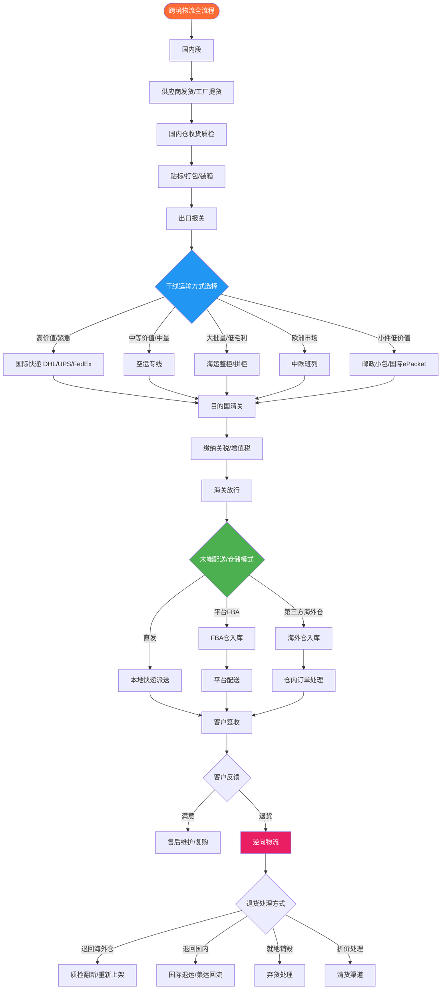
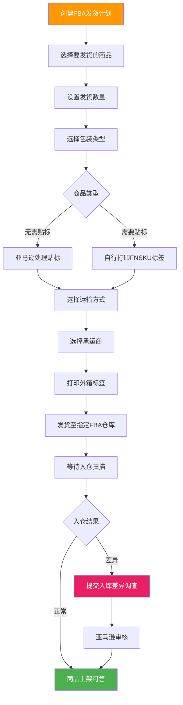
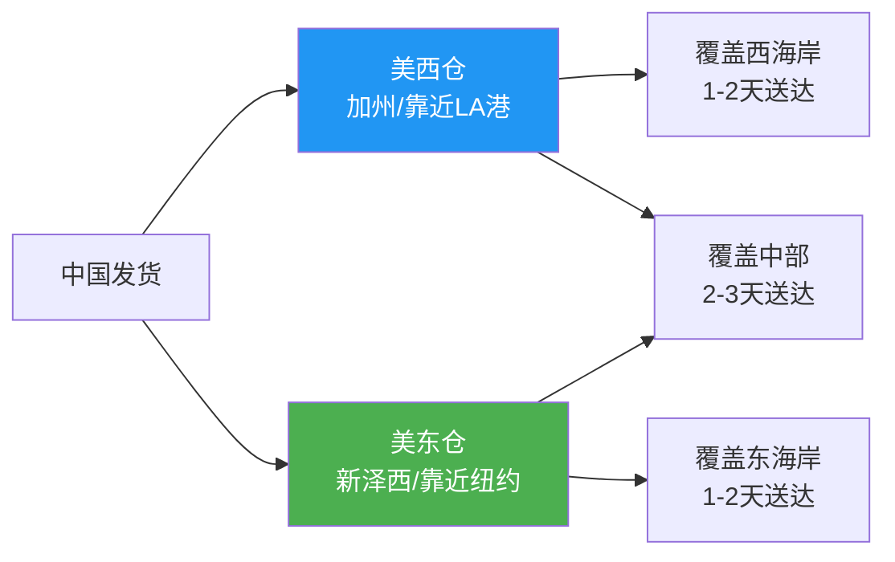

## 五、国际物流与海外仓

国际物流是跨境电商的"血管系统"——它决定了产品能否准时、安全、低成本地送达消费者手中。物流成本通常占跨境电商售价的 15%-35%，物流体验直接影响店铺评分和复购率。一个成熟的跨境卖家，必须建立系统化的物流知识体系，从运输方式选择、清关合规、仓储运营到逆向物流，每个环节都不能有盲区。

### 5.1 跨境物流全流程总览

跨境物流不是简单的"从A寄到B"，它涉及国内揽收、出口报关、干线运输、目的国清关、末端配送五个核心阶段，每个阶段都有对应的服务商、费用结构和风险点。



> **关键认知：** 跨境物流的核心矛盾是**时效与成本的平衡**。没有"最好的物流方式"，只有"最适合当前产品和阶段的物流方式"。新手期追求确定性（FBA），成长期追求灵活性（海外仓+直发组合），成熟期追求成本最优化（多渠道混合）。

### 5.2 五大运输方式深度对比

#### 5.2.1 国际快递（DHL/UPS/FedEx/TNT）

国际快递是时效最快、服务最标准化的物流方式，由国际快递巨头运营全球网络。

**核心优势：**
- **时效确定性强**：欧美主要市场 3-5 个工作日送达，全程可追踪
- **清关能力强**：快递公司有自有清关团队，清关效率高
- **丢包率极低**：全程追踪，丢包率通常低于 0.1%
- **服务标准化**：上门取件、签收确认、异常通知完善

**成本结构：**
- 按实重或体积重取大值计费（体积重 = 长×宽×高 cm ÷ 5000）
- 首重+续重模式，或阶梯价格
- 附加费多：偏远地区附加费、燃油附加费、旺季附加费
- 到付关税（DDP模式下卖家承担关税）

**适用场景：**
- 单件价值 > $50 的高客单价产品
- 样品寄送、紧急补货
- 体积小重量轻的产品（电子产品、饰品、配件）
- 对时效要求极高的平台（如亚马逊 Prime 承诺）

**三大快递对比：**

| 对比维度 | DHL | UPS | FedEx |
|----------|-----|-----|-------|
| 欧美时效 | 3-5天 | 3-5天 | 3-7天 |
| 价格水平 | 中高 | 高 | 中 |
| 清关能力 | 欧洲最强 | 美国最强 | 美国较强 |
| 偏远覆盖 | 偏远附加费较高 | 偏远覆盖广 | 部分区域受限 |
| 适合市场 | 欧洲/东南亚 | 美国/加拿大 | 美国/亚洲 |
| 计费特点 | 体积重÷5000 | 体积重÷5000 | 体积重÷5000 |

#### 5.2.2 空运专线

空运专线是货代整合航空运力+目的国本地派送的组合服务，性价比介于国际快递和海运之间。

**运作模式：**
1. 货代在国内集货（拼货），凑够一定重量后统一安排航班
2. 货物通过商业航班或包机运往目的国
3. 到达后由货代合作的本地快递完成末端派送
4. 部分专线提供双清包税服务（DDP），卖家无需操心清关

**专线类型：**
- **空运普货专线**：适用于普通商品，7-15天
- **空运敏感货专线**：含电池、液体、粉末等航空敏感品，10-20天
- **空运带电专线**：专门运输内置电池产品（如充电宝、蓝牙耳机）
- **空运化妆品专线**：含液体/膏体的美妆产品

**成本参考（中国→美国，1kg普通货物）：**

| 渠道 | 单价（元/kg） | 时效 | 备注 |
|------|---------------|------|------|
| 国际快递 | 80-120 | 3-5天 | 含燃油附加费 |
| 空运专线（普货） | 35-55 | 7-15天 | 双清包税 |
| 空运专线（敏感货） | 50-80 | 10-20天 | 需提供MSDS |
| 海运专线 | 8-15 | 30-45天 | 散货拼柜 |

**选择建议：** 当单件货物重量在 0.5kg-5kg 之间，且产品利润率能覆盖空运成本时，空运专线是最优选择。它比快递便宜 40%-60%，比海运快 2-3 周。

#### 5.2.3 海运专线

海运是大宗货物跨境运输的主力方式，成本最低但时效最长。

**海运方式分类：**

| 类型 | 说明 | 适用场景 | 成本 |
|------|------|----------|------|
| **整柜（FCL）** | 独占一个集装箱（20GP/40GP/40HQ） | 单SKU大批量，>15CBM | 最低 |
| **拼柜（LCL）** | 多个卖家拼一个集装箱 | 中小批量，2-15CBM | 较低 |
| **海运快船** | 快速航线+优先清关 | 时效敏感的大货 | 中等 |
| **海运普船** | 普通航线 | 不急的大货 | 最低 |

**集装箱规格与载量：**

| 柜型 | 内部尺寸（长×宽×高） | 容积 | 载重 | 适用场景 |
|------|----------------------|------|------|----------|
| 20GP | 5.9m×2.35m×2.39m | 33CBM | 17.5吨 | 中小批量 |
| 40GP | 12.03m×2.35m×2.39m | 67CBM | 22吨 | 大批量 |
| 40HQ | 12.03m×2.35m×2.69m | 76CBM | 22吨 | 轻泡货 |

**海运流程：**
1. **订舱**：向货代或船公司预订舱位，确认船期
2. **装柜**：货物送至指定仓库或工厂装柜
3. **报关**：提交报关资料（商业发票、装箱单、报关单、合同）
4. **海运**：从起运港到目的港，航线不同时效不同
5. **目的港清关**：提交清关文件，缴纳关税
6. **提柜/拆柜**：整柜直接提走，拼柜需拆柜分拨
7. **末端派送**：卡车或快递送至仓库/客户

**主要航线时效参考：**

| 航线 | 整柜时效 | 拼柜时效 | 主要港口 |
|------|----------|----------|----------|
| 中国→美国西海岸 | 12-18天 | 20-30天 | 洛杉矶/长滩 |
| 中国→美国东海岸 | 25-35天 | 30-40天 | 纽约/萨凡纳 |
| 中国→欧洲 | 25-35天 | 30-40天 | 汉堡/鹿特丹 |
| 中国→日本 | 3-7天 | 7-15天 | 东京/大阪 |
| 中国→东南亚 | 5-10天 | 10-18天 | 曼谷/胡志明 |

#### 5.2.4 铁路运输（中欧班列）

中欧班列是连接中国与欧洲的铁路货运通道，性价比介于空运和海运之间，特别适合欧洲市场。

**核心优势：**
- **时效优于海运**：15-20天到达欧洲，比海运快 10-15 天
- **成本低于空运**：约为空运的 1/3-1/2
- **稳定性高**：不受天气、港口拥堵影响
- **覆盖内陆**：可直达欧洲内陆城市（如杜伊斯堡、华沙），无需二次转运

**主要线路：**
- 义乌→马德里（义新欧，13000km，约18天）
- 成都→罗兹（蓉欧快铁，约14天）
- 郑州→汉堡（郑欧班列，约15天）
- 重庆→杜伊斯堡（渝新欧，约14天）

**适用场景：** 欧洲市场的大中型商品，特别是家具、家居、机械配件等体积大但不适合空运的产品。注意铁路对危险品和锂电池有限制。

#### 5.2.5 邮政小包与国际ePacket

邮政小包是最传统的跨境物流方式，通过万国邮政联盟（UPU）网络投递，成本最低。

**主要渠道：**
- **中国邮政小包**：覆盖全球，时效 15-30 天，价格最低
- **国际ePacket**：中美专线，时效 7-15 天，可追踪，性价比高
- **各国邮政**：如英国皇家邮政、德国DHL Paket等本地邮政

**优劣势分析：**
- ✅ 成本极低：首重低至 5-10 元/件
- ✅ 覆盖广：几乎可达全球任何国家
- ❌ 时效不稳定：旺季可能延迟 2-4 周
- ❌ 追踪信息有限：部分国家只能追踪到离港
- ❌ 丢包率较高：约 1%-3%
- ❌ 重量限制：通常 2kg 以内

**适用场景：** 客单价 < $10 的小件产品（手机壳、贴膜、数据线、小饰品），以及试水新市场时的低成本试错方案。

### 5.3 清关与关税合规

清关是跨境物流中最容易出问题的环节。不了解目的国的清关规则，轻则货物延误，重则被扣押销毁。

#### 5.3.1 清关核心文件

| 文件 | 作用 | 关键信息 |
|------|------|----------|
| **商业发票（Commercial Invoice）** | 申报货物价值和信息 | 品名、数量、单价、总价、HS编码 |
| **装箱单（Packing List）** | 描述包装明细 | 箱数、件数、毛重、净重、尺寸 |
| **提单（Bill of Lading）** | 货物所有权凭证 | 发货人、收货人、起运港、目的港 |
| **原产地证明（CO）** | 证明货物原产地 | 用于享受关税优惠 |
| **产品认证文件** | 证明产品符合目的国标准 | CE/FCC/FDA/UL等 |

#### 5.3.2 各国关税政策要点

**美国：**
- 关税起征点：$800（个人进口免税额度）
- 关税计算：CIF价值 × 关税税率（根据HS编码确定）
- 常见商品关税：电子产品 0%-5%，服装 10%-20%，鞋类 10%-48%
- 注意：中美贸易摩擦下，部分产品加征 25% 附加关税（Section 301）
- IEEPA关税（对华商品）叠加后部分品类综合税率达 50%+，需实时查询

**欧盟：**
- 关税起征点：€150（超过需缴纳关税）
- 增值税（VAT）：必须缴纳，税率 17%-27%（因国家而异）
- 2021年7月起取消€22免税门槛，所有进口商品均需缴纳VAT
- IOSS（Import One-Stop Shop）：一站式增值税申报，简化小额商品清关
- CE认证是进入欧盟市场的强制要求

**英国（脱欧后）：**
- 关税起征点：£135
- VAT税率：20%
- 需要英国EORI号
- 2021年起低于£135的货物由卖家代扣代缴VAT

**日本：**
- 关税起征点：¥10000（约$70）
- 消费税：10%
- 清关严格，对产品标签（日文标签）有强制要求

**澳大利亚：**
- GST（商品及服务税）：10%，AUD1000以下由平台代扣
- 生物安全法规严格：木质包装需熏蒸证明，食品/植物制品受限

#### 5.3.3 HS编码与关税优化

HS编码（Harmonized System Code）是全球通用的商品分类编码，直接决定关税税率。

**HS编码结构（以6204.62为例）：**
```text
62      — 第62章：非针织服装
6204    — 女式套装/短裙/裤子
6204.62 — 棉制女式长裤及短裤
```

**关税优化策略：**
1. **正确归类**：同一产品不同HS编码税率可能差 5%-15%，但不能故意错报（违者罚款）
2. **利用自贸协定**：中国与东盟、RCEP成员国有关税优惠，提供原产地证明可降税
3. **转移定价**：合理调整产品申报价值（需在合理范围内，海关有参考价）
4. **拆分申报**：套装产品单独申报各组件可能适用更低税率
5. **利用自由贸易区**：货物入区免税，出区时才缴纳关税

### 5.4 FBA（亚马逊物流）深度运营

FBA（Fulfillment by Amazon）是亚马逊提供的仓储配送一体化服务，是亚马逊卖家的首选物流方案。

#### 5.4.1 FBA完整操作流程



#### 5.4.2 FBA费用结构详解

FBA费用由三部分构成：

**1. 配送费（Fulfillment Fee）：**

| 尺寸分段 | 美国站配送费 | 说明 |
|----------|-------------|------|
| 小号标准（≤15oz） | $3.22 | 大部分轻小商品 |
| 大号标准（≤3lb） | $5.32-$6.22 | 中等尺寸商品 |
| 大号标准（3-20lb） | $6.22-$10.00+ | 较重商品 |
| 小号大件 | $9.73+ | 家具、大型设备 |
| 特殊大件 | $40+ | 超大超重商品 |

**2. 仓储费（Storage Fee）：**

| 时间段 | 标准尺寸（每立方英尺/月） | 大件（每立方英尺/月） |
|--------|--------------------------|----------------------|
| 1-9月 | $0.87 | $0.56 |
| 10-12月（旺季） | $2.40 | $1.40 |
| 超龄库存（271-365天） | $6.90 | $4.95 |
| 超龄库存（>365天） | $8.45 | $6.90 |

**3. 长期仓储附加费：**
- 库存存放超过 181 天开始收取附加费
- 超过 365 天的库存按件收取 $6.90/件或 $0.15/立方英尺（取大值）
- 亚马逊每半年清理一次长期滞销库存

**FBA成本计算公式：**
```text
FBA总成本 = 产品成本 + 头程运费 + FBA配送费 + 仓储费 + 平台佣金 + 广告费

单件利润 = 售价 - FBA总成本
利润率 = 单件利润 / 售价 × 100%
```

**示例计算（蓝牙耳机，售价$29.99）：**
```text
产品成本：        ¥35（约$4.80）
头程运费（空运）：  ¥8/件（约$1.10）
FBA配送费：        $3.22
平台佣金（15%）：   $4.50
仓储费（月均）：    $0.15
广告费（ACoS 25%）：$7.50
────────────────────────
总成本：          $21.27
单件利润：        $8.72
利润率：          29.1%
```

#### 5.4.3 FBA入仓注意事项

**包装要求：**
- 每件商品必须贴FNSKU标签（不能与UPC码混淆）
- 外箱使用标准6面硬纸箱，单件重量 < 50磅
- 易碎品需用气泡膜包裹，液体需密封防漏
- 保质期商品必须标注有效期，且剩余保质期 > 90天

**外箱要求：**
- 外箱标签贴在箱体最大面，不遮挡
- 每箱4个面各贴一张（共4张）
- 外箱不能使用黑色/深色胶带（影响扫描）
- 外箱条形码不能被胶带覆盖

**常见入库失败原因：**
1. 标签模糊或贴错位置 → 重新打印贴标
2. 商品与发货计划不一致 → 核对SKU和数量
3. 包装不符合要求 → 按标准重新包装
4. 外箱超重 → 分箱处理
5. 危险品未申报 → 提交SDS安全数据表

#### 5.4.4 FBA库存管理策略

**补货公式：**
```text
建议补货量 = 日均销量 × (补货周期 + 安全天数) - 在途库存 - 在库库存

补货周期 = 生产周期 + 头程运输 + 入库上架时间
安全天数 = 通常设置 7-14 天（视产品稳定性而定）
```

**库存健康指标：**

| 指标 | 健康范围 | 危险信号 | 应对措施 |
|------|----------|----------|----------|
| IPI分数 | >400 | <350 | 清理滞销库存 |
| 库存周转天数 | 30-90天 | >180天 | 降价促销/移除 |
| 缺货率 | <5% | >15% | 加快补货频率 |
| 滞销率 | <10% | >25% | 清货处理 |

**亚马逊IPI（Inventory Performance Index）评分维度：**
1. **冗余库存比例**：过多滞销库存扣分
2. **售罄率**：库存售出速度越快越好
3. **滞留库存**：因listing问题无法销售的库存
4. **补货及时性**：缺货次数越少越好

### 5.5 第三方海外仓运营

#### 5.5.1 海外仓类型对比

| 类型 | 代表服务商 | 优势 | 劣势 | 适用场景 |
|------|-----------|------|------|----------|
| **平台仓** | 亚马逊FBA | 流量倾斜、Prime标识 | 费用高、规则严 | 亚马逊卖家 |
| **自营海外仓** | 自建/租仓 | 完全可控 | 投入大、管理复杂 | 大卖家（月销$50万+） |
| **第三方公共仓** | 谷仓、万邑通、递四方 | 灵活、多平台对接 | 服务质量参差不齐 | 中小卖家 |
| **虚拟海外仓** | 无实体仓，利用代发 | 零库存压力 | 时效无保障 | 试水新市场 |

**主流第三方海外仓服务商：**

| 服务商 | 优势区域 | 核心服务 | 最低起送量 | 费用参考 |
|--------|----------|----------|-----------|----------|
| 谷仓海外仓 | 美/欧/日 | 一件代发、FBA中转 | 无 | 入库$0.3/件+仓储$0.5/CBM/天 |
| 万邑通 | 美/欧/澳 | 中大件物流 | 100件 | 入库$0.4/件+配送$3/件起 |
| 递四方 | 全球 | 小包+海外仓 | 无 | 综合费用较低 |
| 橙联 | 美/欧 | 退货处理 | 无 | 退货处理$2/件起 |
| 易仓 | 全球 | 仓配一体化 | 500件 | 按SKU定制报价 |

#### 5.5.2 海外仓选择决策框架

选择海外仓不是比价格，而是匹配业务需求。按以下维度逐层筛选：

**第一层：地理位置**
- 靠近目标市场核心消费区域
- 靠近港口或机场（降低入库运输成本）
- 考虑税收政策（如美国特拉华州无销售税）

**第二层：服务能力**
- 是否支持多平台发货（亚马逊、eBay、独立站、Walmart）
- 是否提供FBA中转补货服务
- 退货处理能力（质检、翻新、重新贴标）
- 是否支持定制化包装（品牌化包装、礼品包装）

**第三层：系统能力**
- 是否有WMS系统（仓库管理系统）
- 能否与ERP/电商平台API对接
- 库存实时可视、订单实时同步
- 是否提供数据报表和分析

**第四层：成本结构**
- 入库费：$0.2-$0.8/件
- 仓储费：$0.3-$1.0/CBM/天
- 拣货打包费：$1.5-$4.0/件
- 出库配送费：根据重量和目的地
- 增值服务费：贴标$0.1/件、退货处理$2-5/件

#### 5.5.3 海外仓运营实操

**入库流程：**
1. 在海外仓系统创建入库预报（ASN）
2. 打印箱唛标签，贴在每个外箱上
3. 国内发货至海外仓指定收货地址
4. 海外仓收货清点，核对数量
5. 质检（如需要），上架到库位
6. 系统同步库存，可接受订单

**库存管理最佳实践：**
- **ABC分类法**：A类（高销量）保持充足库存，C类（低销量）少量多次
- **安全库存公式**：安全库存 = 平均日销量 × 安全天数
- **补货点**：当库存降至"补货点"时启动补货
  - 补货点 = 日均销量 × 补货周期 + 安全库存
- **滞销预警**：库存超过 60 天未动销，启动促销或调拨

**多仓分布策略（以美国市场为例）：**



> **经验法则：** 日均单量超过 50 单时，建议分仓覆盖；超过 200 单时，建议至少 3 个仓库覆盖主要区域。分仓可将平均配送时间从 3-5 天缩短到 1-2 天，显著提升客户满意度。

### 5.6 逆向物流（退货处理）

退货是跨境电商的"隐形成本杀手"。欧美市场退货率通常在 8%-30%（服装类最高），处理不好会吞噬全部利润。

#### 5.6.1 退货原因分析

| 退货原因 | 占比 | 预防措施 |
|----------|------|----------|
| 产品与描述不符 | 30% | 优化listing图片和描述 |
| 尺寸/规格不合适 | 25% | 提供详细尺码表 |
| 质量问题 | 20% | 加强品控和质检 |
| 物流损坏 | 10% | 改善包装防护 |
| 买家后悔/不需要 | 10% | 无法完全避免 |
| 发错货 | 5% | 优化仓库拣货流程 |

#### 5.6.2 退货处理方案对比

| 方案 | 成本 | 适用场景 | 操作复杂度 |
|------|------|----------|-----------|
| **就地销毁** | $0.5-$2/件 | 低价值产品（<$10） | 最低 |
| **折价清货** | 亏 30%-50% | 可二次销售的产品 | 低 |
| **退回海外仓翻新** | $2-$5/件 | 高价值、可修复 | 中等 |
| **退回国内** | $5-$15/件 | 高价值、需返厂 | 高 |
| **捐赠抵税** | 0 | 库存积压 | 低 |

**决策树：**
```text
退货商品 → 是否有质量问题？
  ├─ 是 → 产品价值 > $20？
  │   ├─ 是 → 退回海外仓检修翻新
  │   └─ 否 → 就地销毁
  └─ 否 → 是否可二次销售？
      ├─ 是 → 海外仓质检后重新上架
      └─ 否 → 折价清货/捐赠
```

#### 5.6.3 降低退货率的方法

1. **listing优化**：使用真实产品图（非过度美化），标注精确尺寸
2. **增加QA模块**：预回答常见问题，减少信息不对称
3. **A+页面/品牌故事**：增强品牌信任，降低冲动退货
4. **包装升级**：减少运输损坏导致的退货
5. **售后沟通**：主动联系不满客户，提供补偿方案替代退货

### 5.7 物流成本核算与优化

#### 5.7.1 完整物流成本模型

```text
总物流成本 = 头程运输 + 清关关税 + FBA/海外仓费用 + 末端配送 + 退货成本

其中：
- 头程运输：占总物流成本 30%-40%
- 清关关税：占 10%-20%（因国家和品类而异）
- 仓储配送：占 30%-40%
- 退货处理：占 5%-15%
```

#### 5.7.2 物流成本优化八法

**1. 合理选择运输方式**
- 计算产品"运费敏感度"：运费/售价比 > 30% 时考虑海运
- 高毛利产品用空运保时效，低毛利产品用海运降成本

**2. 优化包装降低体积重**
- 体积重 > 实重的"抛货"，压缩包装体积效果显著
- 案例：某卖家将包装尺寸从 30×20×15cm 缩至 25×18×12cm，单件运费降 22%

**3. 批量发货获取阶梯价格**
- 与货代谈阶梯价：月发货量越大，单价越低
- 参考：月发货 100kg 和 1000kg 的空运单价可能差 30%

**4. 合理选择清关方式**
- 小额直邮：利用目的国免税额度
- 大货走一般贸易：选择最优HS编码

**5. 海外仓分仓降低配送成本**
- 美国市场分美西+美东两仓，平均配送距离缩短 40%
- 配送费相应降低 15%-25%

**6. 退货翻新代替弃货**
- 建立退货质检流程，50%以上的退货可翻新重新销售
- 单件节省 $3-$10（避免重新采购和发货）

**7. 淡旺季灵活调配**
- 旺季（Q4）提前备货走海运，避免空运涨价
- 淡季（Q1-Q2）减少库存，降低仓储费

**8. 多平台/多渠道比价**
- 同一物流需求询价 3-5 家货代
- 使用物流比价平台（如17TRACK、4PX）自动比价

### 5.8 物流风险管控

#### 5.8.1 常见风险与应对

| 风险类型 | 概率 | 影响程度 | 应对策略 |
|----------|------|----------|----------|
| 海关扣货 | 低 | 高 | 确保文件齐全，合规申报 |
| 港口罢工/拥堵 | 中 | 高 | 提前发货，备用港口 |
| 货物损坏/丢失 | 低 | 中 | 购买货运保险 |
| 汇率波动 | 高 | 中 | 锁汇/对冲 |
| 政策变化 | 中 | 高 | 持续关注，灵活调整 |
| 旺季爆仓 | 高 | 高 | 提前 45-60 天备货 |

#### 5.8.2 货运保险

**是否需要买保险？**
- 单批货值 > $5000：强烈建议购买
- 单批货值 < $1000：可不购买（风险自担）
- 高价值/易碎品：必须购买

**保险费用：** 通常为货值的 0.3%-0.8%，投保流程简单，通过货代即可办理。

**理赔关键：** 收货时必须拍照/录像开箱过程，发现损坏 24 小时内报案，保留所有包装材料。

### 5.9 进阶：智能物流体系搭建

#### 5.9.1 物流系统架构

成熟的跨境电商卖家需要搭建以下系统：

```text
ERP系统（订单管理）
  ├── WMS（仓库管理系统）
  │     ├── 库存实时同步
  │     ├── 自动补货提醒
  │     └── 批次管理/效期管理
  ├── TMS（运输管理系统）
  │     ├── 多货代比价
  │     ├── 全程追踪
  │     └── 异常预警
  └── OMS（订单管理系统）
        ├── 多平台订单汇总
        ├── 智能分仓发货
        └── 退货流程管理
```

#### 5.9.2 数据驱动的物流决策

**关键数据指标：**

| 指标 | 计算方式 | 优化方向 |
|------|----------|----------|
| 物流成本占比 | 物流总成本/总营收 | < 25% |
| 平均配送时效 | 下单到签收天数 | < 5天 |
| 准时送达率 | 准时订单/总订单 | > 95% |
| 物流差评率 | 物流相关差评/总差评 | < 10% |
| 库存周转率 | 年销售成本/平均库存 | > 4次/年 |

**优化闭环：**
1. **监控**：每日监控物流指标仪表盘
2. **预警**：设置阈值自动告警（如缺货率 > 10%）
3. **分析**：每周分析物流数据，找出瓶颈
4. **优化**：调整运输方式、仓库分布、补货策略
5. **验证**：对比优化前后的数据变化

### 5.10 常见误区与纠正

| 误区 | 正确认知 |
|------|----------|
| "FBA一定比海外仓好" | FBA适合亚马逊，多平台运营需海外仓配合 |
| "海运最便宜就走海运" | 海运隐性成本高（资金占用、仓储费、旺季溢价） |
| "清关交给货代就行" | 卖家是清关责任主体，必须了解目的国法规 |
| "退货就是亏损" | 50%退货可翻新重新销售，需建立退货处理流程 |
| "物流只看价格" | 时效、稳定性、售后同样重要，便宜物流可能带来差评 |
| "备货越多越安全" | 过多库存导致仓储费激增、滞销风险、资金链紧张 |
| "只用一种物流渠道" | 多渠道组合降低风险，避免单一渠道依赖 |

### 5.11 实战案例

**案例一：某3C卖家的物流优化**

某蓝牙耳机卖家月销 5000 件，优化前全部走空运FBA，物流成本占比 35%。

优化方案：
1. 日常销量（日均120件）走海运补货，降低头程成本
2. 爆款提前60天海运大货，小批量空运补缺口
3. 美东+美西分仓FBA，减少跨区配送费
4. 退货产品集中到第三方海外仓，质检翻新后重新入FBA

优化后：物流成本占比从 35% 降至 22%，年节省物流费用约 $48,000。

**案例二：某家居卖家的海外仓布局**

某家居卖家主攻欧洲市场，月销 €100,000。

初始方案：仅用德国一个海外仓，配送到法国/意大利需3-5天。

优化方案：
1. 德国仓（主力仓）覆盖DACH地区（德/奥/瑞）
2. 法国仓覆盖法/比/荷/卢
3. 波兰仓覆盖中东欧（成本较低）
4. 大件商品中欧班列入库，小件空运专线

结果：平均配送时效从 4.2 天降至 1.8 天，物流差评率从 12% 降至 3%。

---

> **本章小结：** 国际物流与海外仓是跨境电商的基础设施。新手从FBA起步，熟悉整个物流链路后，逐步拓展到第三方海外仓+直发组合模式。核心原则是：**用数据驱动决策，用系统管理流程，用组合策略降低风险**。物流不是成本中心，而是竞争优势——配送快、退货少、体验好的卖家，才能在竞争中持续胜出。
