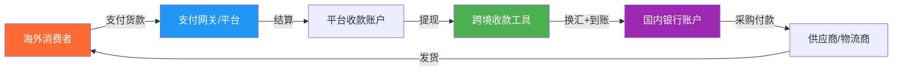
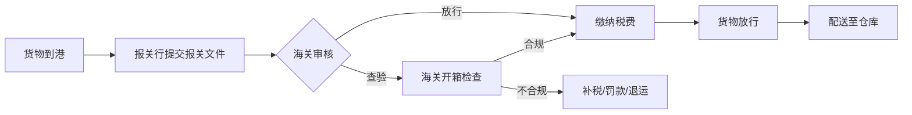
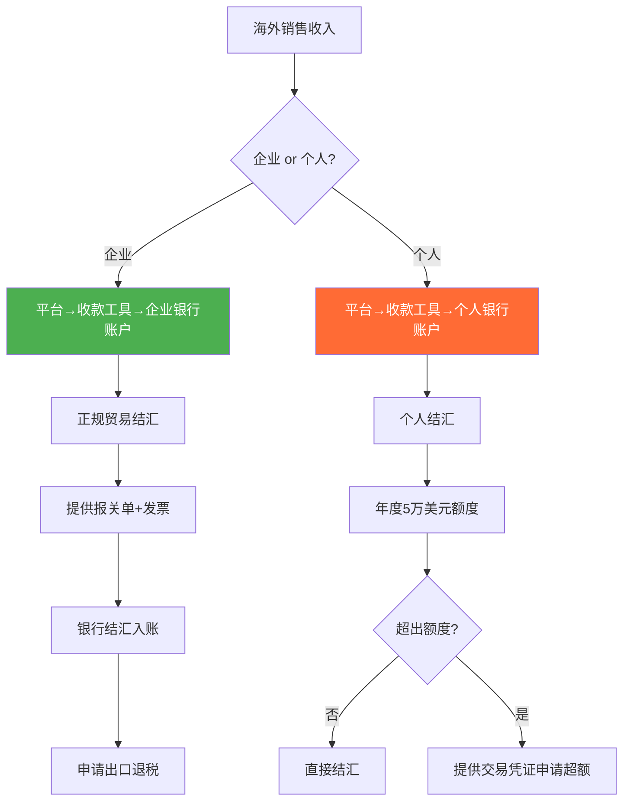

## 六、跨境电商支付与税务

跨境支付和税务合规是跨境电商卖家最容易忽视、但一旦出问题代价最大的领域。支付环节直接关系到资金安全和周转效率，税务合规则决定了生意能否长期做下去。许多卖家在选品和运营上投入大量精力，却在收款费率上白白损失2%-3%的利润，或因不了解VAT法规而面临巨额罚款甚至封号。本节从支付基础设施、收款工具、各市场税务体系、关税清关、外汇管理五个维度，构建完整的跨境支付与税务知识体系。

### 6.1 跨境支付基础设施与资金流转全链路

跨境电商的资金流转涉及多个环节，理解整个链条是做好支付和税务管理的前提。



**资金流转的关键节点：**

1. **消费者支付**：消费者通过信用卡、PayPal、Apple Pay、本地化支付方式（如欧洲的iDEAL、巴西的Boleto）完成付款。支付方式的覆盖率直接影响转化率——如果目标市场常用的支付方式没有接入，会损失大量订单。

2. **平台结算**：亚马逊每14天结算一次（可申请更频繁），Shopify通过Stripe/PayPal实时或T+2结算，eBay每月结算。结算周期决定了资金周转速度。

3. **跨境收款**：平台将货款打入卖家的收款账户（如Payoneer、PingPong提供的虚拟银行账户），卖家再提现到国内银行。这一步涉及汇率转换和手续费。

4. **资金回流**：从收款工具提现到国内银行账户，需要注意外汇管理合规——中国个人每年5万美元结汇额度限制，企业需要通过正规贸易渠道结汇。

5. **再投入**：用回流的资金支付供应商货款、物流费用、广告费用，完成一个完整的资金循环。

**资金周转周期计算：**

```text
资金周转天数 = 库存周转天数 + 物流在途天数 + 平台结算天数 + 提现到账天数

示例（亚马逊FBA模式）：
- 库存周转：60天（从采购到售出）
- 物流在途：15天（海运头程）
- 平台结算：14天
- 提现到账：2-3天
- 总计：约90天

这意味着每1万元投入，需要90天才能回收。
如果月销10万美元，需要约30万美元（约210万人民币）的流动资金。
```

### 6.2 跨境收款工具深度对比

选择合适的收款工具直接影响利润和资金安全。以下是主流收款工具的全面对比。

#### 6.2.1 主流收款工具费率与功能对比

| 对比维度 | Payoneer（派安盈） | PingPong | 万里汇（WorldFirst） | 连连支付（LianLian） | PayPal |
|----------|-------------------|----------|---------------------|---------------------|--------|
| **提现费率** | 1.2% | 1.0% | 0.7%-1.0% | 0.7%-1.0% | 1.5%-2.0% |
| **汇率加点** | 0.5%-1.5% | 0.3%-0.5% | 0.3%-0.5% | 0.3%-0.5% | 2.5%-4.0% |
| **到账时效** | 1-3个工作日 | 1-2个工作日 | 1-2个工作日 | 1-2个工作日 | 即时（但提现慢） |
| **支持平台** | Amazon/eBay/Wish/Shopee等 | Amazon/eBay/Shopee等 | Amazon/eBay/Lazada等 | Amazon/eBay/Shopee等 | 独立站/eBay |
| **支持币种** | 美元/欧元/英镑/日元等150+币种 | 美元/欧元/英镑/日元等 | 美元/欧元/英镑/日元等 | 美元/欧元/英镑/日元等 | 25种货币 |
| **虚拟银行账户** | 美/欧/英/日等本地账户 | 美/欧/英/日等本地账户 | 美/欧/英/日等本地账户 | 美/欧/英/日等本地账户 | 无 |
| **VAT缴费** | 支持 | 支持 | 支持 | 支持 | 不支持 |
| **供应商付款** | 支持（Payoneer到Payoneer免费） | 支持 | 支持 | 支持 | 支持 |
| **资金安全** | 美国MSB牌照、欧洲EMI牌照 | 中国央行支付牌照 | 蚂蚁集团旗下、多国牌照 | 中国央行支付牌照 | 美国上市公司 |
| **最低提现额** | $50 | $50 | $50 | $50 | $1 |

#### 6.2.2 收款工具选择策略

**按业务阶段选择：**

- **起步期（月销<$5000）**：优先选择费率低的工具，万里汇或PingPong的综合费率（提现费+汇率差）约1.0%-1.5%，比Payoneer节省0.5%-1.0%。按月销$5000计算，一年可节省$300-$600。
- **成长期（月销$5000-$50000）**：考虑多工具组合。亚马逊用PingPong/万里汇（费率低），独立站用PayPal+Stripe（覆盖率高），eBay用Payoneer（平台原生支持）。
- **成熟期（月销>$50000）**：关注汇率管理和资金调度能力。可以与收款工具谈定制费率，部分工具对大客户提供0.5%以下的提现费率。

**按目标市场选择：**

- **美国市场**：所有收款工具都支持，差异不大，主要看费率
- **欧洲市场**：优先选择支持欧洲本地银行账户的工具，便于接收SEPA转账和缴纳VAT
- **日本市场**：确保工具支持日元收款和结算，Payoneer和PingPong的日元支持较好
- **东南亚市场**：Shopee/Lazada的收款工具选择有限，通常平台有指定的收款方式

#### 6.2.3 独立站支付网关选择

独立站卖家需要自行接入支付网关，与平台卖家的收款工具有本质区别：

| 支付网关 | 手续费 | 覆盖率 | 优势 | 劣势 |
|----------|--------|--------|------|------|
| **Stripe** | 2.9%+$0.30/笔 | 全球47国 | API强大、开发者友好、支持135+货币 | 中国大陆不可直接注册 |
| **PayPal** | 3.49%+$0.49/笔 | 全球200+市场 | 用户基数大、买家信任度高 | 费率高、有冻结风险 |
| **Shopify Payments** | 2.4%-2.9%+$0.30/笔 | 17国 | 与Shopify深度集成 | 仅限Shopify平台 |
| **Adyen** | 逐笔定价 | 全球 | 企业级、支持所有主流支付方式 | 门槛高、适合大卖家 |
| **钱海（Oceanpayment）** | 2.5%-3.5% | 全球 | 中国公司、中文客服、对独立站友好 | 知名度较低 |

**独立站支付最佳实践：**

1. **至少接入2种支付方式**：信用卡（Stripe或钱海）+ PayPal，覆盖90%以上的海外消费者支付习惯
2. **本地化支付方式**：欧洲接入iDEAL（荷兰）、Bancontact（比利时）、Sofort（德国）；巴西接入Boleto和Pix；东南亚接入GrabPay和GCash
3. **优化结账流程**：减少结账步骤（理想是1页结账），支持访客结账（不要强制注册），显示安全认证标识
4. **弃单挽回**：30%-70%的购物车会被放弃，通过邮件挽回（1小时后、24小时后、72小时后三轮邮件）可回收10%-15%的弃单

### 6.3 主要市场税务体系详解

跨境电商税务是合规经营的底线。不同市场的税务规则差异巨大，必须逐一了解和遵守。

#### 6.3.1 欧盟VAT体系

VAT（Value Added Tax，增值税）是欧盟最重要的税种之一，也是跨境电商卖家必须面对的合规要求。

**什么是VAT？**

VAT是对商品和服务在每个生产、分销环节征收的消费税。作为跨境电商卖家，你在欧盟销售商品时，必须在商品售价中包含VAT，并定期向税务机关申报和缴纳。

**VAT注册义务：**

| 触发条件 | 说明 | 需注册国家 |
|----------|------|-----------|
| 使用欧盟境内FBA仓库 | 商品存放在哪个国家，就需要在哪个国家注册VAT | 存储国 |
| 远程销售超过阈值 | 2021年7月起，欧盟统一远程销售阈值为€10,000（全欧盟累计） | 所有销售目的国（或使用OSS一站式申报） |
| 从欧盟境外直邮 | 单票货值≤€150的包裹，需通过IOSS（进口一站式）申报 | IOSS注册国 |

**各国VAT税率对比：**

| 国家 | 标准税率 | 低税率 | 适用商品（低税率） |
|------|----------|--------|-------------------|
| 德国 | 19% | 7% | 食品、书籍、农产品 |
| 法国 | 20% | 5.5%/10% | 食品、书籍、餐饮 |
| 英国 | 20% | 5%/0% | 儿童服装、家庭能源 |
| 意大利 | 22% | 4%/10% | 食品、医疗、旅游 |
| 西班牙 | 21% | 4%/10% | 食品、医疗、住房 |
| 荷兰 | 21% | 9% | 食品、药品、书籍 |
| 波兰 | 23% | 5%/8% | 食品、书籍、医疗 |

**VAT计算方法：**

```text
含税售价 = 不含税售价 × (1 + VAT税率)
VAT金额 = 含税售价 - 不含税售价
       = 不含税售价 × VAT税率

实际利润 = 含税售价 - 产品成本 - 物流费 - 平台佣金 - 广告费 - VAT金额

示例（德国站，售价€29.99的产品）：
- 不含税售价 = €29.99 / 1.19 = €25.20
- VAT金额 = €25.20 × 19% = €4.79
- 产品成本 = €5.00
- FBA费用 = €4.50
- 平台佣金（15%）= €29.99 × 15% = €4.50
- 广告费（10%）= €29.99 × 10% = €3.00
- 实际利润 = €25.20 - €5.00 - €4.50 - €4.50 - €3.00 = €8.20
- 利润率 = €8.20 / €25.20 = 32.5%
```

**OSS（One-Stop Shop）一站式申报：**

2021年7月1日起，欧盟推出OSS制度，卖家可以只在一个成员国注册VAT，通过OSS系统统一申报所有成员国的远程销售VAT。这大大简化了合规流程——以前如果向27个欧盟国家都卖货，可能需要在27个国家都注册VAT，现在只需一个OSS注册即可。

**IOSS（Import One-Stop Shop）进口一站式：**

针对从欧盟境外直邮、单票货值≤€150的包裹，IOSS允许卖家在销售时直接收取VAT，消费者无需在清关时额外缴税。这提升了消费者体验，也简化了清关流程。需要在欧盟指定成员国申请IOSS号码，并通过快递公司或清关代理使用该号码清关。

**英国VAT（脱欧后独立体系）：**

英国脱欧后，VAT体系独立于欧盟：

- 标准税率：20%
- 从2021年1月起，≤£135的货物由卖家代收代缴VAT（通过英国VAT注册号）
- \>£135的货物由进口商（消费者或卖家指定代理）在清关时缴纳
- 使用亚马逊的卖家可通过平台代扣代缴（Amazon代收VAT）
- 必须在开始销售前完成英国VAT注册，否则平台会暂停账户

#### 6.3.2 美国销售税体系

美国没有联邦层面的增值税或消费税，但有州级销售税（Sales Tax），规则比欧盟更复杂。

**Nexus规则——你是否需要缴税？**

Nexus（经济关联）是美国销售税的核心概念。只有在某州建立了Nexus，才需要在该州代收代缴销售税。

| Nexus类型 | 触发条件 | 示例 |
|-----------|----------|------|
| **实体Nexus** | 在该州有办公室、仓库、员工 | 使用FBA仓库（亚马逊在多个州有仓库） |
| **经济Nexus** | 在该州年销售额或交易次数超过阈值 | 加州：年销售额>$500,000 |
| **点击-through Nexus** | 通过该州的推广链接产生销售 | 联盟营销 |
| **Marketplace Facilitator法** | 平台代收代缴 | 亚马逊、eBay已在大部分州代收 |

**关键事实：** 自2018年South Dakota v. Wayfair案后，各州纷纷出台经济Nexus法律。好消息是，亚马逊、eBay等主流平台作为Marketplace Facilitator，已经在绝大多数州代收代缴销售税，卖家通常不需要自行处理。但使用FBA的卖家仍需了解Nexus规则，因为FBA库存可能在多个州建立实体Nexus。

**各州销售税率（2025年主要州）：**

| 州 | 州税率 | 地方附加税 | 综合税率 | 备注 |
|----|--------|-----------|----------|------|
| 加州 | 7.25% | 0%-3.25% | 7.25%-10.50% | 经济Nexus阈值$500,000 |
| 纽约 | 4% | 4%-4.875% | 8%-8.875% | 服装≤$110免税 |
| 德州 | 6.25% | 0%-2% | 6.25%-8.25% | 无州所得税 |
| 佛州 | 6% | 0%-2.5% | 6%-8.5% | 无州所得税 |
| 俄勒冈 | 0% | 0% | 0% | 无销售税 |
| 蒙大拿 | 0% | 0% | 0% | 无销售税 |
| 特拉华 | 0% | 0% | 0% | 无销售税 |

**独立站卖家的销售税处理：**

独立站卖家不享受Marketplace Facilitator法的保护，需要自行处理销售税。推荐方案：

1. **使用Shopify Tax或TaxJar**：自动计算各州税率，在结账时收取正确金额的税
2. **注册Sales Tax Permit**：在有Nexus的州注册销售税许可证
3. **定期申报缴纳**：按各州要求（月度/季度/年度）申报和缴纳
4. **使用Avalara等自动化工具**：大型卖家可使用Avalara实现全自动化税务合规

#### 6.3.3 日本消费税（JCT）

日本消费税（Japanese Consumption Tax）是日本的增值税性质税种：

- **标准税率**：10%（2019年10月起）
- **轻减税率**：8%（食品和饮料）
- **注册义务**：年营业额超过¥10,000,000（约$70,000）需要注册
- **合规发票制度**：2023年10月起，日本实施合格发票制度（Qualified Invoice System），只有注册为合格发票发行事业者的卖家才能开具合规发票，买家凭此抵扣进项税
- **亚马逊日本站**：亚马逊已在日本代扣代缴消费税，卖家通常无需自行处理

#### 6.3.4 其他市场税务概览

| 市场 | 税种 | 税率 | 跨境电商适用规则 |
|------|------|------|-----------------|
| 加拿大 | GST/HST | 5%-15% | 2021年7月起，平台代收代缴 |
| 澳大利亚 | GST | 10% | ≤AUD1000的进口货物由卖家代收 |
| 中东（沙特/阿联酋） | VAT | 5%-15% | 沙特15%、阿联酋5%，需本地注册 |
| 印度 | GST | 18%（标准） | 通过亚马逊印度站销售，平台代扣 |
| 巴西 | ICMS/IPI等 | 17%-25% | 税制复杂，建议通过本地合作伙伴处理 |
| 墨西哥 | IVA | 16% | 跨境电商需RFC税号 |

### 6.4 关税与清关实务

关税是跨境电商成本结构中的重要组成部分，直接影响定价和利润。

#### 6.4.1 HS编码体系

HS编码（Harmonized System Code，协调制度编码）是国际通用的商品分类编码，决定了产品的关税税率和监管要求。

**HS编码结构：**

```text
HS编码示例：8471.30.0100

84    → 第84章（核反应堆、锅炉、机械器具）
8471  → 4位品目（自动数据处理设备）
8471.30 → 6位子目（便携式自动数据处理设备）
8471.30.0100 → 10位（各国扩展编码，美国HTS编码）
```

**查询HS编码的工具：**
- 中国海关总署：http://www.customs.gov.cn
- 美国HTS查询：https://hts.usitc.gov
- 欧盟TARIC：https://ec.europa.eu/taxation_customs/dds2/taric
- 第三方工具：SimplyDuty、Freightos HS Code Lookup

**HS编码查询要点：**
1. 确定产品的材质、功能、用途，这是归类的三大依据
2. 同一产品可能因材质不同而归入不同的HS编码（如塑料杯和玻璃杯）
3. 如果归类不确定，可以向海关申请预归类裁定（Binding Ruling），避免清关时被重新归类导致补税
4. 错误的HS编码可能导致多缴关税（利润损失）或少缴关税（海关处罚）

#### 6.4.2 主要市场关税税率参考

| 产品类别 | 美国关税（MFN） | 欧盟关税 | 英国关税 | 日本关税 |
|----------|----------------|----------|----------|----------|
| 服装（棉质） | 10%-20% | 12% | 12% | 10%-13% |
| 电子产品（手机壳） | 0%-4.5% | 0%-3.7% | 0%-3.7% | 0%-3.8% |
| 家居用品（塑料） | 3%-5.3% | 3%-6.5% | 3%-6.5% | 3%-5% |
| 玩具 | 0% | 0%-4.7% | 0%-4.7% | 0% |
| 珠宝首饰 | 5%-11% | 2.5%-4% | 2.5%-4% | 3.5%-5.2% |
| 鞋类 | 10%-20% | 3%-8% | 3%-8% | 10%-30% |
| LED灯具 | 3.9% | 4.7% | 4.7% | 0% |

> **注意：** 以上为一般MFN（最惠国）税率。美国对中国商品加征的额外关税（Section 301关税）目前仍在执行，部分品类加征7.5%-25%，需要额外查询。使用USITC的HTS查询工具，查看Chapter 99的特殊关税代码，确认你的产品是否在加征清单中。

#### 6.4.3 DDP与DDU贸易条款

| 条款 | 含义 | 谁付关税 | 谁付进口VAT | 适用场景 |
|------|------|----------|------------|----------|
| **DDP**（Delivered Duty Paid） | 完税后交货 | 卖家 | 卖家 | 提升消费者体验，适合独立站 |
| **DDU**（Delivered Duty Unpaid） | 未完税交货 | 买家 | 买家 | 成本可控，但消费者可能拒付 |
| **DAP**（Delivered at Place） | 目的地交货 | 买家 | 买家 | 与DDU类似 |

**DDP vs DDU的选择：**

- **独立站强烈建议DDP**：消费者在结账时看到的总价已经包含关税和税费，不会在收货时被要求额外付费，体验更好，退货率更低
- **平台卖家通常DDU**：亚马逊FBA的头程物流由卖家负责（含关税），但终端配送由平台处理
- **小包直邮可以DDU**：低货值包裹在很多国家免税或免征关税（如美国$800以下、欧盟€150以下免关税）

#### 6.4.4 清关流程与风险应对

**正常清关流程：**



**清关所需文件：**
- 商业发票（Commercial Invoice）：必须包含买卖双方信息、商品描述、HS编码、数量、单价、总价、贸易条款
- 装箱单（Packing List）：每箱的详细内容
- 提单（Bill of Lading）或空运提单（Air Waybill）
- 原产地证明（Certificate of Origin）：某些国家/产品需要
- 产品认证文件：CE标志、FCC认证等
- 进口许可证（部分品类需要）

**低申报风险——绝对不能做的事：**

一些卖家为了降低关税，故意低报货值。这是违法行为，风险极大：

1. **海关查验**：海关有大数据系统，会对比同类产品的市场价格，低报异常容易被发现
2. **罚款**：低申报被查获，通常处以货值2-4倍的罚款
3. **扣货**：货物被扣押，导致断货，影响店铺运营
4. **刑事处罚**：严重的走私行为可能面临刑事责任
5. **平台处罚**：如果平台发现卖家使用虚假清关文件，可能封号

**正确做法：** 如实申报，通过合理的税务筹划降低成本——利用自贸协定优惠税率、选择正确的HS编码（合法归类优化）、使用保税仓等合法手段。

### 6.5 外汇管理与汇率风险控制

汇率波动是跨境电商利润的隐形杀手。人民币对美元汇率每波动1%，对利润的影响可能是5%-10%。

#### 6.5.1 汇率波动对利润的影响

```text
利润敏感性分析（月销$100,000，利润率20%）：

汇率6.8时：利润 = $100,000 × 20% × 6.8 = ¥136,000
汇率7.0时：利润 = $100,000 × 20% × 7.0 = ¥140,000（+¥4,000）
汇率7.2时：利润 = $100,000 × 20% × 7.2 = ¥144,000（+¥8,000）

看似汇率上涨（美元升值）对卖家有利，但如果供应商要求涨价
（原材料进口成本上升），或者目标市场消费者购买力下降，
实际影响可能是负面的。
```

**汇率风险的三个维度：**

1. **交易风险**：从下单到收款期间汇率变动导致的损益（通常是1-3个月的时间差）
2. **折算风险**：将外币收入折算为人民币时的损益
3. **经济风险**：汇率变动对目标市场需求和竞争格局的长期影响

#### 6.5.2 汇率风险管理工具

| 工具 | 原理 | 适用场景 | 成本 |
|------|------|----------|------|
| **远期锁汇** | 与银行约定未来某日的汇率 | 有确定的外币收入预期 | 0%-0.5%（银行点差） |
| **自然对冲** | 用外币收入直接支付外币成本 | 有外币采购/广告支出 | 零成本 |
| **多币种账户** | 持有外币等待汇率有利时再结汇 | 对汇率有判断能力 | 账户管理费 |
| **分批结汇** | 不一次性结汇，分多次在不同汇率点结汇 | 降低单次结汇的汇率风险 | 零成本 |
| **期权** | 购买汇率期权锁定最差汇率 | 大额交易、不确定性高 | 期权费（1%-3%） |

**自然对冲策略详解：**

自然对冲是跨境电商最实用的汇率管理方法：

1. **用美元收入直接支付美元广告费**：Facebook、Google广告通常以美元计价，用收款账户中的美元直接支付，避免换汇损失
2. **用美元支付部分物流费**：很多头程物流商接受美元付款
3. **用美元支付海外仓费用**：海外仓费用通常以当地货币计价
4. **用外币直接采购**：如果有东南亚或欧洲的供应商，可以用对应货币直接支付

通过自然对冲，可以减少30%-50%的换汇需求，显著降低汇率风险和换汇成本。

#### 6.5.3 中国外汇管理合规

**个人卖家：**
- 个人每年结汇额度5万美元
- 超过5万美元需要提供交易凭证（如电商平台交易记录）到银行申请超额结汇
- 不得通过分拆结汇规避额度限制（银行会监控异常行为）

**企业卖家：**
- 需要办理进出口经营权（对外贸易经营者备案）
- 通过正规贸易渠道收汇结汇
- 出口退税：一般纳税人可享受13%的出口退税（具体税率因产品而异），这是重要的利润来源
- 需要保留完整的报关单、增值税发票等单据用于退税申请

**出口退税计算示例：**

```text
采购含税价：¥100,000（增值税率13%）
不含税采购价：¥100,000 / 1.13 = ¥88,496
进项税额：¥88,496 × 13% = ¥11,504
出口退税率：13%（假设与增值税率相同）
应退税额：¥88,496 × 13% = ¥11,504

实际采购成本 = ¥100,000 - ¥11,504 = ¥88,496
相当于采购成本降低约11.5%
```

> **重要提示：** 出口退税需要具备一般纳税人资格、完整的增值税发票和报关单据。小规模纳税人不能享受退税，只能免税。建议月销超过¥50,000的卖家注册为一般纳税人。

### 6.6 跨境电商定价模型

将支付费率、税务成本、关税等因素纳入定价，是保证利润的关键。

#### 6.6.1 完整成本结构拆解

```text
目标售价（美元） = 产品成本 + 头程物流 + 关税 + 平台佣金 + FBA费用 + 广告费 + 收款费率 + VAT + 利润

完整定价公式：
售价 = (产品成本 + 头程物流 + 关税) / (1 - 佣金率 - FBA费率 - 广告费率 - 收款费率 - VAT率 - 目标利润率)

示例（亚马逊美国站，产品成本¥30，汇率7.0）：

产品成本：$4.29（¥30 ÷ 7.0）
头程物流：$1.50
关税（5%）：$0.29
→ 到岸成本：$6.08

设佣金率15%、FBA费率12%、广告费率15%、收款费率1.5%、目标利润率20%
→ 扣除率 = 15% + 12% + 15% + 1.5% + 20% = 63.5%

售价 = $6.08 / (1 - 63.5%) = $6.08 / 36.5% = $16.66

验证：
- 佣金：$16.66 × 15% = $2.50
- FBA费：$16.66 × 12% = $2.00
- 广告费：$16.66 × 15% = $2.50
- 收款费：$16.66 × 1.5% = $0.25
- 到岸成本：$6.08
- 利润：$16.66 - $2.50 - $2.00 - $2.50 - $0.25 - $6.08 = $3.33
- 利润率：$3.33 / $16.66 = 20.0% ✓
```

#### 6.6.2 含VAT定价（欧洲站）

欧洲站的定价更为复杂，因为VAT需要从售价中剥离：

```text
含税售价（消费者支付）= 不含税售价 × (1 + VAT税率)
卖家实际收入 = 含税售价 - VAT
平台佣金通常基于含税售价计算

示例（德国站，产品成本¥30，汇率7.8）：

产品成本：€3.85（¥30 ÷ 7.8）
头程物流：€2.00
关税（4.7%）：€0.28
→ 到岸成本：€6.13

不含税售价 = 到岸成本 / (1 - 佣金率(不含税基) - FBA费率 - 广告费率 - 收款费率 - 目标利润率)

注意：亚马逊欧洲站的佣金按含税售价计算
含税售价 = €X
不含税售价 = €X / 1.19
佣金 = €X × 15%

设不含税售价为€Y，则含税售价 = €Y × 1.19
佣金 = €Y × 1.19 × 15% = €Y × 17.85%
FBA费（按尺寸计）= €4.50（固定）
广告费 = €Y × 1.19 × 15% = €Y × 17.85%

€Y = €6.13 + €4.50 + €Y × 17.85% + €Y × 17.85% + €Y × 1.5% + €Y × 20%
€Y = €10.63 + €Y × 57.2%
€Y × 42.8% = €10.63
€Y = €24.84

不含税售价：€24.84
含税售价：€24.84 × 1.19 = €29.56
→ 标价约€29.99
```

### 6.7 税务合规常见误区与风险防范

#### 6.7.1 十大常见误区

| 误区 | 真相 | 风险 |
|------|------|------|
| "小卖家不用管VAT" | 只要在欧盟有销售，超过€10,000阈值就必须注册 | 平台封号、补税+罚款 |
| "平台代缴就不用管了" | 平台只代缴销售税/VAT，进口关税仍需自行处理 | 清关延误、额外成本 |
| "低申报能省很多钱" | 海关大数据监控，被查获罚款是关税的2-4倍 | 罚款、扣货、刑事责任 |
| "注册一家公司就能全球销售" | 不同国家有不同的公司注册和税务要求 | 合规风险、税务纠纷 |
| "收汇用个人账户就行" | 大额收汇可能触发银行反洗钱调查 | 账户冻结、资金无法使用 |
| "出口退税太麻烦不搞了" | 13%的退税率意味着巨大的利润空间 | 每年少赚数万至数十万 |
| "VAT注册了就不用管了" | 需要定期申报（通常季度），不申报同样会被罚 | 滞纳金、注销VAT号 |
| "免税就等于不用注册" | 免税和零税率不同，某些情况仍需注册和申报 | 合规漏洞 |
| "用别人的VAT号就行" | 共用VAT号是违法行为，一旦被查后果严重 | 刑事责任 |
| "汇率波动可以忽略" | 汇率波动1%可能导致利润变化5%-10% | 利润大幅缩水 |

#### 6.7.2 合规检查清单

**每月检查：**
- [ ] 确认VAT申报截止日期（欧盟通常季度申报，英国季度申报）
- [ ] 核对收款账户的汇率和手续费明细
- [ ] 检查是否有新的税务法规变动通知
- [ ] 对账：平台结算金额 vs 实际到账金额

**每季度检查：**
- [ ] 提交VAT申报表（欧盟OSS/英国VAT）
- [ ] 检查各州销售税申报（美国独立站卖家）
- [ ] 审核出口退税申请材料
- [ ] 评估汇率风险敞口，调整锁汇策略

**每年检查：**
- [ ] 更新VAT注册信息（地址、银行账户等）
- [ ] 审核全年税务合规情况
- [ ] 评估是否需要在新的市场注册税务
- [ ] 与税务顾问做年度税务筹划
- [ ] 更新产品HS编码归类（海关可能调整归类规则）

### 6.8 进阶：税务筹划与利润优化

#### 6.8.1 合法税务筹划策略

1. **利用自贸协定降低关税**：中国与多个国家签有自贸协定（如RCEP），使用原产地证明可享受优惠关税税率。例如，RCEP生效后，部分产品出口到日本的关税从10%降至0%-5%。

2. **合理选择公司架构**：
   - 国内公司：享受出口退税，适合有增值税发票的卖家
   - 香港公司：无VAT，利得税16.5%，适合做资金中转
   - 海外公司（美国LLC/英国Ltd）：本地化运营，但需要遵守当地税法
   - 多层架构：国内公司（采购+退税）→ 香港公司（利润汇集）→ 海外公司（本地运营）

3. **利用保税仓/自贸区**：在自贸区设立公司或使用保税仓，可以延迟缴纳关税和增值税，改善现金流。

4. **出口退税最大化**：确保每一笔采购都有增值税专用发票，合理归类产品编码以获得最高退税率。

#### 6.8.2 资金合规回流路径



**合规回流的关键要素：**

- **完整的交易链条**：从采购合同、付款凭证、发货物流单据到销售记录，形成完整的交易闭环
- **真实的交易背景**：所有收汇必须有真实的贸易背景，银行会要求提供相关证明
- **及时的税务申报**：收入确认后及时进行税务申报，避免税务风险
- **专业的财税团队**：当月销超过$10,000时，建议聘请专业的跨境电商财税顾问

### 6.9 实战案例：支付与税务成本优化

**案例背景：** 某亚马逊美国站卖家，月销$80,000，主要销售家居用品，使用FBA物流。

**优化前状况：**
- 使用Payoneer收款，综合费率2.2%（提现费1.2% + 汇率差1.0%）
- 未注册一般纳税人，无法享受出口退税
- 汇率波动未做管理，完全裸奔
- 月收款成本：$80,000 × 2.2% = $1,760

**优化措施与效果：**

| 优化项 | 措施 | 年节省金额 |
|--------|------|-----------|
| 收款工具 | Payoneer→PingPong，综合费率从2.2%降至1.3% | $80,000 × 0.9% × 12 = $8,640 |
| 出口退税 | 注册一般纳税人，申请13%出口退税 | $80,000 × 60%(成本占比) × 13% × 12 = $74,880 |
| 自然对冲 | 用美元直接支付Facebook/Google广告费 | $80,000 × 15%(广告占比) × 0.5%(汇率差) × 12 = $720 |
| 汇率管理 | 季度远期锁汇，锁定±0.5%波动区间 | 降低汇率不确定性，稳定利润预期 |
| **合计年节省** | | **约$84,240（约¥590,000）** |

**关键发现：** 仅出口退税一项，每年就能节省近¥60万，远超大多数卖家的预期。很多中小卖家因为"嫌麻烦"而放弃出口退税，实际上这是跨境电商最大的利润优化空间之一。

***

