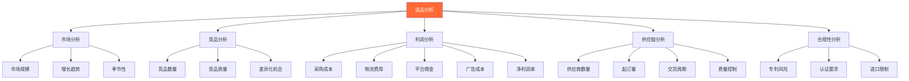
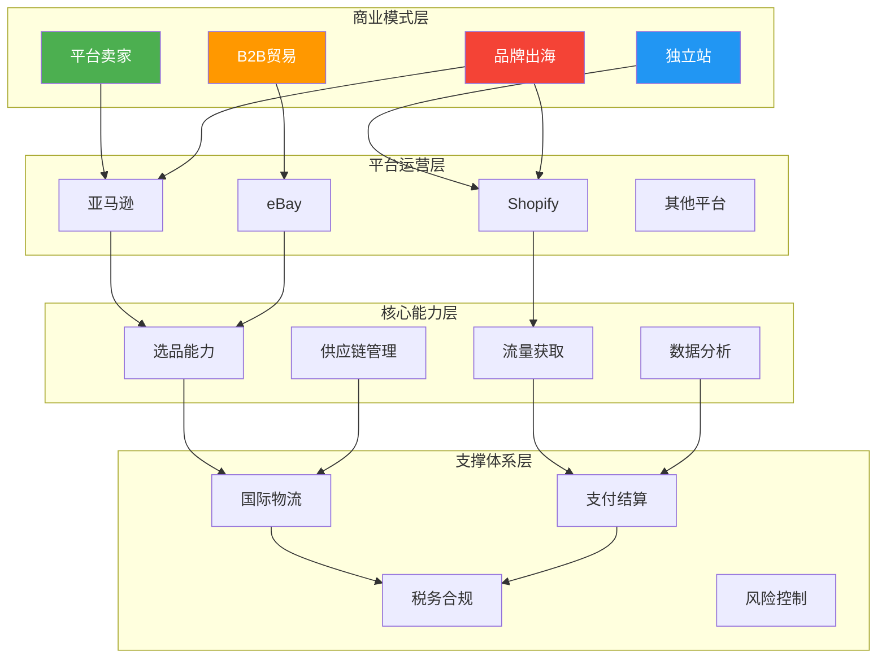
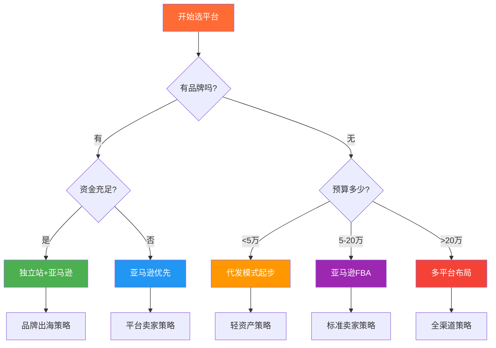

## 本节小结：跨境电商理论基础全景回顾

本节从商业模式、平台生态、选品策略、物流体系、支付税务五大维度，构建了跨境电商的完整理论框架。作为理论基础部分的总结，本小节将系统梳理核心知识点，帮助读者建立全局视野，为后续实操章节打下坚实基础。

---

### 一、核心知识体系回顾

#### 1.1 跨境电商商业模式解析

跨境电商并非单一模式，而是多种商业模式的集合体。理解不同模式的底层逻辑，是选择适合自己发展路径的前提。

**主流商业模式对比：**

| 模式 | 核心特征 | 启动资金 | 运营难度 | 利润空间 | 适合人群 |
|------|----------|----------|----------|----------|----------|
| **平台卖家（B2C）** | 依托第三方平台销售 | 5-20万 | 中等 | 15-30% | 新手入门 |
| **独立站（DTC）** | 自建品牌官网销售 | 10-50万 | 较高 | 30-60% | 品牌型卖家 |
| **批发贸易（B2B）** | 大宗商品跨境交易 | 50万+ | 中等 | 10-20% | 供应链资源型 |
| **代发模式（Dropshipping）** | 零库存，订单转交供应商 | 1-5万 | 低 | 10-25% | 轻资产创业者 |
| **品牌出海** | 自有品牌全球化 | 100万+ | 高 | 40-70% | 成熟企业 |

**商业模式选择的关键考量因素：**

1. **资金实力**：决定了你能选择的模式范围。资金有限时，从平台卖家或代发模式起步；资金充裕时，可考虑独立站或品牌出海。

2. **供应链资源**：如果你有工厂资源或稳定的供应商，B2B或品牌出海更有优势；如果没有，从代发模式积累经验。

3. **运营能力**：平台运营和独立站运营是两套完全不同的技能体系。平台运营侧重于规则理解和广告投放；独立站运营侧重于流量获取和品牌建设。

4. **风险承受能力**：代发模式风险最低，品牌出海风险最高。风险与收益成正比，选择适合自己的风险等级。

**商业模式演进路径：**

> **关键认知**：商业模式不是一成不变的。大多数成功卖家都经历了从简单到复杂的演进过程。重要的是先行动起来，在实践中找到最适合自己的路径。

#### 1.2 亚马逊平台深度解析

亚马逊作为全球最大的电商平台，是大多数跨境电商卖家的首选战场。深入理解亚马逊的运营逻辑，是取得成功的关键。

**亚马逊运营的核心要素：**

| 要素 | 重要性 | 核心要点 |
|------|--------|----------|
| **Listing优化** | ★★★★★ | 标题、关键词、图片、A+页面 |
| **广告投放** | ★★★★★ | SP/SB/SD广告组合，ACOS控制 |
| **FBA运营** | ★★★★☆ | 库存管理、补货策略、费用控制 |
| **Review获取** | ★★★★☆ | 合规获取评价，处理差评 |
| **账号安全** | ★★★★★ | 遵守平台规则，避免违规 |

**亚马逊A9算法的核心逻辑：**

亚马逊的搜索排名算法（A9）主要考虑两个维度：

1. **相关性（Relevance）**：产品与搜索词的匹配程度
   - 标题关键词匹配
   - 后台搜索词（Search Terms）
   - 产品类目节点
   - 品牌和制造商信息

2. **转化率（Conversion Rate）**：产品被点击后产生购买的概率
   - 主图质量
   - 价格竞争力
   - Review数量和评分
   - 配送方式（FBA优先）
   - 销售历史

**亚马逊广告投放策略矩阵：**

| 广告类型 | 适用场景 | 优化目标 | 预算占比 |
|----------|----------|----------|----------|
| **SP广告（商品推广）** | 新品推广、关键词排名 | ACOS<30% | 60-70% |
| **SB广告（品牌推广）** | 品牌曝光、品类占位 | 品牌搜索量提升 | 15-20% |
| **SD广告（展示型推广）** | 再营销、竞品拦截 | ROI>3 | 10-15% |
| **DSP广告** | 站外流量、品牌建设 | 曝光量和品牌认知 | 5-10% |

**亚马逊运营的常见陷阱：**

1. **盲目追求Review数量**：亚马逊严厉打击刷评行为，一旦被发现将面临封号风险。合规获取评价的方式包括：Vine计划、Request a Review按钮、优质产品体验自然获取。

2. **忽视库存管理**：断货会严重损害Listing排名，而库存积压会产生高额仓储费。建议保持30-60天的安全库存。

3. **广告投放粗放**：不进行关键词调研就投放广告，导致广告预算浪费。应该先做好关键词研究，分组投放，持续优化。

4. **忽视品牌建设**：只关注短期销量，不注册品牌、不做A+页面，错失品牌溢价和保护机会。

#### 1.3 Shopify独立站生态

独立站是品牌出海的必经之路。Shopify作为全球最大的独立站建站平台，为卖家提供了完整的电商解决方案。

**独立站 vs 平台的核心差异：**

| 维度 | 平台（亚马逊） | 独立站（Shopify） |
|------|----------------|-------------------|
| **流量来源** | 平台内搜索流量 | 需自主获取流量 |
| **用户数据** | 平台拥有 | 卖家拥有 |
| **品牌建设** | 受限于平台规则 | 完全自主 |
| **利润率** | 15-30% | 30-60% |
| **运营难度** | 中等 | 较高 |
| **启动成本** | 5-20万 | 10-50万 |
| **风险** | 平台政策风险 | 流量获取风险 |

**Shopify独立站运营的核心模块：**

1. **建站与设计**
   - 选择合适的主题（免费 vs 付费）
   - 优化移动端体验（超过70%的流量来自移动端）
   - 建立品牌视觉体系（Logo、色彩、字体）
   - 设置必要的页面（首页、产品页、关于我们、FAQ、政策页面）

2. **流量获取**
   - **Facebook/Instagram广告**：最主流的付费流量来源，适合视觉类产品
   - **Google广告**：搜索广告适合有明确需求的产品，购物广告适合电商
   - **SEO优化**：长期免费流量来源，需要持续投入内容建设
   - **红人营销**：通过KOL/KOC推广，适合特定品类
   - **邮件营销**：维护老客户，提升复购率

3. **转化优化**
   - 优化产品页面（高质量图片、详细描述、社会证明）
   - 简化结账流程（减少弃购率）
   - 提供多种支付方式（信用卡、PayPal、本地支付）
   - 设置信任标识（安全认证、退换货政策）

4. **用户运营**
   - 建立邮件列表，进行精准营销
   - 设置会员体系，提升复购率
   - 利用再营销广告召回流失用户
   - 收集用户反馈，持续优化产品

**独立站成功的关键指标：**

| 指标 | 健康值 | 优秀值 | 说明 |
|------|--------|--------|------|
| 转化率 | 1.5-2% | 3-5% | 访客到购买的转化比例 |
| 客单价 | 因品类而异 | 持续提升 | 平均每笔订单金额 |
| 复购率 | 20-30% | 40%+ | 老客户再次购买比例 |
| 弃购率 | <70% | <50% | 加购未购买的比例 |
| 广告ROAS | >2 | >4 | 广告投入产出比 |

#### 1.4 选品策略与市场分析

选品是跨境电商成功的基石。70%的失败案例都可以追溯到选品失误。科学的选品方法能够大幅降低创业风险。

**选品的核心原则：**

1. **市场需求验证**：产品必须有足够的市场需求，而不是卖家自认为的好产品
2. **竞争程度评估**：避免进入红海市场，寻找蓝海机会
3. **利润空间保障**：综合考虑采购成本、物流费用、平台佣金、广告投入后仍有合理利润
4. **供应链可控**：能够找到稳定可靠的供应商，保证产品质量和交期
5. **合规性检查**：产品符合目标市场的法规要求，避免侵权风险

**选品分析的完整框架：**

**选品的常用工具和数据源：**

| 工具/数据源 | 用途 | 费用 |
|-------------|------|------|
| **Jungle Scout** | 亚马逊产品调研、销量预估 | $29-129/月 |
| **Helium 10** | 关键词研究、竞品分析 | $29-229/月 |
| **Google Trends** | 趋势分析、季节性判断 | 免费 |
| **Keepa** | 亚马逊价格和排名历史 | €19/月 |
| **1688/阿里巴巴** | 供应商寻找、成本估算 | 免费 |
| **SimilarWeb** | 竞品网站流量分析 | 免费/付费 |

**选品的常见误区：**

1. **只看销量不看利润**：高销量产品往往竞争激烈，广告成本高，实际利润可能很低。
2. **忽视知识产权**：销售侵权产品会导致账号被封、库存被扣押，甚至面临法律诉讼。
3. **盲目跟风爆款**：等你入场时，市场可能已经饱和，且爆款生命周期通常较短。
4. **忽视物流限制**：某些产品（如带电池、液体、粉末）在国际物流中有特殊限制，会增加成本和复杂度。
5. **不做样品测试**：直接大批量采购，结果产品质量不达标，造成重大损失。

#### 1.5 国际物流与海外仓

物流是跨境电商的核心环节之一，直接影响客户体验、运营成本和资金周转。

**物流方式选择决策树：**

| 产品特征 | 推荐物流方式 | 原因 |
|----------|--------------|------|
| 高价值（>$50）| 空运专线/国际快递 | 时效快，降低资金占用 |
| 低价值（<$15）| 海运/邮政小包 | 成本优先 |
| 大件/重货 | 海运+海外仓 | 降低单件物流成本 |
| 紧急补货 | 空运专线 | 平衡时效和成本 |
| 新品测试 | 小批量空运 | 快速验证市场 |

**FBA（亚马逊物流）的核心优势：**

1. **Prime标识**：获得Prime标识，提升转化率20-30%
2. **配送效率**：亚马逊物流网络覆盖全球，配送速度快
3. **客户服务**：亚马逊处理客服和退货，减轻卖家负担
4. **搜索排名**：FBA产品在搜索结果中有一定权重优势

**FBA费用结构：**

| 费用类型 | 说明 | 优化建议 |
|----------|------|----------|
| **配送费** | 按产品尺寸和重量计算 | 优化包装尺寸，降低费用等级 |
| **仓储费** | 按体积计算，旺季费率更高 | 控制库存周转，避免长期仓储费 |
| **长期仓储费** | 库存超过365天收取 | 及时清理滞销库存 |
| **退货处理费** | 亚马逊处理退货的费用 | 提高产品质量，降低退货率 |

**海外仓运营的关键指标：**

| 指标 | 计算方式 | 健康值 |
|------|----------|--------|
| **库存周转率** | 年销售成本 / 平均库存价值 | >6次/年 |
| **滞销率** | 滞销SKU数 / 总SKU数 | <10% |
| **订单处理时效** | 从下单到发货的时间 | <24小时 |
| **库存准确率** | 系统库存与实际库存的匹配度 | >99% |

#### 1.6 跨境电商支付与税务

支付和税务是跨境电商的合规基础，也是利润计算的重要组成部分。

**主流支付方式对比：**

| 支付方式 | 覆盖市场 | 手续费 | 结算周期 | 适用场景 |
|----------|----------|--------|----------|----------|
| **PayPal** | 全球 | 3.4-4.4%+$0.3 | 即时 | 独立站首选 |
| **Stripe** | 欧美 | 2.9%+$0.3 | T+2 | 独立站信用卡收款 |
| **信用卡收款** | 全球 | 2-3% | T+7-15 | 大额交易 |
| **本地支付** | 特定市场 | 1-5% | 因渠道而异 | 新兴市场 |

**跨境收款工具对比：**

| 收款工具 | 支持平台 | 提现费率 | 结算速度 | 特色功能 |
|----------|----------|----------|----------|----------|
| **Payoneer（派安盈）** | 亚马逊、eBay等 | 1.2% | 1-2个工作日 | 多币种账户 |
| **WorldFirst（万里汇）** | 亚马逊、eBay等 | 0.3-0.7% | 1个工作日 | 费率低 |
| **PingPong** | 亚马逊、Shopify等 | 最低0.6% | T+1 | 中国卖家友好 |
| **连连支付** | 多平台 | 0.7% | T+1 | 国内合规 |

**跨境电商税务要点：**

1. **VAT（增值税）**
   - 欧盟：标准税率15-25%，需在销售国注册VAT
   - 英国：标准税率20%，脱欧后独立体系
   - 美国：各州税率不同，部分州有销售税

2. **关税**
   - 根据HS编码确定税率
   - 利用FTA（自由贸易协定）降低关税
   - 合理申报，避免低报被查

3. **企业所得税**
   - 中国：25%（高新技术企业15%）
   - 可通过合理的税务筹划降低税负

**税务合规的常见风险：**

| 风险类型 | 表现 | 后果 |
|----------|------|------|
| **VAT逃税** | 未注册VAT或低申报 | 罚款、账号冻结、法律诉讼 |
| **关税低报** | 低于实际货值申报 | 货物扣押、罚款、列入黑名单 |
| **转让定价** | 关联交易价格不合理 | 税务调整、补税罚款 |
| **外汇违规** | 不合规的资金收付 | 行政处罚、刑事责任 |

---

### 二、核心概念框架图

---

### 三、关键指标速查表

| 维度 | 核心指标 | 健康值 | 优秀值 | 预警值 |
|------|----------|--------|--------|--------|
| **选品** | 市场容量 | >$1000万/年 | >$5000万/年 | <$100万/年 |
| **选品** | 竞争度 | <50个竞品 | <20个竞品 | >100个竞品 |
| **选品** | 毛利率 | >30% | >50% | <20% |
| **运营** | 转化率 | >10% | >15% | <5% |
| **运营** | ACOS | <30% | <20% | >50% |
| **运营** | 库存周转 | >6次/年 | >12次/年 | <3次/年 |
| **物流** | 配送时效 | <7天 | <3天 | >15天 |
| **物流** | 物流成本占比 | <20% | <15% | >30% |
| **支付** | 支付成功率 | >95% | >98% | <90% |
| **财务** | 净利润率 | >10% | >20% | <5% |

---

### 四、常见误区与纠正

#### 误区一：先选平台再选品

**错误做法**：先决定在亚马逊开店，然后再去找什么产品好卖。

**正确做法**：先通过市场分析发现机会，再选择最适合这个产品的平台和模式。不同产品适合不同的销售渠道，盲目绑定单一平台会限制发展。

**案例**：某卖家发现一款小众户外用品在欧美市场需求稳定增长，但亚马逊上竞品很少。经过分析，这款产品更适合通过独立站+社交媒体营销的方式销售，最终通过Shopify独立站+Facebook广告取得了成功。

#### 误区二：忽视合规性

**错误做法**：为了快速入场，跳过产品认证、知识产权调查、税务注册等合规环节。

**正确做法**：将合规性作为选品和运营的硬性门槛。宁可放弃一个机会，也不要冒合规风险。

**案例**：某卖家销售一款蓝牙耳机，未进行FCC认证就上架亚马逊。产品被竞争对手举报后，Listing被下架，库存被扣押，损失超过10万元。

#### 误区三：只关注获客成本

**错误做法**：只计算广告带来的订单成本，忽视客户终身价值（LTV）。

**正确做法**：建立完整的客户价值评估体系，包括首次购买利润、复购率、客户生命周期等指标。有时候前期亏损获取客户，长期来看是盈利的。

**案例**：某独立站卖家通过Facebook广告获取客户，首次订单平均亏损$5。但通过邮件营销和会员体系，老客户复购率达到40%，客户终身价值达到$150，整体ROI超过5。

#### 误区四：过度依赖单一渠道

**错误做法**：将所有资源投入一个平台或一种流量来源。

**正确做法**：建立多平台、多渠道的销售体系，分散风险。即使主要依赖亚马逊，也应该建立独立站作为补充和后备。

**案例**：2021年亚马逊封号潮中，大量依赖单一亚马逊账号的卖家遭受重创。而那些同时运营独立站、多平台布局的卖家，虽然也受到影响，但能够快速恢复。

#### 误区五：忽视数据分析

**错误做法**：凭感觉做决策，不看数据，不进行A/B测试。

**正确做法**：建立数据驱动的运营体系，所有重要决策都基于数据分析。定期复盘关键指标，及时调整策略。

**案例**：某卖家通过数据分析发现，其产品在移动端的转化率只有PC端的一半。经过移动端页面优化后，整体转化率提升了35%，销售额显著增长。

---

### 五、实操要点速查

#### 5.1 跨境电商启动清单

**第一阶段：市场调研与选品（1-2个月）**
- [ ] 确定目标市场（美国、欧洲、日本等）
- [ ] 进行市场容量和趋势分析
- [ ] 竞品分析和差异化定位
- [ ] 供应商寻找和样品测试
- [ ] 利润测算和可行性评估

**第二阶段：平台入驻与准备（1个月）**
- [ ] 注册公司和商标
- [ ] 开通亚马逊/其他平台账号
- [ ] 注册VAT和税务合规
- [ ] 开通跨境收款账户
- [ ] 准备品牌素材（Logo、包装设计）

**第三阶段：产品上架与优化（2-4周）**
- [ ] 产品拍摄和图片处理
- [ ] Listing撰写和关键词优化
- [ ] A+页面/品牌故事制作
- [ ] 定价策略制定
- [ ] FBA发货计划制定

**第四阶段：推广与运营（持续）**
- [ ] 广告投放和优化
- [ ] Review获取策略执行
- [ ] 库存监控和补货
- [ ] 数据分析和策略调整
- [ ] 客户服务和售后处理

#### 5.2 关键决策框架

**选品决策矩阵：**

| 评估维度 | 权重 | 评分标准 |
|----------|------|----------|
| 市场需求 | 25% | 月搜索量>10万=5分，5-10万=4分，1-5万=3分 |
| 竞争程度 | 20% | 竞品<20=5分，20-50=4分，>50=3分 |
| 利润空间 | 25% | 毛利率>50%=5分，30-50%=4分，<30%=3分 |
| 供应链 | 15% | 供应商>3家=5分，2-3家=4分，1家=3分 |
| 合规性 | 15% | 无风险=5分，低风险=4分，中风险=3分 |

**平台选择决策树：**

---

### 六、本节要点回顾

1. **商业模式选择**：跨境电商有多种模式，选择适合自己资源和能力的模式是成功的第一步。模式可以演进，但起点很重要。

2. **平台运营逻辑**：亚马逊等平台有其独特的算法和规则，深入理解并遵守这些规则是运营成功的基础。

3. **独立站价值**：独立站是品牌建设的必经之路，但流量获取是核心挑战。建议平台和独立站协同发展。

4. **科学选品方法**：选品不是凭感觉，而是基于数据分析的科学决策。市场验证、竞品分析、利润测算缺一不可。

5. **物流体系搭建**：物流直接影响客户体验和成本结构。根据产品特性和发展阶段选择合适的物流方案。

6. **支付税务合规**：合规是长期经营的基础，不要为了短期利益而忽视合规风险。

7. **数据驱动决策**：建立数据分析体系，用数据指导运营决策，避免凭感觉做事。

8. **风险管理意识**：跨境电商面临多种风险，包括平台政策风险、汇率风险、合规风险等，需要建立风险预警和应对机制。

---

### 七、下一步学习路径

本节建立了跨境电商的理论基础框架，后续章节将深入探讨：

- **选品实操**：手把手教你如何进行市场调研和选品分析
- **平台运营实操**：亚马逊、Shopify等平台的详细运营教程
- **广告投放实操**：Facebook、Google、亚马逊广告的投放策略
- **物流方案设计**：如何设计最优的物流方案
- **财务与税务实操**：如何进行财务核算和税务筹划

理论是实践的指南针。掌握这些理论基础后，你将能够更好地理解后续实操内容，避免盲目试错，少走弯路。

> **学习建议**：不要试图一次性记住所有内容。先理解整体框架，建立全局视野，然后在实践中逐步深入各个细节。跨境电商是一个需要持续学习和实践的领域，理论和实践缺一不可。
