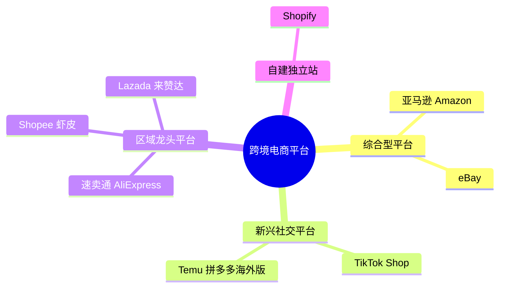
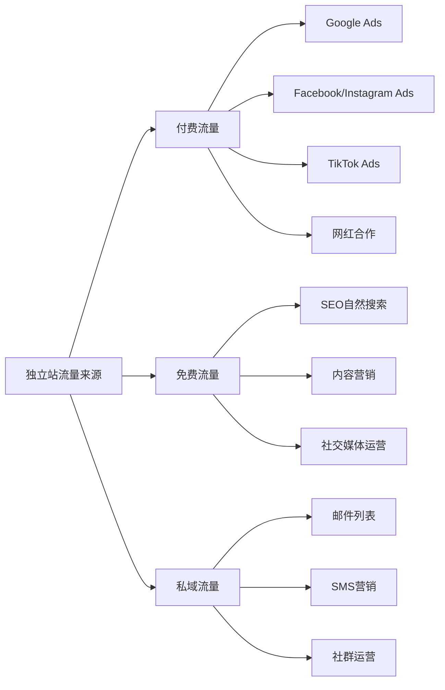
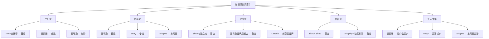
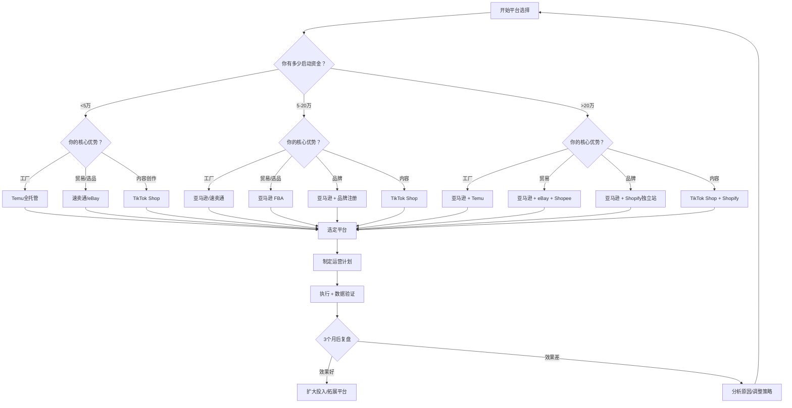
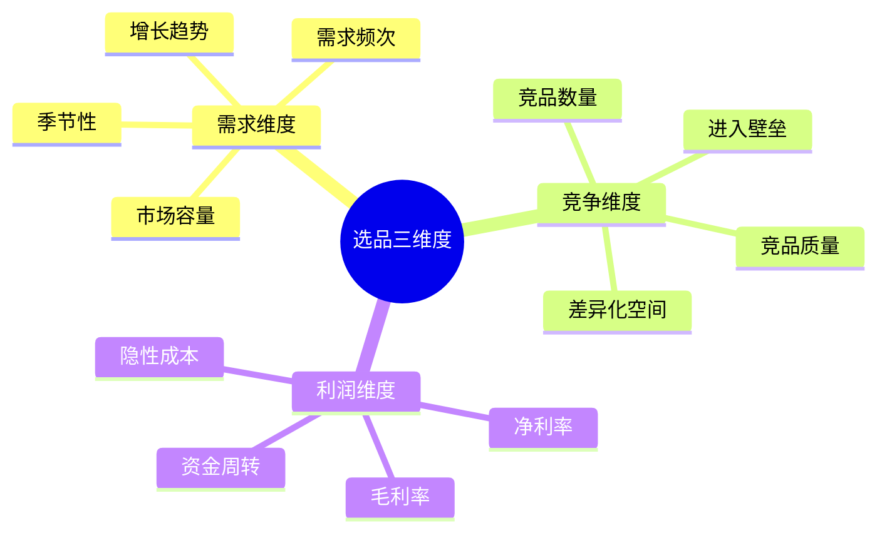
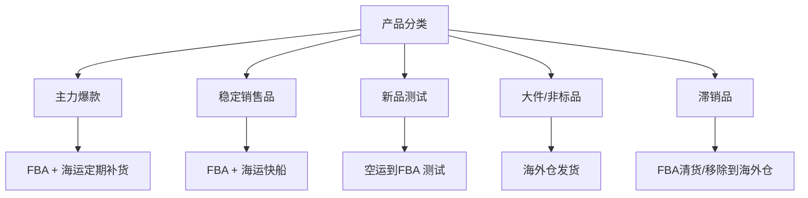
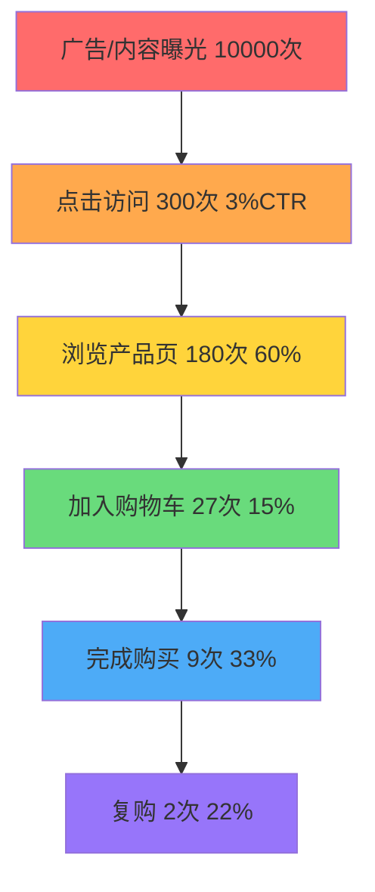

## 七、主流跨境电商平台深度对比

选择跨境电商平台，本质上是在选择一种商业模式。不同平台的流量逻辑、用户画像、费用结构、竞争格局截然不同，选错平台意味着从第一天起就在错误的赛道上奔跑。本章将从八个主流平台的深度拆解出发，延伸到决策框架、选品策略、物流方案、合规要求和风险管控，帮助你建立一套完整的平台选择与运营决策体系。

### 7.1 八大主流平台全景图

跨境电商平台按商业模式可分为四大类：综合型平台（亚马逊、eBay）、新兴社交平台（TikTok Shop、Temu）、区域龙头平台（Shopee、Lazada、速卖通）和自建独立站（Shopify）。理解每类平台的底层逻辑，比记住具体数据更重要。



#### 7.1.1 亚马逊（Amazon）——全球电商的"基础设施"

亚马逊是全球最大的电商平台，2024年净销售额超过6300亿美元，Prime会员突破2亿。它不仅仅是一个销售渠道，更是整个北美和欧洲电商的基础设施——超过60%的美国消费者在购物时首先搜索亚马逊，而非Google。

**核心数据：**

| 指标 | 数据 |
|------|------|
| 2024年净销售额 | 6300亿美元+ |
| Prime会员数 | 2亿+ |
| 覆盖站点 | 20+个国家/地区 |
| 专业卖家月租 | $39.99/月 |
| 销售佣金 | 8%-15%（按品类） |
| FBA配送费 | $3.22-$10+/件（按尺寸重量） |
| 平均转化率 | 10%-15%（Prime商品可达20%+） |

**费用结构深度拆解：**

亚马逊的费用不只是月租和佣金，新手卖家最容易犯的错误是低估综合成本。以下是一个完整的费用清单：

| 费用项目 | 费率/金额 | 说明 |
|----------|-----------|------|
| 专业卖家月租 | $39.99/月 | 个人卖家$0.99/件，月销40件以上选专业 |
| 销售佣金 | 8%-15% | 服装17%、3C 8%、家居15%，按品类不同 |
| FBA配送费 | $3.22-$10.72+ | 按产品尺寸和重量分档 |
| 月度仓储费（1-9月） | $0.87/立方英尺 | 标准尺寸 |
| 月度仓储费（10-12月） | $2.40/立方英尺 | 旺季仓储费是淡季的近3倍 |
| 长期仓储费 | $6.90/立方英尺 | 库存超365天 |
| 广告费（PPC） | ACoS 15%-35% | 新品期可能更高 |
| 退货处理费 | $2-$5/件 | 服装类退货率高达15%-25% |
| 库存配置费 | $0.27-$1.58/件 | 2024年新增 |

**以一个售价$29.99的手机壳为例的利润拆解：**

| 项目 | 金额 |
|------|------|
| 售价 | $29.99 |
| 产品成本（含包装） | -$3.50 |
| 头程物流（空运） | -$1.20 |
| FBA配送费 | -$3.68 |
| 销售佣金（8%） | -$2.40 |
| 广告费（ACoS 25%） | -$7.50 |
| 月度仓储费 | -$0.15 |
| 退货损耗（2%） | -$0.60 |
| **单件净利润** | **$10.96** |
| **净利润率** | **36.5%** |

这个利润率看起来不错，但新品推广期的广告ACoS通常在40%-60%，实际前3个月可能是亏损的。亚马逊的盈利模型是"先亏后赚"——前期投入广告打排名，排名稳定后降低广告占比，才能实现真正的盈利。

**核心优势与隐性风险：**

优势方面，亚马逊的FBA物流体系是全球电商中最成熟的，Prime标识带来的转化率提升（通常比非Prime高30%-50%）是其他平台无法比拟的。平台自带的巨大流量意味着卖家不需要从零开始获取客户。

但风险同样不可忽视。亚马逊的封号潮（2021年封号潮导致中国卖家损失超过1000亿美元销售额）不是个例，平台对刷单、操控评论、违规变体合并的打击力度逐年加大。更隐蔽的风险是"被跟卖"——你的爆款listing可能在一夜之间被几十个卖家跟卖，而亚马逊对品牌的保护力度取决于你是否完成了品牌注册（Brand Registry）。

**适合的卖家画像：** 有供应链优势（成本比同行低15%以上）、能承受3-6个月的亏损期、愿意投入品牌注册和A+内容建设、产品为标准化程度高的品类（3C配件、家居用品、运动户外、汽车配件）。

#### 7.1.2 Shopify独立站——品牌化的终极战场

Shopify不是传统意义上的"平台"，而是一个建站工具。截至2024年，全球超过440万商家使用Shopify，平台GMV超过2300亿美元。与亚马逊最大的区别是：在Shopify上，流量不是免费的，你必须自己获取每一个访客。

**核心数据：**

| 指标 | 数据 |
|------|------|
| 活跃商家数 | 440万+ |
| 2024年GMV | 2300亿美元+ |
| 月租方案 | Basic $39 / Shopify $105 / Advanced $399 |
| 支付手续费 | 2.9%+$0.30（Shopify Payments） |
| 平均转化率 | 1.5%-3%（远低于亚马逊） |
| 客户获取成本（CAC） | $15-$50（因行业差异大） |

**费用结构与隐藏成本：**

Shopify的费用由三部分组成：平台订阅费、交易手续费和营销费用。其中营销费用往往占到总成本的40%-60%，这是新手最容易忽视的。

| 费用项目 | Basic方案 | Shopify方案 | Advanced方案 |
|----------|-----------|-------------|--------------|
| 月租 | $39 | $105 | $399 |
| 信用卡手续费 | 2.9%+$0.30 | 2.6%+$0.30 | 2.4%+$0.30 |
| 第三方支付网关 | 额外2.0% | 额外1.0% | 额外0.5% |
| 主题费用 | $0-$350（一次性） | $0-$350 | $0-$350 |
| 必装App月费 | $50-$200/月 | $50-$200/月 | $50-$200/月 |
| 广告预算 | $500-$5000+/月 | $500-$5000+/月 | $500-$5000+/月 |

一个常见的陷阱是App费用。Shopify基础功能有限，SEO优化、邮件营销、评论管理、弹窗促销等功能都需要安装第三方App，每个App每月收费$10-$50不等。一个成熟的独立站通常需要安装10-20个App，月费合计$100-$300。

**独立站的流量获取是核心挑战：**



付费流量见效快但成本高，Google Ads的CPC（每次点击成本）在跨境电商领域通常在$0.5-$3之间，Facebook Ads的CPM（千次展示成本）在$5-$15之间。新品牌冷启动阶段，广告ROI（投入产出比）通常在1:1.5到1:3之间，意味着花$100广告费只能带来$150-$300的销售额，扣除产品成本后可能是亏损的。

免费流量（SEO）需要3-6个月才能见效，但一旦建立起来就是持续的免费流量来源。一个成熟的独立站，SEO流量通常占总流量的30%-50%。

**适合的卖家画像：** 有品牌意识和设计能力、产品有差异化或故事性、愿意长期投入内容营销和品牌建设、利润率足够高（建议毛利60%以上）以覆盖获客成本。典型的适合品类包括设计师品牌、小众品类、个性化定制产品、高客单价产品。

#### 7.1.3 速卖通（AliExpress）——新兴市场的桥头堡

速卖通是阿里巴巴旗下面向全球市场的B2C平台，覆盖200多个国家和地区，月活跃买家超过1.5亿。它的核心优势在于对新兴市场的覆盖——在俄罗斯、巴西、西班牙、法国等市场，速卖通是当地消费者购买中国商品的主要渠道。

**核心数据：**

| 指标 | 数据 |
|------|------|
| 月活跃买家 | 1.5亿+ |
| 覆盖国家/地区 | 200+ |
| 年费 | $500-$10000（按品类） |
| 销售佣金 | 5%-8% |
| 平均客单价 | $10-$30 |
| 平台转化率 | 3%-5% |

**速卖通的竞争格局变化：**

速卖通在2023-2024年经历了一次重大转型——从C2C模式向B2C模式升级，提高了卖家入驻门槛，要求品牌资质，并引入了类似亚马逊的搜索排名算法。这意味着"铺货型"卖家的生存空间在快速缩小，有品牌和供应链优势的卖家开始占据主导地位。

速卖通的全托管模式（AliExpress Choice）是2024年最大的变化。卖家只需供货，平台负责定价、物流和售后。这降低了运营门槛，但也意味着卖家失去了定价权。全托管模式下的利润率通常在5%-15%，远低于自主运营模式。

**适合的卖家画像：** 有价格优势的工厂型卖家、面向新兴市场（俄罗斯、巴西、西班牙）的卖家、刚入行想低成本试水的个人卖家。

#### 7.1.4 eBay——长尾品类的隐藏金矿

eBay成立于1995年，是全球最早的电商平台之一。虽然增长速度不如亚马逊，但全球仍有1.82亿活跃买家，且在收藏品、二手商品、汽车配件等垂直领域拥有不可替代的地位。

**核心数据：**

| 指标 | 数据 |
|------|------|
| 全球活跃买家 | 1.82亿 |
| 覆盖国家 | 190+ |
| 刊登费 | 前250条免费，之后$0.35/条 |
| 最终价值费 | 12.9%+$0.30 |
| 平均客单价 | $30-$60 |

**eBay的独特优势——拍卖模式：**

eBay是主流平台中唯一保留拍卖模式的。对于稀缺品、限量版、收藏品来说，拍卖模式可以实现远超固定价格的成交价。例如，一双限量版球鞋在亚马逊上可能标价$300，但在eBay拍卖中可能拍到$500-$800。

**eBay的隐藏金矿——汽车配件：**

eBay Motors是全球最大的在线汽车配件市场之一。汽车配件有几个独特优势：SKU极其丰富（一辆车可能有上千个可替换零件）、需求稳定（汽车保有量大，维修需求持续）、利润率高（专业配件毛利率可达40%-60%）、竞争相对分散（每个具体SKU的竞争者很少）。

**适合的卖家画像：** 拥有稀缺品或收藏品货源的卖家、汽车配件供应商、愿意做差异化选品的贸易型卖家、二手商品翻新商。

#### 7.1.5 Temu（拼多多海外版）——极致性价比的战场

Temu是拼多多的海外版，2022年9月上线，仅用两年时间就成为全球下载量最高的购物App之一。2024年GMV超过240亿美元，覆盖50多个国家。Temu的核心逻辑是"极致低价"——平台直接对接工厂，砍掉所有中间环节。

**核心数据：**

| 指标 | 数据 |
|------|------|
| 上线时间 | 2022年9月 |
| 2024年GMV | 240亿美元+ |
| 覆盖国家 | 50+ |
| 客单价 | $5-$15 |
| 日均订单量 | 数百万级 |

**Temu的两种运营模式：**

Temu目前有两种主要运营模式，卖家需要根据自身情况选择：

| 模式 | 全托管 | 半托管 |
|------|--------|--------|
| 定价权 | 平台定价 | 卖家定价 |
| 物流 | 平台负责 | 卖家负责（可用平台物流） |
| 运营 | 平台负责 | 卖家负责 |
| 利润率 | 5%-10% | 15%-25% |
| 门槛 | 低（工厂即可） | 中等（需运营能力） |
| 适合卖家 | 工厂型 | 贸易型/品牌型 |

全托管模式下，卖家只需要提供产品和报价，平台负责一切。利润极低但出单量大，适合有产能但不懂运营的工厂。半托管模式下，卖家可以自主定价和运营，利润率更高，但需要承担物流和运营成本。

**Temu的核心风险：** 平台对供应商的压价极其严重，价格谈判能力弱的卖家可能被压到成本线附近。此外，Temu的退货政策对卖家不够友好，退货率较高的品类（如服装）在Temu上的利润可能被退货完全吃掉。

**适合的卖家画像：** 有极强成本优势的工厂型卖家、日用百货和小商品供应商、愿意以量换利的卖家。

#### 7.1.6 TikTok Shop——内容电商的颠覆者

TikTok Shop是TikTok的电商功能，2023年GMV超过200亿美元，2024年预计突破500亿美元。它的核心逻辑与传统搜索电商完全不同——不是"人找货"，而是"货找人"。用户在刷短视频时被内容激发购买欲望，属于典型的冲动消费场景。

**核心数据：**

| 指标 | 数据 |
|------|------|
| 2024年GMV（预估） | 500亿美元+ |
| 用户画像 | 18-35岁为主 |
| 销售佣金 | 2%-8% |
| 平均客单价 | $15-$40 |
| 退货率 | 15%-30%（高于传统电商） |
| 核心市场 | 东南亚、北美、英国 |

**TikTok Shop的三种销售模式：**

| 模式 | 说明 | 适合卖家 |
|------|------|----------|
| 短视频带货 | 制作产品展示视频，挂购物车 | 有内容创作能力的卖家 |
| 直播带货 | 实时直播展示和销售产品 | 有直播团队的卖家 |
| 达人合作 | 寄样给网红达人，达人制作内容推广 | 有产品但缺内容能力的卖家 |

**TikTok Shop的核心挑战——内容能力：**

在TikTok Shop上，产品本身只占成功的40%，内容质量占60%。一个普通产品如果有一条爆款视频，可能一天卖出上万单；而一个好产品如果内容质量差，可能一单都卖不出去。

内容创作的核心要素：
- **前3秒**：决定用户是否继续观看，必须有视觉冲击或悬念
- **产品展示**：不是简单展示，而是展示"使用场景"和"解决问题"
- **情绪共鸣**：让用户产生"我也想要"的情绪
- **行动号召**：引导用户点击购物车

**TikTok Shop的另一个重要渠道——达人合作：**

对于没有内容创作能力的卖家，达人合作是最有效的方式。TikTok Shop内置了"联盟计划"功能，卖家可以设置佣金比例（通常10%-30%），达人可以选择推广你的产品。一个中腰部达人（10万-100万粉丝）的一条视频可能带来500-5000单的销量。

**适合的卖家画像：** 有内容创作能力或团队、产品视觉冲击力强（时尚美妆、新奇特、潮流服饰）、愿意投入时间做内容测试、能接受较高的退货率。

#### 7.1.7 Shopee（虾皮）——东南亚电商的绝对霸主

Shopee是东南亚最大的电商平台，覆盖新加坡、马来西亚、泰国、印尼、菲律宾、越南、巴西等市场。2024年GMV超过1000亿美元，在东南亚市场的份额超过35%。对于想进入东南亚市场的卖家来说，Shopee几乎是必选项。

**核心数据：**

| 指标 | 数据 |
|------|------|
| 2024年GMV | 1000亿美元+ |
| 东南亚市场份额 | 35%+ |
| 月活跃用户 | 3.5亿+ |
| 覆盖市场 | 东南亚7国+巴西+墨西哥等 |
| 销售佣金 | 2%-6% |
| 平均客单价 | $5-$20 |

**Shopee的核心特点：**

1. **移动端优先**：Shopee 90%以上的订单来自移动端，这意味着listing的移动端展示效果至关重要。主图、标题、价格在手机屏幕上的第一眼呈现决定了点击率。

2. **游戏化运营**：Shopee内置了大量的游戏化功能（Shopee Coins、每日签到、小游戏），用户粘性极高。卖家可以通过参与平台活动获取额外流量。

3. **COD（货到付款）占比高**：在东南亚市场，COD订单占比高达40%-60%（因地区而异）。COD订单的签收率通常只有70%-85%，这意味着你需要在定价时预留COD拒签的损失。

4. **价格极度敏感**：东南亚消费者的购买力相对较低，价格是第一决策因素。Shopee上的"价格战"比任何平台都激烈。

**Shopee的物流方案——SLS（Shopee Logistics Service）：**

Shopee提供自有物流服务SLS，卖家只需将包裹发到国内转运仓（通常在深圳、义乌、广州），Shopee负责跨境运输和末端配送。SLS的时效通常在7-15天，运费相对便宜（首重约¥10-20）。

**适合的卖家画像：** 面向东南亚市场的卖家、有价格优势的中小卖家、日用品和时尚服饰供应商、愿意做本地化运营的卖家。

#### 7.1.8 Lazada（来赞达）——东南亚的"天猫"

Lazada是阿里巴巴旗下的东南亚电商平台，覆盖印尼、马来西亚、菲律宾、新加坡、泰国、越南六国。与Shopee的"淘宝"定位不同，Lazada更偏向"天猫"定位，注重品牌和品质。

**核心数据：**

| 指标 | 数据 |
|------|------|
| 覆盖市场 | 东南亚6国 |
| 月活跃用户 | 1.5亿+ |
| 销售佣金 | 1%-4% |
| 平均客单价 | $10-$30 |
| 核心优势 | 阿里生态支持、品牌扶持力度大 |

**Lazada vs Shopee 关键对比：**

| 对比维度 | Shopee | Lazada |
|----------|--------|--------|
| 定位 | 平价、大众 | 品牌、品质 |
| 用户画像 | 价格敏感型 | 品质导向型 |
| 客单价 | 较低（$5-$20） | 较高（$10-$30） |
| 佣金 | 2%-6% | 1%-4% |
| 流量玩法 | 游戏化、社交裂变 | 搜索+推荐+直播 |
| 入驻门槛 | 较低 | 较高（需品牌资质） |
| 适合品类 | 日用品、时尚服饰 | 品牌商品、3C、美妆 |

**Lazada的核心优势——阿里生态支持：**

作为阿里巴巴旗下的平台，Lazada卖家可以享受淘宝/天猫的供应链资源、菜鸟物流的跨境配送能力、以及支付宝的支付基础设施。对于已经在1688或淘宝有供应链的卖家来说，Lazada的上手成本最低。

**适合的卖家画像：** 有品牌资质的卖家、客单价较高的品类（美妆、3C、家居）、想在东南亚做品牌化运营的卖家、已有阿里系电商经验的卖家。

#### 7.1.9 八大平台综合对比矩阵

以下是八大平台在关键维度上的综合对比，帮助你快速定位最适合的平台：

| 维度 | 亚马逊 | Shopify | 速卖通 | eBay | Temu | TikTok Shop | Shopee | Lazada |
|------|--------|---------|--------|------|------|-------------|--------|--------|
| 启动资金 | 高（5万+） | 中（1万+） | 低（5千+） | 低（3千+） | 低（1万+） | 低（5千+） | 低（5千+） | 中（1万+） |
| 运营难度 | 高 | 高 | 中 | 中 | 低 | 高（内容） | 中 | 中 |
| 利润空间 | 中高 | 高 | 中低 | 中 | 低 | 中 | 中低 | 中 |
| 流量获取 | 平台分配 | 需自建 | 平台分配 | 平台分配 | 平台分配 | 内容驱动 | 平台分配 | 平台分配 |
| 品牌建设 | 中 | 高 | 低 | 低 | 无 | 中 | 低 | 中 |
| 启动速度 | 慢（3-6月） | 慢（3-6月） | 快（1-2月） | 快（即时） | 快（1-2周） | 中（1-3月） | 快（1-2周） | 中（2-4周） |
| 天花板 | 极高 | 极高 | 中 | 中 | 中 | 高 | 高 | 中高 |
| 适合阶段 | 中长期 | 中长期 | 起步期 | 任何阶段 | 起步期 | 成长期 | 起步期 | 成长期 |

### 7.2 平台选择的决策框架

平台选择不是一个简单的"选A还是选B"的问题，而是一个需要综合考虑自身资源、目标市场、产品特性和长期战略的系统性决策。以下提供一个四维决策框架。

#### 7.2.1 按卖家类型选择

不同类型的卖家拥有不同的核心能力，应该选择能最大化发挥自身优势的平台：



**工厂型卖家的核心优势**是成本，应该选择能最大化价格竞争力的平台。Temu全托管模式让工厂只需专注于生产，平台负责一切运营——这是最省心的模式，但利润极薄。如果工厂同时具备一定的运营能力，亚马逊是更好的选择，因为亚马逊的客单价和利润率远高于Temu。

**贸易型卖家的核心优势**是选品和运营能力。亚马逊的算法驱动流量分配模式最适合有运营能力的卖家——通过优化listing、管理广告、提升转化率，可以在竞争中脱颖而出。

**品牌型卖家的核心优势**是品牌溢价和用户粘性。Shopify独立站是品牌建设的最佳场所，因为你拥有完整的用户数据和品牌叙事空间。但独立站不能孤立运营，通常需要与亚马逊等平台配合——亚马逊负责走量和获取新客，独立站负责品牌建设和复购。

**内容型卖家的核心优势**是内容创作能力。TikTok Shop是内容型卖家的天然战场，一条爆款视频可能带来数万单的销量。但内容型卖家需要注意：TikTok Shop的流量波动极大，不能过度依赖单一爆款，需要持续产出内容维持流量。

#### 7.2.2 按资金规模选择

启动资金直接决定了你能进入哪个平台，以及在该平台上能走多远：

| 资金规模 | 推荐平台组合 | 策略 | 预期回报周期 |
|----------|-------------|------|-------------|
| 1万以内 | 速卖通/ebay | 小成本试水，积累经验 | 1-3个月 |
| 1-5万 | Shopee/Temu | 单平台深耕，跑通模型 | 3-6个月 |
| 5-20万 | 亚马逊FBA | 标准化运营，打排名 | 6-12个月 |
| 20-50万 | 亚马逊+独立站 | 双渠道布局，品牌起步 | 12-18个月 |
| 50-100万 | 多平台+独立站 | 多渠道布局，品牌化运营 | 12-24个月 |
| 100万+ | 全渠道+DTC品牌 | 全球化品牌战略 | 24个月+ |

**资金分配建议（以20万预算为例）：**

| 项目 | 预算 | 占比 | 说明 |
|------|------|------|------|
| 首批库存 | 6万 | 30% | 3-5个SKU，每SKU备货500-1000件 |
| 头程物流 | 2万 | 10% | 首批走空运测试，后续转海运 |
| 平台费用 | 1.5万 | 7.5% | 月租+佣金预缴 |
| 广告预算 | 6万 | 30% | 3-6个月的PPC广告投放 |
| 品牌注册 | 1万 | 5% | 商标注册+品牌备案 |
| 运营工具 | 1万 | 5% | 选品工具+ERP+数据分析 |
| 应急储备 | 2.5万 | 12.5% | 应对退货、补货、意外支出 |

#### 7.2.3 按目标市场选择

不同市场有不同的消费习惯、物流基础设施和竞争格局，选择目标市场是平台选择的前置条件：

| 目标市场 | 首选平台 | 备选平台 | 市场特点 | 关键注意事项 |
|----------|----------|----------|----------|-------------|
| 北美（美国/加拿大） | 亚马逊 | Shopify、TikTok Shop | 消费力强、竞争激烈 | 合规要求高（FDA/FCC/UL） |
| 欧洲（德法英意西） | 亚马逊欧洲站 | eBay、独立站 | 多语言、VAT复杂 | 需要CE认证、VAT注册 |
| 东南亚 | Shopee | Lazada、TikTok Shop | 价格敏感、移动优先 | COD占比高、物流时效长 |
| 日韩 | 亚马逊日本站 | 乐天、Qoo10 | 品质要求高、服务极致 | 需要日语/韩语客服 |
| 中东 | 亚马逊中东站 | Noon、独立站 | 高客单价、文化特殊 | 需要阿拉伯语内容 |
| 拉美 | MercadoLibre | 亚马逊巴西站 | 增长快、物流弱 | 关税高、支付方式特殊 |
| 俄罗斯/独联体 | 速卖通 | Ozon、Wildberries | 中国商品接受度高 | 地缘政治风险 |
| 澳洲 | 亚马逊澳洲站 | eBay澳洲站 | 市场小但消费力强 | 物流距离远 |

#### 7.2.4 决策流程图

将上述因素整合为一个决策流程图，帮助你系统性地做出选择：



### 7.3 选品策略的底层逻辑

选品是跨境电商中最重要的环节，没有之一。一个好产品可以让平庸的运营也能盈利，一个烂产品让再强的运营也无力回天。选品的本质是在"需求"、"竞争"和"利润"三个维度之间找到最优平衡点。

#### 7.3.1 选品三维度模型



**维度一：需求——找到"有人买"的产品**

需求分析的核心是回答一个问题：有多少人想买这个产品，以及他们愿意付多少钱？

- **市场容量**：目标市场是否有足够的需求量。以亚马逊为例，一个关键词的月搜索量可以反映市场需求。月搜索量>10000的关键词代表中等以上需求，>50000代表高需求。
- **增长趋势**：需求是增长、稳定还是衰退。Google Trends是判断趋势的免费工具——如果一个品类的搜索量在过去12个月持续上升，说明市场正在扩大。
- **需求频次**：一次性购买还是复购型产品。复购型产品（如美妆、食品、宠物用品）的客户生命周期价值（LTV）远高于一次性购买产品（如工具、家具），长期来看更有价值。
- **季节性**：全年销售还是季节性波动大。季节性产品（如圣诞装饰、泳衣、暖手宝）在旺季利润极高，但淡季可能完全无单。新手建议从全年刚需品入手，避免现金流断裂。

**维度二：竞争——找到"打得过"的赛道**

竞争分析的核心是回答一个问题：你能否在这个赛道上活下来并获得足够的市场份额？

- **竞品数量**：亚马逊首页卖家数量。如果首页有超过10个卖家Review超过500条，说明竞争极其激烈。
- **竞品质量**：头部卖家的Review数量、评分、价格、listing质量。如果头部卖家的产品评分4.7+且Review过万，后来者很难撼动其地位。
- **进入壁垒**：是否需要认证（FDA/FCC/CE等）、是否有专利保护、是否需要大量初始资金。高壁垒意味着竞争者少，但也意味着进入难度大。
- **差异化空间**：现有产品是否有明显的痛点或改进空间。差异化可以体现在功能（增加新功能）、设计（更美观的外观）、价格（更低的价格）、服务（更好的售后）等维度。

**维度三：利润——找到"赚得到"的品类**

利润分析的核心是回答一个问题：扣除所有成本后，你能赚到多少钱？

- **毛利率**：扣除产品成本后的毛利率。跨境电商的毛利率建议在40%以上，因为需要覆盖平台费用、物流费用、广告费用等。
- **净利率**：扣除所有费用后的净利润率。亚马逊卖家的净利率通常在10%-25%之间，独立站卖家的净利率通常在15%-35%之间。
- **资金周转**：库存周转天数和资金使用效率。海运30-45天意味着你的资金被库存占用至少1-2个月，周转效率直接影响资金回报率。
- **隐性成本**：退货、仓储、客服、运营等容易被忽视的成本。服装品类的退货率可能高达20%-30%，每次退货不仅损失产品成本，还要承担逆向物流费用。

#### 7.3.2 选品数据化评估模型

将主观判断转化为客观评分，以下是一个经过验证的选品评分模型：

```text
选品总分 = 需求得分 × 30% + 竞争得分 × 30% + 利润得分 × 25% + 可行性得分 × 15%

评分标准（满分100）：

需求得分：
  月搜索量 > 50000        → 90分
  月搜索量 10000-50000    → 80分
  月搜索量 5000-10000     → 60分
  月搜索量 1000-5000      → 40分
  月搜索量 < 1000         → 20分
  搜索趋势持续上升（6个月） → +10分
  搜索趋势持续下降（6个月） → -10分
  非季节性刚需品           → +5分

竞争得分：
  首页平均Review < 100     → 80分
  首页平均Review 100-500   → 60分
  首页平均Review 500-1000  → 40分
  首页平均Review > 1000    → 20分
  首页有品牌垄断（品牌占比>60%） → -20分
  首页无明显头部（前3名份额<40%）→ +20分
  首页新品占比高（<1年占>30%） → +10分

利润得分：
  净利润率 > 30%          → 80分
  净利润率 20%-30%        → 60分
  净利润率 10%-20%        → 40分
  净利润率 < 10%          → 20分
  复购型产品               → +10分
  客单价 > $30             → +5分

可行性得分：
  无需任何认证             → 80分
  需基础认证（FCC/CE等）   → 60分
  需复杂认证（FDA/UL等）   → 40分
  存在专利风险             → 20分
  供应商容易找到（1688有大量） → +10分
  产品轻小（<500g）        → +5分
```

**评分结果解读：**
- **80分以上**：优质选品，可以快速推进
- **60-80分**：可行选品，需要在弱项上做优化
- **40-60分**：风险较高，需要谨慎评估
- **40分以下**：不建议进入

#### 7.3.3 选品工具推荐

数据化选品离不开专业工具的支持，以下是各平台常用的选品工具：

| 工具名称 | 适用平台 | 核心功能 | 月费 |
|----------|----------|----------|------|
| Jungle Scout | 亚马逊 | 产品研究、销量估算、关键词分析 | $49-$129/月 |
| Helium 10 | 亚马逊 | 全套选品+运营工具 | $39-$249/月 |
| Keepa | 亚马逊 | 价格历史、BSR排名追踪 | €19/月 |
| Google Trends | 全平台 | 搜索趋势分析 | 免费 |
| SEMrush | 独立站 | 关键词研究、竞争对手分析 | $130-$500/月 |
| Shopee Seller Center | Shopee | 平台内数据分析 | 免费 |
| FastMoss | TikTok Shop | 达人数据、爆款分析 | $39-$199/月 |

**新手选品工具组合建议：**
- 预算有限：Google Trends（免费）+ 平台自带数据分析工具 + 1688供应链调研
- 有预算：Jungle Scout/Helium 10 + Keepa + Google Trends
- 全面覆盖：Jungle Scout + SEMrush + Keepa + 平台工具

#### 7.3.4 避坑：选品中的常见误区

| 误区 | 正确做法 |
|------|----------|
| 凭感觉选品，不做数据验证 | 用搜索量、Review数据、销量数据验证需求 |
| 只看需求大，不看竞争强度 | 需求再大，如果头部垄断也很难进入 |
| 忽视季节性，淡季库存积压 | 全年刚需品优先，季节品严格控制库存 |
| 跟风爆款，等你上架已过气 | 追踪趋势但不盲目跟风，找到差异化切入点 |
| 只算产品成本，不算隐性成本 | 综合计算物流、广告、退货、仓储等全部成本 |
| 忽视合规认证 | 提前确认目标市场的认证要求，避免被下架 |
| 选品范围太窄 | 用"品类扩展法"，从一个品类延伸到关联品类 |

### 7.4 物流方案深度解析

物流是跨境电商的核心环节之一，直接关系到客户体验、运营成本和资金周转。选错物流方案可能导致：运费吃掉利润、时效太长导致差评、货物损坏导致退货。

#### 7.4.1 物流方式全景对比

| 物流方式 | 时效 | 单件成本 | 最低起运量 | 适用产品 | 跟踪信息 |
|----------|------|----------|------------|----------|----------|
| DHL国际快递 | 3-5天 | ¥40-80/kg | 无限制 | 高价值样品/紧急件 | 全程跟踪 |
| UPS国际快递 | 3-7天 | ¥35-70/kg | 无限制 | 高价值商品 | 全程跟踪 |
| FedEx国际快递 | 3-7天 | ¥35-65/kg | 无限制 | 高价值商品 | 全程跟踪 |
| 空运专线 | 7-15天 | ¥25-50/kg | 21kg起 | 中等价值商品 | 大部分跟踪 |
| 海运整柜（FCL） | 30-45天 | ¥5-10/kg | 1CBM起 | 大批量标准品 | 提单跟踪 |
| 海运拼柜（LCL） | 35-50天 | ¥8-15/kg | 1CBM起 | 中批量商品 | 提单跟踪 |
| 中欧铁路 | 20-30天 | ¥15-25/kg | 21kg起 | 欧洲市场商品 | 部分跟踪 |
| 邮政小包 | 15-30天 | ¥10-20/kg | 无限制 | 小件低价值商品 | 有限跟踪 |
| 海外仓本地配送 | 1-3天 | ¥5-15/件 | 无限制 | 本地仓已备货商品 | 全程跟踪 |

**选择物流方式的核心公式：**

```text
物流成本占比 = (产品重量 × 单位运费 + 附加费) / 产品售价 × 100%

经验值：
  物流成本占比 < 15%：健康
  物流成本占比 15%-25%：可接受
  物流成本占比 > 25%：需要优化物流方案或调整产品
```

#### 7.4.2 FBA物流方案详解

FBA（Fulfillment by Amazon）是亚马逊卖家最常用的物流方案，约85%的亚马逊卖家使用FBA。

**FBA头程物流选择策略：**

| 阶段 | 推荐物流 | 时效 | 成本 | 说明 |
|------|----------|------|------|------|
| 新品测试期 | 空运/快递 | 7-12天 | ¥30-60/kg | 快速到仓，测试市场反应 |
| 稳定销售期 | 海运快船 | 20-25天 | ¥8-15/kg | 成本低，适合定期补货 |
| 旺季备货 | 海运慢船 | 30-45天 | ¥5-10/kg | 提前2-3个月大批量备货 |
| 紧急补货 | 快递 | 3-5天 | ¥50-80/kg | 断货时的救命方案 |

**FBA仓储费用管理：**

亚马逊的仓储费用是卖家最容易忽视的成本之一，尤其在旺季（10-12月），仓储费是淡季的近3倍。

**降低仓储费的五个策略：**

1. **保持IPI评分在500以上**：IPI（Inventory Performance Index）是亚马逊评估库存管理效率的指标，低于400会被限制FBA库存容量。提升IPI的方法：减少冗余库存、提高售罄率、修复滞留库存。

2. **优化库存周转率**：目标周转天数60天以内。公式：库存周转天数 = 平均库存数量 / 日均销量。如果一个SKU日均卖5件，备了300件库存，周转天数就是60天。

3. **使用FBA Liquidations处理滞销库存**：亚马逊提供清货服务，可以回收库存价值的5%-10%，比长期仓储费更划算。

4. **分阶段备货**：不要一次性大批量发货，根据销售速度分批补货，保持库存水平在30-60天的销售量。

5. **利用多渠道配送（MCF）**：如果同时在其他平台销售，可以用FBA库存为其他平台的订单发货，提高库存利用率。

#### 7.4.3 海外仓物流方案

海外仓适合大件产品、需要本地化服务、或多平台运营的卖家。

**海外仓 vs FBA 关键对比：**

| 对比维度 | FBA | 海外仓 |
|----------|-----|--------|
| 配送时效 | 1-2天（Prime标识） | 2-5天 |
| 配送费用 | 相对较高 | 相对较低（大件优势明显） |
| 仓储费用 | 较高，旺季涨价 | 相对稳定 |
| 退货处理 | 自动处理（但可能直接销毁） | 灵活处理（可翻新再售） |
| 多渠道配送 | 支持MCF（但有额外费用） | 支持多平台（更灵活） |
| 客户信任 | Prime标识，信任度高 | 需要建立信任 |
| 库存限制 | 有IPI限制 | 无限制 |
| 适合产品 | 标准化中小件 | 大件、非标品、多平台卖家 |

**海外仓选址建议：**

| 市场 | 推荐仓库位置 | 原因 |
|------|-------------|------|
| 美国 | 美西（加州）+ 美东（新泽西/佐治亚） | 双仓覆盖全美，2-3天达 |
| 欧洲 | 德国（法兰克福/汉堡） | 欧洲物流枢纽，辐射全欧 |
| 英国 | 伯明翰/曼彻斯特 | 英国地理中心 |
| 日本 | 大阪/千叶 | 覆盖关东关西两大消费区 |

#### 7.4.4 混合物流方案设计

成熟卖家通常采用混合物流方案，以平衡成本和客户体验：



**混合方案的成本对比（以月销1000件的中等产品为例）：**

| 方案 | 月物流成本 | 月仓储成本 | 总月成本 | 客户体验 |
|------|-----------|-----------|---------|---------|
| 纯FBA | ¥15,000 | ¥3,000 | ¥18,000 | 最优（Prime） |
| 纯海外仓 | ¥12,000 | ¥1,500 | ¥13,500 | 良好（2-5天） |
| 混合方案（70%FBA+30%海外仓） | ¥13,500 | ¥2,400 | ¥15,900 | 优（兼顾） |

### 7.5 多平台运营策略

当单平台运营跑通后，拓展到多平台是提升销售额和分散风险的自然选择。但多平台运营不是简单的"复制粘贴"，需要系统的策略规划。

#### 7.5.1 多平台布局的三种模式

| 模式 | 说明 | 适合阶段 | 投入 |
|------|------|----------|------|
| 主副模式 | 一个主力平台+1-2个辅助平台 | 成长期 | 中 |
| 全渠道模式 | 覆盖所有主流平台 | 成熟期 | 高 |
| 区域模式 | 按区域选择不同平台 | 任何阶段 | 中 |

**推荐的多平台组合：**

| 组合 | 平台1（主力） | 平台2（辅助） | 平台3（补充） | 适合卖家 |
|------|--------------|--------------|--------------|----------|
| 北美品牌 | 亚马逊 | Shopify独立站 | TikTok Shop | 品牌型卖家 |
| 全球铺货 | 亚马逊 | eBay | 速卖通 | 贸易型卖家 |
| 东南亚深耕 | Shopee | Lazada | TikTok Shop | 区域型卖家 |
| 工厂出海 | Temu | 速卖通 | 亚马逊 | 工厂型卖家 |

#### 7.5.2 多平台运营的关键挑战

1. **库存管理**：多平台共享库存需要ERP系统支持，避免超卖。推荐使用马帮ERP、店小秘、赛盒等工具实现多平台库存同步。

2. **定价策略**：不同平台的费用结构不同，同一产品在不同平台的定价应该不同。定价公式：`平台售价 = 产品成本 + 头程物流 + 平台费用 + 广告预算 + 目标利润`。

3. **内容适配**：同一产品在不同平台需要不同的listing风格。亚马逊注重关键词和A+内容，TikTok Shop注重视觉冲击力和短视频，Shopee注重价格和促销活动。

4. **客服管理**：多平台意味着多个客服入口，需要统一的客服管理系统。亚马逊要求24小时内回复，TikTok Shop的客服响应速度直接影响店铺评分。

### 7.6 跨境合规与风险管理

合规是跨境电商的"地基"——基础不牢，地动山摇。许多卖家在快速扩张时忽视合规要求，结果面临产品下架、账号冻结甚至法律诉讼。

#### 7.6.1 主要市场合规要求

| 市场 | 核心认证/法规 | 适用产品 | 申请周期 | 费用 |
|------|-------------|----------|----------|------|
| 美国 | FCC | 电子产品 | 2-4周 | ¥5000-20000 |
| 美国 | FDA | 食品、药品、化妆品、医疗器械 | 3-6个月 | ¥10000-50000 |
| 美国 | UL | 电气产品安全 | 4-8周 | ¥10000-30000 |
| 美国 | CPSC | 儿童产品 | 4-8周 | ¥8000-20000 |
| 欧盟 | CE | 几乎所有消费品 | 2-6周 | ¥5000-30000 |
| 欧盟 | REACH | 化学品、含化学物质产品 | 4-12周 | ¥10000-50000 |
| 欧盟 | WEEE | 电子电气设备 | 2-4周 | ¥3000-10000 |
| 日本 | PSE | 电气产品 | 4-8周 | ¥8000-25000 |
| 日本 | JATE | 通信设备 | 4-6周 | ¥10000-30000 |
| 英国 | UKCA | 大部分消费品 | 2-6周 | 类似CE |

#### 7.6.2 知识产权风险防控

知识产权问题是跨境电商卖家面临的最大法律风险之一。以下是关键的防控措施：

1. **商标检索**：在产品上架前，必须在目标市场的商标数据库中检索（美国USPTO、欧盟EUIPO、中国商标局），确保产品名称、logo不侵犯他人商标。

2. **专利检索**：使用Google Patents、USPTO专利数据库检索产品是否涉及外观专利或发明专利。特别注意：中国没有的专利不等于美国没有。

3. **图片版权**：产品图片必须是原创拍摄或获得授权的，不能使用他人的产品图、模特图或场景图。

4. **品牌关键词**：在listing中不能使用他人品牌名称作为关键词。例如，卖手机壳不能在标题中写"适用于iPhone"以外的其他品牌词。

#### 7.6.3 税务合规

| 市场 | 税务要求 | 关键事项 |
|------|----------|----------|
| 美国 | 销售税（Sales Tax） | 有Nexus的州需要注册并代收代缴 |
| 欧盟 | VAT（增值税） | 需要在有库存的国家注册VAT，税率15%-27% |
| 英国 | UK VAT | 2021年起，£135以下卖家代收代缴 |
| 日本 | 消费税 | 10%，年销售额超1000万日元需注册 |
| 加拿大 | GST/HST | 5%-15%，年收入超3万加元需注册 |

**VAT合规的常见误区：** 许多卖家认为用FBA发货时，只需要在有库存的国家注册VAT。但实际上，如果通过亚马逊的远程配送（如从德国仓发到法国），可能触发法国的VAT义务。建议使用专业的跨境税务服务商（如AVASK、万理晴）处理VAT事务。

### 7.7 平台运营实战技巧

选好平台只是开始，真正的挑战在于运营。以下是各平台的核心运营技巧。

#### 7.7.1 亚马逊运营核心

| 运营环节 | 关键指标 | 目标值 |
|----------|----------|--------|
| Listing优化 | 关键词覆盖率、图片质量、A+内容 | 主关键词排名前20 |
| 广告运营 | ACoS（广告销售成本比） | <25% |
| 评价管理 | 评分、Review数量 | 4.3+分，100+Review |
| 库存管理 | IPI评分、周转天数 | IPI>500，周转<60天 |
| 客户服务 | 回复时效、ODR（订单缺陷率） | 24h内回复，ODR<1% |

**新品推广的"三阶段"策略：**

1. **冷启动期（0-30天）**：以成本价或微亏定价，开启自动广告跑数据，获取初始Review（通过Vine计划或售后邮件），优化listing关键词。

2. **排名爬升期（30-90天）**：根据广告数据优化关键词，开启手动精准广告，逐步提升价格，通过促销活动提升BSR排名。

3. **稳定盈利期（90天+）**：降低广告占比（目标ACoS<20%），优化供应链降低成本，拓展变体（颜色、尺寸、套装），开始品牌化建设。

#### 7.7.2 独立站运营核心

独立站运营的核心是"流量漏斗"——从获取访客到转化购买，每一步都有流失：



提升每一步转化率的具体方法：
- **点击率（CTR）**：优化广告素材、标题文案、目标受众精准度
- **产品页浏览率**：优化落地页加载速度（<3秒）、移动端适配
- **加购率**：优化产品图片、描述、社会证明（评价、销量）
- **支付转化率**：简化结账流程、提供多种支付方式、显示安全标识
- **复购率**：邮件营销、会员体系、优惠券策略

#### 7.7.3 TikTok Shop运营核心

TikTok Shop的核心是"内容-流量-转化"的飞轮：

1. **内容测试期**：每天发布3-5条短视频，测试不同风格和角度，找到高互动率的内容方向。
2. **爆款复制期**：一旦发现高互动内容，立即制作类似风格的系列内容，形成内容矩阵。
3. **达人放大期**：将已验证的爆款产品通过达人联盟推广，放大销量。
4. **直播承接期**：通过直播承接短视频带来的流量，提升客单价和转化率。

### 7.8 实战案例：平台选择的真实决策

**案例一：深圳3C配件工厂的平台选择**

背景：深圳一家手机壳工厂，日产能5000件，产品成本¥2-5/件，有1688店铺但无跨境电商经验，启动资金10万。

决策过程：
- 评估各平台：Temu全托管利润率太低（5%），工厂不愿接受
- 亚马逊竞争太激烈，手机壳类目前100名Review均超2000条
- 最终选择：速卖通（低成本试水）+ Shopee东南亚（价格优势明显）

结果：6个月后，速卖通月销3000件，净利润¥1.5万/月；Shopee月销8000件，净利润¥2万/月。第8个月开始尝试亚马逊FBA，用前两个平台的利润支撑亚马逊的前期投入。

**案例二：杭州设计师品牌的平台选择**

背景：杭州一个原创饰品品牌，客单价$30-$80，毛利70%，启动资金30万，有设计团队和小红书运营经验。

决策过程：
- 亚马逊竞争激烈且不利于品牌故事展示
- TikTok Shop适合内容但客单价偏低
- 最终选择：Shopify独立站（品牌建设）+ 亚马逊（走量+背书）

结果：独立站月销$2万，净利润率35%；亚马逊月销$5万，净利润率20%。独立站的复购率达到25%，客户LTV是亚马逊的3倍。

### 7.9 平台趋势与未来展望

跨境电商平台格局在快速变化，以下是2025-2026年的关键趋势：

1. **全托管模式扩张**：Temu、速卖通、TikTok Shop都在推广全托管模式，平台对供应链的控制力在增强。对卖家来说，这意味着运营门槛降低但利润空间被压缩。

2. **AI驱动运营**：亚马逊、Shopify等平台正在引入AI工具（AI生成listing、AI广告优化、AI客服），运营效率将大幅提升，但也会降低运营技能的壁垒。

3. **社交电商崛起**：TikTok Shop的爆发证明了"内容即货架"的模式可行。未来YouTube Shopping、Instagram Shop等社交平台的电商功能也将增强。

4. **合规要求趋严**：各国对跨境电商的监管力度在加强（欧盟DSA、美国INFORM Act、英国DMCC），合规成本将持续上升。

5. **本地化深化**：简单的"中国发货+全球销售"模式正在被"本地仓储+本地运营+本地客服"的模式取代。海外仓、本地团队、本地化内容将成为标配。

**给卖家的建议：** 不要试图同时进入所有平台，先在一个平台上跑通商业模式，再逐步拓展。平台只是渠道，产品力和供应链才是核心竞争力。无论平台如何变化，好产品永远不缺市场。
