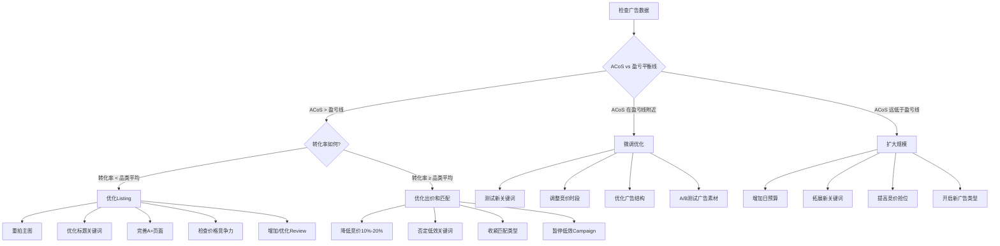
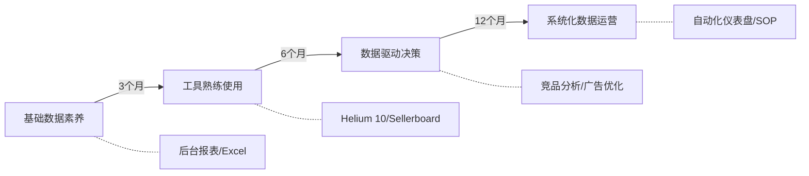

## 八、跨境电商数据化运营体系

跨境电商的竞争，本质上是数据能力的竞争。当两个卖家卖同一款产品、用同一条物流、在同一个平台上竞争时，决定胜负的往往不是谁更勤奋，而是谁能更快、更准地从数据中发现机会、识别问题、做出决策。

数据化运营的核心逻辑可以用一句话概括：**采集→清洗→分析→决策→执行→验证→迭代**。这不是一个线性过程，而是一个持续运转的飞轮。每一次迭代都让你对市场的理解更深一层，对资源的配置更精准一步。

### 8.1 核心数据指标体系

跨境电商涉及的数据指标数量庞大，初学者容易陷入"什么都想看，什么都看不懂"的困境。正确的做法是建立**分层指标体系**：先掌握一级核心指标（判断生意健康度），再深入二级细分指标（诊断具体问题），最后关注三级运营指标（精细化优化）。

#### 8.1.1 一级指标：生意健康度仪表盘

一级指标是老板每天必须看的数字，回答"生意好不好"这个根本问题。

**（1）销售额（Revenue）**

销售额是最直观的业务指标，但仅仅看绝对值毫无意义。你需要关注三个维度：

- **日/周/月销售额趋势**：是否持续增长？增长曲线是线性还是指数型？
- **同比与环比**：本月比上月增长多少？比去年同期增长多少？（跨境电商有明显的季节性，同比更有参考价值）
- **销售额构成**：多少来自自然流量，多少来自广告？如果广告销售额占比超过60%，说明对付费流量依赖度过高，自然流量的SEO和品牌建设需要加强。

**（2）客单价（AOV, Average Order Value）**

客单价 = 总销售额 ÷ 订单数。客单价的高低直接决定了你的利润空间和广告承受能力。

以亚马逊为例，假设你的ACoS（广告销售成本比）是25%，客单价是20美元，那么每单的广告成本就是5美元。如果你的毛利只有6美元，广告后只剩1美元利润。但如果你的客单价是40美元，同样25%的ACoS，广告成本10美元，毛利假设12美元，广告后还有2美元利润——客单价翻倍，利润也翻倍。

提升客单价的常用策略：捆绑销售（Bundle）、交叉销售（Cross-sell）、满减优惠（Spend & Save）、产品升级（Premium版本）。

**（3）转化率（CVR, Conversion Rate）**

转化率 = 订单数 ÷ 访客数（Sessions）。这是衡量Listing质量的核心指标。

不同品类的转化率差异巨大，不能跨品类比较。以下是亚马逊主要品类的转化率参考范围：

| 品类 | 平均转化率 | 优秀转化率 | 备注 |
|------|-----------|-----------|------|
| 3C电子配件 | 10%-18% | 20%+ | 标品，比价行为强 |
| 家居厨房 | 8%-15% | 18%+ | 非标品，图片影响大 |
| 服装鞋靴 | 5%-12% | 15%+ | 尺码问题导致退货率高 |
| 美妆个护 | 8%-14% | 18%+ | 品牌忠诚度高 |
| 宠物用品 | 10%-16% | 20%+ | 情感消费，复购率高 |
| 户外运动 | 6%-12% | 15%+ | 季节性波动明显 |
| 办公用品 | 12%-20% | 25%+ | 刚需，决策链短 |

转化率低于品类平均值时，需要系统排查：主图是否有吸引力？标题是否包含核心关键词？价格是否有竞争力？评论数量和评分是否达标？A+页面是否做了？五点描述是否解决了买家的核心疑虑？

**（4）退货率（Return Rate）**

退货率 = 退货订单数 ÷ 总订单数。退货不仅损失了物流费用和产品本身，还会拉低Listing权重。亚马逊的退货率红线因品类而异，但一般来说：

- 低于5%：健康水平
- 5%-10%：需要关注，分析退货原因
- 10%-20%：警告水平，Listing可能被降权
- 超过20%：危险，可能触发亚马逊审核甚至下架

退货原因分析是关键。常见原因包括：产品与描述不符（占30%）、质量问题（占25%）、尺码/规格不对（占20%）、物流损坏（占15%）、买家后悔（占10%）。每一种原因对应不同的改进方向。

**（5）利润率（Profit Margin）**

利润率是所有指标的终极裁判。销售额再高，如果利润率是负数，那只是在"花钱赚吆喝"。

跨境电商的成本结构比国内电商复杂得多，完整拆解如下：

```text
售价 $30.00
├── 产品采购成本:        -$6.00  (20%)
├── 头程物流:            -$2.50  (8.3%)
├── FBA配送费:           -$5.00  (16.7%)
├── 平台佣金 (15%):      -$4.50  (15%)
├── 广告费 (ACoS 25%):   -$3.75  (12.5%)  ← 按广告销售额算
├── 退货成本 (8%退货率):  -$0.80  (2.7%)
├── 仓储费:              -$0.30  (1%)
├── 其他费用 (保险/工具等): -$0.50  (1.7%)
└── ─────────────────────────────────
    净利润:               $6.65  (22.2%)
```

这个例子的22.2%净利率属于相当健康的水平。实际运营中，很多卖家的净利率只有5%-15%。如果你不算清楚这笔账，很可能卖得越多亏得越多。

#### 8.1.2 二级指标：广告效果诊断

广告是跨境电商最大的可控成本之一，也是数据密度最高的运营环节。

**（1）ACoS（Advertising Cost of Sales）**

ACoS = 广告花费 ÷ 广告销售额 × 100%。这是衡量广告效率的核心指标。

ACoS的"好坏"取决于你的毛利率。一个简单的判断标准：

```text
盈亏平衡ACoS = 毛利率（不含广告）

例：毛利率40% → ACoS低于40%就不亏钱
    但理想ACoS应控制在毛利率的50%-70%以内
    即毛利率40%时，理想ACoS为20%-28%
```

ACoS不是越低越好。ACoS很低可能意味着你出价太保守，错失了大量潜在订单。正确的思维方式是：在保证目标利润的前提下，尽可能多地获取订单。

**（2）TACoS（Total Advertising Cost of Sales）**

TACoS = 广告花费 ÷ 总销售额（含自然订单）× 100%。

TACoS比ACoS更能反映广告的真实效率。因为好的广告不仅能直接带来订单，还能提升关键词排名，从而带动自然流量增长。

判断标准：
- TACoS < 10%：广告效率优秀，自然流量占比高
- TACoS 10%-15%：健康水平，适合成长期产品
- TACoS 15%-20%：偏高，需要优化广告结构
- TACoS > 20%：过度依赖广告，需紧急调整

一个重要的趋势判断：如果TACoS逐月下降，说明你的自然流量在增长，广告在"养"关键词排名，这是健康的。如果TACoS逐月上升，说明广告效率在恶化，或者竞争加剧导致CPC上涨。

**（3）CPC（Cost Per Click）**

CPC = 广告花费 ÷ 点击次数。CPC反映的是流量的"单价"，不同品类差异巨大：

| 品类 | CPC范围（美元） | 备注 |
|------|----------------|------|
| 3C电子 | $0.50-$2.00 | 竞争激烈 |
| 家居厨房 | $0.40-$1.50 | 中等竞争 |
| 服装时尚 | $0.30-$1.20 | 长尾词多 |
| 美妆个护 | $0.60-$2.50 | 品牌词竞价高 |
| 办公用品 | $0.20-$0.80 | 相对蓝海 |
| 汽车配件 | $0.30-$1.00 | 专业性强 |

CPC持续上涨通常意味着：更多卖家进入该品类竞争、大促期间竞价加剧、或者你的广告质量分下降。应对策略包括：优化Listing提升质量分、拓展长尾关键词、调整竞价时段、使用否定关键词排除无效流量。

**（4）CTR（Click-Through Rate）**

CTR = 点击次数 ÷ 展示次数 × 100%。CTR反映的是广告的"吸引力"。

亚马逊搜索广告的平均CTR约为0.3%-0.5%。如果你的CTR低于0.3%，说明广告展示出去了但没人点，问题通常出在：主图不够吸引人、标题没有突出卖点、价格在搜索结果中没有竞争力、星级评分低于竞品。

**（5）ROAS（Return on Ad Spend）**

ROAS = 广告销售额 ÷ 广告花费。ROAS是ACoS的倒数，更直观地表达"每花1块钱广告费能赚回多少钱"。

ROAS = 4意味着每花1块钱广告费产生4块钱销售额。如果毛利率是40%，那么4块钱销售额对应1.6块钱毛利，扣除1块钱广告费，净赚0.6块钱——这是一个盈利的广告投放。

#### 8.1.3 三级指标：运营精细化

**（1）Session（访问量）**

Session是亚马逊后台的访客数统计。Session的增长来源分析至关重要：

- 自然搜索（Organic）：关键词排名提升带来
- 广告流量（Sponsored）：广告投放带来
- 直接访问（Direct）：品牌搜索或收藏夹访问
- 外部流量（External）：社交媒体、博客、Deal网站带来

健康的流量结构应该是：自然搜索占比50%以上，广告流量30%以下，外部流量和直接访问20%左右。如果广告流量占比超过60%，说明你的产品对广告依赖度过高。

**（2）BSR（Best Sellers Rank）**

BSR是亚马逊的畅销排名，每小时更新一次。BSR不是绝对指标，而是相对指标——它反映的是你在某个品类中的销售速度排名。

BSR的解读要点：
- BSR波动是正常的，不必为短期排名下降焦虑
- 关注趋势而非单点数据，7天移动平均更有参考价值
- 不同品类的BSR含金量差异巨大：小众品类BSR #100可能日销5件，大品类BSR #100可能日销500件
- BSR与关键词排名是两个独立体系，BSR高不等于搜索排名高

**（3）Buy Box占比**

对于非独占品牌的产品，Buy Box（购物车）占比直接影响你能获得多少订单。在亚马逊上，约82%的销售额通过Buy Box产生。

影响Buy Box的因素包括：价格竞争力（最重要）、配送方式（FBA优于FBM）、卖家绩效指标（ODR < 1%）、库存状态、账户健康度。Buy Box占比低于80%时需要立即排查原因。

**（4）库存周转天数**

库存周转天数 = 平均库存 ÷ 日均销售成本。这个指标告诉你，按当前销售速度，库存需要多少天才能卖完。

- 30天以内：健康，资金利用效率高
- 30-60天：正常水平
- 60-90天：偏高，需关注是否产生长期仓储费
- 90天以上：危险，资金被大量占用，且面临长期仓储费风险

**（5）IPI评分（Inventory Performance Index）**

IPI是亚马逊对卖家库存管理能力的评分，范围200-1000分。IPI低于350分会导致FBA库存限制，直接影响补货能力。

IPI由四个因素决定：冗余库存比例（越低越好）、滞销库存比例（越低越好）、FBA售罄率（越高越好）、FBA有存货率（越高越好）。这四个因素的权重亚马逊没有公开，但实践经验表明，冗余库存和售罄率的影响最大。

#### 8.1.4 客户价值指标

**（1）CAC（Customer Acquisition Cost）**

CAC = 总营销成本 ÷ 新客户数。在跨境电商中，CAC通常用广告花费 ÷ 广告带来的新订单数来估算。

**（2）LTV（Lifetime Value）**

LTV = 客单价 × 复购次数 × 毛利率。LTV与CAC的比值（LTV:CAC）是衡量获客效率的核心指标。

- LTV:CAC > 3:1：健康的商业模式
- LTV:CAC 1:1 到 3:1：勉强可持续，需要优化
- LTV:CAC < 1:1：不可持续，卖得越多亏得越多

对于复购率高的品类（如宠物用品、美妆个护、保健品），LTV的价值远超首次订单利润。这也是为什么很多卖家愿意在首次订单上亏钱——他们在"购买"一个高LTV的客户。

### 8.2 数据采集与工具体系

#### 8.2.1 工具分类与选型

数据工具可以按功能分为四大类：选品研究工具、运营监控工具、广告分析工具、利润核算工具。初学者不需要全部购买，根据阶段选择即可。

**选品研究工具：**

| 工具 | 核心功能 | 价格（月费） | 适合阶段 | 优势 | 劣势 |
|------|----------|-------------|----------|------|------|
| Jungle Scout | 选品数据库、销量预估、供应商匹配 | $29-$84 | 入门到进阶 | 操作简单，数据准确度高 | 仅支持亚马逊 |
| Helium 10 | 关键词研究、竞品追踪、Listing优化 | $29-$229 | 进阶到高级 | 功能最全面，工具集最丰富 | 学习曲线陡峭 |
| Keepa | 价格历史、库存变化、BSR追踪 | €19 | 所有阶段 | 历史数据最全，图表直观 | 仅提供数据，不提供分析建议 |
| 卖家精灵（SellerSprite） | 关键词、选品、竞品分析 | ¥599-¥2999/年 | 中文卖家首选 | 中文界面，中国卖家适配好 | 数据覆盖以亚马逊为主 |
| 数魔跨境 | 选品分析、关键词追踪 | 免费-$39 | 入门 | 有免费版可体验 | 功能深度不如头部工具 |

**运营监控工具：**

| 工具 | 核心功能 | 价格 | 适合阶段 |
|------|----------|------|----------|
| Sellerboard | 利润计算、PPC分析、库存管理 | $15.99起 | 所有阶段 |
| DataHawk | 排名追踪、评论分析、Buy Box监控 | 免费-$99 | 进阶 |
| Pacvue | 企业级广告管理、竞品广告分析 | 定制报价 | 大卖家 |
| Perpetua | AI驱动的广告优化 | $250起 | 中大型卖家 |

**利润核算工具：**

- **Sellerboard**：自动拉取亚马逊数据，扣除所有费用后计算真实利润，支持SKU级别的利润分析，是目前最受欢迎的利润核算工具。
- **HelloProfit**：界面友好，利润计算准确，支持多站点管理。
- **A2X**：专为会计和财务设计，自动将亚马逊交易按会计准则分类，适合需要做财务报表的卖家。
- **自建Excel/Google Sheets**：灵活性最高，但需要手动更新数据。适合SKU数量少（<50个）的早期卖家。

#### 8.2.2 亚马逊官方数据工具

亚马逊为卖家提供了多款免费的官方数据工具，很多卖家没有充分利用：

**（1）Brand Analytics（品牌分析）**

需完成品牌注册（Brand Registry）才能使用。提供三张核心报表：

- **搜索词报表（Search Query Performance）**：展示每个搜索词的点击份额、转化份额。你可以看到某个关键词下，你的产品获得了多少点击和转化，直接衡量关键词竞争实力。
- **市场篮子分析（Market Basket Analysis）**：展示购买了你产品的客户同时还买了什么。这是发现交叉销售机会和选品灵感的金矿。
- **人口统计（Demographics）**：展示你客户的年龄、性别、收入、婚姻状况分布。这些信息对广告定向和产品定位极有价值。

**（2）Search Catalog Performance**

展示每个ASIN在搜索结果中的表现：展示量、点击量、加购量、购买量。通过这个漏斗数据，你可以精确定位转化瓶颈——是曝光不够（需要优化关键词）、点击不够（需要优化主图和标题）、还是加购后没下单（需要优化价格和评论）。

**（3）Business Reports**

卖家后台的业务报告，提供Session、页面浏览量、转化率、Buy Box占比等核心数据。建议每周导出一次，建立自己的数据追踪表。

#### 8.2.3 外部数据采集

除了平台内部数据，外部数据源同样重要：

- **Google Trends**：判断搜索趋势的长期走势，识别季节性需求变化。输入产品关键词，选择目标市场和时间范围，可以看到搜索热度的上升/下降趋势。
- **Google Keyword Planner**：获取谷歌搜索量数据，评估平台外的搜索需求。
- **社交媒体监听**：通过TikTok、Instagram、Reddit等平台观察消费者讨论趋势，发现新兴需求。
- **海关数据**：通过ImportGenius、Panjiva等工具查询目标市场的进口数据，了解品类的进口规模和主要供应商。

### 8.3 数据分析方法论

有了数据和工具，下一步是掌握分析方法。数据本身不会告诉你该怎么做，只有正确的分析框架才能将数据转化为决策。

#### 8.3.1 竞品分析漏斗

竞品分析是跨境电商最常用的数据分析方法。系统化的竞品分析不是"看看别人卖多少钱"，而是构建一个完整的分析漏斗：

**第一步：确定竞品范围**

- 直接竞品：同品类、同价位段、同目标客群的产品
- 间接竞品：解决同样需求但不同品类的产品（如咖啡机 vs 速溶咖啡）
- 标杆竞品：品类头部卖家，学习其运营策略

建议选择5-10个竞品进行深度分析，太少缺乏代表性，太多分析成本过高。

**第二步：采集竞品数据**

```cpp
竞品数据采集清单：
├── 基础信息
│   ├── 售价和定价策略（是否有Coupon、Deal）
│   ├── 月销量预估（通过Jungle Scout/Helium 10）
│   ├── Review数量和评分
│   └── 上架时间和生命周期阶段
├── Listing分析
│   ├── 标题结构和关键词布局
│   ├── 主图风格和拍摄角度
│   ├── 五点描述的卖点排序
│   ├── A+页面的内容和设计
│   └── 视频内容和风格
├── 广告分析
│   ├── 赞助广告出现频率（通过DataDive/Pacvue）
│   ├── 投放关键词（通过Helium 10 Cerebro）
│   └── 广告排位变化
├── 流量结构
│   ├── 自然搜索关键词排名
│   ├── 广告关键词覆盖
│   └── 外部流量来源
└── 运营策略
    ├── 促销节奏（Prime Day、黑五等）
    ├── 新品推广策略
    └── 客户服务响应
```

**第三步：建立对比矩阵**

将采集到的数据整理成对比表格，找出自己的差距和机会：

| 维度 | 我的产品 | 竞品A | 竞品B | 竞品C | 行动计划 |
|------|---------|-------|-------|-------|----------|
| 月销量 | 500 | 2000 | 1200 | 800 | 差距主要在关键词覆盖 |
| Review数 | 50 | 300 | 150 | 80 | 启动Vine计划 |
| 评分 | 4.2 | 4.5 | 4.3 | 4.6 | 排查差评原因 |
| 售价 | $29.99 | $34.99 | $27.99 | $32.99 | 有提价空间 |
| 主图质量 | 一般 | 优秀 | 良好 | 优秀 | 重拍主图 |
| A+页面 | 无 | 有 | 有 | 有 | 制作A+页面 |

#### 8.3.2 关键词矩阵分析

关键词分析是亚马逊运营的核心技能。用Helium 10的Cerebro工具，可以获取竞品的全部关键词排名数据。

**关键词分类矩阵：**

按搜索量和竞争度两个维度，将关键词分为四类：

| | 高搜索量 | 低搜索量 |
|--|---------|---------|
| **低竞争度** | 🌟 **蓝海关键词**（优先攻克） | 🎯 **长尾精准词**（持续积累） |
| **高竞争度** | ⚔️ **主战场词**（持续投入） | ❌ **低效词**（放弃或否定） |

**蓝海关键词**是最有价值的目标——搜索量大意味着有流量，竞争度低意味着容易拿到排名。这类词通常是新兴需求词、场景词或组合词，需要通过工具挖掘才能发现。

**关键词优化策略：**

1. **标题**：放置搜索量最大的2-3个核心关键词，同时保持标题可读性
2. **五点描述**：覆盖中等搜索量的功能词、场景词、属性词
3. **后台Search Terms**：放置标题和五点中没有涵盖的关键词，注意不要重复
4. **广告Campaign**：用不同匹配类型（广泛/词组/精准）分层测试关键词效果

#### 8.3.3 广告归因分析

广告归因（Attribution）回答一个关键问题：这个订单应该"算"哪个广告的功劳？

亚马逊的广告归因采用"最后一次点击"模型：如果一个买家点击了你的SP广告，没有购买，3天后又点击了你的SB广告并购买，这个订单归功于SB广告。

理解归因模型对于广告优化至关重要：

- **SP（Sponsored Products）广告**：最直接的转化渠道，ACoS通常最低，但对品牌建设的贡献被低估。
- **SB（Sponsored Brands）广告**：展示品牌Logo和多个产品，对品牌认知的贡献更大，转化周期可能更长。
- **SD（Sponsored Display）广告**：用于再营销和竞品页面截流，转化路径最长但对整体销量有拉动作用。

在评估广告效果时，不能只看单一广告类型的ACoS，而要看**整体TACoS**。如果增加SB广告投放后，SP广告的ACoS也下降了（因为品牌认知提升带来更多自然搜索），说明SB广告的价值被低估了。

#### 8.3.4 库存健康度评估

库存管理是跨境电商最容易出问题的环节之一。库存不足导致断货，损失排名和订单；库存过多导致资金占用和长期仓储费。

**库存健康度评分模型：**

```text
库存健康度 = f(有存货率, 冗余库存比例, 售罄率, 周转天数)

评分标准（满分100分）：
├── 有存货率（权重30%）
│   ├── ≥95%: 30分
│   ├── 90%-95%: 25分
│   ├── 80%-90%: 20分
│   └── <80%: 10分
├── 冗余库存比例（权重25%）
│   ├── <5%: 25分
│   ├── 5%-10%: 20分
│   ├── 10%-20%: 15分
│   └── >20%: 5分
├── 售罄率（权重25%）
│   ├── ≥80%: 25分
│   ├── 60%-80%: 20分
│   ├── 40%-60%: 15分
│   └── <40%: 5分
└── 周转天数（权重20%）
    ├── <30天: 20分
    ├── 30-60天: 15分
    ├── 60-90天: 10分
    └── >90天: 5分

健康等级：
├── 80-100分：优秀
├── 60-79分：良好
├── 40-59分：需要关注
└── <40分：需要紧急处理
```

### 8.4 数据驱动的运营决策

#### 8.4.1 广告优化决策树

广告优化是跨境电商日常运营中最高频的数据分析场景。以下是一个实战验证过的决策树，覆盖了绝大多数常见情况：



**决策树的使用方法：**

1. 每周至少检查一次各Campaign的ACoS，与你的盈亏平衡ACoS对比
2. ACoS偏高时，先看转化率——转化率低说明Listing有问题，转化率正常说明出价或关键词有问题
3. ACoS健康时不要"躺平"，而是积极测试新关键词和广告结构
4. ACoS很低说明有扩大空间，但扩大时注意保持ACoS在可控范围内

**关键判断指标：**

| 指标 | 需要关注 | 需要行动 |
|------|---------|---------|
| ACoS持续上升3天 | 关注竞争变化 | 检查是否有新竞品进入 |
| CTR突然下降 | 检查广告展示位置 | 可能竞价被压低 |
| CPC持续上涨 | 评估品类竞争加剧 | 拓展长尾词降低依赖 |
| 转化率下降 | 检查Review变化 | 排查是否有新增差评 |
| 广告花费突增 | 检查是否有异常点击 | 设置否定关键词 |

#### 8.4.2 库存补货决策模型

库存补货是最需要数据支撑的决策之一。补少了断货，补多了压资金。

**核心公式：**

```text
补货量 = 安全库存需求 + 在途周期需求 - 当前库存 - 在途库存

其中：
├── 安全库存需求 = 日均销量 × 安全天数
├── 在途周期需求 = 日均销量 × 补货周期天数
├── 补货周期天数 = 生产时间 + 头程物流时间 + 入仓时间
└── 安全天数 = 通常7-14天，旺季建议14-21天
```

**实战示例：**

```text
某产品：
├── 日均销量：30件
├── 生产时间：15天
├── 头程物流（海运）：30天
├── 入仓时间：5天
├── 安全天数：10天
├── 当前库存：200件
├── 在途库存：0件
│
├── 补货周期 = 15 + 30 + 5 = 50天
├── 周期需求 = 30 × 50 = 1,500件
├── 安全需求 = 30 × 10 = 300件
├── 补货量 = 1,500 + 300 - 200 - 0 = 1,600件
│
└── 如果考虑旺季（11-12月销量增长50%）：
    旺季日均 = 30 × 1.5 = 45件
    旺季补货量 = 45 × 50 + 45 × 14 - 200 - 0 = 2,680件
```

**补货节奏建议：**

| 补货方式 | 适用场景 | 优势 | 劣势 |
|----------|---------|------|------|
| 海运为主（70%） | 常规补货 | 成本最低 | 时效长，资金占用大 |
| 空运+海运混合 | 成长期产品 | 平衡成本和时效 | 需要更精细的计划 |
| 空运为主（70%） | 断货急救 | 时效最快 | 成本高，压缩利润 |
| 海外仓备货 | 大件/热销品 | 发货快，体验好 | 前期投入大 |

#### 8.4.3 定价决策模型

定价不是拍脑袋决定的，而是需要基于数据的系统化决策：

**定价的三条底线：**

1. **成本底线**：售价必须高于全部成本（含广告费），否则卖得越多亏得越多
2. **竞争底线**：售价不能明显高于同品质竞品，除非你能证明溢价合理性
3. **价值底线**：售价不能低于消费者对产品价值的感知，否则反而会降低信任感

**动态定价策略：**

```text
定价场景与策略：

新品上架期（0-30天）：
├── 策略：略低于竞品10%-15%
├── 目的：快速积累Review和排名
└── 价格弹性：高（每降价1%，转化率提升约3%-5%）

成长期（30-90天）：
├── 策略：与竞品持平或略高
├── 目的：在保持转化率的同时提升利润率
└── 逐步提价$0.50-$1.00/次，观察转化率变化

成熟期（90天+）：
├── 策略：根据品牌力和Review优势定价
├── 目的：最大化利润
└── 品牌溢价可达10%-30%

旺季/大促：
├── 策略：适度降价配合Coupon
├── 目的：冲排名、清库存
└── 降价幅度建议15%-25%，配合广告加预算

淡季：
├── 策略：维持价格，优化成本
├── 目的：保住利润率
└── 减少广告预算，靠自然流量维持
```

### 8.5 数据可视化与报表体系

#### 8.5.1 运营仪表盘设计

数据可视化不是做"好看的图表"，而是让关键信息一目了然。一个好的运营仪表盘应该在30秒内告诉你：生意好不好？哪里有问题？需要做什么？

**推荐仪表盘结构（使用Looker Studio或Excel）：**

```text
仪表盘布局：

┌─────────────────────────────────────────────────────┐
│                    一级指标卡片                        │
│  [本月销售额] [环比增长] [毛利率] [TACoS] [库存健康度]  │
├──────────────────────┬──────────────────────────────┤
│                      │                              │
│   销售趋势折线图       │     广告效果仪表盘            │
│   （日维度，30天）      │     ACoS / CPC / CTR / ROAS  │
│                      │                              │
├──────────────────────┼──────────────────────────────┤
│                      │                              │
│   TOP 10 SKU利润排名  │     库存预警列表              │
│   （SKU/销量/毛利/净利）│     （断货风险/滞销风险）      │
│                      │                              │
├──────────────────────┴──────────────────────────────┤
│                    关键词排名变化                       │
│            TOP 20关键词的排名趋势图                     │
└─────────────────────────────────────────────────────┘
```

#### 8.5.2 数据报表节奏

建立固定的数据报表节奏，避免"救火式"的数据查看：

| 频率 | 关注内容 | 耗时 | 输出 |
|------|---------|------|------|
| **每日** | 销量、广告花费、库存状态、异常警报 | 10分钟 | 快速检查，发现问题当日处理 |
| **每周** | 广告表现、关键词排名、竞品动态、Review变化 | 1-2小时 | 周报，制定下周优化计划 |
| **每月** | 利润核算、库存规划、品类趋势、运营策略评估 | 半天 | 月报，调整运营策略 |
| **每季度** | 品类趋势分析、产品线优化、竞品格局变化、战略调整 | 1-2天 | 季度复盘，制定下季计划 |

**每日检查清单：**

```text
□ 登录卖家后台，检查今日订单数和销售额
□ 检查广告花费是否异常（超出日预算的150%需要关注）
□ 查看库存状态，是否有即将断货的SKU
□ 检查是否有新的买家消息或A-to-Z索赔
□ 查看是否有新的Review（特别是差评）
□ 检查账号健康状态和绩效指标
```

#### 8.5.3 自动化报表方案

手动制作报表耗时且容易出错，以下是三种自动化方案：

**方案一：亚马逊官方API + Google Sheets**

使用亚马逊SP-API（Selling Partner API）自动拉取数据，配合Google Sheets的定时刷新功能，实现半自动化的数据更新。适合有一定技术能力的卖家。

**方案二：第三方工具自动报表**

Sellerboard、Helium 10等工具都内置了自动报表功能，可以设置定时发送日报/周报到邮箱。适合不想折腾技术的卖家。

**方案三：Looker Studio + 数据连接器**

使用Google Looker Studio（原Data Studio）连接亚马逊数据源，构建交互式仪表盘。支持自动刷新、多维度筛选、团队共享。适合中大型卖家和团队协作场景。

### 8.6 进阶数据分析方法

#### 8.6.1 A/B测试（拆分测试）

亚马逊为品牌注册卖家提供了"Manage Your Experiments"功能，可以对标题、主图、A+页面进行A/B测试。

**A/B测试的正确做法：**

1. **一次只测试一个变量**：如果同时改了标题和主图，你无法判断是哪个因素导致了转化率变化。
2. **测试周期足够长**：至少运行2周，覆盖工作日和周末。流量太少的ASIN可能需要4周以上。
3. **样本量足够大**：需要至少1000次展示才能得出有意义的结论。
4. **关注转化率而非点击率**：主图的A/B测试中，高CTR不等于高CVR——吸引了错误人群的点击反而有害。

**值得测试的元素（按优先级排序）：**

| 测试对象 | 预期影响 | 难度 | 建议频率 |
|----------|---------|------|---------|
| 主图 | 转化率提升5%-20% | 中 | 每季度1次 |
| 标题 | 转化率提升3%-10% | 低 | 每季度1次 |
| 价格 | 转化率和利润的平衡 | 低 | 持续监控 |
| A+页面 | 转化率提升3%-8% | 高 | 每半年1次 |
| 五点描述 | 转化率提升2%-5% | 中 | 每半年1次 |

#### 8.6.2 季节性趋势分析

跨境电商有非常明显的季节性波动。提前预判趋势，才能做好库存和营销的准备。

**亚马逊全年运营节奏：**

| 月份 | 流量趋势 | 关键节点 | 运营重点 |
|------|---------|---------|---------|
| 1月 | 下降 | 新年，清库存 | 促销清尾货，为Q1选品做准备 |
| 2月 | 低迷 | 情人节 | 情人节品类爆发，其余品类蓄力 |
| 3月 | 回暖 | 春季上新 | 新品上架，测试市场反应 |
| 4月 | 平稳 | 复活节 | 户外品类开始增长 |
| 5月 | 增长 | 母亲节 | 礼品类小高峰 |
| 6月 | 平稳 | Prime Day预热 | 提前备货Prime Day |
| 7月 | 高峰 | Prime Day | 全年第一个销售高峰 |
| 8月 | 平稳 | 开学季 | 文具、电子产品需求增长 |
| 9月 | 增长 | 备货旺季 | 为Q4大量补货 |
| 10月 | 增长 | 万圣节 | 节日品类爆发 |
| 11月 | 高峰 | 黑五/网一 | 全年最大销售高峰 |
| 12月 | 高峰 | 圣诞节 | 礼品类需求暴涨 |

**季节性数据应用：**

利用历史数据预测未来需求。以某产品为例：

```text
2024年月销量数据：
1月: 400   2月: 350   3月: 500   4月: 550
5月: 600   6月: 650   7月: 900   8月: 700
9月: 750   10月: 800  11月: 1200  12月: 1500

季节性指数 = 当月销量 / 月均销量
月均销量 = 729

1月指数: 0.55   7月指数: 1.23   11月指数: 1.65   12月指数: 2.06

2025年备货计划（假设预期增长30%）：
预期月均销量 = 729 × 1.3 = 948
1月备货 = 948 × 0.55 = 521件
7月备货 = 948 × 1.23 = 1,166件
12月备货 = 948 × 2.06 = 1,953件
```

#### 8.6.3 Review分析与产品迭代

客户Review是最宝贵的免费数据来源。系统化的Review分析可以发现产品改进方向和新选品机会。

**Review分析方法：**

1. **差评归类**：将所有3星及以下Review按问题类型分类（质量、尺寸、功能、包装、物流等），统计各类问题的占比。
2. **好评挖掘**：分析5星Review中客户反复提到的优点，这些就是你的核心卖点，应该在Listing中重点突出。
3. **竞品Review对比**：分析竞品的差评，找到竞品的弱点作为自己的差异化方向。
4. **Review趋势监控**：关注Review评分的月度变化趋势，如果评分持续下降，说明产品质量或供应链出了问题。

### 8.7 常见数据误区与纠正

#### 误区一：只看ACoS不看TACoS

很多卖家把ACoS当作衡量广告效果的唯一指标，但ACoS只衡量了广告订单的成本，忽略了广告对自然流量的带动作用。

**纠正方法**：同时关注TACoS。如果ACoS上升但TACoS下降，说明广告在拉动自然流量，这是好事。

#### 误区二：盲目追求低ACoS

有些卖家把ACoS压到5%以下就觉得广告做得好。但极低的ACoS往往意味着你放弃了大量潜在订单。

**纠正方法**：在保证目标利润的前提下，允许ACoS在合理范围内波动。ACoS 15%-25%是多数品类的健康区间。

#### 误区三：忽视数据的时间维度

只看某一天的数据就做出决策，忽略了趋势和波动。

**纠正方法**：至少看7天数据再做判断，重要决策看30天数据。用移动平均线平滑波动，关注趋势而非单点。

#### 误区四：数据口径不统一

不同工具对同一个指标的计算方式可能不同（如"月销量"，有的按30天算，有的按自然月算），导致数据无法对比。

**纠正方法**：选定一套主要数据来源，在整个团队内统一口径。在做对比分析时，确保数据来自同一个工具。

#### 误区五：过度依赖工具预估数据

Jungle Scout、Helium 10等工具的销量预估是基于算法推算的，并非实际数据，误差通常在±30%。

**纠正方法**：把工具预估数据作为参考而非事实。重要决策（如是否进入某个品类）应该结合多个数据源交叉验证。

#### 误区六：只分析不行动

花大量时间做数据分析和报表，但没有转化为具体行动。

**纠正方法**：每一份分析报告必须包含"行动项"——看完数据后，具体要做什么？谁来做？什么时候完成？没有行动项的数据分析就是自嗨。

### 8.8 数据能力成长路径

数据化运营能力不是一蹴而就的，以下是推荐的成长路径：

**阶段一：基础数据素养（0-3个月）**

- 学会看亚马逊后台的Business Reports
- 理解核心指标的含义和计算方法
- 建立每日数据检查的习惯
- 使用Excel做基础的数据记录和图表

**阶段二：工具熟练使用（3-6个月）**

- 熟练使用Helium 10或Jungle Scout进行关键词研究和竞品分析
- 使用Sellerboard等工具进行利润核算
- 建立周报和月报制度
- 开始做简单的A/B测试

**阶段三：数据驱动决策（6-12个月）**

- 能够独立完成完整的竞品分析报告
- 掌握广告优化决策树，能根据数据调整广告策略
- 建立库存补货模型
- 开始关注TACoS和LTV等深层指标

**阶段四：系统化数据运营（12个月+）**

- 构建自动化数据仪表盘
- 建立标准化的数据分析流程和SOP
- 能够进行季节性趋势预测和需求规划
- 带领团队建立数据文化



### 8.9 本节要点总结

1. **建立分层指标体系**：一级指标（销售额、客单价、转化率、利润率）判断生意健康度，二级指标（ACoS、TACoS、CPC、CTR）诊断广告效果，三级指标（Session、BSR、Buy Box占比、IPI）指导精细化运营。

2. **工具选型要匹配阶段**：入门用Jungle Scout + Sellerboard，进阶加Helium 10 + Keepa，高级再考虑Pacvue等企业级工具。不建议一开始就订阅所有工具。

3. **掌握四大分析方法**：竞品分析漏斗（知己知彼）、关键词矩阵分析（精准获客）、广告归因分析（合理分配预算）、库存健康度评估（避免断货和滞销）。

4. **决策要基于数据而非直觉**：广告优化看决策树，补货用公式计算，定价按场景策略。每一个运营决策都应该有数据支撑。

5. **建立报表节奏**：每日快速巡检10分钟，每周深度分析1-2小时，每月全面复盘半天，每季度战略调整1-2天。

6. **避免常见数据误区**：不只看ACoS要看TACoS，不追求极低ACoS，看趋势不看单点，统一数据口径，行动比分析更重要。

7. **数据能力需要持续成长**：从看懂报表到工具熟练到数据驱动决策到系统化运营，每个阶段需要6-12个月的积累，没有捷径。

数据化运营的终极目标不是"看数据"，而是"用数据赚钱"。当你能够在数据中发现别人看不到的机会，在趋势到来之前做出正确的决策，你就已经从"运营"升级为"操盘"了。
