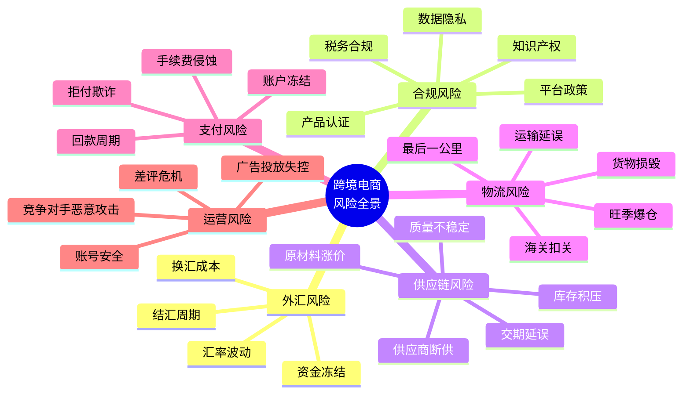
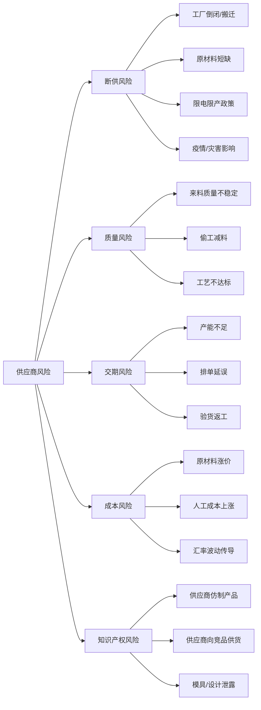
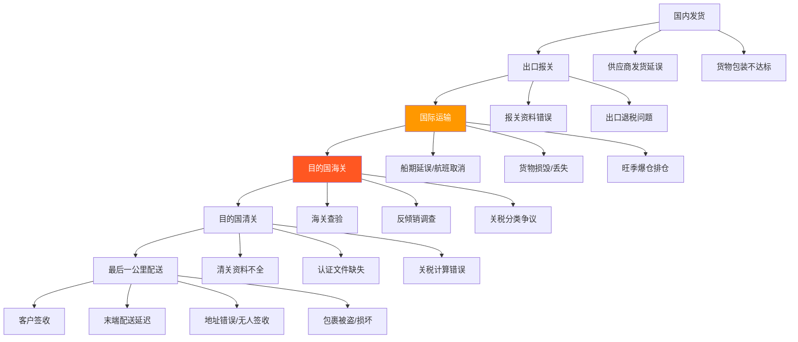
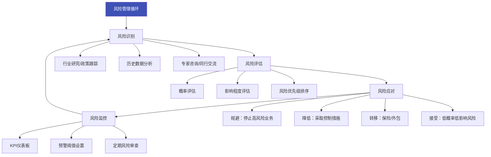

## 九、跨境电商风险管理

跨境电商天然涉及多国法律、多种货币、多层供应链和跨时区运营，其风险复杂度远超国内电商。一个在国内电商中不起眼的小问题——比如一笔退款、一次物流延误——放到跨境场景下可能引发连锁反应：汇率波动吃掉利润、合规罚款超过营收、物流断链导致店铺封禁。风险管理不是"出了事再救火"，而是一套贯穿选品、采购、运营、财务、物流全链路的系统工程。

### 9.1 跨境电商风险全景图

跨境电商业务涉及的风险可以按来源划分为六大类，每一类都可能对业务造成致命打击：



### 9.2 外汇风险管理

#### 9.2.1 外汇风险的本质

跨境电商卖家的收入以外币（美元、欧元、英镑、日元等）结算，但成本（采购、物流、人工）以人民币支付。从收到外币货款到兑换成人民币的时间差内，汇率波动直接影响实际利润。

**汇率风险的三种形态：**

| 风险类型 | 定义 | 典型场景 |
|----------|------|----------|
| 交易风险 | 从签订合同到结算期间汇率变动导致的损益 | 下单时汇率7.2，回款时汇率7.0，2.8%利润蒸发 |
| 折算风险 | 财务报表编制时因汇率变动导致的账面损益 | 季末报表中外币资产因汇率变动出现大幅波动 |
| 经济风险 | 汇率长期趋势变动对业务竞争力的影响 | 人民币持续升值压缩以美元计价的利润空间 |

#### 9.2.2 汇率波动的实际影响测算

假设一个典型场景：月销售额10万美元，毛利率30%，净利润率10%。

| 汇率变动幅度 | 对月利润的影响 | 占净利润比例 |
|-------------|---------------|-------------|
| -1%（如7.20→7.13） | -1,000美元 ≈ -7,130元 | -10% |
| -3%（如7.20→7.00） | -3,000美元 ≈ -21,000元 | -30% |
| -5%（如7.20→6.84） | -5,000美元 ≈ -34,200元 | -50% |
| +2%（如7.20→7.34） | +2,000美元 ≈ +14,680元 | +20% |

> **关键认知：** 对于净利润率只有10%的卖家，汇率波动5%就能吞噬一半利润。这不是理论风险，而是每年都在真实发生的事情。2022年人民币兑美元从6.3贬值到7.2，2023年又回升到7.1附近，波动幅度超过10%。

#### 9.2.3 外汇对冲策略

**策略一：自然对冲（成本匹配法）**

核心思路是让收入和成本使用同一种货币，减少货币转换需求。

- 用美元直接支付海外仓仓储费、广告费（Facebook/Google广告以美元计价）
- 用目标市场货币支付当地营销费用、客服外包费用
- 在人民币贬值预期强时，适当增加外币资产持有（如保留部分美元在PayPal/万里汇账户中）

**策略二：分批结汇**

不要一次性把所有外币兑换成人民币，而是分批次、分时点结汇：

```python
# 分批结汇策略示例
# 假设月均回款10万美元，分4周结汇

def batch_settlement_strategy(monthly_usd, weeks=4):
    """
    分批结汇：降低单一时点汇率波动的影响
    相当于对汇率做了一个"定投"
    """
    weekly_amount = monthly_usd / weeks
    print(f"每周结汇金额: ${weekly_amount:,.0f}")
    print(f"月度总金额: ${monthly_usd:,.0f}")
    print()
    print("优势：")
    print("  1. 平摊汇率波动，避免在最不利时点全部结汇")
    print("  2. 操作简单，无需判断汇率走势")
    print("  3. 心理压力小，不需要'择时'")
    print()
    print("进阶：设置汇率区间触发结汇")
    print("  - 汇率 > 7.3：结汇50%（多结，锁定利润）")
    print("  - 汇率 7.1-7.3：结汇25%（正常节奏）")
    print("  - 汇率 < 7.1：结汇10%（少结，等待回升）")

batch_settlement_strategy(100000)
```

**策略三：远期外汇合约**

适合月流水5万美元以上的卖家。通过银行或第三方支付机构（如万里汇、PingPong）锁定未来某一时点的汇率。

- **操作方式：** 与支付机构签订远期合约，约定3个月后以7.15的汇率兑换10万美元
- **成本：** 通常收取0.3%-0.8%的锁汇费用
- **适用场景：** 大额采购需要提前支付人民币，需要确定性的成本核算
- **注意事项：** 锁汇后如果汇率朝有利方向变动，你也无法享受收益，本质上是用潜在收益换确定性

**策略四：多币种账户管理**

利用第三方支付平台的多币种钱包功能：

| 平台 | 支持币种 | 特色功能 | 费率 |
|------|----------|----------|------|
| 万里汇（WorldFirst） | 15+ | 锁汇、多币种账户、批量付款 | 0.3%-0.5% |
| PingPong | 10+ | 退税服务、VAT缴费 | 0.5%-1% |
| Payoneer | 8+ | 全球收款、万事达卡 | 1%-2% |
| 连连支付 | 10+ | 平台直连、自动提现 | 0.3%-0.7% |
| PayPal | 25+ | 买家覆盖广、争议处理 | 3.5%-4.5%（含交易费） |

> **实操建议：** 不要把所有资金放在同一个支付平台。分散在2-3个平台，既能对比汇率择优结汇，也能避免单一平台账户异常导致资金冻结的风险。

### 9.3 合规风险管理

合规风险是跨境电商中最容易被新手忽视、但后果最严重的风险类别。一次合规事故可能导致产品下架、店铺封禁、巨额罚款甚至法律诉讼。

#### 9.3.1 产品认证与标准合规

不同国家和地区对进口产品有严格的认证要求，不了解这些要求就贸然上架，等于在定时炸弹上做生意。

**主要市场认证要求：**

| 目标市场 | 认证/标准 | 适用产品 | 违规后果 |
|----------|----------|----------|----------|
| 美国 | FCC | 电子产品、无线设备 | 海关扣押、CPSC罚款 |
| 美国 | FDA | 食品、药品、化妆品、医疗器械 | 扣押、召回、诉讼 |
| 美国 | UL | 电气产品 | 保险公司拒赔、平台下架 |
| 美国 | CPC/CPSIA | 儿童产品 | 强制召回、高额罚款 |
| 欧盟 | CE | 大多数工业消费品 | 市场禁入、海关销毁 |
| 欧盟 | REACH | 化学品及含化学物质产品 | 高额罚款、产品召回 |
| 欧盟 | WEEE | 电子电气产品 | 罚款、禁止销售 |
| 欧盟 | GPSD | 消费品 | 下架、罚款 |
| 英国 | UKCA | 原CE覆盖产品（脱欧后） | 市场禁入 |
| 日本 | PSE | 电气产品 | 海关扣押 |
| 日本 | TELEC | 无线通信设备 | 禁止销售 |
| 澳洲 | RCM | 电子电气产品 | 罚款、产品扣押 |

**认证获取实操流程（以CE认证为例）：**

1. **确定适用指令：** 根据产品类型确定需要符合的指令（如LVD低电压指令、EMC电磁兼容指令、RED无线设备指令等）
2. **选择认证机构：** 优先选择有欧盟Notified Body资质的机构，国内如SGS、TÜV、Intertek等
3. **送样测试：** 提交产品样品进行测试，周期通常2-4周
4. **技术文件准备：** 包括产品说明书、电路图、BOM表、测试报告、风险评估等
5. **签署符合性声明（DoC）：** 制造商或授权代表签署EU符合性声明
6. **加贴CE标志：** 产品及包装上正确加贴CE标志
7. **保存技术文件：** DoC和技术文件需保存至少10年

> **成本参考：** 简单产品CE认证约3,000-8,000元，复杂电子产品（如带WiFi功能的设备）可能需要15,000-30,000元。这笔费用是必须投入的"入场费"，省掉它的代价远大于投入本身。

#### 9.3.2 知识产权风险管理

知识产权侵权是跨境电商账号被封的首要原因之一。Amazon每年因IP侵权封禁数十万卖家账号，其中很大一部分是无意侵权。

**知识产权三大类型：**

| 类型 | 定义 | 跨境电商常见侵权场景 |
|------|------|---------------------|
| 商标权 | 品牌名称、Logo、标语 | 在标题/描述中使用他人商标名；销售仿牌产品 |
| 专利权 | 发明专利、外观设计专利 | 产品外观与已有外观专利相似；使用了他人的技术方案 |
| 版权 | 文字、图片、软件、设计 | 使用他人的产品图片、文案；销售盗版内容 |

**侵权风险自查清单：**

- [ ] 产品名称是否包含已注册商标（在USPTO/EUIPO/WIPO数据库查询）
- [ ] 产品外观是否与已有外观设计专利相似（Google Patents查询）
- [ ] 产品是否使用了可能受专利保护的技术方案
- [ ] 产品图片是否为原创或已获授权
- [ ] 产品描述文案是否原创（禁止复制竞品listing）
- [ ] 产品包装是否使用了他人商标或受版权保护的图案
- [ ] 是否涉及"公仔""卡通形象"等高风险IP元素
- [ ] 是否在产品中使用了开源软件（需遵守开源协议）

**主要知识产权查询数据库：**

```markdown
商标查询：
  - 美国：USPTO TESS（https://tmsearch.uspto.gov）
  - 欧盟：EUIPO eSearch（https://euipo.europa.eu/eSearch）
  - 英国：UKIPO（https://trademarks.ipo.gov.uk）
  - 日本：J-PlatPat（https://www.j-platpat.inpit.go.jp）
  - 中国：CNIPA（https://sbj.cnipa.gov.cn）

专利查询：
  - 美国：USPTO PatFT（https://patft.uspto.gov）
  - 欧盟：Espacenet（https://worldwide.espacenet.com）
  - 国际：WIPO PATENTSCOPE（https://patentscope.wipo.int）
  - 谷歌专利：Google Patents（https://patents.google.com）

版权查询：
  - 美国：Copyright Office（https://www.copyright.gov）
  - 图片反搜：Google Images、TinEye
```

**收到侵权投诉后的应急处理：**

1. **立即下架涉嫌侵权的listing**，不要抱有侥幸心理
2. **分析投诉内容：** 确认是商标、专利还是版权侵权，是否有误判
3. **收集证据：** 采购合同、授权书、原创设计文件等
4. **联系投诉方：** 尝试协商和解，获取授权许可
5. **提交申诉材料：** 向平台提交行动计划（Plan of Action），包括问题根因、已采取的措施、未来预防方案
6. **建立长效预防机制：** 以后每个新品上架前都进行IP审查

#### 9.3.3 税务合规

跨境电商涉及的税务问题远比国内电商复杂，主要包括：

**增值税/消费税合规：**

| 市场 | 税种 | 税率 | 起征点 | 申报频率 |
|------|------|------|--------|----------|
| 欧盟 | VAT | 17%-27%（各国不同） | 远程销售阈值（多数国家已统一为€10,000） | 季度或月度 |
| 英国 | VAT | 20% | £85,000（本土注册阈值） | 季度 |
| 美国 | Sales Tax | 0%-10.25%（各州不同） | 经济关联（Nexus）规则 | 月度或季度 |
| 日本 | 消费税 | 10% | ¥10,000,000 | 年度 |
| 澳洲 | GST | 10% | AUD 75,000 | 季度 |

**欧盟VAT合规要点（2021年7月新政后）：**

- 所有从欧盟境外直邮到欧盟消费者的价值≤€150的商品，必须通过IOSS（Import One-Stop Shop）申报缴纳VAT
- 平台（Amazon/eBay等）被视为"deemed supplier"，代扣代缴VAT
- 卖家仍需注册VAT税号、按时申报，即使VAT由平台代扣
- 未注册VAT或未正确申报可能导致：海关扣押货物、平台暂停销售权限、高额罚款（通常为欠缴税额的30%-100%）

**美国Sales Tax合规要点：**

- 2018年South Dakota v. Wayfair案后，各州实施"经济关联"规则
- 多数州的阈值为年销售额$100,000或200笔交易
- Amazon等平台已实施Marketplace Facilitator法，代收代缴大部分州的Sales Tax
- 但卖家仍需在有Nexus的州注册Sales Tax Permit并定期申报

> **实操建议：** 使用专业的跨境税务服务（如J&P会计师事务所、万理晴、欧税通）处理VAT注册和申报，费用通常为每个国家每年3,000-8,000元。自己处理税务问题的风险远高于外包成本。

#### 9.3.4 数据隐私合规

跨境电商涉及收集海外消费者的个人信息（姓名、地址、邮箱、支付信息等），必须遵守目标市场的数据保护法规。

| 法规 | 适用地区 | 核心要求 | 违规罚款 |
|------|----------|----------|----------|
| GDPR | 欧盟/欧洲经济区 | 用户明确同意、数据最小化、可删除权、数据可携带 | 最高€20,000,000或全球营收4% |
| CCPA/CPRA | 美国加州 | 知情权、删除权、拒绝出售权 | $2,500-$7,500/次违规 |
| LGPD | 巴西 | 类似GDPR，需指定DPO | 最高营收2% |
| POPIA | 南非 | 合法处理目的、数据质量 | 最高1000万兰特 |
| PIPL | 中国（针对境外卖家） | 个人信息出境安全评估 | 最高5000万元或营收5% |

**独立站卖家必须做好的数据合规事项：**

1. **隐私政策页面：** 必须清晰说明收集哪些数据、如何使用、如何存储、用户有哪些权利
2. **Cookie同意弹窗：** 面向欧盟用户的网站必须在加载非必要Cookie前获得用户同意
3. **数据处理协议（DPA）：** 与所有第三方服务商（支付、物流、邮件营销）签署DPA
4. **数据泄露响应计划：** GDPR要求在发现泄露后72小时内通知监管机构

### 9.4 供应链风险管理

#### 9.4.1 供应商风险识别

供应链是跨境电商的生命线。供应商出问题，整个业务链都会瘫痪。



#### 9.4.2 供应商管理策略

**双供应商/多供应商策略：**

核心原则是任何一个关键物料都不依赖单一供应商。

| 物料等级 | 定义 | 供应商数量 | 库存策略 |
|----------|------|-----------|----------|
| A级（关键物料） | 核心产品、独有技术 | ≥2家 | 安全库存2-4周 |
| B级（重要物料） | 通用但影响交期 | ≥2家 | 安全库存1-2周 |
| C级（一般物料） | 包装、辅料等 | ≥1家 | 按需采购 |

**供应商评估体系：**

建议建立量化评估模型，每季度对核心供应商进行打分：

| 评估维度 | 权重 | 评分标准（1-5分） |
|----------|------|-------------------|
| 产品质量 | 30% | 来料合格率≥99%=5分，95%-99%=4分，90%-95%=3分，<90%=1分 |
| 交期准时率 | 25% | ≥98%=5分，95%-98%=4分，90%-95%=3分，<90%=1分 |
| 价格竞争力 | 20% | 行业最低价区间=5分，中等=3分，偏高=1分 |
| 配合度/响应速度 | 15% | 24h内响应=5分，48h=3分，>48h=1分 |
| 资质/认证 | 10% | ISO9001+行业认证=5分，单一认证=3分，无认证=1分 |

> **警戒线：** 供应商综合得分低于3.0分应启动替换流程；低于2.5分应立即切换到备选供应商。

**供应商关系维护的实操要点：**

1. **定期拜访工厂：** 每季度至少一次实地考察，了解产能变化、人员变动、设备状态
2. **建立安全库存：** 畅销品保持4-8周安全库存，防止突发断供
3. **签订框架协议：** 明确质量标准、交期承诺、违约责任、知识产权保护条款
4. **分散采购区域：** 不要所有供应商都在同一个产业园区（避免区域性灾害影响）
5. **预付款与账期管理：** 保持合理的付款节奏，既维护关系又控制风险

#### 9.4.3 库存风险管理

库存是跨境电商最大的资金占用项，也是最容易"翻车"的环节。

**库存风险的两种极端：**

| 风险类型 | 原因 | 后果 | 典型场景 |
|----------|------|------|----------|
| 库存积压 | 过度乐观预估销量、选品失败、市场变化 | 资金占用、仓储费持续增长、产品过季贬值 | FBA长期仓储费($6.90/立方英尺/月)、销毁成本 |
| 断货缺货 | 补货不及时、物流延误、爆款超出预期 | 链接权重下降、排名暴跌、广告ROI归零 | 断货7天后排名可能下降50%以上 |

**安全库存计算公式：**

```python
import math

def calculate_safety_stock(avg_daily_sales, lead_time_days, 
                           demand_std_dev, lead_time_std_dev,
                           service_level_z=1.65):
    """
    安全库存计算（基于需求和提前期的变异性）
    
    参数：
    - avg_daily_sales: 日均销量
    - lead_time_days: 平均补货周期（天）
    - demand_std_dev: 日销量标准差
    - lead_time_std_dev: 补货周期标准差（天）
    - service_level_z: 服务水平对应的Z值
      90%服务水平 → z=1.28
      95%服务水平 → z=1.65
      99%服务水平 → z=2.33
    
    返回：建议的安全库存数量
    """
    safety_stock = service_level_z * math.sqrt(
        lead_time_days * (demand_std_dev ** 2) + 
        (avg_daily_sales ** 2) * (lead_time_std_dev ** 2)
    )
    
    reorder_point = avg_daily_sales * lead_time_days + safety_stock
    
    print(f"日均销量: {avg_daily_sales} 件")
    print(f"补货周期: {lead_time_days} 天")
    print(f"服务水平: {service_level_z}")
    print(f"安全库存: {math.ceil(safety_stock)} 件")
    print(f"再订货点: {math.ceil(reorder_point)} 件")
    print(f"建议订货量: {math.ceil(reorder_point + avg_daily_sales * 14)} 件（含2周缓冲）")
    
    return math.ceil(safety_stock)

# 示例：日销50件，补货周期30天，日销波动15件，补货周期波动5天
calculate_safety_stock(
    avg_daily_sales=50,
    lead_time_days=30,
    demand_std_dev=15,
    lead_time_std_dev=5,
    service_level_z=1.65  # 95%服务水平
)
```

### 9.5 物流风险管理

#### 9.5.1 物流风险全景

跨境物流链条长、环节多、参与方复杂，任何一个节点出问题都可能导致整体延误或损失。



#### 9.5.2 海关扣关风险与应对

海关扣关是跨境卖家最头疼的物流风险之一。一旦货物被扣，不仅产生额外费用，还可能影响店铺绩效指标。

**常见扣关原因及应对：**

| 扣关原因 | 发生概率 | 应对措施 |
|----------|----------|----------|
| 申报价值与实际不符 | 高 | 如实申报，保留采购发票备查 |
| 产品缺少必要认证 | 高 | 出口前确认目的国认证要求 |
| 产品描述与实物不符 | 中 | 确保报关单、装箱单、发票三单一致 |
| 涉嫌侵权（商标/专利） | 中 | 确保产品和包装不含侵权元素 |
| 进口商资质问题 | 中 | 使用可靠的进口商或报关行 |
| 原产地证明缺失 | 低 | 准备CO原产地证明 |
| 反倾销/反补贴调查 | 低 | 关注目的国贸易政策变化 |

**降低扣关风险的操作规范：**

1. **申报价值：** 如实申报，不要低报。美国海关对低报零容忍，罚款金额可达短缴关税的4倍
2. **产品描述：** 使用准确的HS编码（海关编码），不确定时可请报关行协助确认
3. **认证文件：** 将所有认证文件（CE、FCC、FDA等）的电子版随货附一份，纸质版留底
4. **包装标识：** 确保产品包装上有正确的原产地标识（Made in China）、安全警示、成分说明
5. **分批发货：** 大批量货物分批发运，降低单次被查的整体损失

#### 9.5.3 物流保险

物流保险是成本最低的风险转移手段之一，但很多卖家忽视了它。

| 保险类型 | 覆盖范围 | 费率 | 适用场景 |
|----------|----------|------|----------|
| 海运一切险 | 海上运输全损、部分损、共同海损 | 货值0.1%-0.3% | 海运整柜/拼箱 |
| 空运一切险 | 航空运输全程风险 | 货值0.15%-0.4% | 空运货物 |
| 仓储险 | 海外仓存储期间的风险 | 货值0.05%-0.15%/月 | 海外仓备货 |
| 退货运费险 | 退货运输损失 | 每单0.5-2元 | 高退货率品类 |

> **建议：** 单批货值超过5,000美元的货物必须购买物流保险。保费通常只有货值的千分之几，但可以覆盖100%的货值损失。不买保险本质上是在"赌"物流不出问题。

### 9.6 支付风险管理

#### 9.6.1 拒付（Chargeback）风险

拒付是跨境电商独立站卖家面临的最大支付风险。买家向银行发起拒付后，卖家不仅损失货款，还要承担拒付处理费（通常$15-$25/笔），拒付率过高还可能导致支付网关关闭账户。

**拒付的主要类型：**

| 拒付类型 | 说明 | 占比 | 防范难度 |
|----------|------|------|----------|
| 欺诈性拒付 | 信用卡被盗刷，持卡人非本人交易 | 30%-40% | 中 |
| 服务不满意拒付 | 对产品质量、物流时效不满 | 25%-35% | 中 |
| 未收到货拒付 | 物流信息显示已送达但买家否认 | 15%-20% | 低 |
| 友好欺诈（Friendly Fraud） | 买家收到货但故意发起拒付 | 15%-25% | 高 |
| 商家错误拒付 | 重复扣款、金额错误等 | 5%-10% | 低 |

**拒付率警戒线：**

- Visa/Mastercard标准：拒付率 < 1%，月拒付笔数 < 100笔
- 超过阈值后果：进入监控计划 → 罚款（$5,000-$50,000/月）→ 关闭商户账户
- PayPal标准：拒付率 < 1.5%（但PayPal的"争议"概念更广）

**降低拒付率的实操策略：**

1. **欺诈防控工具：** 使用3D Secure验证、AVS（地址验证）、CVV验证
2. **发货即留证：** 使用带签收确认的物流方式，保留物流追踪截图
3. **主动沟通：** 发货后主动发送物流更新邮件，减少买家焦虑
4. **清晰的退款政策：** 在网站显著位置展示退款政策，引导买家先联系商家而非直接找银行
5. **争议预警系统：** 使用Chargeflow、Verifi、Ethoca等工具在拒付发生前拦截

#### 9.6.2 支付账户冻结风险

PayPal冻结卖家资金是独立站圈子里最常见也最让人头疼的问题。

**触发冻结的常见原因：**

- 短期内交易量突然大幅增加（如从月销$1,000暴涨到$50,000）
- 买家投诉/争议率突然上升
- 涉及高风险品类（电子烟、成人用品、保健品等）
- PayPal风控系统认为存在异常模式
- 新账户首月交易量过大

**预防和应对措施：**

1. **渐进式放量：** 新PayPal账户前3个月逐步增加交易量，避免突然暴涨
2. **保持资金流动性：** 不要把PayPal余额全部提现，保留20%-30%作为"风险准备金"
3. **及时处理争议：** 24小时内回复所有PayPal争议，提供完整的发货证据
4. **多支付渠道：** 不要只依赖PayPal，同时接入Stripe、Square、本地支付（如欧洲的Klarna、iDEAL）
5. **提前报备大促：** 如果预计交易量会大幅增加（如黑五、Prime Day），提前联系PayPal客服报备

### 9.7 运营风险管理

#### 9.7.1 账号安全风险

平台账号是跨境卖家最核心的资产。一个经营多年的Amazon账号价值可能超过百万，一旦被封损失巨大。

**账号安全威胁矩阵：**

| 威胁类型 | 风险等级 | 典型手段 | 防范措施 |
|----------|----------|----------|----------|
| 账号被盗 | ★★★★★ | 钓鱼邮件、密码泄露、社工攻击 | 2FA验证、强密码、定期更换 |
| 关联封号 | ★★★★★ | 同一人/公司运营多个账号被检测 | 独立网络环境、独立注册信息 |
| 政策违规封号 | ★★★★☆ | 刷单、操纵评论、违规变体 | 严格遵守平台规则 |
| 恶意攻击 | ★★★☆☆ | 竞对恶意下单、恶意差评、恶意举报 | Brand Registry、透明计划 |
| 品牌抢注 | ★★★☆☆ | 他人抢注品牌后投诉 | 提前注册目标市场商标 |

**账号安全加固方案：**

1. **两步验证（2FA）：** 所有平台账号必须开启2FA，推荐使用硬件密钥（如YubiKey）而非短信验证
2. **权限最小化：** 员工账号只授予必要权限，定期审计权限列表
3. **操作日志：** 开启Seller Central操作日志，监控异常操作
4. **独立网络：** 每个Amazon账号使用独立的VPS或独立IP，避免网络环境关联
5. **品牌备案：** 尽早完成Brand Registry，获得品牌保护工具
6. **透明计划（Transparency）：** 加入Amazon Transparency，防止跟卖和假冒

#### 9.7.2 竞争对手恶意攻击

跨境电商竞争激烈，部分不法竞争者会使用恶意手段打击对手。

**常见恶意攻击及应对：**

| 攻击方式 | 识别信号 | 应对措施 |
|----------|----------|----------|
| 恶意差评 | 短期内集中出现1星差评，内容雷同 | 向平台举报、Vine计划获取正面评价 |
| 恶意下单退货 | 大量下单后立即取消或退货 | 向Amazon报告Buyer Abuse |
| 恶意点击广告（Click Fraud） | 广告花费暴增但转化率归零 | 使用广告防护工具（如BrandBastion） |
| 恶意篡改Listing | 产品标题/图片/描述被恶意修改 | 开启Listing锁定、Brand Registry |
| 虚假侵权投诉 | 收到莫名的IP侵权投诉 | 提交反通知（Counter-Notice） |
| 恶意举报安全问题 | 产品被标记为不安全 | 提供合规文件申诉 |

#### 9.7.3 广告投放风险管理

跨境电商的广告费用通常占营收的15%-30%，一旦投放失控将严重侵蚀利润。

**广告风险控制要点：**

1. **日预算上限：** 每个广告活动设置日预算上限，防止意外超支
2. **ACOS警戒线：** 设置ACOS（广告销售成本比）警戒值（通常为毛利率的70%-80%），超过即暂停
3. **否定关键词：** 定期分析搜索词报告，添加否定关键词避免无效花费
4. **竞价策略：** 新品期使用"动态竞价-仅降低"，避免竞价过高
5. **归因分析：** 确保能够追踪从广告点击到最终购买的完整转化链路

```python
# 广告风险监控脚本逻辑
def check_ad_risk(campaign_data):
    """
    广告风险预警逻辑
    输入：campaign_data 为包含各指标的字典
    """
    alerts = []
    
    # ACOS警戒
    if campaign_data['acos'] > campaign_data['profit_margin'] * 0.8:
        alerts.append(f"⚠️ ACOS({campaign_data['acos']}%)接近利润红线")
    
    # 花费增速异常
    if campaign_data['daily_spend'] > campaign_data['avg_daily_spend'] * 2:
        alerts.append(f"⚠️ 今日花费(${campaign_data['daily_spend']})是均值的"
                      f"{campaign_data['daily_spend']/campaign_data['avg_daily_spend']:.1f}倍")
    
    # 转化率骤降
    if campaign_data['conversion_rate'] < campaign_data['avg_conversion_rate'] * 0.5:
        alerts.append(f"⚠️ 转化率({campaign_data['conversion_rate']}%)骤降")
    
    # CTR异常低
    if campaign_data['ctr'] < 0.15:
        alerts.append(f"⚠️ CTR({campaign_data['ctr']}%)异常低，可能需要优化listing")
    
    return alerts
```

### 9.8 风险管理体系建设

#### 9.8.1 风险管理框架

成熟的跨境电商卖家应该建立系统化的风险管理框架，而不是被动应对。



#### 9.8.2 风险评估矩阵

将每个识别出的风险按"发生概率"和"影响程度"两个维度进行评估：

| | 影响低 | 影响中 | 影响高 | 影响极高 |
|---|--------|--------|--------|----------|
| **概率高** | 中风险 | 高风险 | 极高风险 | 极高风险 |
| **概率中** | 低风险 | 中风险 | 高风险 | 极高风险 |
| **概率低** | 低风险 | 低风险 | 中风险 | 高风险 |
| **概率极低** | 可接受 | 低风险 | 低风险 | 中风险 |

**跨境电商典型风险评估示例：**

| 风险事项 | 概率 | 影响 | 等级 | 应对策略 |
|----------|------|------|------|----------|
| 汇率波动导致利润下降 | 高 | 中 | 高 | 分批结汇+自然对冲 |
| 旺季物流延误 | 高 | 高 | 极高 | 提前备货+多渠道物流 |
| 供应商断供 | 中 | 高 | 高 | 双供应商+安全库存 |
| 竞对恶意攻击 | 中 | 中 | 中 | 品牌保护+监控预警 |
| 账号被封 | 低 | 极高 | 高 | 合规运营+申诉准备 |
| 知识产权诉讼 | 低 | 极高 | 高 | IP审查+法律咨询 |
| 海关政策突变 | 低 | 高 | 中 | 多市场分散+政策跟踪 |
| 支付平台冻结 | 中 | 高 | 高 | 多支付渠道+资金分散 |
| 产品安全事故 | 低 | 极高 | 高 | 质检+产品责任险 |
| 数据泄露 | 低 | 高 | 中 | 安全加固+应急预案 |

#### 9.8.3 风险管理工具与流程

**日常风控检查清单（每日/每周）：**

```text
每日检查（5分钟）：
  □ 查看各平台账号状态是否正常
  □ 检查广告花费是否异常
  □ 查看订单量是否异常波动
  □ 处理买家消息和争议
  □ 检查物流异常预警

每周检查（30分钟）：
  □ 分析上周销售数据，识别异常趋势
  □ 检查库存水位，评估补货需求
  □ 审查广告ACOS和转化率
  □ 查看竞争对手动态（价格、评价、新功能）
  □ 跟踪在途货物物流状态
  □ 检查PayPal/收款账户余额和争议

每月检查（2小时）：
  □ 全面财务核算（收入、成本、利润、现金流）
  □ 汇率走势分析与结汇策略调整
  □ 供应商绩效评估
  □ 库存周转率分析
  □ 合规事项审查（税务申报、认证有效期）
  □ 风险评估矩阵更新

每季度检查（半天）：
  □ 供应商实地考察或视频会议
  □ 市场趋势分析与选品调整
  □ 保险覆盖范围审查
  □ 法律合规全面审查
  □ 风险管理策略整体评估与优化
```

#### 9.8.4 危机应对预案

提前准备好危机应对预案，确保在风险事件发生时能够快速、有序地响应：

**危机等级与响应机制：**

| 危机等级 | 定义 | 响应时间 | 典型场景 | 决策层级 |
|----------|------|----------|----------|----------|
| P0-紧急 | 业务完全中断 | 1小时内 | 账号被封、主力产品下架、支付通道关闭 | 老板亲自决策 |
| P1-严重 | 重大经济损失 | 4小时内 | 大批退货、物流全面延误、供应商断供 | 老板+运营负责人 |
| P2-中等 | 局部影响 | 24小时内 | 单品差评激增、广告超投、汇率大幅波动 | 运营负责人 |
| P3-低 | 轻微影响 | 48小时内 | 小批量物流延误、个别退货、listing被跟卖 | 对应岗位人员 |

**P0级危机应对模板（以"账号被封"为例）：**

```markdown
## 亚马逊账号被封 - 应急响应流程

### 第一阶段：确认与评估（0-2小时）
1. 确认封号原因（登录Seller Central查看Performance Notifications）
2. 截图保存所有相关通知和指标数据
3. 评估影响范围（涉及哪些ASIN、FBA库存金额、在途资金）
4. 通知团队成员，启动应急分工

### 第二阶段：资料准备（2-24小时）
1. 根据封号原因准备对应文件：
   - 知识产权侵权 → 授权书、采购发票、品牌注册证书
   - 账号关联 → 独立运营证据、注册信息差异说明
   - 政策违规 → 行动计划（POA）、改进措施证明
   - 绩效不达标 → 根因分析、改进方案、供应商文件
2. 撰写行动计划（POA）：
   - Root Cause（根因）：问题为什么会发生
   - Immediate Actions（即时措施）：已经做了什么
   - Preventive Measures（预防措施）：未来如何避免

### 第三阶段：提交申诉（24-48小时）
1. 通过Seller Central提交申诉
2. 如7天未回复，通过邮件联系Jeff@amazon.com
3. 必要时联系亚马逊卖家支持团队电话
4. 如多次申诉失败，考虑聘请专业申诉服务商

### 第四阶段：后续跟进
1. 每日检查申诉状态
2. 准备Plan B（启动备用账号或其他平台）
3. 处理FBA库存（移除或弃置）
4. 评估财务损失，更新风险管理策略
```

### 9.9 常见误区与纠正

| 误区 | 真相 | 正确做法 |
|------|------|----------|
| "小卖家不需要风险管理" | 小卖家抗风险能力更弱，一次事故就可能出局 | 从第一天就建立基本的风险意识和措施 |
| "买了保险就万事大吉" | 保险有免赔额和除外条款，不能覆盖所有风险 | 保险是最后一道防线，前面的预防措施更重要 |
| "合规太贵了，先赚钱再说" | 违规罚款和账号损失远超合规成本 | 将合规成本纳入产品定价，作为必要的经营成本 |
| "只做一个平台就够了" | 单一平台依赖风险极高，规则变化可能致命 | 至少布局2-3个销售渠道（Amazon+独立站+第三平台） |
| "供应商关系好就不会断供" | 再好的关系也无法对抗自然灾害、政策变化 | 关系好是加分项，但双供应商+安全库存才是保障 |
| "汇率波动无所谓，长期来看会平均" | 短期波动可能致命（一个月亏30%利润很常见） | 建立汇率监控机制，执行分批结汇策略 |
| "差评是正常的，不用管" | 恶意差评如果不处理会持续损害listing | 建立差评监控和应对流程 |
| "广告投放设好就不用管了" | 竞争环境和关键词效果持续变化 | 至少每周review一次广告数据并优化 |

### 9.10 进阶：风险量化管理

对于月营收超过10万美元的成熟卖家，建议引入量化风险管理方法。

**预期损失（Expected Loss）计算：**

```python
def calculate_expected_loss():
    """
    预期损失计算：帮助卖家量化各类风险的财务影响
    预期损失 = 发生概率 × 影响金额
    """
    risks = [
        {"name": "汇率波动（季度）", "probability": 0.8, "impact": 15000},
        {"name": "物流延误损失（季度）", "probability": 0.6, "impact": 8000},
        {"name": "拒付损失（季度）", "probability": 0.5, "impact": 5000},
        {"name": "库存积压（年度）", "probability": 0.4, "impact": 30000},
        {"name": "账号风险（年度）", "probability": 0.1, "impact": 200000},
        {"name": "供应商断供（年度）", "probability": 0.2, "impact": 50000},
        {"name": "知识产权诉讼（年度）", "probability": 0.05, "impact": 100000},
        {"name": "产品召回（年度）", "probability": 0.02, "impact": 150000},
    ]
    
    print(f"{'风险事项':<25} {'概率':>8} {'影响金额':>12} {'预期损失':>12}")
    print("-" * 62)
    
    total_el = 0
    for risk in risks:
        el = risk["probability"] * risk["impact"]
        total_el += el
        print(f"{risk['name']:<25} {risk['probability']:>7.0%} "
              f"${risk['impact']:>10,} ${el:>10,.0f}")
    
    print("-" * 62)
    print(f"{'年度预期总损失':<25} {'':>8} {'':>12} ${total_el:>10,.0f}")
    print(f"\n建议年度风险管理预算: ${total_el * 0.3:>10,.0f} "
          f"(预期损失的30%，用于保险+预防措施)")

calculate_expected_loss()
```

**输出示例：**

```text
风险事项                      概率     影响金额     预期损失
--------------------------------------------------------------
汇率波动（季度）               80%    $15,000    $12,000
物流延误损失（季度）            60%     $8,000     $4,800
拒付损失（季度）               50%     $5,000     $2,500
库存积压（年度）               40%    $30,000    $12,000
账号风险（年度）               10%   $200,000    $20,000
供应商断供（年度）              20%    $50,000    $10,000
知识产权诉讼（年度）             5%   $100,000     $5,000
产品召回（年度）                2%   $150,000     $3,000
--------------------------------------------------------------
年度预期总损失                                      $69,300

建议年度风险管理预算:              $20,790 (预期损失的30%，用于保险+预防措施)
```

> **核心理念：** 风险管理不是花钱，而是投资。每年投入预期损失的20%-30%用于预防措施（保险、合规、安全库存、多渠道布局），可以将实际损失控制在可接受范围内。这笔投入的ROI远高于大多数营销投入。

### 9.11 本节小结

跨境电商风险管理的本质是**用确定性的成本对冲不确定性的损失**。核心要点：

1. **六大风险维度**必须全覆盖：外汇、合规、供应链、物流、支付、运营
2. **预防优于补救：** 合规成本、保险费用、安全库存——这些都是"确定性的小成本"，用来对冲"不确定性的大损失"
3. **分散原则贯穿始终：** 不要把鸡蛋放在一个篮子里——多供应商、多平台、多支付渠道、多市场
4. **量化管理：** 把风险从"感觉很危险"变成"预期损失$X，投入$Y预防"，用数据驱动决策
5. **建立体系：** 风险管理不是一次性工作，而是需要持续运转的体系——日常检查、月度复盘、季度评估、年度规划

> **最后一句话：** 在跨境电商这个赛道上，活得久比跑得快更重要。风险管理做得好的卖家，不一定是最赚钱的，但一定是最不会亏钱的。
