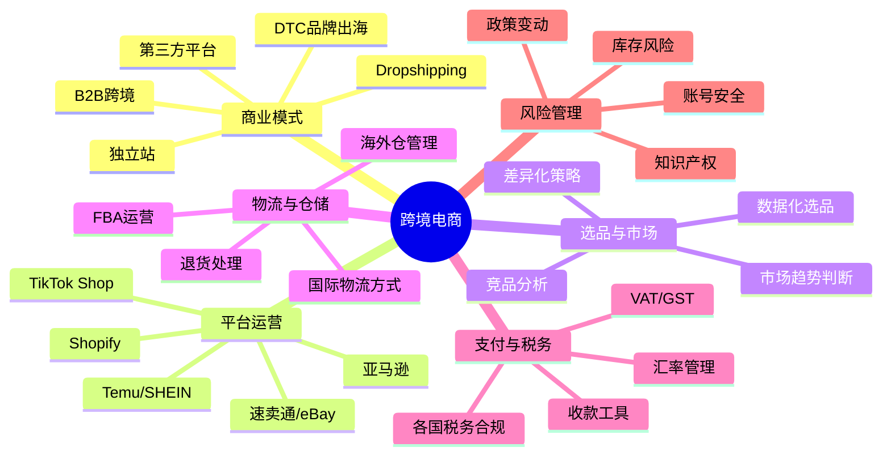
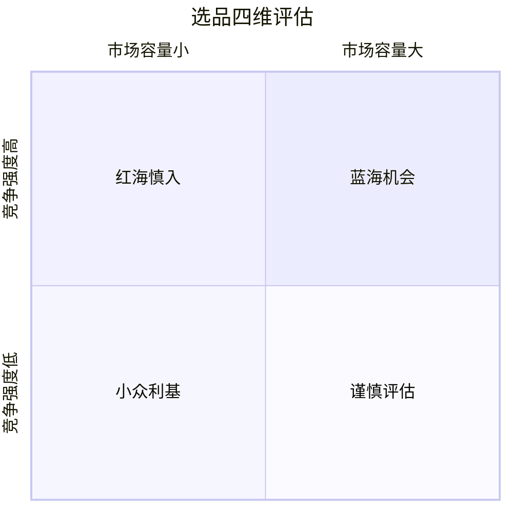
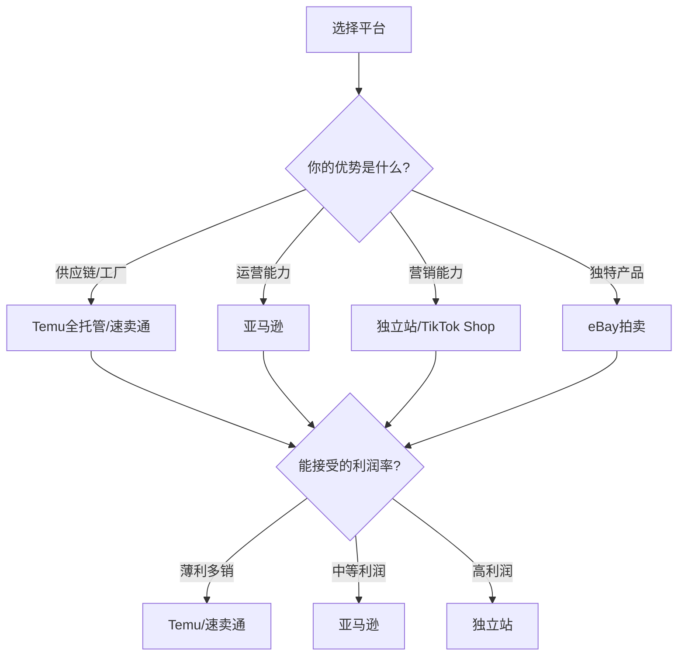

## 本节要点回顾

本节回顾"跨境电商进阶·理论基础"部分的核心知识框架。从商业模式选择到平台运营，从物流支付到数据驱动决策，从风险防控到全局战略，帮助你建立完整的跨境电商认知体系。

---

### 一、跨境电商知识全景图

跨境电商不是"把商品卖到海外"这么简单。它是一个由**六大支柱**支撑的复杂系统：



---

### 二、各章核心要点提炼

#### 2.1 商业模式解析（第一章）

**核心认知：** 跨境电商与国内电商的本质差异在于"跨国链路摩擦成本"——物流、支付、税务、合规、语言、文化六个维度的系统性挑战。

**六大模式速览：**

| 模式 | 启动资金 | 技术门槛 | 利润空间 | 风险等级 | 适合人群 |
|------|----------|----------|----------|----------|----------|
| 第三方平台（亚马逊等） | 中等 | 低 | 中等 | 中高 | 新手首选 |
| 独立站（Shopify等） | 中低 | 中高 | 高 | 高 | 有营销能力者 |
| DTC品牌出海 | 高 | 中 | 最高 | 高 | 有供应链优势者 |
| Dropshipping | 最低 | 低 | 低 | 中 | 试水者 |
| 分销/批发 | 中 | 低 | 中低 | 低 | 有渠道资源者 |
| B2B跨境 | 高 | 低 | 中高 | 中 | 工厂/贸易商 |

**关键决策点：** 选择模式时，评估三个维度——你的启动资金、你的核心能力（运营/营销/供应链）、你能承受的风险等级。

#### 2.2 亚马逊平台深度解析（第二章）

**核心认知：** 亚马逊是全球最大的电商平台，2024年净销售额超6000亿美元，Prime会员超2亿。但"大"不代表"容易"——竞争激烈、规则严格、封号风险始终存在。

**运营关键指标：**

| 指标 | 健康值 | 优秀值 | 危险信号 |
|------|--------|--------|----------|
| ACoS（广告销售成本比） | 15%-25% | <15% | >35% |
| 转化率（CVR） | 8%-15% | >15% | <5% |
| 库存周转天数 | 30-60天 | <30天 | >90天 |
| 退货率 | 2%-5% | <2% | >8% |
| Buy Box占比 | >70% | >90% | <50% |

**盈利模型拆解（以$29.99家居产品为例）：**

```text
售价：$29.99
产品成本：-$5.00
头程物流：-$2.00
FBA费用：-$5.50
平台佣金（15%）：-$4.50
广告费（ACoS 20%）：-$6.00
退货损失（3%）：-$0.90
净利润：$6.09（利润率约20%）
```

#### 2.3 Shopify独立站生态（第三章）

**核心认知：** 独立站的本质是"自建流量池+品牌资产沉淀"。没有平台的流量红利，但拥有完全的控制权和更高的利润率。

**独立站 vs 平台的核心差异：**

| 维度 | 平台（如亚马逊） | 独立站（如Shopify） |
|------|------------------|---------------------|
| 流量来源 | 平台分配，被动等待 | 自主获取，主动出击 |
| 用户数据 | 平台拥有，有限访问 | 完全私有，深度利用 |
| 品牌建设 | 受平台限制，空间小 | 完全自主，空间大 |
| 利润率 | 受佣金挤压（8%-20%） | 可达20%-40% |
| 启动难度 | 低，规则清晰 | 中高，需要营销能力 |
| 风险 | 平台政策变动 | 流量获取失败 |

**独立站成功三要素：** 产品力（差异化产品）× 流量力（精准获客能力）× 转化力（页面优化+信任建设）。

#### 2.4 选品策略与市场分析（第四章）

**核心认知：** 选品是跨境电商成败的第一道关。好产品自带流量，差产品烧再多广告也救不回来。

**选品四维评估模型：**



**选品数据指标：**

| 指标 | 理想范围 | 数据来源 |
|------|----------|----------|
| 月搜索量 | >5,000次 | Helium 10 / Jungle Scout |
| 竞争度 | <200个竞品 | 亚马逊搜索结果 |
| 平均售价 | $15-$75 | 亚马逊前台 |
| 评论数（首页） | <500条 | 亚马逊前台 |
| 毛利率 | >40% | 利润计算器 |
| 重量 | <2磅 | 供应商报价 |

**选品禁区：** 电子产品（认证复杂、退货率高）、食品（保质期、FDA认证）、液体/粉末（物流限制）、侵权风险产品（品牌、专利、版权）。

#### 2.5 国际物流与海外仓（第五章）

**核心认知：** 物流是跨境电商的"血管"，直接决定客户体验和利润空间。选择合适的物流方式，是运营能力的核心体现。

**物流方式决策矩阵：**

| 产品特征 | 推荐物流 | 时效 | 成本占比 |
|----------|----------|------|----------|
| 高价值+紧急 | 国际快递（DHL/UPS/FedEx） | 3-7天 | 15%-25% |
| 中等价值 | 空运专线 | 7-15天 | 10%-18% |
| 大批量+低价值 | 海运专线 | 30-45天 | 3%-8% |
| 欧洲市场 | 铁路运输 | 20-30天 | 6%-12% |
| 小件低价值 | 邮政小包 | 15-30天 | 5%-10% |

**海外仓运营要点：**
- 库存管理：合理控制库存水平，避免滞销（滞销库存仓储费是正常库存的3-5倍）
- 补货策略：补货量 =（日均销量 × 补货周期）+ 安全库存 - 当前库存 - 在途库存
- 成本核算：综合计算仓储费（$0.75-$2.40/立方英尺/月）、操作费、配送费

#### 2.6 支付与税务（第六章）

**核心认知：** 支付和税务是跨境电商最容易被忽视、但一旦出问题损失最大的环节。合规不是成本，是生存的底线。

**主流收款工具对比：**

| 工具 | 费率 | 结算周期 | 支持平台 | 特点 |
|------|------|----------|----------|------|
| Payoneer（派安盈） | 1%-2% | T+2 | 亚马逊/eBay/速卖通 | 老牌稳定 |
| World First（万里汇） | 0.3%-1% | T+1 | 亚马逊/eBay | 费率低 |
| PingPong | 1%封顶 | T+1 | 亚马逊/独立站 | 中国本土 |
| 连连支付 | 0.7%-1% | T+1 | 多平台 | 支持多币种 |

**税务合规要点：**
- 欧洲VAT：年销售额超过阈值必须注册，税率17%-27%不等
- 美国销售税：各州税率不同，使用TaxJar等工具自动计算
- 日本消费税：10%，JCT注册要求

#### 2.7 主流平台深度对比（第七章）

**平台选择决策框架：**



**各平台关键数据：**

| 平台 | 佣金 | 月租 | 回款周期 | 适合客单价 |
|------|------|------|----------|------------|
| 亚马逊 | 8%-15% | $39.99 | 14天 | $15-$100 |
| Shopify | 0%-2% | $29-$299 | 即时 | $20-$200 |
| 速卖通 | 5%-8% | $500-$10000/年 | 15天 | $5-$50 |
| eBay | 12.9% | 免费 | 3-5天 | $10-$200 |
| Temu | 平台定价 | 免费 | 月结 | $1-$30 |
| TikTok Shop | 2%-8% | 免费 | 7-15天 | $10-$80 |

#### 2.8 数据化运营体系（第八章）

**核心认知：** 跨境电商的竞争，归根结底是数据能力的竞争。不看数据的运营是盲人摸象，看错数据的运营是南辕北辙。

**每日必看数据清单：**

| 时间维度 | 关注指标 | 异常阈值 |
|----------|----------|----------|
| 每日 | 销量、广告花费、库存状态 | 销量下降>20%、广告超预算 |
| 每周 | 广告ACoS、关键词排名、竞品价格 | ACoS>30%、排名下降>10位 |
| 每月 | 毛利率、库存周转、退货率 | 毛利率<15%、库存>90天 |
| 每季度 | 品类趋势、产品线ROI、市场份额 | ROI<1.5、份额持续下降 |

**必备数据工具：**
- Helium 10（$29-$229/月）：关键词研究、竞品分析、Listing优化
- Jungle Scout（$29-$84/月）：选品分析、销量预估
- Keepa（€19/月）：价格历史追踪、库存监控
- Sellerboard（$15.99/月起）：利润分析、PPC优化

#### 2.9 风险管理（第九章）

**核心认知：** 跨境电商的风险不是"会不会发生"的问题，而是"什么时候发生、损失多大"的问题。风险管理的目标不是消除风险，而是让风险可控。

**风险矩阵：**

| 风险类型 | 发生概率 | 影响程度 | 应对策略 |
|----------|----------|----------|----------|
| 账号被封 | 中 | 极高 | 合规运营、多账号布局 |
| 库存滞销 | 高 | 高 | 数据选品、小批量测试 |
| 知识产权侵权 | 中 | 极高 | 侵权排查、商标注册 |
| 汇率波动 | 高 | 中 | 多币种对冲、及时结汇 |
| 供应商断货 | 中 | 高 | 多供应商、安全库存 |
| 政策变动 | 低 | 高 | 多平台布局、关注政策 |

**风控三原则：**
1. **不要把鸡蛋放在一个篮子里**：多平台、多市场、多产品线
2. **永远保留6个月的现金流**：应对突发情况的底气
3. **合规是底线，不是成本**：一次封号的损失远超合规投入

---

### 三、理论基础核心公式与模型

#### 3.1 利润计算公式

```text
净利润 = 售价 - 产品成本 - 头程物流 - 平台费用 - 广告费 - 仓储费 - 退货损失 - 其他费用

利润率 = 净利润 / 售价 × 100%

保本售价 = 总成本 / (1 - 目标利润率)
```

#### 3.2 广告优化决策树

```text
如果 ACoS > 30%:
    如果 转化率 < 10%:
        → 优化Listing（图片、标题、A+页面）
        → 检查价格竞争力
    如果 转化率 >= 10%:
        → 降低出价
        → 否定低效关键词
        → 优化关键词匹配类型

如果 ACoS 在 15%-30%:
    → 保持现有策略
    → 测试新关键词
    → 优化广告结构

如果 ACoS < 15%:
    → 增加预算
    → 拓展关键词
    → 提高出价抢占更好位置
```

#### 3.3 库存补货模型

```text
补货量 = (日均销量 × 补货周期天数) + 安全库存 - 当前库存 - 在途库存

其中：
- 补货周期天数 = 生产时间 + 头程物流时间 + 入仓时间
- 安全库存 = 日均销量 × 安全天数（通常7-14天）

示例：
- 日均销量 = 30件
- 生产时间 = 15天
- 头程物流时间 = 30天（海运）
- 入仓时间 = 5天
- 安全天数 = 10天
- 补货量 = 30 × 50 + 30 × 10 - 当前库存 - 在途库存
         = 1500 + 300 - 当前库存 - 在途库存
```

#### 3.4 ROI评估模型

```text
ROI = 净利润 / 总投入 × 100%

总投入 = 首批采购成本 + 头程物流 + 平台月租 + 广告启动资金 + 样品/拍照费用

健康ROI标准：
- 新品期（前3个月）：ROI > 1.0（保本即可）
- 成长期（3-6个月）：ROI > 1.5
- 稳定期（6个月+）：ROI > 2.0
```

---

### 四、新手常见误区与纠正

#### 4.1 认知误区

| 误区 | 真相 | 纠正方法 |
|------|------|----------|
| "跨境电商就是国内电商的海外版" | 跨国链路摩擦成本完全不同 | 先学习跨境特有的物流、支付、税务知识 |
| "选品靠感觉，爆款靠运气" | 数据驱动选品，成功率提升3-5倍 | 学习使用Helium 10等选品工具 |
| "只要产品好，自然会卖出去" | 流量获取和转化优化同样重要 | 学习广告投放和Listing优化 |
| "价格越低越好卖" | 低价竞争是死路，差异化才是出路 | 找到产品的独特卖点（USP） |
| "先做起来再说，细节后面补" | 前期的合规和选品决定生死 | 做好充分准备再启动 |

#### 4.2 运营误区

| 误区 | 损失 | 正确做法 |
|------|------|----------|
| 盲目铺货，不看数据 | 库存积压，资金链断裂 | 数据选品，小批量测试 |
| 广告不设预算上限 | 广告费失控，利润被吞噬 | 设置每日预算上限，定期优化 |
| 忽视知识产权排查 | Listing被下架，账号被封 | 上架前必做侵权排查 |
| 不做竞品分析 | 价格/功能/卖点全面落后 | 每周分析Top10竞品动态 |
| 只关注销量，不关注利润 | 卖得越多亏得越多 | 用Sellerboard等工具跟踪真实利润 |

#### 4.3 资金误区

| 误区 | 风险 | 建议资金规划 |
|------|------|--------------|
| "几万块就能做亚马逊" | 资金链断裂，项目夭折 | 首批备货+广告+运营，至少准备15-20万 |
| "先把钱投进去，赚了再补" | 无应急资金，一击即溃 | 保留6个月运营资金作为安全垫 |
| "利润率高就使劲投" | 忽视现金流，周转困难 | 关注现金流，而非账面利润 |

---

### 五、从理论到实践的行动清单

#### 5.1 启动前准备（第1-2周）

- [ ] 确定商业模式（平台/独立站/DTC）
- [ ] 选择目标市场（美国/欧洲/东南亚）
- [ ] 完成市场调研（品类规模、竞争格局、价格区间）
- [ ] 注册公司主体（营业执照、对公账户）
- [ ] 准备启动资金（至少15-20万）

#### 5.2 平台搭建（第3-4周）

- [ ] 注册平台账号（亚马逊/eBay/Shopify）
- [ ] 完成品牌注册（商标申请、品牌备案）
- [ ] 配置收款工具（Payoneer/WorldFirst）
- [ ] 学习平台规则（避免踩坑）

#### 5.3 产品上架（第5-6周）

- [ ] 完成选品（至少3-5个SKU）
- [ ] 联系供应商（至少3家比价）
- [ ] 样品确认（质量、包装、标签）
- [ ] Listing制作（标题、图片、A+页面、关键词）
- [ ] 首批备货（小批量测试，50-200件/SKU）

#### 5.4 运营优化（第7-12周）

- [ ] 启动广告（自动广告+手动广告组合）
- [ ] 监控数据（每日销量、ACoS、转化率）
- [ ] 优化Listing（根据数据调整关键词、图片、价格）
- [ ] 处理售后（退货、差评、客户咨询）
- [ ] 补货计划（根据销售速度制定）

#### 5.5 规模扩张（第13周+）

- [ ] 扩展产品线（增加SKU）
- [ ] 拓展市场（增加站点/平台）
- [ ] 优化供应链（谈判账期、降低采购成本）
- [ ] 团队搭建（客服、运营、美工）

---

### 六、本节知识自测

**基础层（必须掌握）：**
1. 跨境电商与国内电商的六大核心差异是什么？
2. 六种主流商业模式的优劣势分别是什么？
3. 亚马逊FBA的费用结构包含哪些部分？
4. 选品的四维评估模型是什么？
5. 五种国际物流方式的时效和成本对比？

**进阶层（应该掌握）：**
6. 如何计算一个产品的真实利润率？
7. ACoS超过30%时，应该从哪些维度优化？
8. 库存补货量的计算公式是什么？
9. 欧洲VAT的注册阈值和税率范围？
10. 账号被封的常见原因和预防措施？

**高手层（深度理解）：**
11. 如何构建多平台、多市场的风险对冲体系？
12. 数据驱动的选品流程包含哪些步骤？
13. 独立站的流量获取有哪些核心渠道？
14. 如何从0到1建立一个跨境电商品牌？
15. 跨境电商的长期竞争力来自哪里？

---

### 七、本节要点总结


**一句话总结：** 跨境电商的理论基础，本质上是在回答三个问题——**卖什么**（选品）、**在哪卖**（平台）、**怎么卖**（运营）。搞懂这三个问题，你就具备了跨境电商的底层认知。接下来的实操部分，将带你把这些理论转化为真正的利润。

***

> **学习建议：** 理论学习的目的不是记住所有细节，而是建立**认知框架**。当你在实操中遇到问题时，能快速定位到对应的理论模块，找到解决方案。建议收藏本节要点回顾，在后续学习中随时回查。
