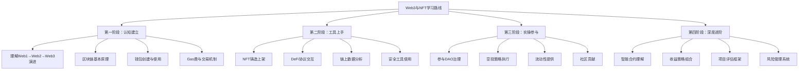

# 第27章 Web3与NFT

## 章节概述

Web3不是某个单一技术，而是互联网权力结构的一次根本性重构。理解Web3，需要先看清互联网的三次范式转移：

| 阶段 | 核心特征 | 数据归属 | 典型代表 | 用户角色 |
|------|----------|----------|----------|----------|
| Web1（1990-2004） | 只读，静态页面 | 网站所有者 | 雅虎、新浪、个人主页 | 信息消费者 |
| Web2（2004-2020） | 读写交互，平台经济 | 平台公司 | 微信、抖音、Facebook | 内容生产者，但数据被平台垄断 |
| Web3（2020-） | 读写拥有，去中心化 | 用户自己 | 以太坊、Solana、Uniswap | 数据主权者、生态共建者 |

Web2的核心矛盾在于：用户创造了全部价值（内容、数据、注意力），但平台拿走了绝大部分收益。抖音创作者贡献了内容，但广告收入归字节跳动；Uber司机贡献了运力，但定价权归平台。Web3的底层逻辑是用区块链（不可篡改的分布式账本）+ 智能合约（自动执行的链上程序）+ 代币经济（价值分配机制）来重新定义"谁创造价值、谁拥有价值、谁分配价值"。

NFT（Non-Fungible Token，非同质化代币）、DAO（去中心化自治组织）、DeFi（去中心化金融）并非孤立概念，而是Web3经济体系的三大支柱：NFT解决数字所有权问题，DAO解决组织治理问题，DeFi解决价值流通问题。本章将从原理到实操，系统讲解Web3生态的核心概念、参与方式和变现机会。

***

## 核心知识点

### 1. NFT创作与铸造

**NFT的本质**：NFT是一种存储在区块链上的数字凭证，它记录了"谁拥有什么"以及"这个东西的完整流转历史"。与比特币（1个BTC=1个BTC，可以互换）不同，每个NFT都是独一无二的，就像房产证——每套房对应一本证，不能互换。

**NFT的价值逻辑**分三层理解：
- **底层**：区块链提供的不可伪造的所有权证明。任何人无法篡改链上记录，这解决了数字世界长期存在的"复制无成本导致所有权无法确认"问题。
- **中层**：创作者经济的新基础设施。艺术家可以直接面向全球买家出售作品，无需画廊、出版社等中间商抽成（传统艺术市场佣金通常30%-50%）。
- **表层**：社区身份认同与社交资本。持有Bored Ape不仅是持有一张图片，更是进入一个精英社交圈的门票。

**创作方法与工具**：

| 类型 | 工具 | 适用场景 | 学习成本 |
|------|------|----------|----------|
| 生成艺术 | Art Blocks、fxhash | 算法生成的系列作品 | 需要编程基础 |
| 数字绘画 | Procreate、Photoshop | 手绘风格作品 | 较低 |
| 3D建模 | Blender、Cinema 4D | 立体作品和虚拟世界资产 | 中等 |
| AI辅助 | Midjourney、Stable Diffusion | 快速生成概念稿 | 低 |
| 音乐NFT | Sound.xyz、Catalog | 音乐作品上链 | 中等 |
| 程序化生成 | p5.js、Processing | 链上生成艺术（On-chain Art） | 需要编程基础 |

**铸造流程详解**（以以太坊为例）：
1. **准备钱包**：安装MetaMask，创建或导入钱包地址
2. **获取ETH**：通过交易所购买ETH并转入钱包（用于支付Gas费）
3. **选择平台**：OpenSea（最大综合市场）、Blur（专业交易者）、Foundation（策展型）
4. **上传作品**：将图片/视频/音频上传，填写名称、描述、属性
5. **设置参数**：版税比例（通常5%-10%）、铸造数量、定价方式
6. **签名确认**：在钱包中确认交易并支付Gas费
7. **等待上链**：交易被区块链确认后，NFT正式存在

**不同链的选择**直接影响成本和用户群体：

| 链 | Gas费 | 速度 | 用户规模 | 适合场景 |
|----|-------|------|----------|----------|
| Ethereum | 高（$5-$50+） | 慢（15秒） | 最大 | 高价值艺术品、蓝筹项目 |
| Polygon | 极低（<$0.01） | 快（2秒） | 大 | 入门练习、游戏道具 |
| Solana | 低（<$0.01） | 极快（0.4秒） | 中等 | 高频交易、PFP项目 |
| Base | 低（<$0.01） | 快 | 增长中 | Coinbase生态项目 |
| Bitcoin Ordinals | 高 | 慢 | 小众 | 铭文、比特币原生NFT |

### 2. DAO参与

**DAO（Decentralized Autonomous Organization）** 是一种通过智能合约规则运行的组织形式，所有决策由成员投票而非管理层拍板。可以理解为"代码即法律"的公司——公司章程写在区块链上，资金由智能合约管理，任何人都无法私自挪用。

**DAO的核心机制**：
- **治理代币**：持有代币即拥有投票权，通常1个代币=1票
- **提案系统**：任何成员可以提交提案（如资金使用、产品方向）
- **投票周期**：提案进入投票期（通常3-7天），达到法定人数即通过
- **自动执行**：通过的提案由智能合约自动执行，无需人工干预

**DAO的类型与参与方式**：

| DAO类型 | 代表项目 | 参与方式 | 潜在收益 |
|---------|----------|----------|----------|
| 协议治理 | Uniswap、Aave | 持有治理代币投票 | 代币增值 |
| 投资DAO | The LAO、MetaCartel | 出资加入，集体投资 | 投资回报分红 |
| 创作者DAO | FWB、BanklessDAO | 购买会员NFT或代币 | 社区资源、协作机会 |
| 收藏DAO | PleasrDAO | 集资购买高价值NFT | 藏品增值 |
| 赠款DAO | Gitcoin DAO | 贡献开发/设计能力 | 赠款资助 |

**选择DAO的关键指标**：成员活跃度（Discord在线人数）、金库规模（Treasury余额）、提案通过率（反映治理效率）、代币分布（避免过于集中导致寡头控制）。

### 3. Web3项目参与

**识别优质Web3项目的核心框架**：
- **团队背景**：创始人是否有可验证的链上身份（非匿名更可信）、过往项目记录
- **技术审计**：智能合约是否经过知名审计机构（Trail of Bits、OpenZeppelin）审计
- **代币经济学**：代币分配是否合理（团队占比不应超过20%）、解锁时间表
- **社区质量**：Discord/Telegram讨论质量（水军vs真实用户）、GitHub提交频率

**空投（Airdrop）获取策略**：空投是Web3项目向早期用户免费分发代币的行为，本质是项目方的用户增长成本。历史上著名的空投包括：Uniswap空投（2020年，每个地址400 UNI，当时价值约$1,200，最高涨至$16,000+）、ENS空投（2021年）、Arbitrum空投（2023年）。

**系统性获取空投的方法**：
1. **主网交互**：在目标链上实际使用协议（交易、借贷、质押），而非只做钱包创建
2. **跨链桥使用**：使用官方跨链桥转移资产，这通常是空投权重最高的行为
3. **治理参与**：在Snapshot上对提案投票，证明你不是"空投猎人"而是真实用户
4. **测试网贡献**：参与新项目的测试网，报告Bug，提供反馈
5. **Gitcoin捐赠**：向公共物品捐赠（Quadratic Funding机制放大小额捐赠的影响）

**重要风险提示**：空投不是免费午餐。需要投入时间成本和Gas费，且很多项目最终不会发币或代币价值归零。绝不要为了"撸空投"而向不明合约授权大额资产。

### 4. 链上收益

**DeFi收益的四种主要来源**：

**Staking（质押）**：将代币锁定在区块链网络中参与验证，获取区块奖励。以太坊2.0的质押年化约3%-5%，风险最低（协议层面的安全性），适合长期持有者。

**流动性提供（LP）**：向去中心化交易所（如Uniswap）的资金池存入两种代币，赚取交易手续费分成。年化收益通常10%-50%，但面临"无常损失"风险——当两种代币价格比例变化时，你的资产价值可能低于直接持有。

**Yield Farming（收益耕作）**：将LP凭证再投入其他协议获取额外奖励，形成"收益叠加"。这需要主动管理，因为不同协议的收益率随时变化。

**借贷协议**：在Aave、Compound等平台存入资产获取利息，利率由供需决定。存入稳定币（USDC、DAI）的年化通常2%-8%，风险较低。

| 收益方式 | 预期年化 | 风险等级 | 操作复杂度 | 适合人群 |
|----------|----------|----------|------------|----------|
| ETH Staking | 3%-5% | 低 | 低 | 长期持有者 |
| 稳定币借贷 | 2%-8% | 低 | 低 | 保守型 |
| 流动性提供 | 10%-50% | 中 | 中 | 有经验用户 |
| Yield Farming | 50%-500%+ | 高 | 高 | 专业用户 |
| 杠杆挖矿 | 不确定 | 极高 | 极高 | 不推荐新手 |

**关键原则**：收益与风险永远正相关。年化超过100%的"稳定"收益基本不存在——要么是短期补贴（不可持续），要么隐含你没看到的风险。

### 5. 安全与工具

**钱包安全是Web3的第一课**，一旦资产被盗，没有任何"客服"能帮你追回。

**必须遵守的安全规则**：
- **助记词（Seed Phrase）**：12或24个英文单词，是钱包的最高权限。手写在纸上存放在物理安全位置，绝不拍照、不存云盘、不发给任何人
- **硬件钱包**：持有超过$1,000的资产必须使用硬件钱包（Ledger、Trezor），私钥永远不触网
- **授权管理**：定期使用revoke.cash检查并撤销不必要的合约授权
- **钓鱼防范**：不在非官方网站连接钱包，不点击陌生链接，不扫描不明二维码

**链上分析工具**：
- **Etherscan**：查询任何地址的交易记录、代币余额、合约代码
- **Dune Analytics**：自定义SQL查询链上数据，生成可视化Dashboard
- **Nansen**：追踪"聪明钱"（Smart Money）的链上行为
- **DeFiLlama**：查看各协议的TVL（锁仓量），判断项目规模和健康度
- **Arkham**：地址标签化，追踪资金流向

**智能合约审计**是判断项目安全性的关键指标。未审计的合约就像未经检查的电梯——可能运行良好，但你不知道它什么时候会出故障。使用任何DeFi协议前，先在项目文档中确认审计报告是否公开。

***

## 学习目标

完成本章学习后，你将能够：

1. **理解Web3生态的核心概念和运作机制**——不仅知道"是什么"，更能解释"为什么"和"怎么运作"
2. **独立完成NFT创作、铸造和上架交易的完整流程**——从作品创作到在OpenSea上架
3. **识别并评估DAO和Web3项目的质量**——用结构化框架做判断，而非跟风
4. **掌握DeFi收益策略并理解其风险**——知道每种收益来源的底层逻辑和最坏情况
5. **建立完整的钱包安全体系**——从助记词管理到授权审计，形成安全习惯
6. **制定个人Web3参与路线图**——根据自身情况选择合适的切入点和参与深度

***

## 适合人群

| 人群 | 预期收益 | 建议起点 |
|------|----------|----------|
| 区块链零基础但有兴趣 | 建立完整认知框架，避免被割韭菜 | 从理论基础开始，先理解区块链原理 |
| 创作者（设计师/音乐人/写作者） | 学会将作品上链变现 | 重点学习NFT铸造和创作者工具 |
| 开发者 | 理解智能合约和DApp开发逻辑 | 关注安全和工具部分 |
| 投资者/理财用户 | 掌握DeFi收益策略和风险评估 | 重点学习链上收益和风险管理 |
| 前沿科技关注者 | 跟踪行业趋势，建立信息优势 | 全章通读，建立系统认知 |

**前置知识**：无需编程基础，但需要基本的互联网使用能力。如果完全不了解区块链，建议先阅读本章"理论基础"小节。

***

## 学习路线图

***

## 本章结构

| 小节 | 内容 | 预计学习时间 |
|------|------|-------------|
| 01-理论基础 | Web3概念演进、区块链原理、共识机制、代币经济学、生态全景图 | 2小时 |
| 02-核心技巧 | NFT铸造全流程、DeFi协议操作、钱包安全配置、链上分析入门 | 3小时 |
| 03-实战案例 | 成功NFT项目分析、DAO治理参与案例、空投获取复盘、DeFi收益实例 | 2小时 |
| 04-常见误区 | "NFT就是图片""DeFi稳赚不赔""空投=免费钱"等新手常见认知错误与纠正 | 1小时 |
| 05-练习方法 | 从Polygon测试网开始的分级实操练习，包含具体步骤和验证标准 | 2小时 |
| 06-本章小结 | 核心知识回顾、个人Web3路线图制定、推荐学习资源清单 | 0.5小时 |

**总预计学习时间：10.5小时**（建议分3-4天完成，每天3小时，留出实操练习时间）

***
