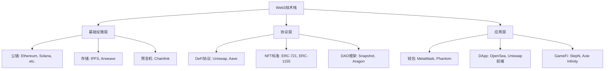
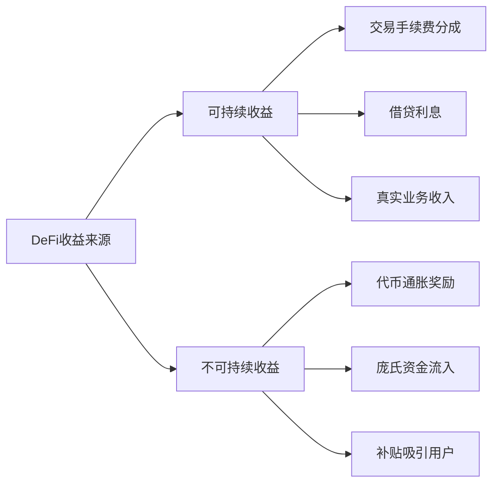
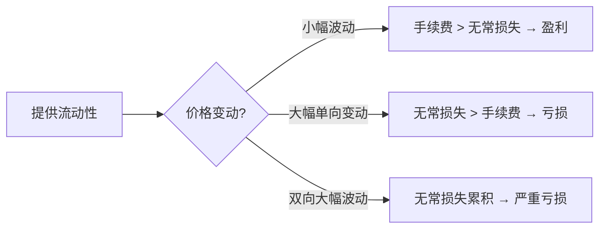
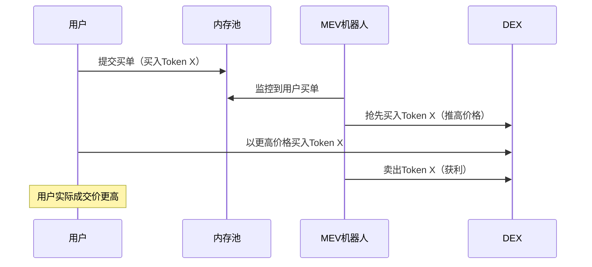
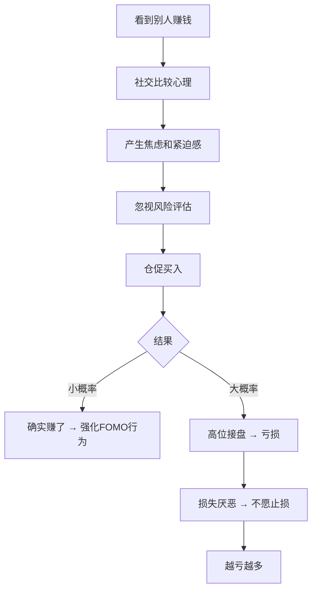
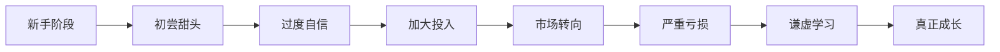
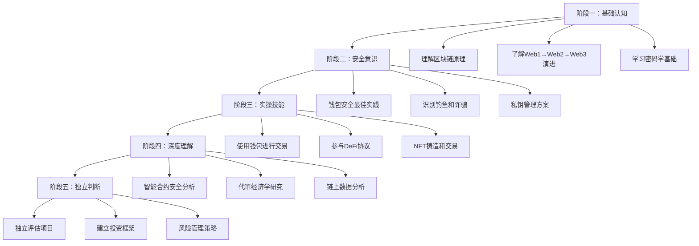

# 常见误区：Web3与NFT全方位避坑指南

Web3领域充满机遇，但也遍布陷阱。据Chainalysis统计，仅2023年一年，加密货币诈骗造成的损失就超过56亿美元，其中大量受害者是初入Web3的新手。本章系统梳理Web3与NFT领域最常见的认知、操作、技术、心态误区，通过真实案例、数据分析和纠正方法，帮助你在探索Web3的过程中少走弯路、少交学费。

每个误区的结构统一为：**错误认知 → 底层真相 → 真实案例 → 正确做法**。建议通读全文后，重点标记与自己当前阶段相关的误区，在实际操作前反复对照。

---

## 一、认知误区：对Web3的根本性理解偏差

认知误区是最危险的误区类型——如果你对Web3的基本认知就是错的，后面所有决策都会偏离正确方向。

### 误区1：NFT就是图片，右键保存就等于拥有

**错误认知：** NFT只是一张JPG图片，任何人都可以右键保存，所以没有价值。

**底层真相：**

NFT（Non-Fungible Token，非同质化代币）的本质是**区块链上的所有权证明**，而非图片本身。图片文件存储在IPFS或Arweave等去中心化存储网络上，NFT代币记录的是"谁拥有这个数字资产的所有权"。

类比现实世界：你可以在网上找到《蒙娜丽莎》的高清照片，甚至打印一幅挂在墙上，但这不意味着你拥有了达芬奇的原作。NFT的价值来源于以下几个维度：

| 价值维度 | 说明 | 示例 |
|----------|------|------|
| **所有权证明** | 链上不可篡改的所有权记录 | CryptoPunks #7804以4200 ETH成交 |
| **稀缺性** | 通过智能合约限制供应量 | BAYC总量固定10,000只 |
| **社区身份** | 持有NFT即获得社区成员资格 | BAYC持有者可参加ApeFest线下活动 |
| **实用权益** | NFT绑定的现实世界权益 | 无聊猿持有者可获得商业使用权 |
| **互操作性** | NFT可在多个平台和游戏中使用 | Decentraland中的虚拟土地NFT |

**真实案例：** 2022年，数字艺术家Pak的NFT作品《The Merge》以9180万美元成交，成为在世艺术家作品拍卖价格纪录之一。这件作品的价值不在于"一张图片"，而在于其创新的分代币机制和艺术史地位。

**正确做法：**
- 理解NFT的价值由市场供需、社区共识、实用功能共同决定
- 区分"投机性NFT"和"实用性NFT"，前者风险极高，后者价值更可持续
- 关注NFT背后的技术标准（ERC-721、ERC-1155）和元数据存储方式
- 不要因为"右键保存"的梗而否定整个NFT技术范式

### 误区2：Web3全是骗局，没有任何实际价值

**错误认知：** Web3就是割韭菜，区块链技术没有实际用途，整个行业都是泡沫。

**底层真相：**

Web3确实存在大量骗局和投机行为，但将整个技术范式等同于骗局是严重的认知偏差。Web3的核心技术创新包括：

- **去中心化金融（DeFi）**：无需银行中介的借贷、交易、保险服务，TVL（总锁定价值）在2021年峰值超过1800亿美元
- **去中心化自治组织（DAO）**：用智能合约实现组织治理，如MakerDAO管理着数十亿美元的稳定币系统
- **数字身份（DID）**：用户掌控自己的身份数据，不再依赖中心化平台
- **供应链溯源**：沃尔玛使用区块链追踪食品供应链，将追溯时间从7天缩短到2.2秒



**真实案例：** 2023年，汇丰银行在以太坊上发行了数字债券；摩根大通的Onyx平台处理了超过7000亿美元的区块链交易。传统金融机构的参与证明了Web3底层技术的实际价值。

**正确做法：**
- 区分"技术本身"和"基于技术的投机行为"——前者有价值，后者可能有问题
- 学习区块链的底层原理（共识机制、智能合约、密码学），建立独立判断能力
- 关注有实际收入和用户的产品，而非仅靠代币价格涨跌判断项目好坏
- 保持批判性思维，不盲目信仰，也不全盘否定

### 误区3：参与Web3就能暴富

**错误认知：** 早期参与Web3项目就能像比特币早期持有者一样获得百倍回报。

**底层真相：**

这是典型的**幸存者偏差**。你看到的是少数暴富故事，看不到的是大量亏损案例。

根据Chainalysis 2022年报告：
- 参与NFT交易的用户中，约75%的买家在转售时是亏损的
- 2022年加密货币市场总市值从峰值3万亿美元跌至约8000亿美元，跌幅超73%
- Terra/LUNA崩盘事件中，约400亿美元市值在几天内蒸发

Web3领域的风险远高于传统金融市场，因为：
1. **市场极度波动**：单日涨跌20%是常态
2. **监管不确定性**：各国政策随时可能变化
3. **技术风险**：智能合约漏洞、桥接攻击频发
4. **信息不对称**：项目方掌握远多于散户的信息

**正确做法：**
- 将Web3定位为"学习和探索"而非"快速致富"的途径
- 只投入你能承受全部亏损的资金（建议不超过总资产的5-10%）
- 系统学习投资知识：技术分析、基本面分析、链上数据分析
- 建立完整的风险管理框架（仓位管理、止损策略、分散配置）

### 误区4：Web3能完全取代Web2

**错误认知：** Web3将彻底颠覆互联网，所有Web2应用都会被去中心化替代。

**底层真相：**

Web3和Web2是**互补关系**而非**替代关系**。Web3在某些场景下有明显优势，但在很多场景下Web2仍然更合适：

| 维度 | Web2优势 | Web3优势 |
|------|----------|----------|
| **性能** | 高吞吐量、低延迟 | 适合低频高价值交易 |
| **用户体验** | 成熟易用 | 门槛较高，正在改善 |
| **数据主权** | 平台控制数据 | 用户控制数据 |
| **信任机制** | 依赖中心化平台 | 代码即法律 |
| **成本** | 用户免费使用 | Gas费可能很高 |
| **合规性** | 法律框架成熟 | 监管仍在发展 |

很多"Web3"应用实际上只是在Web2架构上叠加了代币经济模型，并没有真正利用去中心化的优势。真正有价值的Web3应用应该解决Web2无法解决的问题——比如无需许可的金融访问、抗审查的内容发布、可验证的数字所有权。

**正确做法：**
- 理解Web3的适用场景和局限性，不盲目追新
- 关注"Web2.5"混合架构——结合Web2的用户体验和Web3的信任机制
- 评估项目时，问自己："这个项目必须用区块链吗？中心化方案是否更高效？"

---

## 二、操作误区：实际操作中的常见错误

操作误区直接导致资金损失，是新手最容易踩的坑。

### 误区5：忽视钱包安全，私钥管理不当

**错误认知：** 钱包密码就是安全的全部，私钥随便存就行。

**底层真相：**

在Web3世界，**私钥就是一切**。与银行账户不同，没有"忘记密码"功能，没有客服可以帮你找回。

```text
私钥 → 助记词（12/24个单词）→ 可推导出所有地址
丢失私钥 → 资产永久丢失，无法找回
泄露私钥 → 资产立即被盗，无法追回
```

**真实案例：**
- **Mt.Gox事件（2014）**：当时最大的比特币交易所因安全漏洞丢失85万枚BTC，价值约4.5亿美元（按当时价格），最终破产
- **个人案例**：一位早期比特币持有者将包含7500枚BTC私钥的硬盘扔进垃圾填埋场，至今仍在尝试找回
- **2023年Ledger Connect Kit攻击**：硬件钱包Ledger的前端库被黑客篡改，导致使用该库的多个DApp被植入恶意代码，用户资产被盗

**正确做法——私钥安全管理矩阵：**

| 安全等级 | 存储方式 | 适用场景 | 风险等级 |
|----------|----------|----------|----------|
| **基础级** | 纸质助记词，存放在家中保险柜 | 小额资产，日常使用 | 中 |
| **进阶级** | 助记词分多处存放 + 硬件钱包 | 中等资产，长期持有 | 低 |
| **专业级** | 多签钱包 + 地理分布式备份 | 大额资产，机构级 | 极低 |
| **极端级** | 助记词分片存储（Shamir备份）+ 银行保险箱 | 超大额资产 | 极低 |

**具体操作步骤：**

1. **创建钱包后立即备份助记词**
   - 手写在纸上（不要截图、不要复制到剪贴板、不要存储在联网设备上）
   - 使用金属助记词板（如Cryptosteel、Billfodl）防火防水

2. **分散存储**
   - 至少两份备份，存放在不同的物理位置
   - 考虑使用Shamir秘密分享（SSS）将助记词拆分为多个分片

3. **日常操作安全**
   - 大额资产用硬件钱包（Ledger、Trezor），小额日常用手机钱包
   - 不连接可疑网站，不签署不明交易
   - 定期使用 [Revoke.cash](https://revoke.cash) 检查并撤销不必要的合约授权

4. **高级防护**
   - 使用多签钱包（Gnosis Safe）管理大额资金
   - 设置交易白名单，限制可交互的合约地址
   - 启用时间锁，大额交易需要等待确认期

### 误区6：盲目追求高收益，忽视风险

**错误认知：** 这个项目年化收益500%，肯定比银行存款好。

**底层真相：**

DeFi领域的高收益往往意味着高风险。收益来源必须搞清楚：



**收益与风险的对应关系：**

| 年化收益范围 | 风险等级 | 典型场景 | 是否可持续 |
|-------------|---------|----------|-----------|
| 1-5% | 低 | 稳定币借贷（Aave、Compound） | 是 |
| 5-20% | 中 | ETH质押、主流LP | 大部分是 |
| 20-100% | 高 | 小型协议流动性挖矿 | 不确定 |
| 100%+ | 极高 | 新项目代币奖励 | 通常不可持续 |

**真实案例：** 2022年5月，Terra生态的Anchor Protocol提供约20%的UST存款年化收益。大量用户被高收益吸引，将资金存入。当UST脱锚后，整个Terra生态系统崩溃，用户损失超过400亿美元。

**正确做法：**
- 永远问自己："收益从哪里来？"如果答案是"新用户的钱"，那就是庞氏骗局
- 使用DeFiLlama等工具查看协议的TVL变化趋势
- 分散投资：不把所有资金放在一个协议或一条链上
- 设置止损线：亏损达到预设阈值（如20%）时果断退出

### 误区7：不做研究就参与项目（FOMO式投资）

**错误认知：** 群里/推特上大家都在买的项目肯定没问题，跟着买就行。

**底层真相：**

Web3项目质量参差不齐，信息不对称极其严重。项目方、KOL、早期投资者的利益与普通散户并不一致。

**DYOR（Do Your Own Research）框架：**

```text
项目尽职调查清单：
├── 团队背景
│   ├── 团队成员是否实名公开？
│   ├── 是否有可验证的从业经历？
│   └── 是否有不良记录（跑路、Rug Pull）？
├── 技术审计
│   ├── 智能合约是否经过审计？
│   ├── 审计机构是否知名（Certik、Trail of Bits、OpenZeppelin）？
│   └── 审计报告中的问题是否已修复？
├── 代币经济学
│   ├── 代币分配比例（团队/投资者/社区）？
│   ├── 是否有解锁时间表（Vesting）？
│   └── 通胀率和总量上限？
├── 社区与治理
│   ├── 社区活跃度如何（Discord/Telegram人数与活跃比）？
│   ├── 治理是否去中心化？
│   └── 社区讨论质量如何？
├── 财务健康
│   ├── 协议收入来源是什么？
│   ├── TVL趋势如何？
│   └── 资金库余额和支出情况？
└── 竞品对比
    ├── 同赛道有哪些竞品？
    ├── 该项目的差异化优势是什么？
    └── 市场份额和增长趋势如何？
```

**实用工具推荐：**

| 工具 | 用途 | 网址 |
|------|------|------|
| **DeFiLlama** | TVL追踪、收益率对比 | defillama.com |
| **Dune Analytics** | 链上数据分析仪表板 | dune.com |
| **Token Terminal** | 协议收入、基本面数据 | tokenterminal.com |
| **Etherscan** | 合约验证、交易追踪 | etherscan.io |
| **Bubblemaps** | 代币持有分布可视化 | bubblemaps.io |
| **RugDoc** | DeFi项目风险评估 | rugdoc.io |

**正确做法：**
- 在投入任何资金之前，至少花2-4小时研究项目
- 使用上述框架逐项检查，不跳过任何步骤
- 不参与匿名团队的项目（除非有充分的技术审计和时间验证）
- 不因为"大家都在买"就跟风，市场共识可能是错的

---

## 三、NFT误区：数字资产的特殊陷阱

NFT有其独特的运作逻辑和风险模式，需要专门的认知框架。

### 误区8：盲目铸造NFT就能赚钱

**错误认知：** 只要铸造（Mint）NFT，挂到市场上就能卖出去赚钱。

**底层真相：**

OpenSea上累计铸造的NFT数量超过8000万个，但其中绝大多数交易量为零。NFT的价值不在于"铸造"这个动作，而在于其背后的内容价值、社区共识和稀缺性设计。

**NFT市场的真实数据（2023年）：**
- 日均活跃交易者不足1万人（2021年高峰期曾超过10万）
- 超过95%的NFT项目交易量归零
- 头部1%的项目占据了超过80%的总交易量

**NFT成功的必要条件：**

```text
成功NFT = 优质内容 × 社区运营 × 稀缺性设计 × 时机 × 营销
缺少任何一个因素，成功的概率都会大幅下降
```

**正确做法——NFT创作前的准备清单：**

1. **作品质量**：确保作品有独特风格和艺术价值，不是AI批量生成的同质化内容
2. **社区基础**：在铸造前建立至少500-1000人的核心社区（Twitter、Discord）
3. **稀缺性设计**：合理设置供应量和分层稀有度
4. **定价策略**：参考同赛道项目的铸造价格和二级市场表现
5. **长期规划**：有明确的路线图和持续的内容输出计划
6. **合规考量**：了解所在地的税务和法律要求

### 误区9：只关注地板价，忽视其他关键指标

**错误认知：** NFT项目好不好，看地板价涨跌就知道了。

**底层真相：**

地板价（Floor Price）只是NFT项目健康度的众多指标之一，单独看地板价会产生严重误判。

**完整的NFT项目评估指标体系：**

| 指标类别 | 具体指标 | 含义 | 健康信号 |
|----------|----------|------|----------|
| **流动性** | 24h交易量 | 市场活跃度 | 稳定或增长 |
| **持有分布** | 持有者数量/总供应量 | 去中心化程度 | >60%独立持有者 |
| **鲸鱼集中度** | 前10持有者占比 | 操控风险 | <20% |
| **真实需求** | 独立买家数量 | 真实购买需求 | 持续增长 |
| **社区活跃** | Discord/Twitter互动率 | 社区健康度 | 日均互动稳定 |
| **路线图交付** | 已完成里程碑占比 | 团队执行力 | >70%按时交付 |

**真实案例：** 某NFT项目地板价在一周内从0.5 ETH涨到5 ETH，看起来很"成功"。但通过链上分析发现，前3个地址持有超过40%的NFT，交易量主要由这几个地址互相刷单（Wash Trading）制造。当这些地址开始抛售后，地板价直接归零。

**正确做法：**
- 使用NFTGo、NFTX等工具查看完整的项目数据面板
- 重点关注持有者分布和独立买家数量
- 使用Bubblemaps查看代币/NFT的持有关系图，识别关联地址
- 结合地板价、交易量、持有者数量三个维度综合判断

### 误区10：忽视NFT的元数据和存储风险

**错误认知：** 铸造了NFT，图片就永久保存在区块链上了。

**底层真相：**

大多数NFT的**元数据（图片、描述等）并不存储在区块链上**，而是存储在IPFS或中心化服务器上。区块链上只存储一个指向元数据的链接（URI）。

```text
NFT存储架构：
├── 链上存储（永久、不可变）
│   ├── 代币ID
│   ├── 所有者地址
│   └── 元数据URI（指向图片的链接）
│
└── 链下存储（可能失效）
    ├── 中心化服务器 → 服务器关闭 = 图片消失
    ├── IPFS → 需要有人pin，否则会被垃圾回收
    └── Arweave → 永久存储（需一次性付费）
```

**真实案例：** 2022年多个NFT项目因为使用中心化服务器存储图片，当项目方放弃维护或服务器到期后，NFT变成了"空白图片"。持有者虽然在链上仍然拥有NFT代币，但代币指向的内容已经不存在了。

**正确做法：**
- 铸造前确认元数据存储方式：Arweave > IPFS（被pin）> IPFS（未pin）> 中心化服务器
- 查看NFT的元数据URI是否指向去中心化存储
- 对于自己铸造的NFT，优先使用Arweave或Filecoin进行永久存储
- 使用NFT.Storage（免费）将元数据上传到IPFS和Filecoin

---

## 四、DeFi误区：去中心化金融的风险盲区

DeFi是Web3最成熟的应用领域，但也暗藏最复杂的风险。

### 误区11：不了解无常损失（Impermanent Loss）

**错误认知：** 提供流动性（LP）就能赚取手续费，和存银行一样安全。

**底层真相：**

无常损失是AMM（自动做市商）机制的固有特性。当你向流动性池提供两种代币时，如果这两种代币的价格比率发生变化，你取回的资产价值会低于直接持有这两种代币的价值。

**无常损失计算示例：**

假设你提供 ETH/USDC 流动性，初始投入1 ETH（$2000）+ 2000 USDC：

| ETH价格变动 | 直接持有价值 | LP价值 | 无常损失 |
|------------|-------------|--------|---------|
| 1.25x ($2500) | $4500 | $4472 | -0.6% |
| 1.5x ($3000) | $5000 | $4899 | -2.0% |
| 2x ($4000) | $6000 | $5657 | -5.7% |
| 3x ($6000) | $8000 | $6928 | -13.4% |
| 5x ($10000) | $12000 | $8944 | -25.5% |

**关键洞察：** 价格变动越大，无常损失越大；双向波动（涨后跌回）的损失会累积。



**正确做法：**
- 选择波动较小的代币对（如USDC/USDT等稳定币对）降低无常损失
- 在高手续费收益的池子中提供流动性，确保手续费能覆盖无常损失
- 使用集中流动性协议（如Uniswap V3）主动管理流动性范围
- 考虑单币质押（Staking）作为替代方案，避免无常损失
- 使用无常损失计算器（如dailydefi.org的IL计算器）提前评估风险

### 误区12：忽视智能合约风险

**错误认知：** 上线运行的DeFi协议都是安全的，代码不会有bug。

**底层真相：**

智能合约一旦部署就难以修改（除非有升级机制），且直接管理用户资金。一个代码漏洞可能导致整个协议的资金被清空。

**DeFi攻击事件统计（2020-2023年主要事件）：**

| 事件 | 时间 | 损失金额 | 攻击方式 |
|------|------|---------|----------|
| Ronin Bridge | 2022.3 | 6.25亿美元 | 私钥泄露 |
| Wormhole | 2022.2 | 3.26亿美元 | 签名验证漏洞 |
| Nomad Bridge | 2022.8 | 1.9亿美元 | 初始化漏洞 |
| Euler Finance | 2023.3 | 1.97亿美元 | 闪电贷攻击 |
| Curve Finance | 2023.7 | 7300万美元 | Vyper编译器漏洞 |
| Multichain | 2023.7 | 1.26亿美元 | 内部人员操作 |

**智能合约风险评估清单：**

```text
安全检查要点：
1. 审计报告
   ├── 是否有知名审计机构的审计报告？
   ├── 审计报告中的问题是否已修复？
   ├── 是否有多家审计机构的交叉审计？
   └── 审计时间是否在最近的代码变更之后？

2. 代码开源
   ├── 合约代码是否在Etherscan上验证？
   ├── 是否有开源的GitHub仓库？
   └── 社区是否有独立的安全审查？

3. 时间检验
   ├── 协议上线运行了多长时间？
   ├── 是否经历过市场极端波动的考验？
   └── 历史上是否有安全事件？如何处理的？

4. 升级机制
   ├── 合约是否有管理员权限？
   ├── 升级是否需要多签或时间锁？
   └── 是否有紧急暂停功能？
```

**正确做法：**
- 只使用经过至少一家知名机构审计的协议
- 新协议上线后等待3-6个月，观察是否有安全事件
- 使用DeFi保险（Nexus Mutual、InsurAce）对冲智能合约风险
- 分散资金到多个协议，单个协议的资金不超过总资产的20%
- 关注协议的安全公告和社区讨论

### 误区13：忽视MEV和三明治攻击

**错误认知：** 在DEX上交易和在中心化交易所一样，按看到的价格成交就行。

**底层真相：**

在以太坊等公链上，交易需要先进入内存池（Mempool）等待打包。MEV（最大可提取价值）搜索者会监控内存池中的交易，并通过以下方式获利：

**三明治攻击（Sandwich Attack）原理：**



**影响规模：** 据Flashbots统计，以太坊上的MEV累计提取价值超过6.8亿美元，其中三明治攻击是主要形式之一。

**正确做法：**
- 使用支持私有交易的服务（如Flashbots Protect、MEV Blocker）
- 在设置交易滑点时，将滑点容忍度设置得尽可能低（如0.5-1%）
- 大额交易使用聚合器（如1inch、Paraswap），它们有内置的MEV保护
- 在支持批量拍卖的协议上交易（如CowSwap），消除三明治攻击
- 避免在高Gas费时段进行大额交易

---

## 五、安全误区：最容易遭受攻击的薄弱环节

安全问题是Web3中最不可忽视的风险领域——一次失误可能导致永久性资产损失。

### 误区14：随意连接钱包和签署交易

**错误认知：** 连接钱包只是"登录"，不会有什么风险。

**底层真相：**

连接钱包本身风险较低，但**签署交易**可能授予恶意合约转移你资产的权限。很多钓鱼攻击利用这一点：

**常见钓鱼攻击模式：**

| 攻击方式 | 原理 | 防范方法 |
|----------|------|---------|
| **假空投** | 发送假代币到你的钱包，诱导你访问钓鱼网站 | 不要与不明代币交互 |
| **假网站** | 克隆知名NFT/DeFi网站，诱导签署恶意交易 | 仔细检查URL，书签保存常用网站 |
| **恶意签名** | 诱导签署SetApprovalForAll交易，授权转移所有NFT | 仔细阅读交易详情，不签署不明交易 |
| **假客服** | 在Discord/Twitter冒充客服，要求提供私钥 | 永远不要分享私钥，官方不会主动私聊 |
| **恶意DApp** | 开发看似正常的DApp，实际窃取用户授权 | 使用前检查合约地址和审计状态 |

**真实案例：** 2023年2月，一个伪装成Blur空投领取页面的钓鱼网站在Twitter上广泛传播。用户连接钱包后被诱导签署了一个SetApprovalForAll交易，授权攻击者转移所有NFT。仅这一个骗局就导致超过300个NFT被盗，总价值超过200万美元。

**正确做法：**
- 永远不要在未经验证的网站上签署交易
- 仔细阅读MetaMask弹出的交易详情——尤其是"授权"类交易
- 使用硬件钱包，硬件钱包会在设备上显示交易详情，防止网页篡改
- 安装安全插件（如Pocket Universe、Fire），在签署交易前预检测风险
- 定期使用Revoke.cash检查和撤销不必要的授权

### 误区15：在不同平台使用相同密码和邮箱

**错误认知：** Web3平台又没有传统账户密码，所以不存在密码泄露问题。

**底层真相：**

虽然Web3钱包不使用密码登录，但你在以下场景中仍然暴露在传统网络安全风险中：
- 中心化交易所账户（Binance、Coinbase等）
- NFT平台账户（OpenSea的邮箱注册）
- Discord、Twitter等社区平台账户
- Web3项目的KYC资料

**攻击链条：** 黑客通过泄露数据库获取你的邮箱和密码 → 尝试登录你的中心化交易所 → 如果你使用相同密码 → 资产被盗

**正确做法：**
- 使用密码管理器（1Password、Bitwarden）为每个平台生成独立的强密码
- 所有与加密资产相关的账户启用2FA（优先使用硬件密钥YubiKey，次选Authenticator App，避免使用短信验证）
- 使用独立邮箱注册加密货币相关平台，与日常邮箱隔离
- 定期检查 [haveibeenpwned.com](https://haveibeenpwned.com) 查看账户是否在泄露数据库中

### 误区16：忽视链上隐私

**错误认知：** 区块链是匿名的，别人不知道我有多少资产。

**底层真相：**

区块链是**伪匿名**而非匿名——所有交易都是公开的，一旦你的地址与真实身份关联（如通过交易所KYC），你的所有交易历史和资产余额都会暴露。

**隐私风险场景：**
- 公开你的ENS域名（如vitalik.eth）= 公开你所有的资产和交易
- 使用交易所提现到链上地址，交易所知道该地址属于你
- 链上分析公司（如Chainalysis）可以追踪资金流向

**正确做法：**
- 不要在公开场合暴露你的主钱包地址
- 使用多个钱包地址隔离不同用途（交易、存储、交互）
- 对于隐私需求较高的场景，了解Tornado Cash等隐私协议的原理和法律风险
- 使用新的接收地址接收每笔资金（大部分钱包支持生成新地址）

---

## 六、心态误区：心理因素导致的决策偏差

心态问题是导致投资亏损的最大原因之一。行为金融学研究表明，人类天生具有多种认知偏差，在高波动的Web3市场中会被放大。

### 误区17：FOMO（Fear of Missing Out）——害怕错过

**错误认知：** 别人都在赚钱，我不买就错过了，赶紧上车。

**底层真相：**

FOMO是最常见的情绪陷阱。当你看到某个代币或NFT价格暴涨时，你产生的"必须立即买入"的冲动，往往是被市场情绪裹挟的非理性决策。

**FOMO的心理机制：**



**真实数据：** 行为金融学研究表明，散户投资者在资产价格已经大幅上涨后才买入的概率，是提前布局概率的3倍以上。大多数FOMO买入行为都发生在价格接近阶段性高点时。

**正确做法：**
- 制定投资计划，严格执行，不因市场情绪改变
- 当产生FOMO冲动时，强制等待24小时再做决策
- 记录每次FOMO冲动及其结果，用数据教育自己
- 接受一个事实：你不可能抓住每一个机会，错过某些机会是正常的
- 设定固定的"探索资金"比例（如总资产的5%），用于满足探索欲望

### 误区18：损失厌恶——不愿止损

**错误认知：** 只要不卖就没有真正亏损，等它涨回来就好了。

**底层真相：**

损失厌恶是人类最强大的认知偏差之一——失去100元的痛苦是获得100元快乐的2-2.5倍。这导致投资者在亏损时不愿意卖出，即使理性分析表明应该止损。

**"死拿"的真实成本：**

假设你投入10,000元买入一个代币，现在跌到5,000元（亏损50%）。你选择"不卖就是没亏"。但实际上：
- 如果这个代币归零（Web3项目归零概率不低），你损失的是全部10,000元
- 即使不归零，5,000元资金被套牢，你失去了投资其他项目的机会成本
- 心理压力持续影响你的判断，可能导致更多错误决策

**不同回撤幅度需要的涨幅才能回本：**

| 回撤幅度 | 回本所需涨幅 | 难度评估 |
|----------|-------------|---------|
| -10% | +11% | 较容易 |
| -20% | +25% | 需要时间 |
| -30% | +43% | 比较困难 |
| -50% | +100% | 非常困难 |
| -70% | +233% | 极其困难 |
| -90% | +900% | 几乎不可能 |

**正确做法：**
- 在买入前就设定止损点（如亏损20-30%时止损），并严格执行
- 使用"移动止损"策略：随着价格上涨，止损点也相应上移
- 定期（每周/每月）复盘持仓，问自己："如果我现在没有持仓，还会买入这个资产吗？"如果答案是否定的，就应该卖出
- 将止损视为"保存实力"而非"承认失败"

### 误区19：过度自信——赚了几次就以为是专家

**错误认知：** 我连续赚了好几笔，说明我有能力，可以加大投入。

**底层真相：**

在牛市中，几乎所有人都能赚钱——这不代表你有投资能力，只代表市场趋势向好。

**达克效应（Dunning-Kruger Effect）在Web3中的表现：**



**真实案例：** 2021年NFT牛市期间，大量新手通过购买"蓝筹NFT"获得数倍收益，自认为是投资高手。当2022年市场转入熊市时，这些"高手"不仅没有获利了结，反而因为过度自信继续加仓，最终亏损惨重。BAYC地板价从峰值153 ETH跌至最低约25 ETH，跌幅超过83%。

**正确做法：**
- 记录每一笔交易的买入理由、预期、结果，定期复盘
- 区分"能力"和"运气"——在牛市赚钱不代表有能力
- 控制情绪：赚了不膨胀，亏了不沮丧
- 持续学习：阅读行业报告、研究链上数据、关注安全事件
- 设定最大亏损上限（如总资产的30%），达到后暂停交易

### 误区20：确认偏差——只看支持自己观点的信息

**错误认知：** 我已经研究过了，这个项目很好（选择性忽视负面信息）。

**底层真相：**

确认偏差是指人们倾向于寻找、解释和记忆支持自己已有信念的信息，同时忽视或贬低相反的证据。

在Web3中，确认偏差表现为：
- 加入某个项目的社区后，只看到社区内的正面信息
- 对自己持有的代币只看利好消息，忽视风险信号
- 把不同意见者视为"FUD（恐惧、不确定、怀疑）制造者"
- 在亏损时寻找各种理由证明"项目没问题，只是暂时回调"

**正确做法：**
- 主动寻找反对意见：在做投资决策前，专门搜索该项目的负面评价
- 加入不同立场的社区，获取多元信息
- 定期审视自己的持仓，问自己："如果我今天才接触这个项目，我还会投资吗？"
- 建立"反向论证"习惯：为每个投资决策写出至少3个不投资的理由

---

## 七、法律与合规误区

Web3的监管环境正在快速演变，忽视法律风险可能导致严重后果。

### 误区21：Web3不受法律约束

**错误认知：** 去中心化意味着没有监管，想怎么操作就怎么操作。

**底层真相：**

全球各国正在快速建立加密货币和Web3的监管框架：

| 地区 | 主要监管机构/法规 | 核心要求 |
|------|-------------------|---------|
| **美国** | SEC、CFTC、IRS | 证券认定、税务申报、反洗钱 |
| **欧盟** | MiCA（加密资产市场法规） | 发行许可、消费者保护、反洗钱 |
| **中国大陆** | 人民银行等 | 禁止加密货币交易和挖矿 |
| **香港** | SFC | 虚拟资产服务提供商需持牌 |
| **日本** | FSA | 交易所注册制、用户资产隔离 |
| **新加坡** | MAS | 支付服务牌照、反洗钱要求 |

**真实案例：**
- 2023年，美国SEC对Coinbase和Binance提起诉讼，指控其违反证券法
- 多个DeFi协议因未合规被罚款或关闭
- 中国的OTC交易参与者因涉嫌洗钱被刑事追诉

**正确做法：**
- 了解你所在国家/地区的加密货币法律法规
- 如实申报加密货币相关的税务收入
- 使用合规的交易平台，完成必要的KYC
- 保留所有交易记录，用于税务申报和合规审计
- 对于大额交易或复杂的DeFi操作，咨询专业律师

### 误区22：NFT交易不需要缴税

**错误认知：** NFT是数字资产，卖出赚的钱不用交税。

**底层真相：**

在大多数国家，NFT交易的盈利被视为资本利得或收入，需要缴纳相应税款：

- **美国**：NFT盈利可能被视为资本利得（长期/短期税率不同）或普通收入，IRS已明确将NFT纳入税收范围
- **欧盟**：各国税率不同，但普遍需要申报
- **中国大陆**：虽然禁止加密货币交易，但如果有海外收益，理论上仍需申报

**正确做法：**
- 记录每笔NFT交易的买入价、卖出价、日期和Gas费
- 使用专业的加密税务工具（如Koinly、TokenTax）自动计算税额
- 在年度税务申报时如实申报NFT交易收益
- 咨询了解加密货币税务的专业会计师

---

## 八、技术误区：对底层技术的错误理解

### 误区23：区块链是完全去中心化的

**错误认知：** 区块链没有中心服务器，所以完全去中心化，不受任何人控制。

**底层真相：**

去中心化是一个光谱，而非二元状态。即使是比特币和以太坊，也存在不同程度的中心化：

| 维度 | 比特币 | 以太坊 | 大多数L2和新公链 |
|------|--------|--------|----------------|
| 节点分布 | 较去中心化 | 中等 | 通常较中心化 |
| 矿工/验证者集中度 | 前4矿池控制>50%算力 | Lido控制~30%质押 | 通常由少数验证者控制 |
| 开发中心化 | 核心开发者较少 | Vitalik影响力大 | 通常由一个团队控制 |
| 基础设施依赖 | 部分依赖AWS | Infura等中心化RPC | 高度依赖中心化服务 |

**正确做法：**
- 不要假设所有"去中心化"项目都是平等的——评估具体的去中心化程度
- 运行自己的节点，避免依赖中心化RPC服务
- 了解所使用协议的治理结构和决策机制

### 误区24：Gas费是固定的

**错误认知：** 区块链交易的手续费是固定的，可以提前精确计算。

**底层真相：**

Gas费由网络拥堵程度动态决定，波动可能非常大：

- **以太坊Gas费**：低峰期可能只需1-5 Gwei，高峰期可飙升到100+ Gwei
- **NFT Mint事件**：热门NFT铸造时，Gas费可能暴涨10-100倍
- **市场极端行情**：大跌/大涨时交易量激增，Gas费随之暴涨

**正确做法：**
- 使用Gas追踪工具（如Etherscan Gas Tracker、ultrasound.money）监控Gas费
- 在Gas费较低的时段进行交易（通常为UTC凌晨到早上）
- 对于非紧急交易，设置较低的Gas价格，等待网络拥堵缓解
- 使用支持EIP-1559的钱包，设置合理的优先费（Priority Fee）和最高费用（Max Fee）
- 考虑使用Layer 2（Arbitrum、Optimism、Base）降低交易成本

### 误区25：所有区块链都是安全等价的

**错误认知：** 只要是区块链，安全性就差不多，选手续费低的就行。

**底层真相：**

不同区块链的安全性差异巨大。安全性取决于：
- **共识机制**：PoW（工作量证明）vs PoS（权益证明）vs PoA（权威证明）
- **验证者数量和分布**：验证者越少越集中，安全风险越高
- **经济安全性**：攻击成本越高，网络越安全
- **时间检验**：运行时间越长且未被攻击，可靠性越高

**安全层级对比：**

```text
安全性从高到低：
├── 第一层：比特币、以太坊主网（数年运行时间，经济安全性极高）
├── 第二层：成熟的L2（Arbitrum、Optimism）、Solana、Avalanche
├── 第三层：较新的L1公链、较小的L2
└── 第四层：测试网、私链、实验性网络
```

**正确做法：**
- 大额资产优先存储在比特币或以太坊主网上
- 使用L2时，了解其数据可用性和退出机制
- 不要在安全性较低的链上存储超过你能承受损失的金额
- 关注区块链安全事件通报（如Rekt News、BlockSec）

---

## 九、避坑自检清单

在进行任何Web3操作之前，使用以下清单进行自检：

### 投资前自检

- [ ] 我是否理解这个项目的技术原理和商业模式？
- [ ] 我是否做了独立研究（DYOR），而不是听别人推荐？
- [ ] 我是否了解收益来源，是否可持续？
- [ ] 我是否设置了止损点和最大亏损上限？
- [ ] 这笔投资金额是否在我的风险承受范围内？
- [ ] 我是否了解相关的法律和税务要求？

### 操作前自检

- [ ] 我访问的网站URL是否正确？
- [ ] 我的硬件钱包是否在手边，交易详情是否在设备上确认？
- [ ] 交易的Gas费是否合理？
- [ ] 滑点容忍度是否设置得当？
- [ ] 我是否理解这笔交易的具体内容（尤其是授权类交易）？

### 安全自检

- [ ] 助记词是否安全备份在离线位置？
- [ ] 是否使用了硬件钱包存储大额资产？
- [ ] 是否定期检查并撤销不必要的合约授权？
- [ ] 所有交易所账户是否启用了2FA？
- [ ] 是否使用了独立的邮箱和密码？

---

## 十、误区速查对照表

| 序号 | 误区 | 核心错误 | 正确做法 |
|------|------|----------|----------|
| 1 | NFT就是图片 | 混淆所有权和使用权 | 理解NFT是所有权证明 |
| 2 | Web3全是骗局 | 以偏概全 | 区分技术和投机行为 |
| 3 | 参与Web3就能暴富 | 幸存者偏差 | 以学习为目的，控制投入 |
| 4 | Web3能取代Web2 | 非此即彼思维 | 理解互补关系和适用场景 |
| 5 | 忽视钱包安全 | 私钥管理不当 | 分层备份，硬件钱包 |
| 6 | 盲目追求高收益 | 不了解收益来源 | 评估可持续性和风险 |
| 7 | 不做研究就参与 | FOMO式投资 | 系统尽职调查 |
| 8 | 盲目铸造NFT | 忽视市场饱和 | 先建社区再铸造 |
| 9 | 只关注地板价 | 指标单一 | 多维度综合评估 |
| 10 | 忽视元数据存储 | 以为永久存储在链上 | 确认存储方式 |
| 11 | 不了解无常损失 | LP风险盲区 | 学习计算方法 |
| 12 | 忽视智能合约风险 | 过度信任代码 | 审计+保险+分散 |
| 13 | 忽视MEV | 不了解链上博弈 | 使用MEV保护工具 |
| 14 | 随意连接钱包 | 签署恶意交易 | 仔细审查每笔交易 |
| 15 | 相同密码邮箱 | 传统安全漏洞 | 密码管理器+独立邮箱 |
| 16 | 忽视链上隐私 | 伪匿名误解 | 多地址隔离 |
| 17 | FOMO | 情绪化决策 | 制定计划，等待24小时 |
| 18 | 损失厌恶 | 不愿止损 | 预设止损，严格执行 |
| 19 | 过度自信 | 能力与运气混淆 | 持续记录和复盘 |
| 20 | 确认偏差 | 选择性信息接收 | 主动寻找反面证据 |
| 21 | Web3不受法律约束 | 忽视监管趋势 | 了解本地法规 |
| 22 | NFT不需缴税 | 税务盲区 | 如实申报交易收益 |
| 23 | 区块链完全去中心化 | 理想化认知 | 评估实际去中心化程度 |
| 24 | Gas费固定 | 不了解动态定价 | 监控Gas，择时交易 |
| 25 | 所有链安全等价 | 忽视安全层级 | 按安全等级分配资产 |

---

## 十一、从误区到正道：系统性学习路径

避免误区的根本方法是系统性学习，而非零散地记住"不要做什么"。

**推荐学习路径：**



**核心原则：** 在Web3领域，**知识就是安全**。每多了解一个误区，就少一次踩坑的机会。投资于学习的回报率，远高于投资于任何代币或NFT。

---

> **本节要点：** Web3领域的误区涵盖认知、操作、NFT、DeFi、安全、心态、法律、技术八大类共25个常见陷阱。避免误区的核心方法是：系统学习底层原理、严格执行安全规范、保持独立判断能力、管理好自己的情绪和预期。记住，在Web3世界中，保护好你的资产比获取收益更重要——因为亏损是不可逆的。
