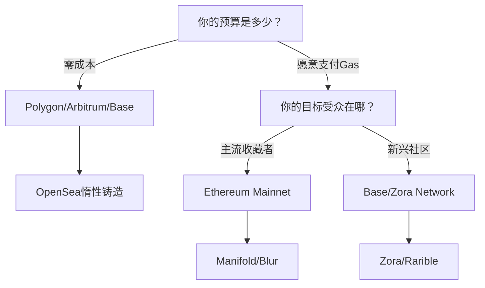
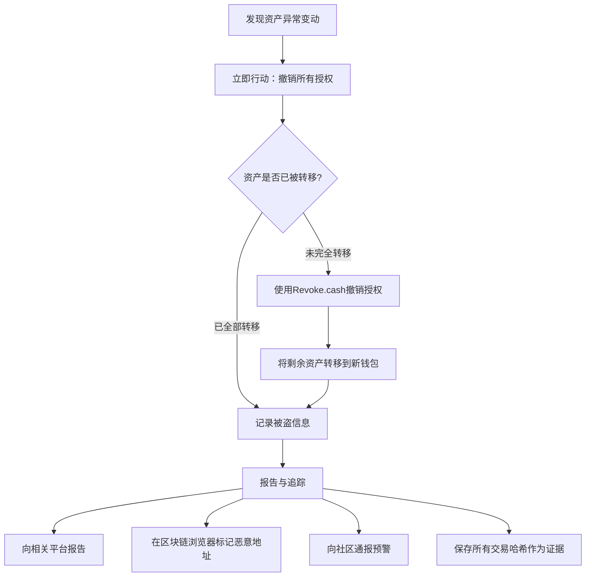
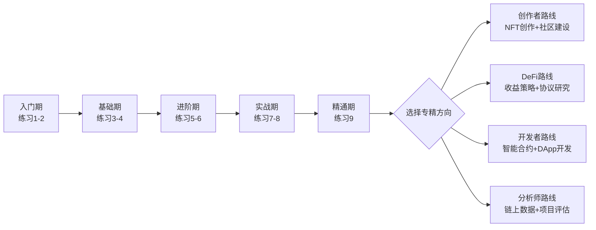

# 练习方法：Web3与NFT实操训练手册

> **本章定位：** 前四节完成了"道法术器"的理论铺垫——从Web3概念、NFT原理、DeFi机制到常见误区。本节将所有知识转化为可执行的实操训练，通过阶梯式练习帮助你从"看懂了"进化到"会做了"。

## 一、练习体系总览

### 1.1 难度分级与时间规划

| 阶段 | 练习编号 | 核心目标 | 预计时间 | 前置条件 |
|------|---------|---------|---------|---------|
| **入门期** | 练习1-2 | 钱包操作 + NFT铸造 | 1-2天 | 无 |
| **基础期** | 练习3-4 | 市场分析 + DeFi基础操作 | 3-5天 | 完成练习1-2 |
| **进阶期** | 练习5-6 | DAO参与 + 安全防护 | 5-7天 | 完成练习3-4 |
| **实战期** | 练习7-8 | 链上交互 + 综合项目 | 7-14天 | 完成练习5-6 |
| **精通期** | 练习9 | 30天系统挑战 | 30天 | 完成所有练习 |

### 1.2 练习所需工具与资金准备

**必备工具清单：**

| 工具类型 | 推荐选择 | 用途 | 费用 |
|---------|---------|-----|------|
| 浏览器钱包 | MetaMask / Rabby | 链上交互入口 | 免费 |
| 移动钱包 | Rainbow / Trust Wallet | 移动端操作 | 免费 |
| 硬件钱包 | Ledger Nano S Plus | 大额资产存储 | ~$79 |
| 链上分析 | Etherscan / Polygonscan | 交易查询验证 | 免费 |
| NFT分析 | NFTGo / icy.tools / Blur | NFT市场数据 | 基础免费 |
| DeFi聚合 | DeFiLlama / Zapper | 收益追踪 | 免费 |
| 代码编辑 | VS Code + Solidity插件 | 智能合约学习 | 免费 |
| 测试网水龙头 | Google Cloud Faucet / Alchemy | 获取测试代币 | 免费 |

**资金预算建议：**

```text
入门级（纯学习）：$0 — 全部使用测试网
探索级（小额实战）：$50-100 — 在Polygon/Arbitrum等L2上操作
参与级（认真投入）：$200-500 — 覆盖多链多协议体验
```

**重要原则：** 所有练习第一步都在测试网完成，确认操作流程无误后，再用小额资金在主网重复。

---

## 二、入门期练习

### 练习1：Web3钱包全流程操作

**难度：** ★☆☆☆☆（入门）
**预计时间：** 2-3小时
**训练目标：** 从零搭建安全的Web3操作环境，掌握钱包核心功能

#### 第一步：创建钱包（30分钟）

**操作流程：**

1. 访问 [MetaMask官网](https://metamask.io/)，下载对应浏览器的扩展程序
   - **安全提醒：** 只从官网下载，不要信任搜索引擎广告或第三方链接
   - Chrome用户：确认扩展ID为 `nkbihfbeogaeaoehlefnkodbefgpgknn`
2. 打开MetaMask，点击"创建新钱包"
3. 设置密码（至少12位，包含大小写字母+数字+特殊字符）
4. **备份助记词——这是最关键的一步：**
   - 系统显示12个英文单词，按顺序手抄到纸上（至少两份）
   - **绝对禁止：** 截图保存、存到云盘/邮箱、拍照发送给任何人
   - 抄写完成后，系统会要求你按顺序确认助记词
5. 助记词验证通过，钱包创建完成

**验证检查点：**
- [ ] 能看到钱包地址（0x开头的42位字符串）
- [ ] 助记词已手写备份并存放在两个不同的物理位置
- [ ] 确认没有在任何电子设备上存储助记词

#### 第二步：配置多链网络（30分钟）

MetaMask默认只连接Ethereum主网，你需要手动添加常用网络。

**通过 Chainlist 一键添加（推荐）：**
1. 访问 [Chainlist.org](https://chainlist.org/)
2. 连接MetaMask钱包
3. 搜索并添加以下网络：

| 网络名称 | Chain ID | 原生代币 | 主要用途 |
|---------|---------|---------|---------|
| Ethereum Mainnet | 1 | ETH | 主网，资产安全最高 |
| Polygon Mainnet | 137 | MATIC | 低Gas费NFT铸造 |
| Arbitrum One | 42161 | ETH | DeFi，低手续费 |
| Base | 8453 | ETH | Coinbase L2，新兴生态 |
| BNB Smart Chain | 56 | BNB | 币安生态 |
| Sepolia Testnet | 11155111 | ETH (测试) | 测试网，零成本练习 |

**手动添加网络（以Sepolia测试网为例）：**
1. 打开MetaMask → 点击顶部网络名称 → "添加网络"
2. 填入以下参数：

```yaml
网络名称: Sepolia Testnet
RPC URL: https://rpc.sepolia.org
Chain ID: 11155111
货币符号: ETH
区块浏览器: https://sepolia.etherscan.io
```

**验证检查点：**
- [ ] 成功切换到Sepolia测试网
- [ ] 成功切换到Polygon网络
- [ ] 能在各网络间自由切换

#### 第三步：获取测试代币并执行基础交易（45分钟）

**获取Sepolia测试ETH：**
1. 访问 [Google Cloud Web3 Faucet](https://cloud.google.com/application/web3/faucet/ethereum/sepolia)
2. 连接钱包，领取测试ETH（通常0.05-0.5 ETH）
3. 或使用 [Alchemy Faucet](https://sepoliafaucet.com/)（需要注册Alchemy账号）

**执行第一笔链上交易：**
1. 确认MetaMask已切换到Sepolia测试网
2. 创建一个新账户（MetaMask → 账户图标 → "创建账户"），命名为"测试收款"
3. 复制新账户的地址
4. 切换回主账户，点击"发送"
5. 粘贴收款地址，输入金额（0.001 ETH）
6. 点击"下一步" → "确认"
7. 等待交易确认（Sepolia上通常10-30秒）

**查看交易详情：**
1. 在MetaMask"活动"标签中点击这笔交易
2. 点击"在区块浏览器上查看"，跳转到Sepolia Etherscan
3. 理解交易详情页面的每个字段：

| 字段 | 含义 | 你看到的 |
|------|------|---------|
| Transaction Hash | 交易唯一标识 | 0x...的一串字符 |
| Status | 交易状态 | Success 表示成功 |
| Block | 所在区块号 | 越新越近 |
| From | 发送地址 | 你的主账户地址 |
| To | 接收地址 | 你的测试收款地址 |
| Value | 转账金额 | 0.001 ETH |
| Gas Used | 实际消耗Gas | 21000（标准转账） |
| Gas Price | Gas单价 | 取决于网络拥堵 |

**验证检查点：**
- [ ] 成功领取Sepolia测试ETH
- [ ] 成功完成一笔链上转账
- [ ] 能在Etherscan上找到并理解交易详情
- [ ] 收款账户余额正确增加

#### 第四步：学习授权管理（30分钟）

每次你连接DApp或进行代币交换时，都需要"授权"合约使用你的代币。长期积累的无用授权是钱包安全的重大隐患。

**实操检查流程：**
1. 访问 [Revoke.cash](https://revoke.cash/)
2. 连接你的钱包
3. 查看当前所有网络上的授权列表
4. 理解授权类型：
   - **无限授权（Unlimited Approval）：** 允许合约无限制使用某种代币——风险最高
   - **有限授权（Limited Approval）：** 只允许使用指定数量——较为安全
   - **已过期授权：** 已经失效，无需处理
5. 对不再使用的DApp授权，点击"Revoke"撤销

**建立安全操作习惯：**
```text
交易前检查清单：
□ 确认目标网站URL正确（防钓鱼）
□ 检查合约地址是否被验证（Etherscan上显示绿色勾）
□ 授权时选择有限授权而非无限授权
□ 大额操作前先小额测试
□ 交易完成后，定期清理不必要的授权（建议每月一次）
```

**验证检查点：**
- [ ] 能在Revoke.cash查看钱包授权
- [ ] 理解无限授权和有限授权的区别
- [ ] 建立了交易前检查清单的习惯

#### 练习1总结

完成后你应该具备：
- 一个安全配置的MetaMask钱包
- 多链网络环境就绪
- 能执行基础的链上交易
- 理解Gas费和授权机制
- 具备基本的安全操作习惯

---

### 练习2：NFT铸造全流程实操

**难度：** ★★☆☆☆（基础）
**预计时间：** 3-4小时
**训练目标：** 独立完成NFT从创作到上架销售的完整流程

#### 第一步：准备数字作品（60分钟）

**如果你是艺术家/设计师：**
- 使用Procreate、Photoshop、Blender等工具创作
- 推荐格式：PNG（透明背景优先）、GIF（动态）、MP4（视频）
- 推荐尺寸：至少3000×3000px（正方形），文件大小<100MB
- 色彩模式：sRGB（Web标准）

**如果你不是视觉创作者：**
- 使用AI生成工具（Midjourney、DALL·E 3、Stable Diffusion）创作图像
- **版权提示：** 检查AI工具的使用条款，确认生成内容是否可用于商业用途
- 为AI作品增加个人创意加工（拼贴、后期处理、文字叠加）

**为你的NFT设计完整的Metadata：**

```json
{
  "name": "你的NFT名称",
  "description": "详细描述你的作品，包含创作灵感、技术细节、故事背景。好的描述能显著提升NFT的吸引力。",
  "image": "ipfs://QmYourImageHash",
  "attributes": [
    {
      "trait_type": "风格",
      "value": "赛博朋克"
    },
    {
      "trait_type": "色系",
      "value": "霓虹蓝紫"
    },
    {
      "trait_type": "稀有度",
      "value": "稀有"
    },
    {
      "trait_type": "创作工具",
      "value": "Blender + Photoshop"
    }
  ],
  "external_url": "https://yourwebsite.com/nft-collection"
}
```

**属性（Attributes）的设计策略：**
- 属性构成NFT的"基因"，影响稀缺性和收藏价值
- 稀有属性组合能创造更高价值（如：1000个NFT中只有10个是"金色+皇冠"）
- 参考成功的NFT项目（BAYC、Doodles）的属性设计思路

#### 第二步：选择铸造平台和链（30分钟）

**主流铸造平台对比：**

| 平台 | 费用 | 支持链 | 适合人群 | 特色功能 |
|------|------|-------|---------|---------|
| **OpenSea** | 0%铸造费（惰性铸造） | ETH, Polygon, Klaytn, Arbitrum | 新手首选 | 最大流量，惰性铸造零成本 |
| **Blur** | 0% | Ethereum | 交易型用户 | 专业交易工具，速度快 |
| **Zora** | 0% | Zora Network | 创作者 | 创作者友好，自有L2 |
| **Rarible** | 1%手续费 | 多链 | 多链创作者 | 支持链多，社区功能 |
| **Manifold** | 部署合约费用 | Ethereum | 专业艺术家 | 自定义智能合约，版税保障 |
| **Foundation** | 5%手续费 | Ethereum | 策展型艺术家 | 邀请制，质量把控 |

**链的选择策略：**



**新手推荐路径：** OpenSea + Polygon → 熟练后迁移到 Ethereum + Manifold

#### 第三步：执行铸造操作（45分钟）

**在OpenSea上铸造（以Polygon为例）：**

1. 访问 [opensea.io](https://opensea.io/)，连接MetaMask钱包
2. 点击右上角头像 → "Create"
3. 填写创建表单：
   - **Image/Video/File：** 上传你的作品文件
   - **Name：** NFT名称（简洁有记忆点）
   - **Description：** 详细描述（利用上一步的Metadata设计）
   - **Collection：** 选择已有集合或创建新集合
   - **Blockchain：** 选择 **Polygon**（Gas费最低）
   - **Properties/Levels/Stats：** 添加属性（trait_type和value）
4. 点击"Create"完成铸造

**惰性铸造（Lazy Minting）原理：**
- NFT的元数据记录在OpenSea的服务器上，而非链上
- 只有在第一次被购买时，才会真正铸造到区块链上
- 好处：零Gas费铸造
- 坏处：NFT没有真正的链上记录，直到被购买

**创建自己的合约铸造（进阶，使用Manifold）：**
- 部署自己的ERC-721合约，你拥有合约的完全控制权
- 版税可以在合约层面强制执行
- 铸造成本更高（需要支付ETH主网Gas），但NFT的可信度更高

#### 第四步：上架与定价策略（45分钟）

**销售方式选择：**

| 方式 | 描述 | 适合场景 | 风险 |
|------|------|---------|------|
| **固定价格** | 设定一个价格，买家直接购买 | 新手、首个NFT | 价格可能偏低 |
| **英式拍卖** | 设定起拍价和时间，最高出价者得 | 热门作品、有粉丝基础 | 可能低于预期 |
| **荷兰式拍卖** | 价格随时间递减，直到有人购买 | 测试市场接受度 | 可能卖出价格偏低 |
| **接受报价** | 不设价，接受他人出价 | 试水市场 | 可能无人出价 |

**定价策略框架：**

```text
定价公式参考：
基础价格 = 创作时间成本 + 材料/工具成本 + 风险溢价

新手首个NFT定价建议：
- 无粉丝基础：0.001-0.01 ETH（或5-50 MATIC on Polygon）
- 有社交媒体粉丝（1K-10K）：0.01-0.05 ETH
- 有艺术品销售记录：0.05-0.2 ETH
- 有名气/获奖记录：0.2 ETH以上

关键心态：首个NFT的目标不是赚钱，而是完成整个流程。
```

**版税设置（Royalties）：**
- 建议设置2.5%-10%的二级市场版税
- OpenSea默认2.5%，可以手动调整
- 版税是创作者的长期被动收入来源
- 注意：部分平台（如Blur）对版税执行不严格

**验证检查点：**
- [ ] 成功铸造至少1个NFT
- [ ] NFT出现在你的OpenSea个人页面
- [ ] 成功上架销售（定价合理）
- [ ] 能向他人解释铸造流程和费用结构

#### 练习2总结

完成记录表：

```text
NFT名称：_______________
铸造平台：_______________
所在链：_______________
铸造费用：_______________
上架价格：_______________
版税比例：_______________
链接：_______________
心得记录：_______________
```

---

## 三、基础期练习

### 练习3：NFT市场分析实战

**难度：** ★★☆☆☆（基础）
**预计时间：** 4-6小时（分散在一周内完成）
**训练目标：** 掌握链上数据分析工具的使用，建立独立的项目评估能力

#### 第一步：搭建分析工具矩阵（60分钟）

**核心工具注册与入门：**

**1. NFTGo（[nftgo.io](https://nftgo.io/)）**
- 注册免费账号，连接钱包
- 核心功能学习：
  - **Market Overview：** 查看整体市场市值、交易量、活跃用户趋势
  - **Whale Tracking：** 追踪大户（持有NFT价值>$100K的地址）的买卖行为
  - **Project Analytics：** 查看单个项目的地板价、交易量、持有者分布
  - **Rarity Sniping：** 按稀有度筛选特定NFT

**2. icy.tools（[icy.tools](https://icy.tools/)）**
- 核心功能：
  - **Trending Collections：** 实时热门项目排行
  - **Mint Activity：** 监控新铸造活动
  - **Wallet Tracking：** 追踪特定钱包的NFT操作

**3. Dune Analytics（[dune.com](https://dune.com/)）**
- 免费注册，搜索社区已建好的仪表盘
- 推荐仪表盘：
  - "NFT Market Overview" — 整体市场概览
  - "OpenSea Analytics" — OpenSea交易数据
  - "Blur vs OpenSea" — 平台对比数据
- 学习基础SQL查询（可选但强烈推荐），自己编写查询获取定制数据

**4. DeFiLlama（[defillama.com](https://defillama.com/)）**
- 不需要注册
- 学习查看：TVL排行、收益率对比、链上资产分布

#### 第二步：深度分析3个NFT项目（120分钟）

选择以下三类项目各一个进行深度分析：

**A. 蓝筹项目（价值存储型）**
推荐：Bored Ape Yacht Club (BAYC) 或 CryptoPunks

分析框架：
```markdown
## 项目名称：_______________

### 1. 基础数据（NFTGo获取）
- 地板价：___ ETH
- 总交易量：___ ETH
- 持有者数量：___
- 总供应量：___
- 持有者/供应量比：___（>60%为健康）

### 2. 持有者分布
- 唯一持有者占比：___%
- 鲸鱼（>10个）持有占比：___%
- Top 10持有者占比：___%
- 健康指标：持有者越分散越好，鲸鱼集中度过高有抛售风险

### 3. 交易活跃度
- 近7天交易笔数：___
- 近30天交易笔数：___
- 日均交易量变化趋势：上升/下降/平稳
- 持有周期：中位持有时间越长，社区越稳固

### 4. 团队与社区
- 团队是否Doxxed（实名）：是/否
- Twitter粉丝数：___
- Discord成员数：___
- 社区活跃度评分：___/10

### 5. 路线图与交付
- 路线图承诺了什么：___
- 实际交付了什么：___
- 承诺兑现率：___/10
```

**B. 中型项目（增长潜力型）**
在NFTGo的"Top Collections"中选择排名20-50的项目，用同样的框架分析。

**C. 新兴项目（高风险高回报型）**
在icy.tools的"Trending Collections"中选择最近7天热度上升最快的项目，用同样的框架分析，额外关注：
- 项目启动时间
- 铸造价格 vs 当前地板价
- 是否有"纸手"（快速卖出的地址）大量涌入

#### 第三步：建立项目筛选清单（60分钟）

根据分析经验，建立你自己的项目筛选标准：

```markdown
## 我的NFT项目筛选标准

### 必要条件（任一不满足直接排除）
- [ ] 团队至少部分Doxxed或有可验证的过往经历
- [ ] 持有者/供应量比 > 40%
- [ ] 有明确的艺术风格或实用价值
- [ ] 合约经过审计或已开源验证

### 加分项（满足越多越好）
- [ ] 蓝筹持有者（BAYC/Punk等）参与铸造
- [ ] 有实际合作（品牌联名、游戏集成等）
- [ ] 社区自发内容产出活跃
- [ ] 有持续的交付记录

### 风险信号（出现任何一条提高警惕）
- [ ] 匿名团队 + 无过往记录
- [ ] 过度承诺回报（"保证100倍"）
- [ ] 持有者高度集中（前10持有>50%）
- [ ] 社区大量讨论价格而非艺术/技术
```

**输出成果：**
- 3份项目分析报告（使用上述模板）
- 1份个人项目筛选标准
- 1份市场趋势观察笔记

---

### 练习4：DeFi基础操作实操

**难度：** ★★★☆☆（中级）
**预计时间：** 4-6小时
**训练目标：** 掌握DeFi三大核心操作——兑换、借贷、质押

**资金要求：** $50-100（建议在Polygon/Arbitrum上操作以节省Gas费），或全部使用测试网

#### 第一步：代币兑换（Swap）实操（90分钟）

**在Uniswap上进行第一笔代币兑换（以Polygon为例）：**

1. 准备工作：
   - 确保MetaMask已添加Polygon网络
   - 持有少量MATIC作为Gas费（$1-2足够完成多笔交易）
   - 持有少量USDC或DAI作为兑换资金

2. 操作流程：
   - 访问 [app.uniswap.org](https://app.uniswap.org/)
   - 连接钱包，确认网络为Polygon
   - 选择"Swap"标签
   - 选择兑换对（如 USDC → WETH）
   - 输入兑换数量

3. **理解滑点（Slippage）设置：**

   | 滑点设置 | 适用场景 | 风险 |
   |---------|---------|------|
   | 0.1% | 大市值代币兑换（ETH、USDC等） | 可能交易失败但不会亏 |
   | 0.5% | 中等流动性代币 | 平衡安全和成功率 |
   | 1-3% | 小市值/低流动性代币 | 可能被MEV机器人利用 |
   | >5% | 高波动性代币 | 严重的价格损失风险 |

   设置方法：点击Uniswap右上角齿轮图标 → Slippage tolerance

4. **理解价格影响（Price Impact）：**
   - 当你兑换数量较大时，会推高买入价格
   - 价格影响 > 2% 时要警惕，> 5% 建议分批兑换
   - Uniswap会显示预计的价格影响百分比

5. **执行交易并记录：**
```text
   兑换记录：
   时间：_______________
   链：_______________
   从：___ (数量) → 到：___ (数量)
   滑点设置：___%
   实际滑点：___%
   Gas费：___
   交易哈希：_______________
   ```

**验证检查点：**
- [ ] 成功完成至少2笔代币兑换
- [ ] 理解滑点设置对交易的影响
- [ ] 能在区块浏览器上查看交易详情
- [ ] 理解AMM（自动做市商）的基本原理

#### 第二步：流动性提供（LP）实操（90分钟）

**什么是流动性提供：**
你将一对代币存入交易池，为交易者提供流动性，从中赚取交易手续费分成。

**在Uniswap V3上提供流动性（以USDC/WETH为例）：**

1. 理解集中流动性（Concentrated Liquidity）：
   - Uniswap V3允许你设定价格范围
   - 价格范围越窄，资金效率越高，收益越大
   - 但价格超出范围后，你不再赚取手续费
   - 新手建议选择较宽的范围

2. 操作流程：
   - 在Uniswap选择"Pool" → "New Position"
   - 选择交易对（USDC/WETH）
   - 设定价格范围（建议新手选择全范围 Full Range）
   - 输入提供的代币数量
   - 确认并提交交易

3. **理解无常损失（Impermanent Loss）：**

   无常损失是指你提供流动性相比直接持有代币的额外损失。当两种代币的价格比例发生变化时，就会产生无常损失。

   | 价格变化幅度 | 约对应无常损失 |
   |------------|-------------|
   | ±25% | ~0.6% |
   | ±50% | ~2.0% |
   | ±100%（翻倍或腰斩） | ~5.7% |
   | ±200% | ~13.4% |
   | ±400% | ~25.5% |

   **核心理解：** 无常损失在你撤出流动性时才变成"实际损失"。如果持续收取手续费，手续费收益可能覆盖无常损失。

4. **使用模拟计算器：**
   访问 [dailydefi.org/tools/impermanent-loss-calculator](https://dailydefi.org/tools/impermanent-loss-calculator/)，输入不同价格变化场景，直观理解无常损失的影响。

**验证检查点：**
- [ ] 成功提供至少一组流动性
- [ ] 理解集中流动性的概念
- [ ] 能计算并解释无常损失
- [ ] 在Zapper或DeFiLlama上查看你的LP仓位

#### 第三步：质押（Staking）实操（60分钟）

**流动性质押——以Lido为例：**

1. 访问 [stake.lido.fi](https://stake.lido.fi/)
2. 连接钱包（切换到Ethereum主网）
3. 输入要质押的ETH数量
4. 确认交易，获得等量的stETH
5. stETH每天自动复利增长（反映质押收益）

**理解stETH的工作原理：**
```text
你存入 1 ETH → 获得 1 stETH
每天，stETH余额自动增加（反映质押奖励）
当你想取出时，1 stETH ≈ 1 ETH + 累积收益
stETH可以在DeFi中自由使用（作为抵押品、提供流动性等）
```

**质押平台对比：**

| 平台 | 支持代币 | 收益率（参考） | 特点 |
|------|---------|-------------|------|
| Lido | ETH | ~3-4% | 最大流动性质押协议，stETH流动性极好 |
| Rocket Pool | ETH | ~3-4% | 去中心化程度更高 |
| Marinade Finance | SOL | ~7-8% | Solana生态 |
| Benqi | AVAX | ~7-8% | Avalanche生态 |

**在Polygon上体验Staking（Gas费更低）：**
- 将MATIC质押在Polygon官方Staking合约中
- 收益约4-6%
- 取消质押有解绑期（通常2-3天）

**验证检查点：**
- [ ] 成功进行至少一次质押操作
- [ ] 理解流动性质押和传统质押的区别
- [ ] 能解释stETH的价格锚定机制

#### 练习4总结

完成记录表：

```text
DeFi操作记录汇总：
1. Swap：___ → ___，链：___，Gas：___
2. LP：对：___，价格范围：___，投入：___
3. Staking：质押___ (代币)，平台：___，预期年化：___
总投入：$___
总Gas费：$___
心得体会：_______________
```

---

## 四、进阶期练习

### 练习5：DAO参与实践

**难度：** ★★★☆☆（中级）
**预计时间：** 7-14天（持续参与）
**训练目标：** 理解DAO治理机制，实际参与至少一个DAO的治理流程

#### 第一步：选择并研究DAO（2-3小时）

**DAO类型与推荐项目：**

| DAO类型 | 代表项目 | 入门难度 | 参与方式 |
|---------|---------|---------|---------|
| **协议治理** | Uniswap (UNI), Aave (AAVE), MakerDAO | 中 | 投票、提案 |
| **收藏型** | Nouns, ConstitutionDAO | 低 | 社区参与、持有NFT |
| **社交型** | Friends with Benefits (FWB), Cabin DAO | 低 | 社区活动 |
| **投资型** | The LAO, MetaCartel | 高 | 出资+投票 |
| **赠款型** | Gitcoin, MolochDAO | 中 | 捐赠、申请资助 |
| **工具型** | ENS DAO, Optimism Collective | 中 | 治理投票 |

**研究框架（选1-2个深入研究）：**
1. 访问DAO官网和治理论坛（通常是 governance.XXX.com 或论坛链接）
2. 阅读"Constitution"或"Charter"（治理章程）
3. 查看Snapshot上的历史投票记录
4. 加入Discord，观察社区讨论氛围
5. 了解治理代币的获取方式和投票权重机制

#### 第二步：实际参与治理（3-7天）

**参与路径（由浅入深）：**

```text
Level 1 - 观察者（第1-2天）
├── 加入Discord，阅读公告和讨论
├── 在Snapshot上浏览当前和历史提案
└── 理解投票机制（代币加权/二次方投票等）

Level 2 - 投票者（第3-4天）
├── 获取治理代币（如有需要）
├── 在Snapshot上对活跃提案进行投票
└── 在论坛上表达你的投票理由

Level 3 - 讨论者（第5-7天）
├── 在治理论坛回复讨论帖
├── 提出改进建议或问题
└── 参与社区AMA或电话会议

Level 4 - 贡献者（长期）
├── 加入工作组（如Grants、Marketing、Development）
├── 提交正式提案（RFC）
└── 成为Delegated Voter（代理人投票）
```

**Snapshot投票实操：**
1. 访问 [snapshot.org](https://snapshot.org/)
2. 搜索你关注的DAO
3. 连接钱包
4. 选择一个活跃提案
5. 阅读提案内容和社区讨论
6. 选择你的投票选项并签名确认（注意：Snapshot投票是免费的，不需要Gas费）

**验证检查点：**
- [ ] 在至少1个DAO的Discord中活跃参与
- [ ] 在Snapshot上完成至少2次投票
- [ ] 在治理论坛上至少发布1条有质量的回复
- [ ] 能解释该DAO的治理流程和决策机制

---

### 练习6：Web3安全防护体系

**难度：** ★★★☆☆（中级）
**预计时间：** 3-4小时
**训练目标：** 建立系统化的Web3安全意识，掌握安全工具的使用

#### 第一步：认识常见攻击手段（60分钟）

**Web3安全威胁全景：**

| 攻击类型 | 描述 | 防范措施 |
|---------|------|---------|
| **钓鱼网站** | 仿冒知名DApp，诱导连接钱包签名恶意交易 | 书签保存常用DApp，核对URL |
| **恶意签名** | 诱导签署SetApprovalForAll等危险操作 | 仔细阅读签名请求内容 |
| **假空投** | 钱包收到未知代币，诱导访问恶意网站 | 不交互、不访问空投代币中的链接 |
| **Rug Pull** | 项目方卷款跑路 | 检查团队背景、合约锁仓情况 |
| **闪电贷攻击** | 利用DeFi协议漏洞操纵价格 | 分散资金，不将所有资产放在单一协议 |
| **社工攻击** | 通过Discord/Twitter私信骗取私钥 | 绝不在任何地方输入助记词/私钥 |
| **地址污染** | 生成与你常用地址相似的地址进行小额转账混淆 | 转账前核对地址的首尾各4位 |
| **恶意合约** | 部署含有后门的合约 | 只与审计过/开源验证的合约交互 |

**实操——识别钓鱼交易签名：**

正常的ERC-20代币交换签名请求：
```yaml
Function: swapExactTokensForTokens
Parameters: amountIn, amountOutMin, path[], to, deadline
```

危险的授权签名请求（如果不知道目标合约是谁）：
```yaml
Function: setApprovalForAll
Operator: 0x可疑地址
Approved: true
→ 这意味着对方可以转走你所有该系列的NFT！
```

**实操——使用Scam Sniffer：**
1. 安装浏览器扩展 [Scam Sniffer](https://scamsniffer.io/)
2. 当你访问可疑网站时，它会自动弹出警告
3. 定期检查你的钱包在 [Scam Sniffer](https://scamsniffer.io/) 上的安全评分

#### 第二步：建立安全防护体系（60分钟）

**钱包分层策略：**

```text
热钱包（日常操作）：MetaMask
├── 存放资金：<$500
├── 用途：日常DApp交互、小额交易
├── 风险等级：中
└── 安全措施：强密码 + 交易前检查清单

温钱包（中等存储）：MetaMask独立配置 / Rabby
├── 存放资金：$500-$5,000
├── 用途：DeFi仓位、NFT收藏
├── 风险等级：中低
└── 安全措施：独立浏览器配置文件 + 定期审查授权

冷钱包（长期存储）：Ledger / Trezor
├── 存放资金：>$5,000
├── 用途：长期持有、高价值NFT
├── 风险等级：低
└── 安全措施：硬件签名 + 物理安全存储助记词
```

**使用Rabby Wallet增强安全：**
- Rabby在签名前会模拟交易结果，让你在签名前看到"如果确认会发生什么"
- 显示目标合约的风险评级
- 支持多链自动切换
- 下载地址：[rabby.io](https://rabby.io/)

#### 第三步：应急处理演练（60分钟）

**资产被盗的应急响应流程：**



**预防措施检查清单：**
- [ ] 助记词仅物理存储，从未输入到任何网站
- [ ] 使用独立浏览器配置文件访问DApp
- [ ] 所有大额操作使用硬件钱包签名
- [ ] 每月检查并清理不必要的合约授权
- [ ] 不在Discord/Twitter上回复私信中的"客服"
- [ ] 安装Scam Sniffer和Pocket Universe等安全扩展

**输出成果：**
- 个人安全防护清单（根据你的实际情况定制）
- 应急处理卡片（保存在手机备忘录中，方便紧急时查阅）
- 安全工具安装与配置报告

---

## 五、实战期练习

### 练习7：智能合约基础交互

**难度：** ★★★★☆（进阶）
**预计时间：** 6-8小时
**训练目标：** 学会使用Etherscan直接与智能合约交互，理解合约ABI和函数调用

#### 第一步：理解合约交互基础（90分钟）

**核心概念：**
- **ABI（Application Binary Interface）：** 合约的接口定义，描述了合约有哪些函数、每个函数接受什么参数、返回什么值
- **Verified Contract：** 在Etherscan上已验证源代码的合约，可以直接查看和交互
- **Read/Write Functions：** Read函数不需要Gas费（只是查询链上数据），Write函数需要签名并支付Gas费

**在Etherscan上与合约交互：**
1. 打开 [Sepolia Etherscan](https://sepolia.etherscan.io/)
2. 找到一个已验证的合约地址（如DAI合约：`0xFF34B3d4Aee8ddCd6F9AFFFB6Fe49bD371b8a357`）
3. 点击"Contract"标签 → "Read Contract" / "Write Contract"
4. **Read Contract示例：** 调用 `balanceOf` 函数，输入你的钱包地址，查看余额
5. **Write Contract示例：** 调用 `transfer` 函数（先在测试网上尝试）

#### 第二步：使用ethers.js编写简单脚本（120分钟）

**环境准备：**
```bash
mkdir web3-practice && cd web3-practice
npm init -y
npm install ethers dotenv
```

**编写查询脚本 `query.js`：**
```javascript
const { ethers } = require("ethers");

// 连接到Sepolia测试网（使用公共RPC）
const provider = new ethers.JsonRpcProvider(
  "https://rpc.sepolia.org"
);

async function main() {
  // 查询区块号
  const blockNumber = await provider.getBlockNumber();
  console.log("当前区块号:", blockNumber);

  // 查询余额
  const address = "你的钱包地址";
  const balance = await provider.getBalance(address);
  console.log("余额:", ethers.formatEther(balance), "ETH");

  // 查询交易详情
  const txHash = "某笔交易哈希";
  const tx = await provider.getTransaction(txHash);
  if (tx) {
    console.log("交易详情:", {
      from: tx.from,
      to: tx.to,
      value: ethers.formatEther(tx.value),
      gasPrice: tx.gasPrice?.toString(),
    });
  }
}

main().catch(console.error);
```

**运行并理解输出：**
```bash
node query.js
```

#### 第三步：理解ERC标准（90分钟）

**ERC-20（同质化代币）标准函数：**

| 函数 | 功能 | 返回值 |
|------|------|--------|
| `name()` | 代币名称 | string |
| `symbol()` | 代币符号 | string |
| `decimals()` | 小数位数 | uint8 |
| `totalSupply()` | 总供应量 | uint256 |
| `balanceOf(address)` | 查询余额 | uint256 |
| `transfer(to, amount)` | 转账 | bool |
| `approve(spender, amount)` | 授权 | bool |
| `transferFrom(from, to, amount)` | 代理转账 | bool |

**ERC-721（NFT）标准函数：**

| 函数 | 功能 |
|------|------|
| `ownerOf(tokenId)` | 查询NFT持有者 |
| `balanceOf(owner)` | 查询持有者NFT数量 |
| `tokenURI(tokenId)` | 查询NFT元数据URI |
| `transferFrom(from, to, tokenId)` | 转移NFT |
| `setApprovalForAll(operator, approved)` | 批量授权 |
| `safeTransferFrom(from, to, tokenId)` | 安全转移 |

**验证检查点：**
- [ ] 能在Etherscan上直接调用合约函数
- [ ] 运行ethers.js脚本查询链上数据成功
- [ ] 能区分ERC-20和ERC-721的核心函数
- [ ] 理解ABI的作用

---

### 练习8：Web3工具链搭建

**难度：** ★★★★☆（进阶）
**预计时间：** 4-6小时
**训练目标：** 搭建个人Web3开发与分析环境，为深度参与做准备

#### 第一步：配置开发环境（90分钟）

**安装Hardhat（以太坊开发框架）：**
```bash
mkdir web3-dev && cd web3-dev
npm init -y
npm install --save-dev hardhat
npx hardhat init
# 选择 "Create a JavaScript project"
```

**项目结构理解：**
```text
web3-dev/
├── contracts/          # Solidity智能合约
├── scripts/            # 部署和交互脚本
├── test/               # 合约测试
├── hardhat.config.js   # 配置文件
└── package.json
```

**配置Sepolia测试网（hardhat.config.js）：**
```javascript
require("@nomicfoundation/hardhat-toolbox");
require("dotenv").config();

module.exports = {
  solidity: "0.8.24",
  networks: {
    sepolia: {
      url: process.env.SEPOLIA_RPC_URL, // Alchemy/Infura RPC
      accounts: [process.env.PRIVATE_KEY], // 测试网专用钱包私钥
    },
  },
};
```

**安全提醒：** `.env` 文件中的私钥只用于测试网的钱包，绝不要使用存有真实资产的钱包私钥。

#### 第二步：部署第一个智能合约（120分钟）

**编写一个简单的ERC-20代币合约 `contracts/MyToken.sol`：**
```solidity
// SPDX-License-Identifier: MIT
pragma solidity ^0.8.24;

import "@openzeppelin/contracts/token/ERC20/ERC20.sol";

contract MyToken is ERC20 {
    constructor(uint256 initialSupply) ERC20("MyToken", "MTK") {
        _mint(_msgSender(), initialSupply);
    }
}
```

**编写部署脚本 `scripts/deploy.js`：**
```javascript
const hre = require("hardhat");

async function main() {
  const initialSupply = hre.ethers.parseEther("1000000"); // 100万代币
  const MyToken = await hre.ethers.getContractFactory("MyToken");
  const token = await MyToken.deploy(initialSupply);
  await token.waitForDeployment();
  console.log("MyToken deployed to:", await token.getAddress());
}

main().catch((error) => {
  console.error(error);
  process.exitCode = 1;
});
```

**在Sepolia上部署：**
```bash
npx hardhat run scripts/deploy.js --network sepolia
```

部署成功后，在Sepolia Etherscan上搜索合约地址，验证你的代币已上链。

**验证检查点：**
- [ ] Hardhat项目创建并配置成功
- [ ] 在Sepolia测试网部署了自定义ERC-20代币
- [ ] 能在Etherscan上查看部署的合约
- [ ] 理解编译、部署、验证的完整流程

---

## 六、精通期练习

### 练习9：30天Web3系统实践挑战

**难度：** ★★★★★（综合）
**预计时间：** 30天（每天1-2小时）
**训练目标：** 通过30天的系统化实践，建立完整的Web3参与能力和认知体系

#### 挑战规则

```text
1. 每天完成当日任务，记录在学习日志中
2. 每周日晚进行周复盘
3. 所有链上操作记录交易哈希
4. 30天后提交完整总结报告
5. 资金上限：$100（含Gas费）
```

#### 详细日程

**第一周：基础建设（Day 1-7）**

| 天数 | 任务 | 产出 | 时间 |
|------|------|------|------|
| Day 1 | 学习区块链基础原理：区块、哈希、共识机制 | 笔记：用自己的话解释区块链如何工作 | 1.5h |
| Day 2 | 学习Web3生态全景：ETH、L2、Solana、Cosmos | 绘制生态图谱 | 1.5h |
| Day 3 | 创建MetaMask钱包 + 配置Sepolia测试网 | 钱包就绪，测试ETH到账 | 1h |
| Day 4 | 添加Polygon/Arbitrum/Base网络 + 领取测试代币 | 多链环境就绪 | 1h |
| Day 5 | 完成第一笔链上交易（测试网） + 学习Etherscan | 交易记录 + Etherscan分析笔记 | 1.5h |
| Day 6 | 学习ERC-20/ERC-721标准 + 在Etherscan上与合约交互 | 合约交互笔记 | 1.5h |
| Day 7 | 周复盘 + 安装安全工具（Scam Sniffer, Revoke.cash） | 周总结报告 | 1h |

**第二周：NFT实操（Day 8-14）**

| 天数 | 任务 | 产出 | 时间 |
|------|------|------|------|
| Day 8 | 研究3个NFT项目（蓝筹+中型+新兴），使用NFTGo | 3份分析报告 | 2h |
| Day 9 | 准备NFT作品（创作或AI辅助） + 设计Metadata | 完整的NFT素材包 | 1.5h |
| Day 10 | 在OpenSea(Polygon)铸造第一个NFT | NFT链接 | 1h |
| Day 11 | 设置上架价格、版税，分析定价策略 | NFT上架 + 定价分析 | 1h |
| Day 12 | 研究NFT交易策略：刷量、洗盘交易、鲸鱼追踪 | 策略分析笔记 | 1.5h |
| Day 13 | 加入1-2个NFT社区(Discord)，参与讨论 | 社区参与记录 | 1.5h |
| Day 14 | 周复盘 + NFT市场趋势总结 | 周总结报告 | 1h |

**第三周：DeFi探索（Day 15-21）**

| 天数 | 任务 | 产出 | 时间 |
|------|------|------|------|
| Day 15 | 学习DeFi核心概念：AMM、借贷、衍生品 | 概念笔记 | 1.5h |
| Day 16 | 在Uniswap上完成代币兑换（Polygon） | Swap记录 | 1h |
| Day 17 | 学习流动性提供 + 无常损失计算 | LP分析笔记 | 1.5h |
| Day 18 | 提供一组LP（小额，如$10-20） | LP仓位截图 | 1h |
| Day 19 | 学习借贷协议（Aave/Compound） | 协议对比分析 | 1.5h |
| Day 20 | 学习质押机制 + 在Lido体验质押 | 质押记录 | 1h |
| Day 21 | 周复盘 + DeFi收益策略总结 | 周总结报告 | 1h |

**第四周：DAO与总结（Day 22-30）**

| 天数 | 任务 | 产出 | 时间 |
|------|------|------|------|
| Day 22 | 研究2-3个DAO，了解治理机制 | DAO分析报告 | 1.5h |
| Day 23 | 加入DAO的Discord，观察社区讨论 | 社区观察笔记 | 1h |
| Day 24 | 在Snapshot上参与至少2次投票 | 投票截图 | 1h |
| Day 25 | 在治理论坛发布至少1条有价值的回复 | 回复链接 | 1h |
| Day 26 | 学习链上分析：使用Dune自定义查询 | 查询结果 | 1.5h |
| Day 27 | 复习安全知识，进行安全审计（检查所有授权） | 安全审计报告 | 1h |
| Day 28 | 回顾30天所有链上操作，分析盈亏 | 操作记录汇总 | 1.5h |
| Day 29 | 撰写30天总结报告 | 完整报告 | 2h |
| Day 30 | 制定未来3-6个月的Web3持续参与计划 | 长期计划文档 | 1h |

#### 30天总结报告模板

```markdown
# 30天Web3实践挑战 — 总结报告

## 一、数据汇总
- 链上交易总数：___
- 总Gas费支出：$___
- 涉及的链：___
- 涉及的协议：___
- NFT铸造数量：___
- DeFi操作种类：___
- DAO投票次数：___

## 二、技能成长自评（1-10分）
- 钱包操作熟练度：___/10
- NFT铸造与交易：___/10
- DeFi操作能力：___/10
- 链上数据分析：___/10
- 安全意识：___/10
- DAO治理参与：___/10

## 三、最大收获
1. _______________
2. _______________
3. _______________

## 四、最大教训
1. _______________
2. _______________

## 五、未来计划
- 短期（1个月）：_______________
- 中期（3个月）：_______________
- 长期（6个月）：_______________
```

---

## 七、练习总结与进阶路线

### 7.1 学习路径总览



### 7.2 四条专精方向

**创作者路线（Artist/Creator Path）：**
- 深度学习NFT创作工具（Art Blocks、Manifold Studio）
- 建立个人品牌和社区
- 探索生成艺术、音乐NFT、动态NFT等细分领域
- 目标：建立可持续的NFT创作收入

**DeFi路线（DeFi Degen/Analyst Path）：**
- 深入研究各链DeFi协议的收益机制
- 学习收益聚合策略和风险对冲
- 使用Dune Analytics编写自定义数据查询
- 目标：通过DeFi策略获得稳定的链上收益

**开发者路线（Builder Path）：**
- 系统学习Solidity语言
- 学习智能合约安全审计
- 参与开源Web3项目贡献
- 目标：开发并部署自己的DApp或协议

**分析师路线（Analyst Path）：**
- 掌握Dune Analytics SQL查询
- 学习链上数据解读（资金流向、鲸鱼行为、协议健康指标）
- 建立数据驱动的投资分析框架
- 目标：成为社区信任的数据分析贡献者

### 7.3 持续学习资源

**必读内容：**
- [Bankless](https://bankless.com/) — Web3深度文章和播客
- [The Defiant](https://thedefiant.io/) — DeFi新闻和分析
- [Messari](https://messari.io/) — 加密市场研究报告
- [a16z Crypto](https://a16zcrypto.com/) — a16z的加密研究文章

**必关注的Twitter/X账号：**
- @VitalikButerin — 以太坊创始人，技术思考
- @el33th4xor — Balancer创始人，DeFi深度分析
- @punk6529 — NFT和开放元宇宙思想领袖
- @DeFiDevs — 开发者学习资源

**必加入的社区：**
- Bankless Discord — 最活跃的Web3学习社区
- Developer DAO — Web3开发者社区
- ETHGlobal — 以太坊黑客松和活动

### 7.4 练习核心原则回顾

| 原则 | 说明 | 实践建议 |
|------|------|---------|
| **安全第一** | 永远把资产安全放在第一位 | 所有新操作先在测试网完成 |
| **小额测试** | 用可承受损失的资金学习 | 首次操作金额不超过$10 |
| **持续学习** | Web3生态每周都在变化 | 每周至少阅读3篇深度文章 |
| **社区参与** | Web3的价值在于社区 | 每天在Discord/Twitter参与30分钟讨论 |
| **记录一切** | 链上操作必须有据可查 | 每笔交易记录哈希和操作意图 |
| **独立思考** | 不盲从KOL和"财富密码" | 用自己的分析框架评估每个项目 |
