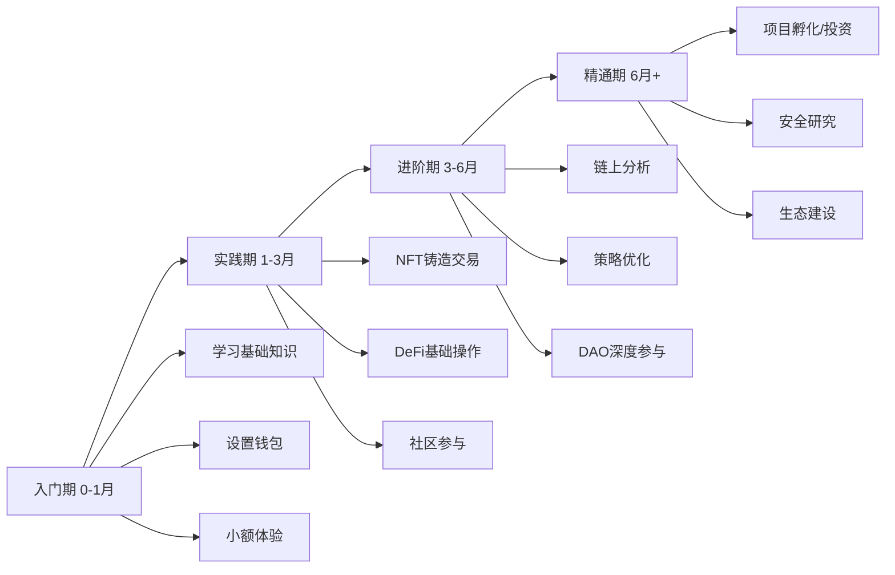

# 本章小结：Web3与NFT核心要点回顾

本章从Web3的概念起源出发，系统讲解了区块链技术基础、NFT深度解析、DAO治理机制、DeFi生态、钱包安全、Layer2扩容方案等理论知识，再到NFT创作铸造、交易平台操作、DeFi收益策略、链上分析工具等实操技能，最后通过八个真实案例展示了不同参与路径的变现逻辑。本节将这些分散的知识点串联成完整的知识体系，帮助你建立全局视角，并给出可执行的下一步行动方案。

---

## 一、全章知识体系总览

### 1.1 知识架构图

```mermaid
graph TD
    A[Web3与NFT] --> B[理论基础]
    A --> C[核心技巧]
    A --> D[实战案例]
    A --> E[安全与风险]

    B --> B1[Web3概念与演进]
    B --> B2[区块链技术基础]
    B --> B3[NFT深度解析]
    B --> B4[DAO治理机制]
    B --> B5[DeFi生态]
    B --> B6[Layer2与扩容]
    B --> B7[共识机制]

    C --> C1[NFT创作铸造]
    C --> C2[交易平台操作]
    C --> C3[DAO参与方法]
    C --> C4[DeFi收益策略]
    C --> C5[项目参与与空投]
    C --> C6[链上分析工具]
    C --> C7[钱包安全实操]
    C --> C8[NFT估值方法]

    D --> D1[数字艺术家变现]
    D --> D2[PFP社区运营]
    D --> D3[DAO参与收益]
    D --> D4[DeFi收益实践]
    D --> D5[早期项目参与]
    D --> D6[音乐NFT破圈]
    D --> D7[GameFi实践]
    D --> D8[安全研究员]

    E --> E1[钱包安全管理]
    E --> E2[智能合约风险]
    E --> E3[诈骗识别防范]
    E --> E4[DeFi风险管理]
```



### 1.2 三大核心赛道对比

| 维度 | NFT赛道 | DeFi赛道 | DAO赛道 |
|------|---------|----------|---------|
| **核心逻辑** | 数字资产所有权证明 | 去中心化金融服务 | 社区协作与治理 |
| **收益来源** | 创作销售、版税、交易差价 | 利息、手续费、代币奖励 | 治理代币增值、贡献报酬 |
| **技能要求** | 创作能力、社区运营、市场敏感度 | 金融知识、风险评估、数据分析 | 沟通能力、专业技能、治理参与 |
| **资金门槛** | 低（铸造Gas费~$1-50） | 中（$50-5000不等） | 低-中（部分需持有治理代币） |
| **时间投入** | 高（创作+社区运营） | 中（研究+监控） | 中-高（讨论+提案+执行） |
| **风险等级** | 高（流动性差、价值主观） | 极高（智能合约漏洞、无常损失） | 中（项目失败、代币贬值） |
| **适合人群** | 创作者、艺术家、品牌方 | 有金融背景的投资者 | 技术人才、社区运营者 |
| **关键成功因素** | 独特创意+强社区 | 风险控制+策略优化 | 持续贡献+人脉积累 |

---

## 二、核心知识点深度回顾

### 2.1 Web3：从概念到生态

Web3不是单一技术，而是一组理念和技术的集合体。理解Web3需要把握三个层次：

**第一层：范式转变。** Web1时代（1990-2005），用户是信息的消费者，平台拥有内容，典型产品是门户网站和搜索引擎。Web2时代（2005-2020），用户成为内容创作者，但平台垄断了数据和收益——你在抖音发布的视频，数据归抖音所有，广告收益由平台分配。Web3的核心主张是"用户拥有"：你创建的内容、你的社交关系、你的数字资产，都通过区块链记录在你自己的钱包地址下，不依赖任何平台。

**第二层：技术栈。** Web3的技术栈包括：区块链层（以太坊、Solana等公链提供去中心化账本）、协议层（DeFi协议、NFT标准ERC-721/ERC-1155、存储协议IPFS/Arweave）、应用层（钱包、DApp、市场平台）。每一层都有其技术特性和安全考量。

**第三层：经济模型。** 代币经济（Tokenomics）是Web3的驱动力。通过代币激励，项目方可以让早期参与者、开发者、用户形成利益共同体。但代币经济也是一把双刃剑——设计不当会导致通胀崩盘或被大户操控。

**当前发展阶段：** Web3仍处于类似互联网1998-2000年的阶段——基础设施在快速完善（Layer2扩容、跨链桥、账户抽象），但杀手级应用尚未全面爆发。这意味着高风险与高机会并存。

### 2.2 区块链技术：理解底层逻辑

区块链的本质是一个**分布式、不可篡改的账本**。理解以下核心机制是参与Web3的基础：

**共识机制**决定了谁有权记账。工作量证明（PoW）通过算力竞争获得记账权，安全性高但能耗大，比特币采用此机制。权益证明（PoS）通过质押代币获得记账权，能耗低但可能导致"富者更富"，以太坊在2022年完成从PoW到PoS的转型（The Merge）。委托权益证明（DPoS）由代币持有者投票选出验证节点，效率更高但去中心化程度降低，Solana、EOS采用此机制。

**智能合约**是部署在区块链上的程序代码，一旦部署便自动执行、不可篡改。它是DeFi、NFT、DAO的技术基石。理解智能合约的关键在于：代码即法律（Code is Law），但也意味着代码漏洞可能造成不可逆的损失——2022年Ronin Bridge被盗6.25亿美元、Wormhole被盗3.2亿美元，都是智能合约漏洞导致的。

**Gas费用**是执行链上操作的手续费。Gas价格由网络拥堵程度决定：以太坊主网在繁忙时Gas费可达数百美元，而Polygon、Arbitrum等Layer2网络的Gas费通常低于$0.01。选择在哪条链上操作，直接影响你的成本结构。

### 2.3 NFT：超越"图片"的价值载体

NFT（非同质化代币）的核心不是图片本身，而是**链上可验证的所有权证明**。理解NFT需要区分三个概念：

**技术层：** NFT是符合ERC-721或ERC-1155标准的智能合约。每个NFT有唯一的tokenId，映射到持有者的钱包地址。元数据（图片、描述、属性）通常存储在IPFS或Arweave上，确保去中心化存储。

**价值层：** NFT的价值来自四个维度——稀缺性（限量发行或独特性）、社区认同（持有者形成身份标签和社交圈）、实用性（会员权益、游戏道具、门票）、艺术价值（审美和文化意义）。最成功的NFT项目（如Bored Ape Yacht Club）同时具备这四个维度。

**市场层：** NFT市场的流动性远低于传统金融资产。地板价（Floor Price）是最常用的市场指标，但它只反映最低挂单价，不代表整体市场深度。NFT估值需要综合考虑交易量、持有者分布、稀有度、项目方交付记录等多维数据。

**创作者视角：** NFT为创作者提供了绕过中间商直接触达收藏者的渠道。ERC-2981标准支持链上版税，创作者可从每次二级市场交易中获得5-10%的版税收入。但版税并非强制执行——Blur等平台允许买家选择是否支付版税，这改变了创作者的收益预期。

### 2.4 DAO：去中心化协作的新范式

DAO（去中心化自治组织）的核心创新在于**用智能合约替代传统组织架构**。组织规则写在代码里，资金由多签钱包管理，决策通过代币投票完成。

**治理模型对比：**

| 模型 | 机制 | 代表项目 | 优势 | 劣势 |
|------|------|----------|------|------|
| 一代币一票 | 持有代币数量决定投票权重 | Uniswap、AAVE | 简单直接 | 容易被大户操控 |
| 声誉治理 | 贡献积累声誉，声誉决定权重 | DAOstack | 鼓励贡献 | 声誉计算复杂 |
| 委托投票 | 代币持有者委托他人投票 | Compound、Gitcoin | 提高参与率 | 可能形成代理寡头 |
| 二次方投票 | 投票成本随票数平方增长 | Gitcoin Grants | 保护少数意见 | 实施复杂 |
| 多签治理 | 核心成员多签审批 | Gnosis Safe | 执行效率高 | 去中心化程度低 |

**参与DAO的实际路径：** 从"旁观者"到"核心贡献者"通常经历四个阶段——加入Discord社区观察学习（1-2周）→参与讨论和社区活动（2-4周）→参与工作组或提交提案（1-3月）→成为核心贡献者或获得资助（3-6月）。DAO不是"买了代币就等着分红"，而是需要持续投入时间和技能。

### 2.5 DeFi：去中心化金融的核心协议

DeFi的本质是**用智能合约替代传统金融中介**。理解DeFi需要掌握以下核心协议类型：

**去中心化交易所（DEX）：** Uniswap采用自动做市商（AMM）模型，流动性提供者将代币对存入池子，交易者按恒定乘积公式（x * y = k）进行兑换。这意味着大额交易会产生滑点——交易金额越大，实际成交价格越偏离市场价格。

**借贷协议：** Aave和Compound允许用户存入资产赚取利息，或超额抵押借出资产。利率由供需动态决定：借款需求旺盛时利率上升，资金充裕时利率下降。关键风险是清算——当抵押品价值下降到一定阈值时，系统会自动拍卖抵押品偿还债务。

**流动性质押：** Lido等协议允许用户质押ETH获得stETH，同时保持流动性。质押者获得约3-5%的年化收益，同时stETH可以在DeFi中继续使用。但stETH与ETH的脱锚风险（2022年Luna崩盘期间stETH一度折价7%）需要关注。

**无常损失（Impermanent Loss）** 是流动性提供者面临的核心风险。当你提供ETH/USDC流动性时，如果ETH价格大幅上涨，你会比直接持有ETH少赚——因为AMM机制会在价格上涨时自动卖出ETH、买入USDC以维持池子平衡。只有当交易手续费收益超过无常损失时，提供流动性才是划算的。

### 2.6 安全：Web3参与的生命线

Web3领域没有银行客服、没有密码找回、没有交易撤销。一旦资产丢失或被盗，几乎无法追回。安全不是可选项，而是生存前提。

**钱包安全分级：**

| 资产规模 | 推荐方案 | 具体措施 |
|----------|----------|----------|
| <$100 | 浏览器钱包 | MetaMask + 强密码 + 助记词手写备份 |
| $100-$1000 | 手机钱包 | Trust Wallet/Phantom + 生物识别 |
| $1000-$10000 | 硬件钱包 | Ledger Nano S Plus/Trezor One |
| >$10000 | 多签钱包 | Gnosis Safe（2/3或3/5多签）|

**常见攻击向量及防御：**

- **钓鱼攻击：** 伪造官网诱导连接钱包或签署恶意交易。防御：永远从书签访问常用DApp，不点击搜索引擎广告链接，使用Scam Sniffer等浏览器插件。
- **授权攻击：** 恶意合约请求无限授权（approve），然后转走所有代币。防御：只授权所需金额，使用Revoke.cash定期清理授权。
- **私钥泄露：** 助记词截图存手机、输入假钱包网站、在不安全设备上导入。防御：助记词只手写在纸上，存放在物理安全的地方，永不数字化存储。
- **Rug Pull：** 项目方卷款跑路。防御：检查合约是否开源、是否锁定流动性、团队是否匿名、代币分配是否集中。

---

## 三、实操技能清单

### 3.1 必须掌握的基础操作

**钱包操作能力：**
- 创建和管理多个钱包地址（热钱包用于日常操作，冷钱包用于存储大额资产）
- 在多条链之间切换（Ethereum、Polygon、Arbitrum、Optimism、Base、Solana）
- 跨链桥接资产（使用官方桥或聚合桥如Li.Fi、Jumper）
- 查看和管理代币授权（Revoke.cash）
- 读取链上交易记录（Etherscan、Polygonscan）

**NFT操作能力：**
- 铸造NFT（OpenSea、Manifold、Zora等平台）
- 批量铸造和上架
- 分析NFT稀有度和估值（NFTGo、icy.tools、OpenRarity）
- 理解版税机制和平台费率差异
- 使用聚合器（Blur）优化交易

**DeFi操作能力：**
- 在DEX上兑换代币（设置滑点、Gas费优化）
- 提供流动性并理解无常损失
- 参与借贷协议（存入/借出/还款）
- 流动性质押（Lido、Rocket Pool）
- 收益聚合器使用（Yearn、Beefy）

### 3.2 进阶分析能力

**链上数据分析：**
- 使用Dune Analytics制作自定义仪表盘
- 使用Nansen追踪"聪明钱"动向
- 分析代币持仓分布（是否存在大户集中风险）
- 监控协议TVL（总锁仓量）变化趋势
- 追踪鲸鱼钱包的交易行为

**项目评估框架：**

```text
项目评估五维模型：
├── 技术维度
│   ├── 代码是否开源？是否有审计报告？
│   ├── 技术方案是否创新？还是fork已有项目？
│   └── 主网是否上线？还是只有测试网？
├── 团队维度
│   ├── 团队是否实名？过往履历如何？
│   ├── 是否有知名机构投资？
│   └── 团队代币是否锁定？锁定期多久？
├── 经济模型维度
│   ├── 代币分配是否合理？（团队<20%，社区>40%）
│   ├── 是否有可持续的收入模型？
│   └── 通胀率和释放节奏如何？
├── 社区维度
│   ├── Discord/Twitter活跃度如何？
│   ├── 社区讨论质量如何？还是只有喊单？
│   └── 是否有真实的用户使用场景？
└── 风险维度
    ├── 最大下行风险是什么？
    ├── 是否有已知的安全漏洞？
    └── 监管风险如何？
```

---

## 四、能力成长路径

### 4.1 四阶段能力模型



**入门期（0-1个月）——建立认知框架：**
- 目标：理解Web3是什么、为什么重要、怎么参与
- 行动：阅读以太坊官方文档、设置MetaMask钱包、浏览OpenSea和Uniswap
- 产出：能解释区块链、NFT、DeFi的基本概念，能独立完成钱包创建和小额转账
- 预算：$0-50（主要用于体验Gas费）

**实践期（1-3个月）——获得实操经验：**
- 目标：完成NFT铸造、DeFi操作、DAO参与的完整流程
- 行动：铸造并上架自己的NFT、在Uniswap兑换代币、在Lido质押ETH、加入1-2个DAO的Discord
- 产出：拥有自己的NFT作品、DeFi操作记录、DAO参与记录
- 预算：$50-500（视链上操作频率而定）

**进阶期（3-6个月）——形成分析能力：**
- 目标：能独立评估项目、制定策略、管理风险
- 行动：学习Dune Analytics制作仪表盘、研究代币经济模型、参与治理投票、尝试空投策略
- 产出：项目评估报告、链上分析仪表盘、风险管理框架
- 预算：$500-5000（根据个人风险承受能力调整）

**精通期（6个月以上）——创造独特价值：**
- 目标：在某一领域形成专业深度，能创造独特价值
- 行动：选择一个细分方向深耕——NFT创作与策展、DeFi策略优化、DAO治理研究、安全审计、社区运营
- 产出：专业作品集、稳定的收益来源、行业影响力
- 预算：根据方向和个人情况灵活调整

### 4.2 不同人群的推荐路径

| 人群类型 | 推荐切入点 | 核心策略 | 预期回报周期 |
|----------|-----------|----------|-------------|
| 设计师/艺术家 | NFT创作 | 建立个人风格+社区运营 | 3-6月 |
| 程序员 | 智能合约开发/安全审计 | 学习Solidity+参与开源项目 | 2-4月 |
| 内容创作者 | NFT+社区 | 内容IP化+粉丝经济 | 3-6月 |
| 金融从业者 | DeFi策略 | 研究协议机制+量化策略 | 1-3月 |
| 社区运营者 | DAO参与 | 社区建设+治理贡献 | 2-4月 |
| 学生/新手 | 全面探索 | 边学边做+小额实践 | 6-12月 |

---

## 五、关键能力自检清单

在进入下一章之前，用以下清单检验自己对本章内容的掌握程度：

### 5.1 知识理解（能准确解释以下概念）

- [ ] Web1、Web2、Web3的本质区别是什么？
- [ ] 区块链的共识机制如何保证数据不可篡改？
- [ ] NFT和同质化代币（FT）的技术差异在哪里？
- [ ] DeFi的AMM机制如何定价？无常损失是如何产生的？
- [ ] DAO的治理模型有哪些？各自的优缺点是什么？
- [ ] Layer2扩容方案解决什么问题？有哪些主要方案？

### 5.2 实操能力（能独立完成以下操作）

- [ ] 创建钱包、备份助记词、添加自定义网络
- [ ] 在Polygon上铸造一个NFT并上架销售
- [ ] 在Uniswap上完成代币兑换并理解滑点设置
- [ ] 使用Revoke.cash检查并清理钱包授权
- [ ] 在Etherscan上查询交易详情和合约信息

### 5.3 分析能力（能独立完成以下任务）

- [ ] 评估一个NFT项目的潜力和风险
- [ ] 计算一个DeFi策略的预期收益和最大回撤
- [ ] 分析一个代币的持仓分布和大户动向
- [ ] 识别常见诈骗手法并给出防御建议
- [ ] 为一个Web3项目制定参与策略

---

## 六、行动清单

### 6.1 立即执行（今天）

1. **设置Web3钱包：** 从[MetaMask官网](https://metamask.io/)下载安装，创建新钱包，手写助记词备份到纸上（不要截图、不要存在手机备忘录）
2. **添加多链网络：** 通过[Chainlist](https://chainlist.org/)一键添加Polygon、Arbitrum、Optimism、Base等常用网络
3. **领取测试代币：** 在Polygon Faucet领取少量MATIC用于后续操作体验
4. **注册分析工具：** 注册[NFTGo](https://nftgo.io/)、[DeFiLlama](https://defillama.com/)账号，开始熟悉数据界面

### 6.2 本周完成

1. **浏览NFT市场：** 花2-3小时在OpenSea和Blur上浏览热门项目，记录你认为有价值的项目及其特征
2. **尝试铸造NFT：** 在Polygon链上铸造你的第一个NFT（可以是自己的照片、画作或任何原创内容），体验完整流程
3. **体验DeFi操作：** 用$10-20在Uniswap（Polygon版本）上完成一次代币兑换，记录Gas费和滑点
4. **加入Web3社区：** 关注Bankless、Messari的Twitter账号，加入1-2个感兴趣的NFT项目Discord

### 6.3 本月完成

1. **完成30天Web3实战挑战：** 按照练习方法一节的30天计划执行，每天记录学习笔记
2. **参与一个DAO：** 选择一个DAO（如Gitcoin、BanklessDAO），加入Discord，参与至少一次社区讨论
3. **制作第一个链上分析报告：** 选择一个你感兴趣的项目，用Dune Analytics或NFTGo制作分析报告
4. **制定个人Web3学习路线图：** 根据自己的背景和兴趣，选择1-2个细分方向深入学习

### 6.4 持续习惯

1. **每日：** 花15分钟浏览Web3资讯（Bankless newsletter、The Block、CoinDesk）
2. **每周：** 深入研究一个项目或协议，写一份简短分析笔记
3. **每月：** 复盘自己的操作记录和收益情况，调整策略
4. **每季度：** 评估自己在能力成长模型中的位置，设定下季度目标

---

## 七、推荐学习资源

### 7.1 系统学习资源

| 资源 | 类型 | 适合阶段 | 链接 |
|------|------|----------|------|
| Ethereum.org官方文档 | 文档 | 入门 | ethereum.org/learn |
| CryptoZombies | 交互课程 | 入门-进阶 | cryptozombies.io |
| Bankless | Newsletter/Podcast | 全阶段 | banklesshq.com |
| Messari Research | 研究报告 | 进阶 | messari.io |
| DeFi Llama | 数据工具 | 全阶段 | defillama.com |
| Dune Analytics | 链上分析 | 进阶 | dune.com |
| NFTGo | NFT数据 | 全阶段 | nftgo.io |

### 7.2 社区与信息源

**Twitter/X 账号推荐：**
- @VitalikButerin — 以太坊创始人，深度技术思考
- @punk6529 — NFT思想领袖
- @DeFiMadeHere — DeFi策略分享
- @CamiRusso — The Defiant创始人，DeFi新闻

**中文社区：**
- 微信公众号：链捕手、律动BlockBeats、Odaily
- 知识星球：搜索Web3相关星球，选择活跃度高、内容质量好的加入
- B站/YouTube：搜索Web3教程，注意辨别信息质量

### 7.3 安全工具

| 工具 | 用途 | 链接 |
|------|------|------|
| Revoke.cash | 检查和撤销代币授权 | revoke.cash |
| Scam Sniffer | 浏览器插件，识别钓鱼网站 | scamsniffer.io |
| Rabby Wallet | 安全性更高的钱包替代方案 | rabby.io |
| Tenderly | 交易模拟，预判交易结果 | tenderly.co |
| DeFiSafety | DeFi协议安全评分 | defisafety.com |

---

## 八、风险提示与理性预期

### 8.1 核心风险矩阵

| 风险类型 | 发生概率 | 损失程度 | 防御措施 |
|----------|----------|----------|----------|
| 钓鱼诈骗 | 高 | 可能全部损失 | 不点击可疑链接，验证网站域名 |
| 智能合约漏洞 | 中 | 可能全部损失 | 只使用审计过的协议，分散资金 |
| 市场暴跌 | 高 | 50-90%回撤 | 不借贷投资，控制仓位 |
| Rug Pull | 中 | 可能全部损失 | 研究团队和合约，不追新项目 |
| 私钥泄露 | 低 | 全部损失 | 硬件钱包+物理备份助记词 |
| 监管风险 | 中 | 资产冻结或限制 | 了解当地法规，合规操作 |

### 8.2 理性预期

**Web3不是快速致富的途径。** 数据显示，NFT市场中超过90%的项目最终归零，DeFi协议的平均寿命不到一年，大多数空投代币在发放后持续下跌。幸存者偏差让成功案例被过度放大，而失败案例被选择性忽略。

**正确的预期是：**
- 以学习和探索为主要目的，而非以赚钱为首要目标
- 不投入超过自己承受能力的资金——"如果全部亏完，不会影响生活"是最高限额
- 前6个月以小额实践为主，重点积累知识和经验
- 当你能在不看价格的情况下分析一个项目的技术和经济模型时，才考虑增加投入
- 持续学习是唯一确定的"投资策略"——Web3领域变化极快，半年前的最佳实践今天可能已经过时

### 8.3 本章核心公式

```text
Web3参与收益 = 知识深度 × 风险控制 × 时间投入 × 信息优势

其中：
- 知识深度：理解底层技术和经济模型，而非跟风操作
- 风险控制：不All-in、分散投资、设置止损、使用安全工具
- 时间投入：持续参与社区、跟踪项目进展、复盘操作记录
- 信息优势：链上数据分析能力、优质信息源、行业人脉
```

---

## 九、全书定位回顾

本章"Web3与NFT"是全书变现方式矩阵中的新兴赛道。与前面章节讲解的短视频直播变现、跨境电商进阶等成熟变现方式相比，Web3领域具有三个独特特征：

**第一，低门槛高风险。** 注册钱包、铸造NFT、参与DeFi的操作门槛很低（通常只需$10-50即可开始），但真正理解底层逻辑、识别优质项目、控制风险需要大量学习和实践。

**第二，快速迭代。** 从DeFi Summer（2020年）到NFT热潮（2021年）到Layer2爆发（2023年）再到AI+Crypto（2024-2025年），Web3的热点平均每12-18个月切换一次。这意味着没有一劳永逸的策略，持续学习是参与的前提。

**第三，全球市场。** Web3是天然全球化的——你的NFT可以卖给全球任何有加密钱包的人，你的DeFi操作不受地域限制，DAO的成员来自世界各地。这既是机会（更大的市场），也是挑战（更大的竞争和更复杂的风险）。

无论你最终是否深入参与Web3领域，理解区块链、数字资产和去中心化组织的基本逻辑，都将帮助你在未来的数字经济中做出更明智的决策。Web3不仅仅是"赚钱方式"，它代表了一种关于数字所有权和价值分配的新思考框架。

---

*本章内容到此结束。下一章将继续探索更多变现方式和赚钱策略。*
