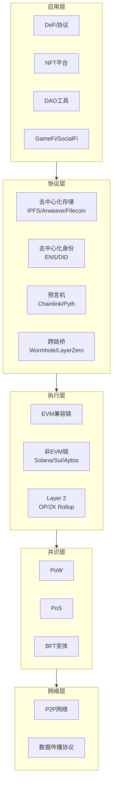
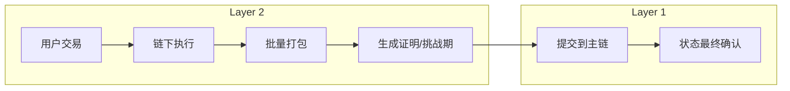

# 第27章 Web3与NFT — 深度拓展

本章是Web3与NFT知识体系的进阶篇。前三节分别讨论了Web3的技术架构演进、DAO治理机制的深层逻辑、以及NFT金融化的前沿趋势；后两节则覆盖了全球监管框架的最新动态和Web3对社会结构的深远影响。每一节都力求"道法术器"贯通——先讲清楚底层原理（道），再给出方法论框架（法），接着提供可落地的实操指南（术），最后推荐具体的工具和资源（器）。

---

## 一、Web3的技术架构深度分析

### 1.1 Web3的技术栈全景

Web3代表了互联网的第三代范式。Web1是"只读"互联网（静态网页），Web2是"读写"互联网（平台经济、用户生成内容），Web3则是"读写拥有"互联网——用户不仅创建内容，还真正拥有自己的数据、资产和身份。

从技术架构角度来看，Web3构建了一个去中心化的技术栈，涵盖了从底层基础设施到上层应用的完整体系：



**底层：区块链基础设施层**。这是Web3的技术根基，主要包括各类公链和Layer 2解决方案。公链提供了去中心化的状态存储和计算能力，而Layer 2解决方案则在不牺牲安全性的前提下大幅提升交易吞吐量并降低交易成本。

**中间层：协议层**。构建在区块链基础设施之上，提供各种去中心化协议的能力接口。这一层是Web3生态的"粘合剂"——没有去中心化存储，DApp无法托管前端和数据；没有预言机，智能合约无法获取链外信息；没有跨链桥，不同链之间的资产和信息无法流动。

**应用层：DApp层**。直接面向终端用户，包括DeFi协议（如Uniswap、Aave）、NFT平台（如OpenSea、Blur）、DAO工具（如Snapshot、Aragon）、GameFi游戏、SocialFi应用等。

| 层级 | 核心组件 | 代表项目 | 关键挑战 |
|------|---------|---------|---------|
| 网络层 | P2P通信、数据传播 | libp2p、DevP2P | NAT穿透、网络分区 |
| 共识层 | 出块、验证、终结性 | PoW、PoS、BFT | 去中心化vs性能 |
| 执行层 | 交易处理、状态转换 | EVM、Sealevel、MoveVM | 并行执行、状态膨胀 |
| 协议层 | 存储、身份、预言机 | IPFS、Chainlink、ENS | 互操作性、数据可用性 |
| 应用层 | 用户界面、业务逻辑 | Uniswap、OpenSea | 用户体验、安全审计 |

### 1.2 共识机制的演进

共识机制是区块链的核心技术之一，它决定了网络中的节点如何就交易的有效性达成一致。共识机制的设计需要在三个核心属性之间取舍——即"区块链不可能三角"：安全性（Security）、去中心化（Decentralization）、可扩展性（Scalability）。

**工作量证明（PoW）**：比特币采用的共识机制，矿工通过消耗计算资源来寻找满足条件的哈希值，找到的矿工获得出块权和区块奖励。PoW的安全性经过了十多年的实践验证——攻击比特币网络需要掌握全网51%以上的算力，当前成本超过百亿美元。但其高能耗（比特币网络年耗电量约120 TWh，相当于一个中等国家）和低吞吐量（约7 TPS）一直备受诟病。

**权益证明（PoS）**：以太坊在2022年9月"合并"（The Merge）后采用的共识机制，验证者需要质押32个ETH来获得验证资格。PoW转PoS后，以太坊的能耗降低了约99.95%。PoS通过经济激励机制保障了网络安全性——验证者如果作恶，其质押的代币将被"罚没"（Slashing）。但PoS也面临"富者愈富"的中心化风险：截至2025年，Lido等流动性质押协议控制了以太坊约30%的质押量。

**委托权益证明（DPoS）**：代币持有者投票选出一组验证者来负责出块。DPoS提高了交易处理速度（EOS声称达到4000 TPS），但牺牲了一定程度的去中心化——验证者数量通常只有21-101个。EOS、TRON等采用此机制。

**拜占庭容错类共识（BFT）**：如Tendermint BFT，适用于节点数量有限的联盟链或特定公链场景，能够在保证安全性的同时实现较高的交易吞吐量。Tendermint能够在1/3节点作恶的情况下仍然保证网络的正确运行，出块时间约6-7秒，且具有即时终结性。

**新兴共识机制**：

- **历史证明（PoH）**：Solana的核心创新，通过引入可验证的时间戳机制，在交易中嵌入时间信息，大幅减少节点之间达成共识所需的通信开销，理论上可达65,000 TPS。
- **Snowball共识**：Avalanche采用的共识协议，通过随机抽样和亚稳态决策的方式实现快速共识，具有高吞吐量和低延迟的特点。
- **Narwhal & Tusk**：Sui采用的DAG-based共识，将数据传播和交易排序分离，实现了更好的并行处理能力。

| 共识机制 | 代表链 | TPS | 出块时间 | 终结性 | 能耗 | 去中心化程度 |
|---------|-------|-----|---------|-------|------|------------|
| PoW | 比特币 | ~7 | ~10分钟 | 概率性（6确认约1小时） | 极高 | 高 |
| PoS | 以太坊 | ~30 | ~12秒 | 约15分钟（Epoch终结性） | 极低 | 中高 |
| DPoS | EOS/TRON | ~4000 | ~0.5秒 | 即时 | 低 | 低 |
| PoH | Solana | ~65,000理论值 | ~0.4秒 | ~12秒 | 低 | 中 |
| BFT | Tendermint | ~10,000 | ~6秒 | 即时 | 低 | 中低 |

### 1.3 智能合约的技术深度

智能合约是Web3的核心组件，它是一段部署在区块链上的可自动执行的代码。以太坊联合创始人Vitalik Buterin将其描述为"运行在区块链上的自动售货机"——你投入正确的输入（交易），合约按照预设规则自动产出结果。

**编程语言与虚拟机**：

- **Solidity + EVM**：以太坊及所有EVM兼容链（Polygon、BSC、Arbitrum、Optimism等）使用的开发栈。Solidity语法类似JavaScript/C++，是目前智能合约开发的主流语言。EVM是一个基于栈的虚拟机，每个操作码（Opcode）都有固定的Gas消耗。
- **Rust + Sealevel**：Solana使用的开发栈。Rust的内存安全特性使得智能合约更不容易出现安全漏洞，但学习曲线较陡。Sealevel是Solana的并行执行引擎，能够同时处理不涉及相同状态的交易。
- **Move + MoveVM**：Aptos和Sui采用的开发栈。Move语言专为数字资产设计，将资产作为"一等公民"（First-class Resource），提供了更强的类型安全保障。Move的核心创新是"资源"概念——数字资产不能被复制或丢弃，只能被转移。

**智能合约的安全性**：智能合约一旦部署就无法修改（除非使用可升级模式），因此安全性至关重要。历史上发生过多起因智能合约漏洞导致的重大安全事故：

| 事件 | 时间 | 损失金额 | 漏洞类型 |
|------|------|---------|---------|
| The DAO | 2016年6月 | 6000万美元 | 重入攻击（Reentrancy） |
| Parity多签钱包 | 2017年11月 | 1.5亿美元 | 权限控制缺陷 |
| Poly Network | 2021年8月 | 6.1亿美元 | 跨链验证逻辑漏洞 |
| Wormhole | 2022年2月 | 3.2亿美元 | 签名验证绕过 |
| Ronin Bridge | 2022年3月 | 6.25亿美元 | 验证者私钥泄露 |
| Euler Finance | 2023年3月 | 1.97亿美元 | 闪电贷+捐赠函数漏洞 |

智能合约审计已成为DeFi项目的标配。专业的审计公司（如Trail of Bits、OpenZeppelin、Consensys Diligence、Certik）通过形式化验证、模糊测试、符号执行等方法来发现潜在漏洞。审计费用通常在5万-50万美元之间，取决于合约的复杂度。

**可升级合约模式**：为了解决智能合约不可修改的问题，业界发展出了代理模式（Proxy Pattern）。核心原理是将合约的逻辑和存储分离：

- **代理合约（Proxy）**：存储所有状态变量，并通过 `delegatecall` 将调用转发给逻辑合约
- **逻辑合约（Implementation）**：包含实际的业务逻辑，可以被替换

常用的可升级模式：

- **透明代理模式（Transparent Proxy）**：由OpenZeppelin提供，管理员只能调用管理函数，普通用户只能调用逻辑函数，避免函数选择器冲突
- **UUPS模式（Universal Upgradeable Proxy Standard）**：升级逻辑放在实现合约中而非代理合约中，降低了部署成本
- **钻石模式（Diamond/EIP-2535）**：允许一个代理合约对应多个实现合约（称为"Facet"），突破了合约24KB大小限制

### 1.4 Layer 2扩展方案

以太坊的Layer 1每秒只能处理约15-30笔交易，远不能满足大规模应用的需求。Layer 2扩展方案通过在链下处理交易、定期将结果提交到链上的方式来提升吞吐量，同时继承Layer 1的安全性。



**Optimistic Rollup**：假设链下交易是有效的（"乐观"假设），只有在有人提出挑战时才进行验证。挑战期通常为7天，在此期间任何人都可以通过提交"欺诈证明"（Fraud Proof）来质疑交易的有效性。

- **Optimism（OP Mainnet）**：采用单轮欺诈证明，生态侧重于公共物品资助（RetroPGF机制）
- **Arbitrum**：采用多轮欺诈证明，争议解决效率更高，TVL长期位居Layer 2首位
- **Base**：由Coinbase基于OP Stack构建，凭借Coinbase的用户基础快速增长

Optimistic Rollup的TVL合计超过300亿美元（2025年数据），是以太坊扩容的主力方案。

**ZK Rollup**：使用零知识证明技术来验证链下交易的有效性。与Optimistic Rollup不同，ZK Rollup不需要等待挑战期，交易一旦提交到Layer 1即可获得最终确认。

- **zkSync Era**：由Matter Labs开发，支持Solidity智能合约（通过LLVM编译器将Solidity编译为ZK友好的字节码）
- **StarkNet**：由StarkWare开发，使用STARK证明系统（不需要可信设置），自研Cairo语言
- **Scroll**：专注于EVM等效性，目标是让现有以太坊应用无需修改即可迁移
- **Polygon zkEVM**：由Polygon开发，追求与EVM的高度兼容

ZK Rollup在安全性和最终性方面优于Optimistic Rollup，但技术复杂度更高，生成证明的计算成本也更高。随着硬件加速（GPU/FPGA/ASIC）和算法优化（如Nova、Plonky2等折叠方案），ZK Rollup的成本正在快速下降。

**状态通道**：参与者在链下建立一个双向支付通道，只有在开启和关闭通道时才需要链上交易。适合高频、小额的支付场景。比特币的闪电网络就是状态通道的典型应用，截至2025年闪电网络的总容量超过5000 BTC。

**Plasma**：由Vitalik Buterin和Joseph Poon提出，通过创建子链来处理交易，定期将子链的状态根提交到主链。但由于数据可用性问题和复杂的退出机制，Plasma方案已逐渐被Rollup方案取代。

| 扩展方案 | 代表项目 | 安全模型 | 最终确认时间 | 开发复杂度 | 生态成熟度 |
|---------|---------|---------|------------|----------|----------|
| Optimistic Rollup | Arbitrum, Optimism | 欺诈证明 | ~7天（快速提取需桥接） | 低（EVM兼容） | 高 |
| ZK Rollup | zkSync, StarkNet | 有效性证明 | ~数小时 | 高 | 中 |
| 状态通道 | Lightning Network | 参与者互相监督 | 即时（链下） | 中 | 中（支付为主） |
| Validium | StarkEx | 链下数据+有效性证明 | ~数小时 | 高 | 中（特定应用） |

### 1.5 账户抽象与Web3用户体验革命

传统以太坊账户分为两类：外部拥有账户（EOA，由私钥控制）和合约账户（由代码控制）。EOA的局限性在于：用户必须持有ETH来支付Gas费、私钥丢失无法恢复、每次操作都需要用户签名确认。

**ERC-4337账户抽象**通过在不修改底层协议的情况下实现智能合约钱包的功能：

- **UserOperation**：用户发起的操作意图，由Bundler（打包者）收集并批量提交到链上
- **EntryPoint合约**：全局单例合约，负责验证和执行UserOperation
- **Paymaster**：可以代用户支付Gas费，实现了"Gas费代付"和"用ERC-20代币支付Gas"

账户抽象带来的实际改进：

| 功能 | 传统EOA | 账户抽象钱包 |
|------|--------|------------|
| Gas费支付 | 必须持有ETH | 可用任意代币或由Paymaster代付 |
| 私钥恢复 | 丢失即永久丢失 | 社交恢复、多签恢复 |
| 交易批处理 | 每笔交易单独签名 | 多笔操作合并为一笔 |
| 会话密钥 | 不支持 | 可授权特定DApp的有限权限 |
| 多签授权 | 需要Gnosis Safe等 | 原生支持 |

### 1.6 MEV：区块链的"暗面"

MEV（Maximal Extractable Value，最大可提取价值）是指区块生产者通过重新排序、插入或审查交易而获得的利润。MEV是区块链生态中一个被广泛讨论但常被忽视的问题。

**MEV的主要类型**：

- **三明治攻击（Sandwich Attack）**：攻击者在目标交易前后分别插入买入和卖出交易，利用价格滑点获利。例如，检测到某用户要大额买入某代币，攻击者先买入推高价格，等用户买入后再卖出获利。
- **套利（Arbitrage）**：利用不同DEX之间的价格差异进行套利交易。
- **清算（Liquidation）**：在DeFi借贷协议中，当借款人的抵押品价值低于阈值时，清算人可以触发清算并获得奖励。
- **时间强盗攻击（Time-bandit Attack）**：矿工/验证者重新组织区块以提取历史MEV。

**MEV的解决方案**：

- **Flashbots**：创建了一个私有的交易中继网络（MEV-Share），让用户可以选择是否与搜索者分享MEV收益，避免公开的"Gas费竞标战"
- **公平排序服务（Fair Ordering）**：一些Layer 2方案（如Chainlink FSS）尝试通过去中心化的排序器来保证交易的公平排序
- **加密内存池（Encrypted Mempool）**：通过阈值加密技术对交易内容进行加密，在交易被打包进区块后再解密，防止前置交易

---

## 二、DAO的治理机制研究

### 2.1 DAO的本质与分类

DAO（去中心化自治组织）是Web3最具创新性的组织形态之一。它的核心理念是"代码即法律"——通过智能合约来定义组织的规则和治理流程，成员通过持有治理代币来参与组织的决策过程，无需依赖传统的层级管理结构。

DAO与传统公司的根本区别：

| 维度 | 传统公司 | DAO |
|------|---------|-----|
| 组织结构 | 层级制（CEO→VP→Manager→员工） | 扁平化（代币持有者→提案→投票） |
| 决策方式 | 自上而下，少数高管决定 | 自下而上，代币持有者投票 |
| 规则执行 | 法律合同+人为执行 | 智能合约自动执行 |
| 透明度 | 财务和决策不公开 | 所有交易和投票记录链上可查 |
| 成员准入 | 雇佣合同 | 持有治理代币 |
| 资金管理 | 银行账户，高管审批 | 多签钱包/智能合约金库 |

按照功能和目的，DAO可以分为以下几类：

**协议DAO**：管理去中心化协议的升级和参数调整。这是目前TVL最高、影响力最大的DAO类型。例如MakerDAO管理着DAI稳定币的发行系统，其治理决策直接影响数十亿美元的资产；Uniswap DAO管理着最大的去中心化交易所，其费用开关（Fee Switch）的开启与否是整个DeFi生态关注的焦点。

**投资DAO**：成员共同出资进行投资决策。The LAO是最早的投资DAO之一，成员每人出资一定金额的ETH，通过投票决定投资项目。MetaCartel Ventures则专注于种子期的Web3项目投资。这类DAO通过汇集成员的资金和智慧，降低了个人投资者的参与门槛——传统VC基金的最低投资额通常是数十万美元，而投资DAO可能只需要几千美元。

**社交DAO**：围绕共同兴趣或身份认同建立的社区组织。Friends with Benefits（FWB）是一个需要持有一定数量FWB代币才能加入的社交俱乐部，成员包括加密艺术家、开发者、投资人等。BanklessDAO则围绕"无银行"理念建立了一个媒体和教育社区。

**服务DAO**：提供专业服务的组织。LexDAO提供法律工程服务，Raid Guild提供Web3产品开发服务，DAOSquare提供Web3项目孵化。这类DAO本质上是"去中心化的专业服务公司"。

**收藏DAO**：集体购买和管理高价值资产。PleasrDAO以400万美元购买了Wu-Tang Clan的独家专辑，以400万美元购买了Doge原始NFT。这类DAO展示了集体所有权模式在文化资产领域的潜力。

**赠款DAO**：管理生态赠款的分配。Gitcoin DAO通过二次方融资（Quadratic Funding）机制为开源项目分配资金，Optimism的RetroPGF则根据项目已产生的影响力进行追溯性奖励。

### 2.2 治理代币的设计

治理代币是DAO治理的核心工具，其设计直接影响到治理的质量和公平性。一个好的代币设计需要在多个目标之间取得平衡：激励参与、防止操控、保持公平、确保长期可持续性。

**代币分配**：治理代币的分配方式决定了初始的权力分布。典型的分配方案：

| 分配对象 | 典型比例 | 锁仓期 | 目的 |
|---------|---------|-------|-----|
| 社区激励/空投 | 40%-60% | 无或短期 | 去中心化、吸引用户 |
| 团队/创始人 | 15%-25% | 4年（1年cliff） | 激励长期建设 |
| 投资者 | 10%-20% | 2-4年（6月-1年cliff） | 提供初始资金 |
| 国库储备 | 10%-20% | 治理控制 | 未来发展资金 |
| 生态激励 | 5%-10% | 视情况 | 合作伙伴、开发者 |

社区激励的比重越大，治理的去中心化程度越高。Uniswap的UNI代币分配中，60%分配给社区（其中43%通过治理金库、15%通过空投、2%用于流动性挖矿），是社区分配比例较高的案例。

**投票权计算**：

- **一币一票（1 Token = 1 Vote）**：最简单直接的方式，但容易被大户操控。数据显示，大多数DAO中前100个地址控制了超过90%的投票权。
- **二次方投票（Quadratic Voting）**：投票权与持有代币数量的平方根成正比。持有1个代币有1票，持有100个代币只有10票。这大幅降低了大户的相对影响力，但可能催生"女巫攻击"（Sybil Attack）——大户将代币分散到多个地址来绕过限制。
- **时间加权投票**：将代币锁定更长时间可以获得更大的投票权。例如锁定1年代币权重为1x，锁定2年为2x，锁定4年为4x。Curve的veCRV模型是这一机制的典型应用。
- **声誉投票**：根据成员的历史贡献（如参与投票、提交提案、贡献代码等）而非代币持有量来分配投票权。SourceCred和Coordinape等工具支持这种模式。

### 2.3 治理流程的优化

**提案机制**：大多数成熟的DAO采用分级提案机制，以确保提案质量并降低治理开销：

1. **想法阶段（Ideation）**：在Discourse论坛上发起讨论帖，收集社区的初步反馈和意见
2. **温度检查（Temperature Check）**：进行非正式的链下投票（通常使用Snapshot），判断社区对提案的态度。通常需要达到最低参与度（如总供应量的4%-10%）和多数同意
3. **共识检查（Consensus Check）**：细化提案细节，进行正式的链下投票，阈值通常更高
4. **链上执行（On-chain Execution）**：将通过的提案提交到链上进行有约束力的投票，通过后由Timelock合约（通常有24-48小时延迟）自动执行

**委托投票（Delegated Voting）**：考虑到大多数代币持有者没有时间或专业知识参与每一项治理决策，许多DAO允许成员将自己的投票权委托给信任的代表。Uniswap DAO有超过30万个UNI持有者，但活跃的治理代表不到100位。委托投票系统需要解决几个关键问题：委托的可撤销性、代表的责任和透明度、委托的细分程度（按议题委托vs全权委托）。

**治理最小化**：一些项目倡导"治理最小化"的理念，即尽量减少需要人工治理的参数和决策，将更多的规则编码到智能合约中自动执行。Uniswap V3的核心协议设计就遵循了这一理念——费用等级（0.01%、0.05%、0.3%、1%）是固定的，不需要治理来调整。这样可以降低治理攻击的风险，提高协议的运行效率。

### 2.4 DAO治理面临的挑战与解决方案

**参与率低**：大多数DAO的投票参与率不足10%。以Uniswap为例，多数提案的投票率在5%-8%之间，且主要由少数大户和专业代表贡献。解决方案包括：
- 激励投票：如Balancer的投票挖矿机制
- 降低参与门槛：如Gas费代付、移动端投票界面
- 简化决策：将不重要的参数决策自动化

**治理攻击**：恶意行为者可能通过闪电贷等方式临时获取大量投票权。2022年Beanstalk协议遭受治理攻击，攻击者通过闪电贷获得足够的投票权通过了一个恶意提案，转移了约1.82亿美元的资金。防御措施包括：
- 快照机制：投票权基于提案创建时的代币持有快照
- 投票延迟：提案通过后设置执行延迟期（如48小时），给社区反应时间
- 法定人数要求：提案必须达到最低投票数才能通过

**法律地位不明确**：DAO在大多数司法管辖区没有明确的法律地位。怀俄明州是美国第一个为DAO提供法律认可的州（2021年），允许DAO注册为有限责任公司（LLC）。马绍尔群岛也通过了DAO相关的立法。但全球范围内的法律框架仍在发展中，DAO成员可能面临"一般合伙"的法律风险——即每个成员都对DAO的债务和义务承担无限责任。

---

## 三、NFT的金融化趋势

### 3.1 NFT金融化的背景

NFT从2021年的狂热期（当年交易量超过250亿美元）回归理性（2023年交易量下降至约100亿美元）后，业界开始探索NFT的金融化应用，试图为NFT赋予更多的实用价值和流动性。

NFT金融化的核心矛盾：NFT是"非同质化"的——每个NFT都是独特的，这导致其流动性远低于同质化代币。一个ERC-20代币可以在任何DEX上即时交易，但一个NFT可能需要数天甚至数周才能找到买家。NFT金融化的各种方案本质上都是在尝试解决这个流动性问题。

### 3.2 NFT碎片化

NFT碎片化（Fractionalization）是将一个高价值的NFT分割为多个同质化代币的过程。通过碎片化，普通投资者也可以参与到高价值NFT的投资中。

**工作原理**：NFT的所有者将NFT存入一个智能合约金库（Vault），合约随即铸造出一定数量的ERC-20代币，每个代币代表该NFT的一部分所有权。这些碎片化代币可以在去中心化交易所上自由交易，从而为NFT提供了流动性。

```text
原始NFT (价值100 ETH)
    │
    ▼
存入智能合约金库
    │
    ▼
铸造 10,000 个 ERC-20 代币
    │
    ▼
每个代币价值 0.01 ETH
可在 DEX 上自由交易
```

**代表项目**：

- **Fractional.art（现Tessera）**：最早期的NFT碎片化平台，支持将任意ERC-721 NFT碎片化
- **PartyBid（现PartyDAO）**：允许用户集体出资竞拍NFT，拍卖成功后自动碎片化

**碎片化面临的核心问题**：

- **法律问题**：碎片化代币是否构成证券？如果一个碎片化代币代表了一幅画的部分所有权，那它可能被SEC认定为证券，需要遵守证券法
- **赎回问题**：碎片化后如何决定NFT的处置？如果51%的代币持有者投票出售NFT，49%不同意的持有者怎么办？通常采用"买断"机制——任何人可以通过持有51%以上的碎片代币来发起赎回，以底价+溢价的方式买断其他持有者的份额
- **估值问题**：碎片化后的代币价格并不等于NFT整体价值的线性分割，因为存在流动性溢价和投机因素

### 3.3 NFT借贷

NFT借贷是NFT金融化的另一个重要方向。NFT持有者可以将自己的NFT作为抵押品，借入同质化代币。这对于需要流动性但不想出售NFT的持有者来说非常有价值——类似于用房产抵押贷款。

**点对点借贷**：借款人和出借人直接在平台上达成借贷协议。

- 代表平台：NFTfi、BendDAO（部分模式）
- 工作流程：借款人列出NFT和期望的借款金额→出借人浏览并提供贷款条件（利率、期限、LTV）→借款人接受条件→NFT锁定在智能合约中→贷款发放→到期还款（本息）取回NFT，或违约→出借人获得NFT
- 优点：利率由市场决定，定价灵活
- 缺点：匹配效率低，出借人需要主动寻找标的

**池化借贷**：类似于Aave等DeFi借贷协议的模式，但适用于NFT。

- 代表平台：BendDAO、JPEG'd
- 工作流程：出借人将资金存入借贷池→借款人将NFT存入→根据预言机价格自动发放贷款→利率由资金池的供需自动调节
- 优点：即时贷款，无需等待匹配
- 缺点：NFT估值高度主观，预言机定价困难；在市场下跌时容易引发连锁清算。2022年NFT市场下跌期间，BendDAO出现了严重的流动性危机——大量NFT触发清算但无人竞拍，出借人的资金被锁死

**租赁市场**：NFT持有者可以将NFT出租给他人使用。

- 代表项目：ReNFT（通用NFT租赁）、Double Protocol（GameFi租赁）
- 典型场景：Axie Infinity等GameFi游戏中，拥有强力NFT角色的玩家可以将角色出租给"学者"（Scholar），学者使用角色玩游戏赚取收益并与所有者分成
- 技术实现：使用"包装"（Wrapping）技术，为租户创建一个有时效性的NFT副本，租赁到期后自动失效

### 3.4 NFT衍生品

NFT衍生品市场也在快速发展，主要包括：

**NFT永续合约**：允许交易者对NFT的价格走势进行杠杆交易，而无需实际持有NFT。这为NFT市场引入了做空机制——如果交易者认为某个NFT集合被高估，可以通过做空获利。代表项目：nftperp、Tribe3。这些平台通常使用Chainlink或其他预言机来确定NFT的"指数价格"，永续合约的结算基于这个指数价格。

**NFT期权**：给予持有者在未来某个时间以特定价格买入（看涨期权）或卖出（看跌期权）NFT的权利。NFT期权可以用于对冲NFT价格波动的风险——例如，一个NFT持有者可以购买看跌期权来保护自己的NFT价值不会跌破某个底线。代表项目：Hook Protocol、Fuku。

**NFT指数**：通过追踪一篮子NFT的价格表现，为投资者提供NFT市场的整体表现参考。

| 指数 | 覆盖范围 | 计算方法 | 数据来源 |
|------|---------|---------|---------|
| NFT-500（NFTGo） | 市值前500的NFT集合 | 加权平均 | 链上交易数据 |
| Blue Chip 10 | 10个蓝筹NFT项目 | 等权平均 | OpenSea/Blur交易 |
| Art100 | 艺术类NFT | 市值加权 | 多平台综合 |

### 3.5 RWA代币化：NFT之外的资产上链

RWA（Real World Assets，真实世界资产）代币化是Web3金融化的一个重要且快速增长的方向。它将传统金融资产（如国债、房产、私募股权、艺术品等）代币化后搬到链上。

**代币化国债**：截至2025年，链上美国国债代币化产品的总规模已超过50亿美元。代表项目包括：
- **Ondo Finance的USDY**：代币化的美国国债，提供约5%的年化收益
- **BlackRock的BUIDL基金**：全球最大的资产管理公司贝莱德推出的链上货币市场基金
- **Franklin Templeton的FOBXX**：首个在公链上发行的美国政府货币基金

**代币化房产**：将房地产的所有权代币化，允许投资者以小额资金参与房地产投资。RealT平台已在以太坊上代币化了数百处美国房产，投资者可以低至50美元起投，并按持有比例获得租金收益。

**代币化私募股权**：将私募基金的份额代币化，提高二级市场的流动性。KKR、Hamilton Lane等传统私募巨头已开始在Avalanche等链上试点基金代币化。

### 3.6 NFT金融化的风险

NFT金融化在创造新机会的同时也带来了新的风险：

**估值风险**：NFT的估值高度主观且波动剧烈。Bored Ape Yacht Club（BAYC）的地板价从2022年4月的约150 ETH暴跌至2023年底的约30 ETH，跌幅超过80%。当NFT作为抵押品时，这种剧烈波动可能导致借贷协议出现大量坏账。

**流动性风险**：在市场低迷时期，NFT可能面临严重的流动性不足。2022年下半年，即使是蓝筹NFT项目，每日交易量也可能降至个位数。当借贷协议中的NFT触发清算时，如果没有人愿意竞拍，出借人的资金就会被锁定。

**智能合约风险**：NFT金融化涉及复杂的智能合约交互——NFT存入、碎片化、借贷、清算等多个环节的合约需要无缝协作，任何环节的漏洞都可能导致资金损失。

**监管风险**：NFT金融化产品可能被归类为证券或金融衍生品。2023年SEC对NFT项目Impact Theory的执法行动（指控其NFT构成未注册证券）表明，监管机构已开始关注NFT领域。

---

## 四、Web3的监管框架

### 4.1 全球监管格局概览

Web3的监管环境正在快速演变，不同国家和地区采取了差异化的监管策略。理解监管格局对于Web3从业者和投资者至关重要——合规是长期生存的前提。

| 地区 | 监管态度 | 核心监管机构 | 主要法规 | 关键要求 |
|------|---------|------------|---------|---------|
| 美国 | 分散、不确定 | SEC、CFTC、FinCEN、IRS | 证券法、商品交易法、银行保密法 | Howey测试判断证券属性 |
| 欧盟 | 全面、统一 | ESMA、EBA | MiCA（2024-2025实施） | 发行、交易、稳定币全面规范 |
| 中国 | 禁止交易，支持区块链技术 | 人民银行、网信办 | 2021年联合通知 | 禁止加密货币交易和挖矿 |
| 香港 | 开放、发牌制 | SFC | 虚拟资产交易平台发牌制度 | VASP持牌经营 |
| 新加坡 | 亲创新、审慎 | MAS | 《支付服务法》 | 服务提供商持牌 |
| 日本 | 严格、系统 | FSA | 《资金结算法》《金融商品交易法》 | 交易所注册、资产分离保管 |
| 阿联酋 | 积极吸引 | VARA（迪拜） | 迪拜虚拟资产法 | VASP许可制度 |
| 韩国 | 严格、趋紧 | FSC | 《虚拟资产用户保护法》 | 实名账户、上币审查 |

### 4.2 证券属性的认定

Web3监管中最核心的问题之一是：加密资产是否构成证券？这个问题的答案直接决定了一个项目需要遵守哪些法律法规。

美国的"Howey测试"是判断加密资产是否为证券的主要标准。根据1946年SEC v. W.J. Howey Co.案确立的判例，如果一项投资满足以下四个条件，则构成证券：

1. **投入资金**（Investment of Money）
2. **投资于共同事业**（Common Enterprise）
3. **期望获得利润**（Expectation of Profits）
4. **利润主要来源于他人的努力**（Derived from Efforts of Others）

SEC主席Gary Gensler多次表示，除比特币外，大多数加密资产都可能构成证券。这一立场引发了行业的广泛争议。关键案例：

- **SEC v. Ripple（2020-2023）**：SEC指控Ripple的XRP代币是未注册证券。2023年7月法院裁定：向机构投资者出售XRP构成证券发行，但在交易所向散户出售不构成。这一"部分胜诉"的判决对行业有重大意义。
- **SEC v. Coinbase（2023）**：SEC指控Coinbase运营未注册的证券交易所，涉及13个代币
- **ETH是否为证券**：以太坊从PoW转向PoS后，SEC开始质疑ETH是否因质押奖励而变成证券

### 4.3 反洗钱与KYC要求

反洗钱（AML）和了解你的客户（KYC）是全球Web3监管的共同要求。FATF（金融行动特别工作组）发布的"旅行规则"（Travel Rule）要求虚拟资产服务提供商（VASP）在进行超过一定金额的交易时，收集和传输发送方和接收方的身份信息。

DeFi的匿名性与AML/KYC要求之间存在天然的矛盾。如何在保持去中心化特性的同时满足监管要求，是Web3行业面临的重大挑战。技术解决方案正在探索中：

- **零知识KYC**：用户在链下完成KYC验证，获得一个零知识证明凭证，在链上使用时只需出示证明而无需暴露身份信息
- **链上身份协议**：如Worldcoin（虹膜扫描+零知识证明）、Gitcoin Passport（基于链上行为的去中心化身份评分）
- **合规中间件**：如Chainalysis、Elliptic等链上分析工具，帮助交易所和DeFi协议进行交易监控和制裁筛查

### 4.4 稳定币监管

稳定币的监管是Web3监管的重点领域，因为稳定币是DeFi生态的基础设施，也是加密货币与法币之间的桥梁。2022年5月Terra/LUNA的崩盘事件（UST脱锚导致约400亿美元蒸发）加速了各国对稳定币的监管立法。

| 稳定币类型 | 代表 | 机制 | 监管关注点 |
|-----------|------|------|-----------|
| 法币储备型 | USDT、USDC | 1:1法币储备 | 储备透明度、审计、赎回权 |
| 加密资产超额抵押型 | DAI | 加密资产超额抵押 | 清算机制、系统性风险 |
| 算法型 | UST（已崩溃） | 算法调节供需 | 信心崩溃时的脆弱性 |
| 收益型 | sDAI、USDY | 储备+收益分配 | 证券属性、收益分配合规 |

美国正在推进的稳定币监管法案（如2023年的Clarity for Payment Stablecoins Act）要求稳定币发行方：维持充足的储备资产、定期进行审计披露、获得联邦或州级监管机构的许可。欧盟的MiCA对稳定币（特别是"重要"稳定币）提出了严格的监管要求，包括100%储备、资本金要求、赎回权利保障等。

### 4.5 税务处理

加密资产的税务处理是Web3用户普遍关心的问题。不同国家的处理方式差异较大：

**美国**：IRS将加密资产视为财产（Property）。出售或交换加密资产的资本利得需要纳税——持有超过1年为长期资本利得（税率0%-20%），不足1年为短期资本利得（按普通收入税率，最高37%）。挖矿、质押奖励、空投等视为普通收入。2025年起，交易所需要向IRS报告用户的交易信息（通过1099-DA表格）。

**欧盟**：各成员国对加密资产的税务处理差异较大。德国对持有超过1年的加密资产免征资本利得税，是"持币友好"的代表。法国对偶尔交易的加密收益征收30%的固定税率。总体趋势是将其纳入资本利得税的征收范围。

**中国**：虽然禁止加密货币交易，但如果个人通过海外平台进行交易获得收益，理论上仍需要申报纳税。中国的个人所得税法规定全球收入都需要申报，但实际执法中对加密货币收入的监管力度有限。

**实用建议**：无论在哪个国家，建议Web3用户保留所有交易的完整记录（包括交易哈希、时间、金额、对手方等），使用专业的加密税务工具（如Koinly、CoinTracker、TokenTax）来计算税务义务，并在有疑问时咨询专业的税务顾问。

---

## 五、Web3的社会影响

### 5.1 金融普惠

Web3最深远的社会影响之一是推动金融普惠。全球仍有约14亿成年人没有银行账户（世界银行2021年数据），他们被排斥在传统金融体系之外。Web3通过去中心化的方式，让任何拥有互联网连接的人都可以访问金融服务。

**跨境汇款**：传统的跨境汇款手续费平均约为汇款金额的6.3%（世界银行数据），而使用加密货币（特别是稳定币）进行跨境转账的成本可以降至1%以下。2023年，通过区块链网络发送的稳定币转账总额超过7万亿美元，已超过PayPal的年度处理量。

**新兴市场的实际应用**：

- **尼日利亚**：尽管政府限制了银行与加密交易所的往来，尼日利亚仍是全球加密货币采用率最高的国家之一。2023年Chainalysis全球加密采用指数中，尼日利亚排名第二。当地人使用比特币和稳定币来保护储蓄免受奈拉贬值的影响、支付海外商品和服务费用。
- **阿根廷**：面临超过100%的年通胀率，阿根廷人大量使用USDT和USDC作为价值储存手段。Buenos Aires甚至有了"加密货币一条街"，商家接受加密货币支付。
- **菲律宾**：Axie Infinity在疫情期间为大量菲律宾玩家提供了收入来源，游戏公会Yield Guild Games（YGG）管理着数千名"学者"的游戏资产。

### 5.2 数字所有权

Web3通过NFT和区块链技术，首次实现了真正意义上的数字所有权。在Web2时代，用户在平台上创建的内容实际上由平台所有——如果你的Twitter账号被封禁，你失去了所有的内容和社交关系。

Web3通过NFT将数字资产的所有权记录在区块链上，用户真正拥有了自己的数字资产。这一变化的影响是深远的：

- **创作者经济**：创作者可以直接与粉丝建立联系，不再依赖平台作为中介。NFT的智能合约可以设置版税机制，创作者在每次二级市场转售中自动获得版税收入（通常5%-10%）
- **可组合性**：数字资产可以在不同的平台和应用之间自由流转。你在A游戏中购买的NFT皮肤，可能在B游戏中也能使用
- **身份和声誉**：通过SBT（Soulbound Token，灵魂绑定代币）等机制，用户的身份和声誉可以跨平台累积和迁移

### 5.3 去中心化治理的探索

DAO代表了一种全新的组织治理模式。传统的公司治理结构是层级化的，决策权集中在少数高管手中。DAO通过治理代币和智能合约，实现了更加民主和透明的治理过程。

DAO治理的实际经验和教训：

**成功案例**：MakerDAO成功管理了DAI稳定币系统超过7年，经历了多次市场剧烈波动，其治理社区通过了数百个提案来调整系统参数（如抵押率、稳定费率等），展示了去中心化治理的可行性。

**失败教训**：2022年Solana链上DEX Mango Markets遭受治理攻击——攻击者利用治理提案通过了一个恶意的借贷参数变更，然后利用这些参数操纵市场价格并提取了约1.14亿美元。这个案例暴露了治理系统设计中的脆弱性。

**DAO治理对更广泛社会的启发**：

- **二次方融资（Quadratic Funding）**：Gitcoin DAO开发的二次方融资机制已被多个公共部门关注和实验，用于更公平地分配公共资金
- **流动民主（Liquid Democracy）**：允许公民对每个议题选择直接投票或委托给信任的代表，比代议制民主更灵活
- **预测市场**：Polymarket等基于区块链的预测市场已被证明在某些场景下比传统民调更准确

### 5.4 数据主权

Web3倡导"数据主权"的理念，即用户应该拥有和控制自己的数据。在Web2时代，大型科技公司收集和利用了大量用户数据——Google知道你的搜索历史和位置，Facebook知道你的社交关系和兴趣，Amazon知道你的消费习惯。

Web3通过以下技术手段实现数据主权：

- **去中心化身份（DID）**：用户创建和控制自己的数字身份，无需依赖任何中心化的身份提供商。W3C的DID标准（2022年成为正式推荐标准）定义了去中心化标识符的格式和解析方式
- **去中心化存储**：IPFS、Arweave、Filecoin等去中心化存储网络，让用户的数据不再存储在某个公司的服务器上，而是分布式存储在全球网络中
- **选择性披露**：通过零知识证明等技术，用户可以选择性地分享数据的特定部分，而无需暴露全部信息

### 5.5 风险与挑战

Web3在带来积极社会影响的同时，也面临着诸多风险和挑战：

**诈骗与欺诈**：Web3领域的诈骗案件层出不穷。2023年加密货币诈骗造成的损失超过56亿美元（FBI IC3报告）。主要类型包括：

- **钓鱼攻击**：通过伪造的网站或消息诱骗用户签署恶意交易或泄露私钥
- **Rug Pull**：项目方在吸引资金后卷款跑路。2022年Rug Pull造成的损失约28亿美元
- **庞氏骗局**：用后来投资者的资金支付先来者的收益。最著名的是OneCoin骗局，涉案金额超过40亿美元

**技术门槛**：Web3的使用门槛仍然较高。一个新用户需要：理解钱包概念、安全备份助记词、理解Gas费机制、识别合法合约地址、防范钓鱼攻击。这对普通用户来说并不友好，限制了Web3的大规模普及。

**环境影响**：虽然以太坊转向PoS后能耗降低了99.95%，但比特币网络仍采用PoW，年耗电量约120 TWh。不过也有研究表明，比特币挖矿越来越多地使用可再生能源——据Bitcoin Mining Council估计，全球比特币挖矿的可持续能源使用率已超过60%。

**极端主义与非法活动**：加密货币的匿名性使其被用于洗钱、恐怖融资、暗网交易等非法活动。Chainalysis的数据显示，2023年加密货币非法交易总额约为246亿美元，占全部加密交易量的约0.34%。虽然绝对值不小，但相对于传统金融系统的洗钱规模（联合国估计全球GDP的2%-5%，即约2-5万亿美元），加密货币的非法使用比例实际上更低。

**系统性风险**：DeFi协议之间的深度互锁（如流动性挖矿、嵌套借贷等）可能在市场压力下产生连锁反应。2022年5月Terra/LUNA崩盘→导致Three Arrows Capital破产→导致Voyager Digital和Celsius Network破产→引发更广泛的市场恐慌。这种"去中心化但高度相关"的系统性风险是Web3生态需要认真面对的问题。

---

## 六、前沿趋势与未来展望

### 6.1 零知识证明的全面应用

零知识证明（ZKP）技术正在从Layer 2扩展方案扩展到更广泛的应用场景：

- **ZK身份**：用零知识证明来证明你的年龄>18岁而不暴露具体出生日期，或证明你的信用评分>700而不暴露具体数字
- **ZK机器学习（ZKML）**：在链上验证机器学习推理结果的正确性，而不暴露模型参数或输入数据。这为"可验证AI"打开了大门
- **ZK合规**：证明你的交易符合监管要求（如不在制裁名单上），而不暴露你的完整身份信息

### 6.2 模块化区块链

传统的单体区块链（如以太坊）将执行、共识、数据可用性等功能都集成在一层。模块化区块链将这些功能分离到不同的专用层：

- **执行层**：专注于交易处理（如Arbitrum、Optimism）
- **共识层**：专注于共识和最终性（如以太坊本身）
- **数据可用性层**：专注于确保数据可访问（如Celestia、EigenDA）
- **结算层**：专注于最终结算和争议解决

模块化设计允许每个层独立优化和扩展，有望突破"区块链不可能三角"的限制。

### 6.3 链抽象

链抽象（Chain Abstraction）的目标是让用户不需要知道自己在使用哪条链——就像今天的互联网用户不需要知道TCP/IP协议一样。具体包括：

- **统一的账户体系**：一个地址可以在所有链上使用
- **跨链意图**：用户表达"我想用ETH买这个NFT"的意图，系统自动处理最优的跨链路径
- **统一流动性**：不同链上的流动性被聚合在一起，用户获得最优的交易价格

Particle Network、Socket、LI.FI等项目正在推进链抽象的实现。

### 6.4 AI与Web3的融合

AI与Web3的融合是一个快速增长的交叉领域：

- **AI Agent**：自主的AI代理在链上执行任务，如自动化的DeFi策略优化、NFT交易、DAO治理参与
- **去中心化AI训练**：使用区块链激励机制来协调分布式AI训练。Bittensor（TAO）建立了一个去中心化的AI网络，参与者通过提供计算资源和模型获得代币奖励
- **AI生成内容的NFT化**：AI生成的图像、音乐、文本通过NFT实现所有权确认和交易
- **链上AI预言机**：将AI模型的推理结果作为预言机数据输入到智能合约中

Web3的长期发展需要在创新与监管、自由与安全、去中心化与效率之间找到平衡。技术的进步（如ZK证明、账户抽象、模块化架构）正在不断推动这些矛盾的解决。只有解决了当前面临的挑战，Web3才能真正实现其重塑互联网和社会的愿景——让每个人都能真正拥有自己的数字生活。
