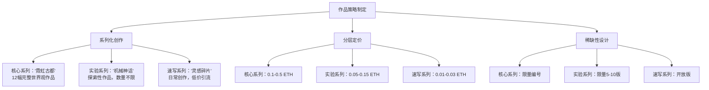
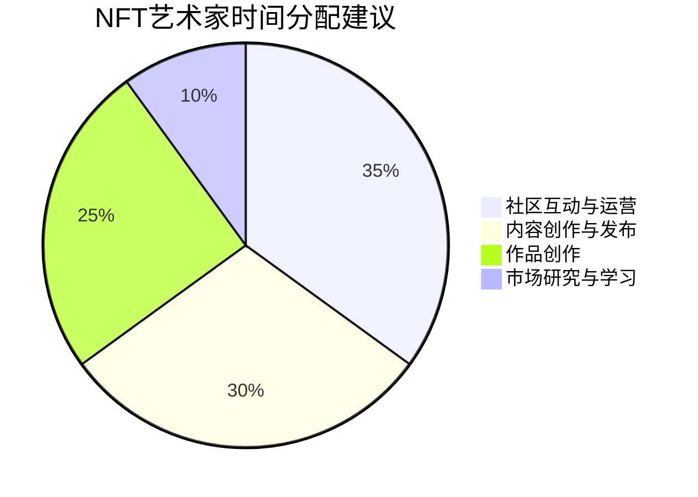

## 案例一：数字艺术家的NFT变现之路

### 案例背景

#### 人物画像

林小舟（化名），28岁，二线城市UI设计师，日常工作是为互联网公司设计App界面。业余时间热爱数字插画创作，风格偏向赛博朋克与东方美学的融合——霓虹灯下的古建筑、机械结构的龙凤图腾、数据流中的水墨山水。这些作品在微博和Lofter上积累了一定关注度（约5000粉丝），但从未产生过直接收入。

2024年初，林小舟偶然在社交媒体上看到一位数字艺术家通过NFT出售单幅作品获利超过10万元的消息，开始认真研究NFT领域的变现可能性。

#### 起点条件评估

在进入NFT领域之前，林小舟对自己的起点条件做了系统评估：

| 维度 | 现状 | 优势/劣势 |
|------|------|-----------|
| 创作能力 | 5年数字绘画经验，精通Procreate和Photoshop | 核心优势：创作质量有保障 |
| 风格辨识度 | 赛博朋克×东方美学融合风格独特 | 核心优势：差异化竞争 |
| 粉丝基础 | 微博+Lofter约5000粉丝 | 中等：有一定受众但不够大 |
| Web3知识 | 零基础，从未接触过加密货币 | 核心短板：需要从头学习 |
| 资金储备 | 可投入约5000元作为启动资金 | 中等：足够覆盖初期Gas费 |
| 时间投入 | 每天可投入2-3小时（下班后+周末） | 中等：需要高效利用 |

这个评估帮助林小舟明确了需要补齐的短板（Web3知识和社区运营能力），也确认了自己的核心竞争力（独特的艺术风格和扎实的创作功底）。

### 执行过程：从零到月入万元的五个阶段

#### 第一阶段：知识储备与基础设施搭建（第1-2周）

**目标：** 理解NFT底层逻辑，搭建必要的技术基础设施。

**具体行动：**

**1. 系统学习Web3基础知识**

林小舟没有急于行动，而是花了一周时间系统学习。学习资源和路径如下：

| 阶段 | 学习内容 | 推荐资源 | 耗时 |
|------|----------|----------|------|
| 入门认知 | NFT是什么、为什么有价值 | Bankless播客、Mirror上的入门文章 | 3小时 |
| 技术基础 | 区块链原理、智能合约概念 | 《精通以太坊》前5章 | 5小时 |
| 实操技能 | 钱包创建、Gas费、交易流程 | YouTube实操教程 | 4小时 |
| 市场认知 | NFT市场格局、主流平台、定价逻辑 | OpenSea博客、NFTGo数据 | 3小时 |

**2. 创建并配置Web3钱包**

林小舟选择了MetaMask作为主钱包，具体配置步骤：

```bash
# 1. 从官网 metamask.io 下载浏览器扩展（Chrome/Firefox）
# 2. 创建新钱包，设置强密码
# 3. 务必手写助记词（12个单词），存放在物理安全位置
# 4. 不要截图、不要云存储、不要发送给任何人
```

钱包创建后的安全配置清单：

- [ ] 助记词已手写备份并存放于保险柜
- [ ] 已启用钱包锁屏密码
- [ ] 已安装官方MetaMask（非仿冒插件）
- [ ] 已断网测试助记词恢复流程
- [ ] 已了解常见钓鱼手法（假空投、假客服）

**3. 购买初始ETH并转入钱包**

通过合规交易所（币安/OKX）购买了约0.3 ETH（当时约合人民币3500元），转入MetaMask钱包。这笔资金用于覆盖后续的铸造Gas费和平台手续费。

**4. 注册并熟悉主流NFT平台**

依次注册了以下平台并完成创作者验证：

- **OpenSea**：最大的综合NFT市场，注册最简单，支持Lazy Minting（延迟铸造，无需预付Gas费）
- **Foundation**：高端艺术NFT平台，需要邀请码或申请审核，适合定位高端的艺术家
- **Manifold**：创作者自主铸造工具，完全掌控智能合约

#### 第二阶段：作品策略制定与首批铸造（第3-4周）

**目标：** 确定作品策略，铸造并上架首批NFT作品。

**1. 制定作品策略**

经过对市场的深入研究，林小舟制定了以下作品策略：



这个分层策略的设计逻辑是：

- **核心系列** 是品牌核心，展示最高创作水准，限量发行建立稀缺性
- **实验系列** 允许尝试新风格，中等定价降低收藏者决策门槛
- **速写系列** 用于引流和社区互动，低价让更多人能够参与收藏

**2. 首批作品铸造实操**

选择了OpenSea的Lazy Minting功能作为起步，因为无需预付Gas费，降低了试错成本。

铸造时的关键配置：

| 配置项 | 设置 | 说明 |
|--------|------|------|
| 区块链 | Polygon | Gas费接近零，适合初期大量试错 |
| 版税比例 | 7.5% | 高于市场平均5%，激励创作者但不至于吓退买家 |
| 文件格式 | PNG (4000×4000px) | 保证展示质量，同时文件不会过大 |
| 属性标签 | 风格、配色、主题、情绪 | 方便收藏者筛选，增加可发现性 |
| 描述文案 | 200-300字创作故事 | 有故事的作品溢价空间更大 |

**3. 铸造过程中的实际踩坑**

林小舟在首批铸造中遇到了几个具体问题：

**问题一：图片分辨率与平台显示不匹配**

最初上传了8000×8000px的超高清图片，但OpenSea的缩略图显示效果反而不好。解决方案：主图使用4000×4000px，同时在NFT描述中提供高分辨率下载链接（存储在IPFS上）。

**问题二：Metadata中的属性设置不合理**

第一次铸造时把"赛博朋克"、"东方美学"、"霓虹"、"古建筑"都设为同一层级的属性，导致在平台筛选时逻辑混乱。改进方案：建立属性分类体系——

```text
风格属性（Style）: 赛博朋克、东方美学、融合风格
主题元素（Element）: 建筑、神兽、自然、人物
配色方案（Palette）: 霓虹暖色、冷色系、单色系
情绪基调（Mood）: 神秘、壮丽、宁静、狂野
稀有度（Rarity）: 普通、稀有、传奇
```

**问题三：IPFS存储不稳定**

初次使用Pinata免费版存储作品文件，偶尔出现加载缓慢。升级方案：同时使用NFT.Storage（免费）和Pinata（付费版），双备份确保稳定性。

#### 第三阶段：社区建设与初期销售（第5-12周）

**目标：** 建立NFT社区影响力，实现首批销售。

**1. Twitter/X社区运营**

NFT社区的核心阵地是Twitter/X。林小舟的运营策略：

**内容矩阵（每周发布计划）：**

| 周几 | 内容类型 | 目的 | 示例 |
|------|----------|------|------|
| 周一 | 创作过程分享 | 展示专业度 | Procreate录屏加速版 |
| 周二 | 行业观点/互动 | 参与社区讨论 | 对NFT艺术趋势的看法 |
| 周三 | 作品局部预览 | 制造期待感 | 新作品的细节放大图 |
| 周四 | 教程/技巧分享 | 提供价值 | "如何用Procreate画霓虹效果" |
| 周五 | 新作品发布 | 核心转化 | 新NFT上架公告 |
| 周六 | 社区互动 | 建立关系 | 转发评论其他艺术家作品 |
| 周日 | 生活/灵感分享 | 人格化 | 采风照片、灵感来源 |

**关键运营技巧：**

- 使用 #NFTArtist #DigitalArt #NFTCommunity #Web3Art 等标签
- 每天主动评论5-10位目标收藏者和艺术家的推文
- 参与Twitter Space，每周至少1次在NFT相关Space中发言
- 创建Thread长推文，分享创作背后的故事和理念

**2. Discord社区深度运营**

加入了3个核心Discord社区：

- **NFT艺术家互助群**：分享经验、互相推广
- **赛博朋克主题收藏者社区**：精准触达目标受众
- **亚洲NFT创作者社区**：语言无障碍，文化认同感强

在Discord中的运营策略不是"发完作品就走"，而是：

- 每天花30分钟在社区中回答问题、参与讨论
- 主动为其他艺术家的作品提供真诚的反馈
- 在社区AMA（Ask Me Anything）中分享自己的创作经验
- 建立自己的Discord服务器，为收藏者提供专属空间

**3. 首批销售的实际过程**

第一批6件作品在OpenSea上架后的实际销售情况：

| 时间 | 作品 | 定价 | 销售情况 | 备注 |
|------|------|------|----------|------|
| 第1周 | 速写#001 | 0.01 ETH | 未售出 | 无人关注 |
| 第1周 | 速写#002 | 0.01 ETH | 未售出 | 开始焦虑 |
| 第2周 | 速写#003 | 0.01 ETH | 以0.01 ETH售出 | 第一笔收入！买家是Discord社区认识的朋友 |
| 第3周 | 实验#001 | 0.05 ETH | 未售出 | 开始调整策略 |
| 第4周 | 实验#001（降价） | 0.03 ETH | 以0.03 ETH售出 | 降价策略有效 |
| 第5周 | 核心#001"霓虹古都·序章" | 0.1 ETH | 以0.12 ETH售出 | 拍卖溢价！信心大增 |

前6周的实际收入：0.01 + 0.03 + 0.12 = 0.16 ETH（约合人民币1900元）

这个阶段最大的收获不是收入，而是从实际交易中学到的定价经验和市场反馈。

#### 第四阶段：策略优化与规模化（第13-24周）

**目标：** 基于前期数据优化策略，实现收入稳定增长。

**1. 数据驱动的策略调整**

林小舟用表格追踪每件作品的数据表现：

```python
# 简单的数据追踪框架（Google Sheets或Notion）
作品追踪表字段 = {
    "作品名称": str,
    "系列": str,
    "铸造日期": date,
    "定价_ETH": float,
    "最终成交价_ETH": float,
    "从上架到售出_天数": int,
    "Twitter展示量": int,
    "OpenSea浏览量": int,
    "收藏者类型": str,  # 新收藏者/复购收藏者
    "引流渠道": str,    # Twitter/Discord/朋友推荐
}
```

通过数据分析发现的关键洞察：

- **最佳定价区间**：0.03-0.08 ETH的作品转化率最高（约15%），低于0.01反而给人"廉价感"
- **最佳发布时间**：UTC时间周四下午2-4点（北京时间晚上10-12点）发布的作品浏览量最高
- **最有效引流渠道**：Twitter Thread长推文带来的转化率是普通推文的3倍
- **收藏者画像**：70%是25-35岁的科技从业者，对赛博朋克风格有天然偏好

**2. 建立个人品牌网站**

使用Framer搭建了个人NFT作品展示网站（域名：linxiaozhou-art.xyz），包含：

- 作品画廊（按系列分类）
- 创作故事页面
- NFT收藏指南（降低新手收藏门槛）
- Discord/Twitter链接

这个网站的作用不是直接销售，而是建立专业形象。当潜在收藏者搜索"林小舟 NFT"时，能看到一个专业的展示页面，信任度大幅提升。

**3. 合作与联名**

主动联系了3位风格互补的NFT艺术家，策划了一次联合展览：

- **合作形式**：每人创作3件作品，主题"东方赛博：未来考古"
- **展览平台**：在OnCyber上搭建虚拟画廊
- **营销策略**：联合Twitter宣传，互相导流
- **成果**：9件作品在3天内全部售出，总成交额2.8 ETH

这次合作的收益不仅仅是收入，更重要的是：通过互相推荐，每位艺术家都获得了对方社区的曝光，粉丝增长了30-50%。

**4. 版税收入的积累**

随着二级市场交易的活跃，7.5%的版税开始产生被动收入：

| 月份 | 一级市场收入 | 版税收入 | 总收入 |
|------|-------------|----------|--------|
| 第4个月 | 0.45 ETH | 0.08 ETH | 0.53 ETH |
| 第5个月 | 0.62 ETH | 0.15 ETH | 0.77 ETH |
| 第6个月 | 0.58 ETH | 0.22 ETH | 0.80 ETH |

版税收入占比逐月提升，说明作品的二级市场流通性在增强，品牌价值在积累。

#### 第五阶段：稳定变现与模式升级（第25周至今）

**目标：** 建立可持续的收入模式，探索更多变现路径。

**1. 多平台分发策略**

不再只依赖OpenSea，而是根据作品定位选择不同平台：

| 平台 | 适合的作品类型 | 优势 | 定价策略 |
|------|---------------|------|----------|
| OpenSea | 实验系列、速写系列 | 流量大，用户基数广 | 中低价位 |
| Foundation | 核心系列高端作品 | 高端收藏者聚集 | 高价限量 |
| Manifold | 限定版/特别版 | 完全自主控制 | 灵活定价 |
| Objkt | Tezos链上的作品 | 艺术家社区氛围好 | 低价试水 |

**2. 拓展变现路径**

除了直接销售NFT，林小舟还开发了以下收入来源：

**收入来源一：定制NFT创作服务**

为品牌和项目方提供定制NFT创作，单次收费5000-20000元。通过在Twitter上展示作品风格吸引品牌方主动联系。

**收入来源二：NFT创作课程**

将积累的创作经验整理成付费课程（"赛博朋克风格数字插画入门"），定价199元，在自己的Discord社区和小报童平台上销售。

**收入来源三：实体衍生品**

将热门NFT作品制作成限量版实体画（签名编号），通过Printful按需印刷服务发货，每幅定价200-500元。

**3. 收入结构演变**

经过6个月的运营，收入结构从单一的NFT销售演变为多元化模式：

| 收入来源 | 占比 | 稳定性 | 增长潜力 |
|----------|------|--------|----------|
| NFT一级销售 | 40% | 中 | 中 |
| NFT版税收入 | 25% | 高 | 高（随作品数量累积） |
| 定制创作服务 | 20% | 中 | 高 |
| 课程/教程收入 | 10% | 高 | 中 |
| 实体衍生品 | 5% | 低 | 中 |

### 成果数据

#### 核心指标对比

| 指标 | 起步时（第1月） | 稳定期（第6月） | 增长倍数 |
|------|----------------|----------------|----------|
| 月收入 | 0 ETH（0元） | 0.8 ETH（约9600元） | - |
| NFT总销量 | 0 | 47件 | - |
| Twitter粉丝 | 120 | 3800 | 31.7倍 |
| Discord成员 | 0 | 650人（自有服务器） | - |
| 复购收藏者 | 0 | 12人 | - |
| 作品均价 | - | 0.065 ETH | - |
| 二级市场交易次数 | 0 | 23次 | - |
| 累计版税收入 | 0 | 0.45 ETH | - |

#### 投入产出分析

| 项目 | 金额/时间 |
|------|-----------|
| 初始ETH购买 | 3500元 |
| Gas费累计支出 | 约800元 |
| 工具订阅（IPFS存储、域名等） | 约600元/年 |
| 每日时间投入 | 2-3小时 |
| 6个月总收入 | 约58000元 |
| 6个月净收入 | 约53000元 |
| 时薪估算（按2.5小时/天×180天） | 约118元/小时 |

### 关键经验与可复用方法论

#### 经验一：先建立社区，再销售作品

林小舟最初犯的错误是"铸造了作品等着别人来买"。NFT市场的核心逻辑是：**你不是在卖作品，你是在经营一个社区。** 作品是社区的"入场券"，但真正让收藏者愿意付费的是他们对创作者和社区的认同。

可复用的社区建设时间分配：



很多新入行的艺术家把90%的时间花在创作上，只留10%做社区运营。这个比例应该反过来——至少在起步阶段，社区运营的重要性高于创作本身。

#### 经验二：定价是一门需要持续学习的技艺

林小舟总结的定价方法论：

**第一步：市场基准定价**

```python
# 查找同类型作品的近期成交价
# 工具：OpenSea Activity页面、NFTGo、NFT Price Floor
基准价格 = 同风格同质量作品近30天平均成交价
你的定价 = 基准价格 × (0.7 ~ 1.3)  # 根据自身知名度调整
```

**第二步：稀缺性溢价**

| 稀缺性等级 | 定价倍数 | 适用场景 |
|-----------|----------|----------|
| 开放版（不限量） | 1x | 引流作品、速写系列 |
| 限量版（5-20版） | 1.5-2x | 实验系列 |
| 独版（1/1） | 3-10x | 核心系列、特别创作 |

**第三步：动态调整**

- 每月复盘一次定价策略
- 如果作品超过14天未售出，考虑降价10-20%
- 如果作品在24小时内售出，下次同类作品可以提价20-30%

#### 经验三：叙事能力是最大的溢价因素

同样质量的作品，有故事和没故事的价格差距可达3-5倍。林小舟为每件核心作品撰写的叙事框架：

```text
1. 灵感来源（100字）：这件作品的创作灵感是什么？
2. 创作过程（150字）：经历了怎样的创作过程？遇到了什么挑战？
3. 世界观关联（100字）：这件作品在"霓虹古都"世界观中的位置
4. 隐藏细节（50字）：作品中有哪些不易发现的细节？
5. 收藏价值（50字）：为什么这件作品值得收藏？
```

#### 经验四：不要忽视Gas费管理

Gas费是NFT创作者最容易忽视的成本。林小舟的Gas费优化策略：

- **选择低Gas时段铸造**：通常UTC时间凌晨2-6点（北京时间上午10-14点）Gas费最低
- **新手首选Polygon/Tezos链**：Gas费接近零，适合大量试错
- **使用Lazy Minting**：OpenSea支持延迟铸造，买家购买时才支付Gas费
- **批量操作**：如果需要同时上架多件作品，使用Polygon的批量铸造工具

#### 经验五：建立长期关系比单次交易更重要

林小舟的收藏者关系维护策略：

- 为每位首次收藏者发送感谢DM
- 为复购收藏者提供提前预览权益
- 在Discord中设立"早期收藏者"专属频道
- 每季度为所有收藏者空投一件免费的小作品

这些动作的成本几乎为零，但显著提升了复购率和口碑传播。

### 常见误区与避坑指南

#### 误区一：急于求成，期望一夜暴富

**错误心态：** "我看到有人一幅NFT卖了几十万，我也要"

**现实情况：** 那些天价NFT是极少数个案。大多数成功的NFT艺术家都经历了3-6个月的积累期。林小舟的前6周收入不到2000元，但正是这段"低谷期"让她积累了宝贵的经验。

**正确心态：** 把NFT创作当作一个至少6个月的项目来规划，前3个月的目标不是赚钱，而是学习和建立社区。

#### 误区二：盲目跟风热门风格

**错误做法：** 看到无聊猿火了就画猴子，看到AI艺术火了就转AI

**正确做法：** 坚持自己的风格独特性。林小舟的"赛博朋克×东方美学"风格在NFT市场中是稀缺的，这恰恰是她的核心竞争力。市场永远需要差异化的创作者。

#### 误区三：只在一个平台发布

**错误做法：** 所有作品都只在OpenSea上

**正确做法：** 根据作品定位选择不同平台。高端1/1作品放在Foundation，实验作品放在OpenSea，Tezos链的作品放在Objkt。多平台分发可以触达不同类型的收藏者。

#### 误区四：忽视作品的Metadata质量

**错误做法：** 随便填个名字和描述就铸造

**正确做法：** Metadata是作品被发现和理解的关键。完整的属性标签、详细的创作故事、高质量的预览图，这些都直接影响作品在平台搜索和推荐中的表现。

#### 误区五：把NFT当成"快钱"渠道

**错误做法：** 用AI批量生成低质量图片，期望以量取胜

**正确做法：** NFT市场正在从"投机驱动"转向"价值驱动"。收藏者越来越看重作品质量、创作者的长期承诺和社区价值。低质量的批量铸造不仅难以售出，还会损害个人品牌。

### 进阶内容：从个体创作者到品牌化运营

#### 构建个人IP宇宙

林小舟的"霓虹古都"系列不仅仅是独立的画作，而是一个完整的世界观IP。每件作品都是这个宇宙的一个"碎片"，收藏者收集越多，对这个世界的理解就越完整。这种策略显著提升了收藏者的收集欲望和复购率。

IP宇宙的构建要素：

| 要素 | 具体内容 | 作用 |
|------|----------|------|
| 世界观文档 | "霓虹古都"的历史、地理、文化设定 | 为所有作品提供统一背景 |
| 角色体系 | 主要角色的设定和关系 | 增加叙事深度 |
| 时间线 | 作品对应的宇宙时间线 | 激励收藏者收集完整系列 |
| 隐藏线索 | 作品之间的彩蛋和关联 | 增加社区讨论和二次传播 |

#### 探索AI辅助创作的工作流

在建立了稳定的创作风格和社区之后，林小舟开始探索AI工具辅助创作：

```text
AI辅助创作工作流：
1. 手绘草图确定构图和创意（Procreate）
2. 使用Midjourney生成参考素材和配色方案
3. 在Photoshop中手动精修和调整
4. 手动添加独特细节和签名元素
5. 最终作品必须有至少60%是手工创作
```

关键原则：AI是工具不是替代品。作品的核心创意和最终呈现必须体现创作者的独特视角，AI只是加速了某些环节的效率。

#### 版税策略的进阶玩法

除了平台默认的版税机制，林小舟还探索了更灵活的版税设计：

- **递减版税**：首次转售10%，第二次8%，第三次6%，最低不低于3%。鼓励早期收藏，同时保持长期流动性。
- **创作者回购权**：在NFT元数据中声明创作者有权以当前地板价的80%回购作品，防止作品流入恶意持有者手中。
- **版税分享**：与合作艺术家约定联名作品的版税分配比例（通常5:5或6:4）。

### 本案例的核心启示

林小舟的案例证明了几个重要事实：

**第一，** 数字艺术NFT变现是完全可行的，但它不是一个"快速致富"的途径，而是一个需要系统规划和持续投入的长期项目。

**第二，** 创作能力只是基础，社区运营能力同样重要，甚至在起步阶段更重要。没有社区支持的优秀作品，和有社区支持的普通作品，后者的变现能力往往更强。

**第三，** 数据驱动的决策比直觉更可靠。从定价策略到发布时间，从平台选择到内容规划，都应该基于数据不断优化。

**第四，** 多元化收入结构比单一来源更可持续。NFT销售、版税、定制服务、课程收入的组合，既能分散风险，又能最大化创作者的商业价值。

**第五，** 长期主义是最有效的竞争策略。当市场从投机热潮回归理性后，真正有价值的创作者和作品会脱颖而出。坚持创作、坚持社区建设、坚持提供价值，时间会给出答案。

***
