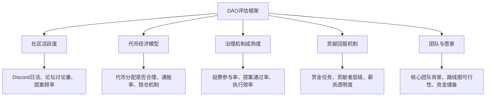
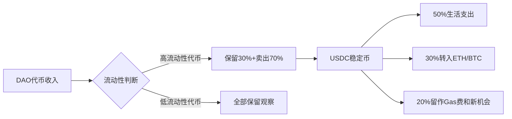
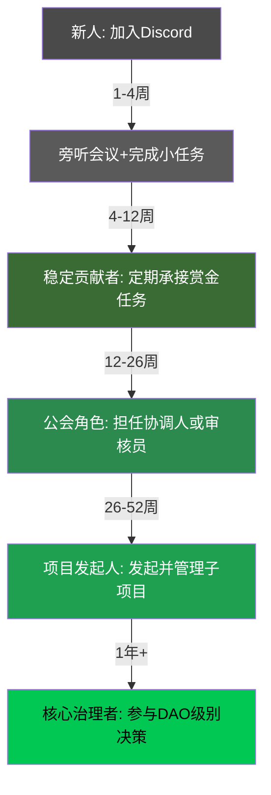

## 案例三：DAO参与者的收益故事

> DAO（去中心化自治组织）是Web3世界中最独特的组织形态之一。与传统公司不同，DAO通过智能合约治理、代币激励和社区投票来运作，任何人均可参与并从中获得收益。本案例记录了一位普通互联网从业者「阿哲」从零开始参与DAO、逐步构建多元收益来源的完整经历。

---

### 一、案例背景

#### 1.1 人物画像

阿哲，29岁，某二线城市互联网公司产品经理，日常工作涉及项目管理和需求分析。2022年初接触加密货币，持有少量ETH，对Web3有基本认知但无深度参与经验。

**初始条件：**

| 维度 | 状态 |
|------|------|
| 加密资产 | 约2 ETH（当时约6000美元） |
| 技术能力 | 不会写代码，但熟悉产品设计和文档写作 |
| 时间投入 | 工作日晚1-2小时，周末4-6小时 |
| 社交资源 | Twitter 200粉丝，无Web3圈内人脉 |
| 英语水平 | CET-6，能阅读英文文档和参与英文讨论 |

#### 1.2 为什么选择DAO

阿哲在研究Web3各赛道后，认为DAO是最适合非技术背景人士参与的方向：

- **门槛可调**：从社区贡献到治理投票，不同能力阶段都有参与空间
- **收益多元**：代币奖励、贡献者薪资、治理代币增值、空投等多渠道
- **技能复用**：产品管理、文档写作、社区运营等传统技能在DAO中高度稀缺
- **网络效应**：参与DAO能快速积累Web3人脉和行业认知

---

### 二、选择DAO的方法论

#### 2.1 DAO的分类与评估框架

阿哲在正式参与前，花了一周时间系统研究DAO生态，建立了自己的评估框架：

**按类型划分：**

| DAO类型 | 代表项目 | 收益特征 | 适合人群 |
|---------|----------|----------|----------|
| 协议治理型 | Uniswap、Aave、Compound | 代币增值为主，治理参与有额外激励 | 持币大户、DeFi深度用户 |
| 投资型 | The LAO、MetaCartel Ventures | 投资回报分红 | 有资金实力的专业投资者 |
| 服务型 | LexDAO、DAOSquare | 服务费分成+贡献者薪资 | 有专业技能的自由职业者 |
| 社区/文化型 | Friends with Benefits、BanklessDAO | 社交资本+代币激励 | 内容创作者、社区运营者 |
| 赠款型 | Gitcoin、MolochDAO | 资助金+赏金 | 开发者、公共物品建设者 |
| 工具/基础设施型 | Aragon、DAOhaus | 代币激励+生态贡献奖励 | 开发者、产品设计者 |

**阿哲的评估标准（五维模型）：**



#### 2.2 最终选择：BanklessDAO

经过对比分析，阿哲选择了BanklessDAO作为主阵地，原因如下：

1. **媒体属性强**：Bankless是Web3领域头部媒体品牌，社区内容产出需求大，阿哲的产品文档和写作能力有明确用武之地
2. **组织架构清晰**：设有多个公会（Guild），包括写作公会、产品公会、翻译公会等，便于找到定位
3. **入门友好**：有完善的新人引导流程（Season机制），不需要"社交关系"就能参与
4. **代币分配合理**：$BANK代币通过贡献获取，而非纯靠资金投入，对普通人友好
5. **社区规模适中**：既不会因太小而缺乏活力，也不会因太大而难以被看见

同时，阿哲将Gitcoin DAO作为辅助参与对象，主要利用其赏金系统获取额外收入。

---

### 三、执行过程：四个阶段的详细复盘

#### 3.1 第一阶段：潜伏学习期（第1-4周）

**目标**：熟悉DAO运作机制，找到切入点

**具体行动：**

1. **加入Discord并阅读历史消息**
   - 阿哲花3天时间阅读了BanklessDAO Discord的新人频道和公告频道
   - 整理了DAO的组织架构、公会列表、Season机制的笔记
   - 关键发现：写作公会（Writers Guild）和产品公会（Product Guild）最匹配自身技能

2. **参加每周社区会议**
   - 坚持参加写作公会的周会（每周三晚10点，北京时间）
   - 前两周只旁听不做声，记录会议要点和活跃成员
   - 第三周开始在聊天区回应他人观点，逐渐被社区认识

3. **研读治理文档和提案历史**
   - 阅读了近3个月的所有Snapshot提案
   - 了解了DAO的资金分配机制和决策流程
   - 发现了一个规律：通过率高的提案通常有明确的数据支撑和可执行方案

**关键洞察**：

> DAO的"潜伏期"不是浪费时间，而是必要的信息收集。许多新人急于贡献却因为不了解社区文化而碰壁。阿哲在潜伏期发现，BanklessDAO写作公会正缺少能做中文内容的人——这成为他的突破口。

#### 3.2 第二阶段：初步贡献期（第5-12周）

**目标**：通过实际贡献获得第一笔DAO收入

**行动一：承接翻译赏金任务**

阿哲发现写作公会有将英文文章翻译为中文的赏金任务，每个任务奖励500-2000 $BANK。

```text
任务流程：
1. 在#writers-guild频道查看可用的赏金任务列表
2. 在任务帖子下回复认领（claim）
3. 在约定时间内完成翻译并提交到指定Notion页面
4. 由公会审核员审核质量
5. 审核通过后，代币通过Coordinape或Gnosis Safe发放
```

阿哲在第5-8周承接了6篇翻译任务，平均每篇耗时3小时，获得总计约6000 $BANK（当时约120美元）。虽然金额不大，但这个过程让他：
- 熟悉了DAO的工作流程和工具链
- 与审核员和公会负责人建立了联系
- 在社区中积累了信誉值

**行动二：发起自己的内容提案**

第9周，阿哲在翻译任务中发现一个机会：BanklessDAO几乎没有中文内容输出，而中文Web3社区的需求很大。他起草了一份提案：

```markdown
## [提案] BanklessDAO 中文内容计划

### 摘要
建立中文内容输出管道，将BanklessDAO优质文章翻译并发布至Mirror中文版和微信公众号。

### 预算申请
- 翻译费用：30,000 $BANK/Season（约10篇深度文章）
- 社区运营：10,000 $BANK/Season
- 总计：40,000 $BANK

### 成功指标
- 每篇文章阅读量 > 500
- 季度末中文社区成员 > 200人
- 至少2篇文章被中文Web3媒体转载

### 执行计划
1. 组建3人翻译小组
2. 每周产出2篇翻译+1篇原创分析
3. 在Mirror和微信公众号同步发布
4. 每周向公会提交进度报告
```

提案在Snapshot投票中以78%赞成率通过。阿哲因此成为中文内容小组的负责人，获得了稳定的季度性收入。

**行动三：参与Gitcoin赏金**

利用周末时间，阿哲在Gitcoin赏金平台上寻找与产品设计相关的任务：

- 为某DeFi项目设计用户引导流程文档，获得800美元赏金
- 为某NFT平台撰写产品需求文档（PRD），获得500美元赏金
- 参与Gitcoin Grants的"打怪升级"（Gitcoin Quests），了解生态项目并获得少量代币奖励

#### 3.3 第三阶段：深度参与期（第13-26周）

**目标**：从执行者升级为决策者，建立多元收益结构

**升级一：进入治理核心层**

阿哲通过持续贡献，被选为写作公会的"公会协调人"（Guild Coordinator）之一。这个角色的职责包括：

| 职责 | 工作内容 | 时间投入 | 报酬 |
|------|----------|----------|------|
| 周会主持 | 组织每周写作公会会议、记录议程 | 2小时/周 | 2000 $BANK/月 |
| 任务分配 | 审核和分配赏金任务给贡献者 | 1小时/周 | 包含在上条 |
| 季度规划 | 参与DAO级别的季度规划会议 | 4小时/季 | 额外10000 $BANK |
| 提案审核 | 审核公会相关提案的技术可行性 | 按需 | 按提案计 |

**升级二：参与Coordinape分配**

BanklessDAO使用Coordinape进行贡献者之间的互相奖励分配。每个季度末，所有贡献者在Coordinape中互相分配GIVE token，最终按比例获得奖励池中的代币。

阿哲的策略：
- **高频率参与**：确保每周都有可见的产出（文章、翻译、会议记录）
- **建立互惠关系**：主动帮助其他贡献者校对和审核内容
- **跨公会协作**：主动与翻译公会、设计公会合作项目，扩大影响力圈

结果：在第一个完整参与的季度，阿哲通过Coordinape获得了约25000 $BANK，排名写作公会前5。

**升级三：孵化子项目**

阿哲发现中文社区成员对"如何参与DAO"有强烈需求，于是发起了一个内部项目——"DAO中文入门指南"系列：

1. 申请了5000 $BANK的项目基金
2. 招募了2名中文社区成员作为协作者
3. 产出了一系列教程内容，发布在Mirror上
4. 项目在Snapshot投票中获得高度认可

这个子项目不仅带来了直接收入，还让阿哲在DAO中的角色从"内容贡献者"升级为"项目发起人"。

#### 3.4 第四阶段：生态拓展期（第27-52周）

**目标**：从单一DAO扩展到多DAO参与，构建可持续收益结构

**策略一：跨DAO贡献**

凭借在BanklessDAO积累的声誉和作品集，阿哲开始在其他DAO中获取机会：

| DAO | 参与方式 | 收益来源 |
|-----|----------|----------|
| BanklessDAO | 公会协调人+中文内容负责人 | $BANK代币+Coordinape |
| GitcoinDAO | 赏金猎人+Grants审核志愿者 | 美元赏金+GTC代币 |
| DAOSquare | 中文社区大使 | $RICE代币 |
| Forefront | 内容分析投稿 | $FF代币 |
| MetaCartel | 小额赠款申请者 | ETH赠款 |

**策略二：代币管理**

随着持有的DAO代币种类增多，阿哲制定了代币管理策略：



**关键决策**：阿哲在$BANK价格从0.02美元涨至0.08美元时分批卖出了一半持仓（约15万 $BANK，获得约12000美元），同时保留另一半继续参与治理。这体现了"卖出回本、留币博弈"的理性策略。

---

### 四、成果数据

#### 4.1 收益全景

经过约一年的DAO参与，阿哲的收益情况如下：

| 收益来源 | 金额（美元） | 占比 | 备注 |
|----------|-------------|------|------|
| 翻译赏金 | 1,800 | 8% | 早期启动收入 |
| 内容项目基金 | 2,400 | 11% | 提案通过获得的项目资金 |
| 公会协调人报酬 | 3,600 | 16% | 月度固定报酬 |
| Coordinape分配 | 4,200 | 19% | 贡献者互评奖励 |
| Gitcoin赏金 | 3,800 | 17% | 产品设计相关赏金 |
| 代币增值变现 | 5,200 | 23% | $BANK低买高卖 |
| 其他DAO贡献 | 1,200 | 6% | 跨DAO内容和大使收入 |
| **总计** | **22,200** | **100%** | |

#### 4.2 与传统副业的对比

| 维度 | DAO参与 | 传统副业（如接私单） |
|------|---------|---------------------|
| 时间灵活性 | 高，自主选择任务和时间 | 中，需配合甲方时间 |
| 收入上限 | 无明确上限，随影响力增长 | 有天花板，受限于个人产能 |
| 人脉积累 | 全球化Web3人脉网络 | 本地化行业人脉 |
| 技能成长 | 快速学习Web3全栈知识 | 在已有技能上精进 |
| 被动收入潜力 | 高，代币增值+治理激励 | 低，停手即停收入 |
| 风险 | 高，代币价格波动+项目风险 | 低，收入稳定可预期 |
| 社交资本 | 可跨平台迁移 | 局限于特定圈子 |

#### 4.3 非财务收益

除了直接经济收益外，阿哲还获得了以下非财务收益：

- **Web3认知跃升**：从"知道区块链"到深入理解DeFi、NFT、DAO的运作机制
- **全球化网络**：结识了来自美国、欧洲、东南亚的Web3从业者，形成了跨国协作能力
- **个人品牌**：Twitter粉丝从200增长至3500，成为中文Web3圈小有名气的DAO研究者
- **职业转型基础**：积累了足够的Web3经验，后续成功跳槽至一家Web3公司担任产品负责人

---

### 五、关键经验与方法论提炼

#### 5.1 DAO参与的五条原则

1. **贡献先于索取**：DAO社区最忌讳"空投猎人"心态。先做出有价值的贡献，收益自然随之而来
2. **可见性大于能力**：在DAO中，你做的事情需要被社区看到。定期更新进度、在会议上发言、在论坛发帖，比默默做事更重要
3. **信誉是最硬的通货**：DAO是声誉驱动的组织。一次违约或低质量交付可能毁掉数月积累的信誉
4. **多元收入结构**：不要依赖单一DAO或单一收入来源。分散参与2-3个DAO，降低单点风险
5. **长期主义**：DAO参与的前期回报很低，但复利效应显著。坚持6个月以上才能看到明显回报

#### 5.2 常见错误与纠正方法

| 常见错误 | 后果 | 正确做法 |
|----------|------|----------|
| 一次性加入10个DAO | 精力分散，哪个都做不好 | 主攻1-2个，辅助参与1-2个 |
| 只做翻译等低门槛工作 | 容易被替代，收入天花板低 | 逐步升级到项目管理、提案发起等高价值工作 |
| 收到代币立即全部卖出 | 错过代币增值机会，也失去治理投票权 | 采用"卖出回本+留币博弈"策略 |
| 不参加社区会议 | 错失信息差和社交机会 | 至少参加公会级别的周会 |
| 用匿名身份参与 | 难以建立个人品牌和长期信誉 | 使用可识别的固定身份，跨平台统一 |
| 忽视治理投票 | 丧失话语权，也错过投票激励 | 参与每一轮投票，即使是小额代币 |

#### 5.3 从参与者到核心贡献者的进阶路径



每个阶段的收入结构变化：

| 阶段 | 主要收入来源 | 月均收入（美元） | 时间投入 |
|------|-------------|-----------------|----------|
| 新人期 | 无/极少 | 0-50 | 5-8小时/周 |
| 稳定贡献 | 赏金任务 | 100-300 | 8-12小时/周 |
| 公会角色 | 赏金+固定报酬 | 300-600 | 10-15小时/周 |
| 项目发起 | 项目基金+报酬+Coordinape | 500-1000 | 12-18小时/周 |
| 核心治理 | 全部收入来源+代币增值 | 1000-2000+ | 15-20小时/周 |

---

### 六、风险提示与避坑指南

#### 6.1 必须警惕的风险

**法律与合规风险**：
- 部分DAO代币可能被监管机构认定为证券，持有和交易需关注当地法规
- 来自DAO的收入在多数国家需要申报纳税，建议咨询专业税务顾问
- 中国大陆用户参与DAO需特别注意加密货币相关政策风险

**财务风险**：
- DAO代币价格波动剧烈，可能在贡献数月后发现代币价值大幅缩水
- 部分DAO可能因资金耗尽而停止运营，贡献者的历史贡献无法变现
- 智能合约漏洞可能导致DAO资金池被盗

**时间风险**：
- DAO贡献容易陷入"免费劳动陷阱"——大量时间投入但回报不确定
- 社区政治和治理纠纷可能消耗大量精力
- 需要设定明确的时间边界，避免影响主业

#### 6.2 阿哲踩过的坑

1. **坑一：过早接受大量翻译任务**。初期为了快速积累信誉，接了太多翻译工作，导致周末时间被大量占用。后来学会只接高价值任务，将简单翻译分配给新成员。
2. **坑二：忽视代币税务处理**。第一年没有记录每笔代币收入的时间和金额，到报税时难以追溯。后来使用Koinly等工具自动追踪所有链上收入。
3. **坑三：在一个提案上投入过多精力**。曾花两周准备一个大型提案，最终被社区否决。教训是先在Discord中进行非正式讨论，确认社区意向后再正式提交。

---

### 七、可复制的操作清单

如果你也想像阿哲一样通过DAO获取收益，以下是可直接执行的操作步骤：

**第1步：准备阶段（1周）**
- [ ] 创建专门用于DAO参与的Twitter账号和Discord账号
- [ ] 准备一个MetaMask或Rainbow钱包（用于接收代币）
- [ ] 列出自己的核心技能（写作、设计、开发、运营、翻译等）
- [ ] 在DeepDAO或DAOlist上浏览Top 50 DAO，选择3-5个与技能匹配的目标

**第2步：潜伏期（2-4周）**
- [ ] 加入目标DAO的Discord，阅读新人指南和组织架构
- [ ] 参加至少3次社区会议（旁听即可）
- [ ] 阅读近3个月的治理提案，了解决策流程
- [ ] 识别活跃成员和潜在导师

**第3步：首次贡献（第5-8周）**
- [ ] 在赏金板（如BanklessDAO的Notion赏金列表、Gitcoin Bounties）认领一个简单任务
- [ ] 按时高质量完成，在社区中建立首次信誉
- [ ] 主动在会议和聊天中分享自己的见解
- [ ] 完成3-5个赏金任务后，评估是否继续深入

**第4步：升级贡献（第9-16周）**
- [ ] 提出一个小型提案（如内容计划、流程优化方案）
- [ ] 申请公会内的固定角色（审核员、协调人等）
- [ ] 开始参与Coordinape等贡献者激励系统
- [ ] 同时在第二个DAO开始贡献

**第5步：生态拓展（第17周+）**
- [ ] 在3个以上DAO中保持活跃贡献
- [ ] 建立个人品牌（定期在Twitter/Mirror发布DAO相关内容）
- [ ] 管理代币资产，制定卖出和保留策略
- [ ] 复盘并优化时间投入产出比

---

### 八、案例启示

阿哲的故事证明了三件事：

1. **DAO为普通人提供了参与Web3价值创造的低门槛通道**。不需要大量资金、不需要会写代码，有专业技能和执行力就足够起步。
2. **DAO收益的本质是"分布式雇佣"**。你为全球化的去中心化组织工作，获得代币形式的报酬。理解这一点就不会对"收益"产生不切实际的幻想——它是一份需要持续投入的工作，不是躺赚。
3. **DAO参与的最大价值不是代币收入，而是认知和网络的升级**。阿哲在一年后跳槽到Web3公司，薪资涨幅60%——这才是DAO参与的长期价值所在。

> **给读者的建议**：不要抱着"暴富"心态进入DAO。把DAO当作一个学习Web3、拓展全球人脉、获取额外收入的渠道。在这个过程中，你会自然地发现更大的机会。
