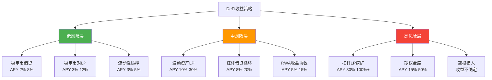
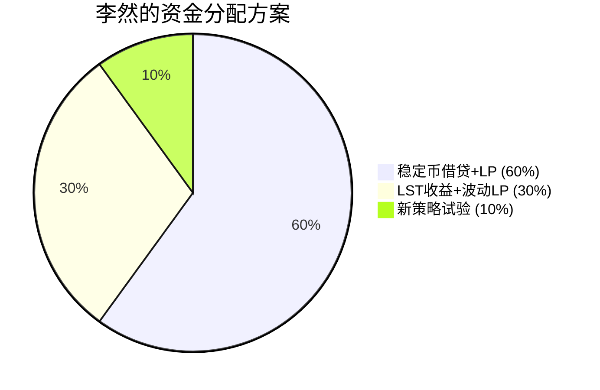

## 案例四：DeFi收益策略实践

### 案例背景

李然（化名），32岁，金融科技公司产品经理，月薪30K。2024年初通过同事介绍开始接触加密货币，先在中心化交易所（币安）完成了入门——定投BTC和ETH各约半年，对区块链的基本概念（钱包、Gas、私钥管理）已经熟悉。

与案例二中张工专注流动性挖矿不同，李然的切入点是**系统性的DeFi收益策略组合**——他不满足于单一策略的收益，而是希望构建一个完整的、多策略协同的收益组合，在不同市场环境下都能产生正向回报。

**初始条件：**

| 条件 | 详情 |
|------|------|
| 投入资金 | 约15万元（约20,500 USDC） |
| 技术背景 | 无编程基础，但逻辑思维强，擅长数据分析 |
| 风险偏好 | 中等，追求稳健增长，不追求极端收益 |
| 时间投入 | 每天20分钟检查+每周3小时深度研究 |
| 目标年化 | 12%-20%（不含代币本币价格波动） |
| 核心诉求 | 构建"全天候"收益组合，降低单一策略依赖 |

### DeFi收益策略全景图

在介绍李然的实操过程之前，有必要先厘清DeFi收益策略的完整图谱。很多新手只知"质押挖矿"或"提供流动性"，却不知道DeFi世界中收益策略的多样性远超想象。

#### 收益策略分类



#### 各策略核心特征对比

| 策略类型 | 核心机制 | 典型年化 | 主要风险 | 适合人群 | 资金效率 |
|---------|---------|---------|---------|---------|---------|
| 稳定币借贷 | 存入稳定币赚取借贷利息 | 2%-8% | 协议被黑、稳定币脱锚 | 保守型 | 低 |
| 稳定币对LP | 为USDC/USDT等提供流动性 | 3%-12% | 协议风险、极小无常损失 | 保守-中等 | 中 |
| 流动性质押 | 质押ETH获得stETH等衍生品 | 3%-5% | 脱锚风险、验证者罚没 | 保守型 | 低 |
| 波动资产LP | 为ETH/BTC等提供流动性 | 10%-30% | 无常损失、市场波动 | 中等 | 中 |
| 杠杆借贷循环 | 存入资产→借出→再存入 | 8%-20% | 清算风险、利率飙升 | 进取型 | 高 |
| 杠杆LP挖矿 | 借入资产放大LP头寸 | 30%-100%+ | 清算+无常损失叠加 | 激进型 | 极高 |
| 期权金库 | 自动卖出期权收取权利金 | 15%-50% | 期权行权亏损 | 进取型 | 中 |
| RWA协议 | 链上投资美国国债等真实资产 | 5%-15% | 监管风险、托管方风险 | 中等 | 低 |

#### 收益的三层来源

理解DeFi收益的本质，才能判断哪些收益是"真实的"，哪些是"虚幻的"：

| 收益层 | 来源 | 本质 | 可持续性 | 判断方法 |
|-------|------|------|---------|---------|
| **协议费用** | 交易手续费、借贷利差 | 真实经济活动产生的收入 | 高 | 查看协议收入数据（如Token Terminal） |
| **代币激励** | 协议增发治理代币奖励用户 | 用未来价值补贴当前用户 | 中-低 | 计算代币通胀率vs协议收入增长率 |
| **杠杆收益** | 循环借贷放大基础收益 | 风险放大器，不是独立收益来源 | 取决于基础策略 | 评估基础策略在去杠杆后是否仍盈利 |

> **核心判断公式**：真实收益 = 协议费用收益 + 激励代币变现收益 - 无常损失 - Gas费 - 工具费用。如果公式结果为正，策略可持续；如果依赖"代币价格上涨"才能盈利，那不是投资而是投机。

### 李然的策略研究与选择过程

#### 第一阶段：信息收集与框架建立（第1-3周）

李然没有急于投入资金，而是花了三周时间系统性地研究DeFi收益策略。他建立了一套自己的评估框架：

##### 1. 协议安全评估模型

李然认为安全性是一切的前提。他设计了一个百分制评估模型：

| 评估维度 | 权重 | 满分标准 | 评估方法 |
|---------|------|---------|---------|
| 合约审计 | 25分 | 经过2家以上顶级审计（Trail of Bits、OpenZeppelin、Consensys Diligence） | DeFiSafety + 项目官网 |
| 运行时间 | 20分 | 主网上线超过12个月，经历至少一次市场大跌 | DefiLlama查看TVL历史 |
| TVL规模 | 15分 | 总锁仓量超过5亿美元 | DefiLlama |
| 团队背景 | 15分 | 团队实名、有传统金融或科技公司背景 | Crunchbase + LinkedIn |
| 治理机制 | 10分 | 去中心化治理，有时间锁 | Tally/Snapshot |
| 保险覆盖 | 10分 | 有Nexus Mutual等保险可购买 | Nexus Mutual官网 |
| 社区声誉 | 5分 | GitHub活跃、Discord讨论质量高 | GitHub + Discord |

**红线规则**（任一触发直接排除）：
- 匿名团队且运行时间不足6个月
- 未经审计或仅经1家小型审计公司审计
- TVL低于5000万美元
- 有历史安全事件且未充分修复

##### 2. 收益率研究方法

李然通过以下工具和数据源研究各策略的真实收益率：

| 工具 | 用途 | 数据类型 |
|------|------|---------|
| DefiLlama | 各协议TVL和APY对比 | TVL、APY、链分布 |
| Token Terminal | 协议收入和费用数据 | 协议收入、P/S比率 |
| Dune Analytics | 链上数据分析 | 自定义查询、社区仪表盘 |
| DeBank | 个人资产追踪 | 多链资产聚合 |
| L2Beat | Layer 2安全性评估 | TVL、风险评级 |

##### 3. 李然最终选定的策略组合

经过三周研究，李然构建了一个"金字塔"式收益组合：

| 层级 | 策略 | 资金分配 | 预期年化 | 风险等级 | 核心逻辑 |
|------|------|---------|---------|---------|---------|
| 基础层 | 稳定币借贷+LP | 9万元（60%） | 5%-10% | 低 | 稳定收益底盘 |
| 增长层 | LST收益+波动LP | 4.5万元（30%） | 8%-18% | 中 | 捕获ETH生态增长 |
| 探索层 | 新策略试验 | 1.5万元（10%） | 不确定 | 高 | 学习+潜在超额收益 |



### 实战执行过程

#### 第二阶段：基础层构建（第4-6周）

##### 策略一：Aave V3 稳定币借贷（以太坊主网 + Arbitrum）

这是李然整个组合的"压舱石"，追求绝对的本金安全。

**操作逻辑**：将USDC存入Aave V3，作为贷方赚取借款人支付的利息。Aave是DeFi中运行时间最长、审计最完善、TVL最高的借贷协议之一（截至2025年TVL超过100亿美元）。

**具体操作：**

1. **钱包准备**：MetaMask + Ledger硬件钱包（所有操作通过硬件钱包签名）
2. **资金桥接**：通过官方跨链桥将USDC从以太坊主网桥接到Arbitrum（节省Gas费）
3. **存款操作**：在Aave V3（Arbitrum）界面存入50,000 USDC
4. **监控设置**：通过DeBank设置收益率变动提醒

**操作要点与细节：**

```text
操作流程：
┌─────────────────────────────────────────┐
│ 1. 连接MetaMask（硬件钱包已连接）         │
│ 2. 选择网络：Arbitrum One                │
│ 3. 选择资产：USDC                        │
│ 4. 点击"Supply"                          │
│ 5. 输入金额：50,000 USDC                 │
│ 6. 首次操作需先"Approve"授权合约          │
│ 7. 确认Supply交易，硬件钱包签名           │
│ 8. 获得aUSDC代币（代表你的存款凭证）      │
└─────────────────────────────────────────┘
```

**实际收益数据（第4-12周，共9周）：**

| 时间段 | USDC存款APY | 市场环境 | 周收益 |
|-------|-----------|---------|-------|
| 第4周 | 4.8% | 市场平稳 | 约83元 |
| 第5周 | 5.2% | ETH上涨，借贷需求增加 | 约90元 |
| 第6周 | 4.5% | 市场横盘 | 约78元 |
| 第7周 | 6.1% | 短暂波动，借贷需求上升 | 约105元 |
| 第8周 | 7.3% | 市场活跃，利用率攀升 | 约126元 |
| 第9周 | 5.8% | 回归常态 | 约100元 |
| 第10周 | 4.9% | 平稳 | 约85元 |
| 第11周 | 5.5% | 小幅波动 | 约95元 |
| 第12周 | 5.2% | 平稳 | 约90元 |

9周累计收益约852元，折算年化约**9.8%**。

> **关键发现**：Aave的存款利率是动态变化的，受资金利用率影响极大。在市场波动剧烈时（如第8周），借款需求上升，存款人获得更高利息。这意味着稳定币借贷策略在市场波动时反而收益更高——这恰好是"全天候"策略的特征。

##### 策略二：Curve + Convex 稳定币对挖矿（Arbitrum）

在Aave的基础上，李然将部分稳定币配置到Curve的稳定币池中，赚取交易手续费+CRV代币激励。

**操作逻辑**：Curve是稳定币兑换的最佳场所，交易滑点极低。作为LP，你可以赚取每笔兑换的手续费（通常0.01%-0.04%）。将LP代币质押到Convex Finance可以额外获得CVX代币奖励。

**具体操作：**

1. 在Curve（Arbitrum）的2pool（USDC/USDT）中存入20,000 USDC等值的稳定币
2. 获得2pool LP代币
3. 将LP代币存入Convex Finance（Arbitrum）的对应池中
4. 开始赚取CRV + CVX + 协议基础手续费三重收益

**操作流程示意：**

```text
资金流向：
USDC ──→ Curve 2pool ──→ 2pool LP代币 ──→ Convex Finance
                                                ↓
                                          赚取三层收益：
                                          ① Curve基础手续费 (~2% APY)
                                          ② CRV代币激励 (~4% APY)
                                          ③ CVX代币激励 (~3% APY)
                                          综合约 9% APY
```

**实际收益数据（第4-12周）：**

| 指标 | 数值 |
|------|------|
| 存入金额 | 20,000 USDC |
| 综合APY | 约9.2% |
| 9周累计收益（含代币激励） | 约318元 |
| 无常损失 | ~0（稳定币对） |
| Gas费（Arbitrum） | 约15元（操作5次） |
| 净收益 | 约303元 |

**激励代币处理策略：**

| 代币 | 处理方式 | 理由 |
|------|---------|------|
| CRV | 60%锁定veCRV提升收益，40%卖出为USDC | 锁定CRV可以投票提升自己所在池的CRV分配权重（boost） |
| CVX | 全部卖出为USDC | CVX价格波动大，不长期持有 |

> **关于veCRV机制的补充说明**：Curve的治理代币CRV可以锁定为veCRV（投票托管CRV），锁定时间越长（最长4年），获得的veCRV越多。veCRV持有者有两个核心权益：①投票决定CRV排放分配给哪些池子；②获得所在池子50%的交易手续费分成。这意味着长期锁定CRV可以显著提升你的Curve LP收益——这是"Curve Wars"的底层逻辑，也是Convex Finance存在的原因（Convex聚合了大量veCRV，为散户提供一键boost）。

#### 第三阶段：增长层构建（第7-10周）

在基础层稳定运行后，李然开始配置风险更高但收益也更高的策略。

##### 策略三：Lido stETH 流动性质押 + 再质押

**操作逻辑**：ETH质押（Staking）是维护以太坊网络安全的基础机制，质押者获得约3%-4%的年化奖励。Lido是最大的流动性质押协议——你存入ETH，获得stETH（代表你的质押ETH+累积收益），stETH可以在DeFi中自由使用，不需要等待提款周期。

**李然的两层收益叠加策略：**

```text
第一层：Lido stETH 质押
    ETH → stETH（年化约3.2%）
    ↓
第二层：EigenLayer 再质押（Restaking）
    stETH → 再质押到EigenLayer
    ↓
    获得额外的再质押奖励（约1%-3%）
    总年化：约4.2%-6.2%
```

**具体操作：**

1. 将20,000元等值的ETH（约2.7 ETH）在Lido质押，获得stETH
2. 将stETH通过EigenLayer的再质押界面进行再质押
3. 监控再质押奖励的累积情况

**实际收益数据（第7-12周，共6周）：**

| 指标 | 数值 |
|------|------|
| 投入ETH | 约2.7 ETH（约20,000元） |
| Lido基础APY | 3.2% |
| EigenLayer额外奖励 | 约2.1% |
| 综合APY | 约5.3% |
| 6周累计收益 | 约122元 |
| 无常损失 | 无（单资产质押） |
| Gas费 | 约25元 |
| 净收益 | 约97元 |

> **再质押（Restaking）风险提示**：EigenLayer再质押虽然能提升收益，但也引入了额外的"罚没风险"——如果验证者作恶，不仅Lido的stETH可能被罚没，再质押的部分也会受影响。李然评估后认为Lido的验证者运营历史良好，风险可控，因此决定参与。

##### 策略四：Uniswap V3 集中流动性（stETH/ETH对）

这是李然增长层的第二部分——在Uniswap V3上为stETH/ETH对提供集中流动性。

**为什么选择stETH/ETH对**：
- stETH和ETH高度相关（价格相关性>0.99），无常损失极低
- 该池交易量大（套利者频繁交易），手续费收益可观
- V3的集中流动性在窄区间内提供极高的资本效率

**操作参数：**

| 参数 | 设定值 | 说明 |
|------|-------|------|
| 价格区间 | 0.995-1.005（stETH/ETH比率） | 极窄区间，最大化资本效率 |
| 投入金额 | 15,000元等值 | 约一半stETH，一半ETH |
| 费率选择 | 0.05% | 该费率层最适合高相关性资产 |
| Rebalance触发条件 | 价格触及区间边缘 | 手动调整或使用Arrakis自动化 |

**实际收益数据（第7-12周）：**

| 指标 | 数值 |
|------|------|
| 投入金额 | 15,000元 |
| 手续费APY（价格在区间内时） | 约18% |
| 6周手续费收益 | 约310元 |
| 无常损失 | 约-12元（极小） |
| Gas费（含2次rebalance） | 约60元 |
| 净收益 | 约238元 |

> **操作经验**：stETH/ETH的价格比率在正常时期非常稳定，但在极端市场事件中（如2022年stETH脱锚事件）可能剧烈偏离。李然设置了价格偏离0.5%时的邮件提醒，并预设了紧急退出方案。

#### 第四阶段：探索层试验（第8-12周）

##### 策略五：Pendle Finance 收益代币化

Pendle是DeFi中较为创新的收益协议，它将收益型资产拆分为"本金代币（PT）"和"收益代币（YT）"，允许用户单独交易未来收益。

**李然的Pendle策略：**

```text
操作逻辑：
持有 stETH（年化收益约3.2%）
    ↓ 存入Pendle
拆分为：
├── PT-stETH（到期可赎回1:1的stETH，折价购买=锁定更高收益）
└── YT-stETH（获得stETH的全部收益，但本金到期归零）

李然的选择：买入PT-stETH
- 当前折价：约2.5%
- 距离到期：约4个月
- 等效年化：约7.5%（2.5% ÷ 4 × 12）
- 无常损失：无（持有到期保证赎回）
```

**为什么选择PT而非YT**：PT是"保守"策略——以折扣价买入，到期1:1赎回，收益确定。YT是"激进"策略——放大收益但本金到期归零，赌的是未来收益超出预期。李然选择PT符合他的中等风险偏好。

**实际收益数据（第8-12周）：**

| 指标 | 数值 |
|------|------|
| 投入金额 | 10,000元等值的stETH |
| 购买PT折价 | 2.3% |
| 预期到期收益 | 约230元（4个月后） |
| 当前持有期收益（5周） | 按时间比例约144元 |
| Gas费 | 约20元 |
| 净收益（持有期） | 约124元 |

##### 策略六：EigenPoints + 空投猎人策略（探索层）

这是李然最具投机性的配置。他将剩余的5,000元用于"空投猎人"策略——参与新协议的早期交互，以获得未来可能的空投代币。

**操作方法：**

1. **EigenLayer积分**：再质押stETH后自动累积EigenPoints
2. **其他新协议交互**：
   - 在新的L2（如Blast、Base）上进行桥接和Swap操作
   - 使用新兴的借贷协议进行小额借贷
   - 参与测试网活动

**风险认知**：李然将这部分资金视为"学费"——全部亏损也在可接受范围内。空投预期不确定，很多协议最终不会发币或发币后价值很低。

### 12周完整实战成果

#### 总体收益汇总

| 策略 | 投入资金 | 12周收益 | 折算年化 | 风险等级 |
|------|---------|---------|---------|---------|
| Aave稳定币借贷 | 50,000元 | 852元 | 7.4% | 低 |
| Curve+Convex稳定币LP | 20,000元 | 303元 | 6.6% | 低 |
| Lido+EigenLayer再质押 | 20,000元 | 97元（6周） | 4.2% | 低-中 |
| Uniswap V3 stETH/ETH | 15,000元 | 238元（6周） | 13.9% | 中 |
| Pendle PT策略 | 10,000元 | 124元（5周） | 10.3% | 低-中 |
| 空投猎人（探索层） | 5,000元 | 待定 | 不确定 | 高 |
| **基础层+增长层合计** | **115,000元** | **1,614元** | **~6.0%** | - |
| **Gas费+工具总支出** | - | **-280元** | - | - |
| **净收益** | **115,000元** | **1,334元** | **~5.0%** | - |

> **诚实的评价**：12周5%的年化听起来不高，但需要注意几点：①这是纯链上收益，不含ETH/BTC本身的价格上涨；②基础层占比60%追求的是绝对安全，拉低了整体年化；③增长层的实际表现（8%-14%）达到了预期。如果调高增长层占比，整体年化可以提升到8%-12%，但风险也同步增加。

#### 各策略在不同市场环境下的表现

| 市场环境 | Aave借贷 | Curve LP | Lido质押 | V3 stETH/ETH | Pendle PT |
|---------|---------|---------|---------|-------------|-----------|
| 牛市（高波动） | ✅利率上升，收益增加 | ✅交易量大，手续费多 | ✅正常 | ⚠️可能触及区间边缘 | ✅收益增加 |
| 熊市（低迷） | ⚠️利率下降 | ⚠️交易量减少 | ✅正常 | ✅stETH/ETH稳定 | ✅正常 |
| 极端暴跌 | ⚠️可能有坏账 | ⚠️短暂脱锚风险 | ⚠️stETH可能脱锚 | ❌需紧急退出 | ✅持有到期保证 |
| 横盘震荡 | ✅正常 | ✅正常 | ✅正常 | ✅最适合的环境 | ✅正常 |

**全天候特征**：这个组合在大多数市场环境下都能产生正向收益。牛市中借贷利率上升和交易量增加带来额外收益；熊市中虽然收益下降，但本金安全性高；极端暴跌是唯一需要警惕的环境，但通过监控和预设退出方案可以控制损失。

### 风险事件复盘

#### 事件一：stETH短时脱锚预警

第9周，以太坊网络出现短暂拥堵，stETH在Curve上的价格偏离了0.8%（正常波动范围<0.3%）。

**李然的应对：**
- 立即检查了Uniswap V3的stETH/ETH头寸——价格仍在0.995-1.005区间内，暂时安全
- 通过Dune Analytics查询了stETH的总供应量和Lido的ETH余额——数据正常，脱锚是暂时的流动性问题而非基本面问题
- 决定不恐慌撤出，保持观察
- 4小时后stETH价格恢复正常

**教训**：区分"流动性脱锚"和"信用脱锚"至关重要。流动性脱锚（市场恐慌抛售导致的短期偏离）通常会恢复；信用脱锚（底层资产出了问题）才是真正的危险信号。判断方法：检查协议基本面（TVL变化、验证者状态、审计报告），而非仅看价格偏离。

#### 事件二：Gas费异常飙升

第11周，以太坊主网因一个热门NFT Mint活动导致Gas费飙升至200 Gwei以上。李然计划在Lido的一笔stETH操作需要在主网执行，但Gas费预估高达80美元。

**应对措施：**
- 推迟非紧急操作，等待Gas费回落
- 将能转移到L2的操作全部转移到Arbitrum
- 学会使用Gas费预测工具（如ultrasound.money的Gas Tracker）选择低峰时段操作

**教训**：以太坊主网的Gas费是DeFi操作中最容易被低估的成本。对于中等资金量（10万-50万元）的操作者来说，Gas费管理直接影响净收益。原则：能用L2的绝不用主网，能在Gas费低于30 Gwei时操作的绝不高峰期操作。

#### 事件三：Pendle PT到期日临近时的决策

第12周，李然的PT-stETH距离到期还有约2个月。他面临一个选择：持有到期获得确定收益，还是提前卖出PT取回流动性。

**分析过程：**
- 当前PT市场价格已从折价2.3%回升到折价1.2%（即剩余收益空间只有1.1%）
- 如果持有到期：确定获得约1.1%的剩余收益（约110元）
- 如果提前卖出：可以将资金重新配置到更高收益的策略中（如V3 stETH/ETH，年化约14%）
- 结论：考虑到剩余收益较低且资金效率不高，李然选择提前卖出PT，将资金重新分配

**教训**：PT策略的收益在买入时就已锁定大部分，随着到期日临近，剩余收益递减。当PT的年化收益低于其他策略时，应该果断迁移资金，而非执着于"持有到期"的惯性。

### 关键经验总结

#### 策略组合设计的原则

| 原则 | 说明 | 李然的实践 |
|------|------|-----------|
| 分层配置 | 按风险等级分层，低风险占大头 | 60%基础层+30%增长层+10%探索层 |
| 协议分散 | 不把所有资金放在一个协议中 | 使用5个以上协议 |
| 链分散 | 不把所有资金放在一条链上 | 以太坊主网+Arbitrum |
| 相关性控制 | 避免策略之间高度相关 | 稳定币策略+ETH策略+创新策略 |
| 流动性管理 | 保持一定比例的即时可退出资金 | 30%随时可撤（Aave+Curve） |

#### 做对了什么

| 策略决策 | 效果 | 可复制性 |
|---------|------|---------|
| 先花3周研究再投入资金 | 避免了新手常见的"追高APY"陷阱 | 极高——耐心研究是最重要的投资 |
| 基础层60%配置稳定币 | 即使增长层表现不佳，整体仍为正收益 | 高——所有风险偏好的人都应有安全垫 |
| 选择stETH/ETH对做LP | 无常损失极低，手续费收益可观 | 高——高相关性对是V3的最优选择 |
| 使用PT策略锁定收益 | 在不确定的市场中获得确定回报 | 中——需要理解Pendle的机制 |
| 激励代币及时变现 | 避免了CVX等代币的价格下跌 | 高——纪律性执行即可 |

#### 做错了什么

| 错误 | 损失/代价 | 教训 |
|------|----------|------|
| 探索层资金投入过多协议 | 5000元分散在6个协议，每个的Gas费占比过高 | 探索层也应聚焦2-3个协议，不贪多 |
| 初期未设置收益监控仪表盘 | 前2周收益数据靠手动计算，效率低 | 第一天就应搭建Dune/DeBank仪表盘 |
| Lido质押时未比较stETH和rETH | 后来发现Rocket Pool的rETH在某些时期APY更高 | 不要惯性选择"最大"的协议，定期比较 |
| V3的rebalance频率过高 | 3次rebalance消耗了约40元Gas费 | 设定合理的rebalance触发条件，避免频繁操作 |

#### 适合DeFi收益策略组合的人

- 有基本的加密货币操作经验（用过钱包、做过链上交易）
- 能理解"收益来自哪里"的基本逻辑
- 每天能花15-30分钟监控组合状态
- 能接受短期内收益低于单一激进策略（追求的是长期稳健）
- 有纪律性，能执行预设的风控规则
- 愿意持续学习新协议和新机制

#### 不适合DeFi收益策略组合的人

- 期望"存进去就不用管"——DeFi需要持续监控
- 资金量太小（<1万元）——Gas费和工具成本会吞噬大部分收益
- 追求"百倍收益"——策略组合追求的是稳健年化，不是暴富
- 无法承受本金损失——即使最安全的策略也有智能合约被黑的黑天鹅风险
- 不愿花时间学习——DeFi生态变化快，半年不学习就可能用过时策略

### 进阶策略展望

在完成12周的基础实践后，李然总结了以下进阶方向，准备在下一阶段逐步探索：

#### 方向一：杠杆收益循环（Leveraged Yield）

通过Aave存入stETH作为抵押品→借出ETH→再存入Lido获得stETH→循环操作，放大stETH的质押收益。

```text
杠杆循环示例（2倍杠杆）：
自有 10 ETH → 存入Aave
借出 5 ETH（抵押率50%）→ 存入Lido
净敞口：15 ETH的质押收益
净年化：约3.2% × 2 - 借款成本约2% = 4.4%

vs 无杠杆：3.2%
收益提升：约37.5%

风险：ETH价格大幅下跌可能触发清算
```

#### 方向二：跨协议套利

利用不同协议之间的收益率差异进行套利。例如同一资产在Aave的存款利率为3%，在Compound为4%，可以将资金从Aave迁移到Compound。更复杂的是利用Pendle的PT/YT定价偏差进行套利。

#### 方向三：RWA（真实世界资产）收益

通过Ondo Finance等协议，将稳定币投资于链上的美国国债代币化产品（如USDY），获取无风险利率（约4%-5%）。这是DeFi与传统金融融合的前沿方向。

#### 方向四：自动化收益管理

使用Yearn Finance或Beefy Finance等收益聚合器，将资金委托给智能合约自动寻找最优收益策略。优点是省心省力，缺点是需要信任聚合器的策略合约安全性，且需支付绩效费用（通常为收益的2%-20%）。

### 实操工具箱

| 用途 | 工具 | 说明 |
|------|------|------|
| 钱包 | MetaMask + Ledger | 热钱包+冷钱包组合，所有大额操作通过硬件钱包签名 |
| 资产追踪 | DeBank | 多链资产聚合视图，支持所有主流协议 |
| 收益率对比 | DefiLlama | 最全的TVL和APY数据，支持按链/类型筛选 |
| 链上分析 | Dune Analytics | 自定义仪表盘，监控协议指标和个人头寸 |
| 协议安全评估 | DeFiSafety + DeFi Risk Dashboard | 协议安全评分和风险评估 |
| 合约授权管理 | Revoke.cash | 定期清理无用的approve授权 |
| Gas费监控 | ultrasound.money + ArbGas Tracker | 选择低峰时段操作 |
| 无常损失计算 | DailyIL / CrocFinance IL Calculator | 精确计算各池的无常损失 |
| 收益代币分析 | Pendle App + DeFiLlama Yield | PT/YT定价和收益率分析 |
| 安全预警 | PeckShieldAlert / CertiKAlert / SlowMist | Twitter关注，第一时间获取安全事件信息 |
| 税务报告 | Koinly / TokenTax | 导入链上数据生成税表 |

### 资金安全底线

无论收益多高，资金安全始终是第一位的。以下是李然设定的绝对红线：

1. **单协议最大敞口不超过总资金的30%**——分散在多个协议中，任何一个协议出问题不会伤筋动骨
2. **总资产的15%永远留在冷钱包不动**——这是最后的安全垫，任何时候都不动用
3. **不参与任何未经审计或审计不足的协议**——高APY不值得冒合约被黑的风险
4. **不参与匿名团队的项目（探索层除外，且资金不超过总资产的5%）**
5. **每周检查一次合约授权**——清理不再使用的approve，防止被恶意合约利用
6. **设置DeFi协议的异动监控**——TVL骤降24小时超过20%时自动提醒，可能是安全事件的信号
7. **绝不在公共WiFi下操作DeFi**——防止中间人攻击和DNS劫持
8. **硬件钱包的助记词钢板刻录，分散存放在两个物理位置**——不存电子照片，不上传云端

### 与传统理财的收益对比

为了帮助读者理解DeFi收益策略的定位，这里与传统理财方式做横向对比：

| 对比维度 | 银行定期存款 | 余额宝/货基 | 债券基金 | DeFi收益组合 |
|---------|-----------|-----------|---------|------------|
| 典型年化 | 1.5%-2.5% | 1.5%-2.5% | 3%-5% | 5%-15% |
| 本金风险 | 极低（存款保险） | 极低 | 低-中 | 中（智能合约风险） |
| 流动性 | 差（定期锁定） | 高（T+0） | 中（T+1至T+3） | 高（链上随时操作） |
| 透明度 | 低 | 中 | 中 | 极高（链上可查） |
| 操作门槛 | 极低 | 极低 | 低 | 中-高 |
| 监管保护 | 强 | 强 | 强 | 几乎没有 |
| 7×24交易 | 否 | 否 | 否 | 是 |

> **定位认知**：DeFi收益策略的收益率高于传统理财，但代价是更高的操作复杂度和智能合约风险。它适合有一定技术认知、愿意投入时间管理、且能承受本金波动的投资者。它不是"更好的银行存款"，而是"需要你自己当基金经理"的去中心化金融。

---

DeFi收益策略不是暴富工具，而是一套需要持续学习、精心管理的金融系统。李然的案例表明，即使不追求高杠杆和高风险策略，通过合理的分层配置和严格的风险纪律，也能在DeFi中获得超越传统理财的收益——前提是你投入了足够的时间去理解每一分收益的来源和每一寸风险的边界。
