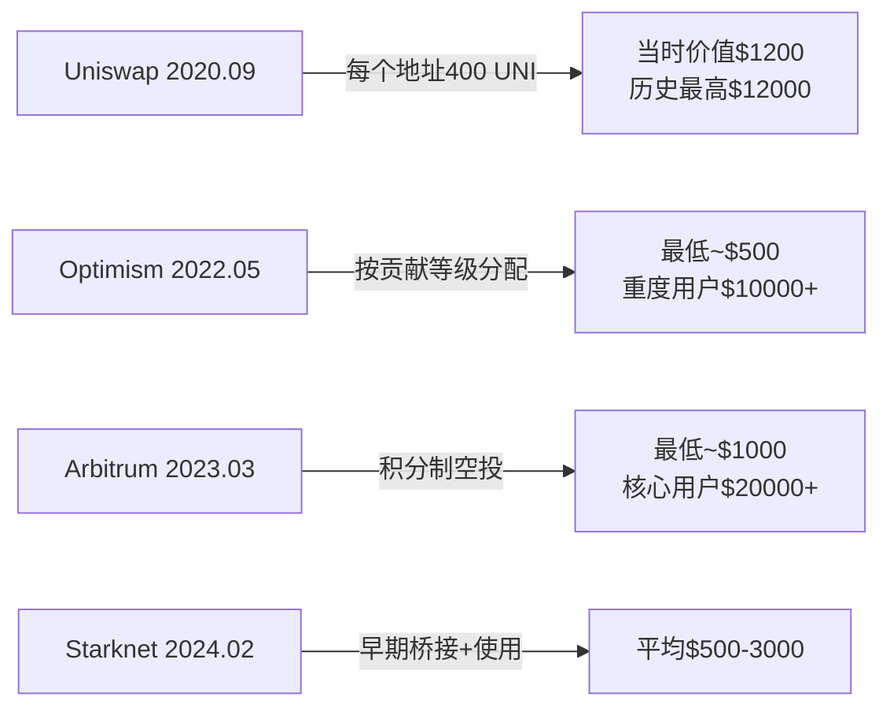
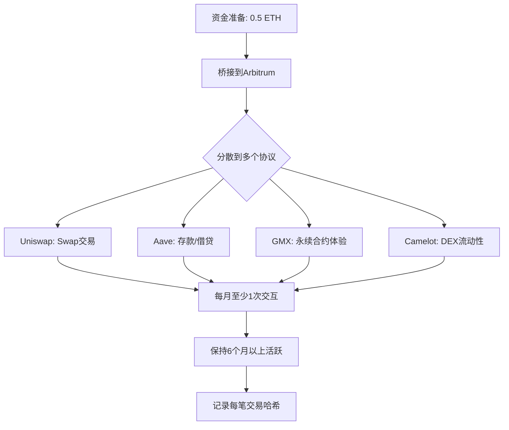
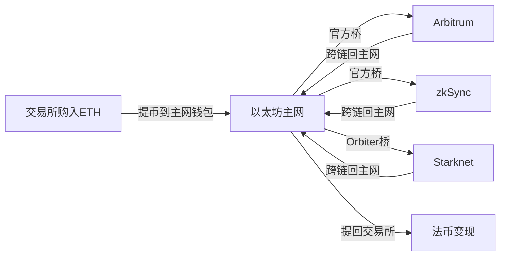

## 案例五：Web3项目早期参与

### 案例背景

小林是一名27岁的后端开发工程师，2021年底开始关注加密货币，但一直处于"观望"状态——既没有大量资金去炒币，也没有创作能力去做NFT。2022年中，他在Twitter上看到大量关于Arbitrum潜在空投的讨论，开始研究"项目早期参与"这条路径。

这条路径的核心逻辑是：在Web3项目尚未发币或正式上线之前，以用户、测试者、社区贡献者的身份深度参与项目生态，当项目代币上线时，早期参与者往往能获得代币空投作为回报。相比直接在二级市场买入代币，这种方式的资金门槛极低，但需要投入时间和精力去理解项目、完成交互、持续参与。

小林从2022年8月开始系统性地参与多个项目的早期测试和生态交互，到2024年底累计获得空投收益折合人民币约18万元，同时积累了深厚的Web3行业认知和人脉资源，成功转型为一名Web3社区运营经理。

### 理解"早期参与"的本质

#### 为什么项目方要发空投

很多初学者不理解一个基本问题：项目方为什么要免费送代币？理解这个动机，才能理解早期参与策略的底层逻辑。

**代币分发的战略目的：**

| 目的 | 说明 | 典型做法 |
|------|------|----------|
| 去中心化治理 | 避免代币过度集中在团队和VC手中 | 将30%-50%分配给社区 |
| 用户获取 | 用代币激励吸引真实用户使用产品 | 按使用量/频率分配 |
| 社区建设 | 培养忠实用户群体，形成网络效应 | 奖励社区贡献者 |
| 代币持有者分散 | 交易所上市条件之一 | 广泛空投增加持币地址数 |
| 数据积累 | 吸引用户在链上产生交互数据 | 任务型空投 |

**经典案例对比：**



#### 早期参与的主要类型

并非所有"早期参与"都是一样的。根据投入方式和回报预期，可以分为以下几类：

**1. Testnet测试网参与**

在项目主网上线前，使用测试网代币体验产品功能。测试网代币免费获取，资金成本为零，但需要理解测试网的操作流程。

- 优点：零成本，适合新手入门
- 缺点：很多项目不奖励测试网用户，需要筛选
- 典型周期：测试网到主网上线通常6-18个月
- 代表案例：Starknet早期测试网参与者获得STRK空投

**2. 主网交互（Airdrop Farming）**

在项目主网上线后、代币上线前，真实使用协议功能。这是最主流的早期参与方式。

- 优点：项目方最看重主网真实用户
- 缺点：需要真实资金进行链上操作（Gas费、桥接费等）
- 典型周期：3-12个月
- 代表案例：Arbitrum空投奖励了主网桥接和交互用户

**3. 社区贡献型参与**

通过内容创作、翻译、社区管理、Bug反馈等方式为项目做贡献。

- 优点：建立深度行业关系，收益不局限于代币
- 缺点：需要特定技能（写作、设计、开发等）
- 典型周期：持续性投入
- 代表案例：Gitcoin贡献者获得多次空投

**4. 节点/验证者参与**

运行项目的验证节点或排序器，为网络提供去中心化安全保障。

- 优点：收益稳定，技术门槛带来竞争壁垒
- 缺点：需要技术能力和服务器资源
- 典型周期：长期
- 代表案例：Celestia轻节点运行者获得TIA空投

**5. 早期投资型参与（IDO/私募）**

参与项目的代币公售或种子轮投资。

- 优点：通常获得最低价格
- 缺点：锁仓期长，项目失败风险高
- 代表案例：各种Launchpad平台项目

#### 小林的选择策略

小林根据自身条件（有技术背景、无大量资金、时间有限），选择了以"主网交互为主、Testnet为辅、社区贡献为补充"的综合策略。

**选择标准：**

1. **项目质量判断**：团队背景（是否有知名开发者）、融资情况（顶级VC背书）、技术路线（是否解决真实问题）
2. **空投概率评估**：是否已经发币（未发币优先）、代币经济学中社区分配比例、是否有明确的积分系统
3. **时间成本评估**：完成一次交互的时间、需要的资金量、是否需要持续活跃
4. **竞争激烈度**：参与人数过多会稀释收益，需要在项目早期阶段介入

### 执行过程

#### 阶段一：基础知识建设（第1-2周）

小林没有急于上手操作，而是先花了两周时间系统学习：

**学习内容清单：**

- 以太坊账户体系（EOA vs 智能合约钱包）
- L2扩容方案的区别（Optimistic Rollup vs ZK Rollup）
- 跨链桥的原理和使用（官方桥 vs 第三方桥）
- DeFi基础操作（Swap、提供流动性、借贷）
- 链上数据查看（Etherscan、L2区块浏览器）
- 钱包安全（助记词管理、硬件钱包、授权管理）

**工具准备：**

| 工具 | 用途 | 备注 |
|------|------|------|
| MetaMask | 主力钱包 | 创建2-3个地址，做好隔离 |
| Rabby Wallet | 辅助钱包 | 自带风险检测和多链管理 |
| DeBank | 资产总览 | 查看所有链上资产和交互记录 |
| LayerZero | 跨链桥聚合 | 统一跨链体验 |
| Blocknative | Gas估算 | 选择低Gas时段操作 |
| Notion | 项目追踪表 | 记录每个项目的交互进展 |

#### 阶段二：第一个项目实战——Arbitrum（第3-12周）

Arbitrum是小林选择的第一个重点参与的项目。选择理由：顶级VC融资（估值12亿美元）、以太坊L2龙头、明确未发代币。

**交互策略制定：**



**具体操作记录：**

小林在Notion中建了一张详细的追踪表：

| 协议 | 操作类型 | 频率 | 资金量 | 目的 |
|------|----------|------|--------|------|
| Arbitrum官方桥 | ETH桥接 | 首次+每月补充 | 0.1-0.2 ETH | 最可能的空投权重指标 |
| Uniswap | Swap交易 | 每周2-3次 | $50-200/次 | 多协议交互增加行为多样性 |
| Aave | 存入USDC | 持续 | $200 | 展示DeFi深度使用 |
| GMX | 开仓/平仓 | 每月2-3次 | $100/次 | 交互GMX生态协议 |
| Camelot | 提供流动性 | 持续 | $150 | Arbitrum原生DEX |
| Treasure DAO | 购买NFT | 一次 | $30 | 生态内NFT交互 |

**成本控制：**

- 每月Gas费控制在$20以内（选择低峰时段操作）
- 总资金占用约$500-800（可循环使用）
- 记录每笔交易的tx hash，用于后续查询

**关键细节：**

- 不要使用机器人批量操作——项目方会检测Sybil（女巫）行为
- 交互模式要自然，模拟真实用户的使用习惯
- 关注项目的Discord和Twitter，参与社区讨论
- 完成项目方公布的Quest/任务（如有）

#### 阶段三：多项目并行（第13-30周）

在Arbitrum持续交互的同时，小林开始布局其他项目：

**项目优先级排序：**

| 优先级 | 项目 | 链 | 预估空投概率 | 预估收益 | 每月时间投入 |
|--------|------|-----|------------|----------|------------|
| P0 | zkSync Era | 以太坊L2 | 高 | $1000-5000 | 3小时 |
| P0 | Starknet | 以太坊L2 | 高 | $500-3000 | 2小时 |
| P1 | LayerZero | 跨链协议 | 中高 | $500-2000 | 2小时 |
| P1 | Scroll | 以太坊L2 | 中 | $300-1500 | 1小时 |
| P2 | Celestia | 模块化区块链 | 中 | $500-3000 | 3小时（节点） |
| P2 | EigenLayer | Restaking | 中高 | $1000-5000 | 1小时 |

**zkSync Era交互流程：**

1. 通过官方桥或Orbiter Finance桥接ETH到zkSync Era
2. 在SyncSwap上进行代币兑换
3. 在Mute.io上提供流动性
4. 在zkSync上铸造NFT（低成本展示生态参与）
5. 使用zkSync域名服务注册.zks域名
6. 参与zkSync官方的Galxe/OAT任务

**LayerZero跨链策略：**

LayerZero是跨链通信协议，通过在不同链之间桥接资产来展示协议使用：

- 使用Stargate Finance进行跨链USDC转移
- 通过LayerZero支持的桥在ETH/ARB/OP/AVAX之间转移资产
- 每月至少进行3-5次跨链操作
- 覆盖尽可能多的链（链数可能是空投权重因素）

**Celestia轻节点：**

这是一个需要一定技术能力的操作：

```bash
# Celestia轻节点安装示例（简化版）
# 1. 安装Celestia二进制文件
curl -sL https://go.dev/dl/go1.21.6.linux-amd64.tar.gz | sudo tar -C /usr/local -xz
export PATH=$PATH:/usr/local/go/bin
cd $HOME
git clone https://github.com/celestiaorg/celestia-node.git
cd celestia-node
git checkout tags/v0.12.1
make build
sudo make install

# 2. 初始化轻节点
celestia light init --p2p.network arabica

# 3. 启动轻节点
celestia light start --p2p.network arabica --core.ip <rpc-endpoint>

# 4. 提交数据到Celestia（验证节点活跃）
celestia blob submit 0x42690c204d39e4ec90f669052fe3af722ed57582 \
  "hello celestia" --p2p.network arabica
```

小林用一台便宜的VPS（$5/月）运行Celestia轻节点，每天自动提交一小条数据以保持活跃度。

#### 阶段四：收获期（第31周-第52周及以后）

**Arbitrum空投收获（2023年3月）：**

当Arbitrum宣布空投时，小林的6个月持续交互获得了回报：

| 交互指标 | 小林的数据 | 空投权重 |
|----------|-----------|----------|
| 桥接到Arbitrum | 4次 | 中 |
| 交易月数 | 6个月 | 高（>4个月加分） |
| 交易次数 | 89次 | 中高 |
| 独立协议交互数 | 8个 | 高（>4个加分） |
| 持有ARB治理提案投票 | 无 | - |
| 持有Gnosis Safe多签 | 有 | 加分 |

最终结果：获得约12,000枚ARB代币，按上线价格$1.2计算，价值约$14,400（折合人民币约10万元）。

**其他项目空投情况：**

| 项目 | 空投时间 | 获得数量 | 价值（CNY） | 投入成本 |
|------|----------|----------|------------|----------|
| Arbitrum | 2023.03 | 12,000 ARB | ~100,000 | ~3,000 |
| Optimism | 2022.05 | 800 OP | ~8,000 | ~1,500 |
| Celestia | 2023.10 | 450 TIA | ~30,000 | ~600 |
| Starknet | 2024.02 | 1,200 STRK | ~12,000 | ~2,000 |
| zkSync | 2024.06 | 3,500 ZK | ~15,000 | ~2,500 |
| EigenLayer | 2024.05 | 200 EIGEN | ~8,000 | ~1,000 |
| **合计** | - | - | **~173,000** | **~10,600** |

投入产出比约为1:16——投入约1万元（含Gas费和资金占用的机会成本），产出约17万元。

### 关键决策复盘

#### 决策一：不盲目铺量，聚焦头部项目

Web3社区中有一种做法叫"Airdrop Farming"，即同时参与几十甚至上百个项目。小林没有选择这条路。

**铺量策略 vs 聚焦策略对比：**

| 维度 | 铺量策略（50+项目） | 聚焦策略（8-10个项目） |
|------|---------------------|----------------------|
| 时间投入 | 每天3-5小时 | 每天1-2小时 |
| 资金需求 | $3000+（分散在多链多协议） | $500-1000（可循环） |
| 精力消耗 | 高，容易疲劳放弃 | 低，可持续执行 |
| 单项目深度 | 浅，可能被标记为Sybil | 深，更像真实用户 |
| 成功率 | 分散风险，但单项目收益低 | 集中风险，但单项目收益高 |
| 学习价值 | 低，走马观花 | 高，深度理解项目和行业 |

小林的结论：对于时间有限的个人参与者，聚焦5-10个经过深度研究的高质量项目，远比广撒网效果好。质量（深度交互）比数量（浅层覆盖）更重要。

#### 决策二：Sybil检测的应对

2023年后，项目方越来越重视Sybil检测（即识别批量刷空投的机器人或一人多号行为）。

**项目方常用的Sybil检测手段：**

1. **资金来源分析**：多个地址从同一地址转入资金 → 可疑
2. **行为模式分析**：多个地址在相同时间执行相同操作 → 可疑
3. **Gas使用分析**：交互模式过于规律或机械化 → 可疑
4. **地址关联分析**：多个地址交互相同的冷门协议组合 → 可疑
5. **IP/设备指纹**：同一IP操作多个地址 → 可疑
6. **链上活跃度**：只在空投快照前集中交互 → 可疑

**小林的应对策略：**

- 每个地址独立管理，不互相转账
- 交互时间分散，不固定模式
- 使用不同的RPC节点
- 每个地址有自己的交互偏好（不是所有地址都交互完全相同的协议组合）
- 交互时间跨度超过6个月，而非集中在空投前

#### 决策三：及时止盈

当空投代币到账后，小林采取了分批卖出策略：

- 空投当天卖出30%（锁定基础收益）
- 一周内再卖出30%（观察市场情绪）
- 剩余40%根据项目基本面决定长期持有或择机卖出

以Arbitrum为例：ARB空投首日价格$1.2，一周后涨到$1.5，但两个月后跌至$0.8。小林通过分批卖出获得了平均$1.15的价格，避免了全量持有到下跌的风险。

### 资金管理与成本控制

#### 精确成本核算

很多早期参与者忽视了成本管理，导致"赚了代币亏了钱"。

**成本构成分析：**

| 成本类型 | 说明 | 月均支出 | 优化方法 |
|----------|------|----------|----------|
| Gas费 | 链上交易手续费 | $30-50 | 选择低峰时段、使用L2 |
| 跨链桥费 | 资金在不同链间转移 | $10-20 | 使用官方桥（虽慢但免费/便宜） |
| 滑点损失 | Swap交易的价格差异 | $5-15 | 设置合理滑点容忍度 |
| 资金占用 | 锁定在协议中的资金 | 机会成本 | 使用稳定币降低波动风险 |
| 服务器费用 | 运行节点 | $5-10 | 选择低配VPS即可 |

**Gas优化技巧：**

- 以太坊主网Gas通常在周末和UTC凌晨（北京时间早8-10点）最低
- L2的Gas费通常是以太坊主网的1/10-1/100
- 使用Blocknative或ETH Gas Station监控Gas价格
- 设置Gas上限，避免Gas飙升时被"宰"
- 批量操作（如果协议支持multicall）

#### 资金流转方案



小林使用"轮转资金"的方式：同一笔资金在不同链和协议之间循环使用，最大化资金利用率。例如，月初将$500桥接到Arbitrum完成交互，月中跨链到zkSync完成交互，月底桥接回主网准备下一轮。

### 风险识别与应对

#### 风险一：项目不发空投

最大的风险是投入了时间和Gas费，但项目方决定不发空投或不包含你的地址。

**应对策略：**

- 不要All-in单一项目，分散到5-10个项目
- 关注项目方的公开表态——是否有"代币计划"的暗示
- 优先选择有明确积分系统或奖励计划的项目
- 即使没有空投，交互过程中学到的技能和积累的认知也是有价值的

#### 风险二：代币上线后价格暴跌

空投代币到账后价格不涨反跌。

**应对策略：**

- 空投到账后立即分批卖出（至少卖出50%）
- 不要"信仰持有"——空投代币的抛压通常很大
- 设置心理价位，到了就卖，不贪心
- 及时将利润转换为稳定币或法币

#### 风险三：智能合约风险

交互过程中，资金可能因为智能合约漏洞而损失。

**应对策略：**

- 只使用经过审计的头部协议
- 不要在协议中存放超过你能承受损失的资金
- 定期检查并撤销不必要的合约授权（使用revoke.cash）
- 关注安全社区的预警信息（如PeckShield、CertiK的警报）

#### 风险四：税务合规

空投收入在很多司法管辖区属于应税收入。

**注意事项：**

- 中国目前对加密货币交易的监管态度是禁止金融机构提供服务，但个人持有并未被明确禁止
- 空投代币在收到时可能被认定为收入，卖出时可能产生资本利得
- 建议保留所有交易记录（tx hash、时间、金额），以备未来税务申报需要
- 如果金额较大，建议咨询专业的税务顾问

#### 风险五：女巫检测误伤

即使你是真实用户，也可能因为行为模式过于规律而被误判为Sybil。

**应对策略：**

- 保持交互模式的自然多样性
- 不要在固定时间执行固定操作
- 交互的协议组合不要完全一致
- 如果项目有申诉渠道，准备好证据（交易历史、社区贡献记录）

### 进阶策略

#### 策略一：从参与者到贡献者

当小林积累了足够的行业经验后，他开始从"用户"转变为"贡献者"：

- 为项目方翻译文档（中英文）
- 在社区Discord中帮助新手解答问题
- 撰写项目使用教程和技术分析文章
- 参与治理投票和提案讨论

这种深度参与带来了额外的收益：项目方有时会专门空投给社区贡献者，而且这些贡献帮助小林建立了行业人脉，最终获得了Web3社区运营经理的全职工作机会。

#### 策略二：自动化监控

当管理的项目数量增多后，小林搭建了一套自动化监控系统：

```python
# 简化版：使用Python监控多链地址活动
import requests
from datetime import datetime

ADDRESSES = {
    "0xYourAddr1": ["ethereum", "arbitrum", "optimism"],
    "0xYourAddr2": ["zksync", "starknet"],
}

def check_recent_activity(address, chain):
    """检查地址在指定链上的最近活动"""
    # 使用DeBank API获取地址在各链上的交互
    api_url = f"https://api.debank.com/user/protocol/list?addr={address}&chain={chain}"
    headers = {"Accept": "application/json"}
    resp = requests.get(api_url, headers=headers)
    if resp.status_code == 200:
        protocols = resp.json().get("data", [])
        return {
            "address": address,
            "chain": chain,
            "protocols": [p["name"] for p in protocols],
            "count": len(protocols)
        }
    return None

def generate_weekly_report():
    """生成周报"""
    report = []
    for address, chains in ADDRESSES.items():
        for chain in chains:
            result = check_recent_activity(address, chain)
            if result:
                report.append(result)
    return report

# 每周运行一次，检查是否需要补交互
if __name__ == "__main__":
    report = generate_weekly_report()
    for item in report:
        print(f"地址 {item['address'][:8]}... 在 {item['chain']} 上 "
              f"交互了 {item['count']} 个协议")
```

#### 策略三：Layer 2生态深度参与

随着以太坊L2生态爆发，小林总结出一套L2空投的标准交互框架：

**L2标准交互清单：**

1. **桥接（必备）**：通过官方桥将ETH/USDC桥接到L2
2. **DEX交互（必备）**：在L2上的DEX进行至少10次Swap
3. **借贷协议（加分）**：存入资产并借出，展示DeFi深度使用
4. **NFT铸造（加分）**：铸造L2上的免费NFT
5. **域名注册（加分）**：注册L2专属域名（如有）
6. **治理参与（高权重）**：参与Snapshot或链上治理投票
7. **生态Quest（高权重）**：完成项目方在Galxe/Zealy上的任务
8. **持续活跃（关键）**：保持至少3个月以上的持续交互

### 从案例中提炼的方法论

#### Web3早期参与决策框架

在决定是否参与一个项目的早期阶段时，使用以下评估框架：

| 评估维度 | 权重 | 评分标准（1-5分） |
|----------|------|-------------------|
| 团队背景 | 25% | 1=匿名团队，5=顶级开发者+知名VC |
| 融资规模 | 20% | 1=无融资，5=估值$1B+ |
| 技术创新 | 15% | 1=fork项目，5=突破性技术 |
| 空投概率 | 20% | 1=已发币，5=明确暗示+积分系统 |
| 时间成本 | 10% | 1=每天1小时+，5=每月几小时 |
| 竞争程度 | 10% | 1=极度拥挤，5=早期蓝海 |

**总分 ≥ 4.0**：全力参与，保持深度交互
**总分 3.0-3.9**：选择性参与，保持适度活跃
**总分 < 3.0**：暂时观望，不投入过多资源

#### 持续学习与信息获取

早期参与者的信息优势至关重要。小林的信息来源：

**核心信息渠道：**

- **Twitter/X**：关注Web3领域KOL和项目方官方账号，这是空投信息的第一来源
- **Discord**：加入目标项目的Discord，获取第一手社区信息
- **DeFiLlama**：追踪TVL变化，识别增长中的新兴协议
- **Dune Analytics**：链上数据分析，了解协议使用情况
- **RootData**：项目融资信息和团队背景查询
- **空投聚合网站**：如earni.fi、bankless等，汇总潜在空投机会

**信息过滤原则：**

- 不轻信"保证空投"的消息——项目方的决策可能随时改变
- 多交叉验证信息源——单一来源可能有偏见或利益驱动
- 关注项目的GitHub代码提交频率——活跃开发是项目质量的重要指标
- 定期回顾和更新项目评估——每周花30分钟检查项目进展

### 常见误区与纠正

#### 误区一："多号操作=更多收益"

**错误认知**：创建多个钱包同时刷，收益翻倍。

**实际情况**：现代Sybil检测非常成熟。LayerZero在2024年空投中淘汰了超过80%的Sybil地址。多号操作不仅可能全部被标记无效，还会浪费额外的Gas费。用一个真实地址深度交互5个项目，远比用10个地址浅层交互50个项目效果好。

#### 误区二："空投就是免费的钱"

**错误认知**：不花成本就能获得空投。

**实际情况**：每一个空投都有隐性成本——Gas费、跨链费、资金占用的机会成本、时间成本。用投入产出比（ROI）而非绝对收益来衡量空投的价值。如果花了50小时和$200 Gas费，获得了价值$300的代币，时间成本可能远超收益。

#### 误区三："等到空投快照前集中操作"

**错误认知**：等空投消息确认后再去交互。

**实际情况**：多数高质量空投（如Arbitrum、zkSync）的快照时间在公告前就已经完成。等消息确认后再操作，往往已经来不及了。真正的早期参与需要持续6个月以上的稳定交互。

#### 误区四："所有链上操作都算数"

**错误认知**：随便做几笔交易就够了。

**实际情况**：项目方会筛选"真实用户"vs"刷量用户"。判断标准包括：是否使用了协议的核心功能、交互是否多样、是否参与了治理和社区活动。仅仅做几笔Swap交易，权重可能远低于深度使用借贷、LP、治理等功能的用户。

#### 误区五："空投代币应该长期持有"

**错误认知**：好项目的代币会涨，应该囤着。

**实际情况**：空投代币通常面临巨大的抛压——数十万用户同时收到免费代币，大量会选择卖出。统计显示，超过60%的空投代币在上线后一周内出现显著下跌。除非你对项目有极其深入的研究和极强的信念，否则分批卖出锁定利润是更理性的选择。

### 可复制的操作模板

#### 项目追踪表模板

在Notion或Excel中创建以下表格，持续维护：

| 项目名称 | 链 | 是否发币 | 预估空投时间 | 交互频率 | 已交互月数 | 协议数 | 预估投入 | 预估收益 | 状态 |
|----------|-----|---------|------------|----------|-----------|--------|----------|----------|------|
| zkSync Era | zkSync | 否 | 2024 Q2 | 每周2次 | 4 | 6 | $80 | $1000-5000 | 活跃 |
| LayerZero | 多链 | 否 | 2024 Q1 | 每月4次 | 3 | 3 | $60 | $500-2000 | 活跃 |
| Starknet | Starknet | 否 | 2024 Q1 | 每周1次 | 5 | 5 | $40 | $500-3000 | 活跃 |

#### 月度复盘清单

每月花30分钟完成以下检查：

1. 检查所有参与项目的最新进展和公告
2. 评估每个项目的空投概率是否发生变化
3. 计算本月的总投入（Gas费+资金成本）
4. 调整下月的交互优先级和频率
5. 检查钱包安全（授权管理、助记词备份）
6. 记录本月学到的新知识和发现的新机会

### 案例总结

小林的故事证明，Web3项目早期参与是一种资金门槛低、但需要时间和认知投入的收益方式。与直接炒币相比，它的风险更可控（最坏情况是损失Gas费），收益上限较高（单次空投可达数千至数万美元），同时还能积累宝贵的行业经验和人脉资源。

**核心成功要素：**

1. **深度研究先于操作**：不盲目跟风，先理解项目价值和空投机制
2. **聚焦优于铺量**：深度参与5-10个高质量项目，优于浅层覆盖50个
3. **持续性比爆发性重要**：保持6个月以上的稳定交互，比短期集中操作更有效
4. **成本意识贯穿始终**：记录每笔支出，控制总投入，计算真实ROI
5. **及时止盈不贪心**：空投到账后分批卖出，锁定利润
6. **安全始终第一位**：保护好私钥和助记词，定期检查合约授权

对于想进入Web3领域但缺乏资金或创作能力的人来说，项目早期参与是一条值得认真考虑的路径——它将你的时间和学习能力转化为实际收益，同时为未来在Web3行业的深入发展打下坚实基础。
