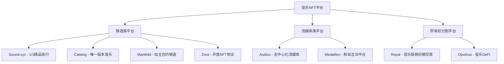
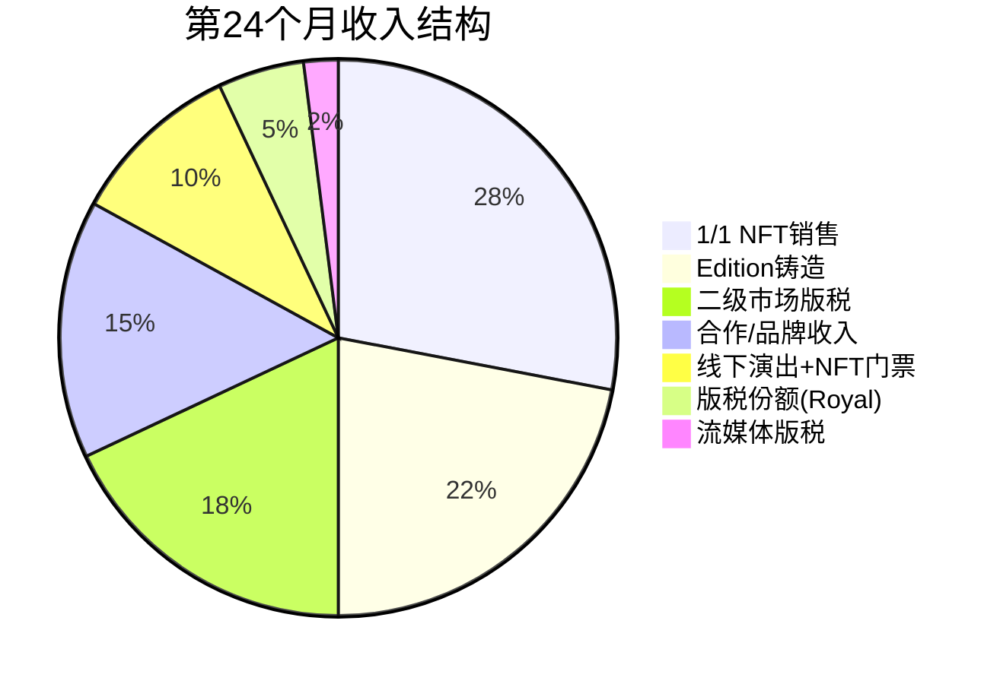

## 案例六：音乐NFT创作者的破圈之路

音乐NFT是Web3创作者经济中最具潜力的赛道之一。传统音乐产业中，独立音乐人面对唱片公司的垄断、流媒体平台极低的分成（Spotify每次播放约$0.003-$0.005），以及中间环节的层层抽成，往往难以靠创作维持生计。NFT技术为音乐人提供了一条绕过中间商、直接面向粉丝变现的新路径。本案例记录了一位独立电子音乐人从零起步，通过音乐NFT在两年内实现月收入突破5万元的完整历程。

### 1 案例背景：创作者画像与行业痛点

#### 1.1 创作者基本信息

- **身份**：独立电子音乐制作人，兼职做音乐6年
- **技能栈**：Ableton Live、FL Studio精通，有一定混音和母带处理能力
- **前期困境**：在网易云音乐、Bandcamp等平台累计播放量超50万次，但总收入不足8000元；线下演出机会少，每场报酬200-500元
- **转折点**：2023年初接触到Sound.xyz平台上的音乐NFT铸造，发现一首10分钟的ambient电子曲目以0.5 ETH（当时约6000元）被收藏

#### 1.2 音乐NFT赛道的机遇分析

| 维度 | 传统音乐产业 | 音乐NFT模式 |
|------|------------|------------|
| 分成比例 | 平台抽成70-85% | 创作者获85-100% |
| 版税结算 | 滞后3-6个月 | 即时到账 |
| 粉丝关系 | 平台拥有粉丝数据 | 直接连接持有者 |
| 二级市场收益 | 无 | 持续版税分成（5-10%） |
| 发行门槛 | 需要厂牌/发行商 | 自主发行，零门槛 |
| 社区建设 | 被动依赖平台 | 主动运营holder社区 |

#### 1.3 音乐NFT市场格局



### 2 执行过程：从零到破圈的完整路径

#### 2.1 第一阶段：学习与试水（第1-2个月）

**目标**：理解音乐NFT生态，完成第一次铸造。

**具体步骤**：

**Step 1：搭建Web3基础设施**

```bash
# 基础设施搭建清单
1. 安装MetaMask浏览器插件钱包
2. 购买少量ETH（约0.1 ETH用于Gas费和测试）
3. 注册Sound.xyz账号并连接Twitter
4. 注册Catalog账号
5. 注册Manifold Studio账号
6. 创建专门的Twitter Web3音乐人账号
```

**Step 2：研究成功案例**

花两周时间深度研究平台上已售出的音乐NFT，记录关键数据：

| 研究维度 | 记录内容 | 发现规律 |
|---------|---------|---------|
| 曲目风格 | ambient、lo-fi、实验电子最受欢迎 | 小众风格反而溢价高 |
| 时长 | 3-10分钟为主 | 长曲目比短曲目更受收藏家青睐 |
| 视觉配合 | 每个音乐NFT都有精心设计的封面 | 视觉质量直接影响售价 |
| 定价 | 首次发行0.05-0.3 ETH | 低价起步+稀缺性策略 |
| 叙事 | 创作者在Twitter上讲述创作故事 | 故事性是核心溢价因素 |

**Step 3：完成第一次铸造（Mint）**

选择Sound.xyz作为首发平台，原因：
- 社区质量高，收藏家群体精准
- UI/UX优秀，对新手友好
- 支持"Listening Party"功能，制造事件感
- 1/1发行模式适合试水

**铸造实操流程**：

```text
1. 在Ableton中导出WAV无损格式音频文件
2. 用Figma制作3000x3000像素的封面视觉
3. 登录Sound.xyz，点击"Submit a Song"
4. 上传音频文件和封面图片
5. 撰写曲目描述和创作故事（英文为主，覆盖全球收藏家）
6. 设置：1/1 Edition，起拍价0.05 ETH
7. 发起Listening Party，设置倒计时
8. 在Twitter上提前3天预热，发布创作过程短视频
9. Listening Party当天，邀请早期支持者参与竞拍
10. 铸造完成，NFT上链
```

**第一次铸造结果**：

- 曲目：《Midnight Frequencies》（7分钟ambient电子）
- 最终成交价：0.08 ETH（约960元）
- Gas费：约0.003 ETH
- 净收入：约920元
- 新增Twitter关注：+47人
- 教训：描述写得太技术化，缺乏情感叙事

#### 2.2 第二阶段：建立风格与节奏（第3-6个月）

**目标**：形成辨识度高的音乐风格，建立稳定的发行节奏。

**策略一：打造系列化作品**

不再随机发行单曲，而是围绕"城市声景"主题打造系列：

```text
系列名：Urban Soundscapes（城市声景）
├── Vol.1 《Dawn in Shenzhen》- 深圳清晨
├── Vol.2 《Metro Rhythms》- 地铁节拍
├── Vol.3 《Neon Alley》- 霓虹巷道
├── Vol.4 《Rooftop Signals》- 天台信号
└── Vol.5 《Midnight Harbor》- 午夜港湾
```

每期发行间隔2-3周，保持粉丝期待感。系列化的好处：
- 形成收藏动机（集齐整套）
- 降低每期的营销成本（系列自带流量）
- 建立清晰的品牌认知

**策略二：多平台分发**

| 平台 | 用途 | 发行策略 |
|------|------|---------|
| Sound.xyz | 核心1/1精品发行 | 每月1首，高价精品 |
| Catalog | 唯一版本收藏品 | 限量发行实验性作品 |
| Manifold | 自主合约铸造 | 批量Edition（25-50版） |
| Zora | 开放铸造 | 免费或低价铸造引流 |
| Bandcamp | 传统渠道补充 | 同时上架保留Web2粉丝 |

**策略三：Twitter/X内容运营**

音乐NFT的核心营销阵地是Twitter。建立内容矩阵：

```text
周一：创作过程短视频（DAW截图+试听片段）
周三：音乐理论/制作技巧分享（建立专业形象）
周五：NFT发行预告+Listening Party倒计时
周日：收藏家故事/社区highlight
日常：与其他音乐NFT创作者互动、RT支持
```

**关键数据变化（第3-6个月）**：

| 指标 | 第3个月 | 第6个月 | 增长 |
|------|--------|--------|------|
| Twitter关注 | 380 | 1,200 | +216% |
| 累计发行 | 6个NFT | 15个NFT | +150% |
| 累计销售额 | 0.45 ETH | 2.8 ETH | +522% |
| 平均售价 | 0.075 ETH | 0.19 ETH | +153% |
| 持有者人数 | 8 | 35 | +338% |

#### 2.3 第三阶段：社区建设与溢价突破（第7-12个月）

**目标**：从"卖NFT"转向"经营创作者经济"，实现收入质变。

**策略一：Holder社区运营**

为音乐NFT持有者建立专属Discord频道，提供差异化权益：

```text
Holder权益体系：
├── 🎵 Exclusive Listening Room - 提前48小时试听新曲
├── 🎨 Creative Input - 投票决定下一首曲目的主题/封面
├── 🎤 Behind the Scenes - 未发布Demo和制作花絮
├── 🎟️ Live Events - 线上/线下演出优先入场
├── 🤝 Collab Access - 与创作者合作remix的机会
└── 🎁 Airdrops - 节日/纪念日空投额外NFT
```

**策略二：开放Edition铸造**

在Manifold上发行25版限量Edition，降低入门门槛：

```text
作品：《Neon Alley (Extended Mix)》
版数：25 editions
定价：0.05 ETH/版
限时：48小时开放铸造
结果：22/25版售出，总收入1.1 ETH
策略意义：
- 扩大持有者基数（从35人→57人）
- 低价入口吸引新收藏家
- 为后续高价1/1作品培养潜在买家
```

**策略三：跨界合作与联名**

与其他NFT创作者合作，实现粉丝圈层互渗：

```text
合作案例1：与生成艺术艺术家合作
- 音乐：我提供8分钟ambient配乐
- 视觉：对方生成动态视觉作品
- 联合铸造：Sound.xyz 1/1
- 结果：成交价0.65 ETH（各自之前的3倍）
- 互相涨粉：+200 Twitter关注

合作案例2：与PFP项目合作
- 为某蓝筹PFP项目制作社区专属BGM
- 获得项目方空投的2个PFP NFT
- 获得在项目Discord中曝光的机会
- 结果：新增15个收藏家进入生态
```

**策略四：建立个人合约（Self-Contract）**

使用Manifold Studio创建专属创作者合约：

```solidity
// Manifold Studio自动生成的合约核心参数
合约名称：UrbanSoundsCollection
创作者钱包：0x...（自己的地址）
版税比例：7.5%（二次销售）
版税接收：自己的钱包
链：Ethereum Mainnet
```

拥有个人合约的好处：
- 所有铸造记录归于同一合约地址
- 二级市场版税自动执行
- 建立链上创作者身份
- 不依赖任何第三方平台的持久性

**第7-12个月收入数据**：

| 月份 | 1/1销售 | Edition销售 | 二级版税 | 合作收入 | 月合计(ETH) |
|------|--------|------------|---------|---------|------------|
| 第7月 | 0.35 | 0.45 | 0.02 | 0 | 0.82 |
| 第8月 | 0.50 | 0.60 | 0.05 | 0.20 | 1.35 |
| 第9月 | 0.40 | 0.80 | 0.08 | 0 | 1.28 |
| 第10月 | 0.80 | 0.55 | 0.12 | 0.30 | 1.77 |
| 第11月 | 0.60 | 0.70 | 0.15 | 0.25 | 1.70 |
| 第12月 | 1.20 | 0.90 | 0.20 | 0.50 | 2.80 |

#### 2.4 第四阶段：破圈与生态扩展（第13-24个月）

**目标**：突破Web3小圈子，实现收入稳定化和多元化。

**策略一：音乐版税代币化（Royal平台）**

将自己的一首热门曲目通过Royal平台进行版税份额出售：

```text
操作流程：
1. 在Royal.io注册并验证音乐人身份
2. 上传曲目《Dawn in Shenzhen》的流媒体版税信息
3. 将版税的30%代币化，分为300个份额
4. 每个份额定价0.02 ETH
5. 持有者可按比例获得该曲目在Spotify/Apple Music的版税收入

结果：
- 300份额在48小时内售罄
- 直接收入：6 ETH
- 每季度自动分配流媒体版税给份额持有者
- 持有者成为曲目的"共建者"，主动在社交媒体推广
```

**策略二：线下演出+NFT门票**

```text
演出方案："Urban Soundscapes Live" 深圳首场专场
├── 门票设计：铸造为NFT，每张0.03 ETH（约360元）
├── 限量100张，含：
│   ├── 演出入场权
│   ├── 演出录音NFT（演出后空投）
│   ├── 签名实体海报
│   └── Holder专属区域
├── 营销：Twitter+Discord+本地音乐社群
└── 结果：72小时内售罄，收入2.16 ETH + 演出费0.5 ETH
```

**策略三：DAO化运营**

创建小型音乐创作者DAO，与其他独立音乐人互助：

```text
DAO名称：SonicCollective
成员：5位音乐NFT创作者
治理：Snapshot投票，每票权重=持有NFT数量
运作模式：
- 联合发行季度合辑NFT（收入按贡献分配）
- 互相在Listening Party中站台支持
- 共享收藏家社群资源
- 联合申请Web3基金会资助
- 合作开发音乐NFT工具/教程
```

**策略四：品牌合作与授权**

随着影响力扩大，开始接洽品牌合作：

```text
合作案例：
1. 某Web3钱包品牌：为其广告片制作原创配乐，报酬2 ETH
2. 某NFT交易平台：担任"音乐NFT大使"，月度合作费1 ETH
3. 某咖啡品牌：授权《Urban Soundscapes》系列用于门店BGM
   - 年度授权费：3 ETH
   - 要求：门店内展示NFT作品二维码
4. 某游戏项目：制作游戏内环境音乐，报酬1.5 ETH + 游戏内NFT道具
```

### 3 成果数据

#### 3.1 核心指标对比

| 指标 | 起步前（传统） | 第6个月 | 第12个月 | 第24个月 |
|------|--------------|--------|---------|---------|
| 月收入 | ≈500元 | ≈5,400元 | ≈18,000元 | ≈52,000元 |
| Twitter关注 | 200 | 1,200 | 4,500 | 15,000 |
| Discord成员 | 0 | 85 | 320 | 1,200 |
| NFT持有者 | 0 | 35 | 120 | 450 |
| 累计发行量 | 0 | 15 | 48 | 120+ |
| 流媒体播放 | 50万/年 | 65万/年 | 120万/年 | 300万/年 |
| 线下演出 | 2场/年 | 3场/年 | 8场/年 | 20场/年 |

#### 3.2 收入结构演变



#### 3.3 投入产出分析

```text
总投入（24个月）：
├── Gas费：约2.5 ETH（≈30,000元）
├── 封面设计外包：约0.8 ETH（≈9,600元）
├── 工具订阅（Ableton+Figma+域名等）：约6,000元
├── 线下演出差旅：约8,000元
├── Twitter推广（少量付费）：约3,000元
└── 总投入：约56,600元

总收入（24个月）：
├── 第一年：约120,000元
├── 第二年：约480,000元
└── 总收入：约600,000元

净收入：约543,400元
投资回报率（ROI）：约960%
```

### 4 深度复盘：关键决策与转折点

#### 4.1 五个关键决策

**决策一：选择Sound.xyz而非OpenSea首发**

OpenSea虽然流量大，但音乐NFT在其中被淹没在海量视觉NFT中。Sound.xyz是垂直平台，收藏家来这里就是为了听音乐，转化率高出5-10倍。这类似于"在书店卖书"而非"在超市卖书"。

**决策二：坚持英文内容面向全球市场**

尽管创作者是中国人，但所有NFT描述、Twitter内容、Discord均以英文为主。原因：全球NFT收藏家中，英语用户占比超过80%，中文市场的音乐NFT收藏习惯尚未成熟。

**决策三：系列化而非随机发行**

系列化让收藏家有了"集齐"的动机，类似于集邮心理。数据显示系列作品的平均售价比独立单曲高40%，复购率高出3倍。

**决策四：Edition策略降低入门门槛**

1/1精品定价高但受众窄，25版Edition让更多人能参与收藏。用Edition培养新收藏家，其中部分人会在未来购买1/1作品。

**决策五：拥抱多链但主阵地在Ethereum**

Ethereum上的音乐NFT收藏家支付意愿最高，但Gas费也高。策略是：精品1/1在Ethereum，批量Edition在Polygon或Base，引流铸造在Zora。

#### 4.2 三个差点放弃的时刻

**时刻一：前三个月零收入**

前三个NFT发行均无人竞拍或仅以最低价成交。差点放弃时，一位知名收藏家在Twitter上推荐了一首作品，带来第一笔超过0.3 ETH的交易。教训：坚持比才华更重要，但"被看见"需要主动社交。

**时刻二：Gas费吞噬利润**

一次在Ethereum高峰期铸造，Gas费花了0.05 ETH（600元），而作品只卖了0.08 ETH。教训：学会监控Gas Tracker（如Etherscan Gas Tracker），在Gas低时铸造（通常UTC凌晨2-6点）。

**时刻三：熊市中收入骤降**

2023年下半年市场低迷，月销售额从1.5 ETH跌至0.3 ETH。坚持发行、维护社区、降低定价，熬过了4个月的低谷期后市场回暖。教训：Web3收入波动极大，必须有6个月以上的现金储备。

### 5 工具与技术栈详解

#### 5.1 音乐制作工具链

```text
创作层：
├── DAW：Ableton Live 11 Suite（主力）、FL Studio（辅助）
├── 合成器插件：Serum、Vital（免费）、Diva
├── 采样库：Splice订阅（$7.99/月）
├── 母带处理：iZotope Ozone 10
└── 格式：导出WAV 48kHz/24bit

视觉层：
├── 封面设计：Figma（免费版足够）
├── 动态视觉：After Effects（Music Visualizer模板）
├── AI辅助：Midjourney（概念灵感）+ 手动精修
└── 格式：PNG 3000x3000（Sound.xyz要求）

Web3层：
├── 钱包：MetaMask（主力）、Rainbow（移动端）
├── 铸造平台：Sound.xyz、Manifold Studio、Zora
├── 合约管理：Manifold Studio（自建合约）
├── 数据追踪：Dune Analytics、OpenSea Pro
└── 社区工具：Discord + Collab.Land（Holder验证）
```

#### 5.2 成本控制技巧

| 项目 | 高成本方案 | 低成本替代方案 | 省钱幅度 |
|------|-----------|-------------|---------|
| DAW | Ableton Suite ¥3,999 | Ableton Standard ¥1,999 或 Reaper（$60） | 50-85% |
| 合成器 | Serum $189 | Vital（免费开源） | 100% |
| 采样库 | Splice $7.99/月 | Freesound.org免费采样 | 100% |
| 封面设计 | 外包¥500/张 | Figma自制+AI灵感 | 100% |
| 动态视觉 | 外包¥2000/个 | After Effects模板 | 90% |
| Gas费 | 随时铸造 | Gas低峰期铸造+Layer2 | 60-80% |
| 域名 | ENS域名 $5/年 | 暂不注册，用钱包地址 | 100% |

#### 5.3 铸造Gas优化策略

```text
Gas费优化的六个方法：
1. 选择低峰期铸造（UTC凌晨2-6点，对应北京时间10-14点）
2. 使用Layer2网络（Polygon、Base、Arbitrum）铸造Edition
3. 使用Manifold的免费铸造功能（收藏家付Gas）
4. 批量铸造时使用合约的batchMint功能
5. 设置合理的Gas Price上限，避免竞价过高
6. 使用Gas费追踪工具（ultrasound.money、Etherscan Gas Tracker）
```

### 6 常见误区与避坑指南

#### 6.1 音乐NFT创作的十大误区

**误区一："音乐质量决定一切"**

现实：音乐NFT市场中，叙事（narrative）和社区关系比纯粹的音乐质量更重要。技术平庸但故事动人的作品，往往比技术精湛但缺乏背景的作品卖得好。解决方案：花50%时间在创作上，50%在内容营销和社区互动上。

**误区二："发行越多越好"**

现实：过度发行会稀释收藏价值，让持有者感觉"不够稀缺"。最佳节奏是每月2-4个NFT（含1/1和Edition），保持稀缺感的同时维持曝光度。

**误区三："只在Web3社区推广"**

现实：Web3音乐圈子很小，仅在这个圈子推广天花板很低。要积极拓展Web2音乐听众，通过Spotify/Bandcamp引流到Web3。

**误区四："忽视二级市场"**

现实：二级市场版税是长期收入的核心。创作时就要考虑"这个作品未来是否会增值"，而不是只关注首次销售。

**误区五："盲目追求高价"**

现实：新人定价过高是最快劝退收藏家的方式。前10个NFT应该以极低价格甚至免费铸造，重点是建立持有者基础和口碑。

**误区六："用中文写所有内容"**

现实：全球NFT收藏家以英语用户为主。至少70%的内容应使用英文。可以在Discord中设立中文频道服务中文收藏家。

**误区七："只做纯音频NFT"**

现实：音频+视觉的组合NFT溢价明显更高。即使预算有限，也至少要配一个精心设计的封面。

**误区八："忽视Holder权益"**

现实：没有Utility的音乐NFT就是"听个响"。必须为持有者提供持续价值：提前试听、投票权、独家内容、演出权益等。

**误区九："单打独斗"**

现实：音乐NFT圈非常重视创作者之间的互助。不主动与其他创作者合作，就错过了最高效的增长方式。

**误区十："把NFT当作快速致富手段"**

现实：音乐NFT需要6-12个月的持续投入才能看到稳定回报。急于求成的心态会导致过度发行、定价混乱，最终损害品牌。

#### 6.2 法律与合规注意事项

```text
必须注意的法律问题：
1. 版权：确保所有采样、loop均获得商业授权（Splice采样自带授权）
2. 税务：NFT销售收入在多数国家需要申报为个人收入
3. 版税：在NFT描述中明确标注版权归属和使用许可范围
4. 商标：不要在作品中使用他人商标（如品牌名、卡通形象）
5. 隐私：不在链上或社交平台暴露真实身份信息（如需匿名）
```

### 7 进阶策略：从创作者到音乐企业家

#### 7.1 音乐NFT版权授权模型

```text
三种授权模式：

模式A：CC0（公共领域）
├── 特点：任何人可自由使用、修改、商用
├── 适合：追求最大传播度的实验性作品
├── 案例：Nouns DAO的CC0音乐

模式B：个人使用许可
├── 特点：持有者可私人收听，不可商用
├── 适合：大部分音乐NFT发行
├── 溢价因素：持有者数量=稀缺性

模式C：商用许可+持有者分成
├── 特点：持有者可将音乐用于商业项目，收入按比例分给创作者
├── 适合：高质量的、有商业潜力的作品
├── 创新点：持有者成为"音乐版权合伙人"
```

#### 7.2 音乐NFT+AI的融合趋势

```text
AI辅助创作的新工作流：
1. 使用Suno AI/Udio生成Demo灵感
2. 在DAW中重新编曲、录制真实乐器
3. 使用AI生成封面概念（Midjourney）
4. 手动精修视觉，确保独特性
5. 使用AI分析市场趋势（哪些风格在涨）

关键原则：AI是工具不是替代品。
- ✅ 用AI加速灵感探索和原型制作
- ✅ 用AI辅助视觉和文案创作
- ❌ 完全由AI生成的作品缺乏灵魂和故事
- ❌ 不标注AI参与可能引发社区反感
```

#### 7.3 从个人到厂牌的进化路径

```text
进化路线图：
阶段1（0-6个月）：独立音乐人，个人发行
阶段2（6-12个月）：建立品牌，形成风格，积累100+持有者
阶段3（12-18个月）：联合其他创作者，成立SonicCollective DAO
阶段4（18-24个月）：孵化新音乐人，提供铸造和营销支持
阶段5（24个月+）：建立Web3音乐厂牌，运营独立合约，管理艺术家团队

厂牌运营模式：
- 为签约音乐人提供：铸造支持、社区运营、品牌包装
- 收入分成：厂牌30%，音乐人70%（vs传统厂牌的85/15）
- 合约透明：所有条款写入智能合约
- 社区治理：Holder对厂牌发展方向有投票权
```

### 8 可复用的行动模板

#### 8.1 音乐NFT发行Checklist

```text
发行前（提前2周）：
□ 完成曲目录制、混音、母带处理
□ 制作封面视觉（3000x3000，PNG）
□ 撰写创作故事（英文，300-500字）
□ 选择铸造平台和网络
□ 设定定价策略和版税比例
□ 准备Twitter预热内容（3-5条推文）

发行当天：
□ 在Gas低峰期上传并铸造
□ 发布Listening Party公告
□ 在Discord通知Holder社区
□ 发布Twitter发行公告（含音频预览）
□ 主动@相关创作者和收藏家

发行后（持续1周）：
□ 记录铸造数据（售出数量、价格、持有者信息）
□ 回复所有评论和DM
□ 在Discord分享Behind the Scenes
□ 更新Dune Analytics数据看板
□ 复盘本期表现，优化下期策略
```

#### 8.2 定价策略速查表

| 创作者阶段 | 1/1定价 | Edition定价（25版） | 版税比例 |
|-----------|--------|-------------------|---------|
| 新手期（0-50关注） | 0.01-0.05 ETH | 0.005-0.01 ETH | 5% |
| 成长期（50-500关注） | 0.05-0.2 ETH | 0.02-0.05 ETH | 7.5% |
| 成熟期（500-2000关注） | 0.2-1.0 ETH | 0.05-0.1 ETH | 7.5-10% |
| 知名期（2000+关注） | 1.0+ ETH | 0.1-0.3 ETH | 10% |

### 9 核心启示

音乐NFT创作者的破圈之路，本质上是一个"内容创作+社区经营+Web3工具"三位一体的过程。单纯会做音乐不够，单纯懂Web3也不够，关键是在三者的交叉点上建立不可替代的个人品牌。

最核心的三条经验：

1. **叙事优先于技术**：在音乐NFT市场，"为什么创作"比"创作了什么"更重要。收藏家买的不只是音乐，而是创作者的故事、理念和未来潜力。

2. **社区是最深的护城河**：平台可能衰落，合约可能升级，但一个忠诚的Holder社区是任何技术变革都无法剥夺的资产。

3. **长期主义胜过短期投机**：那些在熊市中坚持发行、维护社区的音乐人，在牛市来临时收获了10倍的回报。Web3音乐不是快钱游戏，而是创作者经济的新基础设施。
