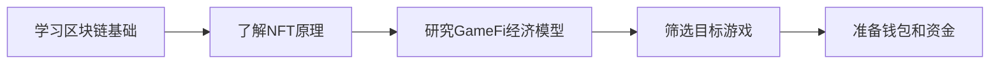
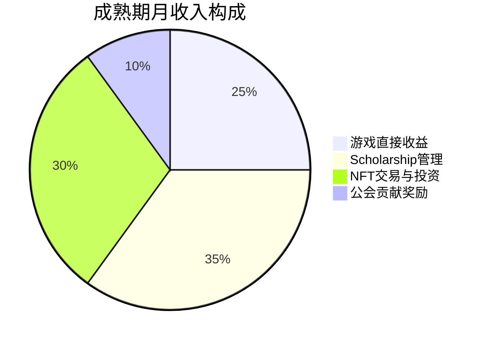

## 案例七：GameFi玩家的Play-to-Earn实践

### 什么是GameFi

GameFi（Game + Finance）是将区块链技术、NFT资产与游戏机制深度融合的新业态。与传统游戏的核心区别在于：传统游戏中的虚拟资产（皮肤、装备、角色）归游戏公司所有，玩家只是"租用"；而GameFi中，游戏资产以NFT形式铸造在区块链上，玩家真正拥有所有权，可以在任何市场上自由交易、出租甚至跨游戏使用。

**GameFi的经济模型有三大支柱**：

| 支柱 | 功能 | 典型实现 |
|------|------|----------|
| NFT资产 | 游戏内可交易的独占资产 | 角色、装备、土地、道具 |
| 代币经济 | 游戏内流通与治理代币 | SLP（Axie）、GMT（StepN）、ILV（Illuvium） |
| 智能合约 | 自动化资产分配与规则执行 | 奖励发放、交易撮合、战利品分配 |

GameFi经历了三个阶段的演化：

| 阶段 | 时间 | 特征 | 代表项目 | 局限 |
|------|------|------|----------|------|
| 1.0 | 2020-2021 | 简单玩法+高额代币奖励 | Axie Infinity、Alien Worlds | 经济模型不可持续，严重依赖新玩家入场 |
| 2.0 | 2022-2023 | 代币燃烧+双代币模型 | StepN、Splinterlands | 单一运动/卡牌玩法，留存率低 |
| 3.0 | 2024-至今 | 3A级画质+多元收益+DeFi融合 | Illuvium、Big Time、Star Atlas | 入门门槛较高，需要更多时间验证经济模型 |

### 案例背景：小林的GameFi之路

小林，25岁，互联网公司前端开发工程师，月薪18000元。2021年8月，在同事推荐下开始接触Axie Infinity，从零起步，逐步建立起系统化的GameFi参与方法论。以下是他的完整实践经历，涵盖入门摸索、策略优化、风险管理到稳定产出的全过程。

**他的起点条件**：
- 有一定技术基础（理解钱包、私钥等概念）
- 初始投资预算：5000元人民币
- 每天可投入时间：2-3小时（下班后）
- 游戏经验：中等（玩过王者荣耀、原神等，但无区块链游戏经验）

### 执行过程

#### 第一阶段：入门期（2021年8月-10月）

**第1周：建立基础认知**

小林没有急着冲进游戏，而是先花了三天时间研究GameFi的基本原理。他的学习路径如下：



**准备工作清单**：

1. **安装MetaMask钱包**：创建以太坊钱包地址，手抄助记词并存放在保险柜
2. **注册Binance账号**：完成KYC认证，购入5000元等值的ETH和USDT
3. **学习Gas费机制**：在测试网上模拟了几笔交易，理解Gas Price和Gas Limit的关系
4. **加入Discord社区**：进入Axie Infinity官方Discord和中文社群，潜水观察一周

**第2-3周：选择并投入Axie Infinity**

经过对比分析，小林选择Axie Infinity作为入门项目：

| 评估维度 | Axie Infinity | 备选项目StepN | 备选项目Alien Worlds |
|----------|---------------|---------------|---------------------|
| 入门门槛 | 中等（约$500起） | 较低（约$100起） | 极低（免费） |
| 日均收益 | $5-$15 | $3-$10 | <$1 |
| 玩法深度 | 较高（策略对战） | 低（走路即可） | 低（点击挖矿） |
| 社区规模 | 最大 | 大 | 中 |
| 经济模型成熟度 | 较成熟 | 新 | 不稳定 |

**购入Axie的具体流程**：

1. 在Ronin Bridge上将ETH从以太坊主网跨链到Ronin侧链（Gas费约$15）
2. 在Axie Marketplace上筛选三只Axie（队伍配置需要前排坦克+输出+辅助）
3. 配置方案：一只Plant系Tank（血厚防高）、一只Beast系Damage（输出核心）、一只Bird系Support（速度和控制）
4. 三只Axie总花费：约0.3 ETH（当时约$900，折合人民币5800元，略超预算）

**第4-8周：摸索期的实战**

小林每天的游戏流程：

| 时间段 | 活动 | 时长 | 说明 |
|--------|------|------|------|
| 19:00-19:30 | 完成每日任务（Daily Quest） | 30分钟 | 固定获得75 SLP |
| 19:30-20:30 | 竞技场排位对战 | 60分钟 | 根据胜率获得SLP |
| 20:30-21:00 | 冒险模式（PvE）刷关 | 30分钟 | 稳定SLP来源 |
| 21:00-21:30 | 记录数据、复盘对局 | 30分钟 | 优化策略 |

**摸索期的惨痛教训**：

- **教训一：忽视团队搭配**。初始配置随机买了三只低价Axie，属性不搭配，竞技场胜率只有30%。后来花时间研究Meta（主流打法），重新购入搭配合理的队伍，胜率提升到55%
- **教训二：不了解SLP释放机制**。SLP的产出速度远快于需求增长，导致币价持续下跌。8月购入时SLP价格约$0.25，到10月已跌至$0.08
- **教训三：Gas费吞噬利润**。频繁在以太坊主网操作Gas费累计花了约$80

**摸索期数据**：

| 指标 | 数值 |
|------|------|
| 初始投资 | 5800元 |
| 日均SLP产出 | 150-200个 |
| SLP平均价格 | $0.15 |
| 日均毛收入 | 约150元 |
| 扣除机会成本后净收入 | 约80元/天 |
| 月净收入 | 约2400元 |
| 投资回本周期 | 约2.4个月 |

#### 第二阶段：策略优化期（2021年11月-2022年2月）

小林意识到"纯靠打游戏赚钱"的思路太简单，开始系统化优化策略。

**策略一：多游戏组合分散风险**

小林将每个月的收益分成三份：50%继续投入、30%提取变现、20%投资新游戏。通过这种分配，他在三个月内陆续参与了：

| 游戏 | 投入金额 | 日均收益 | 风险评估 | 参与时长 |
|------|----------|----------|----------|----------|
| Axie Infinity | 5800元 | 80元 | 中（代币通胀） | 持续 |
| Splinterlands | 600元 | 15元 | 低（卡牌策略） | 持续 |
| Alien Worlds | 0元 | 5元 | 极低（免费挖矿） | 持续 |
| Bomb Crypto | 800元 | 20元 | 高（经济模型未验证） | 3个月后退出 |

**策略二：学习Scholarship（奖学金）模式**

Axie Infinity社区存在一种"Scholarship"机制：Axie持有者将Axie租借给新玩家，新玩家负责玩游戏打SLP，双方按比例分成。

小林的Scholarship策略：

1. **租出闲置Axie**：当自己的Axie阵容更新后，旧的Axie不卖，而是租给Scholar
2. **分成比例**：玩家70%，小林30%
3. **管理工具**：用Google Sheets记录每个Scholar的产出和分成
4. **筛选标准**：要求Scholar有Discord活跃度、承诺每天完成最低任务量

三个月后的Scholarship收入：

| 指标 | 数值 |
|------|------|
| 管理的Scholar数量 | 5人 |
| 人均日产出SLP | 120个 |
| 小林每日分成（30%） | 180个SLP |
| 折合人民币 | 约108元/天 |
| 月收入 | 约3240元 |

**策略三：代币经济分析**

小林开始深入研究游戏代币的经济模型，建立了自己的评估框架：

```text
代币可持续性评估清单：
├── 产出端
│   ├── 代币产出速度是否线性增长？（警惕指数增长）
│   ├── 产出是否需要投入成本？（纯免费产出=高风险）
│   └── 产出是否有上限？（有减半机制更健康）
├── 消耗端
│   ├── 代币有哪些使用场景？（至少3个以上才健康）
│   ├── 消耗场景是否有真实需求？（而非强制销毁）
│   └── 消耗速度能否跟上产出速度？
└── 分配端
    ├── 团队持仓比例（>20%需警惕）
    ├── 解锁时间表（短期大量解锁=卖压）
    └── 流通量/总量比（<30%需关注释放节奏）
```

基于这个框架，小林在2022年初判断SLP经济模型不可持续，开始逐步减少Axie仓位。

#### 第三阶段：风险管理与稳定产出（2022年3月-2022年12月）

2022年上半年是GameFi行业的寒冬。Axie Infinity的SLP价格从$0.08跌至$0.003，Ronin Bridge遭受6.25亿美元黑客攻击，整个行业信心崩塌。多数P2E玩家血本无归，但小林因为提前做了风险管理，不仅保住了本金，还实现了盈利。

**他的风险管理框架**：

| 风险类型 | 具体措施 | 执行效果 |
|----------|----------|----------|
| 代币价格暴跌 | 每月固定变现30%收益，不囤积代币 | 避免了SLP暴跌80%的损失 |
| 项目跑路 | 分散投资3-5个项目，单项目投入不超过总资金40% | Bomb Crypto跑路损失800元，但其他项目弥补 |
| 合约漏洞 | 只使用经过审计的主流项目，新项目先小额测试 | 未遭遇合约攻击 |
| 账号安全 | 硬件钱包存储大额资产，游戏账号独立邮箱+2FA | 未发生盗号事件 |
| 时间成本失控 | 设置每日游戏时间上限2.5小时，超时强制退出 | 保持工作生活平衡 |

**StepN实践复盘（2022年4月-7月）**

2022年4月，小林参与了StepN（Move-to-Earn）热潮：

| 时间节点 | 事件 | 小林的操作 | 结果 |
|----------|------|------------|------|
| 4月初 | StepN爆发，GMT币价$0.8 | 购入一双跑鞋NFT（$800）开始跑步 | 日收益约$15-$20 |
| 5月初 | GMT涨至$4，市场疯狂 | 卖出跑鞋获利$2400，保留少量GMT | 锁定利润 |
| 5月中旬 | GST暴跌50% | 果断清仓所有游戏资产 | 避免后续崩盘 |
| 7月 | StepN封禁中国大陆用户 | 已提前退出，无损失 | 完美规避 |

StepN的教训总结：**不要在FOMO（Fear of Missing Out）情绪下做决策**。小林在看到社交媒体疯狂宣传时选择获利了结，而非追加投入。

**2022年下半年的策略调整**

GameFi寒冬期，小林做了三个关键调整：

1. **从"玩新游戏"转向"深耕成熟生态"**：将资金集中到已验证经济模型的项目
2. **从"靠代币增值"转向"靠NFT资产升值"**：代币容易通胀，但稀缺的游戏NFT资产更有保值性
3. **从"单打独斗"转向"社区协作"**：加入专业的GameFi投资社区，共享信息和策略

#### 第四阶段：进阶玩法（2023年至今）

2023年，GameFi行业进入2.0/3.0阶段，小林的策略也升级为更系统化的方法。

**进阶策略一：GameFi项目尽职调查清单**

```text
GameFi项目评估框架（共25项检查点）
│
├── 团队与融资（5项）
│   ├── 创始人是否实名？过往项目记录？
│   ├── 融资机构是否知名？（a16z、Paradigm等）
│   ├── 融资金额与阶段（种子轮>500万美元为佳）
│   ├── 团队规模与开发进度
│   └── 项目方是否公开钱包地址？
│
├── 经济模型（7项）
│   ├── 代币是否有实际消耗场景？
│   ├── 代币产出速率是否有衰减机制？
│   ├── NFT资产是否真正上链？（非托管式）
│   ├── 是否有双代币模型？（治理+实用）
│   ├── 初始流通量占比（<20%为佳）
│   ├── 团队代币解锁期（>12个月为佳）
│   └── 是否有回购/销毁机制？
│
├── 游戏性（5项）
│   ├── 核心玩法是否有趣？（非纯挖矿）
│   ├── 是否有PvE和PvP两种模式？
│   ├── 游戏画面和体验是否达到主流水平？
│   ├── 是否支持移动端？（扩大用户基础）
│   └── 是否有社交功能？（公会、组队）
│
├── 安全性（4项）
│   ├── 智能合约是否经过审计？（CertiK、SlowMist）
│   ├── 是否有Bug Bounty计划？
│   ├── 资金托管方式（多签 vs 单签）
│   └── 历史是否发生过安全事件？
│
└── 社区与生态（4项）
    ├── Discord/Telegram活跃度（非机器人）
    ├── Twitter互动质量（非纯喊单）
    ├── 是否有公会支持？（YGG、Merit Circle）
    └── 链上活跃地址数趋势
```

**进阶策略二：GameFi公会参与**

小林加入了Yield Guild Games（YGG）的中国社区，从普通玩家升级为公会核心贡献者：

| 公会角色 | 职责 | 收益来源 |
|----------|------|----------|
| Scholar（学者） | 玩游戏产出代币 | 代币分成（70%） |
| Manager（管理者） | 管理Scholar团队 | 管理分红（5%-10%） |
| Analyst（分析师） | 分析新项目，提供投资建议 | 社区激励+早期投资额度 |
| Ambassador（大使） | 推广公会、招募新成员 | 推荐奖励 |

小林担任Analyst角色，每周输出一份GameFi项目分析报告。他的分析报告被公会采纳后，获得了多个早期项目的投资额度（Whitelist），这些额度在项目上线后通常有3-10倍的收益。

**进阶策略三：跨游戏资产整合**

2023年下半年，部分GameFi项目开始支持跨游戏资产互通。小林开始布局"元宇宙资产组合"：

| 资产类型 | 具体配置 | 投入成本 | 用途 |
|----------|----------|----------|------|
| 虚拟土地 | Decentraland地块 | $2000 | 出租给游戏项目做虚拟展厅 |
| 通用角色NFT | 跨平台Avatar | $500 | 在多个兼容游戏中使用 |
| 游戏装备 | Big Time稀有装备 | $1500 | 游戏内使用+二级市场交易 |
| 治理代币 | ILV（Illuvium） | $3000 | 质押分红+治理投票 |

### 成果数据

#### 收入明细（按阶段统计）

| 阶段 | 时间 | 游戏内收益 | Scholarship收益 | NFT交易收益 | 总收入 |
|------|------|------------|-----------------|-------------|--------|
| 入门期 | 4个月 | 9600元 | 0元 | 0元 | 9600元 |
| 策略优化期 | 4个月 | 7200元 | 12960元 | 3200元 | 23360元 |
| 风险管理期 | 9个月 | 8100元 | 16200元 | 18000元 | 42300元 |
| 进阶期 | 12个月 | 12000元 | 24000元 | 36000元 | 72000元 |
| **合计** | **29个月** | **36900元** | **53160元** | **57200元** | **147260元** |

#### 关键指标对比

| 指标 | 起步时（2021.8） | 成熟期（2023.12） |
|------|------------------|-------------------|
| 月均收入 | 2400元 | 8000-12000元 |
| 参与游戏数 | 1个 | 5-8个 |
| 管理Scholar数 | 0人 | 15人 |
| NFT资产总值 | 5800元 | 约80000元 |
| 代币持仓 | 单一SLP | 分散持有6种代币 |
| 月均投入时间 | 90小时 | 60小时（效率提升） |
| 投入产出比 | 1:0.4 | 1:2.5 |

#### 收益结构分析



### 常见错误与纠正方法

GameFi新手最易踩的十个坑：

| 序号 | 常见错误 | 后果 | 正确做法 |
|------|----------|------|----------|
| 1 | FOMO情绪下高位接盘NFT | 买入即亏损50%+ | 设定买入价格上限，低于地板价20%才入手 |
| 2 | 所有收益全部囤积代币 | 代币暴跌血本无归 | 每月固定变现30%-50%收益 |
| 3 | 只玩一个游戏 | 游戏凉了就归零 | 分散投资3-5个经过验证的项目 |
| 4 | 不研究经济模型 | 被通胀模型收割 | 每投入一个新项目前先做经济模型分析 |
| 5 | 在社交媒体跟单 | 成为接盘侠 | 独立分析，社交媒体只作信息源 |
| 6 | 忽视Gas费成本 | 利润被Gas费吃掉 | 在Gas费低谷期操作，使用Layer2 |
| 7 | 不设置止损线 | 小亏变大亏 | 任何项目亏损超30%强制退出 |
| 8 | 用生活费投资 | 影响正常生活 | 只用闲钱投资，总投入不超过月收入20% |
| 9 | 忽视账号安全 | 被盗号归零 | 硬件钱包+独立邮箱+2FA三重保护 |
| 10 | 每天游戏时间过长 | 影响工作和健康 | 设置每日时间上限，游戏是投资不是沉迷 |

### 进阶内容：GameFi经济学深度解析

#### 双代币模型原理

主流GameFi项目通常采用双代币模型：

| 代币类型 | 功能 | 代表 | 特征 |
|----------|------|------|------|
| 治理代币（Governance Token） | 投票权、分红权、稀缺资产购买 | AXS、GMT、ILV | 总量有限，长期价值锚定 |
| 实用代币（Utility Token） | 游戏内消耗、奖励发放 | SLP、GST、BOB | 无限产出，短期流通媒介 |

双代币设计的核心逻辑：将"价值存储"和"流通媒介"分离。治理代币承载长期价值（类似股票），实用代币用于日常交易（类似游戏币）。这样即使实用代币因通胀贬值，治理代币仍可通过生态发展保持价值。

**判断双代币模型健康度的方法**：

```text
代币健康度检查公式：

消耗率 = 代币日消耗量 / 代币日产出量

消耗率 > 1.0 → 通缩模型，代币价格有上涨动力
消耗率 = 0.8-1.0 → 基本平衡，需要持续监控
消耗率 = 0.5-0.8 → 轻度通胀，代币价格承压
消耗率 < 0.5 → 严重通胀，代币价格将大幅下跌

实际操作：
1. 在区块链浏览器查询代币合约的mint（铸造）和burn（销毁）事件
2. 统计过去7天的日均数据
3. 计算消耗率，判断项目健康度
```

#### Play-to-Earn到Play-and-Earn的转变

2023年后，行业共识从"Play-to-Earn"转向"Play-and-Earn"：

| 维度 | Play-to-Earn（1.0） | Play-and-Earn（2.0+） |
|------|---------------------|----------------------|
| 核心驱动力 | 赚钱 | 游戏乐趣+赚钱 |
| 游戏性 | 低（简单点击/卡牌） | 高（3A级画质和玩法） |
| 经济模型 | 高度依赖新玩家入场 | 代币燃烧+外部收入注入 |
| 留存率 | 低（赚不到钱就走） | 高（游戏本身有趣） |
| 代币价值来源 | 投机+新资金流入 | 游戏内消耗+生态发展 |
| 典型表现 | 高APY吸引→崩盘 | 稳定增长→生态扩张 |

对玩家的实际影响：**不能再用"投入多少天回本"的简单思维**，需要评估游戏本身的可玩性和长期发展潜力。

#### GameFi与DeFi的融合趋势

2024年后的GameFi正在与DeFi深度整合：

| 融合方向 | 具体形态 | 收益机会 |
|----------|----------|----------|
| NFT-Fi | 用游戏NFT作为抵押品借贷 | 不卖NFT也能获得流动性 |
| 游戏内DEX | 游戏内置去中心化交易所 | 提供流动性赚手续费 |
| 质押挖矿 | 质押游戏资产获得额外奖励 | 增强资产收益 |
| 收益聚合器 | 自动优化不同游戏间的资金配置 | 被动收入 |

### 实操模板：GameFi投资记录表

每位GameFi玩家都应维护一份投资记录，以下是推荐模板：

```text
日期 | 游戏名称 | 操作类型 | 资产/代币 | 数量 | 单价(USD) | 总价值(USD) | Gas费(USD) | 备注
-----|---------|---------|-----------|------|-----------|-------------|------------|-----
2023-01-15 | Illuvium | 买入 | ILV代币 | 10 | $50 | $500 | $3 | 质押用
2023-01-20 | Big Time | 买入 | 稀有武器NFT | 1 | $200 | $200 | $5 | 游戏内使用
2023-02-01 | Axie | 卖出 | SLP | 5000 | $0.004 | $20 | $1 | 定期变现
...

月度汇总公式：
月净收入 = (所有卖出总额 - 所有买入总额 - 所有Gas费) × 当月平均汇率
```

### 经验总结

小林29个月GameFi实践的核心经验可以提炼为五条原则：

**原则一：先研究后投入，永远不盲从**。每一个投入真金白银的项目，都必须先完成经济模型分析、团队背景调查和社区质量评估。社交媒体上的"财富故事"10个有9个是项目方的营销手段。

**原则二：现金流优先于资产增值**。GameFi的最大风险是代币归零。每月固定变现一部分收益，确保即使最坏情况发生也不会亏损。记住：纸面利润不是利润，落袋为安才是。

**原则三：分散是生存的基础**。不把所有资金放在一个游戏里，不把所有时间花在一种玩法上。至少同时参与3个不同类型的项目，任何一个崩盘都不会致命。

**原则四：控制时间投入，保持主业优先**。GameFi是副业投资，不是全职工作。小林始终坚持一条底线：每天GameFi时间不超过2.5小时，工作日晚上不超过11点。失去主业收入去全职GameFi是最危险的决定。

**原则五：持续学习，快速适应**。GameFi行业变化极快，一个项目的生命周期可能只有3-6个月。保持对新项目、新机制、新趋势的敏感度，才能在变化中找到机会。但"快速适应"不等于"频繁切换"——在没有充分研究之前，不要轻易投入新项目。

**给新手的行动建议**：

| 阶段 | 建议投入 | 建议时间 | 核心目标 |
|------|----------|----------|----------|
| 第1-2周 | 0元 | 每天1小时 | 学习基础概念，创建钱包，加入社区 |
| 第3-4周 | 500元以内 | 每天1.5小时 | 选择1个低门槛游戏试玩 |
| 第2-3月 | 2000元以内 | 每天2小时 | 优化策略，开始记录数据 |
| 第4-6月 | 根据收益决定 | 每天2小时 | 分散投资，建立Scholarship |
| 6个月后 | 复利再投入 | 每天1.5-2小时 | 系统化管理，追求稳定现金流 |
