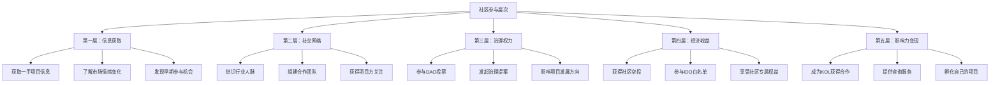
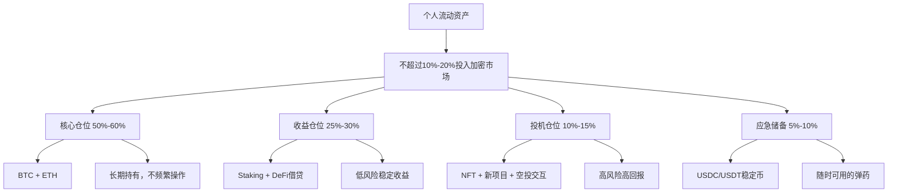

## 案例总结与启示

本章通过八个真实场景的实战案例，覆盖了Web3生态中最主流的参与路径——从数字艺术NFT创作、PFP社区运营、DAO治理参与、DeFi收益策略，到项目早期参与、音乐NFT破圈、GameFi边玩边赚、以及安全研究员的Bug Bounty之路。本节作为全章收束，将从这些案例中提炼出跨领域的共性规律，构建一套完整的Web3参与者成长框架。

### 八大案例核心回顾

在深入总结之前，有必要先回顾每个案例的核心价值定位，以便后续提炼共性模式。

| 案例 | 核心路径 | 关键能力 | 收益模式 | 风险特征 |
|------|----------|----------|----------|----------|
| 案例一：数字艺术家NFT变现 | 创作→铸造→销售 | 艺术创作、品牌营销 | 一次性销售收入+版税 | 中等（依赖市场热度） |
| 案例二：PFP社区运营 | 投资→社区建设→价值增长 | 社区管理、叙事构建 | NFT增值+社区空投 | 高（项目跑路风险） |
| 案例三：DAO参与治理 | 参与→贡献→获得回报 | 治理理解、提案能力 | 代币奖励+声誉积累 | 低至中（治理代币波动） |
| 案例四：DeFi收益策略 | 研究→部署→复投 | 协议分析、风控能力 | 利息+流动性挖矿奖励 | 中高（智能合约风险） |
| 案例五：项目早期参与 | 调研→参与→捕获价值 | 信息获取、判断能力 | 空投+早期折扣 | 高（项目失败概率大） |
| 案例六：音乐NFT破圈 | 创作→发行→粉丝经济 | 音乐创作、跨界合作 | 销售+版税+粉丝经济 | 中（小众市场流动性） |
| 案例七：GameFi边玩边赚 | 学习→精通→规模化 | 游戏理解、经济模型分析 | 游戏代币+NFT资产增值 | 高（代币通胀崩盘） |
| 案例八：安全研究员Bug Bounty | 学习→审计→报告 | 漏洞挖掘、合约审计 | 赏金+声誉+咨询收入 | 低（技术能力变现） |

### 跨案例共性规律提炼

#### 规律一：能力复利是Web3最可靠的护城河

纵观八个案例，成功者无一例外都在持续构建自己的能力壁垒。数字艺术家不断提升创作技法和市场嗅觉，安全研究员持续深化对智能合约漏洞的理解，DeFi玩家反复验证和优化自己的收益策略。这种能力积累具有复利效应——前3个月的学习曲线可能很陡峭，但6个月后你会发现很多新机会在别人看来是"天书"的内容对你来说是"常识"。

能力复利的核心机制在于：

- **知识网络效应**：每学会一个新概念，它会与已有知识产生连接，形成更密集的知识网络。当你理解了Uniswap的AMM机制后，再学习Curve、Balancer的原理就快得多
- **模式识别能力**：见过足够多的项目后，你能快速识别哪些是真正的创新，哪些是换皮骗局。这种判断力无法速成，只能通过大量实践积累
- **社交资本累积**：在社区中持续贡献会建立声誉，这种声誉会带来更多机会——被邀请参与早期项目、获得内测资格、被推荐担任治理角色

#### 规律二：社区是Web3价值创造的核心引擎

Web3与传统互联网最大的区别之一在于社区的角色。在Web2中，社区是产品的附属品；在Web3中，社区本身就是产品的一部分，甚至是产品价值的主要来源。PFP项目的案例最直观地说明了这一点——Bored Ape的价值不在于那张JPEG图片本身，而在于它所代表的社区身份和社交网络。

社区参与的收益层次：

大多数Web3参与者停留在第一层（信息获取），少数进入第二层（社交网络），极少数能达到第三层以上。而真正的价值回报恰恰集中在后三层。DAO参与者的案例展示了从第一层逐步攀升到第四层的完整路径——从最初的旁观者，到积极参与治理投票，再到发起有影响力的提案，最终获得丰厚的代币奖励和行业声誉。

#### 规律三：风险控制决定生存周期

Web3领域存在一个残酷的现实：大多数参与者活不过一个完整的市场周期。牛市时人人都是"天才交易员"，熊市来临时才发现自己没有风控体系。本章八个案例中，凡是能够持续盈利的参与者，无一例外都建立了系统化的风控机制。

风控的核心框架：

| 维度 | 具体策略 | 执行要点 |
|------|----------|----------|
| 资金管理 | 不超过流动资产的10%-20%投入加密市场 | 这笔钱必须是"丢了也不影响生活"的钱 |
| 仓位控制 | 单个项目不超过总仓位的10%-15% | 即使极度看好也要控制上限 |
| 止损纪律 | 单笔亏损超过30%-50%强制止损 | 提前设定，到了就执行，不做心理博弈 |
| 时间分散 | 分批建仓，不要一次性全仓 | 定投策略可以平滑入场成本 |
| 链上安全 | 使用硬件钱包，限制合约授权额度 | 每次授权前检查合约地址是否正确 |
| 信息验证 | 不轻信任何"内幕消息" | 所有投资决策必须基于自己的研究 |

DeFi收益策略案例中的参与者采用了"核心-卫星"资产配置法：将60%资金放在BTC和ETH等主流资产上作为核心仓位，30%放在经过审计的DeFi协议中获取稳定收益，10%用于高风险高回报的新兴项目。这种配置确保了即使高风险部分全部亏损，整体组合仍然可控。

#### 规律四：长期主义是最被低估的竞争策略

Web3市场充斥着短期投机者，他们追逐每一个热点、每一个空投、每一个暴涨的代币。但真正获得巨大回报的参与者几乎都是长期主义者。数字艺术家不是铸造一个NFT就成功了，而是持续创作了数十个系列，逐步建立了自己的艺术风格和收藏者社区。安全研究员不是找到一个漏洞就收手，而是系统性地学习了数十种漏洞类型，在Immunefi等平台上建立了长期的审计记录。

长期主义在Web3中的具体表现：

1. **项目选择的长期视角**：不看代币价格短期走势，而是评估项目的技术创新性、团队执行力、社区健康度和商业模式可持续性
2. **能力积累的长期投入**：愿意花3-6个月系统学习一个领域，而不是追求"速成秘籍"
3. **社区关系的长期经营**：在社区中持续贡献有价值的内容，而不是只在有空投预期时才活跃
4. **投资回报的长期评估**：用12个月甚至24个月的时间维度评估投资表现，而不是每天盯盘

### Web3新手入场指南

#### 第一阶段：知识储备（第1-2个月）

这一阶段的核心目标是建立对Web3世界的整体认知框架，而不是急于赚钱。没有知识基础的入场等于裸奔。

**学习清单：**

- **区块链基础**：理解区块、交易、哈希、共识机制（PoW/PoS）的基本原理。推荐阅读Andreas Antonopoulos的《精通比特币》前5章，以及以太坊官方文档中的"Introduction to Ethereum"部分
- **钱包操作**：创建MetaMask钱包，理解公钥/私钥/助记词的关系，在测试网上完成第一笔转账。务必在测试网上反复练习，不要一上来就操作真金白银
- **公链生态概览**：了解以太坊、Solana、BNB Chain、Polygon等主流公链的定位和差异。每条链都有自己的社区文化和技术特点，选择与你兴趣匹配的生态深入
- **安全意识**：学习常见的Web3骗局类型（Rug Pull、钓鱼攻击、假空投、授权钓鱼），了解硬件钱包的作用和使用方法。安全知识是最优先级——你可以不懂DeFi，但不能不懂安全
- **信息源建设**：关注至少3-5个可靠的行业媒体和分析师。推荐：The Block、CoinDesk、Bankless（英文）；吴说区块链、PANews（中文）。加入2-3个高质量的Discord或Telegram社区

**里程碑检验：** 能向一个完全不懂区块链的朋友解释"什么是钱包""什么是Gas费""什么是智能合约"这三个问题。

#### 第二阶段：小额实践（第3-4个月）

纸上谈兵永远学不会游泳。这一阶段用小额资金（建议500-2000元）进行实操，核心目的是"交学费"——用最小的成本犯最大的错误。

**实操清单：**

- **第一笔链上交易**：在以太坊或Solana上用DEX（如Uniswap、Jupiter）完成一次代币交换，体验Gas费、滑点、交易确认的全流程
- **DeFi入门**：在Aave或Compound上存入少量稳定币获取利息，理解借贷协议的基本机制；在Uniswap上提供一次流动性，亲身体验无常损失
- **NFT体验**：在OpenSea上浏览不同类型的NFT项目，理解铸造、挂单、竞价的流程。可以尝试购买一个地板价很低的NFT，体验持有者社区的感觉
- **链上工具使用**：学会使用Etherscan/Solscan查看交易记录，使用DeFiLlama查看协议TVL，使用Dune Analytics查看链上数据
- **空投交互**：选择2-3个明确有空投预期的协议进行交互，理解空投的基本逻辑

**常见新手陷阱及规避：**

| 陷阱 | 表现 | 正确做法 |
|------|------|----------|
| 助记词泄露 | 截图保存、发给"客服"、存在云笔记 | 手写在纸上，锁在保险柜，永不数字化 |
| 无限授权 | 对陌生合约授予无限制的代币使用权限 | 使用Revoke.cash定期清理授权，每次只授权需要的金额 |
| FOMO追涨 | 看到别人赚钱就冲进去 | 制定买入计划，设好价格提醒，不在情绪激动时操作 |
| 忽视Gas费 | 在网络拥堵时交易，Gas费比交易金额还高 | 使用Etherscan Gas Tracker查看实时Gas价格，选择低峰时段交易 |
| 重仓单一项目 | 把所有钱押在一个"百倍币"上 | 分散投资，单项目不超过总仓位的15% |

#### 第三阶段：方向选择与深入（第5-8个月）

经过前两个阶段的积累，你应该对Web3生态有了基本认知，并且开始发现自己更感兴趣的领域。这一阶段的核心是"选赛道、扎下去"。

**主要赛道对比：**

| 赛道 | 核心技能 | 收入来源 | 时间投入 | 适合人群 |
|------|----------|----------|----------|----------|
| NFT创作 | 艺术/设计能力 | 销售+版税 | 中等 | 有美术/设计基础的人 |
| 社区运营 | 社交+内容能力 | 项目方薪资+代币 | 较高 | 社交能力强、善于组织的人 |
| DeFi研究 | 金融+技术理解 | 投资收益 | 较高 | 有金融背景、喜欢研究的人 |
| 开发者 | 编程能力 | 薪资+赏金 | 高 | 有编程基础的人 |
| 安全审计 | 安全+逆向分析 | Bug Bounty赏金 | 极高 | 有安全背景、耐心细致的人 |
| 内容创作 | 写作/视频能力 | 广告+赞助+代币 | 中等 | 表达能力强、有独特观点的人 |

选择赛道的原则：

1. **与已有能力匹配**：如果你是设计师，NFT创作比DeFi研究更适合你；如果你是程序员，智能合约开发比社区运营更高效
2. **与兴趣匹配**：Web3的学习曲线很陡，没有兴趣支撑很难坚持
3. **与风险偏好匹配**：Bug Bounty和DAO参与的风险收益特征完全不同，选择让自己晚上睡得着觉的路径
4. **考虑可组合性**：选择能够与其他技能组合产生协同效应的方向。比如"内容创作+DeFi研究"可以产出高质量的投研内容

#### 第四阶段：系统化运营（第9个月以上）

进入这一阶段，你已经不再是新手，而是某个细分领域的有效参与者。核心目标是从"参与者"升级为"建设者"。

**系统化运营框架：**

1. **投资体系化**
   - 建立自己的投资决策清单（checklist），包括项目评估的各个维度
   - 使用Notion或Airtable建立项目跟踪数据库，记录每个项目的研究结论、入场理由、预期目标和止损位
   - 每月进行一次投资组合复盘，分析哪些决策是正确的、哪些是错误的、错误的原因是什么

2. **收入多元化**
   - 不要依赖单一收入来源。理想状态是同时拥有2-3种Web3收入：投资收益+内容创作收入+咨询/服务收入
   - 将部分收益转换为稳定币或法币，锁定利润。不要让所有收益都在链上"裸奔"

3. **影响力构建**
   - 在Twitter/X上持续输出有质量的内容，建立个人品牌
   - 参与行业会议和线上活动，扩大社交网络
   - 将自己的经验写成教程或文章，帮助后来者。利他行为在Web3社区中回报极高

4. **持续学习机制**
   - 每周至少花5小时学习新知识（新协议、新技术、新趋势）
   - 加入1-2个高质量的研究小组或DAO，与同行交流
   - 定期阅读项目白皮书和审计报告，保持技术敏感度

### Web3投资的风险等级分类

理解风险等级是制定投资策略的基础。以下分类基于历史数据和行业共识，但需要强调：加密市场的波动性远超传统金融市场，即使是"极低风险"的操作也可能在短期内出现显著回撤。

| 风险等级 | 典型操作 | 年化预期收益 | 历史最大回撤 | 建议资金占比 | 代表资产/协议 |
|----------|----------|-------------|-------------|-------------|--------------|
| 极低风险 | 持有BTC/ETH | 5%-20%（长期） | -30%至-50% | 40%-50% | BTC、ETH |
| 低风险 | Staking/稳定币理财 | 3%-10% | -5%至-10% | 20%-30% | Lido stETH、Aave USDC存款、MakerDAO DSR |
| 中等风险 | DeFi流动性挖矿 | 10%-30% | -20%至-40% | 10%-20% | Uniswap LP、Curve LP、Convex |
| 高风险 | NFT投资/新项目代币 | 50%-500%+ | -80%至-90% | 5%-10% | 蓝筹NFT、新上线项目代币 |
| 极高风险 | Meme币/杠杆交易 | 100%-1000%+ | -95%至-99% | <5% | Meme币、合约杠杆 |

**风险等级的动态调整：**

- **牛市中期**：可以适度提高中等风险和高风险的占比，因为整体市场情绪积极，新项目的成功概率相对较高
- **牛市末期**：应逐步降低高风险仓位，增加极低风险和低风险资产的占比，锁定利润
- **熊市期间**：极低风险资产应占到60%以上，高风险仓位清零或接近清零，利用低价定投优质资产
- **熊市末期**：开始逐步增加中等风险仓位，为下一轮牛市布局

### Web3领域的常见骗局类型与防范

骗局是Web3参与者面临的最现实威胁。以下整理了最常见的骗局类型，每种都附带具体的识别方法和防范策略。

#### Rug Pull（跑路骗局）

**运作机制：** 项目方创建一个看似正规的DeFi协议或NFT项目，吸引投资者投入资金后，通过后门或管理员权限卷走所有流动性资金。

**识别信号：**
- 团队匿名且没有任何可验证的背景信息
- 合约未经知名审计机构审计，或审计报告无法在审计机构官网验证
- 流动性未锁定，或锁定时间极短（少于6个月）
- 代币分配高度集中，前10个地址持有超过50%的代币
- 社区中大量使用机器人账号制造虚假热度
- 路线图承诺过于宏大但缺乏具体的技术方案

**防范策略：**
- 使用Token Sniffer、RugCheck等工具检查合约安全性
- 在区块链浏览器上查看代币持仓分布
- 验证团队成员的真实身份（LinkedIn、GitHub、过往项目经历）
- 检查流动性锁定状态（Unicrypt、Team.Finance）
- 只投入你愿意承受归零风险的金额

#### 钓鱼攻击

**运作机制：** 攻击者创建与知名项目几乎一模一样的假网站，通过搜索引擎广告、社交媒体链接或Discord私信诱导用户访问，当用户连接钱包或签署交易时，恶意合约会窃取钱包中的资产。

**识别信号：**
- 网址与官方地址有微小差异（如uniswap.org变成uniswapp.org）
- 要求连接钱包后签署"approve"交易（正常DApp不会一上来就要求授权）
- 通过私信发送的"紧急"链接
- 承诺"免费领取"或"限时空投"

**防范策略：**
- 永远通过书签或手动输入网址访问DApp，不要点击搜索结果中的广告链接
- 使用Pocket Universe或Fire等浏览器插件自动检测恶意交易
- 签署任何交易前仔细检查交易详情，特别是授权的目标地址和金额
- 对Discord/Twitter私信中的链接保持高度警惕，官方团队永远不会通过私信要求你连接钱包

#### 假空投诈骗

**运作机制：** 攻击者向大量钱包地址发送看似有价值的代币，当用户试图在DEX上出售这些代币时，会触发恶意合约，窃取钱包中的其他资产。或者代币的合约中包含"approve"陷阱，出售操作实际上是对攻击者地址的无限授权。

**防范策略：**
- 不要尝试出售或操作你没有主动购买的未知代币
- 在Etherscan上查看代币合约，如果合约未经验证（没有绿色勾标），绝对不要交互
- 使用Revoke.cash检查并撤销不必要的授权

#### 社交工程攻击（杀猪盘）

**运作机制：** 攻击者通过社交媒体或通讯软件与目标建立长期关系（通常伪装成成功投资者或"热心朋友"），在建立信任后，诱导目标投资虚假项目或将资金转入攻击者控制的钱包。

**识别信号：**
- 主动添加你为好友并频繁互动
- 分享自己的"投资收益截图"（通常PS伪造）
- 推荐你使用某个"内部"交易所或投资平台
- 催促你尽快行动，制造紧迫感

**防范策略：**
- 永远不要因为社交关系而放松对投资项目的审查
- 独立验证所有信息，不依赖单一信息来源
- 记住一个原则：如果一个投资机会真的那么好，为什么一个陌生人要免费告诉你？

### 入场资金管理建议

资金管理是Web3参与者最容易忽视但最重要的技能。很多人的亏损不是因为选错了项目，而是因为资金管理失控。

#### 资金分配的金字塔模型

#### 具体操作纪律

1. **分批入场**：不要一次性将所有资金投入市场。建议分3-5批，在2-4周内逐步建仓，降低择时风险
2. **止损纪律**：在入场前就设定好止损位。短线交易止损不超过20%，中长线投资止损不超过50%。到了止损位就执行，不做心理博弈
3. **利润锁定**：当某个仓位盈利超过100%时，至少卖出50%锁定利润，用收回的本金继续参与其他机会。这叫"用利润玩，保本收手"
4. **定期复盘**：每月底花1-2小时复盘本月的所有交易和投资决策。记录哪些做对了、哪些做错了、错在哪里。这个习惯的价值远超任何"投资秘籍"
5. **情绪隔离**：设定固定的"操作时间"（比如每天晚上8-9点），其他时间不看盘、不操作。频繁盯盘只会增加焦虑和冲动决策的概率

### Web3新手常见错误与避坑指南

以下是新手最常犯的错误，每一条都是无数人用真金白银换来的教训。

**错误一：助记词管理不当**

助记词是钱包资产的唯一凭证，一旦丢失或泄露，资产将永久丢失或被盗。最常见的错误包括：将助记词截图保存在手机相册（容易被恶意软件扫描）、存储在云笔记或邮箱中（云端被攻破则资产归零）、拍照发给朋友帮忙保存（信任链越长风险越大）。

正确做法：用笔手写在纸上（不要打印，打印机有缓存），存放在至少两个不同的物理位置（如家中保险柜+银行保险箱）。有条件的话使用金属助记词板（如Cryptosteel、Billfodl）防火防水。

**错误二：对不信任的合约授予无限授权**

当你在DEX上交易或在DeFi协议中存款时，需要先授权合约使用你的代币。很多新手不理解授权的含义，直接点击"确认"授予了无限额度。如果这个合约存在漏洞或本身就是恶意合约，攻击者可以在任何时候转走你钱包中该代币的所有余额。

正确做法：每次授权时手动将授权额度改为本次交易所需的精确金额。定期使用 [Revoke.cash](https://revoke.cash) 检查并清理历史授权。这是一个免费工具，连接钱包后可以一键查看所有历史授权并撤销不必要的授权。

**错误三：追涨杀跌**

FOMO（Fear Of Missing Out）是Web3市场中最致命的情绪。当某个代币或NFT暴涨时，新手往往会忍不住追高买入，结果买在山顶。当市场下跌时，又恐慌性抛售，卖在谷底。这种"高买低卖"的行为是大多数新手亏损的主要原因。

正确做法：在冷静时制定投资计划，包括目标买入价、止损价和目标卖出价。将计划写下来，贴在电脑旁边。当市场剧烈波动时，先看计划再看价格，而不是反过来。

**错误四：忽视Gas费优化**

以太坊网络的Gas费在拥堵时可能非常高昂。新手经常在Gas费高达100+ Gwei时进行小额交易，结果Gas费比交易金额还高。更糟糕的是，有些新手在交易卡住时反复提交交易，每次都消耗Gas费但交易都没有成功。

正确做法：使用 [Etherscan Gas Tracker](https://etherscan.io/gastracker) 或 [ultrasound.money](https://ultrasound.money) 查看实时Gas价格。对于非紧急交易，选择Gas费低于30 Gwei的时段执行。对于Gas费敏感的操作，考虑使用Layer 2网络（如Arbitrum、Optimism）或低Gas费公链（如Solana、BNB Chain）。

**错误五：不做自己的研究（DYOR）**

"DYOR"（Do Your Own Research）是Web3社区的金科玉律，但大多数新手只是把它当作口号。他们买入某个代币的原因往往是"Twitter上一个大V推荐的"或者"群里大家都在买"，而不是基于自己的独立分析。

正确做法：在投资任何项目之前，至少完成以下检查清单：
- 阅读项目白皮书或文档，理解它要解决什么问题
- 查看团队背景，是否有可验证的过往经历
- 检查代币经济模型，了解代币分配和释放计划
- 查看合约审计报告，确认是否经过知名机构审计
- 分析社区活跃度，区分真实用户和机器人
- 在DeFiLlama上查看协议TVL趋势

**错误六：忽视税务义务**

在中国大陆，加密货币的税务处理仍处于灰色地带，但并非没有规则。如果你通过加密货币获得了可衡量的收益（特别是兑换为法币时），从合规角度应当进行申报。在很多其他国家（如美国、日本、韩国），加密货币交易有明确的税务规定，未申报可能导致严重的法律后果。

正确做法：记录所有链上交易的详细信息（日期、金额、交易对、盈亏），使用Koinly、CoinTracker等工具自动生成税务报告。即使你所在的地区目前没有明确的执行力度，养成记录习惯也是明智之举——规则随时可能收紧。

### 参与路径对比分析

Web3提供了多种参与路径，每条路径的风险收益特征、技能要求和时间投入都不同。以下是四条主流路径的详细对比。

| 维度 | NFT创作 | DAO参与 | DeFi收益策略 | 项目早期参与 |
|------|---------|---------|-------------|-------------|
| 适合人群 | 有创作能力的艺术家/设计师 | 社区活跃者、善于沟通的人 | 有金融/技术背景的投资者 | 信息敏感、判断力强的研究者 |
| 启动资金 | 低（100-500美元Gas费） | 极低（几乎零成本） | 中（1000-5000美元起步） | 中（500-2000美元交互成本） |
| 学习曲线 | 中等（需掌握铸造流程和营销） | 低（参与讨论和投票即可） | 较高（需理解DeFi协议机制） | 高（需深入研究项目和技术） |
| 收入上限 | 高（头部创作者年入百万+） | 中（代币奖励+声誉积累） | 中高（年化10%-30%） | 高（空投可能价值数万美元） |
| 核心风险 | 市场热度消退、作品无人问津 | 项目失败、治理代币归零 | 智能合约被攻击、无常损失 | 项目跑路、空投预期落空 |
| 收入周期 | 中（需要持续创作维持热度） | 长（声誉积累需要时间） | 短（收益相对稳定） | 长（等待空投可能需要6-12个月） |
| 可扩展性 | 中（受限于个人创作产能） | 高（可以同时参与多个DAO） | 高（策略可复制到多个协议） | 中（精力有限，难以覆盖过多项目） |

### Web3投资心态管理

投资心态是区分成功者和失败者的关键因素之一，其重要性甚至超过技术分析能力。Web3市场的高波动性会放大所有人类的认知偏差和情绪弱点。

#### 五大心理陷阱及应对策略

**陷阱一：FOMO（错失恐惧）**

当你的朋友告诉你他买了某个代币赚了10倍，当你在Twitter上看到某个NFT项目地板价暴涨，当你在Discord里看到所有人都在喊"冲"——这就是FOMO的典型触发场景。FOMO会让你放弃原有的投资计划，在最糟糕的时机以最糟糕的价格入场。

应对方法：
- 制定"冷静期"规则：看到任何投资机会后，强制等待24小时再做决定
- 建立自己的投资清单（checklist），只有满足清单上所有条件才考虑投资
- 定期回顾那些你因为FOMO而错过的机会——你会发现，绝大多数"错过了的机会"最终都回到了原点甚至归零

**陷阱二：FUD（恐惧、不确定、怀疑）**

当市场暴跌30%，当新闻头条全是负面消息，当社区里弥漫着恐慌情绪——FUD会让你在最糟糕的时机卖出。更隐蔽的FUD来自竞争对手的恶意攻击或做空者的散布恐慌，这些信息可能半真半假，但足以动摇你的持有信心。

应对方法：
- 在买入时就设定好止损位和目标卖出价，提前写好"卖出条件清单"
- 在市场恐慌时不看价格，而是重新审视项目的底层逻辑是否改变
- 如果底层逻辑没变，价格下跌反而是加仓的机会；如果底层逻辑变了，无论盈亏都应该离场

**陷阱三：确认偏差**

当你已经买入某个代币后，你会不自觉地只关注支持它上涨的信息，而忽略或贬低看空的分析。你的Twitter信息流、Discord社区都会强化这种偏差，因为你关注的都是看多的KOL，加入的都是该项目的社区。

应对方法：
- 主动关注至少2-3个持不同观点的分析师
- 在投资决策时列出"看多理由"和"看空理由"各5条，强制自己思考对立面
- 定期问自己一个问题："如果我没有持有这个代币，以当前价格我会买入吗？"

**陷阱四：锚定效应**

你以2000美元买入的ETH跌到了1500美元，你不愿意卖出，因为你被"2000美元"这个买入价锚定了。你告诉自己"等回到2000再卖"，但这个价格可能要等很久，甚至可能永远回不来。更糟糕的是，为了"回本"你在下跌过程中不断加仓，导致仓位越来越大。

应对方法：训练自己忘记买入价格。评估一个仓位时只看两个因素：(1)以当前价格，如果你没有持仓，你会买入吗？(2)这个仓位的未来上涨空间是否大于其他可选投资？如果答案是否定的，无论盈亏都应该卖出。

**陷阱五：过度自信**

连续几次成功的投资会让你产生"我比市场聪明"的幻觉。这种过度自信会导致你逐渐加大仓位、忽视风控、跳过研究环节。历史上无数"天才交易员"都是在过度自信后遭遇毁灭性亏损的。

应对方法：
- 设定单笔投资和总投资的硬性上限，无论多么看好都不突破
- 每次盈利后将至少50%的利润转出到独立账户，锁定收益
- 定期记录自己的投资决策和结果，用数据而非感觉来评估自己的能力

#### 构建健康的Web3投资心态

1. **把Web3当作终身学习项目**：不以短期盈利为唯一目标，而是享受学习新技术、理解新范式的过程。这种心态会让你更从容，反而更容易做出好的投资决策
2. **接受亏损是学费**：在Web3领域，没有人能只赚不亏。把每次亏损当作一次学习机会——分析亏损的原因，提取教训，然后继续前进
3. **建立投资日志**：记录每笔投资的入场理由、预期目标、实际结果和反思。这个日志的价值会随着时间指数级增长
4. **保持社交但保持独立**：与其他投资者交流是获取信息和不同视角的重要途径，但最终的投资决策必须由你自己做出
5. **设定"不投资"的边界**：明确什么情况下不投资——情绪不好时不投、没有充分研究时不投、超出预算时不投。这些"不投资"的规则比"投资"的规则更重要

### Web3职业发展机会

Web3不仅是一个投资市场，更是一个快速增长的就业市场。以下梳理了主要的职业方向和入行建议。

| 岗位类型 | 具体职位 | 核心技能 | 薪资范围（年） | 入行门槛 |
|----------|----------|----------|--------------|----------|
| 技术开发 | 智能合约工程师 | Solidity/Rust、安全审计 | ¥30-100万 | 高（需编程基础+区块链知识） |
| 技术开发 | 前端DApp开发 | React/Vue、Web3.js/Ethers.js | ¥25-80万 | 中（前端基础+Web3库） |
| 技术开发 | 后端/索引服务 | Node.js/Go、The Graph | ¥25-70万 | 中（后端基础+链上数据） |
| 产品运营 | 产品经理 | 用户研究、行业知识 | ¥25-60万 | 中（需理解Web3用户行为） |
| 社区运营 | 社区经理 | 社交能力、内容创作、危机处理 | ¥15-40万 | 低（沟通能力+行业热情） |
| 投资研究 | 研究分析师 | 数据分析、行业研究、报告撰写 | ¥30-80万 | 中（金融/技术背景） |
| 市场营销 | 增长黑客 | 营销策略、数据分析、KOL关系 | ¥20-60万 | 中（营销经验+Web3理解） |
| 法律合规 | 合规顾问 | 法律知识、跨境监管理解 | ¥40-100万 | 高（法律背景+行业理解） |
| 安全审计 | 智能合约审计师 | 漏洞挖掘、形式化验证 | ¥50-150万 | 极高（深度安全背景） |
| 数据分析 | 链上数据分析师 | SQL、Python、Dune Analytics | ¥25-60万 | 中（数据分析能力+链上知识） |

**入行建议：**

1. **技术岗位**：建议先学习Solidity基础（CryptoZombies课程），然后在GitHub上发布自己的项目。参与开源项目的贡献是获得面试机会的最佳途径
2. **非技术岗位**：建议先在DAO中参与治理和贡献，建立链上声誉。很多Web3项目的招聘是通过社区推荐完成的，而非传统的招聘平台
3. **通用建议**：建立一个链上身份（ENS域名、Gitcoin Passport），维护活跃的Twitter/X账号，参与行业活动。Web3行业的招聘非常看重"是否真的在用Web3"

### Web3未来发展趋势

理解行业趋势有助于做出更有前瞻性的决策——无论是投资、职业发展还是项目选择。

**趋势一：账户抽象（Account Abstraction）**

当前Web3最大的使用障碍之一是钱包管理的复杂性。账户抽象（以ERC-4337标准为代表）将允许用户使用社交恢复、多签、Gas费代付等特性，大幅降低新用户的入门门槛。这意味着：
- 用户可以用邮箱或社交账号创建钱包，无需管理助记词
- DApp可以为用户代付Gas费，消除"需要先有ETH才能交易"的悖论
- 批量交易、定时交易等高级功能将成为可能

**趋势二：零知识证明（ZK）技术普及**

零知识证明正在从学术概念走向工程落地。ZK技术的两个核心应用场景——隐私保护和可扩展性——都将深刻改变Web3的格局。ZK Rollup（如zkSync、StarkNet、Scroll）有望成为以太坊扩容的最终方案，而ZK隐私协议将为链上交易提供前所未有的隐私保护。

**趋势三：RWA（真实世界资产）代币化**

将国债、房地产、大宗商品等传统资产代币化上链，是Web3连接传统金融的桥梁。MakerDAO已将大量美国国债纳入其资产负债表，Ondo Finance提供了代币化的美国国债产品。这一趋势意味着DeFi的底层资产将从纯加密资产扩展到数百万亿美元的传统资产市场。

**趋势四：DePIN（去中心化物理基础设施）**

Helium（去中心化无线网络）、Filecoin（去中心化存储）、Render Network（去中心化GPU渲染）等项目展示了区块链激励机制在物理世界中的应用潜力。DePIN的核心创新在于使用代币激励让普通人为基础设施建设做出贡献，降低了中心化基础设施的建设成本。

**趋势五：AI与区块链的融合**

AI代理（Agent）在链上自主执行任务、AI辅助的智能合约审计、去中心化AI训练网络等方向正在快速发展。这一趋势可能催生全新的应用场景——比如AI代理自主管理DeFi投资组合、AI驱动的DAO治理决策辅助等。

**趋势六：合规化进程加速**

全球主要经济体正在建立加密货币的监管框架。美国的现货比特币ETF获批、欧盟的MiCA法规实施、香港的虚拟资产服务提供商牌照制度，都标志着Web3正在从"法外之地"走向"合规市场"。合规化短期内可能抑制投机，但长期来看将为机构资金入场扫清障碍，是行业走向成熟的必经之路。

### 核心启示

回顾本章八个案例和上述分析，以下几点启示值得反复强调：

**第一，Web3是一个需要持续学习的领域。** 技术在快速迭代，市场在不断变化，今天的最佳实践可能明天就过时了。保持学习的习惯和好奇心，是在这个领域长期生存的基础。不要指望读完一本书或参加完一个课程就能"毕业"——Web3的学习是终身的。

**第二，安全永远是第一位的。** 在追求收益之前，先确保你的资产安全。使用硬件钱包、限制合约授权、验证网站真实性、保护好助记词——这些基本功看起来枯燥，但它们的价值远超任何"百倍币"推荐。你可以在Web3中赚到很多次钱，但只需要被黑一次就可能归零。

**第三，理性投资，控制仓位。** 不要投入超过你承受能力的资金，不要把所有鸡蛋放在一个篮子里，不要在情绪激动时做投资决策。Web3市场的高波动性既意味着高回报的可能，也意味着高亏损的风险。只有活下来的人才有机会等到下一个牛市。

**第四，社区参与和真实贡献是最可靠的长期策略。** 那些在Web3中获得最大回报的人，往往不是最聪明的投机者，而是最持续的建设者。为生态做出真实贡献——无论是开发代码、创作内容、参与治理还是帮助新人——这些贡献最终都会以各种形式回报给你。

**第五，保持独立思考。** Web3领域充满了噪音、骗局和盲目乐观。学会区分信号和噪音，建立自己的分析框架，不盲从任何人（包括本书）。最终，你的投资决策应该基于你自己的研究和判断，而非他人的推荐或市场的情绪。

> 💡 **本章核心总结：** Web3是一个充满机遇但也充满风险的新兴领域。通过八个实战案例，我们看到了不同的参与路径和成功模式。无论你选择哪条路径，持续学习、注重安全、理性投资、长期参与这四个原则都是通用的。不要急于求成，也不要因为恐惧而止步不前——用可控的成本去探索、去学习、去实践，你终将在这个新世界中找到属于自己的位置。
