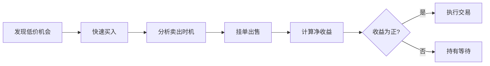

## 二、NFT交易平台操作

上一节我们完成了NFT的创作与铸造，但这只是第一步——让作品上链只是起点，真正的价值流转发生在交易平台上。本节将系统讲解主流NFT交易平台的选择、购买、出售、竞价等全流程操作，并深入讲解交易策略与安全防护，帮助你从"铸造者"进阶为"交易者"。

### 2.1 主流NFT交易平台全景对比

选择交易平台是NFT交易的第一步。不同平台在支持链、费率、用户群体、功能特性上差异显著，选错平台可能导致你的NFT无人问津，或交易成本远超预期。

#### 2.1.1 综合型交易平台

| 平台 | 支持链 | 手续费 | 版税机制 | 适合人群 |
|------|--------|--------|----------|----------|
| **OpenSea** | Ethereum, Polygon, Klaytn, Solana, Arbitrum, Base, Avalanche, BNB Chain | 2.5% | 创作者版税（可选，最低0.545%） | 新手入门、多链用户 |
| **Blur** | Ethereum, Blast | 0.5%（挂单）/ 0%（竞价） | 可选版税（最低0.5%） | 高频交易者、专业玩家 |
| **Rarible** | Ethereum, Polygon, Tezos, Immutable X | 1%（买卖双方各付） | 创作者自定义版税 | 独立创作者、策展型市场 |
| **Magic Eden** | Solana, Ethereum, Bitcoin (Ordinals), Polygon, Base | 2% | 可选版税 | Solana生态、比特币NFT |

#### 2.1.2 垂直型/特色平台

| 平台 | 定位 | 特色 |
|------|------|------|
| **Foundation** | 高端艺术 | 邀请制策展，以太坊艺术NFT，拍卖机制 |
| **SuperRare** | 稀缺数字艺术 | 审核制，单版NFT为主，高端收藏市场 |
| **Zora** | 创作者经济 | 零手续费铸造，创作者优先的协议设计 |
| **Tensor** | Solana专业交易 | 类似Blur的专业交易界面，实时数据看板 |
| **Unisat** | 比特币Ordinals | BRC-20和Ordinals铭文交易 |
| **Reservoir** | 聚合协议 | 聚合多平台订单，自动寻最优价格 |

#### 2.1.3 中国用户注意事项

由于政策环境，中国用户需注意以下几点：

- **法币出入金**：国内银行不直接支持NFT交易，需通过加密货币交易所（如OKX、Binance）进行法币兑换
- **平台访问**：部分平台可能需要网络工具访问，建议提前配置好
- **税务义务**：中国目前无明确的NFT税收政策，但通过交易所获得的收益可能涉及个人所得税申报
- **合规风险**：国内对虚拟货币交易有严格监管，建议使用海外平台并了解当地法规

### 2.2 交易前的准备工作

在开始交易之前，你需要完成以下基础配置：

#### 2.2.1 钱包准备

**必备钱包：**

| 钱包 | 类型 | 优势 | 适用场景 |
|------|------|------|----------|
| MetaMask | 浏览器插件+手机 | 最广泛支持，生态最完整 | 以太坊及EVM兼容链 |
| Phantom | 浏览器插件+手机 | Solana原生体验最佳 | Solana生态交易 |
| Rabby | 浏览器插件 | 安全性高，交易预览详细 | 专业交易者 |
| Ledger/Trezor | 硬件钱包 | 冷存储，安全性最高 | 大额资产存储 |

**钱包配置步骤（以MetaMask为例）：**

1. 从官网 metamask.io 下载安装浏览器插件
2. 创建新钱包，设置强密码（至少12位，含大小写字母、数字、特殊符号）
3. **备份助记词**：12个英文单词，按顺序抄写在纸上，存放在至少两个物理位置
4. 添加目标链的网络配置（如Polygon、Arbitrum等）
5. 从交易所转入少量ETH作为Gas费

**安全铁律：**
- 助记词绝不截图、绝不存云盘、绝不发给任何人
- 首次交易前先用小额（$5-10）测试完整流程
- 为不同用途准备不同钱包（交易钱包、存储钱包、实验钱包）

#### 2.2.2 资金准备

NFT交易需要两种资金：**Gas费**（网络手续费）和**购买资金**。

**各链Gas费参考（2025年数据）：**

| 链 | 单笔交易Gas费 | 拥堵时峰值 | 推荐最低准备 |
|----|--------------|-----------|-------------|
| Ethereum | $2-15 | $50-200+ | 0.1 ETH |
| Polygon | $0.001-0.01 | $0.05 | 1 MATIC |
| Solana | $0.00025 | $0.01 | 0.1 SOL |
| Base | $0.01-0.1 | $1 | 0.01 ETH |
| Blast | $0.01-0.5 | $2 | 0.01 ETH |

**降低Gas成本的技巧：**
- 使用 [Etherscan Gas Tracker](https://etherscan.io/gastracker) 或 [ultrasound.money](https://ultrasound.money) 监控实时Gas价格
- 北京时间凌晨2-6点（UTC 18:00-22:00）通常是Gas最低时段
- 周末Gas费通常低于工作日
- 使用Layer 2（Arbitrum、Base、Polygon）可降低90%以上的Gas费
- 在Blur等平台设置Gas上限，避免意外高Gas

#### 2.2.3 信息渠道建设

NFT交易是信息驱动的市场，你需要建立自己的信息网络：

**必备信息源：**

| 类型 | 工具/渠道 | 用途 |
|------|----------|------|
| 链上数据 | NFTGo, Dune Analytics | 交易量、持有者分布、地板价趋势 |
| 社区情报 | Discord, Twitter (X) | 项目动态、空投预告、社区情绪 |
| 聚合器 | Reservoir, Gem | 跨平台比价、批量购买 |
| 价格追踪 | CoinGecko NFT板块 | NFT市场整体行情 |
| 链上监控 | Nansen, Arkham | 聪明钱流向、鲸鱼动向 |

### 2.3 NFT购买操作详解

购买是NFT交易中最基础也最需要谨慎的环节。

#### 2.3.1 直接购买（Fixed Price / Buy Now）

以OpenSea为例，固定价格购买的完整流程：

**步骤一：浏览与筛选**

进入 opensea.io，在搜索栏输入项目名或通过分类浏览。使用筛选功能：
- **Status**：Buy Now（仅显示可直接购买的）
- **Price**：设置价格区间
- **Chains**：选择目标链
- **Sort by**：Price Low to High（找最低价）或 Recently Listed（找新上架）

**步骤二：查看NFT详情**

点击目标NFT后，重点检查以下信息：

```text
检查清单：
□ 项目名称和合集是否正确（注意仿冒合集）
□ 合约地址是否与官方公布一致
□ 拥有者数量和总供应量
□ 交易历史（是否有异常低价成交记录）
□ 属性稀有度（用 Rarity Sniper 或 Trait Sniper 查询）
□ 版税设置（了解创作者抽成比例）
```

**步骤三：执行购买**

1. 点击 "Buy Now" 按钮
2. 系统弹出交易确认窗口，显示总价（NFT价格 + 平台手续费 + 预估Gas费）
3. 点击 "Confirm" 后钱包弹出签名请求
4. **仔细核对**交易详情：价格、接收地址、Gas费是否合理
5. 确认无误后在钱包中签名
6. 等待区块链确认（以太坊通常15-30秒，Polygon 2-5秒）

**步骤四：确认到账**

- 返回OpenSea的 "My Collections" 确认NFT已显示
- 在区块浏览器（Etherscan/Polygonscan）确认交易状态为Success
- 如NFT未显示，尝试手动导入合约地址

#### 2.3.2 竞价购买（Make Offer）

竞价是用低于标价的价格向持有者发出购买请求，适合以下场景：
- 地板价过高，希望以更低价格买入
- 卖家设置了"接受竞价"选项
- 批量竞价多个NFT以捕获最低价

**竞价操作步骤：**

1. 在NFT详情页点击 "Make Offer"
2. 输入竞价金额（通常低于标价）
3. 选择支付货币（ETH、WETH、USDC等）
4. 设置竞价有效期（1天、3天、7天、1个月）
5. 首次竞价需授权平台使用你的WETH（一笔额外Gas费）
6. 确认并签名

**竞价策略：**
- 新上架NFT可在1小时内报地板价，卖家急于出售时可能接受
- 批量竞价（Collection Offer）对整个合集出价，系统自动匹配最低价卖家
- 设置多个阶梯价格的竞价，提高成交概率
- 在Blur上可使用Bid Wall功能批量挂单

#### 2.3.3 拍卖竞标（Auction）

拍卖适用于高价值NFT和艺术类作品。主流拍卖机制：

| 拍卖类型 | 机制 | 适用场景 |
|----------|------|----------|
| 英式拍卖 | 价高者得，公开竞价 | 高价值1/1艺术作品 |
| 荷兰式拍卖 | 价格随时间递减，首个出价者成交 | 批量发售、新项目铸造 |
| 英式拍卖+限时延长 | 最后N分钟有新出价则延长 | Foundation、SuperRare |

**拍卖参与注意事项：**
- 设置预算上限，避免FOMO（Fear of Missing Out）导致超支
- 关注拍卖结束时间，设置提醒
- 了解平台的"最后一刻延长"规则
- 拍卖成交后需在规定时间内完成支付（通常24-48小时）

#### 2.3.4 批量购买与聚合购买

当你需要一次购买多个NFT时，聚合购买能显著降低成本：

**Reservoir聚合购买流程：**
1. 访问 reservoir.tools，连接钱包
2. 搜索目标合集
3. 勾选多个NFT（支持跨平台选择）
4. 点击 "Buy Selected"，系统自动聚合来自OpenSea、Blur、LooksRare等平台的订单
5. 一次性签名完成所有购买
6. 节省多笔独立交易的Gas费

**Gem（已被OpenSea收购）：**
- 支持跨平台批量购买
- 可同时购买来自不同平台的NFT
- 一次交易完成多笔购买，节省Gas

### 2.4 NFT出售操作详解

出售NFT需要策略性的定价和时机选择。

#### 2.4.1 挂单出售（List for Sale）

**OpenSea挂单流程：**

1. 进入 "My Collections" 或钱包页面
2. 选择要出售的NFT
3. 点击 "Sell"
4. 选择出售方式：
   - **Fixed Price**：固定价格，买家可直接购买
   - **Timed Auction**：限时拍卖，设置起拍价和持续时间
5. 设置价格（以ETH或其他支持的代币计价）
6. 设置挂单有效期（1天至6个月）
7. 首次挂单需签署授权交易（允许OpenSea转移你的NFT）
8. 确认挂单

**挂单时的关键决策：**

```text
定价参考框架：
1. 查看地板价：该合集中最低的挂单价
2. 查看最近成交价：过去24小时/7天的平均成交价
3. 查看属性稀有度：稀有属性可溢价20%-500%
4. 查看市场趋势：上涨趋势可适当高挂，下跌趋势需快速出手
5. 计算实际到手价：售价 - 平台费 - 版税 - Gas费
```

#### 2.4.2 定价策略

| 策略 | 方法 | 适用场景 |
|------|------|----------|
| 地板价定价 | 挂在当前地板价或略低 | 需要快速出手，持有常见属性 |
| 稀有度溢价 | 参考稀有度排名，比地板价高10%-100% | 持有稀有属性的NFT |
| 分批出售 | 分成多批挂单，阶梯定价 | 持有多个同系列NFT |
| 跟随趋势 | 根据市场情绪动态调价 | 短线交易、套利 |
| 限价单思维 | 设定目标利润价位，不频繁调整 | 长线投资者 |

#### 2.4.3 批量挂单与管理

**Blur批量操作：**
Blur是目前最专业的批量交易工具：
- 支持一键挂单同一合集中的所有NFT
- 可设置统一价格或根据属性差异化定价
- 实时监控挂单状态，自动提醒被竞价
- 支持批量接受竞价

**LooksRare批量功能：**
- 支持批量挂单和批量取消
- 可一次交易挂出多个NFT

#### 2.4.4 取消挂单

需要注意：**取消挂单需要支付Gas费**（在以太坊上尤其明显）。

取消挂单的方式：
1. 在平台上点击 "Cancel Listing"
2. 在钱包中确认取消交易
3. 支付Gas费（以太坊上可能$5-20）

**重要警告：** 如果你将NFT从当前钱包转移到另一个钱包，之前的所有挂单并不会自动取消。这意味着新钱包中的NFT可能仍然有活跃的挂单，攻击者可以利用这一点。**转移NFT前务必先取消所有挂单。**

### 2.5 交易手续费详解

理解费用结构是计算盈亏的基础。

#### 2.5.1 费用组成

一笔NFT交易的总费用包含以下部分：

```text
总费用 = NFT价格 + 平台手续费 + 创作者版税 + Gas费（网络手续费）
```

**各平台费率对比：**

| 平台 | 卖家手续费 | 买家费用 | 版税策略 |
|------|----------|----------|----------|
| OpenSea | 2.5% | 无 | 可选，最低0.545% |
| Blur | 0.5%挂单/0%竞价 | 无 | 可选，最低0.5% |
| LooksRare | 1.5% | 无 | 可选 |
| Foundation | 5% | 无 | 10%创作者版税（固定） |
| SuperRare | 15%（首次）/3%（二级） | 无 | 10%创作者版税 |
| Magic Eden | 2% | 无 | 可选 |
| Rarible | 1% | 1% | 创作者自定义 |

#### 2.5.2 Gas费优化技巧

Gas费是可优化的最大成本项：

**基础优化：**
- 使用Gas追踪工具监控实时价格
- 选择低拥堵时段交易
- 使用Layer 2网络替代以太坊主网

**进阶优化：**
- 使用Blur等平台的Gas优化功能（批量交易打包）
- 设置Gas上限（Gas Cap），防止意外高额Gas
- 使用EIP-1559的"优先费"机制，在非紧急交易时选择较低优先级

**Gas费计算示例：**

```text
场景：在OpenSea上购买一个以太坊NFT

NFT价格：0.5 ETH
平台手续费：0.5 × 2.5% = 0.0125 ETH
创作者版税（假设5%）：已由卖家承担
Gas费（假设中等拥堵）：0.003 ETH

买家总成本：0.5 + 0.003 = 0.503 ETH

卖家实际到手：0.5 - 0.0125 - 0.025（版税）= 0.4625 ETH
```

### 2.6 进阶交易策略

掌握了基础操作后，可以学习以下进阶策略来提升交易收益。

#### 2.6.1 翻转交易（Flipping）

翻转是指低价买入、快速高价卖出的短线策略。

**翻转的核心逻辑：**



**翻转实战技巧：**

1. **地板价翻转**：在地板价支撑位买入，反弹后卖出
   - 工具：NFTGo的"Floor Price"图表
   - 关键：判断地板价是"真实支撑"还是"持续下跌"

2. **属性翻转**：买入被低估的稀有NFT
   - 工具：Rarity Sniper、Trait Sniper
   - 策略：找出稀有度排名靠前但价格接近地板价的NFT

3. **趋势翻转**：跟随项目热度周期操作
   - 买入时机：项目宣布重大合作/更新时的早期反应
   - 卖出时机：热度峰值（通常在公告后24-72小时）

**翻转风险管理：**
- 每次翻转的止损线设定在买入价的-20%
- 单笔交易不超过总资产的10%
- 始终预留足够的Gas费和生活资金
- 记录每笔交易的成本和收益，定期复盘

#### 2.6.2 竞价套利（Bid Sniping）

竞价套利是利用信息差和时间差获取低价NFT的策略。

**操作方法：**
1. 监控目标合集的竞价接受情况
2. 当出现以下信号时主动出价：
   - 持有者急需资金（可能在社交媒体透露）
   - 项目出现负面消息，持有者恐慌抛售
   - 新项目铸造后早期持有者快速清仓
3. 使用Blur的批量竞价功能，对整个合集设置阶梯竞价

**竞价套利的工具链：**
- NFTNerds：实时监控新上架和价格变化
- NFTFlip：自动计算翻转利润
- Discord Bot：设置地板价和成交量警报

#### 2.6.3 跨平台套利

不同平台之间同一NFT的价格可能存在差异：

**套利流程：**
1. 使用Reservoir等聚合器比价
2. 发现A平台价格低于B平台
3. 在A平台买入，转移到B平台出售
4. 利润 = B平台售价 - A平台买入价 - 双重手续费 - Gas费

**注意事项：**
- 跨平台转移需要时间，价格可能在转移期间变化
- 计算利润时必须扣除所有费用
- 以太坊主网的Gas费可能吃掉大部分利润，优先选择L2链
- 这种套利窗口通常很短（分钟级），需要自动化工具支持

#### 2.6.4 空投与白名单策略

许多NFT项目在铸造前会向特定地址空投或提供白名单资格：

**获取白名单的途径：**
- 参与项目Discord社区活动（邀请、贡献内容、参与讨论）
- 完成项目方设定的任务（发推、转发、加入等候名单）
- 持有特定NFT获得其他项目的白名单资格
- 参与项目方的抽奖活动

**空投捕获策略：**
- 保持钱包活跃度（频繁交易的地址更可能收到空投）
- 持有蓝筹NFT（如CryptoPunks、BAYC）的持有者经常收到空投
- 监控新项目方的空投公告
- 使用多个钱包参与（但注意项目方的反女巫机制）

### 2.7 交易安全与风险控制

NFT交易中安全问题频发，一次疏忽可能导致全部资产损失。

#### 2.7.1 常见诈骗手段与防范

| 诈骗类型 | 手法 | 防范措施 |
|----------|------|----------|
| **钓鱼网站** | 仿冒OpenSea/Blur界面，诱导签名 | 手动输入官方URL，检查SSL证书 |
| **虚假合集** | 创建名称/图片相似的仿冒NFT | 核对合约地址，查看官方链接 |
| **恶意签名** | 诱导签署SetApprovalForAll授权 | 仔细阅读签名内容，使用Rabby预览 |
| **假客服** | Discord私信冒充官方客服 | 官方永远不会私信索要助记词 |
| **拉地毯（Rug Pull）** | 项目方收钱后跑路 | 研究团队背景，不投匿名项目 |
| **清洗交易** | 自买自卖制造虚假交易量 | 用NFTGo查看持有者分布和交易真实性 |

#### 2.7.2 交易签名安全

NFT交易涉及多种签名操作，每种的风险等级不同：

```text
风险等级（从低到高）：
🟢 低风险：交易签名（明确显示交易金额和对象）
🟡 中风险：挂单签名（授权平台在特定条件下转移NFT）
🔴 高风险：SetApprovalForAll（授权合约无限转移你的所有NFT）
🔴 极高风险：Permit签名（授权合约使用你的代币余额）
```

**安全操作清单：**
- 使用Rabby钱包（可预览签名内容和风险等级）
- 永远不要签署你无法理解的签名请求
- 定期检查并撤销不必要的合约授权（使用 [revoke.cash](https://revoke.cash)）
- 对高价值资产使用硬件钱包
- 将交易钱包和存储钱包分离

#### 2.7.3 授权管理

NFT交易后，你可能授权了平台合约转移你的NFT。建议定期清理：

**撤销授权步骤：**
1. 访问 revoke.cash
2. 连接钱包
3. 查看所有活跃的授权
4. 对不再使用的授权执行 "Revoke"
5. 确认交易并支付Gas费

**推荐的授权管理频率：**
- 每月检查一次所有授权
- 每次在新平台交易后，交易完成即撤销授权
- 使用硬件钱包存储高价值资产，日常交易用软件钱包

### 2.8 税务与合规

NFT交易在多数司法管辖区都涉及税务义务。

#### 2.8.1 主要税务框架

| 地区 | 税务处理 | 税率范围 |
|------|----------|----------|
| 美国 | 资本利得税（持有>1年为长期，否则为短期） | 10%-37% |
| 欧盟 | 各国不同，多数视为资产处置 | 0%-45% |
| 日本 | 杂项收入 | 最高55% |
| 新加坡 | 无资本利得税 | 0% |
| 中国 | 目前无明确NFT税收政策，可能涉及个税 | 20%（如认定为财产转让所得） |

#### 2.8.2 交易记录管理

无论税务政策如何，养成记录习惯是必要的：

**建议记录的字段：**
```text
交易记录模板：
- 日期时间
- 交易类型（买入/卖出/铸造/空投）
- NFT名称和合约地址
- 交易金额（法币等值）
- Gas费
- 平台手续费
- 交易对方地址
- 交易哈希（TxHash）
```

**自动化工具：**
- [Koinly](https://koinly.io)：支持NFT交易的加密税务软件
- [TokenTax](https://tokentax.co)：自动导入链上交易记录
- [CryptoTaxCalculator](https://cryptotaxcalculator.io)：支持多链NFT税务计算

### 2.9 常见误区与纠正

**误区一："NFT越贵越好"**
事实：价格高不代表价值高，很多高价NFT是清洗交易制造的假象。必须通过链上数据分析验证交易真实性。

**误区二："蓝筹NFT永远不会亏"**
事实：即使是BAYC这样的蓝筹项目，地板价也可能从100 ETH跌到10 ETH以下。蓝筹只代表相对较低的归零风险，不代表稳赚。

**误区三："手续费不重要"**
事实：手续费会显著侵蚀利润。假设你翻转一个NFT赚了5%（约0.05 ETH），但平台手续费2.5% + 版税5% + Gas费0.003 ETH，实际可能亏损。

**误区四："不需要研究项目，跟风买就行"**
事实：跟风买入通常是接盘。你应该在热度起来之前研究并买入，而不是在社交媒体刷屏后才跟进。

**误区五："取消挂单不花钱"**
事实：在以太坊主网上取消挂单需要支付Gas费。在Blur等使用签名挂单的平台上，取消不需要Gas，但需要签名操作。

### 2.10 实操演练

#### 演练一：首次购买NFT（Polygon链，低成本练习）

**目标：** 以不到$5的成本完成一次完整的NFT购买流程

**步骤：**
1. 准备MetaMask钱包并切换到Polygon网络
2. 从交易所购买$10的MATIC并转入钱包
3. 访问OpenSea，筛选Polygon链上的免费或低价NFT
4. 找到一个价格低于1 MATIC的NFT
5. 完成购买流程
6. 在Polygonscan上查看交易记录
7. 确认NFT出现在你的OpenSea个人页面

#### 演练二：挂单与竞价体验

**目标：** 体验卖方和买方的不同操作

**步骤：**
1. 将演练一购买的NFT挂单出售（定价略高于买入价）
2. 使用另一个钱包（或请朋友）对该NFT出价
3. 接受竞价，完成交易
4. 计算实际盈亏（扣除所有费用）

#### 演练三：链上数据分析

**目标：** 学会使用工具分析NFT项目

**步骤：**
1. 选择一个热门NFT项目（如Pudgy Penguins）
2. 在NFTGo上查看：地板价趋势、交易量、持有者分布
3. 在Dune Analytics上找到该项目的仪表板
4. 分析是否存在清洗交易的迹象
5. 撰写一份简短的项目分析报告

### 2.11 本节要点

- **平台选择决定成本和流动性**：Blur适合高频交易（低手续费），OpenSea适合新手（界面友好），Foundation适合艺术品（高端市场）
- **交易前准备是基础**：钱包安全配置、充足的资金（Gas费+购买资金）、可靠的信息渠道
- **费用计算决定盈亏**：平台手续费、创作者版税、Gas费三者叠加可能吃掉大部分利润
- **安全意识是底线**：钓鱼网站、恶意签名、虚假合集是最常见的威胁，养成核验习惯
- **策略优于冲动**：无论是翻转还是长持，都需要有明确的入场理由、目标价位和止损线
- **记录交易是合规基础**：无论所在地区税务政策如何，养成记录习惯为未来做好准备

