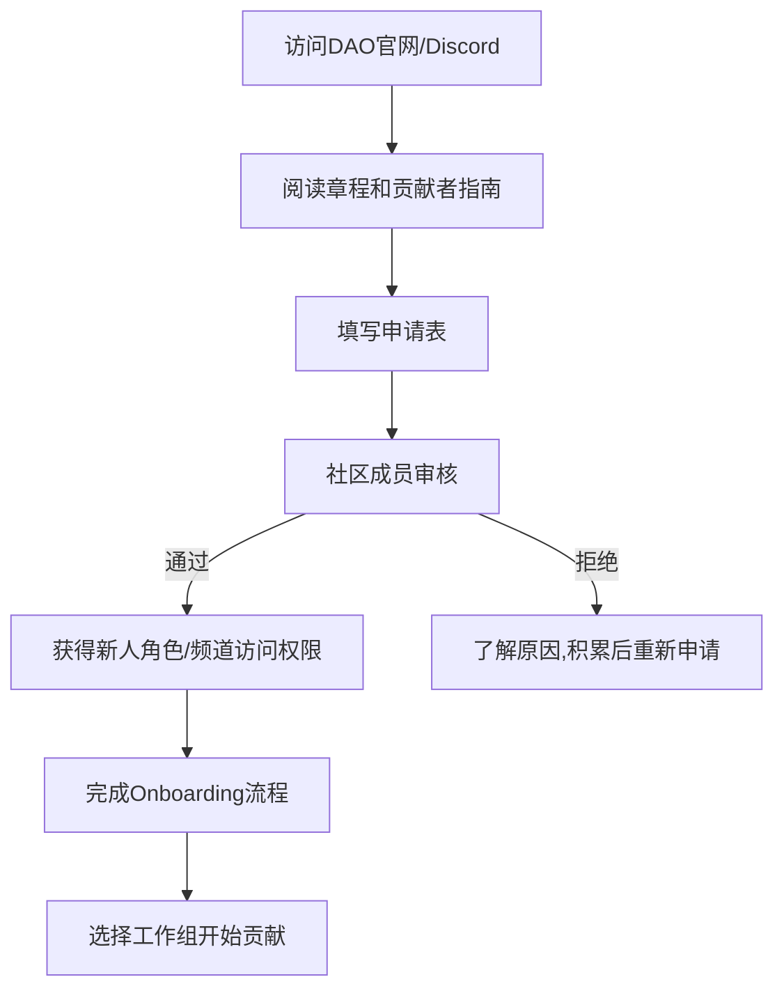
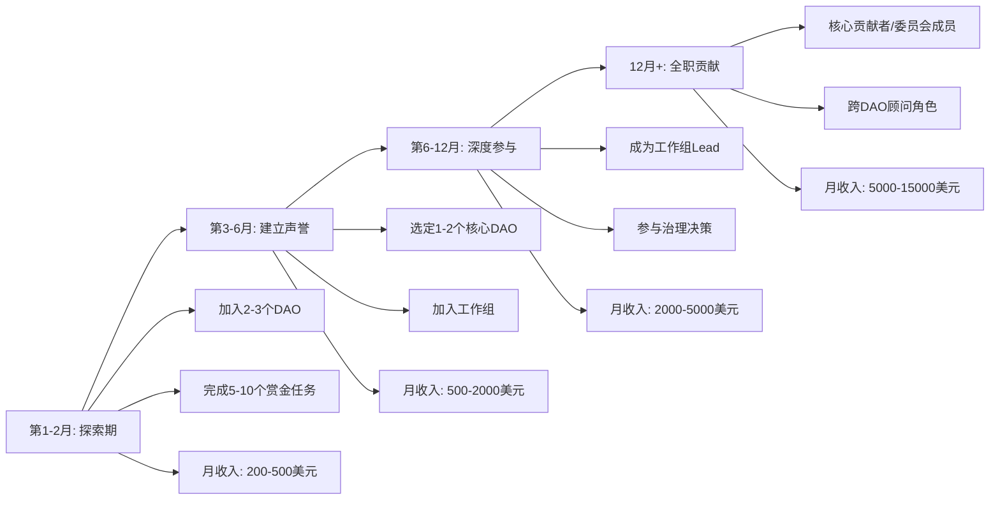

## 三、DAO参与方法

DAO（去中心化自治组织）是Web3时代最具颠覆性的组织形态之一。与传统公司不同，DAO通过智能合约运行治理规则，成员通过持有治理代币或NFT获得投票权，共同决定组织的资金使用、发展方向和规则变更。参与DAO不仅是Web3生态的入门路径，更是普通人获取加密资产、积累链上声誉、拓展行业人脉的高效方式。

本节从实际操作角度出发，系统讲解如何选择DAO、加入DAO、在DAO中贡献价值并获取回报。

---

### 1. DAO的类型与选择

#### 1.1 主流DAO类型

不同类型的DAO参与门槛、收益模式和技能要求差异极大。选对类型是成功参与的第一步。

| DAO类型 | 代表项目 | 核心职能 | 参与门槛 | 典型回报 |
|---------|---------|---------|---------|---------|
| 协议治理DAO | Uniswap (UNI)、Aave (AAVE)、MakerDAO (MKR) | 投票决定协议参数、资金分配、升级提案 | 需持有治理代币 | 间接收益（代币增值） |
| 投资/风投DAO | MetaCartel Ventures、The LAO、FlamingoDAO | 集资投资NFT项目、早期Web3项目 | 通常需申请审核+出资 | 投资分红 |
| 社交/会员DAO | Friends with Benefits (FWB)、Bored Ape YC | 社交网络、线下活动、品牌建设 | 持有特定NFT或代币 | 社交资本、独家信息 |
| 赏金/贡献者DAO | BanklessDAO、RaidGuild、DAOhaus | 内容创作、开发服务、市场推广 | 提交申请或完成赏金任务 | 按贡献获取代币报酬 |
| 收藏DAO | PleasrDAO、ConstitutionDAO | 集资购买高价值资产（艺术品、文物等） | 出资参与 | 资产份额或代币 |
| 媒体DAO | Bankless、Rekt、Decrypt | 内容生产、社区传播 | 贡献内容或持有代币 | 内容稿费+代币激励 |
| 开发者DAO | Gitcoin、Ethereum Name Service DAO | 开源开发、公共物品资助 | 提交代码或提案 | 赏金+grant |
| 游戏/元宇宙DAO | Yield Guild Games (YGG)、Merit Circle | 游戏资产租赁、奖学金计划 | 持有代币或通过审核 | 游戏收益分成 |

#### 1.2 选择DAO的核心评估维度

并非所有DAO都值得投入时间。以下是评估DAO质量的关键指标：

**治理活跃度**：查看Snapshot.org上的投票记录。优质DAO每周至少有1-2个提案在讨论或投票，且投票参与率（quorum）通常在10%以上。如果一个DAO连续数月没有提案或投票参与率极低，说明治理形同虚设。

**资金库透明度**：通过DeepDAO、Boardroom或直接查看DAO的多签钱包（Gnosis Safe），确认资金库余额和支出记录。优质DAO的资金使用有明确的预算分配和审批流程。

**社区质量**：加入Discord后观察：是否有活跃的讨论频道？新人提问是否有人回答？是否有定期的社区会议（Town Hall）？高质量DAO通常有完善的新人引导流程（onboarding）。

**代币经济模型**：查看代币分配方案——团队占比是否过高（超过30%需警惕）、是否有合理的释放周期（vesting）、社区激励占比是否充足。通过Token Unlocks网站可以查看代币解锁时间表。

**代码与合约安全**：对于协议类DAO，查看是否经过知名审计公司（Trail of Bits、OpenZeppelin、Consensys Diligence）审计，是否有bug赏金计划。

#### 1.3 新手推荐的入门DAO

如果你是第一次参与DAO，建议从以下类型开始：

- **BanklessDAO**：最大的Web3媒体/教育DAO之一，有完善的新人引导流程，贡献者可以参与写作、翻译、设计、开发等多种角色，按贡献获取BANK代币奖励
- **GitcoinDAO**：专注于开源公共物品资助，通过参与Gitcoin Grants的二次方投票（Quadratic Funding）可以低成本学习DAO治理
- **DAOrayaki**：中文社区友好的DAO研究组织，翻译和研究Web3前沿课题，适合中文母语者入门

---

### 2. 加入DAO的完整流程

#### 2.1 前置准备

**钱包配置**：几乎所有DAO交互都需要Web3钱包。推荐MetaMask（浏览器插件+移动端），安装后完成以下配置：

```text
1. 安装MetaMask浏览器插件（Chrome/Firefox/Brave）
2. 创建新钱包，安全备份助记词（12个英文单词）
3. 助记词必须离线保存——写在纸上存放在安全位置
4. 切勿截图、拍照或存储在任何联网设备上
5. 设置强密码，启用自动锁定
```

**Gas费准备**：部分DAO操作（如铸造成员NFT、提交链上提案）需要ETH作为Gas费。在以太坊主网准备0.05-0.1 ETH作为初始Gas储备。如果预算有限，优先使用Layer 2网络（Arbitrum、Optimism）上的DAO，Gas费可降低90%以上。

**社交账号准备**：多数DAO使用Discord作为主要沟通平台，部分使用Telegram或Guild.xyz。确保你有一个活跃的Discord账号，并熟悉基本操作（加入服务器、阅读频道、使用bot命令）。

**链上身份构建**：部分DAO会审查申请者的链上活动。日常使用中逐步积累以下链上凭证有助于提高申请通过率：

| 凭证类型 | 获取方式 | 工具 |
|---------|---------|------|
| ENS域名 | 注册yourname.eth | ens.domains |
| Gitcoin Passport | 绑定多个Web2/Web3身份 | passport.gitcoin.co |
| POAP徽章 | 参加社区活动领取 | poap.xyz |
| Lens Profile | 去中心化社交身份 | lens.xyz |
| 链上交易历史 | 日常DeFi交互、NFT交易 | Etherscan |

#### 2.2 申请加入

不同DAO的加入方式差异显著：

**无许可加入（Permissionless）**：持有特定代币或NFT即可自动成为成员。例如持有1个BAYC NFT即为BAYC社区成员，持有UNI代币即可参与Uniswap治理投票。这类DAO的门槛在于经济成本。

**申请制加入（Application-based）**：需要填写申请表、通过社区审核。典型流程如下：



**出资加入（Capital-based）**：投资/风投类DAO通常要求出资加入。例如The LAO要求成员出资至少310 ETH（约10万美元），MetaCartel Ventures要求出资至少50 ETH。这类DAO适合高净值人群。

#### 2.3 Onboarding（新人引导）

成功加入DAO后的前两周至关重要。以下是标准的onboarding流程：

**第一天**：
1. 阅读DAO的Wiki/Notion知识库，了解组织架构、使命和当前重点
2. 加入Discord的#introductions频道，发布自我介绍（包含你的技能、感兴趣的工作组、可用时间）
3. 标记所有重要频道（#announcements、#governance、#general）

**第一周**：
1. 参加至少一次社区会议（Town Hall/Sync Call），观察DAO的决策流程
2. 浏览各工作组（Working Group）的频道，了解不同组的职能
3. 在#help-wanted或#bounty频道寻找你能胜任的小任务

**第二周**：
1. 主动认领并完成一个小型任务（翻译文章、设计图片、修复文档中的错误等）
2. 在相应频道提交成果并请求反馈
3. 加入一个你感兴趣的工作组

---

### 3. 在DAO中贡献价值

#### 3.1 常见贡献角色

DAO中的工作角色与传统公司有相似之处，但更加灵活和开放。一个成员可以同时担任多个角色，也可以随时切换。

**内容创作者**：撰写Newsletter、研究文章、教程、翻译。适合有写作能力的人。报酬通常按篇计算，优质DAO的稿费在50-500美元/篇。

**开发者**：前端/后端/智能合约开发。这是DAO中报酬最高的角色。熟练的Solidity开发者在DAO中的时薪可达100-300美元。

**社区经理**：管理Discord、组织活动、引导新人、调解冲突。适合社交能力强的人。

**设计师**：UI/UX设计、品牌视觉、NFT创作。需要熟悉Web3审美趋势。

**研究员**：市场分析、竞品研究、技术调研。适合有分析能力的人。

**运营/项目管理**：协调工作组、追踪进度、管理预算。适合有组织管理经验的人。

**翻译/本地化**：将DAO的内容翻译为不同语言。中文翻译需求尤其旺盛，因为大量优质DAO的内容以英文为主。

#### 3.2 赏金任务（Bounty）实操

赏金任务是新手在DAO中赚取收入的最直接方式。以下是完整的赏金任务参与流程：

**步骤一：发现赏金**

主流赏金来源：
- **BanklessDAO赏金板**：Discord内的#bounty频道
- **Gitcoin Bounties**：bounty.gitcoin.co
- **Dework**：dework.xyz——Web3项目管理平台，大量DAO在上面发布任务
- **Layer3**：layer3.xyz——完成任务获取XP和代币奖励
- **Rabbithole**：rabbithole.gg——通过完成链上操作获取凭证和奖励

**步骤二：评估任务**

在认领赏金前，评估以下因素：

| 评估维度 | 关键问题 | 决策依据 |
|---------|---------|---------|
| 报酬合理性 | 报酬是否匹配工作量？ | 计算时薪，低于20美元/小时需谨慎 |
| 支付方式 | 用什么代币支付？ | 优先选择流动性好的代币（ETH、USDC） |
| 截止时间 | 是否能在deadline前完成？ | 预留至少20%的缓冲时间 |
| 审核标准 | 交付标准是否明确？ | 模糊标准的任务风险较高 |
| 声誉影响 | 完成此任务是否提升声誉？ | 知名DAO的任务更有声誉价值 |

**步骤三：认领并执行**

```text
1. 在赏金平台点击"Claim"或在Discord回复表示认领
2. 与任务发布者确认具体需求和交付标准
3. 按计划执行，定期更新进度（至少每2天一次）
4. 完成后提交成果并请求审核
5. 根据反馈修改（通常需要1-2轮迭代）
6. 审核通过后等待支付（通常1-7天）
```

**步骤四：建立声誉**

完成赏金后，在以下平台记录你的贡献：
- Dework个人档案（自动记录）
- 自建的贡献履历表（用于申请其他DAO的正式角色）
- Twitter/社交媒体分享你的成果（增加曝光度）

#### 3.3 治理参与

治理参与是DAO的核心，也是获得更大影响力和收益的关键路径。

**提案参与的层级**：

1. **投票（Voting）**：最基本的参与方式。持有治理代币后，在Snapshot或链上治理平台对提案进行投票。单个投票通常只需几分钟。

2. **讨论（Discussion）**：在治理论坛（如Discourse、Commonwealth）对提案发表意见。高质量的评论可以影响最终投票结果。

3. **温度检查（Temperature Check）**：在正式提案前发起非约束性投票，测试社区对某想法的态度。这通常需要持有一定数量的代币（如Uniswap要求持有250万UNI）。

4. **正式提案（Governance Proposal）**：提交可执行的治理提案。门槛最高——Uniswap要求持有1000万UNI才能提交正式提案。对于个人持有者，可以通过委托（delegation）机制间接获得提案权。

5. **委员会/理事会成员**：通过选举成为DAO的特定委员会成员（如拨款委员会、风险委员会），获得更直接的决策权和报酬。

**治理参与的收益**：

许多DAO对治理参与者提供额外激励：
- **投票奖励**：部分DAO直接向投票者分配代币奖励
- **委托激励**：Compound、Aave等协议向活跃的委托代表提供报酬
- **信息优势**：深度参与治理能提前了解协议发展方向，为投资决策提供信息优势
- **声誉积累**：活跃的治理参与者在Web3行业中享有较高声誉，容易获得顾问、大使等付费角色

---

### 4. DAO收益模式详解

#### 4.1 收益来源分类

| 收益类型 | 描述 | 稳定性 | 门槛 |
|---------|------|--------|------|
| 贡献报酬 | 完成任务/赏金获取代币 | 中等（按任务） | 低 |
| 治理激励 | 参与投票/提案获取奖励 | 低-中等 | 中（需持有代币） |
| 代币增值 | DAO代币价格上涨 | 高波动 | 低-高 |
| 投资分红 | 投资类DAO的利润分配 | 低-中等 | 高（需出资） |
| 空投 | 基于贡献历史的代币空投 | 不可预测 | 中 |
| 薪资 | 全职贡献者的固定报酬 | 高 | 高（需建立声誉） |

#### 4.2 代币报酬的税务与合规

DAO报酬的税务处理因国家/地区而异，但以下是通用注意事项：

- **记录每笔收入**：记录代币接收日期、数量、当时市场价格
- **区分收入类型**：服务报酬按普通收入纳税，代币增值按资本利得纳税
- **使用专业工具**：TokenTax、Koinly、CryptoTaxCalculator等工具可以自动计算税款
- **咨询专业会计师**：如果年收入超过1万美元，强烈建议咨询了解加密货币的会计师

#### 4.3 从副业到全职的路径

以下是DAO贡献者从入门到全职的典型发展路径：



---

### 5. DAO参与的风险与应对

#### 5.1 常见风险

**智能合约风险**：DAO资金库依赖多签钱包和智能合约。如果合约存在漏洞，资金可能被盗。应对方法：优先选择经过审计的DAO，关注安全事件报道。

**治理攻击**：恶意行为者可能通过大量购买代币来操纵投票结果（"51%攻击"的治理版本）。应对方法：关注投票权分布，警惕异常的代币集中。

**法律不确定性**：DAO的法律地位在多数国家尚不明确，成员可能面临无限连带责任。2022年美国Ooki DAO被CFTC起诉的案例开创了监管先河。应对方法：了解所在司法管辖区的法律态度，优先选择有法律实体（如Wyoming DAO LLC）的DAO。

**代币贬值**：DAO代币价格可能大幅下跌。如果你的收入主要以DAO代币形式获取，实际收入可能远低于预期。应对方法：定期将部分代币兑换为稳定币（USDC/DAI），分散持有。

**贡献者倦怠**：DAO的去中心化特性意味着没有固定上下班时间，贡献者容易过度投入。应对方法：设定每周贡献时间上限，定期评估投入产出比。

**Rug Pull**：部分DAO可能是骗局——创始团队在募集资金后跑路。应对方法：调查团队背景、查看代码是否开源、确认资金库是否由多签控制。

#### 5.2 安全操作规范

在DAO中活动时，务必遵守以下安全规范：

1. **验证链接真实性**：钓鱼攻击是Web3最常见的安全威胁。永远通过官方渠道（官网、官方Twitter）获取链接，不点击Discord私信中的链接
2. **使用硬件钱包**：将主要资产存放在Ledger或Trezor等硬件钱包中，MetaMask仅保留少量日常使用的资金
3. **审查交易签名**：在签署任何交易前，仔细阅读MetaMask弹出的权限说明。警惕"setApprovalForAll"等无限授权操作
4. **隔离钱包**：为不同的DAO活动使用不同的钱包地址，避免一个钱包被攻破导致全部资产损失
5. **启用2FA**：Discord、GitHub等关联账号必须启用两步验证

---

### 6. DAO工具生态

#### 6.1 核心工具清单

| 工具类别 | 工具名称 | 用途 | 网址 |
|---------|---------|------|------|
| 治理平台 | Snapshot | 链下投票（无Gas费） | snapshot.org |
| 治理平台 | Tally | 链上治理投票 | tally.xyz |
| 治理平台 | Boardroom | 跨DAO治理仪表板 | boardroom.io |
| 项目管理 | Dework | 赏金发布与追踪 | dework.xyz |
| 项目管理 | Wonderverse | DAO协作工具 | wonderverse.xyz |
| 资金管理 | Gnosis Safe | 多签钱包 | gnosis-safe.io |
| 资金管理 | Llama | 资金库管理 | llama.xyz |
| 数据分析 | DeepDAO | DAO数据分析与排名 | deepdao.io |
| 数据分析 | DAOstar | DAO标准与元数据 | daostar.org |
| 成员管理 | Guild.xyz | 基于链上条件的角色分配 | guild.xyz |
| 成员管理 | Collab.Land | Discord/Telegram代币门控 | collab.land |
| 声誉系统 | Coordinape | 基于同行评价的贡献奖励 | coordinape.com |
| 声誉系统 | SourceCred | 基于贡献图谱的信誉系统 | sourcecred.io |
| 通讯协作 | Discord | 主要沟通平台 | discord.com |
| 文档协作 | Notion/Outline | 知识库管理 | notion.so / getoutline.com |

#### 6.2 链上分析工具

了解DAO的整体健康状况需要使用链上分析工具：

- **DeepDAO**：提供3000+个DAO的综合数据，包括成员数、资金库余额、提案数量、投票参与率等关键指标
- **Boardroom**：一站式查看你持有代币的所有协议的治理提案，支持直接投票
- **Messari Governor**：提供详细的治理分析和提案追踪
- **Dune Analytics**：可以通过SQL查询自定义DAO数据分析仪表板

---

### 7. 进阶策略

#### 7.1 多DAO参与策略

经验丰富的DAO贡献者通常同时参与多个DAO，但需要注意策略：

**核心+卫星模式**：选择1个DAO作为核心投入对象（每周10-15小时），2-3个DAO作为卫星参与对象（每周2-3小时）。核心DAO用于深度参与和收入来源，卫星DAO用于信息获取和网络扩展。

**技能复用模式**：将同一技能应用到多个DAO。例如一位设计师可以同时为3-4个DAO提供设计服务，实现技能价值最大化。

**垂直深耕模式**：在某个垂直领域（如DeFi安全、NFT策展、DAO治理设计）成为专家，然后为该领域的多个DAO提供顾问服务。

#### 7.2 治理委托（Delegation）策略

如果你持有治理代币但没有时间参与投票，可以将投票权委托给活跃的治理代表。反之，如果你希望获得更大的治理影响力，可以争取成为受托代表。

**成为治理代表的步骤**：
1. 在Tally或Snapshot上创建代表档案
2. 撰写你的治理理念声明（为什么社区应该委托给你）
3. 对每个提案发表经过深思熟虑的投票理由
4. 定期发布治理报告，向委托人透明展示你的投票记录
5. 在社交媒体上分享你的治理见解，吸引委托人

知名治理代表（如Compound的she256、Uniswap的abrandlater）通常能获得协议方的额外激励报酬。

#### 7.3 建立DAO间网络效应

当你的链上声誉积累到一定程度后，可以利用跨DAO网络创造更大价值：

- **成为跨DAO大使**：在两个或多个DAO之间建立合作关系
- **发起联合提案**：推动不同DAO之间的资源互补和协同
- **DAO顾问**：为新成立的DAO提供治理设计、代币经济模型等方面的咨询
- **DAO孵化器**：帮助传统组织转型为DAO，收取咨询费或获取代币分配

---

### 8. 实操检查清单

以下是从零开始参与DAO的完整行动清单：

**准备阶段（第1周）**：
- [ ] 安装MetaMask并备份助记词
- [ ] 注册ENS域名（可选但推荐）
- [ ] 创建Discord账号并加入3-5个目标DAO的服务器
- [ ] 阅读每个DAO的Wiki/文档，了解其使命和结构

**探索阶段（第2-4周）**：
- [ ] 参加至少2次DAO的社区会议
- [ ] 在#introductions频道发布自我介绍
- [ ] 浏览Dework/Layer3上的赏金任务
- [ ] 认领并完成第一个小型赏金任务

**建立阶段（第2-3月）**：
- [ ] 加入一个工作组
- [ ] 完成3-5个赏金任务，建立贡献记录
- [ ] 在治理论坛发表至少2次有价值的评论
- [ ] 开始使用Coordinape等声誉工具记录贡献

**深化阶段（第4-6月）**：
- [ ] 成为工作组的活跃贡献者
- [ ] 开始参与治理投票
- [ ] 考虑申请治理委托
- [ ] 评估收入并优化贡献策略

---

### 9. 常见误区与纠正

| 误区 | 正确认知 |
|------|---------|
| "加入DAO就能赚钱" | DAO不是被动收入来源，需要主动贡献才能获得回报 |
| "持有的代币越多话语权越大" | 虽然代币权重很重要，但真正的影响力来自持续贡献和社区信任 |
| "DAO是完全去中心化的" | 大多数DAO仍有核心团队和事实上的层级结构，去中心化是目标而非现状 |
| "可以在DAO中匿名工作" | 长期参与需要建立声誉，完全匿名很难获得核心角色和信任 |
| "DAO贡献没有职业发展" | 优秀的DAO贡献者可以获得全职职位、顾问角色和行业人脉，职业发展路径清晰 |
| "只需要技术能力" | 内容创作、社区管理、项目运营等非技术角色同样重要且需求旺盛 |
| "加入越多DAO越好" | 深度参与1-2个DAO比浅度参与10个DAO更有价值 |

---

### 10. 本节要点回顾

1. **选对DAO**：评估治理活跃度、资金库透明度、社区质量和代币经济模型，新手从BanklessDAO、GitcoinDAO等成熟DAO开始
2. **完成Onboarding**：第一周读文档、参加会议、发布介绍；第二周认领并完成第一个任务
3. **持续贡献**：通过赏金任务、工作组参与和治理投票逐步建立链上声誉
4. **管理风险**：使用硬件钱包、定期兑换稳定币、了解法律合规要求
5. **长期视角**：DAO参与是一项需要6-12个月才能看到显著回报的长期投入，耐心和持续性比短期投机更重要
