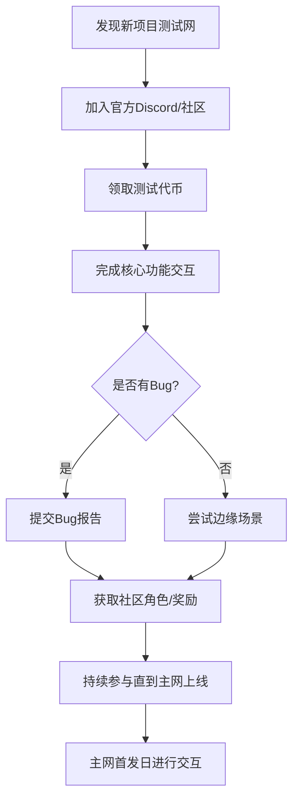
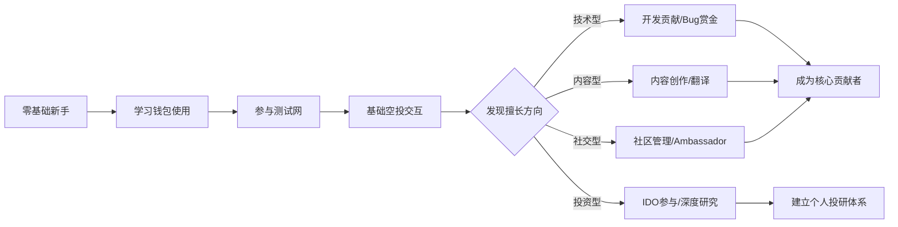

## 五、Web3项目参与

Web3项目参与不是"买币等涨"——那叫投资。真正的项目参与是指你以用户、贡献者、建设者或早期支持者的身份深度介入一个Web3项目，通过提供时间、技能、资本或注意力来获取回报。这种回报可能是代币空投、社区地位、技能成长、人脉网络，也可能是直接的经济收益。

与传统互联网产品不同，Web3项目的核心特征是**用户即股东**。你在项目早期的每一次交互、每一笔交易、每一个贡献，都可能被记录在链上，成为未来代币分配的依据。理解这一点，是参与Web3项目的前提。

### 5.1 项目识别与评估框架

在投入任何时间或资金之前，你需要一套结构化的评估方法。Web3领域充斥着骗局（Rug Pull）、低质量项目和过度炒作的泡沫，盲目参与的结果大概率是亏损。

#### 5.1.1 团队背景审查

**核心原则：匿名团队的风险远高于实名团队。**

验证团队的步骤：

1. **创始人身份核查**：在LinkedIn、Twitter/X上搜索创始人信息，确认其职业背景是否可验证。匿名创始人并非绝对不可信（比特币创始人中本聪就是匿名的），但对于新项目，匿名意味着"跑路零成本"。
2. **过往项目记录**：在Crunchbase、ICOBench或链上浏览器上查询创始人之前参与的项目。如果之前的项目以失败或跑路告终，新项目大概率重蹈覆辙。
3. **投资机构背书**：查看项目是否获得知名VC投资（a16z、Paradigm、Sequoia、Binance Labs、Coinbase Ventures）。VC背书不是质量保证，但至少意味着经过了专业尽职调查。
4. **GitHub活跃度**：对于技术型项目，GitHub代码提交频率、贡献者数量、Issue处理速度是判断项目是否在真做事的核心指标。一个三个月没有代码提交的"热门项目"基本可以排除。

#### 5.1.2 技术审计与安全性

**未审计的智能合约是最大的隐形风险。**

智能合约审计流程：

```text
项目方提交合约代码 → 审计机构审查 → 出具审计报告 → 项目方修复漏洞 → 复审确认
```

**权威审计机构排名**（按行业认可度）：

| 审计机构 | 代表客户 | 审计费用范围 | 报告质量 |
|----------|----------|-------------|----------|
| Trail of Bits | Uniswap、Compound | $50K-$200K | 极高，深度技术分析 |
| OpenZeppelin | Aave、Governor | $30K-$150K | 高，开源工具完善 |
| CertiK | PancakeSwap、Polygon | $10K-$100K | 中高，覆盖面广 |
| PeckShield | BSC生态项目 | $5K-$50K | 中，性价比高 |
| SlowMist（慢雾） | 中文社区项目 | $5K-$30K | 中，中文报告友好 |

**自查方法**：

- 在项目文档中搜索"audit"关键词，找到审计报告PDF
- 在DeFiLlama或项目官网确认审计范围是否覆盖当前版本合约
- 检查审计报告中的漏洞是否已被修复（报告会标注"Resolved"或"Unresolved"）
- 如果项目声称"正在审计中"但迟迟不出报告——高度警惕

#### 5.1.3 代币经济学分析

代币经济学（Tokenomics）决定了一代币的长期价值走向。一个设计糟糕的代币经济模型，即使团队再优秀、产品再好用，代币价格也大概率归零。

**关键指标**：

| 指标 | 健康范围 | 危险信号 |
|------|----------|----------|
| 团队/顾问占比 | 10%-20% | 超过30% |
| 社区/生态激励占比 | 30%-50% | 低于20% |
| 投资人占比 | 10%-20% | 超过25% |
| 解锁周期（Cliff） | 6-12个月 | 无锁定期或少于3个月 |
| 线性释放期 | 2-4年 | 少于1年（抛压集中） |
| 流通量/总量比 | 初始10%-30% | 初始超过50%（FDV被透支） |

**实操：如何查代币经济学**

1. 打开项目官网或文档，找到"Tokenomics"页面
2. 记录代币总量、初始流通量、各分配比例
3. 在Token Unlocks（token.unlocks.app）上查询解锁时间表
4. 计算当前完全稀释估值（FDV = 当前价格 × 总量），与流通市值对比
5. 如果FDV是流通市值的10倍以上，意味着未来有巨大的抛压

#### 5.1.4 社区质量评估

社区不是看人数——100万人的Discord里99万是机器人没有意义。

**有效评估维度**：

- **Discord活跃度**：观察每天的实际消息数量（而非总人数），是否有高质量的技术讨论
- **Telegram治理**：管理员是否回答技术问题，还是只会喊"to the moon"
- **Twitter/X互动**：项目推文的真实评论质量（不是清一色的"GM"和火箭emoji）
- **开发者社区**：是否有Hackathon、Grant计划、开发者文档
- **治理论坛**：Snapshot上是否有真实的提案和投票讨论

**快速判断法**：在Discord里发一个技术性问题（比如"你们的跨链桥用的是什么验证机制"），如果5分钟内有人给出专业回答，这个社区有真人在参与。如果只有bot回复"请查看FAQ"或无人回应——要么社区空心化，要么你进了假服务器。

### 5.2 空投（Airdrop）获取策略

空投是Web3项目向早期用户分发代币的行为，本质是项目方将营销预算直接分配给真实用户。空投是普通参与者获取超额回报的最重要途径之一——前提是你用正确的方法。

#### 5.2.1 空投的底层逻辑

项目方为什么发空投？三个核心原因：

1. **去中心化需求**：监管要求代币分配足够分散，否则可能被认定为证券
2. **用户增长**：空投是最高效的获客手段——用户为了获取空投会主动使用产品
3. **社区建设**：空投将用户变成利益相关者（Stakeholder），提升社区粘性

理解这个逻辑后，你就能判断哪些项目"可能发空投"：**尚未发币、有VC投资、用户增长需求强烈、有去中心化诉求的项目**。

#### 5.2.2 历史空投案例复盘

| 项目 | 空投时间 | 单地址最低价值 | 最高价值 | 核心交互行为 |
|------|----------|---------------|----------|-------------|
| Uniswap | 2020.09 | ~$1,200 | $16,000+ | 使用过协议进行交易 |
| ENS | 2021.11 | ~$500 | $30,000+ | 注册过.eth域名 |
| Optimism | 2022.05 | ~$500 | $5,000+ | 跨链桥使用+治理参与 |
| Arbitrum | 2023.03 | ~$1,000 | $20,000+ | 多样化协议交互 |
| LayerZero | 2024.06 | ~$300 | $10,000+ | 跨链桥Stargate使用 |
| EigenLayer | 2024.05 | ~$500 | $8,000+ | 再质押（Restaking） |

**关键观察**：价值最高的空投往往来自基础设施层项目（公链、跨链桥、协议），而非应用层项目。

#### 5.2.3 系统性空投获取方法论

**第一层：基础交互（必须完成）**

```text
Step 1: 准备多个独立地址（非必须，但多地址策略可放大收益）
Step 2: 在目标链上进行真实交易（Swap、转账、NFT Mint）
Step 3: 使用跨链桥将资产从以太坊主网转入目标链
Step 4: 与目标协议的核心功能进行交互（借贷、交易、质押）
Step 5: 保持持续性——每月至少交互2-3次，而非一次性操作
```

**第二层：深度参与（显著提升权重）**

- **治理投票**：在Snapshot上对目标协议的提案投票。很多空投快照会将治理参与作为加权因子
- **测试网贡献**：参与项目的测试网，提交Bug报告。测试网用户在空投中通常享有额外权重
- **Gitcoin捐赠**：使用Gitcoin Passport提升身份验证分数，向公共物品捐赠（Quadratic Funding机制放大小额捐赠的影响）
- **社区贡献**：在Discord中回答问题、翻译文档、制作教程——部分项目会将社区贡献纳入空投标准

**第三层：高级策略（需要更多时间和资金）**

- **流动性提供**：在目标协议的资金池中提供流动性，证明你是真实的DeFi用户
- **节点运行**：部分项目（如Pocket Network、Akash）会奖励运行节点的用户
- **开发者贡献**：如果你有编程能力，为项目提交PR、构建生态工具

#### 5.2.4 空投猎人的成本计算

空投不是零成本的。每次交互都有Gas费、时间成本和机会成本。

**成本估算模型**（以以太坊L2为例）：

| 成本项 | 单次成本 | 月交互10次 | 备注 |
|--------|----------|-----------|------|
| Gas费（L2） | $0.01-$0.5 | $0.05-$5 | L2远低于主网 |
| 跨链桥费 | $1-$5 | $5-$25 | 官方桥通常更贵 |
| 时间成本 | 10-30分钟 | 2-5小时 | 含研究和操作 |
| 资金占用 | 因人而异 | — | 需要资金在链上停留 |

**盈亏平衡分析**：假设你每月在5条链上各花$50 Gas费+5小时时间，总投入$250+5小时。如果其中一个项目空投价值超过$500，即为正收益。历史数据显示，只要方法得当，每3-5个认真参与的项目中通常有1个会发放有价值的空投。

#### 5.2.5 空投安全红线

以下是绝对不能触碰的安全底线：

1. **不向不明合约授权大额资产**——恶意合约可以通过授权（Approve）转走你钱包中所有代币
2. **不使用来路不明的空投领取工具**——很多"空投领取网站"是钓鱼页面
3. **不在空投相关网站输入助记词**——任何要求你输入助记词的网站都是骗局
4. **不为了空投而借入大额资金**——杠杆参与空投的最坏结果是本金归零
5. **警惕"付费空投社区"**——真正有价值的信息不会卖$99/月的会员费

### 5.3 测试网参与

测试网（Testnet）是Web3项目的"beta版"，使用测试代币（无真实价值）进行交互。参与测试网是成本最低的项目参与方式，同时可能获得早期用户奖励。

#### 5.3.1 为什么测试网参与值得投入

- **零成本**：测试网使用免费的测试代币，不需要真实资金
- **早期身份**：测试网用户通常被视为"最忠诚的早期支持者"
- **技能提升**：在测试网上犯错没有代价，是学习Web3操作的最佳环境
- **空投权重**：多个项目的空投快照将测试网参与纳入权重计算

#### 5.3.2 主流测试网及其特点

| 测试网 | 对应主网 | 测试代币获取 | 水龙头地址 |
|--------|----------|-------------|-----------|
| Sepolia | Ethereum | 免费领取 | sepoliafaucet.com |
| Goerli（已弃用） | Ethereum | 需要Discord验证 | — |
| Mumbai | Polygon | 免费领取 | faucet.polygon.technology |
| Base Goerli | Base | 免费领取 | Coinbase水龙头 |
| Arbitrum Goerli | Arbitrum | 免费领取 | bridge.arbitrum.io |
| Scroll Alpha | Scroll | 免费领取 | scroll.io/alpha-bridge |

#### 5.3.3 测试网参与的系统流程



**Bug报告的正确姿势**：

1. 复现Bug：记录操作步骤、截图、浏览器控制台日志
2. 在项目的GitHub Issues或Discord的#bug-reports频道提交
3. 描述格式：`[环境] [操作步骤] [期望结果] [实际结果] [截图/日志]`
4. 例如：`[Sepolia测试网] [点击Swap按钮后输入超过余额的金额] [应提示余额不足] [页面白屏，控制台报TypeError]`

高质量的Bug报告能让你在项目团队中建立声誉，这比任何空投都更有长期价值。

### 5.4 Launchpad与IDO参与

Launchpad（发射台）是新项目代币首次公开发售的平台。参与IDO（Initial DEX Offering）意味着在代币上线交易所之前以折扣价买入。

#### 5.4.1 主流Launchpad平台

| 平台 | 链生态 | 参与方式 | 平均回报率 | 门槛 |
|------|--------|----------|-----------|------|
| DAO Maker | 多链 | 持有DAO代币质押 | 5x-20x | 中等 |
| Polkastarter | Polkadot/多链 | 持有POLS代币 | 3x-10x | 低 |
| GameFi.org | 多链 | 持有GAFI代币 | 2x-15x | 中等 |
| Binance Launchpad | BSC/BNB | 持有BNB快照 | 5x-50x | 需KYC |
| CoinList | 多链 | 注册+KYC | 3x-20x | 需KYC |
| Jupiter LFG | Solana | 持有JUP质押 | 2x-10x | 低 |

#### 5.4.2 IDO参与实操流程

以DAO Maker为例：

1. **注册账户**：在DAOMaker.com完成KYC身份验证
2. **获取资格**：质押DAO代币（最低质押量因项目而异，通常$100-$500等值）
3. **等待快照**：平台在项目发售前进行持仓快照
4. **参与抽签/分配**：部分项目采用抽签制，部分按质押比例分配
5. **认购打款**：中签后在指定时间内用USDC/ETH完成认购
6. **代币释放**：代币通常分批释放（TGE释放10%-30%，剩余线性释放6-24个月）

**IDO的风险提示**：

- 不是所有IDO都能盈利——统计数据显示约40%-60%的IDO项目代币在上线后跌破发行价
- 代币释放时间表很关键——如果TGE只释放10%，你90%的资金被锁定6个月以上
- 计算你的实际收益时，必须将质押DAO代币的价格波动纳入考量

### 5.5 社区贡献型参与

不是所有Web3参与都需要资金。如果你有技能（写作、设计、开发、翻译、社区管理），你可以通过贡献获取代币奖励和社区地位。

#### 5.5.1 贡献类型与回报

| 贡献类型 | 所需技能 | 时间投入 | 潜在回报 | 示例 |
|----------|----------|----------|----------|------|
| 内容创作 | 写作、视频制作 | 5-20小时/篇 | 代币奖励+影响力 | 项目教程、深度分析 |
| 翻译 | 外语能力 | 3-10小时/篇 | 代币+社区角色 | 白皮书翻译、文档本地化 |
| 开发贡献 | Solidity/JS/Rust | 10-100小时 | Grant资助+声誉 | 生态DApp、工具开发 |
| 社区管理 | 沟通能力、热情 | 每天1-2小时 | 月薪代币+身份 | Discord管理、新人引导 |
| Bug赏金 | 安全审计能力 | 不定 | 单次$100-$100K+ | 智能合约漏洞发现 |
| 设计贡献 | UI/UX、平面设计 | 5-30小时 | 代币+NFT | 品牌设计、UI优化 |

#### 5.5.2 寻找贡献机会的渠道

1. **项目官方Grant计划**：大多数成熟项目都有Grant计划（如Ethereum Foundation、Uniswap Foundation、Aave Grants DAO），在官网的"Grants"页面申请
2. **Gitcoin**：gitcoin.co上的Bounty市场，开发者可以接取有赏金的任务
3. **Dework**：dework.xyz——Web3版的"任务管理平台"，DAO在上面发布有偿任务
4. **Layer3**：layer3.xyz——完成Web3任务（教程、交互）获取XP和代币奖励
5. **Discord的#contributor频道**：加入项目Discord后查看是否有招募贡献者的信息

#### 5.5.3 从零开始的社区贡献路线

**第一阶段（0-1个月）：观察与学习**

- 加入3-5个你感兴趣的项目Discord
- 阅读项目文档和白皮书
- 在聊天频道中回答力所能及的问题
- 参与社区活动（AMA、Twitter Space）

**第二阶段（1-3个月）：小规模贡献**

- 翻译一篇项目文档或博客文章
- 制作一个简单的教程（图文或视频）
- 在Discord中成为活跃的帮手，争取社区角色（如"Community Helper"）
- 参与治理投票并发表观点

**第三阶段（3-6个月）：深度参与**

- 申请成为项目的Ambassador（大使）或Moderator（管理员）
- 提交Grant提案——申请资金来做更大的贡献（开发工具、组织活动）
- 在社区中建立个人品牌，成为某个领域的"go-to person"

**第四阶段（6个月+）：核心贡献者**

- 进入项目核心贡献者团队
- 参与产品决策和战略讨论
- 获取持续的代币激励和项目归属感

### 5.6 项目参与的工具链

工欲善其事，必先利其器。以下是项目参与中高频使用的工具：

#### 5.6.1 信息获取工具

| 工具 | 用途 | 网址 | 费用 |
|------|------|------|------|
| DeFiLlama | 协议TVL、空投追踪 | defillama.com | 免费 |
| Dune Analytics | 自定义链上数据查询 | dune.com | 免费基础版 |
| Nansen | 聪明钱追踪 | nansen.ai | $150/月起 |
| Token Terminal | 协议收入和基本面 | tokenterminal.com | 免费基础版 |
| RootData | 项目融资信息、团队背景 | rootdata.com | 免费 |
| CryptoRank | 空投日历、IDO日历 | cryptorank.io | 免费 |

#### 5.6.2 空投追踪与管理

| 工具 | 功能 | 费用 |
|------|------|------|
| Airdrops.io | 空投信息聚合 | 免费 |
| Earndrop (earndrop.io) | 自动检测钱包符合的空投 | 免费 |
| Bankless Claimables | 检测可领取的空投 | 免费 |
| Rabby Wallet | 多链钱包，内置空投检测 | 免费 |
| Revoke.cash | 检查并撤销合约授权 | 免费 |

#### 5.6.3 多地址管理工具

如果你采用多地址策略参与空投，需要高效管理多个钱包：

- **Rabby Wallet**：支持一键切换多个地址，内置链上风险检测
- **Frame**：桌面端钱包，支持多账户管理
- **硬件钱包派生路径**：Ledger/Trezor支持从一个助记词派生多个地址（BIP-44标准）

**重要警告**：多地址策略存在"女巫检测"（Sybil Detection）风险。2024年后，越来越多的项目（如LayerZero、zkSync）使用链上分析工具识别关联地址。如果你的多个地址之间有资金往来、IP相同、行为模式高度相似，可能被判定为女巫地址并取消空投资格。

### 5.7 风险控制与法律合规

#### 5.7.1 技术风险

| 风险类型 | 场景 | 防范措施 |
|----------|------|----------|
| 智能合约漏洞 | 项目合约被黑客攻击 | 仅使用经过审计的协议，分散资产 |
| 钓鱼攻击 | 假网站窃取钱包授权 | 始终通过官方链接访问，验证URL |
| 私钥泄露 | 助记词被恶意软件窃取 | 使用硬件钱包，不在联网设备存储助记词 |
| Rug Pull | 项目方卷款跑路 | 查验团队背景，不将全部资金投入单一项目 |
| 前端攻击 | 项目官网被篡改 | 核对合约地址，使用链上交互替代前端操作 |

#### 5.7.2 市场风险

- **代币归零风险**：大多数Web3项目的代币最终归零。参与项目不等于保证收益
- **机会成本**：花100小时撸空投的收益，可能不如花100小时学习Solidity开发
- **情绪陷阱**：当社区里所有人都在喊"bullish"时，恰恰是最需要冷静的时候
- **沉没成本谬误**：已经投入了大量时间不代表应该继续——定期评估ROI

#### 5.7.3 法律合规注意

- **中国用户特别注意**：中国大陆对加密货币交易有严格限制，参与海外项目需了解相关法规
- **税务义务**：空投收入在多数国家（美国、欧盟、日本）属于应税收入，需要在报税时申报
- **KYC风险**：在中心化平台参与IDO需要提交身份证件，存在数据泄露风险
- **证券法风险**：某些代币可能被认定为证券，持有或交易可能涉及法律灰色地带

### 5.8 项目参与的收入预期与路径规划

#### 5.8.1 不同参与方式的回报对比

| 参与方式 | 时间投入 | 资金投入 | 预期回报（年化） | 风险等级 | 适合人群 |
|----------|----------|----------|-----------------|----------|----------|
| 空投获取 | 中（每月10-20小时） | 低（$100-$500/月Gas费） | 不确定，单次$100-$20K | 中 | 所有人 |
| 测试网参与 | 低（每月5-10小时） | 零 | 不确定，可能$0或$5K+ | 极低 | 新手首选 |
| 社区贡献 | 高（每天1-2小时） | 零 | 代币+人脉+技能 | 低 | 有技能者 |
| IDO/Launchpad | 低（注册+等待） | 中（$200-$2000） | 2x-10x（单项目） | 高 | 有资金者 |
| Bug赏金 | 不定 | 零 | $100-$100K+/次 | 低 | 安全研究者 |
| 开发贡献 | 高（全职级别） | 零 | Grant$5K-$50K+ | 低 | 开发者 |

#### 5.8.2 新手推荐路径



#### 5.8.3 时间分配建议（业余参与者）

假设你每周能投入10小时在Web3项目参与上：

- **信息获取与研究**（2小时）：浏览DeFiLlama、Twitter、Discord，追踪新项目动态
- **链上交互**（3小时）：在目标协议上进行交易、跨链、质押等操作
- **社区参与**（2小时）：在Discord回答问题、参与讨论、治理投票
- **技能提升**（2小时）：学习Solidity、链上分析、项目评估方法
- **复盘与记录**（1小时）：记录交互日志、计算成本收益、调整策略

### 5.9 常见误区与纠正

**误区一："多刷交易量就能获得空投"**

纠正：空投权重越来越倾向于"有意义的交互"而非交易量。100次重复的Swap操作，不如在5个不同协议上各做一次借贷+还款+治理投票。项目方有成熟的女巫检测算法，纯粹的刷量行为会被过滤。

**误区二："热门项目一定会发空投"**

纠正：没有任何项目有义务发空投。很多项目明确表示"没有代币发行计划"。将全部时间押注在单一项目的空投预期上，是最常见的策略失误。

**误区三："参与测试网没有成本"**

纠正：测试网本身不花Gas费，但你投入的时间是成本。如果一个测试网项目质量低劣，你花在上面的10小时不如花在学习或参与其他项目上。

**误区四："社区贡献是免费劳动力"**

纠正：高质量的社区贡献应该有明确的回报预期。在投入大量时间前，确认项目是否有Grant计划、贡献者激励机制。没有回报机制的"志愿者"模式不可持续。

**误区五："空投代币拿到就应该卖"**

纠正：这取决于项目基本面。ENS空投时$500的代币，如果你在治理投票后长期持有，最高涨到$30,000+。但大多数项目代币在空投后30天内下跌30%-70%。建议策略：领取后卖出50%锁定利润，剩余50%根据项目发展决定持有或卖出。

**误区六："跟大V操作就能赚钱"**

纠正：大V（KOL）的推荐往往带有利益关系——他们可能已经提前建仓，推荐的目的是让你接盘。独立研究能力是你在Web3领域最重要的护城河。

### 5.10 进阶：构建个人Web3项目评估体系

当你的参与经验积累到一定深度后，应该建立自己的项目评估框架，而不是依赖他人的推荐。

#### 5.10.1 评分卡模板

为每个你考虑参与的项目创建一个评分卡：

```markdown
## 项目评估卡：[项目名称]

### 基本信息
- 链/生态：
- 类型（DeFi/NFT/基础设施/L2/GameFi）：
- 融资情况：
- 当前阶段（测试网/主网/已发币）：

### 团队评估（满分20分）
- 创始人背景：/5
- 团队规模与经验：/5
- 顾问/投资机构：/5
- GitHub活跃度：/5

### 技术评估（满分20分）
- 技术创新性：/5
- 审计状态：/5
- 代码质量：/5
- 文档完善度：/5

### 代币经济（满分20分）
- 分配合理性：/5
- 解锁节奏：/5
- 价值捕获机制：/5
- 通胀控制：/5

### 社区评估（满分20分）
- 社区活跃度：/5
- 讨论质量：/5
- 开发者生态：/5
- 治理参与度：/5

### 市场机会（满分20分）
- 赛道前景：/5
- 竞争格局：/5
- 产品市场契合度：/5
- 增长潜力：/5

### 总分：/100
### 参与决策：[ ] 不参与 [ ] 观察 [ ] 轻度参与 [ ] 深度参与
### 预计投入：时间_____小时/月，资金_____
### 退出条件：
```

#### 5.10.2 信息源建设

建立自己的Web3信息获取体系，避免信息茧房：

| 信息源类型 | 推荐来源 | 更新频率 | 价值 |
|-----------|----------|----------|------|
| Twitter/X | @DefiLlama, @airdrops, @waborundum | 实时 | 空投信息、行业动态 |
| Newsletter | Bankless, The Defiant, Milk Road | 每日/每周 | 深度分析、趋势解读 |
| Discord | 目标项目官方Discord | 实时 | 一手项目信息 |
| 链上数据 | Dune Analytics Dashboard | 每日 | 客观数据验证 |
| 研报 | Messari, Delphi Digital, Nansen Research | 每月 | 专业项目分析 |
| 中文社区 | 律动BlockBeats, PANews, Odaily | 每日 | 中文信息聚合 |

***

### 本节要点回顾

1. **项目评估框架**：团队背景→技术审计→代币经济→社区质量，四个维度缺一不可
2. **空投策略**：基础交互→深度参与→高级策略，层层递进，重质量而非数量
3. **测试网参与**：零成本的早期机会，重点在于高质量的交互和Bug反馈
4. **社区贡献**：有技能就有价值——写作、翻译、开发、社区管理都是切入点
5. **风险控制**：永远不要为了空投而向不明合约授权大额资产，分散参与是基本原则
6. **长期视角**：Web3项目参与的真正回报不只是代币——技能、人脉、认知才是最值钱的资产
