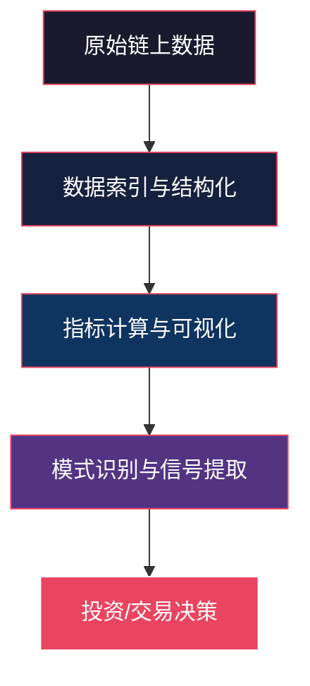
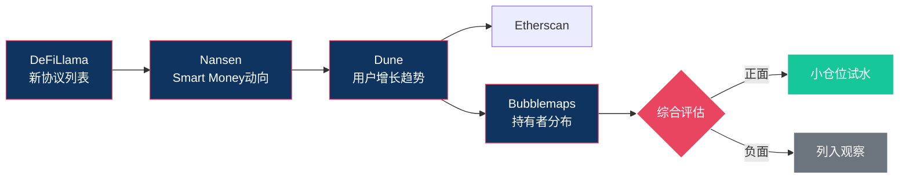
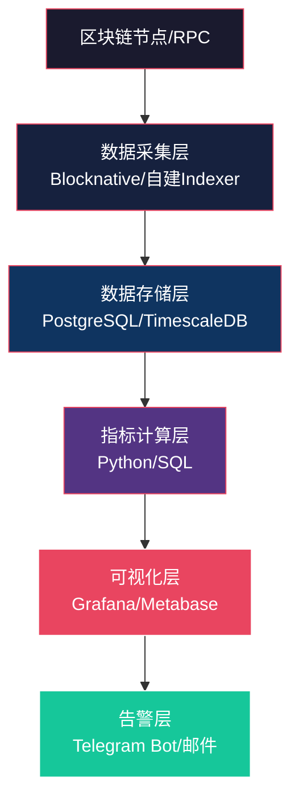

## 六、链上分析工具

区块链的每一条交易记录都公开透明地存储在链上，这意味着任何人都可以直接读取原始数据、追踪资金流向、识别市场趋势。链上分析（On-chain Analysis）就是利用这些公开数据进行研究和决策的方法论。与传统金融依赖季度财报和机构研报不同，链上分析让你能够实时观察市场的"心跳"——每一笔转账、每一次合约交互、每一个地址的行为模式都包含信息。

掌握链上分析工具，是从"凭感觉交易"走向"用数据决策"的关键一步。无论是追踪鲸鱼动向、评估 DeFi 协议安全性、发现早期项目信号，还是验证一个 NFT 项目的真实活跃度，链上分析都是不可替代的核心能力。

### 1. 链上分析的核心概念

#### 1.1 什么是链上数据

链上数据指所有被记录在区块链上的信息，包括但不限于：

- **交易数据**：转账金额、发送方/接收方地址、Gas 费用、时间戳
- **区块数据**：区块大小、矿工/验证者信息、出块时间
- **合约数据**：智能合约代码、存储状态、事件日志（Event Logs）
- **地址数据**：余额变动、交易频率、交互的合约列表
- **代币数据**：ERC-20/ERC-721 转移记录、持有者分布、流通供应量

这些数据构成了链上分析的原材料。与传统金融数据的关键区别在于：链上数据是实时的、无需许可的、不可篡改的，且覆盖了从机构到个人的全部参与者行为。

#### 1.2 链上分析 vs. 技术分析 vs. 基本面分析

| 分析维度 | 技术分析 | 基本面分析 | 链上分析 |
|---------|---------|-----------|---------|
| 数据来源 | K线、成交量、指标 | 项目白皮书、团队、路线图 | 链上交易、地址行为、合约状态 |
| 时间粒度 | 分钟到月 | 季度到年 | 实时到天 |
| 优势 | 短期趋势判断 | 长期价值评估 | 真实行为验证 |
| 局限 | 滞后性、假信号 | 信息不对称 | 学习曲线较高 |
| 适用场景 | 交易时机选择 | 投资标的选择 | 资金流向追踪、异常检测 |

三者并非互相排斥，而是互补关系。成熟的分析者通常结合使用：用基本面筛选标的，用链上数据验证叙事，用技术分析确定进场时机。

#### 1.3 链上分析的价值层次



从原始数据到决策，每一层都有对应的工具和服务。初学者通常从可视化平台（如 Etherscan）入手，进阶者使用数据查询工具（如 Dune），高阶玩家则构建自己的数据管道和分析模型。

### 2. 核心链上指标体系

#### 2.1 网络活跃度指标

**活跃地址数（Active Addresses）**

定义：在特定时间段内发送或接收过交易的独立地址数量。这是衡量网络使用率最直观的指标。

- **日活跃地址（DAA）**：反映当天网络的实际使用热度
- **周活跃地址（WAA）**：平滑日波动，适合中期趋势判断
- **新地址增长率**：新用户涌入的速度，领先于价格变动

实战要点：活跃地址持续增长而价格横盘，往往意味着早期积累阶段；反之，价格创新高但活跃地址下降，则是顶部背离信号。

**交易笔数与交易量**

- **链上交易笔数**：包含转账、合约交互、代币交换等所有操作
- **链上交易量**：以美元或原生代币计价的总转移金额
- **大额交易笔数**：通常定义为单笔超过 10 万美元的转账，反映机构/鲸鱼活动

**Gas 费用分析**

Gas 费用是以太坊等网络中最直接的"需求温度计"：

- **Gas Price 趋势**：持续高 Gas 表示网络拥堵、需求旺盛
- **Gas 使用量分布**：哪些类型的交易消耗最多 Gas（DeFi 交互、NFT 铸造、MEV 等）
- **Base Fee 变化**：EIP-1559 后的 Base Fee 是供需的直接反映

#### 2.2 持仓分布指标

**巨鲸持仓分析**

- **巨鲸地址追踪**：通常关注前 100 或前 1000 个地址的持仓变动
- **交易所净流入/流出**：大量代币转入交易所通常预示抛压；持续流出则表示积累
- **长期持有者 vs 短期持有者**：链上分析将地址按持币时长分类，LTH（持有 >155 天）的行为比 STH 更有参考价值

**供应分布**

- **前 N% 地址持仓占比**：衡量代币集中度，过度集中意味着操纵风险
- **Shrimps / Crabs / Fish / Sharks / Whales**：Glassnode 的 UTXO 分类体系，按持仓量将地址分为不同"物种"
- **HODL Waves**：按持币时长分层的供应分布图，可以直观看到长期持有者的锁仓情况

#### 2.3 DeFi 协议指标

| 指标 | 含义 | 用途 |
|------|------|------|
| TVL（总锁仓量） | 协议中锁定的资产总价值 | 衡量协议规模和用户信任度 |
| 交易量 | DEX 的日/周交易额 | 衡量实际使用需求 |
| 用户数 | 独立交互地址数 | 衡量真实用户基础 |
| 收益率 | APY/APR | 比较不同协议的收益机会 |
| 清算量 | 被清算的抵押品价值 | 反映市场杠杆水平和风险 |
| 借贷利用率 | 借出量/总供应量 | 衡议流动性紧张程度 |

#### 2.4 NFT 专项指标

- **独立持有者数**：比总交易量更能反映项目的社区规模
- **钻石手比例**：持有超过 30 天未出售的比例，反映社区忠诚度
- **地板价深度**：地板价附近挂单的数量，反映即时流动性
- **巨鲸集中度**：前 10% 持有者拥有总供应量的比例
- **真实交易量 vs 洗盘交易量**：通过分析自买自卖交易过滤虚假成交量

### 3. 主流链上分析平台详解

#### 3.1 Etherscan — 区块链浏览器之王

**定位**：最基础、最通用的链上数据查看工具，类似区块链的"搜索引擎"。

**核心功能**：

- **交易查询**：通过 TxHash 查看任意交易的详细信息（发送方、接收方、金额、Gas、调用的合约函数）
- **地址追踪**：查看任意地址的余额、交易历史、持有的代币和 NFT
- **合约验证**：查看已验证合约的源代码，阅读 ABI，直接调用只读函数
- **Token Tracker**：查看 ERC-20 代币的持有者分布、转账记录、总供应量
- **Gas Tracker**：实时 Gas 价格预测，帮助优化交易费用

**进阶使用**：

```bash
# Etherscan API 调用示例：查询地址余额
curl "https://api.etherscan.io/api?module=account&action=balance&address=YOUR_ADDRESS&tag=latest&apikey=YOUR_API_KEY"

# 查询 ERC-20 代币余额
curl "https://api.etherscan.io/api?module=account&action=tokenbalance&contractaddress=TOKEN_CONTRACT&address=YOUR_ADDRESS&tag=latest&apikey=YOUR_API_KEY"

# 查询最近交易
curl "https://api.etherscan.io/api?module=account&action=txlist&address=YOUR_ADDRESS&startblock=0&endblock=99999999&sort=desc&apikey=YOUR_API_KEY"
```

**多链版本**：Etherscan 团队为 BSC（BscScan）、Polygon（PolygonScan）、Arbitrum（Arbiscan）等都提供了几乎相同界面的浏览器。对于 Solana，使用 Solscan 或 Solana Explorer。

**局限**：Etherscan 适合查看单笔交易或单个地址，但不擅长聚合分析和趋势洞察。当你需要回答"过去一周哪些地址在大量买入某代币"这类问题时，需要更高级的工具。

#### 3.2 Dune Analytics — 链上数据的 GitHub

**定位**：社区驱动的链上数据查询和可视化平台，任何人都可以用 SQL 查询区块链数据并构建仪表板。

**核心优势**：

- **完全开放**：所有查询和仪表板公开可访问，免费使用
- **SQL 查询**：使用标准 SQL 语法查询索引后的链上数据
- **多链支持**：以太坊、Arbitrum、Optimism、Polygon、BSC、Solana 等
- **实时更新**：数据通常延迟 1-5 分钟
- **社区协作**：可以 Fork 他人的查询进行修改和扩展

**核心数据表**：

```sql
-- 以太坊交易表
ethereum.transactions  -- 所有交易
ethereum.traces        -- 内部交易（合约调用）
ethereum.logs          -- 事件日志
ethereum.blocks        -- 区块信息

-- ERC-20 代币
erc20_ethereum.evt_Transfer  -- 代币转移事件

-- NFT
nft.transfers            -- NFT 转移记录

-- DEX 交易
dex.trades               -- 去中心化交易所交易汇总
```

**实战示例：查询某代币的每日交易量**

```sql
SELECT
    DATE_TRUNC('day', evt_block_time) AS day,
    COUNT(*) AS transfer_count,
    SUM(CAST(value AS DOUBLE) / 1e18) AS total_volume
FROM erc20_ethereum.evt_Transfer
WHERE contract_address = 0x代币合约地址
    AND evt_block_time >= NOW() - INTERVAL '30' DAY
GROUP BY 1
ORDER BY 1 DESC
```

**实战示例：追踪鲸鱼地址的代币积累**

```sql
SELECT
    t."to" AS receiver,
    SUM(CAST(t.value AS DOUBLE) / 1e18) AS total_received,
    COUNT(*) AS tx_count
FROM erc20_ethereum.evt_Transfer t
WHERE t.contract_address = 0x代币合约地址
    AND t.evt_block_time >= NOW() - INTERVAL '7' DAY
GROUP BY 1
ORDER BY 2 DESC
LIMIT 50
```

**Dune SQL 进阶技巧**：

- 使用 `{{变量名}}` 创建参数化查询，方便复用
- 用 `CONCAT` 和 `SUBSTRING` 处理地址格式
- 利用 `WITH` 子句构建复杂的数据管道
- 使用 `UNION ALL` 合并多链数据

**免费版 vs 付费版**：免费版查询执行速度较慢且有并发限制，Dune Premium（$349/月）提供更快的执行速度、更多并发查询和私有查询功能。对于个人研究者，免费版通常够用。

#### 3.3 Nansen — 聪明钱追踪平台

**定位**：面向专业投资者的链上分析平台，以"Smart Money"标签系统闻名。

**核心功能**：

- **Smart Money 追踪**：Nansen 将经过验证的基金、机构钱包、知名交易者标记为 "Smart Money"，追踪他们的链上行为
- **Token God Mode**：单个代币的全方位分析，包括持有者变化、Smart Money 动向、交易所流入流出
- **Wallet Profiler**：分析任意地址的盈亏、交易风格、持仓历史
- **Hot Contracts**：近期交互量激增的合约，帮助发现热门项目
- **NFT Paradise**：NFT 专项分析，包括铸造趋势、蓝筹指数、持有者分析

**Smart Money 标签体系**：

| 标签 | 含义 | 数据来源 |
|------|------|---------|
| Smart Money | 综合表现优异的钱包 | 历史收益率、链上声誉 |
| Fund | 已知的加密基金 | 公开披露、链上验证 |
| Institutional | 机构钱包 | OTC 交易、公开地址 |
| DEX Trader | 高频 DEX 交易者 | 交易频率、成功率 |
| NFT Smart Money | NFT 领域的聪明钱 | NFT 投资回报率 |
| First Mover | 早期参与者 | 首次交易时间 |

**使用场景**：

- **发现早期项目**：当多个 Smart Money 地址同时开始积累某个新代币时，这是一个强烈的信号
- **判断趋势转折**：Smart Money 持续净流出某代币，可能预示价格下行
- **评估 NFT 项目**：查看蓝筹 NFT 的 Smart Money 持有比例变化

**定价**：Nansen 是付费工具，基础版约 $150/月，高级版 $1500/月。对于个人投资者，可以在早期订阅一个月集中研究，将有价值的标签地址导出后用免费工具继续追踪。

#### 3.4 Glassnode — 比特币链上指标的黄金标准

**定位**：专注于比特币和主流加密资产的机构级链上分析平台。

**核心指标**（Glassnode 首创或标准化）：

- **SOPR（Spent Output Profit Ratio）**：花费输出的盈亏比率。SOPR > 1 表示整体处于盈利状态，< 1 表示亏损。当 SOPR 从低于 1 回升到 1 时，往往是买入信号
- **MVRV Ratio**：市值 / 已实现市值。已实现市值按每个 UTXO 最后一次移动时的价格计算，MVRV > 3.5 通常标志顶部，< 1 标志底部
- **NUPL（Net Unrealized Profit/Loss）**：网络未实现盈亏，划分为 Euphoria、Belief、Optimism、Hope、Capitulation 等阶段
- **Reserve Risk**：衡量长期持有者信心与价格的比值，低值表示高信心低价格，是买入时机
- **Long-Term Holder Supply**：持有超过 155 天的供应量，LTH 供应在熊市末期达到峰值

**MVRV 实战解读**：

```text
MVRV > 3.5  → 市场极度高估，考虑减仓
MVRV 2.0-3.5 → 偏高但仍在合理范围
MVRV 1.0-2.0 → 中性区域
MVRV < 1.0   → 市场整体亏损，历史上是极佳买入区间
MVRV < 0.8   → 极端低估，历史底部区域
```

**免费 vs 付费**：Glassnode 提供大量免费指标（延迟24小时），Studio 版（$29/月起）解锁实时数据和高级指标，Advanced 版（$799/月）面向机构。

#### 3.5 Arkham Intelligence — 地址标签化先驱

**定位**：专注于地址身份标签和实体追踪的链上分析平台。

**核心创新**：

- **实体标签系统**：将链上地址聚合为"实体"（如"Binance"、"Jump Trading"），一个实体可能对应数千个地址
- **可视化交易图谱**：以图形方式展示资金在实体间的流向，直观发现资金链条
- **情报赏金（Intel Bounties）**：社区可以发布赏金任务，悬赏特定地址的身份信息
- **警报系统**：设置特定地址或实体的交易警报

**适用场景**：

- 追踪黑客攻击后的资金流向（如跨链桥被盗资产追踪）
- 识别做市商和机构的持仓变动
- 发现某地址背后的实体身份

#### 3.6 DeFiLlama — DeFi 数据聚合之王

**定位**：最全面的 DeFi 协议数据聚合平台，完全免费开源。

**核心数据**：

- **TVL 排名**：按链、按类别、按协议查看 TVL 排名和变化趋势
- **收益率对比**：聚合各协议的借贷、质押、LP 收益率
- **稳定币仪表板**：各稳定币的供应量、流通链分布、脱锚风险
- **空投追踪**：尚未发币的协议列表，帮助寻找潜在空投机会
- **桥数据**：跨链桥的 TVL 和交易量

**API 使用**：

```bash
# 获取所有协议的 TVL
curl "https://api.llama.fi/protocols"

# 获取某协议的 TVL 历史
curl "https://api.llama.fi/protocol/协议名"

# 获取所有链的 TVL
curl "https://api.llama.fi/v2/chains"

# 获取收益率数据
curl "https://yields.llama.fi/pools"
```

#### 3.7 其他重要工具

**Bloxy / Etherscan Token Tracker**：代币流动性分析，查看代币的交易对分布和流动性深度。

**Bubblemaps**：以气泡图方式可视化代币持有者分布，快速识别关联地址群和可能的 Sybil 攻击。

**L2Beat**：Layer 2 专属分析平台，对比各 L2 的 TVL、风险模型、成熟度等级。

**Token Terminal**：将链上协议当作"公司"进行财务分析，追踪收入、费用、P/S 比率等传统金融指标。

**DefiSafety**：对 DeFi 协议进行安全评分，评估代码审计、文档质量、运营透明度。

### 4. 实操：链上分析工作流

#### 4.1 发现早期项目信号



**具体步骤**：

1. 在 DeFiLlama 上筛选近 7 天 TVL 增速最快的新协议
2. 在 Nansen 上检查这些协议是否已被 Smart Money 地址交互
3. 在 Dune 上查找或编写该协议的分析仪表板，观察用户增长和交易量趋势
4. 在 Bubblemaps 上查看代币持有者分布，排除高度集中的项目
5. 在 Etherscan 上检查合约是否已验证、是否有审计报告

#### 4.2 追踪鲸鱼动向

**方法一：使用 Nansen（付费）**

在 Nansen 的 Token God Mode 中查看 Smart Money 标签地址的买卖行为。Nansen 已经做好了地址分类工作，直接查看 "Smart Money" tab 即可。

**方法二：使用 Etherscan + Dune（免费）**

1. 在 Etherscan 上找到代币的持有者列表，识别持仓前 50 的地址
2. 排除已知的交易所地址和合约地址
3. 在 Dune 上编写查询，监控这些地址的转入转出行为
4. 设置 Etherscan 的 Watch List 或 Token Alert 功能接收通知

**方法三：使用 Arkham（部分免费）**

1. 在 Arkham 上搜索目标代币或实体
2. 查看交易图谱，识别大额转账的流向
3. 利用实体标签过滤交易所、做市商等噪音

#### 4.3 评估 DeFi 协议安全性

**检查清单**：

```text
□ 合约代码是否开源验证？ → Etherscan Contract tab
□ 是否经过知名审计机构审计？ → 项目官网 + Etherscan
□ 管理员权限是否受限？ → 检查 owner/admin 函数
□ 是否存在无限授权？ → Revoke.cash 检查
□ TVL 中真实用户占比多少？ → Dune 查询独立地址数
□ 是否有时间锁（Timelock）？ → 治理合约检查
□ 清算机制是否正常运作？ → DeFiLlama 清算数据
□ 是否有 Bug Bounty 计划？ → Immunefi 平台
```

#### 4.4 NFT 项目真伪鉴别

**洗盘交易识别方法**：

洗盘交易（Wash Trading）是 NFT 市场最常见的操纵手段。识别方法：

1. **地址关联性检查**：在 Etherscan 上查看买卖双方地址，如果它们曾经从同一个地址接收过资金，大概率是关联地址
2. **交易频率异常**：同一 NFT 在短时间内反复交易，且价格逐步抬升
3. **Bubblemaps 验证**：将交易双方地址输入 Bubblemaps，查看是否属于同一个"气泡群"
4. **Nansen 过滤**：使用 Nansen 的 NFT 看板，它会自动标记疑似洗盘交易的交易量

### 5. 链上分析编程实战

#### 5.1 使用 Web3.py 进行基础分析

```python
from web3 import Web3
from collections import Counter

# 连接到以太坊节点（可使用 Infura/Alchemy 免费节点）
w3 = Web3(Web3.HTTPProvider('https://mainnet.infura.io/v3/YOUR_PROJECT_ID'))

def analyze_address_activity(address, num_blocks=1000):
    """分析指定地址在最近N个区块中的活动"""
    latest = w3.eth.block_number
    start_block = latest - num_blocks
    
    tx_count = 0
    unique_interactions = set()
    
    for block_num in range(start_block, latest + 1):
        block = w3.eth.get_block(block_num, full_transactions=True)
        for tx in block.transactions:
            if tx['from'].lower() == address.lower():
                tx_count += 1
                if tx['to']:
                    unique_interactions.add(tx['to'].lower())
    
    return {
        'total_transactions': tx_count,
        'unique_contracts': len(unique_interactions),
        'blocks_scanned': num_blocks,
        'avg_tx_per_block': tx_count / num_blocks
    }

# 使用示例
result = analyze_address_activity('0x你的目标地址')
print(f"交易笔数: {result['total_transactions']}")
print(f"交互合约数: {result['unique_contracts']}")
```

#### 5.2 使用 The Graph 查询索引数据

The Graph 是链上数据的去中心化索引协议，通过 GraphQL 查询已索引的数据，比直接查询节点快几个数量级。

```python
import requests

UNISWAP_V3_SUBGRAPH = "https://api.thegraph.com/subgraphs/name/uniswap/uniswap-v3"

def get_top_pools(limit=10):
    """查询 Uniswap V3 上 TVL 最高的交易对"""
    query = """
    {
      pools(first: %d, orderBy: totalValueLockedUSD, orderDirection: desc) {
        token0 { symbol }
        token1 { symbol }
        totalValueLockedUSD
        volumeUSD
        feeTier
      }
    }
    """ % limit
    
    response = requests.post(UNISWAP_V3_SUBGRAPH, json={'query': query})
    data = response.json()
    
    for pool in data['data']['pools']:
        pair = f"{pool['token0']['symbol']}/{pool['token1']['symbol']}"
        tvl = float(pool['totalValueLockedUSD'])
        vol = float(pool['volumeUSD'])
        fee = pool['feeTier'] / 10000
        print(f"{pair:20s} | TVL: ${tvl:>15,.0f} | Vol: ${vol:>15,.0f} | Fee: {fee}%")

get_top_pools()
```

#### 5.3 使用 Etherscan API 构建监控脚本

```python
import requests
import time
from datetime import datetime

ETHERSCAN_API_KEY = "YOUR_API_KEY"
BASE_URL = "https://api.etherscan.io/api"

def get_token_transfers(contract_address, start_block=0):
    """获取 ERC-20 代币的最新转移记录"""
    params = {
        'module': 'account',
        'action': 'tokentx',
        'contractaddress': contract_address,
        'startblock': start_block,
        'endblock': 99999999,
        'sort': 'desc',
        'apikey': ETHERSCAN_API_KEY
    }
    resp = requests.get(BASE_URL, params=params).json()
    return resp.get('result', [])

def detect_whale_movements(contract_address, threshold=100000):
    """检测大额代币转移（以美元计超过阈值）"""
    transfers = get_token_transfers(contract_address)
    whale_txs = []
    
    for tx in transfers[:100]:  # 检查最近100笔
        value = int(tx['value']) / (10 ** int(tx['tokenDecimal']))
        if value >= threshold:
            whale_txs.append({
                'from': tx['from'],
                'to': tx['to'],
                'value': value,
                'time': datetime.fromtimestamp(int(tx['timeStamp'])),
                'hash': tx['hash']
            })
    
    return whale_txs
```

### 6. 常见误区与纠正

#### 误区一：地址数量等于用户数量

**错误认知**：看到某代币有 10 万个持有地址，就认为有 10 万用户。

**事实**：一个人可以控制无数个地址。很多项目方会用空投或 Sybil 攻击制造虚假的地址分布。判断真实用户数需要分析地址间的资金关联、交易模式等，工具如 Bubblemaps 可以辅助识别。

**正确做法**：结合独立地址数、活跃交易地址数、地址间关联分析三个维度综合判断。

#### 误区二：TVL 高就代表协议安全

**错误认知**：某协议 TVL 达到数十亿美元，说明它很安全。

**事实**：TVL 衡量的是资金规模，不是安全性。Terra/Luna 崩溃前 TVL 一度超过 300 亿美元。高 TVL 可能是因为代币价格虚高（循环抵押）或激励机制制造的临时流动性。

**正确做法**：TVL 需要结合审计报告、代码开源程度、管理员权限、运行时间、历史安全事件等多维度评估。

#### 误区三：交易所净流出一定看涨

**错误认知**：大量代币从交易所流出 = 用户在囤积 = 看涨信号。

**事实**：流出可能是转移到另一个交易所的热钱包、项目方的锁仓合约释放前的地址整理、或者跨链桥操作。单纯看交易所流出方向不足以得出结论。

**正确做法**：追踪流出资金的最终去向——是转入已知的冷钱包地址（真实囤积）还是转入其他合约（可能是 DeFi 操作或另一个交易所）。

#### 误区四：只看单一链的数据

**错误认知**：只分析以太坊链上的数据就能得出完整结论。

**事实**：当代币部署在多条链上时（如 USDC 同时在以太坊、Solana、Arbitrum、Polygon 等链上流通），只看单一链的数据会遗漏大量信息。跨链桥活动也意味着资金可能在链间快速流动。

**正确做法**：使用 DeFiLlama、Dune 等支持多链的平台，至少覆盖目标代币所在的主要链。

#### 误区五：忽视时间延迟和数据完整性

**错误认知**：链上数据是实时的，看到的就代表当下。

**事实**：免费工具通常有数据延迟（从几分钟到24小时不等），且不同节点的同步状态可能不同。某些 L2 的数据提交到 L1 也有延迟。此外，内部交易（通过合约调用产生的转账）可能不在基础交易记录中显示。

**正确做法**：对于时效性要求高的操作（如套利、清算监控），使用付费的实时数据源或自建节点；对于长期分析，注意标注数据的截止时间。

### 7. 进阶：构建自己的链上分析系统

#### 7.1 数据管道架构

对于有编程基础的进阶用户，可以构建自己的链上分析系统：



#### 7.2 关键技术选型

| 组件 | 推荐方案 | 成本 | 适用场景 |
|------|---------|------|---------|
| RPC 节点 | Alchemy/Infura 免费版 | $0 | 个人研究，低频查询 |
| RPC 节点 | QuickNode/Chainstack | $49-299/月 | 高频查询，多链需求 |
| 数据索引 | The Graph（托管服务） | $0-100/月 | 已有子图的协议 |
| 数据索引 | 自建 Goldsky/Subgraph | $50+/月 | 自定义索引逻辑 |
| 存储 | PostgreSQL | $0（自建） | 结构化分析数据 |
| 可视化 | Grafana | $0（自建） | 实时监控仪表板 |
| 告警 | Telegram Bot API | $0 | 价格/地址异常通知 |

#### 7.3 MEV 和套利分析

高阶链上分析还涉及 MEV（最大可提取价值）领域的研究：

- **Flashbots Protect**：了解如何保护自己的交易不被 MEV 机器人夹击
- **EigenPhi**：MEV 交易的可视化分析平台，可以查看套利者和清算者的盈利情况
- **MEV-Explore**：以太坊上 MEV 活动的公开数据仪表板

#### 7.4 AI 辅助链上分析

近年来，AI 与链上分析的结合正在加速：

- **Arkham 的 AI 实体识别**：使用机器学习自动将地址聚合为实体
- **Nansen 的异常检测**：AI 驱动的异常交易模式识别
- **自建 LLM 分析器**：将链上指标输入 LLM，自动生成市场分析报告

```python
# 概念示例：使用 LLM 分析链上数据趋势
def generate_analysis(metrics: dict) -> str:
    prompt = f"""
    以下是当前以太坊链上指标：
    - 日活跃地址: {metrics['active_addresses']}
    - 交易所净流入: {metrics['exchange_netflow']} ETH
    - Gas 均价: {metrics['gas_price']} Gwei
    - MVRV 比率: {metrics['mvrv_ratio']}
    - 稳定币供应变化: {metrics['stablecoin_supply_change']}
    
    请从链上分析角度给出市场评估和操作建议。
    """
    # 调用 LLM API 获取分析结果
    # response = llm_api.generate(prompt)
    # return response
```

### 8. 学习资源与工具汇总

| 资源 | 类型 | 地址 | 说明 |
|------|------|------|------|
| Glassnode Academy | 课程 | glassnode.com/academy | 链上指标的权威教材 |
| Dune Analytics | 平台 | dune.com | 社区 SQL 查询和仪表板 |
| CryptoQuant | 平台 | cryptoquant.com | 交易所数据和链上指标 |
| LookIntoBitcoin | 工具 | lookintobitcoin.com | 比特币链上指标可视化 |
| Nansen | 平台 | nansen.ai | Smart Money 追踪 |
| Arkham | 平台 | arkham.intelligence | 地址实体标签 |
| DeFiLlama | 平台 | defillama.com | DeFi 数据聚合 |
| The Graph | 协议 | thegraph.com | 链上数据索引协议 |
| Revoke.cash | 安全工具 | revoke.cash | 检查和撤销代币授权 |
| Bubblemaps | 可视化 | bubblemaps.io | 持有者分布气泡图 |

链上分析是一项需要持续练习的技能。建议从 Dune 上浏览热门仪表板开始，理解每个指标背后的含义，然后逐步尝试编写自己的查询。当你可以独立通过链上数据判断一个项目的真实活跃度和资金流向时，你就拥有了大多数市场参与者不具备的信息优势。
