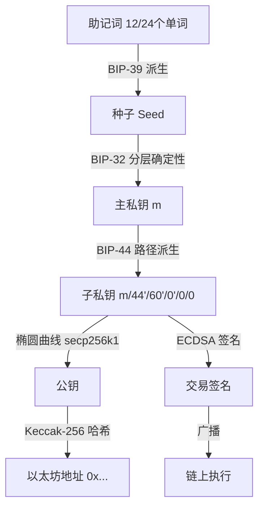
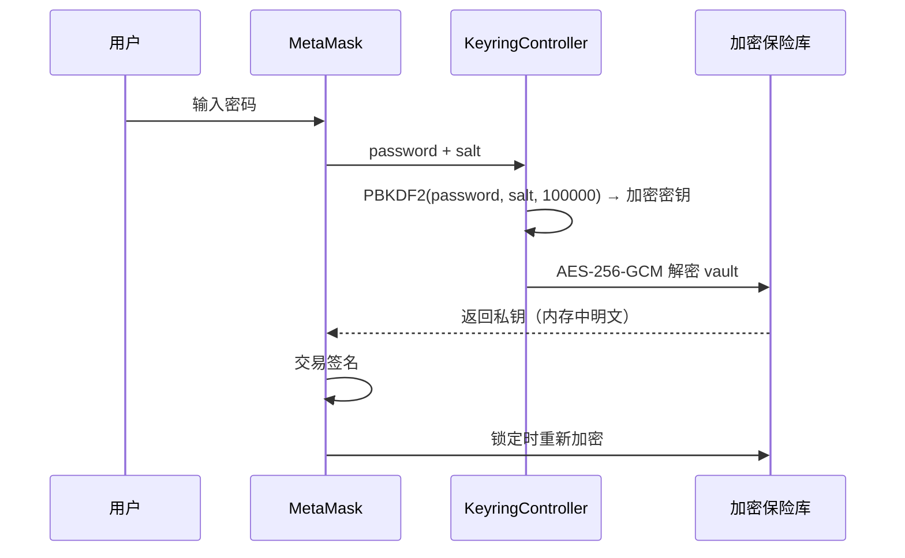
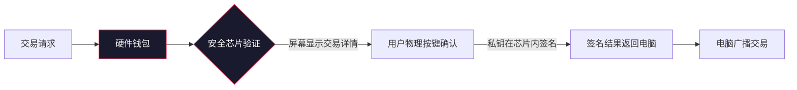
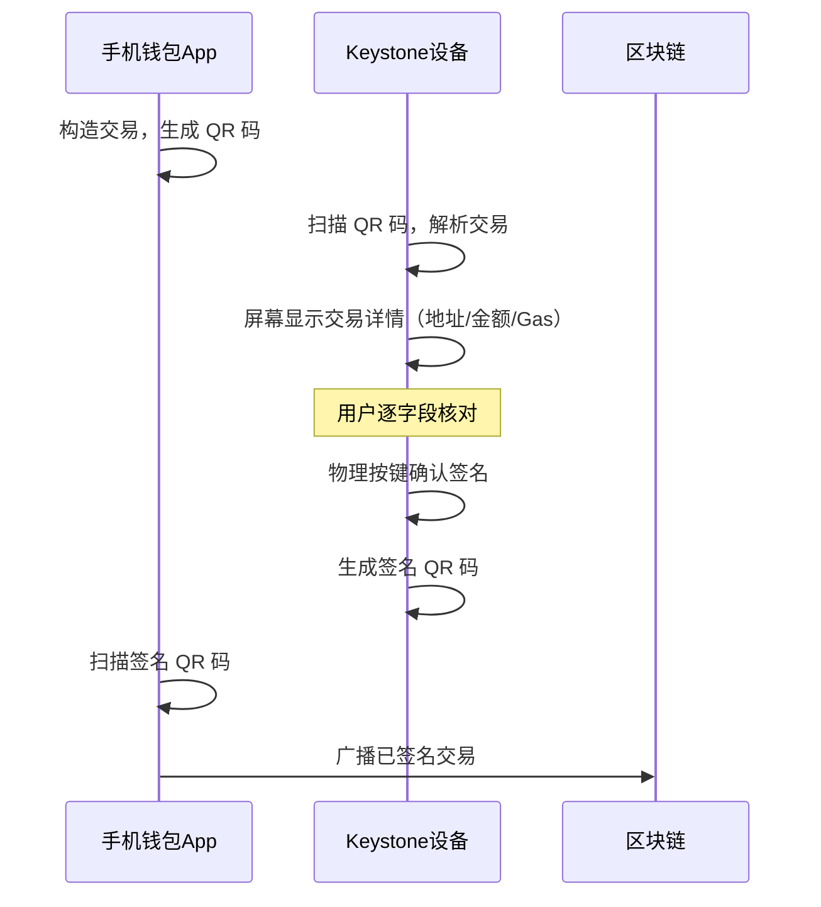
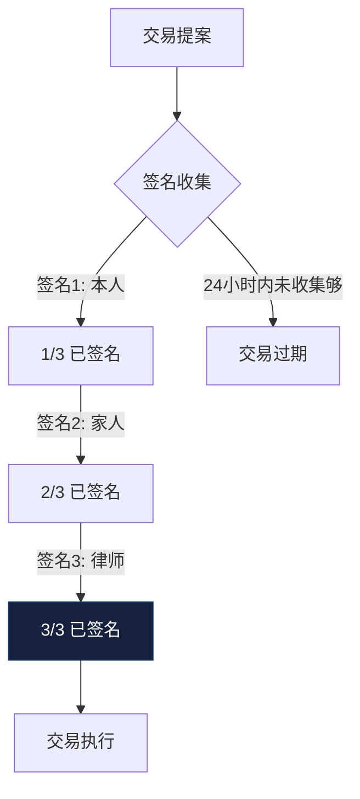

## 七、钱包安全实操

Web3 世界中，钱包不仅是资产的保险柜，更是你所有链上身份的根密钥。私钥一旦泄露或丢失，资产将不可逆地消失——没有任何客服电话、没有银行冻结、没有警察追回。据 SlowMist 统计，2024 年全年因钱包安全问题导致的损失超过 18 亿美元，其中超过 70% 的事故源于用户自身的操作失误，而非底层协议漏洞。

本章从钱包原理出发，系统讲解私钥管理、硬件钱包配置、常见攻击防御、交易签名审查、多签方案、应急响应全流程，帮助你建立一套可落地的资产防护体系。

### 1. 钱包安全的底层原理

#### 1.1 钱包的本质：私钥管理器

很多人把钱包想象成一个"存放加密货币的容器"，这是一个根本性的误解。区块链上的资产从未离开过链——它们始终由链上合约或 UTXO 记录。所谓"钱包"，本质上是一个**私钥管理器 + 交易签名器**。

整个信任链条如下：



**关键认知**：谁持有私钥（或助记词），谁就拥有该地址下所有资产的完全控制权。这就是为什么"不是你的私钥，不是你的币"（Not your keys, not your coins）是 Web3 的第一信条。

#### 1.2 助记词的数学本质

BIP-39 标准定义了助记词的生成过程：

| 步骤 | 操作 | 说明 |
|------|------|------|
| 1 | 生成 128-256 位随机熵 | 由密码学安全的 CSPRNG 产生 |
| 2 | 计算 SHA-256 校验和 | 取熵的 SHA-256 哈希的前 4-8 位 |
| 3 | 拼接熵 + 校验和 | 132-264 位二进制串 |
| 4 | 每 11 位映射一个单词 | 12-24 个助记词 |
| 5 | PBKDF2-HMAC-SHA512 派生种子 | 2048 轮迭代，可选密码短语 |

12 个助记词对应 128 位熵，安全性约为 2^128 ≈ 3.4×10^38，远超暴力破解能力。24 个助记词对应 256 位熵，安全性更是天文数字级别。**助记词的安全性不取决于隐藏，而取决于随机性本身。**

#### 1.3 为什么不能截图/拍照助记词

手机拍照会经过以下处理链：

1. 相机传感器采集图像 → 2. ISP 芯片处理 → 3. 存储为 JPEG/HEIC → 4. 同步到 iCloud/Google Photos → 5. 系统 OCR 索引 → 6. 第三方 App 可申请相册权限

每一步都是潜在的泄露点。2023 年 iCloud 照片泄露事件中，大量用户的助记词截图被黑客通过 Apple ID 钓鱼获取。**绝对不要以任何电子形式存储助记词**，这是铁律。

### 2. 钱包类型与安全等级

#### 2.1 四类钱包的安全特性对比

| 钱包类型 | 代表产品 | 私钥存储位置 | 安全等级 | 适用场景 |
|----------|----------|-------------|----------|----------|
| 热钱包（浏览器扩展） | MetaMask、Rabby | 浏览器本地存储（加密） | ★★☆☆☆ | 日常交互、小额交易 |
| 热钱包（移动端） | Trust Wallet、Rainbow | 手机安全区域（Keychain/Keystore） | ★★★☆☆ | 移动支付、NFT 浏览 |
| 冷钱包（硬件） | Ledger、Trezor、Keystone | 专用安全芯片（SE/ATECC608A） | ★★★★☆ | 大额存储、长期持有 |
| 冷钱包（气隙） | 纸钱包、离线电脑 | 完全离线介质 | ★★★★★ | 极端安全需求、遗产传承 |

#### 2.2 热钱包安全机制详解

MetaMask 的私钥保护流程：



MetaMask 使用 PBKDF2 进行密钥派生（10 万次迭代），然后用 AES-256-GCM 加密私钥存储在浏览器的 `chrome.storage.local` 中。但这并不意味着它是安全的——浏览器环境天然暴露在以下风险中：

- **恶意扩展**：拥有 `webRequest` 权限的扩展可以拦截所有网络请求
- **剪贴板劫持**：恶意软件可以在你复制地址时替换为攻击者的地址
- **浏览器漏洞**：零日漏洞可绕过沙箱直接读取本地存储
- **钓鱼网站**：伪造 DApp 页面诱导你签署恶意交易

**原则**：热钱包只存放你愿意承受损失的金额，就像你不会把全部积蓄放在身上逛街一样。

#### 2.3 硬件钱包安全机制详解

硬件钱包的核心安全设计：



**关键区别**：私钥**永远不离开安全芯片**。电脑只发送未签名的交易数据，硬件钱包只返回签名结果。即使电脑被完全入侵，攻击者也无法提取私钥——只能伪造交易请求，但硬件钱包的屏幕会显示真实交易详情，用户可以物理验证后拒绝。

### 3. 私钥与助记词的安全管理

#### 3.1 助记词存储的五个等级

| 等级 | 方式 | 防火 | 防盗 | 防丢失 | 成本 | 推荐度 |
|------|------|------|------|--------|------|--------|
| Lv.1 | 纸张手写 | ✗ | ✗ | ✗ | 免费 | 入门可用 |
| Lv.2 | 金属助记词板（钛合金/不锈钢） | ✓ | ✗ | ✗ | ¥50-300 | **推荐** |
| Lv.3 | 金属板 + 分散存放（银行保险柜/亲友处） | ✓ | ✓ | ✓ | ¥500+ | **强烈推荐** |
| Lv.4 | Shamir 秘密分享（SSS）拆分存储 | ✓ | ✓ | ✓ | ¥1000+ | 大额资产必备 |
| Lv.5 | 多签方案（无私钥单点） | ✓ | ✓ | ✓ | 依方案而定 | 机构级安全 |

#### 3.2 金属助记词板的选择与使用

金属助记词板是个人用户的最佳性价比选择。选购要点：

**材质对比**：

| 材质 | 耐火温度 | 耐腐蚀 | 价格区间 | 重量 |
|------|----------|--------|----------|------|
| 304 不锈钢 | 1400°C | 优秀 | ¥50-150 | 较重 |
| 钛合金（Ti-6Al-4V） | 1668°C | 极优 | ¥200-500 | 轻便 |
| 铜合金 | 1085°C | 良好 | ¥100-300 | 中等 |
| 铝合金 | 660°C | 一般 | ¥30-80 | 最轻 |

**推荐选择**：钛合金板。304 不锈钢在极端火灾（建筑火灾温度通常在 800-1100°C）下也能存活，但钛合金提供了更高的安全裕度。

**刻录方法**：

1. 使用冲头（center punch）逐字敲击助记词编号，不要用电刻笔（会产生热量）
2. 每个单词之间留足间距，避免混淆
3. 刻录完成后用铅笔芯粉涂抹，让刻痕更清晰可辨
4. 拍照验证（仅验证后立即删除照片，清空回收站）

#### 3.3 Shamir 秘密分享（SSS）方案

Shamir 秘密分享是一种将秘密拆分为 N 份、只需其中任意 K 份即可恢复的密码学方案。这是目前个人用户能使用的最高等级助记词保护方案。

**实际操作（以 Trezor Model T 为例）**：

假设你选择 3-of-5 方案——生成 5 份碎片，任意 3 份可恢复：

| 碎片编号 | 存放位置 | 持有人 |
|----------|----------|--------|
| Share 1 | 自己的保险柜 | 本人 |
| Share 2 | 银行保险箱 | 本人 |
| Share 3 | 信任的家人处 | 父亲 |
| Share 4 | 另一城市的信任朋友 | 闺蜜 |
| Share 5 | 律师保险柜（遗嘱相关） | 律师 |

这样即使损失其中 2 份（比如家中被盗 + 银行保险箱到期未续），依然可以恢复助记词。同时，任何单一持有者都无法独自访问你的资产。

**注意事项**：

- SSS 需要在支持它的硬件钱包上操作（Trezor Model T/One 支持，Ledger 不原生支持）
- 每份碎片用独立的金属板刻录
- 定期检查各碎片的完好状态（每年一次）
- 建立检查机制——如果某个持有人失联，及时补充新碎片

#### 3.4 助记词安全检查清单

在完成助记词存储后，逐项确认：

- [ ] 助记词从未以电子形式存在（无截图、无拍照、无云笔记、无邮件）
- [ ] 助记词从未通过网络传输（无微信发送、无邮件附件、无剪贴板复制后同步）
- [ ] 存储介质防火防潮（金属板优于纸张）
- [ ] 至少有两份副本存放在不同物理位置
- [ ] 没有将助记词告诉任何人（包括所谓的"客服"或"技术支持"）
- [ ] 恢复测试已完成——用助记词在新设备上成功恢复了钱包
- [ ] 助记词对应的地址已验证正确

### 4. 硬件钱包配置实操

#### 4.1 主流硬件钱包对比

| 特性 | Ledger Nano X | Trezor Model T | Keystone 3 Pro | OneKey Classic 1S |
|------|---------------|----------------|----------------|-------------------|
| 安全芯片 | ST33J2M0（CC EAL5+） | 无（通用 MCU） | ATECC608A（CC EAL6+） | ATECC608A |
| 屏幕 | 128×64 OLED | 1.54" 彩色触摸屏 | 4.0" 彩色触摸屏 | 1.28" OLED |
| 连接方式 | USB-C / 蓝牙 | USB-C | QR 码（气隙） | USB-C / 蓝牙 |
| 开源 | 固件部分开源 | 完全开源 | 完全开源 | 完全开源 |
| 支持链 | 5500+ | 1800+ | 5500+ | 1200+ |
| 价格 | ¥800-1200 | ¥1200-1800 | ¥700-1000 | ¥400-700 |
| SSS 支持 | ✗ | ✓ | ✗ | ✗ |
| 适合人群 | 多链用户 | 安全研究者/极客 | 气隙安全追求者 | 预算有限的入门用户 |

#### 4.2 Ledger Nano 初始化流程（以太坊）

**第一步：开箱验证**

收到硬件钱包后，必须验证包装完整性：

1. 检查包装盒是否有拆封痕迹（Ledger 使用一次性防拆贴纸）
2. 首次开机时，设备不应已有预设的 PIN 码或助记词
3. 通过 Ledger Live 官网下载管理软件，验证设备固件签名
4. 如果设备已有预设助记词（写在包装内的卡片上），**立刻停止使用**——这是常见的供应链攻击

**第二步：创建钱包与设置 PIN 码**

```text
设备操作流程：
1. 开机 → 选择 "Set up as new device"
2. 设置 4-8 位 PIN 码
   - 避免使用生日、1234、0000 等常见组合
   - PIN 码用于防止物理接触后的未授权访问
   - 连续 3 次错误 PIN 将触发设备重置（安全特性）
3. 设备生成 24 个助记词
4. 逐词抄写到金属助记词板上
5. 设备要求按顺序验证部分助记词
```

**第三步：在 Ledger Live 中添加以太坊账户**

```text
1. 打开 Ledger Live → "Manager"
2. 连接设备，安装 "Ethereum" 应用
3. 进入 "Accounts" → "Add account" → 选择 Ethereum
4. 确认设备上显示的地址与软件一致
5. 发送一笔小额测试交易（0.001 ETH）验证收发功能
```

**第四步：安全加固设置**

```text
1. 启用 Ledger Live 的密码锁定（Settings → General → Password lock）
2. 关闭 Ledger Live 的匿名数据收集
3. 在设备设置中启用 "Passphrase" 功能（第 25 个助记词）
   - 这相当于一个隐藏钱包的入口密码
   - 即使助记词泄露，没有 passphrase 也无法访问隐藏钱包
   - 建议将 passphrase 存放在与助记词不同的安全位置
```

#### 4.3 Keystone 气隙钱包初始化

Keystone 的最大优势是**气隙（Air-gapped）设计**——设备通过 QR 码与电脑/手机通信，完全没有 USB/蓝牙/WiFi 连接，物理隔绝了网络攻击。

```text
初始化流程：
1. 长按电源键开机
2. 选择 "Create New Wallet"
3. 选择助记词长度（12 或 24 词）
4. 设备屏幕上逐词显示助记词，抄录到金属板
5. 验证助记词
6. 设置设备密码和指纹（可选）
7. 在设备上生成接收地址的 QR 码
8. 用手机钱包 App 扫描 QR 码导入 watch-only 地址
```

**交易签名流程**：



### 5. 常见攻击手段与防御

#### 5.1 钓鱼攻击（Phishing）

钓鱼是 Web3 安全事故中占比最高的攻击类型，约占总损失的 40% 以上。

**攻击方式一览**：

| 攻击方式 | 具体手法 | 危害等级 |
|----------|----------|----------|
| 假网站 | 仿造 OpenSea/Uniswap 等 DApp，域名使用同形异义字（如 opensea.io → 0pensea.io） | ★★★★★ |
| 假客服 | 在 Discord/Telegram 私信，以"解决问题"为由要求导入助记词 | ★★★★★ |
| 假空投 | 发送带授权的 NFT，点击后触发恶意合约 | ★★★★☆ |
| 假升级 | "您的钱包需要升级，请输入助记词" | ★★★★☆ |
| 搜索引擎广告 | Google 搜索 "Uniswap"，第一个结果是竞价广告指向钓鱼站 | ★★★★☆ |
| 钓鱼邮件 | 伪装成交易所/项目方的安全通知邮件 | ★★★☆☆ |
| 社交媒体评论 | 在 Twitter/YouTube 评论区发布带钓鱼链接的回复 | ★★★☆☆ |

**防御措施**：

1. **永远手动输入域名**，不从搜索引擎结果点击。将常用 DApp 的 URL 保存为书签
2. **验证 SSL 证书**：钓鱼站通常使用 Let's Encrypt 免费证书，但合法站点也会使用，所以证书不是唯一判断标准
3. **使用浏览器扩展 Revoke.cash**：它会标记可疑合约交互
4. **绝不输入助记词到任何网站或对话中**：任何需要你输入助记词的场景都是骗局
5. **使用 Rabby 钱包代替 MetaMask**：Rabby 内置了交易模拟和风险提示功能

#### 5.2 恶意合约授权（Approval Scam）

这是 Web3 独有的攻击方式，利用 ERC-20 的 `approve` 和 ERC-721 的 `setApprovalForAll` 机制。

**攻击原理**：

```solidity
// 正常的 ERC-20 授权机制
interface IERC20 {
    // 允许 spender 代为使用你的代币
    function approve(address spender, uint256 amount) external returns (bool);
    // 查询授权额度
    function allowance(address owner, address spender) external view returns (uint256);
}

// 危险操作：授权无限额度
token.approve(maliciousContract, type(uint256).max);
// 此后恶意合约可以随时转走你的全部代币
```

**真实案例**：2022 年 4 月，Bored Ape Yacht Club 的 Discord 被入侵，攻击者发布了一个"空投"链接，用户点击后签署了 `setApprovalForAll` 交易，授权攻击者的合约可以转移用户钱包中所有 NFT。损失超过 300 万美元。

**防御措施**：

```text
1. 每次签署授权交易前，仔细检查授权对象和授权金额
2. 使用 "approve(0)" 先撤销旧授权，再授权新金额
3. 授权完成后定期检查并撤销不必要的授权：
   - Revoke.cash（https://revoke.cash）
   - Etherscan Token Approvals（https://etherscan.io/tokenapprovalchecker）
4. 对于 NFT，警惕 "setApprovalForAll" —— 它授权了该系列的所有 NFT
5. 使用 Rabby 钱包，它会在签名前显示交易模拟结果
```

#### 5.3 签名钓鱼（Permit / Permit2 / Seaport）

2023 年以后，签名钓鱼成为主流攻击方式。与传统 `approve` 不同，签名攻击不需要链上交易（零 Gas 费），且可以在离线状态下完成。

**常见恶意签名类型**：

| 签名类型 | 协议 | 危害 | 特征 |
|----------|------|------|------|
| ERC-20 Permit | EIP-2612 | 授权代币花费权限 | 包含 spender 和 value 字段 |
| Permit2 | Uniswap | 跨代币的统一授权 | 包含 permitted 数组 |
| Seaport Listing | OpenSea | 以极低价格挂单 NFT | 包含 consideration 中的价格 |
| ETH Sign | 通用 | 签署任意消息 | 最危险，内容完全不可读 |

**MetaMask 签名请求的类型与风险**：

```text
风险等级从低到高：
1. eth_signTypedData_v4（结构化数据签名）→ 可读性最好，但仍需仔细检查
2. eth_signTypedData（旧版结构化签名）→ 较好
3. personal_sign（个人消息签名）→ 内容可能是任意文本
4. eth_sign（裸哈希签名）→ 最危险，MetaMask 已默认禁用

安全原则：
- 看不懂的签名请求，一律拒绝
- 签名中包含 "Permit" "approve" "transfer" 等关键词的，仔细检查对象和金额
- 对于 NFT 挂单签名，检查价格是否合理（避免 "0 ETH" 挂单）
```

#### 5.4 前端攻击（Frontend Attack）

即使你访问的是正确的网站，DApp 的前端也可能被攻击。

**典型案例**：

- 2022 年 9 月，DEX 聚合器 1inch 的 DNS 被劫持，用户访问正确域名时被重定向到钓鱼站点
- 2023 年 1 月，Curve Finance 前端被注入恶意脚本，诱导用户签署恶意授权
- 2023 年 9 月，Balancer 前端被攻击，用户被引导到恶意合约

**防御措施**：

```text
1. 使用硬件钱包——即使前端被篡改，硬件钱包屏幕会显示真实的交易详情
2. 安装 Pocket Universe 或 Fire 扩展——它们会在签名前模拟交易结果
3. 对于大额交易，先在 Etherscan 上验证目标合约地址
4. 使用 Tenderly 模拟交易（https://dashboard.tenderly.co/explorer）
5. 关注项目方的官方 Twitter/Discord，及时获取安全事件通知
```

#### 5.5 貔貅盘（Honeypot Token）与恶意空投

**貔貅盘识别**：

貔貅盘是一种只能买不能卖（或限制卖出条件）的代币。黑客通过以下方式获利：

1. 部署看似正常的 ERC-20 代币合约
2. 在合约中隐藏卖出限制（如只允许特定地址卖出、要求持有超过特定时间等）
3. 在 DEX 上提供流动性，吸引散户购买
4. 散户买入后发现无法卖出，黑客通过其他方式撤走流动性

**识别方法**：

```text
1. 使用 Token Sniffer（https://tokensniffer.com）检查合约安全性评分
2. 使用 GoPlus Security API 检查代币风险（https://gopluslabs.io）
3. 在 DEXScreener 上查看代币的买卖交易比例
4. 警惕以下特征：
   - 流动性未锁定（流动性池代币未转入死地址）
   - 合约所有者拥有特殊权限（可暂停交易、可修改税率）
   - 社交媒体关注度异常高但链上活跃地址少
   - 代币名称/符号模仿知名项目
```

**恶意空投防御**：

恶意空投的套路通常是：空投一个看起来有价值的 NFT，用户尝试出售或查看时被引导签署恶意交易。

```text
1. 不要尝试出售或与未知来源的 NFT 交互
2. 不要在任何网站上"claim"你没有主动参与的空投
3. 可以在 OpenSea 上将恶意 NFT 标记为隐藏（Hidden），但不要尝试转移
4. 对于 ERC-20 代币空投，不要尝试 swap——恶意代币的合约可能在 transfer 中执行恶意操作
```

#### 5.6 社会工程学攻击

社会工程学是针对人性弱点的攻击，技术防御往往无效。

**常见套路**：

```text
场景 1：Discord 私信
"你好，我是 [项目名] 的社区经理，我们注意到你的钱包有安全风险，
请通过这个链接验证你的钱包安全性。"
→ 点击链接后被引导输入助记词或签署恶意交易

场景 2：Twitter DM
"恭喜你获得了 [知名项目] 的白名单资格！请连接钱包领取。"
→ 连接钱包后被要求签署恶意授权

场景 3：Telegram 群
有人"不小心"在群里分享了一个助记词，钱包里有少量资产。
→ 你转走资产时，合约会冻结你的 Gas 费（实际上助记词对应的钱包
   已经被机器人监控，任何转入的资金都会被立刻转走）

场景 4：假 Zoom 会议
"请加入这个 Zoom 会议讨论合作事宜，需要下载最新版 Zoom。"
→ 下载的安装包实际上是一个木马程序
```

**防御原则**：

1. 不回复任何主动私信
2. 不点击任何陌生人发送的链接
3. 不下载任何陌生人提供的文件
4. 不与任何人分享助记词、私钥或签名内容
5. 任何"紧急"或"限时"的请求都要格外警惕——这是社会工程学的核心手段

### 6. 交易签名审查实战

#### 6.1 解读交易详情

每次签名前，你都应该理解你在签什么。以以太坊 EIP-1559 交易为例：

```json
{
  "from": "0xYourAddress",           // 发送者（你的地址）
  "to": "0xContractAddress",         // 接收者（合约或EOA地址）
  "value": "0x0",                    // 发送的 ETH 数量（十六进制，0x0 = 0 ETH）
  "data": "0x095ea7b3...",           // 调用的合约函数（前4字节是函数选择器）
  "gas": "0x186a0",                  // Gas 限制（0x186a0 = 100,000）
  "maxFeePerGas": "0x59682f00",      // 最大 Gas 单价
  "maxPriorityFeePerGas": "0x59682f00", // 小费
  "nonce": "0x1a",                   // 交易序号
  "chainId": "0x1"                   // 链 ID（1 = 以太坊主网）
}
```

**关键字段安全审查**：

| 字段 | 安全检查点 | 红旗信号 |
|------|-----------|----------|
| to | 是否是你认识的合约地址？ | 未知地址、已知恶意地址 |
| value | 是否是你预期的金额？ | 非零但你只想"连接钱包" |
| data 前4字节 | 函数选择器是否合理？ | `0x095ea7b3`（approve）在非授权场景出现 |
| chainId | 是否是你想要的链？ | 你在 L2 上签名但 chainId 是 L1 |

**常用函数选择器速查**：

| 选择器 | 函数名 | 说明 | 风险 |
|--------|--------|------|------|
| `0x095ea7b3` | `approve(address,uint256)` | ERC-20 授权 | 中-高 |
| `0xa22cb465` | `setApprovalForAll(address,bool)` | NFT 全量授权 | **极高** |
| `0x23b872dd` | `transferFrom(address,address,uint256)` | 转移代币 | 高 |
| `0x3593564c` | `execute(bytes,bytes[],uint256)` | Uniswap Permit2 执行 | 中-高 |
| `0xd505accf` | `permit(address,address,uint256,uint256,uint8,bytes32,bytes32)` | ERC-20 Permit 签名 | 高 |

#### 6.2 使用 Rabby 钱包的交易模拟功能

Rabby 钱包内置了交易模拟功能，在签名前会自动展示签名后的资产变化：

```text
Rabby 交易模拟显示：
┌─────────────────────────────────┐
│  交易模拟结果                      │
├─────────────────────────────────┤
│  你将支出：                        │
│    - 0.05 ETH                    │
│    - 100 USDC                    │
│                                  │
│  你将收到：                        │
│    - 0.1 ETH                     │
│                                  │
│  净变化：                          │
│    + 0.05 ETH, - 100 USDC        │
│                                  │
│  ⚠ 授权：approve 1000 USDC       │
│     授权给：0xUnknown...          │
│                                  │
│  [确认]  [拒绝]                    │
└─────────────────────────────────┘
```

**安装与配置**：

```text
1. 访问 https://rabby.io 下载浏览器扩展
2. 可以从 MetaMask 导入助记词（或创建新钱包）
3. Rabby 默认开启交易模拟
4. 在设置中开启 "Dark Address" 标记——自动标记已知恶意地址
5. 开启 "Whitelist" 模式——只允许与白名单地址交互
```

#### 6.3 使用 Etherscan 解码交易数据

对于 Rabby 等工具无法识别的复杂交易，可以手动在 Etherscan 上解码：

```text
步骤：
1. 复制交易的 calldata（data 字段）
2. 在 Etherscan 上找到目标合约地址
3. 点击 "Contract" → "Decode Input Data"
4. 粘贴 calldata，查看函数名和参数
5. 对于代理合约（Proxy），需要查看实现合约的 ABI
```

### 7. 多签钱包方案

#### 7.1 多签钱包的原理与优势

多签钱包要求 M-of-N 个签名才能执行交易，消除了单点失败风险。



**多签 vs 单签对比**：

| 特性 | 单签钱包 | 多签钱包 |
|------|----------|----------|
| 私钥管理 | 单点风险 | 分散风险 |
| 交易速度 | 即时 | 需要等待其他签名者 |
| 防盗窃 | 依赖单个私钥安全 | 需要同时攻破多个签名者 |
| 防胁迫 | 无法抵抗 | 设置时间锁可延迟执行 |
| Gas 成本 | 基础成本 | 额外的合约调用成本（约多 5-10 倍） |
| 适用场景 | 个人日常使用 | 大额存储、团队金库、遗产规划 |

#### 7.2 Safe（原 Gnosis Safe）配置实战

Safe 是以太坊生态中最广泛使用的多签钱包，管理着超过 400 亿美元的资产。

**创建步骤**：

```text
1. 访问 https://app.safe.global
2. 连接你的个人钱包（MetaMask/Rabby）
3. 点击 "Create new Safe"
4. 添加签名者地址（建议使用不同钱包品牌的地址）
5. 设置阈值：个人使用推荐 2/3，团队推荐 3/5
6. 确认交易，部署 Safe 合约（一次性费用约 0.01-0.05 ETH）
```

**推荐的 2/3 配置**：

| 签名者 | 钱包类型 | 设备 | 备注 |
|--------|----------|------|------|
| 签名者 1 | Ledger Nano X | 硬件钱包 | 主要签名设备 |
| 签名者 2 | Trezor Model T | 硬件钱包 | 备用签名设备 |
| 签名者 3 | Keystone 3 Pro | 气隙钱包 | 应急签名设备 |

**安全规则**：

```text
1. 签名者地址必须由不同品牌、不同批次的硬件钱包控制
2. 不要将所有签名设备存放在同一物理位置
3. Safe 的日常操作设置单签限额（如 1000 USDC 以下免多签）
4. 大额操作必须所有签名者确认
5. 定期更换签名者（如每 6-12 个月），防止单点密钥老化
```

#### 7.3 多签钱包的进阶配置

**时间锁（Timelock）**：

在 Safe 上添加时间锁模块，大额交易在签名通过后还需要等待一定时间才能执行。这为你提供了在发现异常后取消交易的窗口期。

```text
配置建议：
- 小额交易（< 1000 USDC）：无时间锁
- 中额交易（1000-10000 USDC）：24 小时时间锁
- 大额交易（> 10000 USDC）：48 小时时间锁
- 紧急交易（合约漏洞逃生）：72 小时时间锁 + 全员确认
```

**社交恢复（Social Recovery）**：

利用 Safe 的模块化架构，可以设置"守护者"（Guardian）机制：

```text
场景：你丢失了一个签名设备
正常流程：用剩余的 2/3 签名者发起更换签名者的交易
守护者方案：设置 5 个守护者，3/5 同意即可更换签名者
           守护者可以是家人、朋友、甚至智能合约
```

### 8. 钱包安全日常习惯

#### 8.1 每日安全检查

```text
每日（2-3 分钟）：
□ 检查钱包地址在 DeBank（https://debank.com）上的资产变化
□ 确认没有未授权的交易
□ 检查是否有可疑的新代币/NFT 空投到钱包

每周（10 分钟）：
□ 通过 Revoke.cash 检查并撤销不必要的授权
□ 更新常用 DApp 书签
□ 检查浏览器扩展是否有更新

每月（30 分钟）：
□ 审查所有钱包的完整交易记录
□ 检查硬件钱包固件是否有安全更新
□ 验证助记词存储介质的完好状态
□ 更新应急联系人信息
```

#### 8.2 地址簿管理

不要每次都手动输入或粘贴地址——这是地址替换攻击的主要入口。

```text
推荐做法：
1. 在钱包中为常用地址设置标签（如 "我的交易所地址"、"家人地址"）
2. 首次转账时，先发送小额测试（0.001 ETH），确认后再发送全额
3. 使用 ENS 域名（如 yourname.eth）代替裸地址
4. 不要信任剪贴板中的地址——在粘贴后逐字符核对首尾各 4 位
```

#### 8.3 设备与网络安全

```text
基础防护：
1. 操作钱包的设备保持系统更新，不安装来历不明的软件
2. 不要在公共 WiFi 下进行任何钱包操作
3. 使用 VPN 时选择可信的 VPN 服务商（免费 VPN 通常会记录你的流量）
4. 浏览器只保留必要的扩展，每个扩展都是一扇攻击面
5. 使用独立的浏览器 Profile 进行 Web3 操作，与日常浏览隔离

进阶防护：
1. 使用独立的设备（如一台专用笔记本）进行大额操作
2. 考虑使用 Linux Live USB 进行敏感操作（系统重启后自动清除）
3. 在路由器层面设置 DNS 过滤（如 Pi-hole），阻止已知恶意域名
```

### 9. 应急响应预案

#### 9.1 资产被盗时的紧急操作

发现资产被盗后，**时间以秒计**。以下是分秒必争的操作清单：

```text
第一分钟（立即执行）：
1. 断开受影响设备的网络连接（拔网线/关WiFi）
2. 用另一台安全设备，尽快将剩余资产转移到安全地址
   - 优先转移流动性好的资产（ETH、USDT、USDC）
   - 如果授权被盗，先调用 approve(spender, 0) 撤销授权
3. 如果使用的是热钱包，立即用硬件钱包创建新地址转移资产

前 10 分钟：
4. 使用 Revoke.cash 撤销所有可疑授权
5. 检查攻击者的地址和交易记录（Etherscan）
6. 记录攻击者的地址、交易哈希、被盗金额和代币种类
7. 使用 https://explorer.cielo.io 或 https://Arkham 追踪资金流向

前 1 小时：
8. 联系相关交易所（Binance、OKX 等）提交被盗资产冻结请求
   - 交易所通常有专门的安全团队处理此类事件
   - 需要提供：交易哈希、被盗金额、攻击者地址、你的身份证明
9. 在相关项目方的 Discord/Telegram 报告安全事件
10. 向 Rekt News（https://rekt.news）等安全媒体报告

后续：
11. 向当地公安机关报案（虽然追回概率很低，但这是必要的法律程序）
12. 使用新设备、新助记词创建全新的钱包
13. 彻底检查被入侵的原因，避免再次发生
```

#### 9.2 助记词泄露时的紧急操作

如果你怀疑助记词已泄露（哪怕只是可能），必须当作已经泄露来处理：

```text
1. 立即创建一个全新的钱包（新设备或恢复出厂设置后的设备）
2. 将旧钱包中的所有资产转移到新钱包
   - 先转移高价值资产（NFT、大额代币）
   - 然后转移中等价值资产
   - 最后转移小额资产和残留 Gas
3. 对于质押/借贷等锁定资产：
   - 尽快解除质押/偿还借贷
   - 如果有锁定期，计算风险——如果攻击者已知助记词，
     他们可能在你解除质押后第一时间转走资产
   - 考虑使用 Flashbots Protect 提交交易（不经过公共内存池）
4. 旧地址永远不要再使用
5. 分析泄露途径，从根本上解决问题
```

#### 9.3 设备丢失时的应急处理

```text
硬件钱包丢失：
1. 不必恐慌——设备有 PIN 码保护，连续 3 次错误会重置
2. 用备份的助记词在新硬件钱包上恢复
3. 创建新钱包并转移资产（防止旧助记词也已泄露）
4. 如果使用了 passphrase，确保你还记得它

手机钱包丢失：
1. 远程锁定/擦除手机（iOS: Find My iPhone; Android: Find My Device）
2. 修改所有关联账户的密码（邮箱、交易所等）
3. 用备份的助记词在新设备上恢复
4. 转移资产到新地址
```

### 10. 进阶安全方案

#### 10.1 智能合约钱包

传统钱包（EOA）的安全性完全依赖私钥保护。智能合约钱包（如 Safe、Argent、Braavos）将安全逻辑编码到合约中，提供了更灵活的安全机制。

**EOA vs 智能合约钱包**：

| 特性 | EOA 钱包 | 智能合约钱包 |
|------|----------|-------------|
| 控制方式 | 单一私钥 | 可编程逻辑 |
| 多签支持 | 不支持 | 原生支持 |
| 社交恢复 | 不支持 | 原生支持 |
| 交易批处理 | 不支持 | 支持 |
| Gas 支付 | 只能用原生代币 | 可用任意代币（代付） |
| 日限额 | 不支持 | 可编程 |
| 失窃追回 | 不可能 | 时间锁内可取消 |

#### 10.2 ERC-4337 账户抽象

ERC-4337（账户抽象）是智能合约钱包的标准协议，它将钱包的控制逻辑与签名密钥解耦：

```text
传统 EOA 钱包：
  私钥丢失 → 资产永久丢失

ERC-4337 账户抽象钱包：
  - 主签名密钥（手机 Passkey）
  - 恢复密钥（硬件钱包）
  - 社交恢复（3/5 守护者）
  - 日限额（每日最多花费 1000 USDC）
  - 白名单（只能与已知 DApp 交互）

任何单一密钥丢失都可以通过其他方式恢复。
```

**推荐的账户抽象钱包**：

- **Argent**：以太坊/L2 上最成熟的智能合约钱包，内置社交恢复
- **Braavos**：StarkNet 上的账户抽象钱包，支持手机 Passkey 签名
- **Safe{Wallet}**：企业级多签方案，支持模块化扩展
- **Uniswap Wallet**：内置 MEV 保护和交易模拟

#### 10.3 专用安全浏览器配置

为 Web3 操作创建一个专用的浏览器环境：

```text
推荐配置（Chrome/Brave）：

必须安装的扩展：
1. Rabby Wallet — 替代 MetaMask，内置交易模拟
2. Pocket Universe — 签名前模拟交易结果
3. Revoke.cash — 授权管理和风险标记
4. Scam Sniffer — 自动标记恶意网站

可选扩展：
5. uBlock Origin — 广告和恶意脚本拦截
6. Privacy Badger — 追踪器拦截

浏览器设置：
1. 创建专用的浏览器 Profile（命名为 "Web3"）
2. 启用 Enhanced Protection（增强安全浏览）
3. 关闭第三方 Cookie
4. 启用 "Do Not Track"
5. 安装 MetaMask 的安全补丁（如果同时使用 MetaMask）

绝对不要安装的扩展：
- 任何来路不明的"空投领取"工具
- 任何声称能"自动挖矿"或"套利机器人"的扩展
- 任何要求导入助记词的扩展
```

### 11. 钱包安全审计清单

在进行任何重要操作之前，使用此清单进行安全审查：

```text
=== 操作前安全审查 ===

环境安全：
□ 操作设备是否已更新到最新系统？
□ 浏览器是否为最新版本？
□ 是否在可信的网络环境下？
□ 钱包扩展是否为最新版本？
□ 是否有可疑的浏览器扩展？

交易审查：
□ 交易目标地址是否正确？
□ 交易金额是否符合预期？
□ 授权金额是否合理（避免无限授权）？
□ 是否理解 data 字段的含义？
□ 是否使用了交易模拟工具确认？

长期安全：
□ 助记词是否安全存储（金属板+多地点）？
□ 是否完成了助记词恢复测试？
□ 是否设置了多签方案？
□ 是否定期撤销不必要的授权？
□ 是否有应急响应预案？
□ 硬件钱包固件是否最新？
```

### 12. 常见误区与纠正

| 误区 | 事实 | 后果 |
|------|------|------|
| "硬件钱包绝对安全" | 硬件钱包防的是远程攻击，不防物理攻击和社会工程学 | 助记词仍需安全存储 |
| "只要不点链接就安全" | 恶意合约可以通过空投、授权残留等方式攻击 | 即使你从未点击可疑链接也可能中招 |
| "助记词存在密码管理器里很安全" | 密码管理器也有被攻破的历史（LastPass 2022） | 助记词应完全离线存储 |
| "MetaMask 足够用了" | MetaMask 缺乏交易模拟、风险标记等现代安全功能 | 建议搭配 Rabby 使用 |
| "小金额不需要硬件钱包" | 安全习惯应从小额开始培养 | 大额时才想起安全为时已晚 |
| "授权了就行，不用管" | 过期的授权是持续的安全隐患 | 定期使用 Revoke.cash 清理 |
| "链上资产追踪没用" | CEX 冻结配合链上追踪是目前追回资产的主要手段 | 及时报告可提高追回概率 |

### 13. 安全资源汇总

**工具类**：

| 工具 | 用途 | 地址 |
|------|------|------|
| Revoke.cash | 撤销合约授权 | https://revoke.cash |
| DeBank | 资产概览与追踪 | https://debank.com |
| Token Sniffer | 代币安全检测 | https://tokensniffer.com |
| GoPlus Security | 代币/NFT/地址风险查询 | https://gopluslabs.io |
| Tenderly | 交易模拟与调试 | https://dashboard.tenderly.co |
| Cielo Finance | 链上资产追踪 | https://explorer.cielo.io |
| Scam Sniffer | 恶意网站检测 | https://scamsniffer.io |
| Pocket Universe | 交易签名模拟 | https://pocketuniverse.app |

**学习类**：

| 资源 | 说明 | 地址 |
|------|------|------|
| SlowMist Medium | 安全事件分析报告 | https://slowmist.medium.com |
| Rekt News | DeFi 安全事件排行榜 | https://rekt.news |
| Blockchain Threat Intelligence | 区块链威胁情报 | https://github.com/nicob21/blockchain-threat-intelligence |
| Ethereum Security Checklist | 以太坊安全最佳实践 | https://github.com/nicob21/eth-security-checklist |

**社区类**：

| 社区 | 说明 |
|------|------|
| SEAL 911 | Web3 安全应急响应组织（Telegram: @seal_911_bot） |
| SlowMist Zone | 中文区最大的区块链安全社区 |
| PeckShield Alert | 安全警报 Twitter 账号 |
| ZachXBT | 链上侦探，追踪和曝光诈骗项目 |
