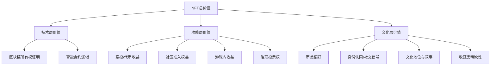
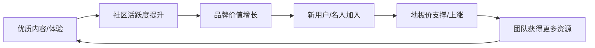
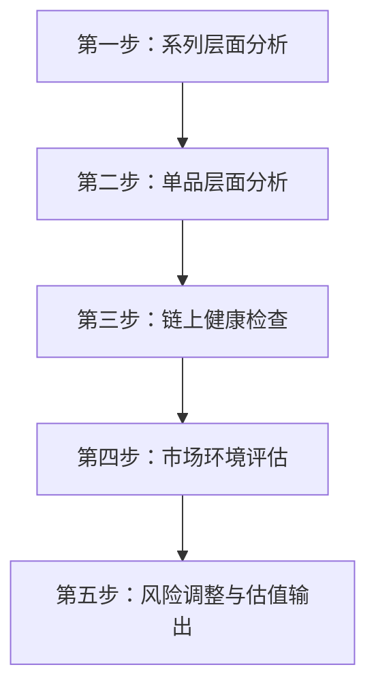

## 八、NFT估值方法论

"这张图片凭什么值100个ETH？"——这是每个接触NFT的人都会问的问题。答案在于：NFT的价格不是拍脑袋定出来的，而是由一套可拆解、可量化、可验证的估值体系决定的。掌握NFT估值方法论，不是让你成为"价格预言家"，而是让你在买入、持有、卖出的每一个决策节点上，都有据可依而非凭直觉赌博。

本节将从估值的底层逻辑出发，逐层展开七大估值方法、链上数据分析、稀有度评分体系、实操估值框架和常见陷阱，最终形成一套可以立即使用的NFT估值工作流。

***

### 一、为什么NFT估值如此困难

在学习具体方法之前，必须先理解NFT估值的本质难点——这决定了任何估值方法的适用边界和局限性。

#### 1.1 NFT与传统资产的根本差异

传统资产（股票、债券、房产）有成熟的估值体系：股票有市盈率（P/E）、债券有到期收益率（YTM）、房产有租金回报率。这些资产的价值锚定在可预测的未来现金流上。NFT截然不同：

| 维度 | 传统资产（以股票为例） | NFT |
|------|----------------------|-----|
| 价值来源 | 企业盈利的现金流折现 | 稀缺性 + 社区共识 + 实用权益 |
| 流动性 | 高（交易所连续竞价） | 低（场外撮合，买卖盘稀疏） |
| 同质性 | 同一公司股票完全同质 | 每个NFT独一无二 |
| 定价机制 | 连续定价（每秒更新） | 离散定价（成交才有价格） |
| 信息透明度 | 强制披露（财报、审计） | 仅链上数据，项目方自述 |
| 估值基准 | 成熟理论体系（DCF、可比公司） | 理论尚不统一，高度依赖经验 |

这种差异意味着：你不能把股票估值的方法直接搬到NFT上，但可以借鉴其底层逻辑。

#### 1.2 NFT价值的三层结构

理解NFT的价值构成，是选择正确估值方法的前提：

**底层——技术层价值**：区块链提供的不可篡改的所有权证明。这是所有NFT共享的基础价值，但通常不构成价格差异的主要来源（就像房产证本身不决定房子的价格）。

**中层——功能层价值**：NFT带来的实际权益——社区准入、空投收益、游戏内资产、治理权、实物兑换权等。这一层是可以用现金流模型量化的。

**表层——文化层价值**：审美偏好、身份认同、社交信号、文化地位、"meme价值"。这一层最难量化，但往往是价格差异最大的来源——CryptoPunks的像素画本身没有技术难度，其价值几乎完全来自文化层。



不同类型的NFT，三层价值的权重截然不同：

| NFT类型 | 技术层 | 功能层 | 文化层 | 典型代表 |
|---------|--------|--------|--------|----------|
| 蓝筹PFP | 5% | 15% | 80% | CryptoPunks, BAYC |
| 生成艺术 | 10% | 5% | 85% | Art Blocks (Fidenza, Chromie Squiggle) |
| GameFi道具 | 10% | 70% | 20% | Axie Infinity, StepN |
| 音乐NFT | 10% | 40% | 50% | Sound.xyz, Royal.io |
| 会员通行NFT | 5% | 80% | 15% | VeeFriends, Proof Collective |
| 实物映射NFT | 15% | 60% | 25% | Courtyard.io (实物手表上链) |

理解这个结构后，你就能判断：对一个PFP项目用现金流模型估值是不对的（文化层占主导），而对一个GameFi道具用地板价乘数估值也是不够的（功能层才是关键）。

***

### 二、七大估值方法详解

#### 2.1 可比销售法（Comparable Sales Approach）

**核心原理**：通过同一收藏系列中相似NFT的历史成交价来推断目标NFT的价值。这是NFT市场中最常用、最直觉的估值方法——就像房产估价中的"可比案例法"。

**具体操作步骤**：

**第一步：筛选可比对象**。在目标NFT所属收藏系列中，查找与目标NFT稀有度等级相近（稀有度排名在前后20%范围内）的近期成交记录。优先使用7天内的成交数据，最多不超过30天——NFT市场变化极快，过时数据会造成严重误导。

**第二步：调整差异因素**。可比NFT与目标NFT之间总存在差异，需要调整：

| 调整因素 | 调整方向 | 调整幅度参考 |
|---------|---------|-------------|
| 稀有度差异 | 可比物更稀有→目标价下调 | 每10%稀有度排名差异约±5-15% |
| 时间差异 | 可比物成交时间更早→根据市场趋势调整 | 上涨期每延迟1周+3-8%，下跌期-3-8% |
| 市场情绪差异 | 可比物在牛市成交→折扣调整 | 牛熊切换时可调整20-50% |
| 交易类型差异 | 可比物为急售→目标价上调 | 急售折扣通常10-30% |
| 特定特征差异 | 审美偏好差异（如颜色、配件） | 社区偏好溢价/折价5-20% |

**第三步：加权平均**。将调整后的可比价格按相关性和时效性加权平均，得出估值区间而非单一价格。

**工具与数据源**：OpenSea的"Activity"页面查看近期成交；Blur的"Sales History"提供更精细的筛选；NFTGo的交易记录支持按稀有度范围过滤。

**适用场景**：所有NFT类型的基础估值方法，尤其适合有足够交易量的收藏系列。

**局限性**：当收藏系列交易量极低（日成交<5笔）时，可比数据严重不足，估值可靠性大幅下降。

#### 2.2 地板价乘数法（Floor Price Multiple）

**核心原理**：NFT价值 = 收藏系列地板价 × 稀有度乘数。这是可比销售法的简化版本，适合快速估算。

**核心公式**：

```text
估值 = Floor Price × Rarity Tier Multiplier
```

**通用乘数参考**（适用于主流PFP系列）：

| 稀有度等级 | 排名范围 | 乘数范围 | 说明 |
|-----------|---------|---------|------|
| 地板层 | 排名后60% | 1.0x - 2.0x | 接近地板价，流动性最好 |
| 中等层 | 排名前30%-60% | 2.0x - 5.0x | 有明显稀有特征但非顶级 |
| 稀有层 | 排名前5%-30% | 5.0x - 20x | 高稀有度，特定买家需求 |
| 神级层 | 排名前1% | 20x - 100x+ | 极端稀缺，博物馆级收藏 |
| 1/1（唯一） | 唯一作品 | 50x - 500x+ | 艺术家原作，超越稀有度评分 |

**实操示例**：假设BAYC地板价为25 ETH，目标NFT稀有度排名在前15%（稀有层），历史数据显示同类稀有度乘数约为8-12x，则估值区间为 200-300 ETH。

**关键注意事项**：

- 地板价本身是动态的，必须使用实时数据
- 不同收藏系列的乘数差异巨大——蓝筹系列的稀有NFT溢价远高于长尾系列
- 地板价由"最弱持有者"（最想卖的人）决定，不等于收藏系列的"公允价值"
- 流动性差的系列地板价极易被操控——一个人低价挂单就能拉低地板

#### 2.3 稀有度评分估值法（Rarity-Based Valuation）

**核心原理**：通过量化NFT各特征（Trait）的稀缺程度来计算稀有度分数，再将分数与价格建立映射关系。

**四种主流计算方法对比**：

**方法一：统计稀有度（Statistical Rarity）**

```text
Score = Π (trait_probability_i)
```

将每个特征出现概率相乘。概率越低的特征对最终分数影响越大。缺点是过于偏向单一极端稀有特征——一个NFT只有一个极稀有特征（其余都很常见）的得分，可能高于一个各特征都中等稀有的NFT。

**方法二：特征稀有度（Trait Rarity / Rarity Score）**

```text
Score = Σ (1 / trait_occurrence_rate_i)
```

将每个特征出现率的倒数相加。这是rarity.tools最早推广的方法，也是目前最广泛使用的计算方式。它比统计稀有度更均衡——多个中等稀有特征的累加效果可以超过一个极端稀有特征。

**方法三：信息含量法（Information Content / Entropy）**

```text
Score = Σ (-log2(trait_probability_i))
```

基于信息论的香农熵。由OpenRarity标准采用，被OpenSea集成。数学性质与特征稀有度类似，但对极端值的处理更平滑。

**方法四：平均特征稀有度（Average Trait Rarity）**

```text
Score = (1/N) × Σ (1 / trait_occurrence_rate_i)
```

对特征稀有度取平均值，减少特征数量差异带来的偏差——如果一个NFT有5个特征而另一个有8个，直接求和会不公平。

**方法选择建议**：

| 方法 | 最适合场景 | 工具支持 |
|------|-----------|---------|
| 统计稀有度 | 存在单一"明星特征"的系列 | rarity.tools |
| 特征稀有度 | 通用场景，最广泛使用 | Rarity Sniper, icy.tools |
| 信息含量法 | 需要标准化比较的场景 | OpenRarity, OpenSea |
| 平均特征稀有度 | 特征数量差异大的系列 | 自定义计算 |

**稀有度不等于价格**——这是最关键的警告。稀有度评分衡量的是"数学上的稀缺"，但市场价格还受到审美偏好、社区文化、名人效应等因素影响。一个稀有度排名第1的NFT，如果其最稀有特征恰好是社区不受欢迎的审美（比如一个丑陋的颜色组合），其价格可能低于稀有度排名前50但视觉效果更好的NFT。

**典型案例**：在CryptoPunks中，类型（Type）是最强的价格驱动因素。Aliens（9个）、Apes（24个）、Zombies（88个）的价格远超普通Punks（6,039个），这个溢价不是稀有度评分能完全捕捉的——它来自社区对"外星人Punk"这个文化符号的共识。

#### 2.4 收益折现法（Income / Cash Flow Approach）

**核心原理**：对于能够产生现金流的NFT，可以用传统金融中的贴现现金流（DCF）模型来估值。这是最"正统"的金融估值方法，但只适用于部分NFT类型。

**适用范围**：

- 持有可获得代币空投的NFT（如BAYC→APE代币，Pudgy Penguins→PENGU代币）
- 音乐NFT（Sound.xyz上的版税分成权）
- 游戏内收益型NFT（GameFi中的角色/装备产生游戏内收入）
- 质押收益型NFT（某些项目允许质押NFT获取代币奖励）
- 分红型会员NFT（某些DAO向NFT持有者分配收益）

**DCF模型框架**：

```text
NFT估值 = Σ [CF_t / (1 + r)^t] + TV / (1 + r)^n

其中：
CF_t = 第t期预期现金流（空投价值、版税、质押奖励等）
r = 折现率（反映风险的年化回报率要求）
n = 预期持有期
TV = 终值（持有期末的预期残值）
```

**折现率选择参考**：

| NFT类型 | 风险等级 | 建议折现率 | 说明 |
|---------|---------|-----------|------|
| 蓝筹空投型（BAYC级别） | 中 | 30%-50% | 空投已证明过，团队可信 |
| 中型项目空投 | 高 | 50%-80% | 空投未确认，不确定性大 |
| 音乐版税NFT | 中-高 | 40%-60% | 版税取决于作品流行度 |
| GameFi收益 | 高 | 60%-100% | 游戏生命周期不确定 |

**实操示例**：假设一个Pudgy Penguins NFT预期可获得以下现金流：
- PENGU代币空投价值（已发放部分按市价）：约2 ETH
- 未来潜在空投/权益（乐观预期）：约1 ETH
- 终值（假设2年后以地板价出售）：约5 ETH
- 折现率：50%

则 DCF 估值 = 2/(1.5)^0 + 1/(1.5)^1 + 5/(1.5)^2 ≈ 2 + 0.67 + 2.22 ≈ 4.89 ETH

**局限性**：现金流高度不确定（空投是否发放、代币是否保值、游戏是否持续运营），折现率选择主观性强。此方法更适合与其他方法交叉验证，而非单独使用。

#### 2.5 网络效应与社区估值法（Network / Community Valuation）

**核心原理**：NFT的价值很大程度上取决于其背后的社区规模、活跃度和文化影响力。一个强大的社区不仅支撑地板价，还创造"飞轮效应"——社区越强→品牌价值越高→吸引新成员→社区更强。

**社区健康度评估框架**：

| 指标 | 健康信号 | 危险信号 | 数据来源 |
|------|---------|---------|---------|
| Discord日活 | 在线人数占成员总数10%+ | <2%在线或大量机器人 | Discord服务器统计 |
| Twitter互动率 | 点赞+转发/粉丝数>2% | 大量粉丝但互动极少 | Twitter Analytics |
| 持有人增长率 | 月净增>5% | 持续净流出 | NFTGo, Dune |
| 蓝筹持有重叠 | 与BAYC/Punk等持有者重叠度高 | 无知名收藏者 | Nansen Smart Money |
| 实际交付率 | 路线图完成率>70% | 路线图长期未更新 | 项目官网/Discord |
| 品牌合作 | 有知名品牌合作案例 | 仅有空洞的"即将公布" | 新闻/公告 |
| IRL活动 | 定期举办线下活动（如ApeFest） | 无任何线下存在 | 社交媒体 |

**社区飞轮模型**：



**量化社区价值的近似方法**：

1. **社区规模乘数**：社区活跃成员数 × 人均贡献价值。BAYC的Discord活跃成员约5万，APE生态总市值数十亿美元，人均隐含价值极高。
2. **品牌授权收入法**：如果NFT项目进行了品牌授权（如Pudgy Penguins的玩具线），授权收入可以作为社区价值的硬参考。
3. **可比社区法**：与规模和影响力类似的社区对比——如果两个社区的活跃度、成员质量、文化影响力相近，其NFT的地板价也应该在同一量级。

#### 2.6 链上数据分析法（On-Chain Analytics）

**核心原理**：区块链记录了NFT从铸造到每一次转手的完整历史。通过分析这些链上数据，可以发现纸面信息（地板价、交易量）背后的真相。

**六大核心链上指标**：

**指标一：持有者分布（Holder Distribution）**

```text
健康标准：独立持有者/总供应量 > 40%
警戒线：前10个钱包持有量 > 总供应量的30%
```

持有者分布决定了价格的"抗打击能力"。如果少数鲸鱼持有大量NFT，他们任何一个人的抛售都可能引发地板价崩塌。使用Nansen的"Token God Mode"或Dune上的持有者分布Dashboard来查看。

**指标二：真实交易量（Real Volume）**

NFT市场存在严重的刷量交易（Wash Trading）——交易者在自己的多个钱包之间来回买卖，制造虚假交易量。根据Chainalysis的研究，某些时期高达30-50%的报告交易量是刷量。

```text
真实交易量 ≈ 报告交易量 - 估算刷量交易量
```

刷量识别信号：
- NFT在由同一资金来源资助的钱包之间转移
- 快速的买入-卖出循环，且价格相近
- 此前无活动的钱包突然开始交易
- 交易量与持有者数量不成比例

工具：NFTGo内置刷量过滤器；Dune上hildobby的刷量检测Dashboard是最权威的免费数据源。

**指标三：流动性指标**

| 指标 | 健康范围 | 含义 |
|------|---------|------|
| 挂牌率 | 5%-15% | 大部分持有者不愿出售（看涨信号） |
| 挂牌率 | >30% | 大量持有者想卖（看跌信号） |
| 买盘深度 | 与地板价市值比>10% | 有足够资金支撑地板价 |
| 买卖价差 | <地板价的5% | 流动性好，容易进出 |
| 日均成交笔数 | >供应量的1% | 市场活跃 |

**指标四：买家/卖家比率**

- 买家数量 > 卖家数量：看涨信号，需求超过供给
- 买家数量 < 卖家数量：看跌信号，抛压大于需求
- 新钱包买入占比高：有新资金流入，可持续性更强

**指标五：盈利分布**

查看当前持有者的盈亏状态：
- 高比例持有者盈利（>60%）：持有者心态好，不容易恐慌抛售
- 高比例持有者亏损（>50%）：一旦反弹到成本价，会面临大量抛压
- 平均成本基础与当前地板价的关系：成本价高于地板价越多，"套牢盘"压力越大

**指标六：聪明钱动向（Smart Money Flow）**

Nansen将钱包标签化为"Smart Money"（机构投资者、知名收藏家、专业交易员）。当聪明钱持续流入一个收藏系列时，通常是有价值信号的。

- 聪明钱净流入：看涨信号
- 聪明钱净流出：警示信号
- 聪明钱持仓占比上升：机构认可度提高

#### 2.7 机器学习与量化模型（ML / Quantitative Models）

**核心原理**：利用历史交易数据训练机器学习模型，通过多维特征预测NFT价格。这是学术界和量化基金使用的方法。

**常用模型特征**：

| 特征类别 | 具体特征 |
|---------|---------|
| 稀有度特征 | 稀有度分数、排名百分比、特征数量 |
| 市场特征 | 地板价、系列市值、24h/7d交易量 |
| 时间特征 | 距铸造天数、距上次成交天数、持有期 |
| 持有者特征 | 持有者数量、鲸鱼集中度、聪明钱占比 |
| 社交特征 | Twitter粉丝数、Discord活跃度 |
| 链上特征 | 挂牌率、买卖比率、盈利持有者占比 |
| 宏观特征 | ETH价格、NFT市场总指数、Gas费 |

**常用模型**：
- **随机森林/XGBoost**：最适合表格型数据，可解释性较好
- **神经网络**：可捕捉非线性关系，但需要大量数据
- **线性回归**：基线模型，用于理解特征与价格的线性关系

**学术参考**：
- Lin & Piskorski（哥伦比亚大学，2023）的拍卖理论定价模型
- Dowling（2021）的NFT定价早期研究
- Whitaker & Kräussl（卢森堡金融学院，2020）的数字艺术估值研究

**实践局限**：ML模型在牛熊切换时表现极差（Regime Change问题），因为训练数据中缺少类似市场状态。此方法更适合作为辅助工具，而非主要估值依据。

***

### 三、估值工具全景

掌握估值方法后，你需要一套工具来执行分析。以下是按用途分类的工具全景：

#### 3.1 综合分析平台

| 平台 | 核心功能 | 费用 | 最适合 |
|------|---------|------|--------|
| NFTGo | 系列排名、鲸鱼追踪、稀有度、刷量检测 | 免费+付费API | 全面的NFT市场概览 |
| Nansen | 聪明钱追踪、钱包画像、NFT Paradise面板 | 付费（$150+/月） | 追踪机构/大户动向 |
| Dune Analytics | 自定义SQL查询、社区Dashboard | 免费基础+付费 | 深度链上数据分析 |
| Blur | 实时地板价、Portfolio PnL、竞价深度 | 免费 | 专业交易者日常使用 |
| OpenSea | 系列统计、活动流、历史成交 | 免费 | 入门级信息查询 |

#### 3.2 稀有度与估值工具

| 工具 | 核心功能 | 特色 |
|------|---------|------|
| Rarity Sniper | 稀有度排名（覆盖1000+系列） | 覆盖面最广，社区认可度高 |
| rarity.tools | 原始稀有度评分标准 | 历史最悠久，方法透明 |
| OpenRarity | 开源标准化稀有度协议 | OpenSea集成，行业标准 |
| icy.tools | 实时销售追踪、铸造提醒 | 速度最快，适合发现新项目 |
| NFTBank.ai | 组合管理 + 估值引擎 | 自动化估值，适合管理大量持仓 |
| nftpricefloor.com | 跨平台地板价追踪 | 去除平台价差，数据更准 |

#### 3.3 链上数据查询

| 工具 | 核心功能 | 适用场景 |
|------|---------|---------|
| Etherscan | 交易记录、合约代码、代币余额 | 基础链上查询 |
| Arkham | 地址标签化、资金流向追踪 | 追踪特定钱包/实体 |
| DeFiLlama | 协议TVL、NFT-Fi数据 | DeFi与NFT交叉分析 |
| Footprint Analytics | 跨链NFT数据 | 多链对比分析 |
| CryptoSlam | 多链NFT销售追踪 | 跨链销售数据汇总 |

***

### 四、实战估值框架

将前述方法整合为一套可执行的五步估值工作流：



#### 第一步：系列层面分析

在评估单个NFT之前，先判断整个收藏系列是否值得关注：

**检查清单**：
- [ ] 团队背景：创始人是否可验证身份？过往项目记录如何？
- [ ] 智能合约审计：是否经过知名机构审计（Trail of Bits、OpenZeppelin）？
- [ ] 路线图交付率：已承诺的事项完成了多少？
- [ ] 社区质量：Discord讨论是真实交流还是水军刷屏？
- [ ] 交易量趋势：7天/30天/90天交易量是增长还是萎缩？
- [ ] 持有者增长：月净增持有者是正还是负？
- [ ] 蓝筹持有重叠：是否有知名收藏者持有？

**判断标准**：如果以上7项中有3项以上亮红灯，不建议深入估值——先解决系列层面的问题。

#### 第二步：单品层面分析

对通过第一步筛选的系列，分析目标NFT：

**核心估值公式**：

```text
估值 = 地板价
     × 稀有度乘数（基于稀有度评分）
     × 流动性调整系数
     × 市场情绪乘数
     ± 特征溢价/折价（审美、文化价值）
     ± 实用权益溢价（空投、质押、准入）
```

**各系数参考值**：

| 系数 | 熊市 | 震荡市 | 牛市 |
|------|------|--------|------|
| 流动性调整（低流动性） | 0.6-0.7 | 0.7-0.8 | 0.8-0.9 |
| 流动性调整（高流动性） | 0.9-1.0 | 1.0 | 1.0-1.1 |
| 市场情绪乘数 | 0.5-0.8 | 0.8-1.2 | 1.2-2.0 |
| 审美溢价（社区热门特征） | +5-15% | +10-20% | +15-30% |
| 实用权益溢价（已确认空投） | 按DCF计算 | 按DCF计算 | 按DCF计算 |

#### 第三步：链上健康检查

使用前述六大链上指标进行交叉验证。关键操作：

1. 在NFTGo上开启"过滤刷量交易"，查看真实地板价和交易量
2. 在Dune上查看持有者分布变化趋势
3. 在Nansen上追踪聪明钱是流入还是流出
4. 计算真实流动性：挂牌率 × 总供应量 × 地板价 = 理论抛压市值

#### 第四步：市场环境评估

NFT不是孤立存在的——它受到宏观环境的强烈影响：

- **ETH价格趋势**：ETH上涨期NFT通常也上涨（以ETH计价可能不变，但以USD计价上涨）；ETH暴跌时NFT通常跌幅更大（流动性更差）
- **NFT市场总指数**：NFTGo的市场指数反映整体情绪
- **Gas费水平**：Gas高时抑制交易活跃度，可能导致地板价下跌
- **竞争项目**：同类型新项目发行会分流资金和注意力

#### 第五步：风险调整与估值输出

在估值中加入以下风险折扣：

| 风险因素 | 折扣幅度 | 说明 |
|---------|---------|------|
| 团队匿名 | -10%-20% | 跑路风险更高 |
| 无审计合约 | -15%-30% | 技术风险 |
| 低流动性（日成交<系列量1%） | -20%-40% | 可能无法在合理价格卖出 |
| 集中持仓（前10钱包>30%） | -10%-25% | 鲸鱼砸盘风险 |
| 路线图未交付项目 | -15%-30% | 承诺不等于价值 |
| 监管不确定性 | -5%-15% | 部分国家限制NFT交易 |

**最终输出格式**：

```text
估值对象：[收藏系列名] #[编号]
估值日期：[日期]
估值区间：[最低] - [最高] ETH（或USD）
置信度：高/中/低
关键假设：
  - 地板价基于：[当前/7天均价/30天均价]
  - 稀有度乘数来源：[工具/方法]
  - 市场情绪判断：[牛市/震荡/熊市]
  - 已计入风险折扣：[列出]
主要风险：[列出最大风险项]
```

***

### 五、蓝筹系列估值案例分析

通过真实蓝筹系列理解估值方法的实际应用：

#### 5.1 CryptoPunks——文化价值的极致

CryptoPunks是NFT估值的"教科书案例"——其价格几乎完全由文化层价值驱动。

**价格驱动因素分析**：

| 因素 | 影响权重 | 说明 |
|------|---------|------|
| 类型（Type） | 50%+ | Alien(9个)>>Ape(24个)>>Zombie(88个)>>普通(6039个) |
| 历史地位 | 20% | 2017年铸造，NFT领域的"创世区块" |
| 名人持有 | 15% | Jay-Z、Gary Vee等名人用作头像 |
| 机构认可 | 10% | 佳士得/苏富比拍卖、MoMA收藏 |
| 具体特征 | 5% | Hoodie、3D Glasses等特定配件 |

**估值要点**：对CryptoPunks而言，类型是唯一重要的稀有度维度。一个排名稀有度前10%但类型为Male的Punk，其价值可能低于一个排名前30%但类型为Zombie的Punk。标准稀有度评分在这里会失效——必须用"类型优先"的估值逻辑。

#### 5.2 Art Blocks——艺术价值与算法稀缺

Art Blocks是生成艺术（Generative Art）的主要平台，其估值逻辑更接近传统艺术品市场。

**估值层次**：

1. **策展层级**：Curated（最高）> Playground > Factory。Curated系列经过Art Blocks官方严格筛选，溢价显著。
2. **艺术家声誉**：Tyler Hobbs（Fidenza）、Dmitri Cherniak（Ringers）等顶级艺术家的作品远高于新人。
3. **系列内部稀有度**：同一艺术家的不同作品，根据输出的视觉效果差异定价。
4. **博物馆认可**：被MoMA或Centre Pompidou收藏的作品有额外溢价。

**关键数据**：Fidenza #313成交价约330万美元；Ringers #879成交价约590万美元。这些价格超出了任何纯量化模型的预测范围——它们反映的是艺术史地位的定价。

#### 5.3 Pudgy Penguins——品牌飞轮的价值

Pudgy Penguins展示了"社区+品牌"驱动估值的完整路径。

**价值演变时间线**：

| 时间 | 事件 | 地板价影响 |
|------|------|-----------|
| 2021.07 | 铸造 | 0.03 ETH |
| 2022 | 社区危机/团队更换 | 跌至0.5 ETH |
| 2023 | Luca Netz收购 + 品牌重塑 | 回升至3-5 ETH |
| 2024 | 实体玩具进入Walmart/Amazon | 突破10 ETH |
| 2024.12 | PENGU代币空投 | 飙升至15+ ETH |

**估值启示**：Pudgy Penguins在2022年跌至低谷时，任何基于历史地板价的估值模型都会显示"被低估"。但真正的价值转折来自新团队的品牌运营能力——这不是量化模型能预测的。定量分析告诉你"现在是什么价"，定性分析告诉你"未来会是什么价"。

***

### 六、十大估值陷阱与纠偏

在实际估值中最常犯的错误，以及如何避免：

#### 陷阱一：刷量幻觉

**问题**：将虚假交易量当作真实需求，导致对系列流动性严重高估。

**纠偏**：永远使用NFTGo的刷量过滤功能或Dune的刷量检测Dashboard查看"真实交易量"。一个系列报告日交易量1000 ETH，但过滤后只剩200 ETH——这个差异足以推翻你的估值。

#### 陷阱二：地板价陷阱

**问题**：将地板价等同于系列价值，或用地板价变化代表整体趋势。

**纠偏**：地板价由最弱持有者（最想卖的人）决定。一个1万供应量的系列，地板价可能只由排名最后50个NFT的挂牌价决定——这不代表其余9,950个NFT的价值。评估系列健康度时，应该同时看地板价、平均成交价、中位成交价。

#### 陷阱三：幸存者偏差

**问题**：以BAYC、CryptoPunks为参照评估新项目，忽视了99%以上的NFT项目最终归零的事实。

**纠偏**：建立"基准失败率"意识。根据DappRadar数据，2021-2023年间铸造的NFT系列中，超过95%的地板价在6个月内跌破铸造价。任何新项目的估值都应该包含"归零概率"。

#### 陷阱四：忽视流动性风险

**问题**：看到账面盈利就认为"赚了"，但实际卖不出去或只能大幅折价出售。

**纠偏**：在估值中加入流动性折扣。一个持有量中位数为50 ETH但日成交不到3笔的NFT，其"可实现价值"远低于纸面价值。对于流动性差的NFT，使用"预期卖出周期"来评估——如果预期需要30天才能卖出，应将时间成本折入估值。

#### 陷阱五：路线图等于价值

**问题**：将项目方路线图上描述的"未来功能"当作已实现的价值。

**纠偏**：只对已交付的功能赋予价值。路线图上的承诺应打50%以上的折扣。评估项目时，计算"路线图交付率"= 已完成事项 / 已到截止日期的事项。交付率<50%的项目，其未来承诺的可信度极低。

#### 陷阱六：社交指标崇拜

**问题**：以Twitter粉丝数和Discord成员数判断项目价值。

**纠偏**：社交指标可以购买。10万Twitter粉丝但每条推文只有50个赞——这是机器人。真正有价值的指标是"互动质量"——Discord中有深度讨论的频道数量、核心贡献者（非项目方）的数量、自发产生的社区内容数量。

#### 陷阱七：ETH价格混淆

**问题**：在ETH价格上涨时以为NFT"涨了"，实际以ETH计价没变甚至下跌。

**纠偏**：始终同时跟踪ETH计价和USD计价两个维度。一个以ETH计价下跌50%的NFT，如果同期ETH翻倍，在USD计价上"持平"——但NFT本身的价值是在缩水的。

#### 陷阱八：审美与稀有度错配

**问题**：认为稀有度最高的特征一定最值钱。

**纠偏**：稀有度评分是数学，价格是心理学。在BAYC中，"纯金色毛皮"（Solid Gold Fur）既稀有又是社区公认的最酷特征，所以溢价最高。但如果一个极稀有的特征在社区审美中不受欢迎（比如某些不讨喜的背景色），其价格溢价会远低于稀有度评分的预期。查看特征级别的历史成交数据，而非只看稀有度排名。

#### 陷阱九：时效性错配

**问题**：使用过时的可比数据进行估值。

**纠偏**：NFT市场的"过时"标准远严于传统市场——两周前的成交数据可能已经不具参考性。优先使用7天内的成交数据，最多不超过30天。在市场剧烈波动期（如重大空投、宏观事件前后），应只使用3天内的数据。

#### 陷阱十：单一方法依赖

**问题**：只用一种估值方法就得出结论。

**纠偏**：任何单一方法都有致命盲点。正确做法是多方法交叉验证：

```text
最终估值 = 加权平均(
    可比销售法估值 × 0.3,
    地板价乘数法估值 × 0.25,
    稀有度评分法估值 × 0.2,
    收益折现法估值 × 0.15,
    链上分析调整 × 0.1
)
```

权重可根据NFT类型调整——对PFP项目加大可比销售法权重，对收益型NFT加大DCF权重。

***

### 七、估值决策矩阵

将估值方法映射到具体决策场景：

| 决策场景 | 推荐主方法 | 辅助方法 | 关键注意点 |
|---------|-----------|---------|-----------|
| 买入蓝筹PFP | 可比销售法 + 地板价乘数 | 稀有度评分 + 链上分析 | 关注聪明钱动向和持有者分布 |
| 买入收益型NFT | 收益折现法（DCF） | 可比销售法 | 仔细评估现金流假设的合理性 |
| 买入生成艺术 | 可比销售法（同艺术家/同平台） | 社区估值 | 艺术家声誉和策展级别是关键 |
| 卖出时机判断 | 链上分析法 | 市场情绪评估 | 关注买家/卖家比率和聪明钱流向 |
| 序列内选择 | 稀有度评分法 | 可比销售法 | 交叉验证稀有度与审美溢价 |
| 批量组合估值 | 地板价乘数法 | 链上健康度检查 | 为流动性折扣设定统一标准 |
| 借贷抵押估值 | 地板价乘数法 × 0.6-0.7 | 流动性分析 | NFT-Fi平台的LTV通常只给30-50% |

***

### 八、进阶：NFT-Fi中的估值应用

NFT-Fi（NFT金融化）是NFT估值方法论的高级应用场景——将NFT作为金融资产进行借贷、租赁、碎片化交易。

#### 8.1 NFT抵押借贷中的估值

平台如BendDAO、NFTfi、Paraspace允许用户将NFT作为抵押品借出资金。估值在这里直接影响两个关键参数：

- **贷款价值比（LTV）**：贷款金额 / NFT估值。通常为30%-50%——远低于房产抵押的70%-80%，因为NFT波动性更大。
- **清算阈值**：当NFT价值下跌到某个阈值时触发清算。通常设定在LTV的80%-90%。

**估值要求**：NFT-Fi平台需要实时、自动化、可防御的估值。它们通常采用"地板价×折扣系数"的方式，加上预言机（Oracle）机制来防止价格操纵。

#### 8.2 碎片化估值

将高价值NFT（如一个CryptoPunks Alien）碎片化为大量ERC-20代币，使普通投资者也能参与。碎片化后的估值逻辑变为：

```text
NFT整体估值 = 碎片代币价格 × 总供应量
```

但要注意：碎片化代币可能存在流动性溢价或折价——如果碎片代币交易活跃，整体估值可能高于单个NFT的市场价（流动性溢价）。

***

### 九、关键原则总结

1. **多方法交叉验证**：永远不要只用一种方法估值。至少使用3种方法，当它们给出相近结果时，置信度最高。

2. **区分"数学稀缺"和"市场共识"**：稀有度评分告诉你数学上的稀缺程度，但市场价格由社区共识决定。两者不一致时，市场价格才是"真实"的。

3. **永远过滤刷量**：在做任何定量分析之前，先过滤虚假交易量。这一步不做，后面的所有分析都是垃圾进垃圾出。

4. **估值是区间不是点**：给出"0.05-0.08 ETH"的估值区间比给出"0.065 ETH"的精确数字更有意义——NFT的不确定性太大，虚假的精确度比没有精确度更危险。

5. **流动性是价值的一部分**：一个无法在合理时间内以合理价格卖出的NFT，其"估值"只是纸面数字。在估值中始终包含流动性折扣。

6. **定性判断不可替代**：量化工具可以告诉你"现在的价格是多少"，但判断"未来的价格会是多少"需要定性分析——团队能力、社区文化、品牌飞轮、行业趋势。最赚钱的NFT交易往往来自对定性因素的正确判断。

7. **持续学习，持续迭代**：NFT市场每个月都在变化。今天的估值方法论可能在一年后需要更新。关注NFTGo、DappRadar、Messari的行业报告，跟踪学术研究的最新进展。

***

### 十、推荐阅读与学习资源

| 类型 | 资源 | 说明 |
|------|------|------|
| 行业报告 | NFTGo Annual Report | 年度市场全景数据 |
| 行业报告 | DappRadar NFT Quarterly | 季度市场分析 |
| 行业报告 | Chainalysis NFT Report | 刷量与欺诈分析 |
| 学术论文 | Lin & Piskorski (2023), Columbia | NFT拍卖理论定价 |
| 学术论文 | Dowling (2021) | NFT定价早期框架 |
| 学术论文 | Victor & Smith (2023) | 刷量交易量化研究 |
| 数据工具 | Dune Analytics (hildobby dashboard) | 免费刷量检测 |
| 数据工具 | NFTGo API | 程序化NFT数据分析 |
| 社区分析 | Nansen Smart Money | 聪明钱追踪 |
| 稀有度标准 | OpenRarity Documentation | 开源稀有度计算协议 |
