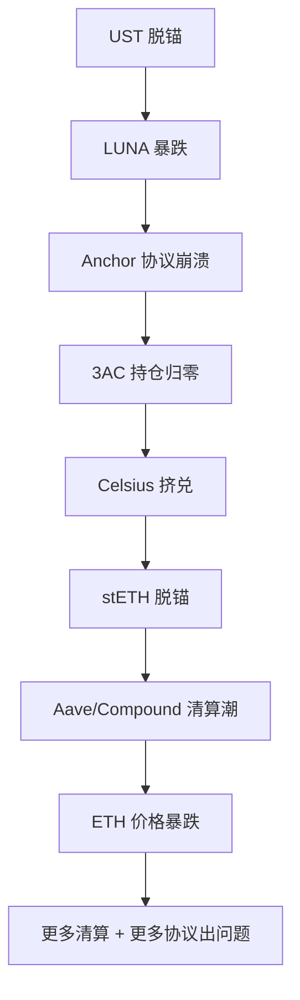

## 九、DeFi风险管理进阶

DeFi（去中心化金融）为用户提供了无需许可的金融服务——借贷、交易、衍生品、保险一应俱全。但"无需许可"意味着"没有兜底"：没有存款保险、没有客服退款、没有监管仲裁。一旦发生智能合约漏洞、预言机操纵或流动性枯竭，损失可能是永久性的。

本章从风险分类学出发，逐层拆解 DeFi 生态中每一类风险的成因、表现与应对策略，帮助你从"裸奔上链"进化为"风控武装到牙齿"的 DeFi 参与者。

---

### 1. DeFi 风险分类学：全景认知

参与 DeFi 前，必须建立系统性的风险认知框架。DeFi 风险可分为以下七个维度：

| 风险类别 | 核心威胁 | 典型场景 | 影响程度 |
|----------|----------|----------|----------|
| 智能合约风险 | 代码漏洞、逻辑缺陷 | 重入攻击、闪电贷操纵 | 可能归零 |
| 预言机风险 | 价格数据被操纵 | 借贷协议清算、衍生品定价错误 | 部分至全部损失 |
| 流动性风险 | 无法以合理价格退出 | 池子深度不足、恐慌性撤资 | 滑点损失 10%-90% |
| 治理攻击 | 恶意提案通过 | 闪电贷治理、提案贿赂 | 协议资金被抽走 |
| 系统性风险 | 关联协议连锁崩溃 | Terra/LUNA 死螺旋、3AC 崩盘 | 全市场下跌 |
| 监管风险 | 政策突变导致资产冻结 | 美国 SEC 执法、Tornado Cash 制裁 | 资产不可用 |
| 私钥/操作风险 | 钱包被盗、签名欺诈 | 钓鱼网站、恶意合约授权 | 私钥下资产清零 |

这七类风险并非孤立存在，往往会连锁触发。例如：预言机操纵 → 大规模清算 → 流动性枯竭 → 协议破产，形成系统性危机。

---

### 2. 智能合约风险：最核心的技术威胁

#### 2.1 为什么智能合约风险是 DeFi 第一大敌

智能合约是 DeFi 的基础设施，所有资金都锁定在合约代码中。代码即法律（Code is Law）的另一面是：代码的 Bug 也是法律——一旦被利用，链上交易不可逆。据统计，2020-2025 年间 DeFi 因智能合约漏洞造成的损失累计超过 80 亿美元。

#### 2.2 常见漏洞类型

**重入攻击（Reentrancy）**

攻击者在合约执行外部调用时，通过回调函数反复进入同一函数，在余额更新前多次提取资金。2016 年 The DAO 攻击（损失 360 万 ETH）即为经典案例。

```solidity
// 有漏洞的代码示例
function withdraw(uint amount) external {
    require(balances[msg.sender] >= amount);
    (bool success, ) = msg.sender.call{value: amount}("");  // 外部调用在前
    require(success);
    balances[msg.sender] -= amount;  // 余额更新在后，攻击者可在此前重入
}

// 修复方案：Checks-Effects-Interactions 模式
function withdraw(uint amount) external {
    require(balances[msg.sender] >= amount);   // Check
    balances[msg.sender] -= amount;             // Effect（先更新余额）
    (bool success, ) = msg.sender.call{value: amount}("");  // Interaction（后转账）
    require(success);
}
```

**闪电贷操纵（Flash Loan Manipulation）**

攻击者在同一笔交易中借入巨额资金，操纵价格预言机或治理投票，从协议中套利后归还贷款。整个过程在一个区块内完成，无需任何本金。

**整数溢出/下溢（Integer Overflow/Underflow）**

旧版本 Solidity（<0.8.0）中，uint256 类型的数字溢出不会报错。例如 `uint8` 类型的 0 减 1 会变成 255，导致余额异常膨胀。Solidity 0.8.0+ 已内置溢出检查，但老合约仍存在风险。

**访问控制缺陷（Access Control Flaw）**

关键函数缺少权限检查，任何人都能调用管理功能。2022 年 Wormhole 桥被攻击，根本原因就是签名验证逻辑漏洞，导致 12 万 ETH 被铸造。

**前端运行（Front-running / MEV）**

矿工或 MEV 机器人在看到你的交易后，插入自己的交易抢先执行，从你的交易中提取价值（三明治攻击）。这不是合约 Bug，但属于协议设计层面的风险。

#### 2.3 如何评估合约安全性

| 评估维度 | 具体方法 | 工具/来源 |
|----------|----------|----------|
| 审计报告 | 查看是否经过知名审计公司审计 | CertiK、OpenZeppelin、Trail of Bits、Consensys Diligence |
| 审计数量 | 至少 2 家独立审计机构 | 各协议官网、审计报告 PDF |
| 形式化验证 | 数学证明合约正确性 | Certora、Runtime Verification |
| 漏洞赏金 | 是否有活跃的 Bug Bounty 计划 | Immunefi（最大平台） |
| 代码开源 | 合约代码是否开源且可验证 | Etherscan 合约页面 |
| 时间检验 | 主网上线时间、TVL 持续时间 | DeFiLlama |
| 社区审查 | 社区是否发现过并修复过漏洞 | GitHub Issues、治理论坛 |

**实操建议**：在 DeFiLlama 上查看协议 TVL，TVL 超过 1 亿美元且运行超过 1 年的协议通常更安全。但高 TVL 不等于零风险——Terra Anchor 的 TVL 一度超过 140 亿美元，最终仍然崩盘。

---

### 3. 预言机风险：价格数据的生命线

#### 3.1 预言机是什么

区块链本身无法获取链外数据。预言机（Oracle）是将链外信息（如代币价格、天气数据、体育比分）传递给智能合约的桥梁。在 DeFi 中，价格预言机至关重要——借贷协议的清算、衍生品的定价、AMM 的套利都依赖准确的价格数据。

#### 3.2 预言机操纵场景

**场景一：低流动性 DEX 池的价格操纵**

假设某借贷协议使用 Uniswap V2 的 TWAP（时间加权平均价格）作为价格源。如果目标代币在 Uniswap 上的流动性池只有 50 万美元，攻击者用 20 万美元的大额买入就能将价格推高 300%。此时攻击者可以：
1. 在借贷协议中存入被高估的代币作为抵押品
2. 借出大量高价值资产（如 ETH、USDC）
3. 价格回归正常后，抵押品价值暴跌，协议产生坏账

**场景二：链下数据源被攻击**

中心化预言机（如早期的 Chainlink 节点）如果依赖少数数据源，单个数据源被入侵就会影响所有下游协议。

#### 3.3 预言机方案对比

| 预言机类型 | 代表项目 | 优势 | 劣势 | 适用场景 |
|-----------|----------|------|------|----------|
| 去中心化预言机网络 | Chainlink | 节点多、数据源分散、久经考验 | 成本较高、延迟稍大 | 借贷协议、衍生品 |
| TWAP（时间加权平均） | Uniswap V3 TWAP | 完全链上、无外部依赖 | 依赖自身流动性、有操纵窗口 | AMM 内部定价 |
| 多源聚合 | Pyth Network | 专业做市商提供数据、低延迟 | 依赖做市商诚实性 | 高频交易场景 |
| 预测市场式 | UMA | 争议机制去中心化 | 解决争议需要时间 | 长尾资产 |
| 自引用型 | Venus（BSC） | 简单直接 | 极易被闪电贷操纵 | ⚠️ 不推荐用于高价值协议 |

**风控要点**：
- 优先选择使用 Chainlink 或 Pyth 的协议
- 警告：如果协议使用单一 DEX 的现货价格作为唯一预言机，风险极高
- 关注预言机的更新频率——更新太慢意味着价格滞后，更新太快意味着抗操纵性弱

---

### 4. 无常损失（Impermanent Loss）深度解析

#### 4.1 什么是无常损失

无常损失是 AMM（自动做市商）流动性提供者的专属风险。当你将两种代币存入流动性池时，如果两种代币的价格比率发生变化，你取出的资产价值会低于简单持有（HODL）的价值。"无常"是因为如果你在价格恢复到初始比率时撤出，损失为零；但现实中价格很少完全恢复，所以大多数情况下损失是永久的。

#### 4.2 无常损失量化公式

对于标准的恒定乘积 AMM（x * y = k），无常损失可以精确计算：

| 价格变化倍数 | 无常损失（相对 HODL） |
|-------------|---------------------|
| 1.25x | -0.6% |
| 1.50x | -2.0% |
| 2x | -5.7% |
| 3x | -13.4% |
| 5x | -25.5% |
| 10x | -42.6% |

这意味着：如果一个代币相对于另一个涨了 5 倍，你作为流动性提供者会损失 25.5% 的潜在收益。注意这是相对于 HODL 的损失，不是相对于本金——你可能仍然赚了，但赚得比直接持有少。

#### 4.3 无常损失计算实操

```python
import math

def impermanent_loss(price_ratio: float) -> float:
    """
    计算无常损失百分比
    price_ratio: 代币价格变化倍数（如2.0表示涨了1倍）
    返回: 相对于HODL的损失百分比（负数）
    """
    il = 2 * math.sqrt(price_ratio) / (1 + price_ratio) - 1
    return il * 100  # 转为百分比

# 示例
for ratio in [1.25, 1.5, 2, 3, 5, 10]:
    il = impermanent_loss(ratio)
    print(f"价格变化 {ratio}x → 无常损失 {il:.1f}%")
```

#### 4.4 降低无常损失的策略

**策略一：选择价格相关性强的代币对**

ETH/stETH、USDC/DAI 等价格高度相关的代币对，无常损失极小。这是 Curve Finance 的核心设计哲学——专为稳定资产对优化。

**策略二：使用单边流动性协议**

Bancor V3、Thorchain 等提供单边流动性，协议承担部分无常损失。但要注意协议的偿付能力——如果协议本身资金不足，补偿可能无法兑现。

**策略三：集中流动性（Concentrated Liquidity）**

Uniswap V3 允许你在特定价格范围内提供流动性。在范围内收益更高，但一旦价格移出范围，你不再赚取手续费，且无常损失与全范围提供等效。需要主动管理仓位。

**策略四：选择高手续费收入的池子**

如果手续费收入超过无常损失，净收益仍为正。通常交易量大、费率高的池子更适合流动性提供。

---

### 5. 清算风险管理

#### 5.1 清算机制原理

DeFi 借贷协议（如 Aave、Compound、MakerDAO）要求用户超额抵押。当抵押品价值下跌到一定阈值（清算线）时，任何人都可以触发清算——替用户偿还部分债务，同时以折扣价获得其抵押品。

| 协议 | 最低抵押率 | 清算阈值 | 清算罚金 | 清算折扣 |
|------|----------|----------|----------|----------|
| Aave V3 | 150%-200%（视资产） | 80%-85% LTV | 5%-10% | 5%-10% |
| Compound V3 | 80%-85% LTV | 视市场 | 5%-8% | 5%-8% |
| MakerDAO | 150%-170% | 视 Vault 类型 | 13% | 13% |
| Venus（BSC） | 75%-80% LTV | 视市场 | 10% | 10% |

#### 5.2 清算风险场景

**场景：ETH 急跌引发连锁清算**

1. 你在 Aave 存入 10 ETH（价值 $20,000）作为抵押品
2. 借出 12,000 USDC（LTV = 60%，看起来很安全）
3. ETH 在 24 小时内暴跌 40%，你的 10 ETH 仅值 $12,000
4. LTV 瞬间升至 100%，你的仓位被全额清算
5. 清算人以 5% 折扣获得你的 ETH，你损失 5% 的资产价值
6. 最终你只剩约 $11,400 的 ETH，还需偿还 12,000 USDC 的债务

#### 5.3 清算防护实操

**方法一：保守设置抵押率**

将 LTV 控制在 30%-40%（而非协议允许的最大值）。虽然资金效率低，但能承受 60%-70% 的价格下跌而不被清算。

**方法二：设置价格提醒**

使用 DeFi Saver 或 Chainlink Automation 监控仓位健康度。当健康因子低于 1.5 时自动提醒。

**方法三：自动化还款保护**

DeFi Saver 提供自动化功能：当健康因子低于阈值时，自动用抵押品偿还部分债务，将健康因子恢复到安全水平。需要支付 Gas 费和 0.5% 的服务费。

```javascript
// DeFi Saver Automation 设置示例（概念性）
// 在 Aave 中创建自动化策略
{
  "protocol": "aave-v3",
  "action": "auto-repay",
  "trigger": {
    "health_factor": 1.25,  // 当健康因子低于1.25时触发
    "repay_ratio": 0.15     // 偿还15%的债务
  },
  "collateral": "ETH",
  "debt": "USDC"
}
```

**方法四：选择多抵押借贷协议**

使用支持多种抵押品的协议，避免单一资产暴跌导致清算。分散抵押品（如 ETH + stETH + wBTC）能降低单一资产波动的影响。

---

### 6. 流动性风险管理

#### 6.1 流动性风险的两种形态

**进出风险**：你想卖出时，池子深度不足以支撑你的卖出量，导致严重滑点。

**银行挤兑（Bank Run）**：大量用户同时撤出流动性，协议无法同时满足所有提款需求。Terra UST 的崩盘就是典型的银行挤兑——Anchor 协议中约 140 亿美元的 UST 在 72 小时内几乎全部撤出。

#### 6.2 评估流动性深度

```python
# 评估 Uniswap V3 池子流动性的概念性方法
def assess_liquidity(pool_address, trade_size_usd):
    """
    评估某笔交易的滑点
    pool_address: 流动性池地址
    trade_size_usd: 交易金额（美元）
    """
    # 1. 查询池子总流动性
    # 2. 在不同价格范围内模拟交易
    # 3. 计算实际执行价格 vs 中间价的偏差
    # 如果滑点 > 3%，该池子不适合你的交易规模
    pass
```

**实操建议**：
- 在 DEX 交易前，先查看路由——如果交易被拆分到多个池子执行，说明单个池子深度不足
- 大额交易（>$10,000）使用聚合器（1inch、Paraswap）而非直接在 DEX 交易
- 使用 DEX Screener 或 GeckoTerminal 查看池子的流动性深度和 24h 交易量
- 流动性/交易量比率低于 10:1 的池子要谨慎

#### 6.3 稳定币脱锚风险

稳定币是 DeFi 的基础资产。当稳定币脱锚时，整个生态连锁反应：

| 稳定币类型 | 代表 | 脱锚风险 | 历史事件 |
|-----------|------|----------|----------|
| 法币抵押型 | USDC、USDT | 低（但有银行风险） | 2023年3月 USDC 脱锚至 $0.87（SVB 危机） |
| 加密货币抵押型 | DAI、LUSD | 中（依赖抵押品波动） | 2020年3月 DAI 脱锚至 $1.03（"黑色星期四"） |
| 算法稳定币 | UST、FEI | 高（死亡螺旋风险） | 2022年5月 UST 归零（$180亿蒸发） |
| 收益稳定币 | sDAI、sUSDe | 中低（依赖底层收益） | 收益下降可能导致脱锚 |

**风控要点**：
- 不要把所有稳定币放在同一类型中——分散持有 USDC、DAI、USDT
- 避免持有算法稳定币（除非你完全理解其机制并愿意承担风险）
- 定期检查稳定币的抵押率和透明度报告

---

### 7. 治理攻击与协议政治风险

#### 7.1 闪电贷治理攻击

攻击者通过闪电贷借入大量治理代币，在单笔交易中通过恶意提案。例如：

1. 闪电贷借入 100 万个治理代币
2. 提出提案："将协议国库中的所有资金转移到地址 0xBAD..."
3. 投票通过（因为攻击者持有大量代币）
4. 执行提案，资金转移完成
5. 归还闪电贷

**防护措施**：
- 成熟的治理协议都有时间锁（Timelock）——提案通过后需等待 24-72 小时才能执行
- 投票权快照机制——闪电贷借来的代币在快照区块不具有投票权
- 检查协议治理是否具备这些防护机制

#### 7.2 投票权集中风险

查看治理代币的持有分布。如果前 10 个地址持有超过 50% 的投票权，该协议实质上是中心化的。使用 Tally 或 Snapshot 查看历史投票参与率和大户投票行为。

---

### 8. 系统性风险与相关性陷阱

#### 8.1 DeFi 的"连坐效应"

DeFi 生态高度互联——一个协议的失败可能引发连锁反应：



#### 8.2 相关性陷阱

你以为分散投资了 5 个 DeFi 协议，实际上它们可能共享：
- 同一底层资产（都依赖 ETH 作为抵押品）
- 同一预言机（都使用 Chainlink 的 ETH/USD 价格源）
- 同一审计公司（如果审计公司漏掉了某个漏洞，所有协议都受影响）
- 同一开发框架（都使用 OpenZeppelin 的合约库）

真正的分散需要跨链、跨资产类型、跨协议范式。

---

### 9. DeFi 风险监控工具箱

#### 9.1 协议健康监控

| 工具 | 功能 | 链接 |
|------|------|------|
| DeFi Llama | TVL 追踪、收益率对比、协议收入 | defillama.com |
| DeBank | 个人钱包资产全景、协议仓位追踪 | debank.com |
| Rekt News | 安全事件报道、漏洞分析 | rekt.news |
| DeFi Safety | 协议安全评分（代码质量、审计等） | defisafety.com |
| L2Beat | Layer 2 安全评级、风险分析 | l2beat.com |
| Token Terminal | 协议收入、P/E 比率、基本面分析 | tokenterminal.com |

#### 9.2 链上监控设置

**价格警报**：使用 Dune Analytics 或自建脚本监控关键指标。

```bash
#!/bin/bash
# 简单的价格监控脚本示例
# 监控 ETH 价格并在跌破阈值时发送通知

PRICE=$(curl -s "https://api.coingecko.com/api/v3/simple/price?ids=ethereum&vs_currencies=usd" | jq '.ethereum.usd')
THRESHOLD=1500

if (( $(echo "$PRICE < $THRESHOLD" | bc -l) )); then
    echo "⚠️ ETH 价格警报: $PRICE USD (阈值: $THRESHOLD USD)"
    # 这里可以接入 Telegram Bot / Discord Webhook 发送通知
fi
```

**仓位健康监控**：使用 Zapper、Instadapp 或 DeFi Saver 监控借贷仓位的健康因子。

#### 9.3 安全事件追踪

- **Rekt Database**（rekt.news）：按损失金额排序的历史攻击事件
- **SlowMist Hacked**（hacked.slowmist.io）：中文友好的安全事件数据库
- **Immunefi Bug Bounty**（immunefi.com）：查看各协议的赏金计划和已修复漏洞

---

### 10. DeFi 保险：最后的防线

#### 10.1 链上保险协议

| 协议 | 机制 | 覆盖范围 | 保费 | 理赔流程 |
|------|------|----------|------|----------|
| Nexus Mutual | 共同体互助保险 | 智能合约漏洞、预言机失败 | 年化 2%-10% | 投票决定赔付 |
| InsurAce | 去中心化保险协议 | 智能合约、稳定币脱锚、钱包被盗 | 年化 1%-8% | 投票+评估 |
| Unslashed Finance | 参数化保险 | 特定事件触发自动赔付 | 按事件定价 | 自动赔付 |

#### 10.2 是否值得购买保险

**适合购买保险的场景**：
- 在较新或未经时间检验的协议中存入大额资金（>$50,000）
- 使用复杂的杠杆策略
- 参与收益聚合器（资金经过多层协议嵌套）

**不太需要保险的场景**：
- 使用 Aave、Compound 等久经考验的头部协议
- 资金量较小，保费占比过高
- 已经充分分散到多个协议

#### 10.3 自保策略

如果不想支付保费，可以通过以下方式"自保"：
- 仅使用前 10 名的 DeFi 协议（TVL 排名）
- 每个协议分配的资金不超过总投资组合的 20%
- 在不同链上分散部署（Ethereum + Arbitrum + Base）
- 保留 30%-50% 的资产在链下或冷钱包中

---

### 11. 历史重大事件复盘

#### 11.1 典型攻击事件分析

| 事件 | 时间 | 损失金额 | 攻击类型 | 根本原因 |
|------|------|----------|----------|----------|
| The DAO | 2016.06 | 360万 ETH | 重入攻击 | 合约代码漏洞 |
| MakerDAO 黑色星期四 | 2020.03 | ~830万美元 | 预言机+清算 | Gas 价格暴涨导致清算失败 |
| Harvest Finance | 2020.10 | 3400万美元 | 闪电贷+预言机操纵 | 使用 Curve 池价格作为预言机 |
| Cream Finance | 2021.10 | 1.3亿美元 | 闪电贷+预言机操纵 | 长尾资产抵押率过高 |
| Ronin Bridge | 2022.03 | 6.25亿美元 | 私钥被盗 | 验证节点中心化（5/9 多签） |
| Wormhole | 2022.02 | 3.2亿美元 | 签名验证漏洞 | Guardian 验证逻辑 Bug |
| Terra UST/LUNA | 2022.05 | ~400亿美元 | 算法稳定币死亡螺旋 | 激励机制设计缺陷 |
| Euler Finance | 2023.03 | 1.97亿美元 | 闪电贷+捐赠攻击 | 合约逻辑漏洞 |
| Curve (Vyper) | 2023.07 | 7000万美元 | Vyper 编译器重入漏洞 | Vyper 0.2.15-0.3.0 的 reentrancy lock 失效 |

#### 11.2 从历史中提炼的教训

**教训一：新技术栈 = 新攻击面**

Curve 的 Vyper 漏洞表明，即使协议本身代码无问题，编译器的 Bug 也可能造成灾难。关注你使用的合约是用哪个版本的 Solidity/Vyper 编译的。

**教训二：时间是最好的审计**

上线不到 6 个月的协议，无论审计报告多漂亮，都应视为"beta 测试"。给代码足够的时间暴露问题。

**教训三：复杂性是安全的敌人**

资金经过的协议层数越多（收益聚合器 → 借贷协议 → AMM → 衍生品），出问题的概率越大。每多一层，就多一个攻击面。

---

### 12. DeFi 风险管理框架：实操清单

#### 12.1 入场前检查清单

```text
□ 协议是否经过至少 2 家独立审计？
□ 审计报告中是否有高危/严重漏洞未修复？
□ 合约代码是否开源且在区块浏览器上可验证？
□ TVL 是否超过 1 亿美元且运行超过 12 个月？
□ 预言机方案是否为 Chainlink / Pyth / TWAP（多源）？
□ 治理是否有时间锁？投票权是否集中？
□ 团队是否公开身份（Doxxed）？
□ 是否有活跃的 Bug Bounty 计划（>$100,000 赏金）？
□ 该协议与你已投资的协议是否有过度关联？
```

#### 12.2 在场中监控清单

```text
□ 每周检查一次仓位健康因子
□ 关注协议的治理提案（避免错过恶意提案）
□ 订阅协议的安全公告（Discord / Twitter / Mirror）
□ 监控 TVL 异常变化（24h 内下降 >20% 需要调查）
□ 关注底层资产的价格走势
□ 定期查看 rekt.news 和 SlowMist 确认无新安全事件
```

#### 12.3 退出信号

当出现以下情况时，立即考虑退出：
- 协议 TVL 在 48 小时内下降超过 30%
- 核心开发团队匿名且开始频繁抛售代币
- 治理代币价格暴跌超过 50%
- 审计公司发现了新的严重漏洞
- 底层稳定币出现脱锚迹象
- 监管机构对协议或其运营方采取行动

---

### 13. 进阶：量化风险管理

#### 13.1 VaR（风险价值）在 DeFi 中的应用

传统金融的 VaR 概念可以改造后应用于 DeFi 投资组合：

```python
import numpy as np

def defi_var(returns: list, confidence: float = 0.95, holding_period: int = 1) -> float:
    """
    计算 DeFi 投资组合的风险价值
    returns: 历史日收益率列表
    confidence: 置信水平（默认95%）
    holding_period: 持有期天数
    """
    returns_array = np.array(returns)
    var_daily = np.percentile(returns_array, (1 - confidence) * 100)
    var_period = var_daily * np.sqrt(holding_period)
    return var_period

# 示例：某 DeFi 投资组合的历史日收益率
daily_returns = [-0.05, -0.03, -0.08, -0.02, 0.03, 0.01, -0.04, 0.02, -0.06, 0.01]
var_95 = defi_var(daily_returns, confidence=0.95, holding_period=7)
print(f"7天95%置信度VaR: {var_95*100:.1f}%")
```

#### 13.2 风险评分模型

为每个 DeFi 协议建立量化风险评分：

| 评分维度 | 权重 | 评分标准（1-10分） |
|----------|------|-------------------|
| 审计质量 | 20% | 10 = 3+权威审计 + 形式化验证；1 = 无审计 |
| 时间检验 | 15% | 10 = 3年+无事故；1 = 新上线 |
| TVL 稳定性 | 15% | 10 = TVL 持续增长；1 = TVL 剧烈波动 |
| 预言机安全 | 15% | 10 = Chainlink 多源；1 = 单一 DEX 现货价 |
| 代码开源 | 10% | 10 = 完全开源可验证；1 = 闭源 |
| 团队透明度 | 10% | 10 = 公开团队 + 融资信息；1 = 完全匿名 |
| 社区治理 | 10% | 10 = 去中心化治理 + 时间锁；1 = 多签控制 |
| 保险覆盖 | 5% | 10 = Nexus Mutual 可投保；1 = 无法投保 |

总分 7 分以上可考虑参与，5-7 分需要额外谨慎，5 分以下建议回避。

---

### 14. 常见误区与纠正

**误区一："审计过的协议就是安全的"**

纠正：审计不是安全认证。审计只能减少已知漏洞的概率，无法保证零漏洞。许多被攻击的协议都有审计报告。审计质量参差不齐，小审计公司的报告几乎形同虚设。

**误区二："TVL 越高越安全"**

纠正：高 TVL 只说明资金量大，不代表代码安全。Terra Anchor 的 TVL 一度超过 140 亿美元，但其底层机制存在根本性缺陷。

**误区三："分散到多个协议就是分散风险"**

纠正：如果这 5 个协议都依赖 ETH 作为抵押品、都使用 Chainlink 同一个价格源、都在同一条链上，那你的风险并没有真正分散。

**误区四："DeFi 保险能保障我的损失"**

纠正：链上保险的赔付需要社区投票，且通常不覆盖"市场风险"（如价格下跌）和"用户操作失误"。此外，保险协议自身也可能遭受攻击或流动性不足。

**误区五："小资金不需要风险管理"**

纠正：习惯比金额更重要。如果用 100 美元养成了不检查合约、不看审计报告、盲目追高收益的习惯，当资金量增大时，同样的习惯会导致灾难性损失。

**误区六："高年化收益（APY）等于好机会"**

纠正：APY 超过 100% 的协议几乎必然伴随极高的隐性风险。异常高的收益通常来自代币通胀（你的收益被代币贬值抵消）或不可持续的补贴。先问自己：这些收益从哪里来？谁在买单？

---

### 15. 本节核心要点

1. **认知框架**：DeFi 风险分为七大维度——智能合约、预言机、流动性、治理、系统性、监管、操作风险，它们相互关联、连锁触发。

2. **智能合约是第一大敌**：优先选择经过多家权威审计、开源、运行超过 1 年、TVL 稳定的协议。

3. **预言机决定生死**：关注协议使用的预言机方案，单一 DEX 现货价格作为预言机是巨大红旗。

4. **无常损失是可量化的**：使用公式精确计算，选择相关性强的代币对或高手续费池来对冲。

5. **清算风险管理的核心是保守**：LTV 控制在 30%-40%，设置价格提醒，必要时使用自动化还款保护。

6. **分散需要跨维度**：跨链、跨资产类型、跨协议范式才是真正分散，而非简单堆砌协议数量。

7. **退出纪律比入场更重要**：当 TVL 暴跌、团队异常、稳定币脱锚时，果断退出，不要心存侥幸。

8. **复杂性是安全的敌人**：每多一层协议嵌套，就多一个攻击面。尽量使用简单、直接的 DeFi 策略。
