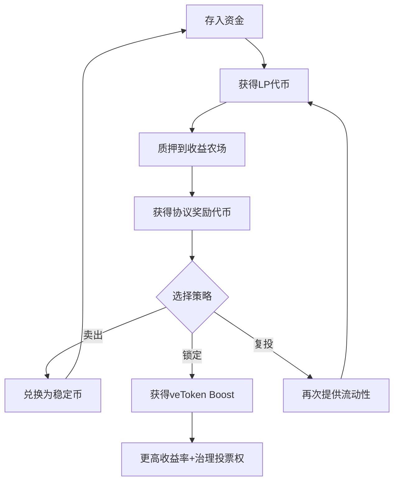
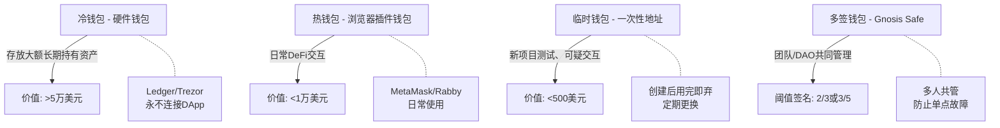

## 十一、Web3进阶操作技巧

掌握了Web3的基础操作后，想要在这个领域获得超额收益、降低系统性风险，需要深入理解进阶操作技巧。本章聚焦四个核心维度：DeFi收益优化、链上数据分析、安全防护体系、Gas费精算优化，帮助你从"能用Web3"进阶到"精通Web3"。

### 11.1 DeFi收益优化策略

DeFi（去中心化金融）的核心价值在于让任何人都能成为"银行"——通过提供流动性来赚取手续费和协议奖励。但简单地存入资金并不等于最优收益，需要系统性地理解收益来源、风险结构和优化策略。

#### 11.1.1 流动性挖矿的完整操作流程

流动性挖矿（Yield Farming）是DeFi收益的核心方式之一。完整操作分为五个阶段：

**第一步：协议筛选**

选择协议不能只看APY（年化收益率），需要综合评估以下指标：

| 评估维度 | 具体指标 | 安全阈值 |
|---------|---------|---------|
| 安全性 | 是否经过审计（CertiK、Trail of Bits、OpenZeppelin） | 至少1家顶级审计 |
| 资金规模 | TVL（总锁仓价值） | >1亿美元相对安全 |
| 运营时间 | 上线时长 | >6个月，经历过市场周期 |
| 团队背景 | 匿名还是实名，过往项目经历 | 实名团队加分 |
| 合约可验证性 | 开源代码、Etherscan验证 | 必须开源 |
| 社区治理 | 是否有DAO治理、提案机制 | 有治理机制加分 |

> **高APY陷阱**：APY超过1000%的池子通常意味着代币通胀严重或项目处于早期补贴阶段。高APY不等于高收益——代币价格下跌可能远超你获得的奖励价值。判断一个高APY池子是否值得参与，关键看"奖励代币是否有真实价值支撑"。

**第二步：资金准备与配对**

流动性池通常需要两种代币按特定比例存入。以Uniswap V2风格的50/50池为例：

- 存入ETH/USDC池，需要准备等值的ETH和USDC
- 假设你有1000美元资金，ETH价格为2000美元，则需要：250美元ETH + 750美元USDC → 不对，正确计算是500美元ETH + 500美元USDC
- 单边存入（Single-sided deposit）协议（如Bancor V3、THORChain）可以只存入一种代币，协议自动完成配对

**实际操作（以Uniswap V3为例）：**

1. 访问 app.uniswap.org，连接钱包
2. 点击"Pool" → "New Position"
3. 选择代币对（如ETH/USDC）
4. 设置价格范围——V3的集中流动性允许你设定价格区间
5. 设定费率等级（0.01%、0.05%、0.3%、1%）
6. 输入金额，确认交易

**第三步：质押LP代币获取额外收益**

获得LP代币后，许多协议提供额外的质押奖励：

- **MasterChef模式**：将LP代币质押到收益农场（如SushiSwap的Onsen），获得SUSHI奖励
- **veToken模式**：锁定治理代币获得投票权和boosted收益（如Curve的veCRV机制）
- **Bribe机制**：通过Votium等平台，项目方贿赂veToken持有者投票给自己的池子



**第四步：复投策略**

复投频率需要平衡收益与Gas成本：

- 资金量<1000美元：每周复投一次
- 资金量1000-10000美元：每天复投一次
- 资金量>10000美元：可以考虑自动化复投（使用Beefy Finance、Yearn Finance等自动复投协议）

自动化复投的工作原理：协议自动将奖励代币卖出 → 换回流动性池所需的两种代币 → 重新添加流动性 → 质押新的LP代币。整个过程在一个交易中完成，节省Gas费。

#### 11.1.2 无常损失的深度理解与管理

无常损失（Impermanent Loss，IL）是流动性提供者面临的最大技术风险。理解其本质才能有效管理。

**无常损失的数学原理：**

当你在AMM（自动做市商）中提供流动性时，你的资产会被自动重新平衡。当价格上涨时，AMM会卖出上涨的资产、买入下跌的资产；反之亦然。这意味着"涨了你少赚，跌了你多亏"。

无常损失的精确公式为：

```text
IL = 2 × √(price_ratio) / (1 + price_ratio) - 1

其中 price_ratio = 新价格 / 初始价格
```

**无常损失速查表：**

| 价格变化幅度 | 无常损失比例 | 是否值得提供流动性 |
|-------------|-------------|-------------------|
| 1.25倍（+25%） | -0.6% | 手续费通常可覆盖 |
| 1.50倍（+50%） | -2.0% | 需要较高手续费收入 |
| 2倍（+100%） | -5.7% | 单纯持有更优（除非手续费>6%） |
| 3倍（+200%） | -13.4% | 流动性提供明显劣于持有 |
| 5倍（+400%） | -25.5% | 严重亏损 |
| 10倍（+900%） | -41.0% | 几乎腰斩 |

> **"无常"的含义**：之所以叫"无常"，是因为如果价格回到初始水平，损失会消失。但现实中，代币价格很少精确回到起点，所以这种损失实际上往往是"永久"的。

**降低无常损失的六种策略：**

**策略一：选择高相关性代币对**

价格走势高度相关的代币对，无常损失天然较低：

- stETH/ETH：几乎1:1锚定，无常损失接近于零
- WBTC/renBTC：同为比特币锚定币
- USDC/DAI：同为美元稳定币，波动极小
- wstETH/WETH：Lido质押ETH对，走势高度一致

**策略二：使用单边流动性协议**

Bancor V3允许只存入单一代币，协议承担无常损失。THORChain的对称性设计也能部分降低IL。

**策略三：集中流动性的精细管理**

Uniswap V3的集中流动性允许你设定价格区间。区间越窄，资本效率越高（手续费收益越高），但超出区间后不再赚取手续费，且无常损失更集中。

实际操作建议：
- 稳定币对：设定±1%的极窄区间
- ETH/USDC：根据近期波动范围设定，通常±15%-30%
- 高波动代币对：设定较宽区间或直接使用V2

**策略四：及时止损**

当价格偏离幅度超过预期时，果断撤出流动性比"等待回调"更明智。无常损失是单调递增的——价格偏离越大，IL越大。

**策略五：利用期权对冲**

在提供流动性的同时，购买看涨期权对冲单边上涨的风险。这需要一定的期权知识和额外成本。

**策略六：选择ve(3,3)模型协议**

Solidly、Aerodrome等ve(3,3)模型协议通过投票激励机制，让流动性提供者获得更高的手续费分成和代币奖励，可以覆盖更多的无常损失。

#### 11.1.3 进阶收益策略

**Delta Neutral策略**

核心思路：同时做多和做空同一资产，消除价格风险，只赚取收益。

具体操作（以ETH为例）：
1. 在Aave存入1000美元USDC作为抵押品
2. 借出500美元等值的ETH
3. 将借出的ETH在永续合约市场做空（1倍杠杆）
4. 同时将USDC存入ETH/USDC流动性池
5. 净效果：无论ETH涨跌，你的净值基本不变，但持续赚取流动性手续费

风险点：借贷利率变化、清算风险、智能合约风险。

**资金费率套利**

永续合约市场存在资金费率（Funding Rate），当市场看多时多头支付空头，看空时空头支付多头。

操作方式：
1. 在Binance等CEX开1倍杠杆空头永续合约
2. 同时在现货市场等量买入
3. 当资金费率为正（市场看多）时，你持续收取资金费率
4. 价格风险被完全对冲，纯赚资金费率

工具推荐：Coinglass查看各交易所的资金费率，选择费率为正且较高的品种。

---

### 11.2 链上分析进阶技巧

链上数据是Web3世界的"公开财报"。每一笔交易、每一次合约交互都记录在链上，任何人都可以分析。掌握链上分析技巧，相当于拥有了传统金融分析师无法获取的信息优势。

#### 11.2.1 聪明钱追踪体系

"聪明钱"（Smart Money）指的是那些有信息优势、技术优势或资金优势的钱包地址。追踪这些地址可以在代币暴涨前发现机会。

**如何识别聪明钱：**

1. **历史收益分析**：在Nansen或Arkham上筛选过去90天收益率Top 100的钱包
2. **早期参与记录**：找到在项目启动初期就参与且获利丰厚的地址
3. **机构钱包**：a16z、Paradigm、Jump Trading等机构的公开钱包地址
4. **KOL钱包**：通过Twitter/Discord找到知名交易者公开分享的地址
5. **内部人钱包**：项目方核心团队的链上地址（通常可以通过早期交易记录推断）

**聪明钱追踪工具对比：**

| 工具 | 核心功能 | 价格 | 适合人群 |
|-----|---------|------|---------|
| Nansen | 钱包标签、Smart Money仪表板、Token God Mode | $150/月起 | 专业交易者、机构 |
| Arkham | 钱包标签、实体追踪、实时警报 | 免费基础版 | 所有用户 |
| DeBank | 多链资产总览、关注列表 | 免费 | 普通用户 |
| Dune Analytics | 自定义SQL查询链上数据 | 免费 | 有SQL能力的分析师 |
| Bubblemaps | 代币持仓分布可视化 | 免费 | 发现内幕交易 |
| Lookonchain | Twitter链上数据播报 | 免费 | 跟踪热点事件 |

**自建监控机器人的方法：**

使用Etherscan API + Python可以自建轻量级监控：

```python
import requests
import time

# 配置
ETHERSCAN_API_KEY = "你的API Key"
TARGET_WALLET = "0x目标地址"
TELEGRAM_BOT_TOKEN = "你的Bot Token"
CHAT_ID = "你的Chat ID"

def get_recent_transactions(address, last_block=0):
    url = f"https://api.etherscan.io/api"
    params = {
        "module": "account",
        "action": "txlist",
        "address": address,
        "startblock": last_block,
        "endblock": 99999999,
        "sort": "desc",
        "apikey": ETHERSCAN_API_KEY
    }
    resp = requests.get(url, params=params).json()
    return resp.get("result", [])

def send_telegram_alert(message):
    url = f"https://api.telegram.org/bot{TELEGRAM_BOT_TOKEN}/sendMessage"
    requests.post(url, json={"chat_id": CHAT_ID, "text": message})

# 监控循环
last_block = 0
while True:
    txs = get_recent_transactions(TARGET_WALLET, last_block)
    for tx in txs[:5]:  # 处理最近5笔
        if int(tx["blockNumber"]) > last_block:
            last_block = int(tx["blockNumber"])
            if int(tx["value"]) > 0:  # 只关注有ETH转入的交易
                msg = f"🔔 目标钱包有新交易\n"
                msg += f"Hash: {tx['hash'][:16]}...\n"
                msg += f"Value: {int(tx['value'])/1e18:.4f} ETH\n"
                msg += f"To: {tx['to'][:16]}..."
                send_telegram_alert(msg)
    time.sleep(30)  # 每30秒检查一次
```

**追踪策略与纪律：**

- **不要盲目跟单**：聪明钱的操作可能是对冲的一部分，单纯模仿单边操作会踩坑
- **关注首次买入**：聪明钱在某个代币上的首次买入信号远比追涨更有价值
- **验证买入逻辑**：看到聪明钱买入后，先去查该项目是否有即将到来的催化剂（空投、合作、升级）
- **设置时间窗口**：只关注最近24小时的操作，过时的信息价值锐减
- **分散跟单**：同时追踪5-10个聪明钱，只在多个地址同时买入时才重点关注

#### 11.2.2 链上数据指标体系

掌握关键的链上指标，可以帮助你判断市场状态和项目健康度：

**比特币链上指标：**

| 指标 | 含义 | 信号 |
|-----|------|------|
| MVRV比率 | 市值/已实现市值 | >3.5过热，<1低估 |
| SOPR | 花费输出利润率 | >1持有者盈利，<1亏损 |
| 交易所净流入 | 流入交易所的BTC数量 | 大量流入=可能抛售 |
| 长期持有者持仓 | 持有>155天的BTC | 减少=分布阶段 |
| 矿工收入 | 矿工的BTC收入 | 下降=可能投降 |
| 活跃地址数 | 每日活跃地址 | 增加=网络使用率上升 |

工具：Glassnode、CryptoQuant、IntoTheBlock提供这些指标的可视化图表。

**以太坊DeFi指标：**

- **TVL变化趋势**：总锁仓价值的增减反映DeFi整体热度
- **DEX交易量**：链上交易量反映真实活动（对比CEX交易量可发现刷量）
- **Gas费趋势**：Gas持续升高说明链上活动活跃
- **稳定币供应量**：USDT/USDC链上供应增加 = 新资金入场
- **借贷协议存款/借款比**：反映市场杠杆水平

#### 11.2.3 代币持仓分析

在投资一个代币之前，分析其持仓分布是必做的功课：

**持仓集中度分析：**

1. 在Etherscan上查看代币的Top Holders
2. 如果前10个地址持有>50%的代币，风险极高
3. 排除已知的合约地址（DEX池子、质押合约、多签钱包）
4. 检查是否有地址之间存在关联（通过Bubblemaps可视化）

**解锁时间表分析：**

项目方、团队、投资者的代币通常有锁定期（Vesting）。使用Token Unlocks查看未来解锁计划：

- 大额解锁前1-2周，代币价格通常承压
- 解锁后的抛压取决于持有者的成本和信心
- 如果解锁量>日均交易量的20%，需要高度警惕

---

### 11.3 Web3安全防护体系

Web3的安全事故频发，从个人钱包被盗到协议被黑，损失动辄百万甚至上亿美元。建立系统化的安全防护体系不是可选项，而是生存必需。

#### 11.3.1 交易前安全检查清单

每一笔链上交易之前，都应该执行以下检查：

**合约验证：**
- 在Etherscan/BscScan上确认合约已验证（源代码可读）
- 检查合约是否经过审计，审计报告是否公开
- 使用Token Sniffer或GoPlus检查代币合约是否有恶意代码
- 验证代币合约地址来自官方渠道（官网、官方Twitter、CoinGecko）

**代币安全检查：**

| 检查项 | 安全 | 危险信号 |
|-------|------|---------|
| 合约是否开源 | 源代码在Etherscan可读 | 未验证的合约 |
| 是否有蜜罐机制 | 正常买卖 | 只能买不能卖 |
| 所有权是否放弃 | Owner地址已renounce | Owner可随时修改合约 |
| 黑名单功能 | 无黑名单 | 可以封禁特定地址交易 |
| 税率 | 买卖税<10% | 买卖税>10% |
| 铸造功能 | 无额外铸造 | Owner可无限增发 |
| 流动性锁定 | LP已锁定 | LP未锁定可随时撤走 |

**操作安全：**
- 确认滑点设置合理（稳定币0.1%-0.5%，高波动代币3%-10%）
- 首次交易新代币时先小额测试
- 检查交易的Data字段是否包含异常操作
- 使用Revoke.cash检查并管理代币授权

#### 11.3.2 钱包分层安全架构

不同用途的资产应该放在不同层级的钱包中：



**各层钱包的操作规范：**

**冷钱包（Cold Wallet）：**
- 使用Ledger或Trezor硬件钱包
- 助记词手写在金属板上，存放在物理安全位置（保险柜）
- 绝不连接任何DApp，只做转账操作
- 交易时通过硬件设备物理确认每一笔操作
- 建议使用Passphrase（第25个词）增加额外安全层

**热钱包（Hot Wallet）：**
- 使用MetaMask、Rabbi Wallet或Frame
- 每次连接DApp后检查授权范围
- 使用Revoke.cash定期清理不必要的授权
- 安装Pocket Universe或Fire等浏览器扩展，在签名前预览交易结果
- 不保存助记词在任何数字设备上（包括截图、备忘录、云盘）

**临时钱包（Burner Wallet）：**
- 用于参与新项目、可疑空投、测试网活动
- 使用后如有余额及时转出
- 定期更换新地址
- 不与主钱包产生关联（避免从主钱包直接转账，使用CEX中转）

#### 11.3.3 常见骗局深度解析与防御

**骗局一：假空投（Airdrop Phishing）**

运作方式：
1. 骗子向大量地址空投价值不菲的"代币"
2. 受害者看到钱包中出现有价值的代币
3. 尝试在去中心化交易所卖出时，会跳转到钓鱼网站
4. 钓鱼网站要求"连接钱包并授权"，实际上是授权骗子转移你的资产

防御方法：
- 不认识的代币绝不要尝试卖出
- 直接在Etherscan上将可疑代币加入隐藏列表
- 使用Rabby Wallet的"交易预览"功能，查看授权的具体内容

**骗局二：假客服/假项目方**

运作方式：
1. 在Discord/Twitter上冒充项目客服
2. 以"解决问题"、"领取空投"等名义发送链接
3. 链接指向仿冒网站，要求输入助记词或连接钱包签名恶意交易

防御方法：
- 任何主动私信你的"客服"都是骗子
- 项目方的官方链接只从官网获取
- 助记词和私钥任何时候都不应该输入到任何网站

**骗局三：钓鱼签名（Permit Phishing）**

运作方式：
1. 骗子构建一个看似无害的页面
2. 页面诱导你签署ERC-20 Permit（离线授权）
3. Permit签名不需要Gas费，看起来很安全
4. 但签名后骗子获得了转移你代币的权限

防御方法：
- 使用硬件钱包，在签名前仔细阅读签名内容
- 安装Scam Sniffer浏览器扩展
- 拒绝任何要求签署"Permit"、"SetApprovalForAll"的可疑请求

**骗局四：Rug Pull（拉地毯）**

运作方式：
1. 项目方创建代币并在DEX上添加流动性
2. 通过营销制造FOMO情绪
3. 大量投资者买入推高价格
4. 项目方撤走流动性池中的所有资金
5. 代币瞬间归零

识别信号：
- 团队匿名且无过往项目经历
- 流动性未锁定或锁定时间很短（<6个月）
- 社区以喊单为主，缺乏技术讨论
- 代币持仓极度集中，前几个地址持有大部分供应
- 合约有mint（铸造）功能且Owner未放弃

**骗局五：貔貅盘（Honeypot）**

运作方式：
1. 代币合约内嵌黑名单或特殊限制
2. 只允许特定地址（庄家）卖出
3. 普通用户买入后发现无法卖出
4. 庄家持续卖出套现

检测方法：
- 使用Token Sniffer、Honeypot.is检测合约
- 在买入前先小额测试是否能正常卖出
- 检查代币在DEX上的卖出交易记录是否正常

#### 11.3.4 授权管理最佳实践

智能合约授权（Approval）是Web3安全中最容易被忽视的风险点。当你授权一个DApp使用你的代币时，如果授权金额是"Unlimited"（无限），那么该DApp（或其合约被攻击后）可以随时转走你的全部代币。

**授权管理操作流程：**

1. 访问 [revoke.cash](https://revoke.cash) 或 [app.unrekt.net](https://app.unrekt.net)
2. 连接钱包，查看所有已授权的合约
3. 对于不再使用的DApp，立即撤销授权
4. 对于仍在使用的DApp，将授权金额改为实际需要的数额
5. 每月定期检查一次授权列表

**授权类型对比：**

| 授权方式 | Gas成本 | 安全性 | 推荐场景 |
|---------|---------|-------|---------|
| Unlimited Approval | 一次Gas | 极低 | 不推荐 |
| Exact Amount Approval | 一次Gas/次 | 高 | 每次交易授权精确金额 |
| Permit (EIP-2612) | 零Gas | 中 | 需确认签名内容 |
| Permit2 (Uniswap) | 一次Gas | 高 | 统一授权管理 |

---

### 11.4 Gas费优化策略

Gas费是链上操作的"过路费"，优化Gas费可以显著降低操作成本。对于高频交易者或DeFi深度用户，Gas费优化每年可以节省数千甚至数万美元。

#### 11.4.1 Gas费的底层机制

Gas费的计算公式：

```text
交易Gas费 = Gas单位消耗 × Gas Price（Gwei）

EIP-1559后的Gas费 = Gas单位 × (Base Fee + Priority Fee)
```

- **Gas单位**：由操作的复杂度决定（ETH转账21,000，Uniswap交换约150,000）
- **Base Fee**：由网络拥堵程度动态调整，被销毁（burn）
- **Priority Fee（Tip）**：给矿工/验证者的小费，决定交易被打包的优先级

> **EIP-1559的影响**：2021年8月以太坊升级后，Base Fee被销毁而非给矿工。这意味着在网络繁忙时，ETH实际上是通缩的——销毁量大于新增发行量。

#### 11.4.2 实战Gas优化技巧

**技巧一：选择最佳交易时间**

以太坊网络的拥堵程度呈现明显的周期性规律：

| 时间段（UTC） | 北京时间 | 网络状态 | Gas水平 |
|-------------|---------|---------|--------|
| 02:00-06:00 | 10:00-14:00 | 美洲深夜 | 最低 |
| 06:00-10:00 | 14:00-18:00 | 欧洲上班 | 中等 |
| 14:00-18:00 | 22:00-02:00 | 美洲上班 | 最高 |
| 周六日全天 | — | 全球活动减少 | 较低 |

工具推荐：
- [Etherscan Gas Tracker](https://etherscan.io/gastracker)：实时Gas价格
- [Blocknative Gas Estimator](https://www.blocknative.com/gas-estimator)：预测未来Gas走势
- [ultrasound.money](https://ultrasound.money)：查看ETH销毁量和网络活动

**技巧二：合理设置Gas参数**

使用MetaMask时，点击"编辑"Gas可以自定义：

- **Low（慢速）**：Base Fee + 0.1 Gwei Tip，适合不着急的交易
- **Market（标准）**：Base Fee + 1.5 Gwei Tip，大多数场景
- **Aggressive（快速）**：Base Fee + 3 Gwei Tip，抢购/NFT铸造时使用
- **自定义**：根据Etherscan Gas Tracker手动设置

> **避免设置过高的Gas Limit**：Gas Limit是你愿意为这笔交易支付的最大Gas单位数。实际消耗通常低于Limit，未消耗的部分会退还。但设置过低会导致交易失败（Gas仍被消耗）。对于Uniswap交换，建议设置200,000的Gas Limit。

**技巧三：使用Layer 2网络**

Layer 2是以太坊的扩容方案，将计算和存储移到链下处理，大幅降低Gas费：

| L2网络 | 类型 | 平均交易费 | TVL | 适合场景 |
|-------|------|----------|-----|---------|
| Arbitrum | Optimistic Rollup | $0.1-0.5 | 最大 | DeFi全生态 |
| Optimism | Optimistic Rollup | $0.1-0.5 | 大 | DeFi + OP激励 |
| Base | Optimistic Rollup | $0.01-0.1 | 增长快 | 社交 + NFT |
| zkSync Era | ZK Rollup | $0.1-0.3 | 中 | 隐私 + DeFi |
| StarkNet | ZK Rollup | $0.1-0.5 | 中 | 复杂计算 |
| Polygon PoS | 侧链 | $0.01 | 大 | 低费用全场景 |

从主网迁移到L2的操作：
1. 使用官方桥（如 Arbitrum Bridge）将ETH从主网桥接到L2
2. 或使用跨链聚合器（如 Jumper.exchange、Bungee）找到最优桥接路径
3. 在L2上进行日常DeFi操作
4. 需要时再桥接回主网

**技巧四：批量操作与合约优化**

将多个操作合并为一笔交易可以节省Gas：

- 使用Safe（Gnosis Safe）的批量交易功能
- 使用Furucombo等DeFi组合工具，将多个DeFi操作组合成一笔交易
- 使用1inch等聚合器的限价单功能，避免重复交换操作

**技巧五：Gas代付（Sponsored Gas）**

部分协议和钱包支持Gas代付：

- **Gas Station Network（GSN）**：DApp为用户支付Gas费
- **Account Abstraction（ERC-4337）**：允许使用任意代币支付Gas
- **Biconomy**：为DApp提供Gas代付SDK
- **部分L2的免费提现**：如Base、zkSync提供免费的L2→L1消息传递

#### 11.4.3 不同操作的Gas成本参考

以太坊主网常见操作的Gas消耗和费用（以Gas Price=20 Gwei、ETH=$3000为基准）：

| 操作 | Gas单位 | 费用(USD) | L2费用 |
|-----|--------|----------|-------|
| ETH转账 | 21,000 | $1.26 | <$0.01 |
| ERC-20代币转账 | 65,000 | $3.90 | $0.01-0.05 |
| Uniswap V3交换 | 150,000 | $9.00 | $0.05-0.30 |
| NFT铸造（标准） | 100,000-150,000 | $6-9 | $0.05-0.20 |
| NFT铸造（复杂） | 200,000-300,000 | $12-18 | $0.10-0.50 |
| Aave存入 | 200,000 | $12.00 | $0.10-0.30 |
| Aave借款+存入 | 350,000 | $21.00 | $0.20-0.50 |
| 智能合约部署 | 1,000,000+ | $60+ | $1-5 |
| 多签交易执行 | 100,000-200,000 | $6-12 | $0.05-0.30 |

> **L2的成本优势**：同样一笔Uniswap交换，主网花费9美元，L2只需0.05-0.30美元，节省95%以上。对于频繁交易的用户，长期积累的Gas节省非常可观。

#### 11.4.4 Gas费追踪与预算工具

**实时监控：**
- Etherscan Gas Tracker：web端查看当前Gas价格
- Blocknative Gas Estimator Chrome扩展：浏览器实时显示
- TG Bot：@ethgasrobot 等机器人，可设置Gas价格提醒

**历史分析：**
- Dune Analytics上的Gas分析Dashboard
- Nansen的Gas消耗热力图

**预算规划：**
- 对于月度DeFi操作预算，建议按照"当前Gas Price × 操作次数 × 平均Gas单位"来估算
- 在Gas Price低于10 Gwei时批量执行非紧急操作
- 设定Gas Price提醒（如低于8 Gwei时通知），在低Gas时集中操作

---

### 11.5 MEV与交易保护

MEV（Maximal Extractable Value，最大可提取价值）是Web3进阶用户必须了解的概念——它直接关系到你的交易是否会被"夹"。

#### 11.5.1 什么是MEV

MEV是指区块生产者（验证者）通过重新排序、插入或审查交易来提取的额外利润。最常见的MEV形式：

**三明治攻击（Sandwich Attack）：**
1. 你在Uniswap上提交一笔大额买入交易
2. MEV机器人看到你的交易在内存池中等待确认
3. 机器人在你之前买入（Front-run），推高价格
4. 你的交易以更高价格成交
5. 机器人在你之后卖出（Back-run），赚取差价
6. 你实际获得了更少的代币——这就是被"夹"了

**其他MEV形式：**
- **清算套利**：监控借贷协议，当抵押品不足时第一个清算
- **套利**：在不同DEX之间利用价格差异套利
- **时间强盗攻击**：重组区块以获取之前的MEV机会

#### 11.5.2 保护交易免受MEV攻击

**方法一：使用Flashbots Protect**

Flashbots Protect将你的交易直接发送给验证者，绕过公共内存池：

- 在MetaMask中配置自定义RPC：`https://rpc.flashbots.net`
- 或使用Flashbots Protect网站提交交易
- 交易不会出现在公共内存池中，MEV机器人无法看到
- 如果交易被包含则正常执行，如果没有则不会消耗Gas

**方法二：使用MEV保护钱包**

- **Rabby Wallet**：内置MEV保护，自动路由交易
- **MEV Blocker**：由CoW Protocol提供，免费MEV保护

**方法三：使用聚合器**

- **CoW Swap**：批量拍卖机制，天然抗MEV
- **1inch Fusion**：使用专业求解器（Solver）执行交易
- **ParaSwap**：提供MEV保护模式

**方法四：设置合理滑点**

滑点设置过高是被三明治攻击的主要原因之一：

- 稳定币互换：0.1%-0.3%
- 主流代币交换：0.5%-1%
- 高波动小币：3%-5%
- 新代币/低流动性：5%-10%（但仍需谨慎）

---

### 11.6 多链操作与跨链策略

Web3已经进入多链时代。以太坊、Solana、BNB Chain、Polygon、Arbitrum等链各有生态，跨链操作是进阶用户的基本功。

#### 11.6.1 跨链桥选择指南

| 桥 | 支持链 | 速度 | 费用 | 安全等级 |
|---|-------|------|------|---------|
| 官方桥（Arbitrum Bridge） | ETH↔Arbitrum | 7天（提现） | 仅Gas | 最高 |
| Stargate | 多链 | 1-5分钟 | 0.06% | 高 |
| Across Protocol | 多链 | 1-5分钟 | 0.06-0.12% | 高 |
| LayerZero（Stargate底层） | 全链 | 1-5分钟 | 变动 | 高 |
| Wormhole | 多链 | 15分钟 | 仅Gas | 中（曾被黑） |
| deBridge | 多链 | 1-3分钟 | 0.1% | 高 |
| Jumper.exchange | 聚合器 | 变动 | 变动 | 聚合多桥 |

**跨链操作安全注意事项：**

1. **小额测试**：第一次使用新桥时，先用小额资金测试完整流程
2. **验证官方链接**：跨链桥是钓鱼重灾区，只从官方渠道获取链接
3. **查看审计状态**：跨链桥锁定了大量资金，是黑客的首要目标
4. **避免高峰期**：网络拥堵时跨链可能卡住，需要等待更长时间
5. **保留Gas费**：到达目标链后需要Gas费进行操作，记得在目标链保留少量原生代币

#### 11.6.2 多链资产管理

管理多链资产的核心工具：

- **DeBank**：一站式查看所有链上资产、DeFi仓位和NFT
- **Zapper**：类似DeBank，支持更多的DeFi协议解析
- **Rabby Wallet**：自动检测所有链上的资产，切换链时无需手动配置
- **Rotki**：开源的资产追踪工具，支持本地部署

---

### 11.7 进阶操作检查清单

将本章内容总结为可执行的检查清单：

**每月执行：**
- [ ] 检查并撤销不必要的代币授权（revoke.cash）
- [ ] 审视DeFi仓位的收益率，是否需要调整策略
- [ ] 检查代币解锁计划，评估持仓风险
- [ ] 更新钱包安全设置

**每周执行：**
- [ ] 关注聪明钱动向（Arkham/Nansen仪表板）
- [ ] 复投DeFi收益
- [ ] 检查L2桥接的Gas成本，选择最优路径
- [ ] 查看监控的协议是否有安全事件

**每次交易前：**
- [ ] 验证合约地址来自官方渠道
- [ ] 使用Token Sniffer检查代币安全性
- [ ] 设置合理的滑点
- [ ] 确认有足够的Gas费
- [ ] 大额交易使用Flashbots Protect
- [ ] 首次交互新协议先小额测试

**持续学习：**
- [ ] 关注安全审计公司的漏洞披露（CertiK、PeckShield的Twitter）
- [ ] 学习新协议的机制（阅读白皮书/文档而非仅看KOL推荐）
- [ ] 参与治理讨论，了解协议发展方向
- [ ] 跟踪行业重大事件（监管政策、技术升级、安全事件）

---

### 11.8 本节要点回顾

| 进阶领域 | 核心要点 | 行动建议 |
|---------|---------|---------|
| DeFi收益优化 | 理解收益来源（手续费+代币奖励+锁仓收益），管理无常损失 | 从稳定币对开始，逐步尝试Delta Neutral策略 |
| 链上分析 | 追踪聪明钱、分析持仓分布、监控链上指标 | 使用Arkham免费版开始，建立自己的监控体系 |
| 安全防护 | 钱包分层、授权管理、骗局识别 | 立即检查并撤销不必要的授权，配置硬件钱包 |
| Gas优化 | 选择低峰时间、使用L2、合理设置Gas参数 | 将日常操作迁移到L2，节省90%+Gas费 |
| MEV保护 | 理解三明治攻击，使用Flashbots/聚合器 | 配置Flashbots Protect RPC，使用CoW Swap |
| 跨链操作 | 选择安全的跨链桥，多链资产管理 | 使用DeBank统一管理多链资产 |

Web3进阶操作的核心理念是：**在追求收益的同时，永远把风险管理放在第一位。** 不理解的风险就不参与，不确定的合约就不交互，不验证的链接就不点击。在这个领域，存活下来比短期暴富更重要。
