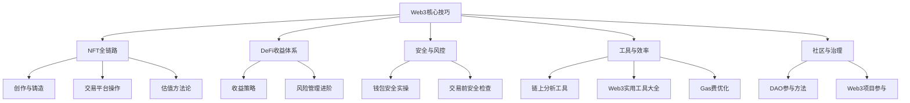
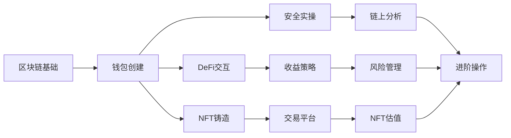
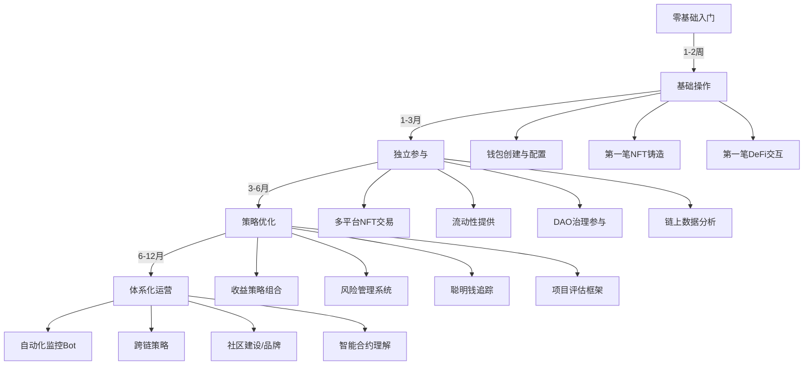

## 核心技巧小结

本节覆盖了Web3参与的核心技能体系——从NFT创作铸造到DeFi收益策略，从钱包安全防护到链上分析工具，从DAO治理参与到进阶操作技巧。这11个子节构成了一条完整的Web3能力成长路径。下面按主题维度重新梳理，帮助你建立全局视图并查漏补缺。

***

### 一、核心知识体系总览

#### 1.1 知识架构全景图



#### 1.2 各节核心要点速查

| 子节 | 核心主题 | 一句话总结 | 关键能力 |
|------|----------|-----------|----------|
| 一、NFT创作与铸造 | 从零到链上 | 理解ERC-721/1155标准，掌握IPFS存储和元数据规范，完成铸造全流程 | 创作工具选型、元数据编写、平台选择 |
| 二、NFT交易平台操作 | 买卖与策略 | 在OpenSea/Blur等平台上完成购买、挂单、竞价，理解地板价和稀有度 | 平台对比选择、交易执行、版税机制 |
| 三、DAO参与方法 | 去中心化治理 | 识别DAO类型，通过持有代币/贡献能力参与治理，获取社区收益 | 治理投票、提案提交、贡献证明 |
| 四、DeFi收益策略 | 链上收益来源 | 掌握Staking、LP、Yield Farming、借贷四种收益模式及其风险收益比 | 协议选择、收益计算、组合策略 |
| 五、Web3项目参与 | 项目识别与空投 | 用结构化框架评估项目质量，系统性参与空投获取早期代币 | 项目尽调、空投策略、风险识别 |
| 六、链上分析工具 | 数据驱动决策 | 使用Etherscan/Dune/Nansen等工具追踪资金流向、分析链上行为 | SQL查询、钱包追踪、数据解读 |
| 七、钱包安全实操 | 资产安全防线 | 助记词管理、硬件钱包配置、授权审计、钓鱼防范的完整安全体系 | 安全习惯养成、应急响应 |
| 八、NFT估值方法论 | 价值判断框架 | 结合稀有度、社区、流动性、历史成交等维度评估NFT合理价格 | 多维度估值、数据对比、趋势判断 |
| 九、DeFi风险管理进阶 | 风控系统化 | 智能合约风险、无常损失、清算风险的量化评估与对冲策略 | 风险识别、仓位管理、止损策略 |
| 十、Web3实用工具大全 | 效率工具箱 | 一站式工具清单覆盖钱包、分析、DeFi、NFT、安全各维度 | 工具选型、工作流搭建 |
| 十一、Web3进阶操作技巧 | 高阶玩家手册 | 流动性挖矿优化、聪明钱追踪、安全检查清单、Gas费优化策略 | 策略组合、成本控制、风险防护 |

***

### 二、关键能力矩阵

#### 2.1 按难度分级的能力要求

Web3参与不是一步到位的，不同阶段需要不同的能力组合。以下按入门→进阶→高阶三个层级梳理：

**入门级（第1-2周）：**

- 创建并配置MetaMask钱包，完成助记词备份
- 在Polygon测试网上完成第一笔NFT铸造
- 在OpenSea上架并浏览NFT市场
- 理解Gas费机制，学会使用Gas Tracker
- 在DeFiLlama上查看协议TVL数据

**进阶级（第1-3月）：**

- 使用Manifold部署自己的NFT智能合约
- 在Uniswap上完成首次代币交换和流动性提供
- 使用Dune Analytics编写基础SQL查询链上数据
- 参与至少一个DAO的治理投票
- 建立多钱包体系（热钱包交易 + 冷钱包存储）
- 使用Revoke.cash定期审计合约授权

**高阶级（第3-6月）：**

- 设计并实施DeFi收益组合策略（Staking + LP + Farming）
- 使用Nansen/Arkham追踪聪明钱钱包并建立监控Bot
- 评估智能合约安全性，阅读审计报告
- 参与项目测试网并系统性获取空投
- 理解并管理无常损失，使用期权或对冲策略降低风险

#### 2.2 知识节点依赖关系



每个节点都是后续节点的前置条件。跳过钱包安全直接做DeFi交互，等于不系安全带上高速——短期可能没事，出事就是不可逆的资产损失。

***

### 三、核心方法论回顾

#### 3.1 NFT价值判断三维度

NFT的价值不是"好看不好看"这么简单，需要从三个维度交叉验证：

| 维度 | 评估要素 | 数据来源 | 权重 |
|------|----------|----------|------|
| **基本面** | 创作者影响力、项目团队背景、技术实现质量 | Twitter粉丝/互动率、团队LinkedIn、合约代码 | 40% |
| **社区面** | Discord活跃度、持有者分布、文化认同强度 | Discord在线人数、鲸鱼持仓占比、Meme传播力 | 35% |
| **市场面** | 地板价趋势、交易量/市值比、流动性深度 | OpenSea/Blur数据、NFTGo、Dune Dashboard | 25% |

**实操要点**：三个维度必须同时满足最低标准。社区活跃但团队匿名的项目（基本面缺失），或地板价高但持有者高度集中的项目（市场面风险），都不应重仓参与。

#### 3.2 DeFi收益风险评估框架

每种DeFi收益策略都需要回答四个问题：

1. **收益从哪来？** ——是交易手续费、代币补贴、还是借贷利息？补贴类收益（如流动性挖矿奖励）通常不可持续，代币价格下跌时收益率会暴跌。
2. **最坏情况是什么？** ——智能合约被黑、代币归零、清算触发的具体条件是什么？用历史事件验证：2022年Terra/Luna崩盘、FTX暴雷、Euler Finance被黑。
3. **我能否承受这个最坏情况？** ——投入资金是否超过了你能承受的损失上限？Web3投资的铁律：只投入你愿意归零的资金。
4. **有没有对冲手段？** ——能否通过反向仓位、保险协议（Nexus Mutual）、或多链分散来降低风险？

#### 3.3 安全操作的"零信任"原则

Web3世界没有"客服"，没有"撤销交易"，没有"找回密码"。安全操作的核心原则是**零信任**：

- **不信任任何链接**：即使来自"官方"Discord的消息也要验证合约地址
- **不信任任何私信**：所有主动联系你的"客服""管理员""空投发放者"都是骗子
- **不信任任何"免费"**：免费空投要求授权 = 钓鱼，免费铸造要求签名 = 钱包劫持
- **不信任任何"稳赚"**：年化超过50%的"稳定"收益要么是短期补贴，要么是庞氏骗局
- **不信任任何单一防线**：硬件钱包 + 多钱包隔离 + 定期授权审计 + 交易前复核，层层叠加

***

### 四、工具链推荐清单

#### 4.1 按场景分类的工具速查表

| 场景 | 推荐工具 | 用途 | 费用 |
|------|----------|------|------|
| **钱包管理** | MetaMask、Rainbow、Phantom | 日常交易、DApp交互 | 免费 |
| **资产存储** | Ledger Nano X、Trezor Model T | 大额资产冷存储 | $79-$280 |
| **NFT铸造** | Manifold、OpenSea Studio、Zora | 创建和发行NFT | 平台费0-2.5% |
| **NFT交易** | Blur（速度）、OpenSea（全面）、Magic Eden（Solana） | 买卖NFT | 0-2.5% |
| **DeFi交互** | Uniswap、Aave、Lido | 交换、借贷、质押 | Gas费 |
| **链上分析** | Etherscan、Dune Analytics、Nansen | 交易查询、数据看板、聪明钱追踪 | 免费-$150/月 |
| **安全审计** | Revoke.cash、De.Fi Scanner、Token Sniffer | 授权检查、合约安全检测 | 免费 |
| **Gas优化** | Etherscan Gas Tracker、Blocknative、L2网络 | 监控Gas费、选择低费时段/网络 | 免费 |
| **跨链桥** | Across、Stargate、官方桥 | 资产跨链转移 | 0.01%-0.3% |
| **投资组合** | DeBank、Zapper、Zerion | 多链资产总览 | 免费 |

#### 4.2 新手推荐起步配置

如果预算有限，以下是最低成本的起步方案：

```text
钱包：MetaMask（免费）+ Ledger Nano S Plus（$79）
分析：Etherscan（免费）+ DeFiLlama（免费）+ DeBank（免费）
铸造：OpenSea Lazy Minting（零Gas费）
交易：Polygon网络（Gas <$0.01）
安全：Revoke.cash（免费）定期检查
总启动成本：< $100（含硬件钱包）
```

***

### 五、常见误区与纠正

#### 5.1 认知误区

| 误区 | 正确认知 | 为什么重要 |
|------|----------|-----------|
| "NFT就是一张图片" | NFT是链上所有权凭证，图片只是元数据指向的内容 | 理解本质才能判断价值，否则会买入毫无内在价值的JPG |
| "DeFi稳赚不赔" | DeFi收益来源于真实经济活动（手续费、利息），高收益必然伴随高风险 | 盲目追求高APY是Web3亏损的第一大原因 |
| "空投就是免费钱" | 空投需要时间成本、Gas费成本，且大部分项目不会发币或代币归零 | 为了"撸空投"向不明合约授权大额资产是最快亏钱方式 |
| "代码即法律所以安全" | 智能合约可能有漏洞，审计不能保证100%安全，历史上多次发生审计过的合约被黑事件 | 过度信任代码会导致忽视基本风控 |
| "去中心化=没有风险" | 去中心化降低了单点故障风险，但引入了新的风险维度（合约风险、预言机风险、治理攻击） | 风险类型变了，不是消失了 |

#### 5.2 操作误区

| 误区 | 正确做法 | 后果 |
|------|----------|------|
| 助记词拍照存手机 | 手写在纸上，存放在物理安全位置（保险箱） | 手机被黑 = 资产清零 |
| 一个钱包做所有事 | 至少分三层：热钱包（日常交易）、交互钱包（DApp授权）、冷钱包（长期存储） | 单点被攻破导致全部资产丢失 |
| 不看合约就授权 | 每次授权前检查合约地址、授权额度，使用后及时撤销 | 恶意合约可随时转走你的资产 |
| 追涨杀跌NFT | 建立估值框架，按策略执行买卖，不被FOMO情绪驱动 | 高位接盘、低位割肉，反复亏损 |
| 把所有资金放进一个协议 | 分散到2-3个经过审计的协议，单协议投入不超过总资产30% | 协议被黑导致全部损失 |

***

### 六、收入预期与路径规划

#### 6.1 Web3参与的收入模型

Web3变现不是只有一种方式，以下是经过验证的收入路径：

| 路径 | 预期月收入 | 启动周期 | 技能门槛 | 风险等级 |
|------|-----------|----------|----------|----------|
| NFT创作销售 | ¥0-50,000+ | 1-3月 | 创作能力 + 营销 | 中 |
| DeFi收益（保守） | ¥500-5,000 | 1-2周 | 基础操作 | 低-中 |
| DeFi收益（激进） | ¥5,000-50,000+ | 1-3月 | 策略分析 + 风控 | 高 |
| 空投获取 | 不确定（单次$100-$10,000+） | 3-6月 | 项目研究 + 耐心 | 中 |
| DAO贡献 | ¥1,000-20,000 | 1-3月 | 社区贡献能力 | 低 |
| Web3开发/咨询 | ¥10,000-100,000+ | 6-12月 | 编程/专业能力 | 低 |
| 链上数据分析 | ¥5,000-30,000 | 3-6月 | SQL + 数据分析 | 低 |

**关键认知**：Web3收入的方差极大。同一策略在牛市和熊市的回报可能相差10倍以上。不要用牛市的收入预期规划长期路径，也不要在熊市放弃已经验证有效的方法论。

#### 6.2 能力成长路线图



***

### 七、风险控制清单

#### 7.1 入场前必检项

在投入真金白银之前，逐项确认：

- [ ] **资金隔离**：Web3投入资金不超过总资产的10-20%，且是"归零也不影响生活"的钱
- [ ] **钱包安全**：助记词已离线备份，硬件钱包已配置，热钱包/冷钱包已分离
- [ ] **知识储备**：已理解目标操作的底层机制（不是"别人说能赚"就跟）
- [ ] **平台验证**：目标协议已确认官网地址、合约地址、审计报告
- [ ] **止损策略**：已设定明确的止损条件和退出标准
- [ ] **税务规划**：了解当地对加密资产收益的税务要求

#### 7.2 操作中持续监控

| 监控项 | 频率 | 工具 | 触发行动 |
|--------|------|------|----------|
| 合约授权检查 | 每周 | Revoke.cash | 撤销不再使用的授权 |
| 协议TVL变化 | 每日 | DeFiLlama | TVL暴跌30%+时评估是否撤出 |
| 持仓盈亏 | 每日 | DeBank/Zapper | 触达止损线时执行退出 |
| Gas费趋势 | 交易前 | Etherscan Gas Tracker | 选择低费时段执行非紧急操作 |
| 安全警报 | 实时 | Twitter/Discord安全频道 | 发现协议被黑时第一时间撤资 |
| 钱包余额异常 | 实时 | 钱包通知/Blocknative | 发现未授权交易立即转移剩余资产 |

***

### 八、下一步行动建议

根据你当前的阶段，选择对应的下一步行动：

**如果你还没有Web3钱包：**
1. 安装MetaMask浏览器插件
2. 创建新钱包，手写助记词并存放在安全位置
3. 在Polygon测试网上领取测试代币并完成第一笔转账

**如果你已有钱包但没做过DeFi：**
1. 在Etherscan上学习读取交易记录和合约信息
2. 用小额资金（$10-20）在Polygon上使用QuickSwap完成一次代币交换
3. 在Aave上存入一小笔稳定币，体验借贷协议的存取流程

**如果你已参与DeFi但想进阶：**
1. 学习使用Dune Analytics编写基础查询，分析你参与的协议数据
2. 建立多钱包体系，将大额资产迁移到硬件钱包
3. 使用Nansen或Arkham追踪2-3个你感兴趣的"聪明钱"钱包
4. 设定系统化的收益策略，包含入场条件、仓位管理、退出规则

**如果你是创作者想进入NFT领域：**
1. 选择一个你擅长的创作方向（绘画/音乐/生成艺术）
2. 在Polygon上用OpenSea Lazy Minting铸造你的第一个NFT
3. 加入目标社区（Discord/Twitter），建立创作者网络
4. 学习本节第一小节的元数据标准和IPFS存储，为后续自定义合约做准备

***

> **核心提醒**：Web3是一个快速迭代的领域，工具在更新、协议在演进、风险在变化。本节提供的是方法论框架和思维模型，而非一成不变的操作手册。保持每周关注行业动态（推荐Bankless、The Defiant、吴说区块链），定期回顾和更新你的策略体系，才是长期在Web3生态中获益的根本。
