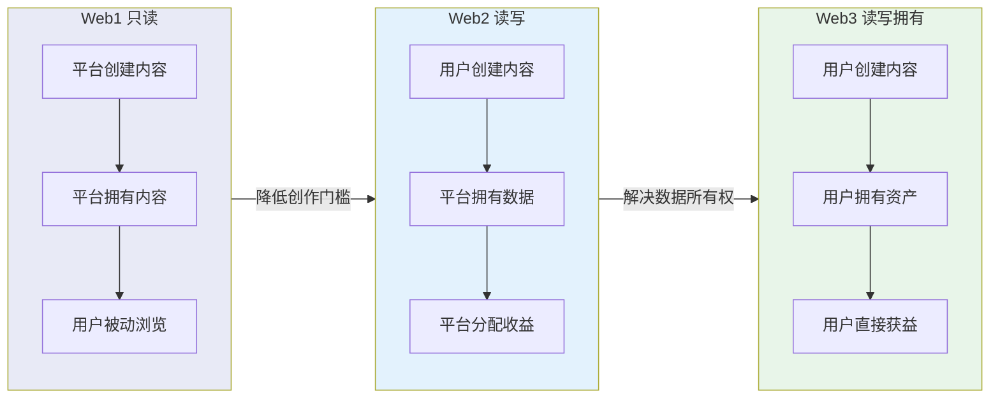
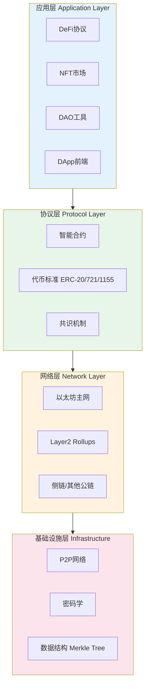

## 一、Web3的概念与发展

### Web3生态全景图

```mermaid
graph TB
    W3[Web3生态体系] --> BC[区块链基础设施]
    W3 --> NF[NFT数字资产]
    W3 --> DF[DeFi去中心化金融]
    W3 --> DA[DAO去中心化组织]
    W3 --> WL[Web3钱包与安全]

    BC --> BC1[Ethereum 以太坊]
    BC --> BC2[Polygon Layer2]
    BC --> BC3[Solana 高性能公链]
    BC --> BC4[BNB Chain]

    NF --> NF1[数字艺术品]
    NF --> NF2[PFP头像项目]
    NF --> NF3[游戏资产]
    NF --> NF4[虚拟地产]
    NF --> NF5[音乐/视频]

    DF --> DF1[去中心化交易所 DEX]
    DF --> DF2[借贷协议]
    DF --> DF3[收益聚合器]
    DF --> DF4[稳定币]
    DF --> DF5[流动性挖矿]

    DA --> DA1[协议DAO]
    DA --> DA2[投资DAO]
    DA --> DA3[社交DAO]
    DA --> DA4[收藏DAO]

    WL --> WL1[热钱包 MetaMask]
    WL --> WL2[冷钱包 Ledger]
    WL --> WL3[安全防护]

    W3 --> R[用户价值获取]
    BC --> R
    NF --> R
    DF --> R
    DA --> R

    style W3 fill:#627EEA,color:#fff
    style BC fill:#4CAF50,color:#fff
    style NF fill:#FF9800,color:#fff
    style DF fill:#2196F3,color:#fff
    style DA fill:#9C27B0,color:#fff
    style WL fill:#607D8B,color:#fff
```



> **Web3认知框架：** Web3的核心是"去中心化+用户主权+代币经济"。理解这三点，就能理解为什么NFT有价、DeFi能赚钱、DAO能运作。但请记住：高收益必然伴随高风险，入场前务必做好功课。

### 1.1 从Web1到Web3的演进

互联网的发展并非一蹴而就，而是经历了三代范式转移。每一代互联网解决了上一代的核心矛盾，同时也带来了新的问题。

#### Web1：只读互联网（1990-2005）

Web1是互联网的"报纸时代"。网站由少数技术人员创建，用户只能被动浏览内容，无法参与创作。

**典型产品与技术栈：**
- **门户网站：** 雅虎（Yahoo）、新浪、搜狐、网易——用户打开浏览器看到的就是编辑筛选好的内容
- **搜索引擎：** Google（1998年成立）、百度——帮用户在海量静态页面中找到信息
- **个人主页：** GeoCities、早期博客——少数技术极客才能搭建
- **技术底层：** HTML静态页面、HTTP协议、CGI脚本、FTP文件传输

**价值分配模式：** 平台创建内容，平台拥有内容，广告是唯一商业模式。用户只是"眼球"，注意力被打包卖给广告主。门户网站的核心KPI是页面浏览量（PV），内容质量服务于流量目标。

**Web1的根本局限：** 用户无法参与。你只能读，不能写。互联网是一个巨大的"电子公告板"，少数人贴公告，多数人看公告。

#### Web2：读写互联网（2005-2020）

Web2是互联网的"社交时代"。平台降低了创作门槛——任何人都可以发帖、拍视频、开网店。互联网从"信息高速公路"变成了"用户生成内容（UGC）平台"。

**典型产品与技术栈：**
- **社交媒体：** Facebook（2004）、微博（2009）、微信（2011）、抖音（2016）——用户创作内容，平台分发内容
- **电商平台：** 淘宝（2003）、亚马逊、拼多多——用户开店卖货，平台撮合交易
- **内容平台：** YouTube（2005）、B站、知乎、小红书——用户贡献知识和创意
- **共享经济：** Uber、滴滴、Airbnb——用户共享资产，平台抽佣
- **技术底层：** AJAX动态页面、云计算（AWS 2006）、移动互联网（iPhone 2007）、大数据、推荐算法

**价值分配模式：** 用户创造内容和数据，平台拥有数据并从中获利。Facebook在2021年广告收入超过1140亿美元，这些收入完全依赖用户生产的内容和用户行为数据。创作者获得的只是平台愿意分配的"分成"——YouTube给创作者55%的广告收入，抖音的分成比例更低。

**Web2的核心矛盾——数据垄断与平台权力：**

| 问题维度 | 具体表现 | 真实案例 |
|---------|---------|---------|
| 数据所有权 | 用户数据被平台无偿占有 | Facebook-Cambridge Analytica丑闻，8700万用户数据被滥用 |
| 账户封禁 | 平台可单方面封禁用户 | 2021年Twitter封禁特朗普总统账号，引发"谁有权决定言论"的争论 |
| 算法操控 | 推荐算法决定用户看到什么 | Facebook内部研究显示Instagram加剧青少年心理健康问题 |
| 创作者依赖 | 创作者在平台上建不起真正的资产 | 微信公众号改规则，大量营销号一夜归零 |
| 隐私泄露 | 集中式数据库成为黑客靶子 | 2017年Equifax泄露1.43亿美国人个人信息 |
| 价值抽成 | 平台抽取高额佣金 | App Store对开发者收取30%抽成，Epic Games为此起诉Apple |

这些矛盾不是个别公司的道德问题，而是Web2架构的结构性缺陷——中心化平台天然倾向于最大化自身利益。

#### Web3：读写拥有互联网（2020年至今）

Web3的核心命题是：**用户不仅能使用互联网，还能真正拥有自己在互联网上的资产和数据。**



**Web3的关键转折点：**

- **2008年：** 中本聪发表比特币白皮书《Bitcoin: A Peer-to-Peer Electronic Cash System》，提出去中心化电子现金系统
- **2013年：** Vitalik Buterin提出以太坊白皮书，在区块链上加入智能合约，让区块链从"记账本"升级为"可编程平台"
- **2015年：** 以太坊主网上线，智能合约开始运行
- **2017年：** ICO（首次代币发行）热潮，大量项目通过代币融资，行业泡沫与创新并存
- **2020年：** DeFi Summer——Uniswap、Aave、Compound等去中心化金融协议爆发，总锁仓量（TVL）从10亿美元飙升至数百亿
- **2021年：** NFT爆发——Beeple的NFT作品《Everydays: The First 5000 Days》在佳士得拍出6934万美元，NFT全年交易额超过250亿美元
- **2022年：** 行业寒冬——Luna/UST崩盘（400亿美元蒸发）、FTX交易所破产（用户资产损失80亿美元）、三箭资本破产
- **2023-2024年：** 行业重建——以太坊完成"合并"（从PoW转PoS，能耗降低99.95%）、比特币现货ETF获批、Layer2生态爆发
- **2025年：** 机构入场加速、RWA（现实世界资产代币化）成为新叙事、AI+区块链交叉领域兴起

**三代互联网对比总览：**

| 维度 | Web1 | Web2 | Web3 |
|------|------|------|------|
| 时间 | 1990-2005 | 2005-2020 | 2020至今 |
| 核心动词 | 读 | 读+写 | 读+写+拥有 |
| 用户角色 | 消费者 | 创造者（但不拥有） | 创造者+所有者 |
| 数据归属 | 平台 | 平台 | 用户 |
| 信任基础 | 机构信任 | 平台信任 | 密码学信任 |
| 账户体系 | 邮箱注册 | 手机号/社交登录 | 钱包地址 |
| 资产形式 | 无 | 平台积分/虚拟货币 | 链上代币/NFT |
| 收入模式 | 广告 | 广告+数据+佣金 | 代币激励+直接交易 |
| 典型公司 | Yahoo、新浪 | Facebook、微信 | Ethereum、Uniswap |
| 核心风险 | 信息匮乏 | 数据垄断 | 安全漏洞+投机泡沫 |

### 1.2 Web3的核心特征

#### 去中心化

"去中心化"是Web3最常被提及、也最容易被误解的概念。它不是指"没有中心"，而是指**没有单一的控制中心**——网络由成千上万个节点共同维护，任何一个节点宕机都不会影响网络运行。

**去中心化的三个层次：**

1. **架构去中心化：** 物理节点分布在全球各地。以太坊网络有超过90万个验证者节点分布在六大洲。即使某个国家禁止加密货币，网络依然正常运行。
2. **治理去中心化：** 没有CEO能单方面决定规则。以太坊的重大升级（如EIP-1559）需要社区广泛讨论和共识。协议的参数调整由代币持有者投票决定。
3. **逻辑去中心化：** 数据存储在区块链上，任何人可以读取和验证。不存在"后台管理员可以偷偷改数据"的可能。

**去中心化不是免费的午餐——它有明确的代价：**

| 去中心化收益 | 去中心化代价 |
|------------|------------|
| 抗审查：没有单一机构能关闭网络 | 效率低：以太坊每秒仅处理约15-30笔交易，Visa每秒处理约6.5万笔 |
| 透明：所有交易可验证 | 不可逆：转错地址无法撤销，没有客服帮你找回 |
| 无需许可：任何人都能参与 | 用户体验差：私钥丢失=资产永久丢失 |
| 抗篡改：历史记录不可修改 | 治理慢：社区决策需要长时间讨论 |

#### 用户主权

在Web3中，"用户主权"不是一个口号，而是一个技术实现。它通过**非对称加密**和**区块链**两个技术来保障。

**私钥即身份：** 在Web3中，你的身份不是"用户名+密码"，而是一对加密密钥：
- **私钥（Private Key）：** 一串256位的随机数，是你控制资产的唯一凭证。谁拥有私钥，谁就拥有对应地址上的所有资产。
- **公钥（Public Key）：** 从私钥通过椭圆曲线算法（secp256k1）单向推导出来。无法从公钥反推私钥。
- **地址（Address）：** 公钥经过Keccak-256哈希后截取后20字节生成，是你对外展示的"账户号码"。

```text
私钥 → (椭圆曲线乘法) → 公钥 → (Keccak-256哈希+截取) → 地址
0x4c0883... → 0x04a34b... → 0x742d35Cc6634C0532925a3b844Bc9e7595f...
```

**这意味着什么？** 没有任何机构能冻结你的资产、封禁你的账户、限制你的交易。但同时也意味着——没有任何人能帮你找回丢失的私钥。据Chainalysis估算，约20%的比特币（价值数百亿美元）因私钥丢失而永久无法使用。

#### 透明可验证

区块链的透明性是数学保证的，而不是靠公司承诺的。

**透明性的具体体现：**
- **交易可查：** 任何人可以在Etherscan（etherscan.io）上查看以太坊上的任何一笔交易——发送方、接收方、金额、时间、Gas费，全部公开
- **合约可审：** 智能合约的代码部署在链上，任何人都可以阅读和审计。Uniswap的核心合约代码任何人都可以验证
- **供应量可证：** 比特币的总供应量上限2100万枚不是白皮书里的承诺，而是代码里的硬编码。任何人都可以运行节点来验证

**透明性的局限：** 透明≠匿名。区块链上的交易是"伪匿名"的——地址不直接对应真实身份，但通过链上分析（如Chainalysis公司的工具），可以将地址与真实身份关联起来。执法机构已经多次通过链上追踪破获洗钱和暗网交易案件。

#### 代币经济

代币（Token）是Web3的"血液"——它既是激励工具，也是治理工具，还是价值载体。

**代币的分类：**

| 代币类型 | 功能 | 典型代表 | 举例说明 |
|---------|------|---------|---------|
| 原生代币 | 支付Gas费、网络安全保障 | ETH、BTC、SOL | 在以太坊上发交易需要消耗ETH作为Gas费 |
| 治理代币 | 投票权、协议参数决定 | UNI、AAVE、COMP | 持有UNI可以对Uniswap协议升级提案投票 |
| 实用代币 | 访问特定服务 | FIL（Filecoin存储）、LINK（Chainlink预言机） | 用FIL购买去中心化存储空间 |
| 稳定币 | 价值锚定、交易媒介 | USDT、USDC、DAI | 1 USDT始终约等于1美元 |
| NFT | 唯一性资产证明 | CryptoPunks、BAYC | 每个NFT是独一无二的，不能互相替换 |

**代币经济模型（Tokenomics）的核心要素：**

一个健康的代币经济模型需要回答以下问题：
1. **总供应量：** 固定还是通胀？比特币2100万枚上限是固定供应，以太坊在EIP-1559后通过燃烧机制趋向通缩
2. **分配方式：** 初始代币怎么分配？团队、投资者、社区、生态基金各占多少？过度集中于团队和投资者是危险信号
3. **释放节奏（Vesting）：** 团队和投资者的代币是否锁仓？常见的锁仓期为1-4年，线性释放
4. **价值捕获：** 协议产生的收入如何回馈给代币持有者？回购燃烧？分红？质押奖励？
5. **治理机制：** 代币持有者如何参与决策？投票门槛是多少？提案如何发起？

### 1.3 Web3的技术栈基础

理解Web3不能只停留在概念层面，需要了解其技术栈的层次结构：



**智能合约：** 智能合约是部署在区块链上的程序，一旦部署就无法修改（除非合约本身预留了升级接口）。它的执行是确定性的——相同的输入一定产生相同的输出，所有节点都会验证执行结果。

一个最简单的Solidity智能合约示例：

```solidity
// SPDX-License-Identifier: MIT
pragma solidity ^0.8.0;

contract SimpleStorage {
    uint256 private storedData;

    // 存储数据
    function set(uint256 x) public {
        storedData = x;
    }

    // 读取数据
    function get() public view returns (uint256) {
        return storedData;
    }
}
```

这个合约的功能极其简单——存一个数字，读一个数字。但它运行在以太坊上，意味着：
- 没有任何管理员能修改已存储的数据
- 任何人都可以调用`get()`来验证数据
- 调用`set()`需要支付Gas费，因为这会改变区块链的状态

**共识机制：** 区块链网络如何就"哪笔交易有效、区块顺序是什么"达成一致？这就是共识机制要解决的问题。

| 共识机制 | 代表链 | 原理 | 优点 | 缺点 |
|---------|-------|------|------|------|
| 工作量证明（PoW） | 比特币、（旧）以太坊 | 矿工通过计算哈希竞争记账权 | 安全性高，经过15年验证 | 能耗巨大，出块慢 |
| 权益证明（PoS） | 以太坊（2022年后）、Solana | 验证者质押代币获得记账权，作恶会被罚没 | 能耗低，速度快 | 富者更富，潜在中心化风险 |
| 委托权益证明（DPoS） | EOS、TRON | 代币持有者投票选出超级节点 | 速度极快 | 节点数量少，去中心化程度低 |
| 历史证明（PoH） | Solana | 使用可验证的时间戳序列实现高吞吐 | 速度极快（约6.5万TPS） | 网络稳定性曾出现问题 |

### 1.4 Web3的主要应用场景

Web3不是一个单一的产品，而是一个生态系统。以下是当前最成熟的应用场景：

#### 去中心化金融（DeFi）

DeFi试图用智能合约替代银行、券商、保险公司的核心功能：

- **去中心化交易所（DEX）：** Uniswap、SushiSwap——用户直接在链上交换代币，无需注册账号，无需KYC
- **借贷协议：** Aave、Compound——用户存入资产获得利息，或抵押资产借出代币
- **稳定币：** DAI（去中心化，由MakerDAO协议管理）、USDC（中心化发行但链上流通）
- **衍生品：** dYdX、GMX——去中心化的永续合约和期权交易

#### NFT与数字资产

NFT（非同质化代币）赋予数字物品"唯一性"——一幅数字画、一段音乐、一个游戏道具，都可以通过NFT证明其独一无二的所有权。（详见后续章节）

#### 去中心化自治组织（DAO）

DAO是一种用智能合约管理的组织形式。规则写在代码里，决策通过代币持有者投票完成。典型的DAO包括：
- **Uniswap DAO：** 管理Uniswap协议的升级和资金分配
- **MakerDAO：** 管理DAI稳定币的发行和利率
- **ConstitutionDAO：** 2021年众筹4700万美元试图购买美国宪法副本（虽然竞拍失败，但展示了DAO的众筹能力）

#### 去中心化身份（DID）

Web3身份不依赖任何平台——你创建一个钱包地址，它就是你在Web3世界的"身份证"。所有链上行为（交易、NFT持有、DAO投票）都绑定在这个地址上，形成你的"链上声誉"。

### 1.5 对Web3的批判与争议

一本合格的指南不能只唱赞歌。Web3面临的真实挑战必须正视：

#### 技术层面的挑战

1. **可扩展性困境（区块链三难问题）：** 去中心化、安全性、可扩展性三者最多只能同时满足两个。以太坊主网TPS仅约15-30，远不能满足大规模应用需求。Layer2（如Arbitrum、Optimism、zkSync）正在尝试解决这个问题，但增加了用户操作的复杂性。
2. **用户体验门槛：** 钱包创建、助记词备份、Gas费理解、链的切换——对普通用户来说，使用Web3产品的门槛远高于Web2。
3. **智能合约漏洞：** 代码即法律，但代码也会有bug。2022年Ronin Network被黑6.25亿美元，2023年Multichain被黑1.26亿美元。审计不能保证100%安全。

#### 金融层面的风险

1. **投机泡沫：** 大量项目的价值建立在"有人会出更高价购买"的基础上，而非实际使用价值。2022年NFT市场交易量暴跌97%。
2. **庞氏骗局：** 部分DeFi项目本质上是后来者的钱付给先来者。识别方法：如果一个项目的收益来源只有"拉新人"，那大概率是庞氏。
3. **监管不确定性：** 各国对加密货币的监管态度差异巨大。中国全面禁止加密货币交易，美国SEC对多个项目提起诉讼，欧盟推出MiCA框架试图规范化。

#### 哲学层面的质疑

1. **去中心化是真需求还是伪命题？** 大多数用户并不在乎数据所有权——他们只想用好用的产品。Web2的便利性是否已经足够好？
2. **代币经济是否在制造新的不平等？** 早期参与者获得大量代币，后来者只能高价接盘——这与Web2的"先发优势"有何本质区别？
3. **"代码即法律"是否过于极端？** 当智能合约出现bug导致用户损失时，是该"尊重代码"还是该"硬分叉回滚"？2016年The DAO事件中，以太坊选择了硬分叉，由此分裂出ETH和ETC两条链。

### 1.6 Web3的现状与未来（2025年视角）

#### 当前格局

- **比特币：** 2024年4月完成第四次减半，区块奖励降至3.125 BTC。2024年1月比特币现货ETF获批，传统金融机构开始正式配置比特币。比特币正在从"极客玩具"向"数字黄金"叙事转变。
- **以太坊：** 2022年9月完成"合并"，从PoW转向PoS。Layer2生态（Arbitrum、Optimism、Base、zkSync）快速发展，交易费用降低至主网的1/10-1/100。
- **新兴公链：** Solana凭借高性能和低费用在2024年迎来爆发，成为DePIN（去中心化物理基础设施网络）和Meme代币的首选平台。
- **RWA（现实世界资产代币化）：** 美国国债、房地产、大宗商品等传统资产正在被代币化上链。贝莱德（BlackRock）推出了链上代币化基金BUIDL。

#### 未来趋势

1. **AI × 区块链：** AI Agent需要可验证的身份和支付能力，区块链提供了这两者。去中心化AI计算、AI驱动的交易策略、链上AI代理等方向正在探索。
2. **账户抽象（Account Abstraction）：** 通过ERC-4337标准，Web3钱包可以实现社交恢复、免Gas交易、批量操作等，大幅降低使用门槛。
3. **模块化区块链：** 将执行、共识、数据可用性分离到不同层，每层独立优化。Celestia（数据可用性层）、EigenLayer（再质押）是代表项目。
4. **链上合规：** 零知识证明（ZKP）技术可以实现"可验证但不泄露"——证明你满足某个条件（如年龄>18），但不暴露具体信息（如确切年龄）。

### 1.7 入门实操：创建你的第一个Web3钱包

**第一步：安装MetaMask钱包**

MetaMask是最常用的以太坊钱包，支持浏览器插件和手机App。

1. 访问 [metamask.io](https://metamask.io) 下载浏览器插件（Chrome/Firefox/Brave）或在应用商店搜索"MetaMask"
2. 点击"创建新钱包"，设置一个强密码
3. **关键步骤：** 系统会生成12个英文单词的助记词（Seed Phrase），这是你钱包的"终极备份"。**必须手写在纸上，存放在安全的地方。** 绝对不要截图、不要发到微信、不要存在云笔记里

**第二步：了解钱包界面**

- **账户地址：** 以`0x`开头的42位字符串，相当于你的"银行账号"，可以安全地分享给别人
- **网络切换：** MetaMask默认连接以太坊主网，可以手动添加其他网络（Polygon、Arbitrum等）
- **资产余额：** 显示你当前地址上持有的代币

**第三步：获取第一笔加密货币**

对于中国用户，常见的方式包括：
- 通过海外合规交易所购买（需要身份验证）
- 接受他人转账（让已经持有加密货币的朋友转给你少量ETH用于测试）
- 参与测试网空投（使用Sepolia等测试网免费获取测试代币）

**第四步：发送你的第一笔交易**

1. 点击"发送"按钮
2. 输入接收方地址（**务必仔细核对，区块链交易不可逆**）
3. 输入金额
4. 确认Gas费（以太坊主网Gas费波动较大，低峰期可能只需几美元，高峰期可能数十美元）
5. 确认交易

> **新手安全提醒：** 助记词=你的全部资产。任何索要你助记词的人都是骗子，无论是"客服""空投领取""安全验证"。正规项目永远不会要求你提供助记词。

### 1.8 常见误区与纠正

| 误区 | 事实 |
|------|------|
| "Web3就是加密货币，就是炒币" | 加密货币只是Web3的一个组成部分。Web3还包括去中心化存储（IPFS）、去中心化身份（DID）、去中心化计算等 |
| "区块链上的数据是匿名的" | 是"伪匿名"——地址不直接对应身份，但链上分析可以追踪关联。执法机构已经多次通过链上追踪破案 |
| "去中心化一定比中心化好" | 去中心化有代价——效率低、用户体验差、治理慢。很多场景下中心化方案更优 |
| "智能合约是安全的因为代码开源" | 开源不等于安全。The DAO（2016年，损失6000万美元）、Ronin（2022年，损失6.25亿美元）都是智能合约被攻击的案例 |
| "Web3能取代银行" | 目前DeFi更像是一个平行金融系统，而非银行替代品。它服务的是已有加密资产的用户，而非普通储户 |
| "只要买了代币就是在参与Web3" | 持有代币只是第一步。真正的参与包括使用DApp、参与治理投票、为协议提供流动性等 |

### 1.9 本章小结

Web3的核心命题是**将互联网的所有权从平台归还给用户**。这一命题通过区块链、智能合约、代币经济三个技术支柱来实现。

但Web3仍处于早期阶段——技术不成熟、用户体验差、监管不确定、投机泡沫严重。它既有改变互联网格局的潜力，也有沦为少数人割韭菜工具的风险。

**判断一个Web3项目是否值得关注的简易框架：**

1. **它解决了什么真实问题？** 如果答案是"让早期参与者暴富"，那不是真实问题
2. **离开代币激励还能运转吗？** 如果一个协议完全靠代币补贴吸引用户，补贴结束后用户就会离开
3. **团队和代币分配是否合理？** 团队持有超过30%的代币、没有锁仓期，是危险信号
4. **代码是否经过审计？** 未经审计的智能合约就像未经测试的银行系统

理解了这些基础概念后，我们将在后续章节深入探讨NFT、DeFi、DAO等具体应用领域。
