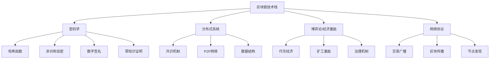

## 二、区块链技术基础

理解区块链是进入 Web3 和 NFT 世界的第一步。本章从最底层的数据结构讲起，逐步覆盖共识机制、智能合约、密码学原理，直到主流公链的技术对比，帮助你建立完整的技术认知框架。无论你是投资者、开发者还是普通用户，这些知识都能让你在 Web3 世界中做出更明智的判断。

---

### 1. 区块链的本质：一个不可篡改的分布式账本

#### 1.1 用最简单的话解释区块链

想象一个村子里没有银行，村民们用一本公共账本记录所有交易。这本账本有几个特殊规则：

- **每个人都有副本**：全村每家都有一本完全相同的账本（分布式）
- **记账需要多数人确认**：一笔交易要多数村民认可才能写入（共识机制）
- **写上去就改不了**：每页账本都有一个独特印章，且新页会引用上一页的印章（哈希链）
- **公开透明**：任何人都可以翻阅账本验证交易（公开可审计）

这就是区块链的核心思想。技术上说，区块链是一个**按时间顺序连接的、由密码学保护的、分布式存储的数据块链表**。

#### 1.2 区块链 vs 传统数据库

理解区块链最好的方式是与你熟悉的传统数据库做对比：

| 维度 | 传统数据库 | 区块链 |
|------|-----------|--------|
| 控制权 | 中心化管理员 | 去中心化，无单一控制方 |
| 数据修改 | 可以增删改查 | 只能追加（append-only），不可删除修改 |
| 信任模型 | 信任数据库管理员 | 信任数学和密码学 |
| 透明度 | 通常私有 | 公链完全公开 |
| 性能 | 高（数万 TPS） | 低（比特币 ~7 TPS，以太坊 ~30 TPS） |
| 成本 | 低 | 链上操作需要 Gas 费 |
| 数据持久性 | 管理员可删除 | 理论上永久存在 |
| 适用场景 | 通用数据存储 | 需要去信任、去中心化的场景 |

**关键结论**：区块链不是万能的。它适合需要**多方互不信任但需要共享数据**的场景，而不是替代所有数据库。判断一个项目是否需要用区块链，问三个问题：

1. 是否有多方参与者？
2. 参与者之间是否互不信任？
3. 是否需要去中心化的信任机制？

如果三个答案都是"是"，区块链可能合适。否则，一个普通的中心化数据库就够了。

#### 1.3 区块链发展简史

| 阶段 | 时间 | 代表 | 核心特征 |
|------|------|------|----------|
| 区块链 1.0 | 2008-2013 | 比特币 | 数字货币，点对点支付 |
| 区块链 2.0 | 2014-2017 | 以太坊 | 智能合约，可编程区块链 |
| 区块链 3.0 | 2018-2022 | Solana、Polygon 等 | 高性能、跨链、Layer 2 扩展 |
| 区块链 4.0 | 2023- | 模块化区块链、AI+链 | 数据可用性层分离、AI Agent 上链 |

---

### 2. 区块的结构：每一"页"账本长什么样

#### 2.1 区块的组成部分

每个区块由**区块头（Block Header）**和**区块体（Block Body）**组成：

```text
┌─────────────────────────────────────────┐
│              区块 (Block)                │
├─────────────────────────────────────────┤
│  区块头 (Block Header)                   │
│  ├── 版本号 (Version)                    │
│  ├── 前一区块哈希 (Previous Block Hash)   │
│  ├── 默克尔根 (Merkle Root)              │
│  ├── 时间戳 (Timestamp)                  │
│  ├── 难度目标 (Difficulty Target)         │
│  └── 随机数 (Nonce)                      │
├─────────────────────────────────────────┤
│  区块体 (Block Body)                     │
│  ├── 交易列表 (Transaction List)         │
│  └── 交易数量 (Transaction Count)        │
└─────────────────────────────────────────┘
```

#### 2.2 关键字段详解

**前一区块哈希（Previous Block Hash）**：这是区块链之所以成为"链"的关键。每个区块都存储了上一个区块的哈希值，形成一条从创世区块到最新区块的链条。如果有人篡改了某个历史区块的内容，该区块的哈希就会变化，导致后续所有区块的哈希都不匹配，篡改行为立即暴露。

**默克尔根（Merkle Root）**：将区块内所有交易通过默克尔树（Merkle Tree）计算得到的哈希值。默克尔树是一种二叉哈希树：

```text
            Merkle Root (ABCD)
           /                  \
        Hash(AB)            Hash(CD)
       /        \          /        \
    Hash(A)  Hash(B)  Hash(C)  Hash(D)
      |        |        |        |
    Tx A     Tx B     Tx C     Tx D
```

默克尔树的好处是可以只下载部分数据就验证某笔交易是否在区块中（称为 Merkle Proof），这对轻节点（手机钱包等）至关重要。

**Nonce（随机数）**：在工作量证明（PoW）机制中，矿工不断尝试不同的 Nonce 值，直到区块哈希满足难度目标。这是"挖矿"的核心计算过程。

#### 2.3 创世区块

每个区块链的第一个区块称为**创世区块（Genesis Block）**，它没有"前一区块哈希"。比特币的创世区块由中本聪在 2009 年 1 月 3 日创建，区块内嵌入了当天《泰晤士报》的头版标题："The Times 03/Jan/2009 Chancellor on brink of second bailout for banks"（财政大臣在第二次银行救助边缘）。这既是一个时间戳证明，也被认为是中本聪对传统金融体系的隐喻批评。

---

### 3. 哈希函数：区块链的数学基石

#### 3.1 什么是哈希函数

哈希函数（Hash Function）是将任意长度的输入映射为固定长度输出的数学函数。区块链中最常用的是 SHA-256（比特币）和 Keccak-256（以太坊）。

```text
输入: "Hello, Blockchain!" 
→ SHA-256 → 
输出: "a1b2c3d4e5f6...64个十六进制字符"

输入: "Hello, Blockchain!"  (同样的输入)
→ SHA-256 → 
输出: "a1b2c3d4e5f6...完全相同的输出"

输入: "Hello, Blockchain?"  (只改了一个字符)
→ SHA-256 → 
输出: "f7e8d9c0b1a2...完全不同的输出"  ← 雪崩效应
```

#### 3.2 哈希函数的三大特性

| 特性 | 含义 | 区块链用途 |
|------|------|-----------|
| **确定性** | 同一输入永远产生同一输出 | 区块验证、链完整性检查 |
| **雪崩效应** | 输入微小变化导致输出巨大变化 | 篡改检测 |
| **单向性** | 正向计算容易，逆向推算不可行 | 工作量证明的基础 |

此外还有两个重要特性：

- **抗碰撞（Collision Resistant）**：找到两个不同输入产生相同输出在计算上不可行
- **谜题友好（Puzzle Friendly）**：无法预测哪个输入会得到特定输出，只能暴力尝试

#### 3.3 哈希在区块链中的应用

1. **区块链接**：每个区块哈希包含前一区块哈希，形成不可篡改的链
2. **工作量证明**：找到满足难度条件的哈希值需要大量计算
3. **默克尔树**：高效验证交易是否存在
4. **地址生成**：从公钥哈希生成钱包地址
5. **数据完整性**：验证下载的区块数据是否被篡改

---

### 4. 非对称加密与数字签名

#### 4.1 非对称加密原理

区块链使用**非对称加密（Asymmetric Cryptography）**来管理身份和授权。每个用户拥有一对密钥：

- **私钥（Private Key）**：保密，只有自己知道。用于签名交易
- **公钥（Public Key）**：公开，所有人可见。用于验证签名

```text
私钥 (256位随机数)
  │
  ├──→ 公钥 (通过椭圆曲线算法推导)
  │       │
  │       └──→ 地址 (通过哈希+编码推导)
  │
  └──→ 签名 (对交易数据签名)
          │
          └──→ 任何人可用公钥验证签名
```

**关键安全规则**：私钥绝对不能泄露。在区块链世界里，**私钥就是资产**——谁掌握了私钥，谁就掌握了对应地址上的所有资产。这与银行账户不同：银行可以通过身份验证帮你找回密码，但区块链上没有客服，丢失私钥意味着永久失去资产。

#### 4.2 椭圆曲线数字签名算法（ECDSA）

比特币和以太坊使用 secp256k1 椭圆曲线。签名过程如下：

1. 对交易数据计算哈希
2. 用私钥对哈希值进行签名运算
3. 生成签名值 (r, s)
4. 任何人都可以用公钥 + 原始数据 + 签名验证：签名确实由对应私钥生成

这个过程保证了：
- **不可伪造**：没有私钥无法生成有效签名
- **不可否认**：签名者无法否认自己的签名
- **完整性**：交易数据被修改后签名失效

#### 4.3 助记词与钱包

直接管理 256 位的私钥不现实，所以有了**助记词（Mnemonic Phrase）**—— 通常 12 或 24 个英文单词，通过 BIP-39 标准生成，本质上是私钥的可读表示。

```text
助记词: abandon ability able ... about above (12/24个词)
    │
    ├──→ 种子 (Seed) 通过 PBKDF2 派生
    │
    └──→ 主私钥 通过 BIP-32 层级确定性钱包(HD Wallet)派生
            │
            ├──→ 子私钥 #1 → 地址 #1
            ├──→ 子私钥 #2 → 地址 #2
            └──→ ...
```

**HD 钱包的好处**：只需备份一个助记词，就能恢复所有地址和资产。这正是"不是你的私钥，就不是你的币"这句话的由来。

#### 4.4 常见钱包类型对比

| 类型 | 代表产品 | 安全性 | 便利性 | 适用场景 |
|------|---------|--------|--------|---------|
| 硬件钱包 | Ledger、Trezor | ★★★★★ | ★★☆ | 大额资产长期存储 |
| 浏览器插件钱包 | MetaMask、Phantom | ★★★☆ | ★★★★ | 日常 DeFi/NFT 操作 |
| 手机钱包 | Trust Wallet、Rainbow | ★★★☆ | ★★★★★ | 移动端日常使用 |
| 网页钱包 | MyEtherWallet | ★★☆ | ★★★★ | 临时操作 |
| 多签钱包 | Safe（Gnosis Safe） | ★★★★★ | ★★☆ | 团队/DAO 金库管理 |

---

### 5. 共识机制：如何在互不信任的环境中达成一致

共识机制是区块链的核心创新——它解决的是"在没有中心权威的情况下，如何让所有参与者对账本状态达成一致"这个根本问题。

#### 5.1 工作量证明（Proof of Work, PoW）

**原理**：矿工通过大量计算竞争记账权。谁先找到满足难度条件的哈希值，谁就获得打包新区块的权利和区块奖励。

**流程**：

1. 收集内存池中的待确认交易
2. 组装候选区块（包含交易列表 + 前一区块哈希 + 时间戳）
3. 不断尝试不同的 Nonce 值
4. 计算区块哈希，检查是否小于难度目标值
5. 如果不满足，修改 Nonce 再试（每秒可尝试数十亿次）
6. 第一个找到有效 Nonce 的矿工广播区块
7. 其他节点验证后接受该区块，开始挖下一个

**难度调整**：比特币每 2016 个区块（约两周）调整一次难度，目标是平均每 10 分钟出一个区块。算力增加则难度增加，算力减少则难度降低。

**优缺点**：

| 优点 | 缺点 |
|------|------|
| 安全性经过 15+ 年验证 | 能耗巨大（比特币年耗电约 120 TWh，相当于一个中等国家） |
| 去中心化程度高 | 算力集中化趋势（矿池垄断） |
| 抗审查能力强 | 出块速度慢（比特币 10 分钟/块） |
| 经济激励设计成熟 | 51% 攻击虽然成本高但理论上可行 |

#### 5.2 权益证明（Proof of Stake, PoS）

**原理**：不再比拼算力，而是由持有并质押（Stake）代币的验证者来创建和验证区块。质押越多，被选为出块者的概率越高。

**以太坊 PoS 机制（Gasper）详解**：

1. **质押门槛**：成为验证者需要质押 32 ETH
2. **验证者集合**：当前以太坊有超过 100 万个活跃验证者
3. **区块提议**：每 12 秒一个 slot，随机选择一个验证者提议区块
4. **委员会投票**：每个 slot 有一个委员会（约 128-512 个验证者）对区块投票
5. **最终确定性**：每 32 个 slot 为一个 epoch，经过两个 epoch 后区块获得最终确定性（约 12.8 分钟）
6. **惩罚机制**：离线扣分（inactivity leak），作恶则罚没全部质押（slashing）

**优缺点**：

| 优点 | 缺点 |
|------|------|
| 能耗极低（比 PoW 节省 99.95%） | "富者越富"倾向 |
| 出块速度快 | 初始代币分配影响去中心化程度 |
| 经济惩罚使攻击成本明确 | 长程攻击(Long-range attack)风险 |
| 更低的硬件门槛 | 复杂度高于 PoW |

#### 5.3 其他共识机制概览

| 机制 | 代表链 | 核心思路 | 适用场景 |
|------|--------|---------|---------|
| Delegated PoS (DPoS) | EOS、TRON | 代币持有者投票选出少数代表记账 | 高吞吐量需求 |
| Proof of Authority (PoA) | 一些私链 | 预选的权威节点记账 | 联盟链、企业场景 |
| Proof of History (PoH) | Solana | 用密码学时钟建立交易顺序 | 高性能公链 |
| Proof of Space | Chia | 用硬盘空间替代算力 | 低能耗替代方案 |
| BFT 类 | Tendermint/Cosmos | 拜占庭容错投票 | 需要快速确定性的场景 |

#### 5.4 共识机制对比总结

```text
             安全性
              ▲
              │   PoW (Bitcoin)
              │       ●
              │
              │           PoS (Ethereum)
              │               ●
              │
              │       DPoS (EOS)
              │           ●
              │
              │   PoA (私链)
              │       ●
              ├──────────────────────────────────→ 性能/吞吐量
```

**核心权衡**：安全性、去中心化、可扩展性——这就是著名的"区块链不可能三角"。目前没有任何一条链能同时完美实现三者，不同的共识机制在这三者之间做不同的取舍。

---

### 6. 智能合约：可编程的区块链

#### 6.1 什么是智能合约

智能合约是部署在区块链上的程序，一旦部署就无法修改（除非设计了升级机制），按照预设规则自动执行。可以用一句话概括：**智能合约 = 代码即法律（Code is Law）**。

传统合同需要律师起草、法院执行、第三方监督。智能合约将这些都转化为代码：

```text
传统合同：  甲方同意 → 乙方同意 → 第三方监督执行 → 违约则起诉法院
智能合约：  代码写好 → 部署上链 → 满足条件自动执行 → 无法违约
```

#### 6.2 以太坊虚拟机（EVM）

智能合约运行在**以太坊虚拟机（EVM）**上。EVM 是一个图灵完备的虚拟机，可以在每个以太坊节点上运行相同的计算，确保所有节点对合约执行结果达成一致。

**EVM 的关键概念**：

- **Gas**：执行计算的"燃料"。每个操作都有固定的 Gas 消耗，Gas 用完则执行中止（防止无限循环）
- **Gas Price**：每单位 Gas 的价格（以 Gwei 计价），用户可调节以影响交易优先级
- **交易费用 = Gas Used × Gas Price**：以太坊 EIP-1559 后，费用分为 Base Fee（销毁）+ Priority Fee（给验证者）
- **存储成本**：在区块链上存储数据非常昂贵（每个 256 位的存储槽约 20,000 Gas）

**EVM 操作码示例**：

| 操作码 | 功能 | Gas 消耗 |
|--------|------|---------|
| ADD | 加法 | 3 |
| MUL | 乘法 | 5 |
| SLOAD | 读取存储 | 2,100 |
| SSTORE | 写入存储 | 20,000（新值）/ 5,000（更新） |
| CALL | 调用其他合约 | 700 + 额外 |

#### 6.3 Solidity 编程语言入门

Solidity 是最主流的智能合约编程语言，语法类似 JavaScript + C++。

一个最简单的 ERC-20 代币合约示例：

```solidity
// SPDX-License-Identifier: MIT
pragma solidity ^0.8.20;

import "@openzeppelin/contracts/token/ERC20/ERC20.sol";

contract MyToken is ERC20 {
    constructor(uint256 initialSupply) ERC20("MyToken", "MTK") {
        _mint(msg.sender, initialSupply * 10 ** decimals());
    }
}
```

一个基础的 NFT 合约（ERC-721）：

```solidity
// SPDX-License-Identifier: MIT
pragma solidity ^0.8.20;

import "@openzeppelin/contracts/token/ERC721/ERC721.sol";
import "@openzeppelin/contracts/access/Ownable.sol";

contract MyNFT is ERC721, Ownable {
    uint256 private _tokenIdCounter;

    constructor() ERC721("MyNFT", "MNFT") Ownable(msg.sender) {}

    function mint(address to) public onlyOwner {
        uint256 tokenId = _tokenIdCounter++;
        _safeMint(to, tokenId);
    }
}
```

#### 6.4 智能合约的安全性

智能合约一旦部署就不可修改（除非使用代理模式），漏洞可能导致巨额资金损失。历史上最大的智能合约安全事件：

| 事件 | 时间 | 损失 | 原因 |
|------|------|------|------|
| The DAO 攻击 | 2016 | 360 万 ETH（约 6000 万美元） | 重入漏洞 |
| Parity 钱包冻结 | 2017 | 51.4 万 ETH | 权限控制不当 |
| Poly Network 攻击 | 2021 | 6.1 亿美元 | 跨链消息验证缺陷 |
| Ronin Bridge 攻击 | 2022 | 6.25 亿美元 | 验证者私钥泄露 |
| Wormhole 攻击 | 2022 | 3.2 亿美元 | 签名验证漏洞 |

**常见漏洞类型**：

1. **重入攻击（Reentrancy）**：在更新状态前调用外部合约，外部合约递归回调耗尽资金
2. **整数溢出/下溢**：Solidity 0.8+ 已内置检查，旧版本需使用 SafeMath
3. **访问控制缺失**：关键函数缺少权限修饰符
4. **预言机操纵**：依赖可被操纵的链上价格数据
5. **前端运行（Front-running）**：矿工/验证者看到待确认交易后抢先交易

**防御最佳实践**：
- 使用 OpenZeppelin 等经过审计的标准库
- 部署前进行专业安全审计（Trail of Bits、OpenZeppelin、Certik 等）
- 使用 Slither、Mythril 等静态分析工具
- 实施时间锁和多签控制
- 编写全面的测试用例，覆盖率目标 >95%

---

### 7. 默克尔树与数据结构

#### 7.1 默克尔树（Merkle Tree）

默克尔树是区块链中用于高效验证大量数据完整性的核心数据结构。

**构建过程**：

1. 将所有交易分别计算哈希
2. 两两配对，将相邻哈希拼接后再次哈希
3. 重复此过程直到只剩一个根哈希（Merkle Root）

**为什么用默克尔树而不是直接对所有交易求哈希？**

直接哈希需要下载所有交易才能验证一笔交易。默克尔树只需要 log(n) 个哈希值（称为 Merkle Proof / Merkle Path）就能证明某笔交易存在于区块中。

例如，验证交易 Tx-C 是否在区块中，只需要 Hash(D)、Hash(AB) 两个辅助哈希：

```text
            Merkle Root
           /           \
      Hash(AB)       Hash(CD)      ← 提供 Hash(CD) 的一半
       /    \         /    \
    H(A)   H(B)    H(C)   H(D)    ← 提供 Hash(AB)
              ↑       ↑
           辅助     目标交易
```

4 笔交易只需 2 个辅助哈希，100 万笔交易只需 20 个。这就是比特币轻节点（SPV 节点）的工作原理。

#### 7.2 状态树（以太坊）

以太坊使用更复杂的数据结构组合：

- **状态树（State Trie）**：Merkle Patricia Trie，存储所有账户的当前状态（余额、nonce、代码哈希、存储根）
- **交易树（Transaction Trie）**：每个区块的交易默克尔树
- **收据树（Receipt Trie）**：每笔交易执行结果的默克尔树

这三棵树的根哈希都存储在区块头中，使得任何关于状态、交易或收据的查询都可以通过 Merkle Proof 进行链下验证。

---

### 8. Layer 2 扩容方案

Layer 1（主链）的吞吐量有限，为了解决扩展性问题，出现了各种 Layer 2 方案。

#### 8.1 为什么需要 Layer 2

以太坊主网约 15-30 TPS，而 Visa 网络约 65,000 TPS。如果所有交易都直接在主网执行，网络会拥堵且 Gas 费极高（2021 年 NFT 热潮时，一笔简单转账的 Gas 费超过 100 美元）。

Layer 2 的核心思路是：**将计算和存储移到链下执行，只将最终结果（或证明）提交到主链**。

#### 8.2 主流 Layer 2 方案对比

| 方案 | 代表项目 | 原理 | TPS | 安全性 | 成本 |
|------|---------|------|-----|--------|------|
| Optimistic Rollup | Optimism、Arbitrum | 假设交易有效，欺诈时提交欺诈证明 | ~2,000 | 依赖挑战期（7天） | 低 |
| ZK Rollup | zkSync、Starknet、Scroll | 用零知识证明证明交易有效 | ~2,000-10,000 | 数学保证 | 中 |
| State Channel | Lightning Network（BTC） | 双方在链下开通道，只在开/关时上链 | ~1,000,000 | 参与者自保 | 极低 |
| Plasma | Polygon（早期） | 子链定期向主链提交根哈希 | ~1,000 | 依赖数据可用性 | 低 |
| Validium | StarkEx | 类似 ZK Rollup 但数据存在链下 | ~9,000 | 数据可用性较弱 | 极低 |

#### 8.3 Optimistic Rollup 详解

Optimistic Rollup 的工作流程：

```text
用户提交交易到 L2 排序器（Sequencer）
        │
        ▼
排序器批量打包交易，生成 L2 区块
        │
        ▼
将交易数据压缩后提交到 L1（以太坊主网）
        │
        ▼
进入 7 天挑战期（任何人都可以提交欺诈证明）
        │
        ├── 无人挑战 → 交易最终确认
        └── 有人挑战 → 回滚争议交易，挑战者获奖励
```

"Optimistic"（乐观）的含义是：默认假设所有交易都是有效的，只在有人提出异议时才去验证。这省去了逐笔验证的成本。

#### 8.4 ZK Rollup 详解

ZK Rollup 使用**零知识证明（Zero-Knowledge Proof）**来证明一批交易的有效性：

```text
用户提交交易到 L2 排序器
        │
        ▼
排序器执行交易，生成状态变更
        │
        ▼
证明者（Prover）生成零知识证明（ZK-SNARK 或 ZK-STARK）
        │
        ▼
将证明 + 压缩数据提交到 L1
        │
        ▼
L1 合约验证证明（只需验证证明，不需重新执行交易）
        │
        ▼
状态立即最终确定（无需挑战期）
```

ZK Rollup 的优势在于：数学上保证了交易的有效性，无需等待挑战期，提款到 L1 可以即时完成。劣势是生成 ZK 证明的计算成本较高。

---

### 9. 主流公链技术对比

#### 9.1 智能合约平台

| 公链 | 共识机制 | TPS | 出块时间 | 编程语言 | 生态定位 |
|------|---------|-----|---------|---------|---------|
| Ethereum | PoS | ~30（L1） | 12秒 | Solidity、Vyper | 去中心化应用基础设施 |
| Solana | PoH + PoS | ~65,000 | 0.4秒 | Rust、C、C++ | 高性能 DeFi/游戏 |
| BNB Chain | PoSA | ~160 | 3秒 | Solidity | 币安生态、低费用 |
| Avalanche | Snow | ~4,500 | <2秒 | Solidity | 企业级子网 |
| Polygon | PoS + ZK | ~7,000 | 2秒 | Solidity | 以太坊 L2 生态 |
| Aptos | BFT | ~160,000 | <1秒 | Move | 新一代高性能链 |
| Sui | Narwhal + BFT | ~120,000 | <1秒 | Move | 游戏和社交应用 |

#### 9.2 非智能合约平台

| 公链 | 定位 | 共识机制 | 核心特征 |
|------|------|---------|---------|
| Bitcoin | 数字黄金/P2P 支付 | PoW | 最去中心化，最安全 |
| Cosmos | 互联网区块链（IBC 跨链） | Tendermint BFT | 模块化 SDK，主权链 |
| Polkadot | 平行链互操作 | NPoS | 共享安全，平行链插槽 |

#### 9.3 如何选择公链

选择公链需要考虑以下因素：

- **安全性**：链的总质押/算力价值，运行历史，漏洞记录
- **去中心化程度**：验证者数量和分布
- **生态系统**：DApp 数量、TVL（总锁仓价值）、开发者活跃度
- **交易成本**：Gas 费水平，是否有 L2 选择
- **用户体验**：确认速度、钱包支持、入门门槛
- **技术路线**：是否在持续演进，社区治理是否健康

---

### 10. 区块链的局限性与常见误解

#### 10.1 技术局限

1. **可扩展性瓶颈**：去中心化和安全性以牺牲性能为代价
2. **存储成本极高**：在以太坊上存储 1GB 数据需要数百万美元
3. **隐私问题**：公链上所有交易公开可查（地址是假名但可通过链分析追踪）
4. **预言机问题**：智能合约无法直接获取链下数据，需要预言机（如 Chainlink）中转
5. **不可逆性**：交易一旦确认就无法撤销，操作失误无法挽回
6. **密钥管理**：私钥丢失 = 资产永久丢失

#### 10.2 常见误解澄清

| 误解 | 事实 |
|------|------|
| "区块链就是比特币" | 比特币是区块链的第一个应用，区块链是底层技术 |
| "区块链上的数据完全匿名" | 公链是假名的（pseudonymous），链分析公司可以追踪身份 |
| "智能合约真的像法律合同一样" | 智能合约是代码，不具备法律效力（部分国家在探索立法） |
| "区块链是完全去中心化的" | 实际上很多链的验证者/矿池高度集中 |
| "所有区块链都是公开的" | 还有私有链和联盟链（Hyperledger、R3 Corda） |
| "区块链能解决所有信任问题" | 区块链只能保证链上数据的一致性，无法保证输入数据的真实性（垃圾进，垃圾出） |

#### 10.3 什么场景不适合用区块链

- 需要高频写入的系统（物联网实时数据）
- 需要删除数据的场景（GDPR 合规要求"被遗忘权"）
- 参与者之间已有充分信任的场景
- 需要保密的商业数据
- 纯内部业务系统

---

### 11. 术语速查表

| 术语 | 英文 | 含义 |
|------|------|------|
| 区块 | Block | 包含一批交易的数据包 |
| 链 | Chain | 按时间顺序连接的区块序列 |
| 节点 | Node | 运行区块链软件的计算机 |
| 矿工/验证者 | Miner/Validator | 参与共识、创建新区块的角色 |
| 全节点 | Full Node | 存储完整区块链数据的节点 |
| 轻节点 | Light Node | 只下载区块头的节点，通过 Merkle Proof 验证 |
| Gas | Gas | 以太坊上执行操作的计量单位 |
| DApp | Decentralized Application | 运行在区块链上的去中心化应用 |
| TVL | Total Value Locked | DeFi 协议中锁定的总资产价值 |
| 51%攻击 | Majority Attack | 控制超过一半算力/质押后篡改交易 |
| 硬分叉 | Hard Fork | 不兼容旧版本的协议升级 |
| 软分叉 | Soft Fork | 兼容旧版本的协议升级 |

---

### 12. 本章小结

区块链不是一个单一技术，而是多种技术的组合创新：



理解了这些基础，你就能：

1. **评估项目**：判断一个 Web3 项目的技术方案是否合理
2. **保护资产**：理解钱包、私钥和交易签名的原理，避免安全失误
3. **理解成本**：知道为什么有些操作贵、有些便宜
4. **看懂路线图**：理解 L2、跨链等技术方案的取舍
5. **做出决策**：在不同公链之间做出有依据的选择

这些知识将成为后续章节学习 DeFi、NFT 和 DAO 的坚实基础。区块链技术仍在快速演进，建议持续关注以太坊的 EIP 提案、Solana 的 Firedancer 客户端、ZK 技术的发展等前沿动态。
