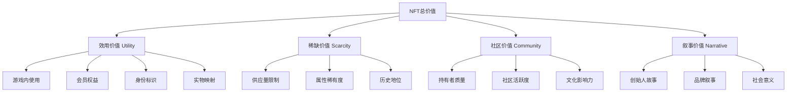

## 三、NFT深度解析

NFT（Non-Fungible Token，非同质化代币）是Web3生态中解决数字所有权问题的核心基础设施。如果说区块链解决了"信任"问题，DeFi解决了"流通"问题，那么NFT解决的就是"确权"问题——在数字世界中，如何证明"这个东西是你的"，以及"这个东西独一无二"。

本节从技术原理、标准演进、价值理论、市场生态、金融化创新到未来趋势，对NFT进行系统性深度解析。实操部分（铸造、创作、定价）请参阅"核心技巧"小节，本节聚焦理论认知和底层逻辑。

---

### 3.1 NFT的本质：从"同质化"到"非同质化"

#### 3.1.1 同质化 vs 非同质化

理解NFT的第一步，是理解"同质化"（Fungible）和"非同质化"（Non-Fungible）的根本区别：

| 维度 | 同质化代币（FT） | 非同质化代币（NFT） |
|------|------------------|---------------------|
| 互换性 | 1个BTC = 1个BTC，完全等价 | 每个NFT独一无二，不可互换 |
| 可分割性 | 可以分割为0.001个BTC | 不可分割（ERC-721），或半可分割（ERC-1155） |
| 标识 | 仅通过数量区分 | 每个有独立的tokenId |
| 类比 | 货币（100元钞票可以互换） | 房产证（每套房对应一本证） |
| 典型应用 | 货币、积分、投票权 | 艺术品、门票、游戏道具、身份凭证 |

这个区别看似简单，却决定了NFT的整个设计哲学：**NFT不是一种"资产类型"，而是一种"确权机制"**。任何需要唯一标识的数字或物理对象，都可以通过NFT来确权。

#### 3.1.2 NFT的技术定义

从技术角度，一个NFT是智能合约中的一条记录，包含以下核心信息：

```text
NFT = 智能合约地址(contractAddress) + 唯一标识(tokenId) + 所有者(owner) + 元数据(metadata)

链上存储：
  contractAddress: 0x1234...abcd（哪个合约发行的）
  tokenId: 42（第几个）
  owner: 0x5678...efgh（谁持有）

链下/链上混合存储：
  tokenURI: ipfs://QmXxx/42.json（指向元数据）
  metadata: {
    name: "My NFT #42",
    image: "ipfs://QmYyy/42.png",
    attributes: [...]
  }
```

关键点：**NFT本身不存储图片或文件**。链上存储的是所有权记录和指向元数据的指针（tokenURI），实际的媒体文件存储在IPFS、Arweave或中心化服务器上。这就是为什么"NFT图片"可能消失但"NFT所有权记录"永存的原因。

#### 3.1.3 NFT与数字所有权的革命性意义

在NFT出现之前，数字世界存在一个根本性悖论：**数字内容可以无限复制，因此无法像物理世界那样确认"唯一所有权"**。你下载一张图片和原作者持有的"原版"在数据层面完全相同，无法区分。

NFT通过区块链解决了这个悖论：

- **不可伪造**：所有权记录存储在区块链上，任何人都无法篡改。你可以复制图片文件，但无法复制区块链上的所有权记录
- **可验证**：任何人都可以通过合约地址和tokenId验证某个NFT的真伪和流转历史
- **可编程**：智能合约可以嵌入版税分配、访问控制、解锁条件等逻辑，使NFT不仅仅是"数字证书"，更是"可编程的权益载体"

但需要澄清一个常见误解：**NFT不等于版权**。购买一个NFT通常只获得该token的所有权和展示权，不自动获得作品的商业版权。除非创作者在合约或条款中明确授予，否则持有者不能将NFT图像用于商业用途（如印在T恤上销售）。

---

### 3.2 NFT技术标准深度解析

#### 3.2.1 ERC-721：NFT的奠基标准

ERC-721于2018年正式通过（EIP-721），是以太坊上第一个NFT标准，由CryptoKitties的开发者William Entriken等人提出。

**核心接口：**

```solidity
interface IERC721 {
    // 查询余额
    function balanceOf(address owner) external view returns (uint256 balance);
    
    // 查询所有者
    function ownerOf(uint256 tokenId) external view returns (address owner);
    
    // 安全转移（接收方必须实现IERC721Receiver）
    function safeTransferFrom(address from, address to, uint256 tokenId, bytes calldata data) external;
    
    // 授权单个token
    function approve(address approved, uint256 tokenId) external;
    
    // 授权所有token
    function setApprovalForAll(address operator, bool approved) external;
    
    // 查询授权状态
    function getApproved(uint256 tokenId) external view returns (address operator);
    
    // 转移事件
    event Transfer(address indexed from, address indexed to, uint256 indexed tokenId);
    event Approval(address indexed owner, address indexed approved, uint256 indexed tokenId);
}
```

**ERC-721的特点与局限：**

- 一个tokenId对应一个所有者，一对一映射
- 每次铸造/转移都是独立交易，批量操作Gas成本线性增长
- 不支持"半同质化"场景（如100张相同的演唱会门票）
- 市场占有率最高的NFT标准，CryptoPunks、BAYC、Azuki等蓝筹项目均基于此

#### 3.2.2 ERC-1155：多代币标准

ERC-1155由Enjin于2019年提出，解决了ERC-721在批量操作和多类型代币管理上的痛点。

**核心创新：**

```solidity
interface IERC1155 {
    // 批量查询余额（一次调用查多个token类型）
    function balanceOfBatch(address[] calldata accounts, uint256[] calldata ids)
        external view returns (uint256[] memory);
    
    // 批量安全转移（一次交易转移多个token）
    function safeBatchTransferFrom(
        address from, address to,
        uint256[] calldata ids,
        uint256[] calldata amounts,
        bytes calldata data
    ) external;
    
    // 单次转移（amount=1为NFT，amount>1为同质化代币）
    function safeTransferFrom(address from, address to, uint256 id, uint256 amount, bytes calldata data) external;
}
```

**ERC-1155 vs ERC-721对比：**

| 维度 | ERC-721 | ERC-1155 |
|------|---------|----------|
| 代币类型 | 仅NFT | NFT + 同质化代币混合 |
| 批量铸造 | 需要多笔交易 | 单笔交易批量铸造 |
| 批量转移 | 需要多笔交易 | 单笔交易批量转移 |
| Gas效率 | 基准 | 批量操作降低60-90% |
| 合约管理 | 每个系列一个合约 | 单合约管理多种代币 |
| 典型应用 | 蓝筹PFP、1/1艺术 | 游戏道具、版画系列、票务 |
| 元数据 | tokenId对应唯一URI | typeId对应URI，相同type共享 |

**实际应用场景：** 一个链游可能有上千种道具——剑、盾、药水、盔甲——每种有不同数量。如果用ERC-721，需要上千个合约；用ERC-1155，一个合约就能管理所有道具类型，且玩家可以一次交易批量转移多个道具。

#### 3.2.3 ERC-404：半同质化实验

ERC-404于2024年初由Pandora团队提出，试图将ERC-20（同质化代币）和ERC-721（NFT）融合到一个标准中。

**核心机制：**
- 代币本身是ERC-20，可以在DEX上像普通代币一样交易
- 每购买/持有1个完整代币，自动铸造一个NFT到持有者钱包
- 出售/转移代币时，对应的NFT自动销毁
- NFT的tokenId随持有者变化而变化（新铸造），实现"流动性NFT"

**争议与现状：** ERC-404并非EIP标准（未经以太坊社区正式审批），是实验性协议。支持者认为它解决了NFT流动性差的问题；反对者认为它模糊了FT和NFT的边界，且自动铸造/销毁的Gas成本较高。截至2024年底，ERC-404的实际采用率有限，更多被视为概念验证。

#### 3.2.4 跨链NFT标准

| 链 | 标准 | 特点 |
|----|------|------|
| Solana | SPL Token + Metaplex | 交易速度<1秒，Gas<$0.01，Magic Eden为主要市场 |
| Bitcoin | Ordinals/BRC-20 | 直接在比特币最小单位（聪）上刻写数据，无需智能合约 |
| Tezos | FA2 (TZIP-12) | 类似ERC-1155的多资产标准，艺术社区活跃 |
| Flow | NBA Top Shot NFT | 面向大规模消费者应用，Cadence编程语言 |
| Polygon | ERC-721/ERC-1155 | 与以太坊相同标准，兼容性最好，Gas极低 |

---

### 3.3 元数据与存储：NFT的"灵魂"

#### 3.3.1 元数据架构

NFT的元数据（metadata）决定了这个NFT"长什么样"和"有什么属性"。一个标准的NFT元数据结构：

```json
{
  "name": "Bored Ape #3749",
  "description": "The Bored Ape Yacht Club is a collection of 10,000 unique Bored Ape NFTs.",
  "image": "ipfs://QmeSjSinHpPnmXmspMjwiXyN6zS4E9zccariGR3jxcaWtq/3749",
  "external_url": "https://boredapeyachtclub.com/#/3749",
  "attributes": [
    {"trait_type": "Background", "value": "Aquamarine"},
    {"trait_type": "Clothes", "value": "Navy Striped Tee"},
    {"trait_type": "Earring", "value": "Gold Hoop"},
    {"trait_type": "Eyes", "value": "Sleepy"},
    {"trait_type": "Fur", "value": "Dark Brown"},
    {"trait_type": "Hat", "value": "Sea Captain's Hat"},
    {"trait_type": "Mouth", "value": "Bored Pipe"}
  ],
  "properties": {
    "files": [
      {"uri": "ipfs://QmeSjSinHpPnmXmspMjwiXyN6zS4E9zccariGR3jxcaWtq/3749.png", "type": "image/png"}
    ],
    "category": "image"
  }
}
```

**关键字段解析：**

- `name`：显示名称，通常包含系列名+编号
- `image`：主展示媒体（图片/视频封面），市场平台优先读取此字段
- `animation_url`：可选，用于动态媒体（视频、3D模型、音频），OpenSea等平台会自动渲染
- `attributes`：属性数组，是稀有度计算的基础。每个`trait_type`对应一个特征类别，`value`是具体值
- `external_url`：外部链接，通常指向项目官网或详情页
- `properties.files`：完整的文件列表，包含格式信息

#### 3.3.2 存储方案深度对比

NFT媒体文件的存储方案直接决定了NFT的持久性和可信度：

| 方案 | 存储位置 | 永久性 | 成本 | 去中心化程度 | 适用场景 |
|------|----------|--------|------|-------------|----------|
| **完全链上** | 区块链状态存储 | 极高（与链同寿） | 极高（存储=GAS） | 最高 | 生成艺术（Art Blocks Curated） |
| **Arweave** | 去中心化永久存储网络 | 高（一次性付费永久存储） | 中等（~$0.005/MB） | 高 | 需要永久保障的高价值NFT |
| **IPFS + Pinning** | 分布式存储+持续固定 | 中高（需持续pinning费用） | 低（Pinata免费5GB） | 中高 | 大多数NFT项目 |
| **Filecoin** | 去中心化存储市场 | 中高（需存储交易续约） | 低 | 高 | 大规模存储备份 |
| **中心化服务器** | 项目方服务器/S3 | 低（服务器可能关停） | 最低 | 无 | 平台Lazy Minting（OpenSea等） |

**IPFS的工作原理：**

IPFS（InterPlanetary File System，星际文件系统）使用内容寻址（Content Addressing）而非位置寻址。传统URL指向"服务器上的哪个位置"，IPFS的CID（Content Identifier）指向"哪个内容"——基于文件内容的哈希值。这意味着：

1. 只要内容不变，CID永远不变——不受服务器迁移、域名变更影响
2. 任何人持有相同文件都会得到相同CID——可验证文件完整性
3. 但IPFS不是"永久存储"——如果没有节点持续pinning（固定）这个文件，它可能从网络中消失

**实际风险案例：** 2022年，多个NFT项目因为依赖中心化存储（Figma链接、AWS S3）导致图片失效。最著名的案例是某些项目的NFT在OpenSea上显示为"此项目已被封禁"的占位图。教训：**高价值NFT必须使用IPFS或Arweave存储，且至少有2个独立的pinning服务**。

#### 3.3.3 链上存储的极致追求

少数项目追求"完全链上存储"——将图像数据直接编码存储在以太坊区块链上。这意味着即使IPFS、Arweave全部关闭，NFT的媒体文件依然存在。

**Art Blocks的实现方式：**
- 艺术家提交的是JavaScript代码（生成算法），而非最终图像
- 代码存储在合约的链上存储中
- tokenId作为随机种子输入算法，每次渲染都得到相同的输出
- 任何人可以通过运行链上代码独立验证NFT的样子

这种方式的存储成本极高（以太坊存储约$10,000/MB），因此只适用于代码量小的生成艺术项目。但对于追求绝对永久性的收藏品来说，这是最可靠的方案。

---

### 3.4 NFT分类体系

NFT的应用远不止"数字图片"。以下是完整的NFT分类体系：

#### 3.4.1 按功能分类

| 类别 | 定义 | 代表项目 | 核心价值 |
|------|------|----------|----------|
| **PFP（Profile Picture）** | 算法生成的头像系列 | BAYC、CryptoPunks、Azuki | 社区身份 + 社交资本 |
| **1/1艺术** | 单件原创数字艺术品 | Beeple "Everydays"、XCOPY | 艺术收藏 + 文化价值 |
| **生成艺术** | 代码生成的视觉作品 | Art Blocks (Chromie Squiggle, Fidenza) | 算法美学 + 稀缺性 |
| **游戏资产** | 链游中的道具、角色、土地 | Axie Infinity、Illuvium、The Sandbox | 游戏内使用价值 |
| **音乐NFT** | 代币化的音乐作品 | Sound.xyz、Royal、Audius | 流媒体分成 + 粉丝经济 |
| **域名** | 去中心化域名标识 | ENS (.eth)、Unstoppable Domains | 身份标识 + 支付地址 |
| **会员/通行证** | 社区访问凭证 | VeeFriends、PROOF Collective | 社区权益 + 活动准入 |
| **实物映射** | 对应物理世界的资产 | Courtyard (实体卡牌)、4K (奢侈品) | 实物确权 + 流动性 |
| **票务** | 活动门票的NFT化 | GET Protocol、YellowHeart | 防伪 + 转售追踪 |
| **身份/SBT** | 不可转让的身份凭证 | ENS子域名、Gitcoin Passport | 声誉系统 + 去中心化身份 |
| **RWA（Real World Assets）** | 现实世界资产代币化 | Centrifuge、Maple Finance | 传统资产链上化 |

#### 3.4.2 PFP项目的深度解析

PFP（Profile Picture）是NFT领域最成功的商业模型，值得深入理解其运作逻辑：

**为什么一张"JPEG"能值几十万美元？**

PFP的价值不是图片本身，而是三层价值的叠加：

1. **底层——链上所有权证明**：区块链保证了稀缺性和真实性。你可以复制BAYC的图片，但你无法伪造一个真正的BAYC token
2. **中层——社区网络效应**：持有BAYC = 进入一个精英社交圈。这个圈子里有企业家、明星、投资人，社区本身是高价值社交网络
3. **表层——文化符号**：BAYC已经成为Web3文化的"Logo"，类似于Supreme在街头文化中的地位

**PFP项目的成功公式：**

```text
成功PFP = 视觉辨识度 × 社区文化 × 路线图执行 × 时间沉淀

失败PFP = 精美图片 + 空洞路线图 + 无社区运营 + 快速放弃
```

**历史上的关键PFP项目时间线：**

| 时间 | 项目 | 里程碑意义 |
|------|------|-----------|
| 2017.06 | CryptoPunks | 第一个PFP项目，免费铸造，开创ERC-721范式 |
| 2021.04 | BAYC | 建立"会员俱乐部"模式，空投+线下活动+品牌联名 |
| 2021.08 | Art Blocks Curated | 生成艺术进入主流，Chromie Squiggle成为标志性作品 |
| 2021.10 | BAYC + Adidas | 第一个主流品牌NFT合作，标志传统品牌进入Web3 |
| 2022.03 | Moonbirds | PROOF Collective旗下，强调社区实用价值 |
| 2022.05 | Otherdeed (Otherside) | BAYC元宇宙土地，引发以太坊Gas War |
| 2023.01 | Bitcoin Ordinals | NFT扩展到比特币链，打开新叙事 |
| 2024.03 | Pudgy Penguins | 从NFT扩展到实体玩具（Walmart销售），证明IP变现路径 |

#### 3.4.3 游戏NFT（GameFi）的独特性

游戏NFT与其他NFT的根本区别在于：**它有明确的使用价值（utility）**。一把"NFT剑"不仅是一个收藏品，它在游戏中有攻击力、可以升级、可以交易。

**游戏NFT的设计考量：**

- **双代币模型**：治理代币（如AXS）+ 游戏代币（如SLP），前者用于投票和质押，后者用于游戏内经济
- **消耗机制**：道具需要"燃烧"（升级/合成时消耗代币或NFT），防止通货膨胀
- **地板价保护**：当NFT地板价跌破"回本周期"阈值时，玩家流失加速——这是Axie Infinity崩盘的核心原因之一
- **Play-to-Earn vs Play-and-Earn**：前者以赚钱为卖点（不可持续），后者以游戏性为卖点（可持续）

---

### 3.5 NFT价值理论

#### 3.5.1 NFT价值的四维模型

NFT的价值可以分解为四个维度，每个维度的权重因项目类型而异：



**各维度详解：**

| 维度 | 定义 | 高分表现 | 低分表现 |
|------|------|----------|----------|
| 效用价值 | NFT能"做什么" | 游戏道具、活动通行证、实体权益 | 纯图片、无任何赋能 |
| 稀缺价值 | 供应量和属性的稀缺程度 | 总量100个、稀有属性<1%概率 | 总量100000+、属性均等 |
| 社区价值 | 社区的规模、质量和文化 | 持有者包括KOL、活跃Discord、线下聚会 | 沉寂社区、持有者全是投机者 |
| 叙事价值 | 故事的吸引力和传播力 | CryptoPunks"NFT鼻祖"地位 | 无差异化的故事 |

**不同类型NFT的价值权重：**

| NFT类型 | 效用 | 稀缺 | 社区 | 叙事 |
|---------|------|------|------|------|
| PFP（蓝筹） | 20% | 25% | 35% | 20% |
| 1/1艺术 | 5% | 30% | 15% | 50% |
| 游戏道具 | 50% | 20% | 15% | 15% |
| 会员通行证 | 40% | 20% | 30% | 10% |
| 生成艺术 | 10% | 35% | 20% | 35% |

#### 3.5.2 估值方法论

NFT估值没有统一公式，但有几种实用的框架：

**地板价法（Floor Price Method）：**
- 适用场景：系列NFT的"最低估价"
- 方法：取同系列中最低挂牌价作为基准
- 局限：无法反映稀有属性的溢价

**稀有度加权法（Rarity-Weighted）：**
- 公式：估值 = 地板价 × 稀有度乘数
- 稀有度乘数 = 1 / (该属性出现概率 × 该属性类别数)
- 工具：Rarity Sniper、HowRare.is、NFTGo

**现金流折现法（DCF，适用于有收益的NFT）：**
- 适用于：音乐NFT（流媒体分成）、租赁NFT（游戏道具出租）
- 公式：PV = Σ(预期现金流_t / (1+r)^t)
- 局限：预期现金流高度不确定

**可比交易法（Comparable Sales）：**
- 方法：找近期同类型、同质量的成交记录
- 数据源：OpenSea Activity、Blur、NFTGo
- 关键：只看"真实成交"，过滤Wash Trading

#### 3.5.3 影响NFT价格的关键因素

| 因素 | 正面影响 | 负面影响 |
|------|----------|----------|
| 团队信誉 | 知名创始人/艺术家 | 匿名团队、过往项目跑路 |
| 社区活跃度 | Discord日活>10%持有者 | 社区沉寂、Discord关闭 |
| 路线图执行 | 按时交付里程碑 | 反复延期、路线图缩水 |
| 品牌合作 | 与知名品牌联名 | 合作方品牌危机 |
| 市场周期 | 牛市情绪高涨 | 熊市流动性枯竭 |
| 竞品出现 | 独特赛道无直接竞品 | 同质化项目大量涌现 |
| 监管政策 | 友好政策环境 | 打击或禁止NFT交易 |
| Gas费 | 低Gas降低交易摩擦 | 高Gas抑制交易频率 |

---

### 3.6 NFT市场生态

#### 3.6.1 市场平台全景

NFT市场已经从OpenSea一家独大演变为多平台竞争格局：

| 平台 | 链支持 | 定位 | 费用模式 | 适合人群 |
|------|--------|------|----------|----------|
| **OpenSea** | ETH/Polygon/Arbitrum/Base/Solana | 最大综合市场 | 2.5%交易费 | 入门用户、综合交易 |
| **Blur** | Ethereum | 专业交易者工具 | 0%交易费（靠Blend借贷盈利） | 专业交易者、高频操作 |
| **Magic Eden** | Solana/ETH/Polygon/Bitcoin | 多链市场 | 2%交易费 | Solana生态用户 |
| **Foundation** | Ethereum | 高端策展艺术 | 5%佣金 | 专业艺术家 |
| **SuperRare** | Ethereum | 精品画廊 | 15%首售/3%二级 | 顶级艺术家 |
| **Rarible** | 多链 | 社区驱动 | 2.5%（买方+卖方各1%） | 各层级创作者 |
| **Zora** | Zora Network (L2) | 创作者经济 | 0%平台费 | 技术型创作者 |
| **Tensor** | Solana | Solana专业交易 | 0%（靠Tensorians NFT） | Solana专业交易者 |
| **Objkt** | Tezos | Tezos艺术社区 | 2.5% | 独立艺术家、入门者 |

**Blur的颠覆性影响：** Blur在2022年底推出后迅速抢占市场份额，其策略是：零交易费 + 专业交易工具（地板价扫货、批量操作、实时数据分析）+ 空投激励。这迫使OpenSea降低费用并推出OpenSea Pro（收购的Gem聚合器）。Blur的Blend协议更将NFT与DeFi结合，允许用户用NFT作为抵押品借贷ETH，开创了NFT-Fi赛道。

#### 3.6.2 NFT聚合器

聚合器本身不托管NFT，而是聚合多个市场的挂单，让用户在一个界面找到最优价格：

- **Blur**：同时是市场+聚合器，聚合OpenSea、LooksRare、X2Y2等挂单
- **Gem（已被OpenSea收购）**：早期最流行的聚合器，现为OpenSea Pro
- **Reservoir**：开源NFT订单聚合协议，提供API供开发者使用

#### 3.6.3 链上数据分析工具

| 工具 | 功能 | 价格 | 适合人群 |
|------|------|------|----------|
| **NFTGo** | 全面的NFT数据分析：市值、交易量、鲸鱼追踪 | 免费+Pro版 | 综合分析 |
| **Nansen** | "聪明钱"（Smart Money）追踪，地址标签化 | $150+/月 | 专业投资者 |
| **Dune Analytics** | 自定义SQL查询链上数据，社区Dashboard | 免费 | 技术型用户 |
| **Rarity Sniper** | NFT稀有度排名查询 | 免费 | 稀有度判断 |
| **HowRare.is** | Solana NFT稀有度查询 | 免费 | Solana生态 |
| **Arkham** | 实体级地址追踪和资金流分析 | 免费+Pro | 安全研究、合规 |

---

### 3.7 NFT金融化：从收藏品到金融资产

NFT金融化（NFT-Fi）是2023年以来最重要的创新方向，它将流动性差的NFT转化为可交易、可抵押、可拆分的金融资产。

#### 3.7.1 NFT借贷

**核心逻辑：** 持有蓝筹NFT但不想卖出？将其作为抵押品借出ETH。

| 协议 | 模式 | 特点 | 风险 |
|------|------|------|------|
| **Blend（Blur）** | 点对点，无固定期限 | 最大NFT借贷协议，贷款人出价，借款人接受 | 借款人被清算风险 |
| **Bend DAO** | 点对池（类似Aave） | 存入NFT借ETH，流动性池定价 | 地板价暴跌时触发连锁清算 |
| **NFTfi** | 点对点，固定期限 | 最早的NFT借贷协议，利率由双方协商 | 到期不还则NFT归贷方 |
| **JPEG'd** | 点对池 + CDP | 类似MakerDAO，铸造稳定币pUSD | 债仓清算风险 |

**借贷的关键指标：**
- 贷款价值比（LTV）：通常30-50%（蓝筹NFT可达50%）
- 清算阈值：当NFT地板价跌到贷款金额的某个倍数时触发清算
- 利率：点对点模式通常50-150% APR（因为NFT流动性差，风险高）

#### 3.7.2 NFT碎片化（Fractionalization）

将一个高价值NFT拆分为多个ERC-20代币，让更多人可以"部分持有"。

**代表协议：**
- **Fractional.art（现Tessera）**：将NFT存入金库，铸造对应数量的ERC-20代币
- **PartyBid**：集体出资竞拍NFT，按出资比例分配所有权

**实际案例：** 2021年，一个DAO集体购买了Wu-Tang Clan的专辑《Once Upon a Time in Shaolin》的NFT，通过碎片化代币让数千人共同持有这张价值400万美元的专辑。

#### 3.7.3 NFT永续合约

类似加密货币的永续合约，但标的是NFT地板价指数：

- **NFTPerp**：允许做多/做空NFT地板价，杠杆最高10倍
- 标的通常是蓝筹项目的地板价指数（基于Chainlink预言机）

#### 3.7.4 NFT租赁

游戏道具、虚拟土地、会员资格等有使用价值的NFT可以出租：

- **reNFT**：NFT租赁协议，支持时间锁定的租赁
- **Double Protocol**：专注于GameFi和Metaverse的NFT租赁
- 典型场景：游戏玩家出租高等级角色给新手使用，按时间收费

---

### 3.8 NFT的局限性与争议

客观认识NFT的局限性，才能做出理性判断：

#### 3.8.1 版权困境

**问题：** NFT的链上记录只证明"谁持有这个token"，不自动包含作品版权。多数NFT项目的法律条款（Terms of Service）明确：购买NFT不等于购买版权。

**各项目的版权立场差异巨大：**

| 项目 | 版权政策 | 说明 |
|------|----------|------|
| CryptoPunks | 无明确版权许可 | Larva Labs保留版权，持有者仅有展示权 |
| BAYC | 完整商业使用权 | 持有者可以用猿猴形象做任何商业用途（如餐厅、动画） |
| CC0项目（Nouns、Cryptoadz） | 公共领域 | 任何人可以使用，无需持有NFT |
| Azuki | 有限商业许可 | 持有者可商业使用，但有范围限制 |

#### 3.8.2 环保争议

2021-2022年，NFT因以太坊的工作量证明（PoW）共识机制被批评为"高碳排放"。但以太坊在2022年9月完成"The Merge"（从PoW转向PoS），能耗降低了约99.95%。当前以太坊的能耗已不再是一个有效的环保批评理由。

#### 3.8.3 Wash Trading（刷量交易）

Wash Trading是NFT市场最大的数据污染源：交易者自己卖给自己，制造虚假的高交易量和价格上涨信号。

**如何识别Wash Trading：**
- 同一地址在短时间内反复买卖同一个NFT
- 买家和卖家地址的资金来源相同
- 交易价格显著偏离市场价（偏高或偏低）
- 工具：NFTGo的"Wash Trading Filter"、Nansen的地址标签

#### 3.8.4 流动性问题

大多数NFT的流动性极差——不像ERC-20代币可以在DEX上即时交易，NFT的挂单可能数周甚至数月无人购买。数据显示，95%以上的NFT项目最终流动性趋近于零。

**NFT流动性数据（2024年）：**
- 每日活跃交易的NFT系列通常不超过100个
- 蓝筹项目（地板价>$1000）的平均换手周期约为30-60天
- 长尾项目的挂单成交率不到1%

#### 3.8.5 市场周期性

NFT市场与加密货币市场高度相关，且波动更大：

| 时期 | 特征 | 标志性事件 |
|------|------|-----------|
| 2021.08 NFT Summer | 月交易量达$60亿+ | BAYC铸造、Art Blocks爆发 |
| 2022.01 峰值 | OpenSea月交易量$50亿 | Azuki、Moonbirds创下纪录 |
| 2022.06 崩盘 | 交易量跌至峰值的5% | LUNA崩盘、三箭资本破产 |
| 2023 漫长寒冬 | 交易量维持在峰值的5-10% | Blur空投短暂提振后回落 |
| 2024 复苏 | 交易量回升，Bitcoin Ordinals热 | Pudgy Penguins实体化、ETF预期 |

---

### 3.9 NFT的未来演进方向

#### 3.9.1 动态NFT（dNFT）

动态NFT的元数据可以根据外部条件自动变化，是NFT从"静态收藏品"向"可编程资产"演进的关键：

```text
动态NFT触发机制：
├── 时间触发：NFT形象随时间老化、季节变化
├── 事件触发：持有者完成成就后解锁新外观
├── 预言机触发：天气NFT随真实天气变化，体育NFT随比赛结果更新
├── 交互触发：持有者投票决定NFT下一步演化方向
└── 跨链触发：NFT在不同链上的状态同步
```

**技术实现：** tokenURI指向一个API端点（而非静态IPFS文件），API根据Chainlink预言机、链上事件或自定义逻辑返回不同的元数据JSON。

#### 3.9.2 灵魂绑定代币（SBT）

Vitalik Buterin在2022年提出的概念：不可转让的NFT，代表持有者的身份、声誉、成就。

**SBT的应用场景：**
- 学历证书（大学颁发的链上学位）
- 工作经历（公司颁发的链上雇佣证明）
- 信用评分（DeFi借贷历史）
- 参与证明（参加过某个活动的记录）
- 治理身份（DAO成员身份）

SBT解决了传统NFT的一个根本问题：当一切都可以交易时，"持有"本身就不包含任何信息。SBT通过"不可转让"赋予链上身份以意义。

#### 3.9.3 RWA（Real World Assets）NFT化

将现实世界的资产（房产、债券、大宗商品、艺术品）代币化为NFT，是NFT最大的增长叙事：

| RWA类型 | 代表项目 | 运作方式 |
|---------|----------|----------|
| 房产 | Lofty.ai、RealT | 房产产权碎片化为NFT，持有者获得租金收益 |
| 债券/票据 | Centrifuge、Maple | 将现实世界应收账款代币化 |
| 奢侈品 | Courtyard、4K | 实物卡牌/手表存入托管库，铸造对应NFT |
| 艺术品 | Masterworks | 传统艺术品份额化（虽然不是纯NFT方案） |
| 碳信用 | Toucan、KlimaDAO | 碳排放额度代币化 |

RWA的挑战在于：需要链下信任机制（托管、审计、法律框架），这与区块链"去信任"的初衷存在张力。但RWA的潜在市场规模远超当前NFT市场（全球房地产价值超过$300万亿），因此被视为NFT的"杀手级应用"方向。

#### 3.9.4 NFT与AI的融合

AI正在从多个维度重塑NFT生态：

- **AI生成NFT**：Midjourney、DALL-E、Stable Diffusion降低了创作门槛，但引发了"AI艺术是否算真艺术"的社区争论
- **AI策展与推荐**：AI分析持有者行为和偏好，推荐可能感兴趣的NFT
- **AI驱动的动态NFT**：NFT的视觉/属性由AI模型实时生成，每个持有者看到的内容可能不同
- **AI Agent持有NFT**：AI Agent自主购买、交易NFT，甚至创作自己的NFT系列

---

### 3.10 关键概念速查表

| 概念 | 英文 | 定义 |
|------|------|------|
| 非同质化代币 | Non-Fungible Token | 独一无二的区块链代币，代表特定资产的所有权 |
| 铸造 | Minting | 将内容写入区块链创建NFT的过程 |
| 地板价 | Floor Price | 同系列NFT的最低挂牌价 |
| 稀有度 | Rarity | NFT属性的稀缺程度，影响市场价值 |
| 版税 | Royalties | 二级市场交易时创作者获得的分成比例 |
| Gas费 | Gas Fee | 区块链交易的手续费 |
| 元数据 | Metadata | NFT的描述信息（名称、图片、属性等） |
| IPFS | InterPlanetary File System | 分布式存储网络，NFT媒体的主流存储方案 |
| 白名单 | Whitelist | 允许提前铸造的地址列表 |
| 空投 | Airdrop | 免费向持有者分发新NFT或代币 |
| 蓝筹 | Blue Chip | 公认的高价值、高流动性NFT项目 |
| 洗盘交易 | Wash Trading | 自己卖给自己制造虚假交易量 |
| 元宇宙 | Metaverse | 虚拟世界，NFT是其中的资产载体 |
| 链上生成 | On-chain Art | 艺术数据完全存储在区块链上的NFT |
| 灵魂绑定 | Soulbound Token | 不可转让的NFT，代表身份或成就 |

***

> **本节核心认知：** NFT不是"图片"，而是"可编程的数字所有权凭证"。理解NFT需要从技术标准（ERC-721/1155）、存储架构（链上/链下）、价值理论（效用/稀缺/社区/叙事）、市场生态（平台/聚合器/工具）和金融化创新（借贷/碎片化/租赁）五个维度系统把握。NFT市场周期性极强，绝大多数项目会归零，但"数字所有权"这个底层范式不会消失——它正在从PFP头像向RWA、身份、票务等更广阔的领域扩展。
