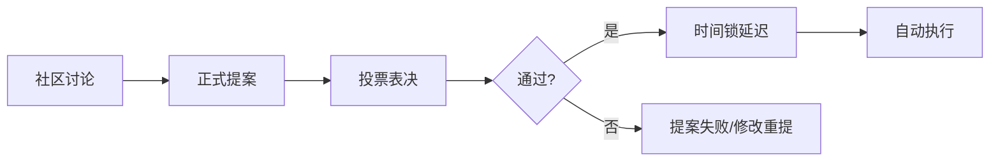
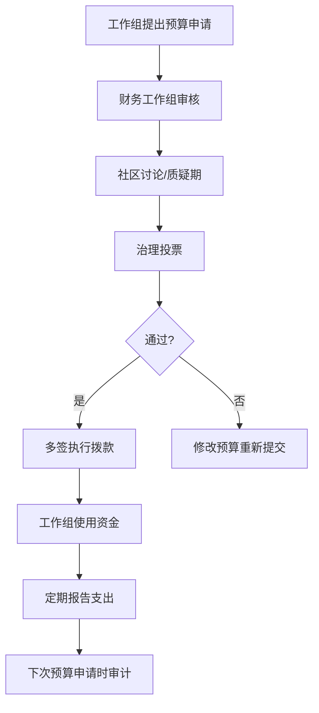

## 四、DAO的概念与治理

### 1. 什么是DAO

DAO（Decentralized Autonomous Organization，去中心化自治组织）是一种基于区块链智能合约运行的组织形式。它没有传统公司中的CEO、董事会或人力资源部门，取而代之的是：**规则写在代码里，决策由成员投票做，资金由合约管，执行靠程序自动完成。**

用一个简单的比喻理解：传统公司像一台需要人操控的机器，DAO像一台设定了程序后能自动运转的机器。但"自动运转"并不意味着不需要人——DAO的成员通过提案和投票来设定这台机器的运行参数。

#### 1.1 DAO的核心特征

| 特征 | 传统公司 | DAO |
|------|----------|-----|
| 组织结构 | 金字塔层级 | 扁平网络 |
| 决策方式 | 管理层自上而下 | 代币持有者投票 |
| 规则载体 | 公司章程、合同 | 智能合约代码 |
| 资金管理 | 财务部门、银行账户 | 多签钱包、合约金库 |
| 透明度 | 内部可见 | 链上完全公开 |
| 准入门槛 | 雇佣关系 | 持有代币即可参与 |
| 地域限制 | 注册地法律管辖 | 全球无边界 |
| 修改规则 | 董事会决议 | 链上提案投票 |

#### 1.2 DAO的起源与发展

DAO的概念可以追溯到比特币社区的治理实践，但真正的里程碑事件是2016年"The DAO"事件：

**2013年** — Daniel Larimer（EOS创始人）首次提出DAC（Decentralized Autonomous Company）概念。

**2014年** — 以太坊创始人Vitalik Buterin在其白皮书中系统阐述了DAO的理念，将其定义为"一个在去中心化网络上运行的、由代码规则管理的实体"。

**2016年4月** — "The DAO"项目在以太坊上启动，通过ICO筹集了约1.5亿美元的ETH（当时约1200万个ETH，占ETH总供应量的14%），成为历史上最大的众筹项目之一。

**2016年6月** — The DAO因智能合约漏洞被黑客攻击，约360万个ETH（当时约6000万美元）被转移。这一事件直接导致了以太坊的硬分叉，分裂为ETH和ETC两条链。

**2020-2021年** — DeFi Summer和NFT热潮推动DAO大规模复兴。Uniswap、Aave、Compound等协议的治理代币分发使数百万用户首次接触DAO治理。

**2021年** — ConstitutionDAO在72小时内筹集4700万美元试图竞拍美国宪法副本，虽然竞拍失败，但证明了DAO的快速组织能力。

**2022年至今** — DAO工具基础设施成熟，治理模型多样化，法律框架逐步明确。

### 2. DAO的治理机制

治理是DAO的核心——它决定了组织如何做出决策、如何分配资源、如何解决争议。

#### 2.1 治理的基本流程



**第一步：社区讨论（Off-chain Discussion）**

提案在正式提交前，通常会在论坛（如Discourse）或Discord中进行社区讨论。这一步没有链上成本，目的是收集反馈、完善方案。一个好的讨论帖通常包括：问题描述、解决方案、资源需求、预期影响、风险分析。

**第二步：正式提案（Proposal Submission）**

提案上链通常需要满足最低代币持有量门槛（如Uniswap要求持有250万UNI代币才能提交治理提案）。提案内容写入智能合约，包含目标合约调用、参数设置等。

**第三步：投票表决（Voting）**

投票期通常为3-7天。不同DAO有不同的通过标准：
- **简单多数**：赞成票 > 反对票
- **法定人数制**：赞成票需达到总代币供应量的一定比例（如4%）
- **双重门槛**：同时满足多数票和法定人数

**第四步：时间锁延迟（Timelock）**

通过的提案不会立即执行，通常有24-48小时的延迟期。这是一个安全机制，给社区最后的机会发现潜在问题并紧急刹车。

**第五步：自动执行（Execution）**

时间锁期满后，任何人都可以调用执行函数，将提案的变更写入链上。这是DAO"自治"的核心体现——不需要任何管理者签字批准。

#### 2.2 常见投票机制

**（1）代币投票（Token Voting）**

最简单直接的方式：1个代币 = 1票。持有越多，投票权越大。

- 优点：实施简单，激励长期持有
- 缺点：富豪治理（plutocracy），大户可以压倒性控制决策
- 典型案例：Uniswap、Compound

**（2）二次方投票（Quadratic Voting）**

投票成本随票数的平方增长。投1票花1个代币，投2票花4个，投3票花9个。这使得集中大量票数的成本极高，鼓励更广泛的参与。

数学表达：n票的成本 = n²

- 优点：保护少数派声音，防止富豪垄断
- 缺点：存在Sybil攻击风险（一人创建多个钱包分摊成本）
- 典型案例：Gitcoin Grants的资助分配

**（3）信念投票（Conviction Voting）**

不设固定的投票窗口，成员可以随时表达偏好，且偏好会随时间积累权重。你对某个提案"坚持"得越久，你的投票权重越大。

- 优点：避免了投票时间窗口的操控，奖励长期信念
- 缺点：决策速度慢，不适合紧急事务
- 典型案例：1Hive、Panvala

**（4）全息共识（Holographic Consensus）**

由DAOstack提出。大多数提案不需要全社区投票——只有被预测市场"标记"为重要的提案才会进入全社区投票。这解决了投票疲劳问题。

- 优点：高效处理大量提案，减少投票疲劳
- 缺点：机制复杂，预测市场可能被操纵
- 典型案例：DAOstack框架

**（5）乐观治理（Optimistic Governance）**

假设所有提案都是善意的，提案通过后有挑战期。如果没有人挑战，提案自动执行；如果有人挑战，则进入正式投票。类似于"无罪推定"。

- 优点：极大提高效率，大多数无争议的变更可以快速通过
- 缺点：需要活跃的挑战者社区来制衡
- 典型案例：Optimism Collective

**（6）委托投票（Delegated Voting / Liquid Democracy）**

代币持有者可以将自己的投票权委托给信任的代表，代表代替他们投票。委托可以随时撤回或转移。这是一种介于直接民主和代议制民主之间的模式。

- 优点：让不活跃的持币者也能通过代表参与治理
- 缺点：可能导致权力集中到少数"超级代表"
- 典型案例：MakerDAO、Gitcoin

#### 2.3 治理代币设计

治理代币是DAO治理的"选票"，其设计直接影响治理质量：

| 设计维度 | 选项 | 适用场景 |
|----------|------|----------|
| 发行方式 | 公平启动 / 预挖 / 渐进释放 | 公平启动适合社区驱动型 |
| 分配结构 | 集中 vs 分散 | 分散型治理更去中心化 |
| 投票权曲线 | 线性 / 二次方 / 对数 | 二次方防大户垄断 |
| 锁仓激励 | veToken模型 | 长期利益绑定 |
| 委托机制 | 可委托 / 不可委托 | 提高参与率 |
| 提案门槛 | 高 / 低 | 高门槛防垃圾提案 |

**veToken模型（投票托管代币）**

由Curve Finance开创的创新设计。用户将治理代币锁定一段时间（最长4年），获得veToken（投票托管代币）。锁定时间越长，获得的veToken越多，投票权和收益加成也越大。

Curve的veCRV模型：锁定1年获得0.25倍veCRV，锁定4年获得1倍veCRV。veCRV持有者可以投票决定哪些流动性池获得更高的CRV排放权重，这直接影响各协议的收益——催生了所谓的"Curve Wars"。

### 3. DAO的组织架构

#### 3.1 常见DAO类型

**（1）协议DAO（Protocol DAO）**

管理去中心化协议的核心参数和升级。是最成熟、资金最雄厚的DAO类型。

- MakerDAO：管理DAI稳定币系统的参数（抵押率、稳定费率等）
- Uniswap：管理DEX协议的费用开关、跨链部署等
- Aave：管理借贷协议的风险参数、新资产上线

**（2）投资DAO（Investment DAO / Venture DAO）**

成员汇集资金，共同进行投资决策。类似于去中心化的VC基金。

- The LAO：以太坊上第一个法律合规的投资DAO
- MetaCartel Ventures：专注于早期DApp投资
- Flamingo DAO：专注于NFT投资和策展

**（3）赠款DAO（Grants DAO）**

分配资金支持生态系统中的公共物品和开源项目。

- Gitcoin：通过二次方资助机制分配以太坊生态赠款
- Moloch DAO：专注于以太坊基础设施资助
- Uniswap Grants：支持Uniswap生态系统发展

**（4）社交DAO（Social DAO）**

围绕社区和社交活动组织的DAO，通常需要通过申请或持有特定NFT才能加入。

- Friends With Benefits（FWB）：社交俱乐部，需要持有FWB代币
- BanklessDAO：围绕Bankless媒体品牌建立的社区
- Developer DAO：面向Web3开发者的社区

**（5）收藏DAO（Collector DAO）**

集体购买和管理高价值资产，通常是NFT。

- PleasrDAO：以集体形式购买具有文化意义的数字资产
- ConstitutionDAO：试图竞拍美国宪法副本
- Flamingo：NFT收藏和策展

**（6）创作者DAO（Creator DAO）**

为创作者及其粉丝社区服务，将创作者经济与去中心化治理结合。

- Mirror：去中心化出版平台，使用WRITE代币治理
- Songcamp：音乐创作者协作DAO

**（7）服务DAO（Service DAO）**

类似于去中心化的人才机构/咨询公司，成员协作完成项目。

- RaidGuild：Web3产品设计和开发
- LexDAO：法律工程和智能合约审计
- DAOhaus：DAO工具和咨询服务

#### 3.2 DAO的内部结构

DAO虽然号称"扁平"，但实际上通常有更细致的内部结构：

```text
DAO整体
├── 核心团队（Core Contributors）
│   ├── 技术团队
│   ├── 运营团队
│   └── 治理协调人（Governance Facilitator）
├── 工作组/公会（Working Groups / Guilds）
│   ├── 开发公会
│   ├── 营销公会
│   ├── 财务公会
│   └── 治理公会
├── 委员会（Committees）
│   ├── 风险委员会
│   ├── 拨款委员会
│   └── 战略委员会
└── 普通成员（Token Holders）
```

**工作组模式**是当前最流行的DAO内部组织方式。MakerDAO将其称为"核心单元"（Core Units），每个核心单元负责一个特定领域（如风险评估、前端开发、增长策略），有自己的预算和人员，对DAO整体负责。

### 4. DAO的金库管理

DAO金库（Treasury）是组织运作的经济基础，管理金库是治理的核心职能之一。

#### 4.1 金库的典型构成

| 资产类型 | 说明 | 占比建议 |
|----------|------|----------|
| 原生治理代币 | DAO自身的代币 | 不超过60%（避免单一资产风险） |
| 稳定币 | USDC、DAI等 | 20-40%（保障运营资金） |
| 主流加密资产 | ETH、BTC | 5-15%（长期储备） |
| LP头寸 | 流动性提供 | 根据需求 |
| NFT/其他 | 特殊资产 | 视情况 |

#### 4.2 金库管理工具

**多签钱包（Multisig）**

Gnosis Safe是最广泛使用的多签钱包。一个典型的DAO金库设置为：5人中至少3人签名才能执行交易（3-of-5多签）。这是中心化控制和去中心化安全之间的平衡点。

**资金流管理**

Superfluid和Sablier等协议支持流式支付——资金像水龙头一样持续流出，而不是一次性转账。这适合向贡献者发放工资或进行持续性资助。

**预算分配流程**



### 5. 创建DAO的实操指南

#### 5.1 创建DAO的步骤

**第一步：明确目标和范围**

在创建DAO之前，回答以下问题：
- 这个DAO要解决什么问题？（投资、治理协议、社交、收藏）
- 需要去中心化吗？如果只是协作，也许多签钱包就够了。
- 目标成员是谁？如何吸引他们加入？
- 初始资金来源是什么？

**第二步：选择技术栈**

| 方案 | 适用场景 | 难度 |
|------|----------|------|
| DAOhaus + Moloch | 投资DAO、赠款DAO | 低（无代码） |
| Aragon | 通用DAO | 中（低代码） |
| Snapshot + Gnosis Safe | 投票+金库组合 | 中 |
| Tally + Governor合约 | 协议级治理 | 高（需开发） |
| 自定义合约 | 特殊需求 | 很高 |

**第三步：设计治理参数**

需要确定的关键参数：
- 投票代币的总供应量和分配方案
- 提案所需的最低代币持有量
- 投票期的长度（通常3-7天）
- 通过所需的法定人数和多数比例
- 时间锁延迟长度
- 多签钱包的签名人和阈值

**第四步：部署和启动**

以Snapshot + Gnosis Safe为例的最常见部署流程：

1. 在Gnosis Safe上创建多签钱包（建议5个签名者，3-of-5阈值）
2. 部署ERC-20治理代币合约
3. 在Snapshot上创建空间，关联代币合约
4. 设置投票策略和提案规则
5. 建立Discourse论坛用于提案讨论
6. 建立Discord服务器用于日常沟通

**第五步：运营和迭代**

DAO不是"部署完就完事"的项目，持续运营才是最大的挑战。需要：
- 定期社区会议（通常每周或每两周）
- 清晰的贡献激励机制
- 活跃的治理讨论
- 定期的财务报告和审计

#### 5.2 常用DAO工具栈

| 类别 | 工具 | 用途 |
|------|------|------|
| 治理框架 | Snapshot | 链下投票（无Gas费） |
| 治理框架 | Tally | 链上投票仪表板 |
| 金库管理 | Gnosis Safe | 多签钱包 |
| 提案讨论 | Discourse | 论坛式讨论 |
| 沟通协作 | Discord | 实时沟通 |
| 贡献追踪 | Coordinape | 同行评估贡献分配 |
| 薪资发放 | Parcel | 批量支付和预算管理 |
| 流式支付 | Sablier / Superfluid | 持续性资金流 |
| 身份验证 | POAP | 参与证明 |
| 身份聚合 | ENS + Gitcoin Passport | 去中心化身份 |
| 资助管理 | Gitcoin Grants | 二次方资助 |

### 6. DAO参与指南

#### 6.1 如何加入一个DAO

**第一步：选择合适的DAO**

根据你的兴趣和技能选择：
- 想投资？关注投资DAO（The LAO、MetaCartel Ventures）
- 想社交？关注社交DAO（FWB、BanklessDAO）
- 想做开发？关注开发者DAO（Developer DAO、ETHGlobal）
- 想支持公共物品？关注赠款DAO（Gitcoin、Moloch）

**第二步：获取准入资格**

不同DAO的准入方式不同：
- 持有代币：在DEX上购买治理代币
- 持有NFT：购买DAO的会员NFT
- 申请加入：填写申请表，通过审核
- 贡献获取：通过贡献工作获得代币或NFT

**第三步：参与治理**

- 阅读DAO的治理文档和论坛
- 在讨论帖中参与提案讨论
- 对提案进行投票
- 提交自己的提案（通常需要积累一定的声誉和代币）

#### 6.2 DAO贡献者激励

DAO中的贡献通常通过以下方式激励：

**（1）赏金制（Bounties）**

DAO发布具体任务和报酬，贡献者认领并完成。适合明确、独立的任务。

**（2）同行评估（Peer Review）**

贡献者互相评估彼此的贡献，据此分配代币奖励。Coordinape是这个领域的代表性工具——每个贡献者获得一定数量的"礼物圈"代币，分发给其他贡献者，最终按收到的代币比例分配奖池。

**（3）固定薪资**

核心贡献者按月领取固定薪资，通常以稳定币+治理代币组合支付。

**（4）流式支付**

通过Sablier等协议，贡献者按秒/分钟接收报酬，随时可以提取。

### 7. DAO面临的挑战与风险

#### 7.1 治理攻击

**投票权购买攻击**

攻击者可以在投票期间大量买入代币获得投票权，投票结束后立即卖出。防御措施包括：
- 快照机制：在提案提交时记录代币余额，投票期间的买卖不影响投票权
- 时间加权：持有时间越长，投票权越大

**闪电贷治理攻击**

2022年Beanstalk DAO遭受了约1.82亿美元的闪电贷攻击。攻击者通过闪电贷借入大量代币，在单个交易内通过恶意提案，然后归还贷款。防御措施包括：
- 提案延迟执行（时间锁）
- 要求代币在提案提交前就已持有

**贿赂攻击**

攻击者通过链上或链下贿赂来购买投票。veToken模型可以缓解这个问题——锁定代币意味着放弃短期流动性，接受贿赂的成本更高。Hidden Hand等平台将贿赂透明化和市场化。

#### 7.2 治理参与率低

大多数DAO的投票参与率极低——通常不到10%的代币持有者会参与投票。原因包括：
- 投票成本（Gas费）
- 信息获取成本高（需要理解每个提案的技术细节）
- 投票疲劳（提案太多）
- "搭便车"心理（个人一票影响微乎其微）

解决方案：
- 委托投票：让活跃的代表代替不活跃的持币者投票
- 链下投票（Snapshot）：消除Gas费
- 激励投票：对参与投票的人给予代币奖励
- 简化提案：降低理解门槛

#### 7.3 法律与合规

DAO在法律上的地位仍然模糊，主要风险包括：

**责任归属不明确** — 如果DAO被起诉，谁是被告？在2022年的一个判例中（Ooki DAO案），美国CFTC认定DAO的代币持有者可能承担无限连带责任。

**税务处理复杂** — DAO的收入、支出、代币分配在不同国家的税务处理方式不同。

**监管趋严** — 各国逐步将DAO纳入监管框架。

各地区DAO相关立法进展：
- **美国怀俄明州**：2021年通过DAO法案，允许DAO注册为LLC
- **美国马绍尔群岛**：2022年通过DAO法案，承认DAO为法律实体
- **美国佛蒙特州**：允许区块链有限责任公司（BBLLC）
- **瑞士**：通过协会形式实现DAO的法律包装
- **开曼群岛**：基金会结构常用于DAO的法律包装
- **新加坡**：基金会结构常见，但尚无专门DAO立法

### 8. 典型DAO案例深度解析

#### 8.1 MakerDAO

**基本情况**
- 成立时间：2017年
- 功能：管理DAI稳定币系统
- 金库规模：数十亿美元
- 治理代币：MKR

**治理结构**

MakerDAO采用"代表民主"模式。MKR持有者可以将投票权委托给代表（Delegate），代表代替他们进行日常治理。对于重大决策（如宪法修改），则需要全社区投票。

MakerDAO将治理分为两个层面：
- **战略治理**：重大决策，如添加新的抵押资产类型、修改系统核心参数
- **日常治理**：调整稳定费率、债务上限等常规参数

**治理流程**

MakerDAO的治理周期为14天：
- 第1-3天：治理民意调查（非约束性投票，确定社区偏好）
- 第4-7天：行政投票（约束性投票，决定是否执行变更）
- 第8-14天：执行期和下一周期准备

#### 8.2 Uniswap

**基本情况**
- 成立时间：2020年（UNI代币分发）
- 功能：去中心化交易所治理
- 金库：持有约40%的UNI代币供应
- 治理代币：UNI

**治理特点**

Uniswap采用标准的Governor + Timelock架构：
- 提案门槛：250万UNI（约总供应的0.25%）
- 投票期：7天
- 法定人数：4000万UNI
- 时间锁：2天

Uniswap的治理相对保守——大多数协议参数变更需要经过长时间的讨论和多次投票。这反映了协议级DAO对安全性的高度重视。

#### 8.3 Nouns DAO

**基本情况**
- 成立时间：2021年
- 功能：NFT收藏与公共物品资助
- 机制：每天拍卖一个Nouns NFT，拍卖所得进入金库
- 治理：每个NFT = 一票

**创新点**

Nouns DAO开创了"NFT即治理权"的模式。每天只有一个Nouns NFT被拍卖，拍卖收入进入DAO金库。NFT持有者可以对金库使用提出提案并投票。这种模式将持续的收入来源（每日拍卖）与治理权绑定，创造了一个自我维持的治理循环。

截至2024年，Nouns DAO已通过数百个提案，资助范围从Nouns品牌IP授权到公共物品捐赠。

### 9. DAO与传统组织的对比分析

| 维度 | DAO | 传统公司 | 合作社 |
|------|-----|----------|--------|
| 所有权 | 代币持有者 | 股东 | 社员 |
| 决策权 | 代币加权投票 | 股东大会+董事会 | 一人一票 |
| 利润分配 | 代币增值/分红 | 股息/股价 | 按交易量返还 |
| 透明度 | 链上完全透明 | 年报/季报 | 内部可见 |
| 法律地位 | 多数地区不明确 | 公司法人 | 合作社法 |
| 参与门槛 | 低（买代币即可） | 高（需投资机构资质） | 中（需申请） |
| 执行速度 | 提案+投票（数天到数周） | 董事会决定（快） | 社员大会（慢） |
| 跨境能力 | 天然无边界 | 需设子公司 | 受地域限制 |

### 10. DAO的未来趋势

**（1）模块化治理**

DAO的治理组件（投票、金库、身份、声誉）正在模块化，像乐高积木一样可以自由组合。Aragon V3、DAOstack 2.0等框架都在朝这个方向发展。

**（2）AI辅助治理**

利用AI技术分析提案影响、预测投票结果、自动检测恶意提案。Snapshot已开始集成AI分析工具。

**（3）法律实体包装**

越来越多的DAO选择在对DAO友好的司法管辖区注册法律实体（如开曼基金会、怀俄明DAO LLC），以便与传统世界交互（签订合同、开设银行账户）。

**（4）子DAO和联邦制**

大型DAO正在分解为子DAO（Sub-DAO），每个子DAO负责特定领域，拥有自己的预算和决策权，同时对母DAO负责。这类似于联邦制国家的中央-地方关系。

**（5）跨链治理**

随着多链生态的发展，DAO需要在多条链上同步治理状态。跨链消息协议（如LayerZero、Axelar）正在使这成为可能。

**（6）声誉治理**

纯代币投票正在被混合模型补充——不仅考虑代币持有量，还考虑历史贡献、参与度、专业领域等因素。Gitcoin Passport和POAP等身份/声誉基础设施是这一趋势的基础。

### 11. 常见误区与纠正

**误区一："DAO就是完全去中心化的"**

纠正：大多数DAO并非完全去中心化。创始团队通常保留大量代币，核心开发团队拥有事实上的影响力。去中心化是一个光谱，不是一个开关。正确的做法是逐步去中心化（Progressive Decentralization），在组织成熟后逐步移交控制权。

**误区二："代码即法律，不需要人类判断"**

纠正：The DAO事件证明了纯代码治理的脆弱性。现实中的DAO治理需要人类判断来处理代码无法预见的情况。"代码即法律"应该理解为"代码是执行层，人类判断是决策层"。

**误区三："持有治理代币就是在投资"**

纠正：许多治理代币被设计为治理工具而非投资品。Uniswap的UNI代币明确声明没有经济权利（不享有协议收入分成）。购买治理代币的首要动机应该是参与治理，而非投机。

**误区四："DAO不需要领导者"**

纠正：没有领导者的DAO往往效率极低。成功的DAO都有事实上的领导者或领导团队——他们通过专业能力和社区信任获得影响力，而非通过正式任命。Vitalik之于以太坊、Hayden Adams之于Uniswap，都是这种"去中心化领导力"的体现。

**误区五："参与DAO治理没有成本"**

纠正：参与治理有显著的时间和注意力成本。每个提案都需要理解其背景、影响和技术细节。投票疲劳是真实存在的问题。委托投票是不活跃持币者的最佳选择——找到你信任的代表，把投票权委托给他们。

### 12. DAO安全检查清单

在参与或创建DAO时，检查以下安全要素：

- [ ] 智能合约是否经过审计（如OpenZeppelin、Trail of Bits）
- [ ] 是否有时间锁机制（防止恶意提案立即执行）
- [ ] 多签钱包的阈值是否合理（如3-of-5、5-of-9）
- [ ] 提案门槛是否足够高（防止垃圾提案泛滥）
- [ ] 是否有紧急暂停机制（应对安全事件）
- [ ] 代币分配是否合理（防止过度集中）
- [ ] 是否有宪法或治理文档（明确治理原则和边界）
- [ ] 财务报告是否定期公开
- [ ] 社区沟通渠道是否透明和活跃
- [ ] 是否考虑了法律合规要求
