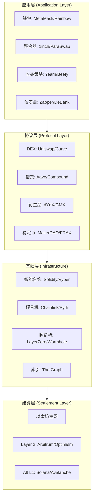

## 五、DeFi生态解析

DeFi（Decentralized Finance，去中心化金融）是Web3生态中最具颠覆性的应用层，它用智能合约替代传统金融中介机构，构建了一个开放、透明、无需许可的全球金融系统。截至2025年，DeFi协议总锁仓量（TVL）长期维持在500亿至1500亿美元区间，覆盖借贷、交易、衍生品、保险、资产管理等几乎所有传统金融领域。理解DeFi的底层逻辑、核心协议和风险机制，是进入Web3金融世界的必修课。

### 1. DeFi的本质：从"机构信任"到"代码信任"

#### 1.1 传统金融 vs DeFi：信任范式的根本转变

传统金融（TradFi）的运转依赖一个核心前提：**你必须信任中间机构**。银行保管你的资金，券商执行你的交易，清算所结算你的合约，保险公司理赔你的损失——每一层中介都收取费用，每一层中介都可能犯错、作恶或倒闭。2008年雷曼兄弟破产、2022年FTX暴雷，反复证明了"机构信任"的脆弱性。

DeFi提出了一个激进的替代方案：**用代码取代机构，用智能合约取代法律合同，用密码学验证取代人工审计**。

| 维度 | 传统金融（TradFi） | 去中心化金融（DeFi） |
|------|-------------------|---------------------|
| 信任基础 | 机构信用、法律合同 | 智能合约代码、密码学 |
| 准入门槛 | 需要身份认证、最低资产门槛 | 有钱包地址即可参与（无需许可） |
| 运营时间 | 工作日、工作时间 | 7×24小时全年无休 |
| 结算速度 | T+1甚至T+2 | 秒级到分钟级 |
| 透明度 | 季报/年报披露，信息不对称 | 链上数据实时可查，完全透明 |
| 可组合性 | 各机构系统封闭，接口复杂 | 协议间自由组合，如同乐高积木 |
| 审查风险 | 账户可被冻结、资金可被没收 | 无单一控制方，抗审查 |
| 费用结构 | 多层中介抽成 | 主要是Gas费和协议手续费 |

这种信任范式的转变不是渐进式改良，而是结构性重构。当交易逻辑被编码在以太坊上的智能合约中时，你不需要信任Uniswap团队不会跑路——因为交易逻辑是公开的、可验证的、不可篡改的。

#### 1.2 DeFi的核心设计原则

**无需许可（Permissionless）**：任何人，无论国籍、资产规模、社会身份，都可以使用DeFi协议。你不需要申请账户，不需要提交身份证件，只需要一个以太坊地址。这意味着全球17亿没有银行账户的人口，理论上可以通过一部智能手机接入全球金融系统。

**可组合性（Composability）**：DeFi协议像乐高积木一样可以自由组合。你可以将Aave上借出的资产存入Curve的流动性池获取交易手续费，同时将LP凭证存入Convex获取额外治理代币奖励。这种"DeFi乐高"的组合方式创造了传统金融中不存在的复杂策略。据统计，一个典型的DeFi收益策略可能涉及4-6个不同协议的交互。

**透明可审计（Transparency）**：每一笔交易、每一个合约的状态都在链上公开可查。你可以实时监控任何DeFi协议的TVL、交易量、储备金状态，不需要等待季度财报。工具如DeFi Llama、Dune Analytics提供了对整个DeFi生态的全景透视。

**非托管（Non-custodial）**：你的资产始终在你的钱包中，由你的私钥控制。DeFi协议通过智能合约与你的资产交互，但从未"持有"你的资产。这与将资金存入银行或交易所形成根本区别。

#### 1.3 DeFi的发展历程

DeFi并非一夜之间出现，它经历了清晰的演化路径：

**萌芽期（2015-2017）**：以太坊智能合约平台上线后，早期探索者开始尝试用代码构建金融原语。MakerDAO于2014年构思、2017年上线，成为第一个DeFi协议，提供了去中心化稳定币DAI的生成机制。这一时期的DeFi更像是概念验证，TVL不足1亿美元。

**爆发期（2018-2020）**：Compound在2018年推出借贷协议，2020年6月首创"流动性挖矿"（Liquidity Mining），用COMP代币奖励借贷双方，引爆了"DeFi Summer"。Uniswap的自动做市商（AMM）模型证明了去中心化交易所的可行性。Aave引入了闪电贷（Flash Loan）这一前所未有的金融原语。TVL从不到10亿美元飙升至超过150亿美元。

**成熟期（2021-至今）**：DeFi开始向多链扩展，Arbitrum、Optimism、Solana、Avalanche等链上DeFi生态蓬勃发展。协议设计从"高APY吸引流动性"转向可持续的商业模式。现实世界资产（RWA）上链成为新趋势，美国国债、房地产等传统资产开始通过DeFi协议进行代币化和交易。

### 2. DeFi协议全景：六大核心赛道

#### 2.1 去中心化交易所（DEX）

DEX是DeFi生态中交易量最大、使用频率最高的基础设施。它解决了"如何在没有中心化撮合方的情况下完成代币交换"这一核心问题。

**恒定乘积做市商（Constant Product Market Maker）**

Uniswap V2的核心公式极其简洁：

```text
x × y = k
```

其中x和y分别代表流动性池中两种代币的数量，k是一个常数。当用户用代币A购买代币B时，池中A的数量增加、B的数量减少，但乘积k保持不变。这个公式自动决定了价格——购买量越大，价格滑点越大。

这个设计的精妙之处在于：它不需要订单簿，不需要做市商，只需要流动性提供者（LP）向池中存入两种代币，交易就可以自动发生。价格完全由供需关系决定。

**集中流动性：Uniswap V3的革新**

Uniswap V2的问题在于资金效率低——流动性均匀分布在0到无穷大的价格区间。V3引入了"集中流动性"（Concentrated Liquidity），允许LP在特定价格区间内提供流动性。例如，如果你认为ETH/USDC的价格会在3000-3500美元之间波动，你可以只在这个区间内提供流动性，相同资金量下获得的手续费收益可能提高4-200倍。

```text
# Uniswap V3集中流动性的概念示例
# LP选择在价格区间 [P_lower, P_upper] 内提供流动性
# 实际资本效率 = 总区间宽度 / 集中区间宽度

# 示例：ETH/USDC池
# V2: 流动性分布在 [0, ∞)，资本效率基准 = 1x
# V3: 流动性集中在 [3000, 3500]，资本效率 ≈ 60x
```

**主流DEX对比**

| DEX | 链 | AMM模型 | 特点 | 适用场景 |
|-----|-----|---------|------|---------|
| Uniswap V3 | 以太坊/L2 | 集中流动性 | 最大流动性、品牌信任 | 大额交易、主流代币对 |
| Curve Finance | 多链 | StableSwap | 滑点极低、专为稳定资产设计 | 稳定币互换、同类资产交易 |
| PancakeSwap | BSC | 恒定乘积 | 低Gas、高APY | 小额高频交易 |
| dYdX | 自有链 | 订单簿 | 永续合约、专业级交易 | 杠杆交易、衍生品 |
| Jupiter | Solana | 聚合器 | 最优路由、MEV保护 | Solana生态交易 |

**Curve Finance的StableSwap算法**

对于稳定币互换（如USDC↔USDT），恒定乘积公式不够高效——两种稳定币价格几乎恒定在1:1附近，需要极低的滑点。Curve的StableSwap公式结合了恒定乘积和恒定和（x+y=k）两种曲线：

```text
# 当价格接近1:1时，行为类似恒定和（极低滑点）
# 当价格偏离较大时，行为切换为恒定乘积（防止池子枯竭）
A * n^n * Σ(x_i) + D = A * D * n^n + D^(n+1) / (n^n * Π(x_i))
```

这个设计使得100万美元的USDC↔USDT交易滑点可能低于0.01%，而同样规模在Uniswap V2上滑点可能超过0.5%。

#### 2.2 借贷协议

借贷是金融的基石。DeFi借贷协议用智能合约替代了银行的存贷业务，实现了完全链上的借贷撮合。

**超额抵押借贷的运作机制**

DeFi借贷的默认模式是"超额抵押"（Over-collateralized）——你存入价值150美元的ETH，最多只能借出100美元的稳定币。这看似低效，但它消除了信用风险：即使借款人违约，协议也可以通过清算抵押品来保护存款人。

以Aave V3为例，一笔典型的借贷流程如下：

```text
# 存入阶段
用户存入 1 ETH（价值 $3,000）到 Aave
→ 获得 aETH 凭证（生息代币，随时间增值）

# 借入阶段  
抵押率设定为 75%（LTV）
→ 最多可借 $2,250 的 USDC

# 利息计算
借款利率 = 基础利率 + 利用率 × 斜率
利用率 = 借出资金 / 总资金池

# 清算机制
当健康因子 < 1 时触发清算
健康因子 = (抵押品价值 × 清算阈值) / 借款价值
清算人偿还部分债务，获得抵押品 + 清算奖金（通常5-10%）
```

**利率模型**

DeFi借贷协议采用算法利率——利率随供需自动调整。当借贷需求高（利用率高）时，利率上升，吸引更多存款、抑制借贷；当需求低时，利率下降。以Aave的利率模型为例：

```python
# 利率计算（简化版）
if 利用率 ≤ 最优利用率:
    借款利率 = 基础利率 + (利用率 / 最优利用率) × 斜率1
else:
    借款利率 = 基础利率 + 斜率1 + ((利用率 - 最优利用率) / (1 - 最优利用率)) × 斜率2

# 存款利率
存款利率 = 借款利率 × 利用率 × (1 - 储备金系数)
```

斜率2通常远大于斜率1，形成"拐点"——当利用率超过最优值（通常80-90%）后利率急剧上升，强力抑制进一步借贷，保护协议流动性。

**闪电贷：DeFi独有的金融原语**

闪电贷（Flash Loan）是传统金融中不存在的概念：你可以在一笔交易内借入任意数量的资金（无需抵押），只要在同一笔交易结束前归还本金加手续费即可。如果归还失败，整笔交易自动回滚，仿佛从未发生。

闪电贷的应用场景：
- **套利**：在DEX A以低价买入代币，在DEX B以高价卖出，一笔交易完成
- **清算**：借入资金清算水下仓位，获得清算奖金后归还
- **抵押品置换**：将Aave中的ETH抵押品换成WBTC，无需先偿还贷款

```solidity
// Aave闪电贷的简化逻辑
function executeOperation(
    address asset,
    uint256 amount,
    uint256 premium
) external {
    // 1. 在这里使用借到的资金（套利、清算等）
    // ... 执行你的策略 ...
    
    // 2. 必须在同一笔交易中归还 本金 + 手续费(0.09%)
    uint256 amountOwed = amount + premium;
    IERC20(asset).approve(address(LENDING_POOL), amountOwed);
}
```

#### 2.3 稳定币

稳定币是DeFi生态的血液——几乎所有交易对、借贷操作和收益策略都以稳定币为媒介。稳定币试图解决加密货币价格波动大的问题，将其价值锚定在法币（通常是美元）上。

**稳定币的三大类型**

| 类型 | 代表 | 锚定机制 | 优点 | 风险 |
|------|------|---------|------|------|
| 法币抵押型 | USDT、USDC | 1:1美元储备 | 简单直观、价格稳定 | 中心化、审查风险、储备透明度 |
| 加密货币抵押型 | DAI、LUSD | 超额加密资产抵押 | 去中心化、链上可验证 | 资本效率低、抵押品波动风险 |
| 算法型 | UST（已崩盘）、FRAX | 算法调节供给 | 资本效率高 | 死亡螺旋风险、历史失败案例 |

**DAI的生成机制**

DAI是最重要的去中心化稳定币。用户将ETH、WBTC等资产存入MakerDAO的"保险库"（Vault），按照设定的抵押率生成DAI。

```text
# DAI生成示例
抵押品: 10 ETH @ $3,000 = $30,000
最低抵押率: 150%
最多可生成: $30,000 / 150% = 20,000 DAI

# 如果ETH价格下跌
ETH跌至 $2,000 → 抵押品价值 $20,000
当前抵押率: $20,000 / 20,000 DAI = 100% → 触发清算
安全线建议: 保持抵押率 > 200%
```

**USDC的中心化风险**

2023年3月，硅谷银行（SVB）倒闭时，Circle（USDC发行方）有33亿美元储备存在SVB。USDC一度脱锚至0.87美元。这一事件清晰地展示了法币抵押型稳定币的系统性风险——你的"稳定币"的稳定性，取决于你从未见过的银行的偿付能力。

2022年Tornado Cash制裁事件中，Circle冻结了与被制裁地址相关的USDC，进一步证明法币抵押型稳定币可以被审查。

#### 2.4 衍生品协议

DeFi衍生品正在复制传统金融中的复杂金融工具，但以去中心化、透明的方式运行。

**永续合约**

永续合约（Perpetual Futures）是没有到期日的期货合约，通过"资金费率"（Funding Rate）机制使合约价格锚定现货价格。

```text
# 资金费率机制
当 合约价格 > 现货价格 → 资金费率为正 → 多头支付空头
当 合约价格 < 现货价格 → 资金费率为负 → 空头支付多头

# 资金费率计算（每8小时结算一次）
资金费率 = 溢价指数 + clamp(基础利率 - 溢价指数, -0.05%, 0.05%)
```

dYdX、GMX是DeFi永续合约赛道的代表。GMX的独特之处在于采用了"全局流动性池"模型——GLP持有一篮子资产作为所有交易的对手方，交易者赚了就是GLP亏了，反之亦然。

**期权协议**

DeFi期权协议如Lyra、Opyn提供了链上期权交易。期权买方支付权利金获得在未来以特定价格买入/卖出资产的权利，而非义务。

```text
# 期权基础
看涨期权（Call）: 支付权利金 → 获得以执行价格买入资产的权利
看跌期权（Put）: 支付权利金 → 获得以执行价格卖出资产的权利

# 示例
ETH当前价格: $3,000
买入 ETH $3,500 Call（一个月到期）→ 权利金: $150
如果ETH到期时涨到 $4,000 → 行权获利 = $4,000 - $3,500 - $150 = $350
如果ETH到期时低于 $3,500 → 最大损失 = $150（权利金）
```

#### 2.5 收益聚合器与流动性管理

DeFi生态中有大量收益机会，但手动管理多个协议的头寸既复杂又耗时（需要监控清算线、复投奖励、迁移到更高收益池等）。收益聚合器（Yield Aggregator）自动化了这一过程。

**Yearn Finance的Vault机制**

Yearn是最早的收益聚合器。用户将资金存入Vault，策略合约自动在多个DeFi协议间寻找最优收益并执行。

```text
# Yearn Vault工作流程
1. 用户存入 USDC → 获得 yvUSDC 凭证
2. 策略合约分析可选方案:
   - Aave 存款利率: 3%
   - Compound 存款利率: 2.5%
   - Curve LP + CRV奖励: 8%
   - Convex boosted: 12%
3. 策略自动将资金部署到最优方案
4. 定期复投奖励，复利增长
5. 用户随时可赎回 yvUSDC → 取回本金+收益
```

**流动性挖矿的经济学**

流动性挖矿（Liquidity Mining）是DeFi协议分发治理代币的方式——你为协议提供流动性（存入资金、提供交易对），协议奖励你治理代币。但你需要理解其经济本质：

```text
# 流动性挖矿的真实收益
名义APY: 50%（看起来很诱人）
其中:
- 实际交易手续费收益: 8%
- 代币奖励收益: 42%（以协议原生代币支付）

# 代币奖励的问题
新铸造的代币不断稀释供给 → 代币价格承压
如果代币价格下跌50% → 实际APY = 8% + 42%×50% = 29%
如果代币价格下跌80% → 实际APY = 8% + 42%×20% = 16.4%

# 无常损失（Impermanent Loss）
当池中两种代币价格比率变化时，LP价值 < 持有价值
价格变化2x → 无常损失约5.7%
价格变化5x → 无常损失约25.5%
```

#### 2.6 保险协议

智能合约存在被攻击的风险（代码漏洞、经济模型缺陷、预言机操纵等）。DeFi保险协议为这类风险提供对冲。

**Nexus Mutual** 是最大的DeFi保险协议，采用互助保险模型：

```text
# DeFi保险运作
1. 承保人（NXM持有者）存入资金到风险池
2. 投保人支付保费购买智能合约保险
3. 如果发生黑客攻击:
   - 投保人提交索赔
   - NXM持有者投票决定是否赔付
   - 赔付从风险池中支出

# 保费定价因素
- 协议TVL规模（TVL越大，攻击利润越高，保费越贵）
- 协议审计历史（多轮审计降低保费）
- 协议运行时长（新协议保费更高）
- 历史攻击事件（有攻击史的协议保费更高）
```

### 3. DeFi技术栈：从底层到应用的完整架构

DeFi不是单一技术，而是由多层技术栈构成的复杂系统。理解这个技术栈，有助于你判断任何DeFi项目的可行性和风险。



#### 3.1 预言机（Oracle）：连接链上与链下

智能合约本身无法访问链下数据（如ETH的美元价格、体育比赛结果、天气数据）。预言机是将链下数据安全地传递给智能合约的基础设施。

**Chainlink** 是最大的预言机网络，其工作原理：

```text
# Chainlink数据馈送工作流
1. 多个独立节点运营商（如Deutsche Telekom、Swisscom等）
2. 每个节点从多个数据源获取价格
3. 节点将价格报告到链上聚合合约
4. 聚合合约取中位数作为最终价格
5. DeFi协议读取聚合价格

# 为什么需要去中心化预言机？
单一数据源 → 单点故障/操纵风险
去中心化节点网络 → 多重验证、拜占庭容错
```

预言机是DeFi安全链条中最关键的环节之一。2022年Mango Markets被攻击1.14亿美元，根本原因是攻击者操纵了MNGO代币的预言机价格。

#### 3.2 跨链桥：多链DeFi的连接器

DeFi分布在多条区块链上，跨链桥让用户在不同链之间转移资产。但跨链桥也是DeFi安全事件的重灾区——2022年Ronin Bridge被盗6.25亿美元、Wormhole被盗3.2亿美元、Nomad被盗1.9亿美元。

```text
# 跨链桥的三种主要类型
1. 锁定-铸造（Lock-and-Mint）
   原链锁定资产 → 目标链铸造包装代币
   风险: 锁定合约被攻破 → 包装代币失去支撑

2. 流动性池（Liquidity Pool）
   两条链各有一个流动性池
   原链销毁/存入 → 目标链取出
   风险: 池子不平衡 → 跨链失败

3. 原生验证（Native Verification）
   目标链验证原链的区块头和交易证明
   最安全但最慢、最贵
   代表: IBC（Cosmos生态）
```

### 4. DeFi风险矩阵：必须了解的七大风险

DeFi收益不是免费的午餐，每一类收益背后都有对应的风险。不理解风险就参与DeFi，与赌博无异。

#### 4.1 智能合约风险

智能合约一旦部署就难以修改（除非有升级机制），代码中的bug可能导致资金永久丢失。

**经典案例**：
- The DAO攻击（2016）：重入漏洞导致360万ETH被盗，最终导致以太坊硬分叉
- Cream Finance（2021）：闪电贷攻击，累计损失超过1.3亿美元
- Euler Finance（2023）：捐赠函数漏洞，1.97亿美元被盗（后归还）

**风险缓解**：
- 只使用经过多轮审计的协议（查看审计报告是否有Critical/High级别漏洞未修复）
- 检查协议是否设有Bug Bounty计划（赏金越高，白帽黑客审查越充分）
- 使用DeFi保险对冲（如Nexus Mutual）
- 分散资金到多个协议，不把所有资产放在一个篮子里

#### 4.2 无常损失（Impermanent Loss）

当你向AMM流动性池提供流动性时，如果池中代币的价格比率发生变化，你的LP头寸价值将低于简单持有（HODL）的价值。这个差额就是"无常损失"。

```text
# 无常损失计算
假设初始: 1 ETH ($1,000) + 1,000 USDC
池子总值: $2,000（你持有50%）

ETH涨到 $4,000:
- 如果持有: 1 ETH ($4,000) + 1,000 USDC = $5,000
- 如果做LP: 0.5 ETH ($2,000) + 2,000 USDC = $4,000
- 无常损失: $5,000 - $4,000 = $1,000 (20%)

# 无常损失的"无常"二字
只有在退出流动性池时才实现损失
如果价格回到初始比率，损失消失
但如果代币持续下跌，损失可能变成永久性损失
```

**关键认知**：无常损失并不总是坏事——如果手续费和挖矿收益覆盖了无常损失，LP仍然盈利。你需要计算的是"净收益 = 手续费收益 + 代币奖励 - 无常损失 - Gas费"。

#### 4.3 预言机操纵风险

如果DeFi协议依赖的预言机价格被操纵，攻击者可以利用错误价格进行套利。

```text
# 预言机操纵攻击模式
1. 攻击者在低流动性DEX上大量买入代币X → 推高价格
2. 如果借贷协议使用该DEX作为价格源 → 协议认为X价值很高
3. 攻击者以虚高价格抵押X → 借出大量稳定币
4. 攻击者不归还贷款 → 协议尝试清算X但真实市场价远低于预言机价格
→ 协议产生坏账
```

使用Chainlink等去中心化预言机、设置价格偏差阈值、使用TWAP（时间加权平均价格）而非即时价格，都是降低预言机风险的手段。

#### 4.4 治理攻击风险

DeFi协议通常由治理代币持有者投票管理。如果攻击者获得足够的治理代币，可以发起恶意提案。

**经典案例：Beanstalk（2022）**
攻击者通过闪电贷借入大量治理代币，在一笔交易中通过了恶意提案（将协议资金转到自己地址），盗取1.82亿美元。整个攻击在13秒内完成。

**缓解措施**：
- 治理提案设有时间锁（Timelock）——通过提案后需等待48-72小时才能执行
- 投票需要委托（Delegate），闪电贷借来的代币无法直接投票
- 设置法定人数（Quorum）和投票门槛

#### 4.5 监管风险

DeFi面临日益增加的监管压力：
- 美国SEC将某些DeFi代币视为证券
- 欧盟MiCA法规对稳定币施加储备要求
- OFAC制裁Tornado Cash，禁止美国公民使用
- 各国对DeFi收益征税的政策尚不明确

#### 4.6 系统性风险

DeFi协议之间的深度耦合意味着一个协议的问题可能传导到整个生态：
- stETH脱锚 → 引发Celsius和三箭资本清算 → 加剧市场下跌
- UST崩盘 → 连锁清算 → 整个DeFi TVL暴跌
- 某个协议被攻击 → 关联协议的TVL也会外流

#### 4.7 MEV（最大可提取价值）

MEV（Maximal Extractable Value）是指区块生产者（验证者）通过重新排序、插入或审查交易来获取的额外利润。对普通用户来说，MEV表现为：

```text
# 三明治攻击（Sandwich Attack）
1. 你在Uniswap上下了一个大额买单
2. 攻击者看到你的pending交易
3. 攻击者在你之前买入（Front-run）→ 推高价格
4. 你的交易以更高价格成交（滑点增大）
5. 攻击者在你之后卖出（Back-run）→ 赚取差价

# 保护措施
- 使用Flashbots Protect等MEV保护RPC
- 设置较低的滑点容忍度（如0.5%）
- 使用1inch Fusion、CoW Swap等有MEV保护的聚合器
```

### 5. DeFi实战分析框架

#### 5.1 如何评估一个DeFi协议

在将资金投入任何DeFi协议之前，用以下框架进行评估：

**安全性评估清单**

| 检查项 | 合格标准 | 验证方法 |
|--------|---------|---------|
| 审计报告 | 至少2家知名审计公司 | 官网文档、DeFiSafety |
| 审计时间 | 最近6个月内 | 检查审计报告日期 |
| Bug Bounty | 赏金>$100K | Immunefi平台 |
| 运行时长 | 主网运行>1年 | DeFi Llama TVL历史 |
| 代码开源 | 合约源码可查 | Etherscan验证 |
| 升级机制 | 多签+Timelock | 检查合约Owner权限 |
| TVL趋势 | 稳定或增长 | DeFi Llama |

**经济模型评估**

```text
# 协议收入可持续性分析
协议收入来源:
1. 交易手续费（如Uniswap的0.3%）
2. 借贷利差（如Aave的存借利差）
3. 清算罚款（如MakerDAO的13%清算罚金）
4. 协议抽成（如GMX的交易费用分配）

# 核心问题: 如果停止代币奖励，协议还有人用吗？
如果答案是"是" → 协议有真实需求，经济模型可持续
如果答案是"否" → 协议依赖代币通胀吸引用户，长期不可持续
```

#### 5.2 DeFi收益来源的真相

DeFi中所有收益都来自以下三种来源之一：

```text
# 收益的三种来源
1. 协议使用费（真实收益）
   - DEX的交易手续费
   - 借贷协议的利息收入
   - 永续合约的交易费用
   性质: 可持续，与协议使用量正相关

2. 代币发行奖励（投机收益）
   - 流动性挖矿的代币奖励
   - 新协议的启动激励
   性质: 不可持续，持续稀释代币价值

3. 杠杆循环（放大收益/风险）
   - 存入资产 → 借出 → 再存入 → 再借出...
   - 杠杆挖矿/杠杆做多做空
   性质: 放大了基础收益，也放大了基础风险
```

#### 5.3 入门实操：从零开始的DeFi第一笔交易

**前提准备**

```text
# 你需要准备的东西
1. 一个Web3钱包（推荐MetaMask或Rabby）
2. 一定数量的ETH（用于Gas费，建议0.05 ETH起步）
3. 一些稳定币（USDC或DAI，用于实际操作）
4. 对应网络的RPC配置

# 重要安全习惯
- 永远不要在不理解的合约上签署交易
- 首次交互用小额测试
- 使用Revoke.cash定期检查和撤销不必要的授权
- 将大部分资产保存在冷钱包，只用热钱包参与DeFi
```

**第一笔Swap操作**

```text
# 以Uniswap为例的操作步骤
1. 访问 app.uniswap.org（确认URL正确，避免钓鱼网站）
2. 连接钱包
3. 选择网络（以太坊主网 / Arbitrum / Optimism）
4. 选择交易对（如 ETH → USDC）
5. 输入金额，查看报价和价格影响
6. 如果是首次交易该代币，需要先"授权"（Approve）
7. 确认交易详情（滑点、Gas费、最小收到数量）
8. 提交交易，等待确认
```

### 6. 常见误区与纠正

**误区一："DeFi收益是被动收入，不需要管理"**

纠正：DeFi收益需要持续监控。你需要关注：协议安全事件、清算线距离、无常损失变化、治理提案影响、链上Gas成本。忽视管理的DeFi投资者，往往在市场剧烈波动时遭受最大损失。

**误区二："APY越高越好"**

纠正：高APY通常意味着高风险。年化1000%的流动性挖矿收益，来自协议以通胀性代币支付的奖励，这些代币价格可能在几周内下跌90%。你应该关注的是"真实收益"——来自协议实际使用费用的收益。

**误区三："审计过的合约就是安全的"**

纠正：审计降低了风险但不消除风险。审计公司不保证没有漏洞（审计报告都有免责条款），而且审计只能检查提交审计时的代码。协议升级后的新代码未经审计。多个经过审计的协议仍然被攻击。审计是必要条件，不是充分条件。

**误区四："去中心化=完全安全"**

纠正：去中心化消除的是单点故障和审查风险，但不消除智能合约风险、经济模型风险和市场风险。很多"去中心化"协议实际上有管理员密钥可以暂停合约或修改参数。

**误区五："稳定币都是1美元"**

纠正：稳定币可能脱锚。算法稳定币（如UST）可能崩盘归零；法币抵押型稳定币（如USDC）在银行危机时可能跌破0.90；甚至DAI在极端市场条件下也可能出现轻微脱锚。不要假设任何稳定币永远等于1美元。

### 7. 进阶概念：理解DeFi的深层机制

#### 7.1 可组合性与DeFi乐高

DeFi协议的可组合性（Composability）是其最强大的特性之一，也是最复杂的。

```text
# 一个典型的DeFi收益策略链条
1. 在Aave存入 ETH → 获得 aETH（生息凭证）
2. 在MakerDAO用 aETH 作为抵押品 → 生成 DAI
3. 将 DAI 存入 Curve 的 3pool → 获得 3CRV LP代币
4. 将 3CRV 存入 Convex → 获得 cvx3CRV + CRV奖励 + CVX奖励
5. 将 CVX 锁定为 vlCVX → 获得贿赂收益（来自Votium）

# 每一步都有风险，风险是叠加的
总风险 = 合约风险_Aave + 合约风险_MakerDAO + 合约风险_Curve 
       + 合约风险_Convex + 无常损失 + 预言机风险 + 治理风险
```

这种多层嵌套的策略可以获得较高收益，但每一个协议层都增加了额外的智能合约风险。策略越复杂，风险叠加越多。

#### 7.2 veToken经济学

veToken（Vote-Escrowed Token）模型由Curve Finance首创，深刻影响了DeFi的治理和代币经济设计。

```text
# veCRV机制
1. 将 CRV 锁定为 veCRV，锁定时间越长（最长4年），获得的 veCRV 越多
2. veCRV 持有者可以投票决定 CRV 排放（新代币奖励）分配到哪些池子
3. 这导致了"Curve Wars"——各协议争相积累 veCRV 来为自己支持的池子争取更多奖励
4. Convex、Yearn等协议聚合了大量 CRV，用投票权换取"贿赂"收入

# veToken模型的影响
- 减少流通供给 → 对代币价格有支撑
- 长期锁定者获得更多收益 → 鼓励长期持有
- 创造了"投票市场" → veToken持有者可以通过投票获取贿赂收益
```

#### 7.3 RWA（现实世界资产）上链

DeFi的下一个增长引擎是将传统金融资产代币化并在链上交易。截至2025年，链上RWA资产规模已超过100亿美元，包括：

- **美国国债代币化**：Ondo Finance的USDY、BlackRock的BUIDL基金
- **私人信贷**：Centrifuge将现实世界贷款代币化
- **房地产**：RealT提供房产代币化和租金收益分配
- **大宗商品**：Paxos的PAXG（黄金代币化）

```text
# RWA对DeFi的意义
1. 引入了链上资产的"无风险利率"（美国国债收益率）
2. 将DeFi的可组合性应用于传统资产
3. 降低了传统金融的准入门槛（全球任何人都可以购买美国国债代币）
4. 创造了新的抵押品类型（房产代币可作为借贷抵押品）
```

### 8. DeFi的未来趋势

**意图架构（Intent-based Architecture）**：用户表达"我想用ETH换USDC"的意图，专业求解器（Solver）竞争提供最优执行方案。1inch Fusion、CoW Swap、UniswapX都在向这个方向演进。

**账户抽象（Account Abstraction）**：ERC-4337让智能合约钱包成为一等公民，支持社交恢复、Gas费代付、批量交易等特性，大幅降低DeFi使用门槛。

**全链DeFi（Omnichain DeFi）**：通过LayerZero、Wormhole等跨链消息协议，DeFi协议可以部署在多条链上并共享流动性，用户无需感知底层链的差异。

**机构DeFi**：传统金融机构开始探索DeFi基础设施。JPMorgan的Onyx、BlackRock的BUIDL基金代表了TradFi与DeFi融合的趋势。

---

DeFi是金融创新的前沿阵地，它正在用代码重新定义金融的基础设施。但作为参与者，你需要始终保持清醒：高收益必然伴随高风险，代码即法律意味着bug即灾难。从理解原理开始，从小额实践起步，用风险框架评估每一个决策，才能在DeFi的海洋中安全航行。

> **本节核心要点**
> 1. DeFi用智能合约替代金融中介，实现了无需许可、透明可审计的金融系统
> 2. 六大核心赛道：DEX、借贷、稳定币、衍生品、收益聚合、保险
> 3. 七大风险：智能合约、无常损失、预言机操纵、治理攻击、监管、系统性、MEV
> 4. 收益三种来源：协议使用费（真实收益）、代币发行（投机收益）、杠杆循环
> 5. 评估协议的框架：安全性、经济模型可持续性、团队、社区治理
> 6. RWA和账户抽象是DeFi下一个增长引擎
