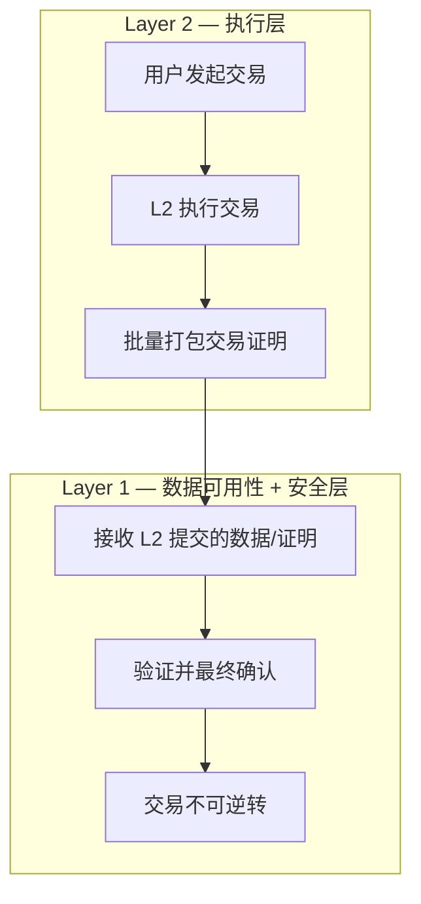
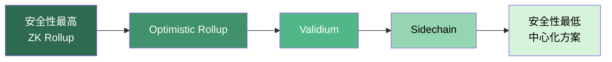
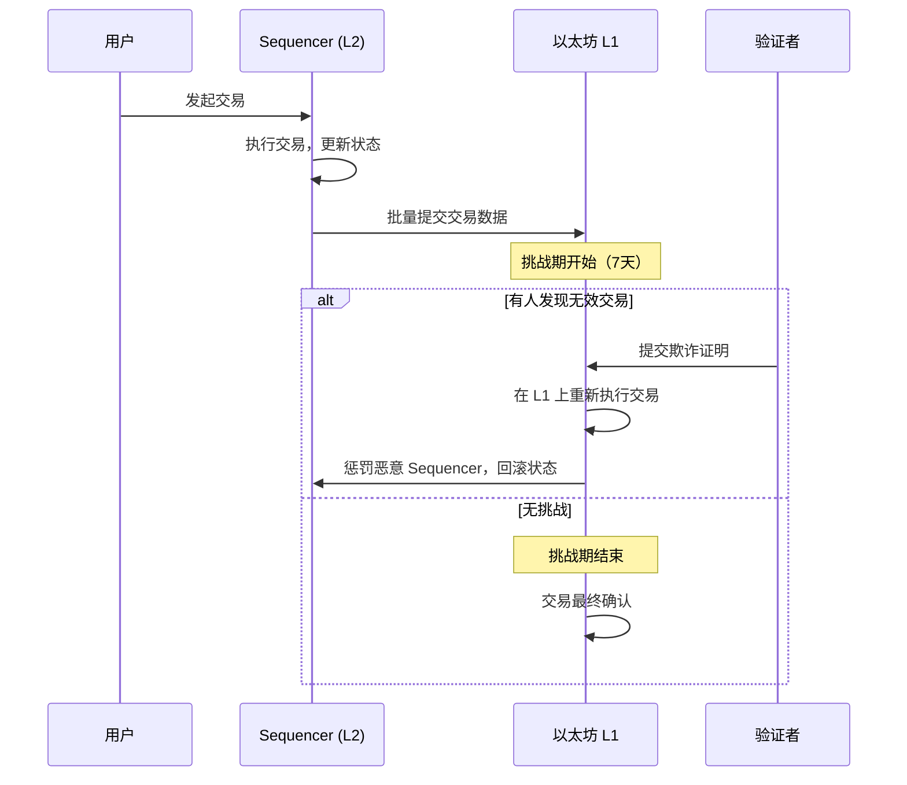
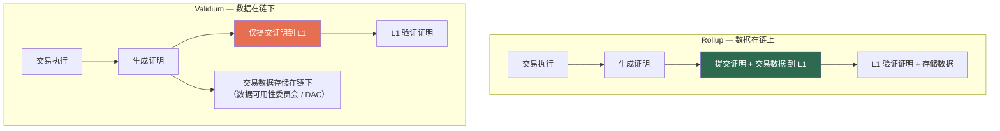

## 七、Layer 2 与扩容方案

### 1. 为什么需要扩容：区块链的可扩展性难题

#### 1.1 区块链三难困境

区块链系统设计面临一个根本性的权衡，被称为「区块链三难困境」（Blockchain Trilemma）：去中心化、安全性、可扩展性三者最多只能同时满足两个。

以太坊主网（Layer 1）选择了去中心化和安全性，代价是可扩展性受限：

| 网络 | TPS（每秒交易数） | 确认时间 | 去中心化程度 |
|------|-------------------|----------|-------------|
| 以太坊主网 | ~15-30 | 12-15秒/区块 | 高（全节点>10,000） |
| Visa 传统支付 | ~65,000 | 即时 | 无（中心化） |
| Solana | ~4,000（理论65,000） | 0.4秒 | 中低（验证节点约1,500） |
| BNB Chain | ~160 | 3秒 | 低（验证节点21个） |

以太坊在 2021-2022 年 DeFi 和 NFT 热潮期间，单笔交易 Gas 费一度突破 200 美元，普通用户根本无法承受。这不是技术「bug」，而是架构性的资源竞争——全球所有用户共享同一区块空间，出价最高者优先上链。

#### 1.2 扩容的两条路径

区块链扩容分为两大方向：

- **Layer 1 扩容**：直接提升底层链的处理能力，如分片（Sharding）、增加区块大小、优化共识算法。以太坊的 Dencun 升级（2024年3月）引入了 Proto-Danksharding（EIP-4844），通过 Blob 交易大幅降低 L2 数据发布成本。
- **Layer 2 扩容**：在 L1 之上构建二层网络，将交易执行转移到链下，同时继承 L1 的安全性。这是以太坊生态的主流扩容路线。

两层架构的核心分工：

L1 负责数据可用性（Data Availability）和最终安全性，L2 负责交易执行和吞吐量。这种分工让以太坊可以在不牺牲去中心化的前提下，将吞吐量提升 10-100 倍。

---

### 2. Layer 2 扩容方案全景

#### 2.1 方案分类总览

Layer 2 方案按技术原理可分为以下几大类：

| 方案类型 | 安全模型 | 数据可用性 | 代表项目 | 成熟度 |
|---------|---------|-----------|---------|-------|
| Optimistic Rollup | 欺诈证明（Fraud Proof） | 链上 | Arbitrum, Optimism, Base | ★★★★★ 生产级 |
| ZK Rollup | 有效性证明（Validity Proof） | 链上 | zkSync Era, StarkNet, Scroll, Linea | ★★★★ 快速成熟 |
| State Channel | 保证金 + 多签 | 链下 | Lightning Network (BTC), Raiden (ETH) | ★★★ 成熟但应用有限 |
| Plasma | 欺诈证明 | 链下 | Polygon Plasma（已停用） | ★★ 基本淘汰 |
| Validium | 有效性证明 | 链下 | StarkEx (dYdX v3), zkPorter | ★★★ 特定场景 |
| Sidechain | 独立共识 | 链下 | Polygon PoS, Gnosis Chain | ★★★★ 广泛使用但安全性不同 |

> **重要区分**：Sidechain 严格来说不是 Layer 2。它有独立的共识机制和安全模型，不直接继承以太坊的安全性。但从用户体感和生态位置看，它常被归入广义的 L2 生态讨论。

#### 2.2 安全性光谱

理解不同方案的安全性差异至关重要。安全性从高到低排列：

1. **ZK Rollup**：数学证明保证交易正确性，L1 强制执行
2. **Optimistic Rollup**：假设交易正确，挑战期内可提出欺诈证明
3. **Validium**：有效性证明 + 链下数据（数据可用性依赖委员会）
4. **Sidechain**：完全独立的安全模型，安全性取决于侧链自身验证者

---

### 3. Optimistic Rollup 深度解析

#### 3.1 工作原理

Optimistic Rollup 的核心假设是「乐观的」——默认所有交易都是有效的，只有在有人提出挑战时才进行验证。其工作流程：

1. **交易执行**：用户在 L2 上发起交易，Sequencer（排序器）负责排序和执行
2. **批次提交**：Sequencer 将一批交易的数据（calldata 或 blob）提交到 L1
3. **挑战期**：提交后进入 7 天的挑战期（Challenge Period）
4. **欺诈证明**：任何人发现无效交易，都可以提交欺诈证明（Fraud Proof）来挑战
5. **最终确认**：挑战期结束且无有效欺诈证明，交易最终确认

#### 3.2 欺诈证明的挑战

欺诈证明机制存在几个工程难题：

- **交互式欺诈证明**：Arbitrum 采用多轮交互式证明，通过二分查找定位争议步骤，再在 L1 上仅执行那一步，大幅降低 Gas 成本
- **单轮欺诈证明**：Optimism 的 Cannon (Fault Proof System) 将整个交易在 L1 上重新执行，安全性更直接但 Gas 成本更高
- **验证者激励**：需要足够多的诚实验证者持续监控 L2 提交。如果所有验证者合谋或消失，安全性就无从保障

#### 3.3 主要 Optimistic Rollup 项目对比

| 维度 | Arbitrum One | OP Mainnet | Base |
|------|-------------|------------|------|
| 开发团队 | Offchain Labs | OP Labs | Coinbase |
| 虚拟机 | Arbitrum VM (AVM)，兼容 EVM | OVM 2.0，完全 EVM 等价 | 基于 OP Stack，完全 EVM 等价 |
| 欺诈证明 | 交互式（多轮） | 单轮 (Cannon) | 继承 OP Stack 的 Cannon |
| 排序器 | 中心化（去中心化路线图中） | 中心化（去中心化路线图中） | 中心化（Base 运营） |
| TVL（2025年中） | ~$18B | ~$7B | ~$15B |
| 特色 | 最高的 DeFi 流动性，Nitro 架构性能优异 | OP Stack 开源生态，Superchain 愿景 | Coinbase 用户入口，零 Gas 空投优势 |
| 原生代币 | ARB（治理代币） | OP（治理代币） | 无（依赖 ETH） |
| Gas 费（相对 L1） | 约 1/10 - 1/50 | 约 1/10 - 1/50 | 约 1/10 - 1/100 |

#### 3.4 Sequencer 中心化问题

当前所有主流 Rollup 的 Sequencer 都是中心化的，这意味着：

- **审查风险**：Sequencer 可以选择性地不包含某些交易
- **单点故障**：Sequencer 宕机则 L2 暂时不可用
- **MEV 提取**：中心化 Sequencer 可以利用排序权提取 MEV

各大 Rollup 都在推进 Sequencer 去中心化：

- **Arbitrum**：计划通过 Bounded Liquidity Delay（BOLD）协议实现去中心化验证
- **Optimism**：通过 Superchain 的去中心化排序协议
- **Shared Sequencing**：Espresso Systems、Astria 等项目正在开发共享排序器网络，让多个 Rollup 共享去中心化的 Sequencer 集合

用户可以通过 L2 的「强制退出」（Force Exit）机制保护自己——即使 Sequencer 作恶，用户仍然可以直接在 L1 上提交交易来取回资金。

---

### 4. ZK Rollup 深度解析

#### 4.1 零知识证明基础

ZK Rollup 的核心是零知识证明（Zero-Knowledge Proof）——一种密码学技术，允许证明者向验证者证明某个计算是正确的，而不需要重新执行该计算。

关键属性：

- **完整性**（Completeness）：如果计算是正确的，证明者总能生成有效证明
- **健全性**（Soundness）：如果计算是错误的，证明者几乎不可能生成有效证明
- **零知识性**（Zero-Knowledge）：验证者无法从证明中获取计算以外的信息（在 Rollup 场景中，这一属性不一定需要）

#### 4.2 ZK 证明系统对比

当前主流的 ZK 证明系统有两个家族：

| 维度 | SNARK（如 Groth16, Plonk） | STARK |
|------|---------------------------|-------|
| 证明大小 | ~200 字节，非常小 | ~50-100 KB，较大 |
| 验证时间 | 恒定，极快 | 对数级，较快 |
| 信任设置 | 需要可信设置（Trusted Setup）或通用设置 | 无需信任设置（透明） |
| 抗量子 | 不抗量子计算 | 抗量子计算 |
| 递归证明 | 成本较高 | 原生支持，效率高 |
| 代表项目 | zkSync Era, Scroll, Linea | StarkNet, StarkEx |

#### 4.3 zkEVM 的技术挑战

将零知识证明应用于以太坊虚拟机（EVM）是一个极具挑战性的工程问题，因为 EVM 的设计初衷完全没有考虑 ZK 友好性：

- **Keccak-256 哈希**：在 ZK 电路中实现 Keccak-256 非常昂贵（需要数十万个约束）
- **存储布局**：EVM 的 Merkle Patricia Trie 结构对 ZK 电路不友好
- **动态跳转**：EVM 的 JUMP/JUMPI 指令让电路设计复杂化

Vitalik Buterin 提出了 zkEVM 的四种类型分类：

| 类型 | EVM 兼容性 | ZK 效率 | 开发难度 | 代表 |
|------|-----------|---------|---------|------|
| Type 1 | 完全等价（字节码级） | 最低 | 最高 | Scroll (目标) |
| Type 2 | EVM 等价（虚拟机级） | 较低 | 高 | zkSync Era, Scroll (当前) |
| Type 2.5 | EVM 等价但修改 Gas 计算 | 中等 | 中 | — |
| Type 3 | 几乎兼容 | 较高 | 中 | zkSync Lite |
| Type 4 | 高级语言兼容（非字节码） | 最高 | 最低 | StarkNet (Cairo), zkSync (LLVM) |

#### 4.4 主要 ZK Rollup 项目

**zkSync Era**：
- 技术路线：Type 4 zkEVM，使用 LLVM 编译器将 Solidity 编译为 ZK 友好的字节码
- 特色：Account Abstraction 原生支持，Boojum 证明系统
- 生态：DeFi（SyncSwap, Mute）、NFT、游戏

**StarkNet**：
- 技术路线：Type 4，使用 Cairo 语言（ZK 友好的专用语言），STARK 证明系统
- 特色：递归证明、极高的理论吞吐量、无信任设置
- 挑战：开发者需学习 Cairo（虽已支持 Solidity 兼容层 Kakarot）
- 生态：DeFi（Ekubo, ZkLend）、游戏（Realms, Influence）

**Scroll**：
- 技术路线：Type 2 zkEVM，字节码级兼容
- 特色：最接近原生 EVM 体验，开发者几乎零迁移成本
- 生态：DeFi、桥接、NFT

**Linea**：
- 开发团队：ConsenSys
- 技术路线：Type 2 zkEVM
- 特色：与 MetaMask、Infura 深度集成，ConsenSys 生态支持

---

### 5. Validium 与数据可用性

#### 5.1 数据可用性问题

Rollup 的安全性核心在于数据可用性——如果交易数据发布在 L1 上，任何人（即使 L2 的 Sequencer 消失）都可以重建 L2 状态。但这也意味着高昂的 L1 数据存储成本。

Validium 的解决方案是将数据存储在链下，只在 L1 上提交有效性证明：

#### 5.2 Volition 模式

zkSync 提出了 Volition 方案，让用户自行选择每笔交易的数据存储位置：

- **Rollup 模式**：数据上链，安全性最高，Gas 较高
- **Validium 模式**：数据链下，安全性较低（依赖 DAC），Gas 极低

用户可以在同一 L2 网络内，按交易的重要性和金额选择不同的数据可用性模式。小额日常交易用 Validium 节省费用，大额交易用 Rollup 确保安全。

#### 5.3 EIP-4844 与 Blob 交易

2024 年 3 月上线的 EIP-4844（Proto-Danksharding）彻底改变了 L2 的成本结构：

- **之前**：L2 将交易数据作为 calldata 发布到 L1，calldata 按字节计费（16 Gas/非零字节）
- **之后**：L2 使用 Blob 交易发布数据，Blob 有独立的定价市场，初始成本极低

实际效果：L2 的交易费从平均 $0.2-1.0 下降到 $0.001-0.01，降幅达到 10-100 倍。这使得在 L2 上进行 DeFi 交互、NFT 铸造等操作对普通用户完全可负担。

Blob 的技术特点：
- 每个 Blob 约 125 KB 数据
- 每个区块最多 6 个 Blob（目标 3 个）
- Blob 数据在约 18 天后被节点自动删除（不像 calldata 永久存储）
- Blob 使用 KZG 承诺（Kate-Zaverucha-Goldberg），为未来的完全 Danksharding 做准备

---

### 6. 状态通道与 Plasma

#### 6.1 状态通道（State Channel）

状态通道是最古老也是最简单的 L2 方案之一。核心思路：两个或多个参与者在链下反复交换状态更新，只在开启和关闭通道时与 L1 交互。

**工作流程**：
1. 参与者在 L1 上存入保证金，开启通道
2. 参与者在链下签名交换状态更新（每笔交易都可以即时确认）
3. 任何一方可以将最新状态提交到 L1 关闭通道
4. 如果对方提交了过期状态，可以提交更新的状态进行惩罚

**优点**：
- 即时确认，零 Gas 费（链下交易）
- 隐私性好（链上看不到中间交易）

**缺点**：
- 需要参与者在线监控通道状态
- 不支持通用智能合约，只适用于支付和简单状态转换
- 需要预先锁定资金

**典型应用**：比特币闪电网络（Lightning Network）是状态通道最成功的应用，2025 年网络容量超过 5,000 BTC（约 $30 亿），支持即时小额支付。

#### 6.2 Plasma

Plasma 由 Vitalik Buterin 和 Joseph Poon 在 2017 年提出，核心思想是创建「子链」，定期将状态根提交到 L1：

- 每个 Plasma 链有自己的区块生产者
- 定期将 Merkle 根锚定到 L1
- 用户可以通过 Merkle 证明验证自己的状态
- 发现欺诈时可以通过「退出」机制回到 L1

**Plasma 的致命问题**：
- **数据可用性**：如果 Plasma 运营者扣留数据，用户无法构建退出证明
- **大规模退出**：如果所有用户同时退出，L1 可能无法处理
- **不支持智能合约**：只能处理简单的 UTXO 或余额模型

Plasma 已经基本被淘汰，被 Rollup 方案取代。但它为 Rollup 的设计提供了重要的思想基础。

---

### 7. 跨链桥与互操作性

#### 7.1 为什么需要桥

L2 生态的最大挑战之一是流动性碎片化。当用户在 Arbitrum 上持有 USDC，想在 zkSync 上参与 DeFi 时，就需要跨链桥来转移资产。

#### 7.2 桥的类型

| 桥类型 | 原理 | 安全性 | 速度 | 示例 |
|-------|------|-------|------|------|
| 原生桥 | L1 ↔ L2 的标准桥接 | 最高（继承 L1 安全） | 慢（Optimistic 需 7 天） | Arbitrum Bridge, zkSync Bridge |
| 流动性桥 | 流动性池在源链锁定、目标链释放 | 中等（依赖流动性提供者） | 快（分钟级） | Stargate, Across, Hop |
| 消息传递桥 | 传递跨链消息，目标链执行 | 中等（依赖验证机制） | 中等 | LayerZero, Wormhole, Axelar |
| 原生互操作 | L2 之间直接通信 | 高（共享安全性） | 快 | Superchain (OP Stack), AggLayer (Polygon) |

#### 7.3 桥的安全风险

跨链桥是 Web3 生态中最常被攻击的目标。截至 2025 年，桥相关的黑客攻击损失超过 **$25 亿**：

- **Ronin Bridge (2022)**：$6.25 亿，攻击者控制了 5/9 个验证者私钥
- **Wormhole (2022)**：$3.2 亿，智能合约漏洞（签名验证缺失）
- **Nomad (2022)**：$1.9 亿，初始化漏洞导致任何人都能伪造证明
- **Multichain (2023)**：$1.26 亿，团队私钥管理不当

安全使用桥的建议：
1. 优先使用原生桥（虽慢但安全）
2. 大额转账用流动性充足的桥（低滑点）
3. 分批转移，避免单笔过大金额
4. 检查桥的审计报告和历史安全记录
5. 使用 DefiLlama 的桥聚合器比较费率和安全性

---

### 8. 实操指南：在 L2 上操作

#### 8.1 添加 L2 网络到钱包

以 MetaMask 为例，主流 L2 的网络参数：

| 参数 | Arbitrum One | OP Mainnet | Base | zkSync Era | StarkNet |
|------|-------------|------------|------|-----------|---------|
| Chain ID | 42161 | 10 | 8453 | 324 | 需要专用钱包 (Argent, Braavos) |
| RPC URL | arb1.arbitrum.io/rpc | mainnet.optimism.io | mainnet.base.org | mainnet.era.zksync.io | — |
| 货币符号 | ETH | ETH | ETH | ETH | ETH |
| 区块浏览器 | arbiscan.io | optimistic.etherscan.io | basescan.org | era.zksync.network | starkscan.co |

StarkNet 不兼容 EVM，需要使用专用钱包如 Argent X 或 Braavos。

#### 8.2 从 L1 到 L2 的资金转移

**方法一：原生桥（最安全但最慢）**

Optimistic Rollup 的原生桥需要约 7 天才能完成从 L2 → L1 的提款。L1 → L2 存款通常在 10-30 分钟内完成。

**方法二：第三方桥（快速但需信任）**

使用 Across、Stargate、Hop 等流动性桥，L2 ↔ L2 或 L1 ↔ L2 通常在 1-5 分钟内完成，但需要支付约 0.01-0.1% 的桥接费。

**方法三：中心化交易所（最简单）**

Binance、Coinbase 等交易所已支持直接充值/提现到主流 L2，省去桥接步骤。Coinbase 尤其方便，可直接在 Base 上存取款。

#### 8.3 L2 上的 DeFi 生态

| L2 | 旗舰 DEX | 借贷协议 | 特色应用 |
|----|---------|---------|---------|
| Arbitrum | Camelot, Uniswap | Aave, Radiant | GMX（永续合约）, Pendle（收益代币化） |
| OP Mainnet | Velodrome, Uniswap | Aave, Sonne | Synthetix（合成资产）, Thales（期权） |
| Base | Aerodrome, Uniswap | Moonwell | Friend.tech（社交代币）, Farcaster 生态 |
| zkSync | SyncSwap, Mute | ZeroLend | zkSync 原生 Account Abstraction 生态 |
| StarkNet | Ekubo, 10K Swap | ZkLend, Nostra | Realms（链游）, Influence（太空策略游戏） |

---

### 9. L2 经济模型与商业模式

#### 9.1 Rollup 的成本结构

Rollup 运营的主要成本包括：

1. **L1 数据发布成本**：将交易数据发布到以太坊 L1 的 Gas 费（EIP-4844 后大幅降低）
2. **证明生成成本**（ZK Rollup）：生成零知识证明的计算资源
3. **Sequencer 运营成本**：服务器、带宽、维护
4. **安全监控成本**：验证者节点运行

收入来源：
- 用户支付的交易 Gas 费
- MEV 收入（Sequencer 的排序权）
- L1 和 L2 之间的价差

#### 9.2 L2 的盈利模型

以 Arbitrum 为例，Sequencer 的利润 = 用户支付的 Gas 费 - L1 数据发布成本。在 EIP-4844 之后，这个利润空间显著扩大，因为 L1 成本降低了 90% 以上。

部分 L2 已经实现了可持续盈利：
- **Base**：2024 年 Sequencer 收入超过 $1 亿，成为 Coinbase 的重要利润来源
- **Arbitrum**：Sequencer 利润持续为正，但 ARB 代币持有者对利润分配尚无明确方案

#### 9.3 Superchain 愿景

Optimism 提出了 Superchain 愿景——基于 OP Stack 构建的 L2 链之间实现无缝互操作：

- 共享桥接合约和安全模型
- 链间消息传递无需外部桥
- 统一的治理（通过 OP Collective）
- 收入回溯（各链将部分收入回馈 Optimism Collective）

目前已加入 OP Stack Superchain 的链包括：Base (Coinbase)、Zora、Mode、Lyra、Orderly、Framer 等数十个项目。这代表了 L2 从「单链竞争」到「网络效应」的演变。

---

### 10. 常见误区与避坑指南

#### 误区一：L2 和 L1 一样安全

**事实**：L2 继承了 L1 的数据可用性和最终安全性，但存在额外的信任假设。Optimistic Rollup 依赖挑战期和诚实验证者，ZK Rollup 依赖证明系统的正确实现。中心化的 Sequencer 也引入了审查和宕机风险。

#### 误区二：跨链桥都很安全

**事实**：桥是 Web3 最脆弱的环节。优先使用原生桥，如果必须用第三方桥，选择经过多次审计、运行时间长、TVL 高的桥。避免在不知名的小桥上放大额资金。

#### 误区三：L2 的 Gas 费永远很便宜

**事实**：L2 的 Gas 费取决于 L2 自身的拥堵程度和 L1 数据发布成本。在 L2 上进行高频交易或铸造热门 NFT 时，Gas 费也可能显著上升。但即使最贵的时候，也远低于 L1。

#### 误区四：L2 上的代币和 L1 上的相同

**事实**：L2 上的代币是通过桥接铸造的「映射代币」。如果桥本身被攻击，L2 上的映射代币可能失去价值支撑。此外，同一资产在不同 L2 上可能是不同的合约地址，混用会导致资金丢失。

#### 误区五：所有 L2 都是 Rollup

**事实**：Polygon PoS 是 Sidechain，dYdX v3 使用 Validium，Lightning Network 是状态通道。它们的安全模型完全不同。不要被「L2」的标签误导，需要了解具体的技术实现。

---

### 11. 进阶：L2 的未来演进

#### 11.1 完全 Danksharding

EIP-4844 只是 Proto-Danksharding，以太坊的终极目标是完全 Danksharding：

- 每个区块 64 个 Blob（目前 6 个），数据吞吐量提升 10 倍
- 数据可用性采样（DAS）让轻节点也能验证数据可用性
- 预期 L2 的吞吐量可达 100,000 TPS

#### 11.2 Based Rollup

一种新的 Rollup 设计理念：让 L1 的验证者直接负责 L2 的排序，而非独立的 Sequencer。这样可以：

- 继承 L1 的去中心化和抗审查性
- 消除 Sequencer 中心化风险
- 实现 L1 和 L2 的原子级互操作

Taiko 是 Based Rollup 的先驱项目。

#### 11.3 Aggregated Layer 2

Polygon 提出的 AggLayer（Aggregation Layer）愿景：通过零知识证明聚合，让不同的 L2 链共享统一的安全性和流动性，实现跨链交易的即时最终确认。

#### 11.4 L2 的模块化趋势

L2 正在走向模块化架构：
- **执行层**：交易执行和状态转换
- **结算层**：争议解决和最终确认（以太坊 L1）
- **数据可用性层**：交易数据存储（以太坊 L1 或 Celestia、EigenDA 等专用 DA 层）
- **排序层**：交易排序（中心化 Sequencer 或去中心化排序网络）

这种模块化让不同项目可以灵活组合各层组件，而非自建所有基础设施。

---

### 12. 关键指标速查

| 指标 | 说明 | 参考值 |
|------|------|-------|
| L2 总锁仓量（TVL） | 所有 L2 上锁定的资产总值 | >$50B（2025年中） |
| L2 日活跃地址 | 每日在 L2 上发起交易的独立地址 | >$5M（以太坊 L2 合计） |
| L2 交易数占比 | L2 交易数占以太坊生态总交易数的比例 | >85% |
| 平均 Gas 费 | 单笔 ERC-20 转账费用 | $0.001 - $0.05 |
| 桥接 TVL | 跨链桥中锁定的资产 | 与 L2 TVL 高度相关 |
| Blob 使用率 | EIP-4844 Blob 的填充率 | 目标 <80% |

---

### 13. 本章小结

Layer 2 是以太坊扩容的核心路线，也是 Web3 大规模采用的基础设施。当前生态已经从技术探索阶段进入生产级部署，Arbitrum、OP Mainnet、Base 等 Optimistic Rollup 已经成熟运行，ZK Rollup 正在快速追赶。

关键认知：
1. **安全性分层理解**：不同 L2 方案的安全性差异巨大，需要区分 Rollup 和 Sidechain
2. **Sequencer 去中心化是未完成的课题**：当前所有主流 L2 都有中心化 Sequencer
3. **EIP-4844 是游戏规则改变者**：Blob 交易让 L2 成本下降 10-100 倍
4. **桥是最大的安全风险**：使用原生桥，警惕第三方桥
5. **L2 之间正在走向互操作**：Superchain、AggLayer 等愿景正在实现

在后续章节中，我们将结合具体的 DeFi 协议和 NFT 平台，讲解如何在 L2 上进行实际操作和投资决策。
