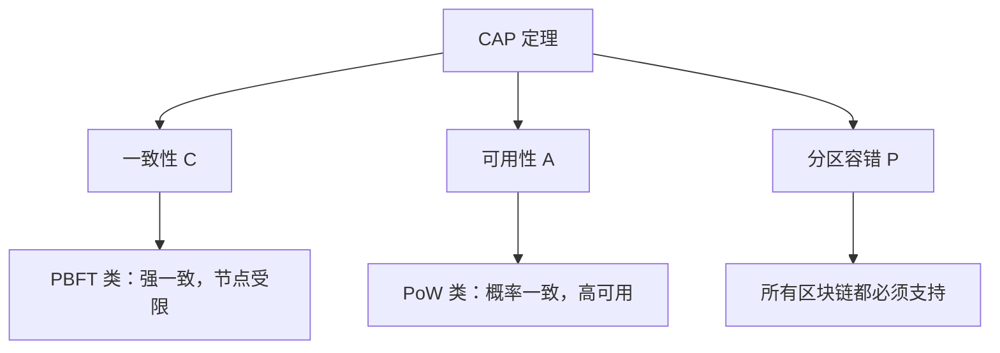
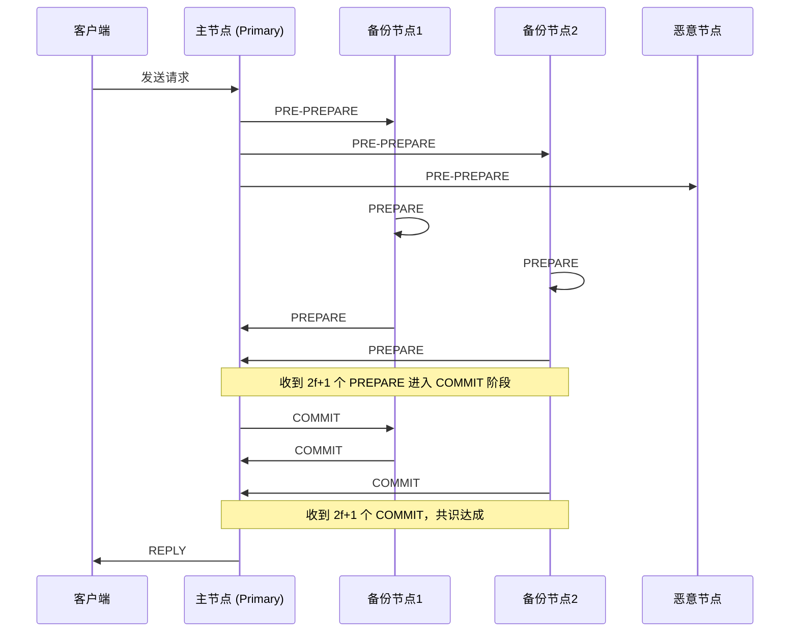
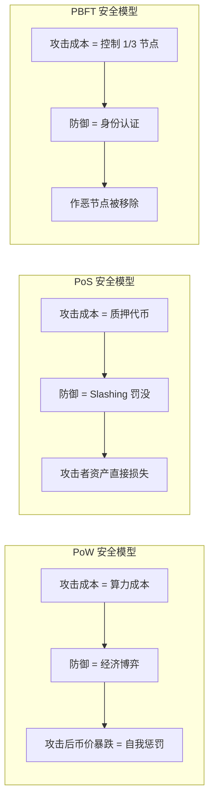

## 八、区块链共识机制深度解析

共识机制（Consensus Mechanism）是区块链的灵魂。它回答了一个核心问题：在一个没有中心权威的网络中，如何让互不信任的节点就"哪笔交易有效、下一个区块由谁写入"达成一致？理解共识机制，是从"知道区块链"到"真正理解区块链"的分水岭。

### 1. 为什么需要共识机制

#### 1.1 拜占庭将军问题

1982年，Leslie Lamport 等人提出了著名的拜占庭将军问题（Byzantine Generals Problem）：一支军队的多位将军分布在城池周围，他们只能通过信使传递消息来协调进攻或撤退。问题在于——信使可能叛变、消息可能被篡改、某些将军本身就是叛徒。如何在这种不可靠的通信环境中达成一致行动？

这个问题直接映射到分布式系统：节点就是将军，网络就是信使，恶意节点就是叛徒。区块链的共识机制，本质上就是拜占庭将军问题的工程化解决方案。

#### 1.2 FLP 不可能性定理

1985年，Fischer、Lynch 和 Paterson 证明了一个更根本的结论：在异步网络中，如果允许哪怕一个节点崩溃，就不存在任何确定性算法能保证达成共识（FLP Impossibility Theorem）。

这意味着所有实用的共识机制都必须做出某种妥协：

| 妥协方式 | 代表机制 | 核心思路 |
|---------|---------|---------|
| 引入随机性 | PoW、PoS | 用概率性最终一致替代确定性一致 |
| 限制故障模型 | PBFT | 假设恶意节点不超过 1/3 |
| 引入超时机制 | Tendermint | 同步假设下实现确定性终局 |
| 牺牲活性保安全 | Casper FFG | 网络分区时宁可停顿也不分叉 |

#### 1.3 CAP 定理与区块链

CAP 定理指出，分布式系统无法同时满足一致性（Consistency）、可用性（Availability）和分区容错性（Partition Tolerance）。区块链系统必须在三者中取舍：

- **比特币（PoW）**：选择 AP，牺牲即时一致性，通过 6 个区块确认获得概率性一致性
- **PBFT 类链（如 Hyperledger Fabric）**：选择 CP，保证一致性但节点数受限
- **Solana（PoH + PoS）**：在 AP 之间寻求平衡，通过历史证明加速共识



### 2. 主流共识机制详解

#### 2.1 工作量证明（Proof of Work, PoW）

**核心思想：** 用计算量证明你为网络付出了真实成本。谁先算出满足难度目标的哈希值，谁就获得记账权。

**工作流程：**

1. 矿工收集内存池中的待确认交易，组装候选区块
2. 在区块头中填入前一区块哈希、Merkle 根、时间戳、难度目标
3. 不变化 nonce 值，计算 SHA-256(SHA-256(block_header))
4. 如果结果小于难度目标（前导零足够多），则广播区块
5. 其他节点验证后接受，矿工获得区块奖励 + 交易费

**难度调整机制（比特币）：**

每 2016 个区块（约两周）调整一次。公式为：

```text
新难度 = 旧难度 × (2016 × 10 分钟) / 实际出块时间
```

如果全网算力上升导致出块过快，难度自动增大；反之缩小。这个机制确保无论算力如何波动，出块间隔始终稳定在约 10 分钟。

**51% 攻击的经济学分析：**

理论上，控制超过 50% 算力的攻击者可以双花交易。但实际执行面临巨大障碍：

| 成本项 | 比特币网络（2024年估算） |
|-------|------------------------|
| 矿机采购 | 约 50-100 亿美元（ASIC 矿机） |
| 电力成本 | 约 1500-3000 万美元/天 |
| 基础设施 | 数十亿美元（矿场、冷却、网络） |
| 攻击窗口 | 必须持续维持算力优势 |
| 攻击后果 | 币价暴跌，攻击者自身资产缩水 |

这就是为什么比特币从未被成功 51% 攻击过——攻击成本远超收益。但对于算力较小的 PoW 币种（如 Ethereum Classic），51% 攻击已多次发生。

**PoW 的优势：**
- 经过 15 年实战检验，安全性最高
- 完全去中心化，任何人都可以参与挖矿
- 能量消耗转化为安全性，攻击成本物理化
- 无需了解节点身份，抗审查性最强

**PoW 的劣势：**
- 能耗巨大（比特币年耗电约 150 TWh，相当于一个中等国家）
- 出块速度受限（比特币 10 分钟/块）
- 算力集中化趋势（矿池控制大部分算力）
- 硬件军备竞赛导致普通用户无法参与

#### 2.2 权益证明（Proof of Stake, PoS）

**核心思想：** 用质押的代币数量替代算力。你质押的代币越多，被选为验证者的概率越高。如果作恶，质押的代币会被罚没（Slashing）。

**以太坊 PoS（Gasper 协议）详解：**

以太坊在 2022 年 9 月完成 The Merge，从 PoW 转向 PoS。其共识协议 Gasper 结合了 Casper FFG（终局性）和 LMD GHOST（分叉选择）：

1. **验证者注册：** 质押 32 ETH 到存款合约，进入激活队列
2. **时隙（Slot）与纪元（Epoch）：** 每 12 秒一个时隙，每 32 个时隙（6.4 分钟）一个纪元
3. **提议者选举：** 每个时隙随机选出一个验证者作为区块提议者
4. **证明投票：** 每个时隙有一个委员会对区块头投票
5. **Casper FFG 终局性：** 每个纪元结束时，如果 2/3 验证者投票确认，检查点获得终局性
6. **罚没条件：** 双重投票（Double Voting）和环绕投票（Surround Voting）

**Slashing（罚没）机制详解：**

罚没是以太坊 PoS 安全性的核心保障：

| 违规行为 | 最低罚没 | 额外罚没 | 描述 |
|---------|---------|---------|------|
| 双重投票 | 1 ETH | 按比例增加 | 同一时隙对两个不同区块投票 |
| 环绕投票 | 1 ETH | 按比例增加 | 投票的源-目标环绕了之前的投票 |
| 直接关联 | — | 最高 100% 质押 | 如果大量验证者同时被罚没，罚没力度指数级增长 |

"按比例增加"的规则意味着：如果只有你一个人违规，罚没很轻；但如果很多人同时违规（可能是一次协同攻击），所有人都会被重罚。这使得大规模协调攻击的代价极其高昂。

**委托权益证明（Delegated PoS, DPoS）：**

DPoS 是 PoS 的变体，由 Daniel Larimer（BM）在 BitShares 中首创：

- 代币持有者投票选出固定数量的代表（如 EOS 的 21 个超级节点）
- 代表轮流出块，速度极快
- 代表作恶会被投票淘汰

代表项目对比：

| 项目 | 代表数量 | 出块时间 | TPS | 特点 |
|------|---------|---------|-----|------|
| EOS | 21 | 0.5s | ~4000 | 高性能但被批评为"21人委员会" |
| Tron | 27 | 3s | ~2000 | 中国社区活跃，DeFi 生态 |
| Lisk | 101 | 10s | ~25 | 更去中心化，采用侧链架构 |
| Cosmos (Tendermint) | ~150 | ~6s | ~10000 | IBC 跨链生态核心 |

DPoS 的核心争议在于去中心化程度：21 个节点是否足够安全？批评者认为这本质上是"伪去中心化"，但支持者认为代币持有者的投票权本身就是一种去中心化的治理。

#### 2.3 实用拜占庭容错（PBFT）

**核心思想：** 通过三阶段协议在已知节点集合中达成共识，容错能力为 f < n/3（即恶意节点不超过总数的 1/3）。

**三阶段流程：**



**视图切换（View Change）：**

当主节点故障或作恶时，备份节点发起视图切换：

1. 备份节点超时未收到主节点消息
2. 广播 VIEW-CHANGE 消息
3. 新主节点收到 2f+1 个 VIEW-CHANGE 后成为主节点
4. 从上一个稳定检查点恢复状态

**PBFT 的实际应用：**

- **Hyperledger Fabric（v1.0）：** 使用改进的 PBFT（Raft 用于排序服务）
- **Zilliqa：** PBFT + PoW 混合，分片内使用 PBFT 达成共识
- **Oasis Network：** 使用改进的 PBFT（Tendermint 变体）处理机密计算

**PBFT 的局限：**
- 通信复杂度 O(n²)，节点数超过 100 时性能急剧下降
- 需要预先知道所有参与节点，不适合开放网络
- 不适合大规模公链，主要用于联盟链和私链

#### 2.4 历史证明（Proof of History, PoH）

**核心思想：** 由 Solana 创始人 Anatoly Yakovenko 提出。PoH 不是共识机制本身，而是一个"去中心化时钟"——通过可验证延迟函数（VDF）为交易打上时间戳，从而大幅减少节点间达成共识所需的通信量。

**工作原理：**

1. 使用 SHA-256 迭代哈希，每一步的输出是下一步的输入
2. 每个哈希结果都包含一个计数器和时间戳
3. 交易被插入到哈希序列中，获得一个全局可验证的时间戳
4. 验证者只需验证哈希链的正确性，无需与其他节点同步时间

**效果：** Solana 在 PoH 的基础上结合 Tower BFT（一种基于 PoH 的 PBFT 变体），实现了 400ms 的出块时间和约 65,000 TPS 的理论吞吐量。

**争议与风险：** PoH 对硬件要求极高（验证节点需要高端服务器），被批评为"用硬件门槛换速度"。2022 年 Solana 多次宕机也引发了对其可靠性的质疑。

#### 2.5 权威证明（Proof of Authority, PoA）

**核心思想：** 预先选定一组已知身份的验证者，他们用自己的"声誉"而非代币做担保。验证者身份公开，作恶代价是声誉损失。

**典型应用：**

- **以太坊测试网（Goerli、Sepolia）：** 使用 PoA，便于开发者快速部署测试
- **BNB Smart Chain：** 使用 PoSA（Proof of Staked Authority），结合 PoS 和 PoA
- **VeChain：** 使用权威证明变体，验证者由基金会和企业合作伙伴担任

**PoA 的适用场景：**
- 联盟链和企业级应用
- 对性能要求高但参与方已知的网络
- 测试网络和开发环境

#### 2.6 空间证明（Proof of Space, PoSpace）

**核心思想：** 用硬盘存储空间替代算力。矿工预先在硬盘上填充大量数据（Plot 文件），挖矿时根据挑战读取数据，谁最快返回正确答案谁获得记账权。

**代表项目：**

- **Chia（XCH）：** 由 BitTorrent 创始人 Bram Cohen 创建，使用 Proof of Space and Time（PoST），结合空间证明和时间证明
- **Filecoin（FIL）：** 使用 Proof of Spacetime（PoSt），存储提供商证明数据持续存储

**Chia 的工作流程：**

1. **Plotting（播种）：** 在硬盘上生成 Plot 文件（约 100GB/个），这个过程需要大量计算和存储
2. **Farming（耕种）：** 网络发出挑战，矿工扫描 Plot 文件查找最佳答案
3. **验证：** 其他节点快速验证答案的正确性

**优势：** 硬盘比 GPU 更节能，降低挖矿的能源门槛。

**争议：** Chia 刚上线时导致全球硬盘价格暴涨，SSD 寿命因 Plotting 急剧缩短，被批评为"用硬盘浪费替代电力浪费"。

### 3. 共识机制对比分析

#### 3.1 核心维度对比

| 维度 | PoW | PoS | DPoS | PBFT | PoH+PoS | PoA |
|------|-----|-----|------|------|---------|-----|
| 共识原理 | 算力竞争 | 质押代币 | 选举代表 | 多轮投票 | 时间戳+质押 | 身份声誉 |
| 去中心化 | ★★★★★ | ★★★★ | ★★★ | ★★ | ★★★ | ★ |
| 安全性 | ★★★★★ | ★★★★ | ★★★ | ★★★★ | ★★★ | ★★★ |
| TPS | 7 (BTC) | 15-30 (ETH) | 1000+ | 1000+ | 65000 | 1000+ |
| 出块时间 | 10min | 12s | 0.5-10s | 即时 | 0.4s | 秒级 |
| 能耗 | 极高 | 低 | 低 | 极低 | 低 | 极低 |
| 终局性 | 概率性 | 确定性(~15min) | 快速 | 即时 | 快速 | 即时 |
| 准入门槛 | 硬件+电力 | 质押代币 | 投票选举 | 身份认证 | 高端硬件 | 身份认证 |
| 适用场景 | 价值存储 | 智能合约平台 | 高性能公链 | 联盟链 | 高频交易 | 企业链 |

#### 3.2 安全模型对比



#### 3.3 "不可能三角"与各机制的取舍

区块链的"不可能三角"（Scalability Trilemma）指出：去中心化、安全性、可扩展性三者难以兼得。

| 机制 | 去中心化 | 安全性 | 可扩展性 | 解决策略 |
|------|---------|-------|---------|---------|
| PoW（比特币） | ✅ 最高 | ✅ 最高 | ❌ 最低 | 接受低 TPS，用 Layer2 扩展 |
| PoS（以太坊） | ✅ 较高 | ✅ 高 | ⚠️ 中等 | 分片 + Rollup 扩展 |
| DPoS（EOS） | ⚠️ 较低 | ⚠️ 中等 | ✅ 高 | 牺牲去中心化换速度 |
| PoH（Solana） | ⚠️ 较低 | ⚠️ 中等 | ✅ 最高 | 硬件门槛换性能 |
| PBFT（Hyperledger） | ❌ 最低 | ✅ 高 | ✅ 高 | 已知节点，封闭网络 |

### 4. 共识机制的前沿发展

#### 4.1 混合共识机制

现代区块链越来越多地采用混合共识，将多种机制的优势结合：

**以太坊的 Gasper = Casper FFG + LMD GHOST：**
- LMD GHOST 处理分叉选择，保证活性
- Casper FFG 提供终局性保证，保证安全
- 两者互补，解决了传统 PoS 的"Nothing at Stake"问题

**Avalanche 的 Snowball 协议：**
- 结合了 Nakamoto 共识（概率性）和经典共识（确定性）的优点
- 通过重复子采样投票实现亚秒级终局性
- 理论上可支持数百万验证者

**Polkadot 的 GRANDPA + BABE：**
- BABE（Blind Assignment for Blockchain Extension）负责区块生产
- GRANDPA（GHOST-based Recursive ANcestor Deriving Prefix Agreement）负责终局性
- 可以一次性终局化多个区块，效率极高

#### 4.2 零知识证明与共识

ZK 技术正在改变共识的实现方式：

- **ZK-Rollup：** 将大量交易压缩为一个零知识证明，主链只需验证证明而非每笔交易
- **ZK-Proof of Validity：** 验证者生成有效性证明，其他节点无需重新执行交易
- **隐私共识：** 在不泄露交易细节的情况下验证交易的有效性

代表项目：
- **zkSync Era：** ZK-Rollup，支持通用智能合约
- **StarkNet：** 使用 STARK 证明，无需可信设置
- **Mina Protocol：** 整条链只有 22KB，使用递归 ZK-SNARK 压缩整个区块链状态

#### 4.3 共识即服务（CaaS）

随着模块化区块链的兴起，共识正在成为一种可插拔的服务：

- **EigenLayer：** 通过"再质押"（Restaking），让 ETH 质押者同时为多个协议提供安全保障
- **Babylon：** 用比特币的安全性为其他链提供共识服务
- **Cosmos SDK：** 提供即插即用的共识模块（Tendermint），开发者无需从零实现

### 5. 实操：如何验证共识机制

#### 5.1 在以太坊上验证 PoS 共识

查看当前验证者信息和网络状态：

```bash
# 使用 curl 查询信标链 API（需要运行共识层客户端）
curl http://localhost:5052/eth/v1/beacon/states/head/validators | jq '.data | length'

# 查看当前 epoch 和 slot
curl http://localhost:5052/eth/v1/beacon/states/head/finality_checkpoints

# 使用 Etherscan 查看验证者概况
# https://beaconcha.in/validators
```

#### 5.2 运行一个 PoA 节点（以太坊私链）

使用 Geth 搭建 PoA 私链进行学习：

```bash
# 1. 初始化创世块
geth --datadir ./node1 init genesis.json

# 2. 创世块配置（Clique PoA）
cat > genesis.json << 'EOF'
{
  "config": {
    "chainId": 12345,
    "clique": {
      "period": 5,
      "epoch": 30000
    }
  },
  "difficulty": "1",
  "gasLimit": "12000000",
  "extradata": "0x0000000000000000000000000000000000000000000000000000000000000000<签名者地址>0000000000000000000000000000000000000000000000000000000000000000000000000000000000000000000000000000000000000000000000000000000000"
}
EOF

# 3. 启动节点
geth --datadir ./node1 --networkid 12345 --http --http.api eth,net,web3,personal --mine --miner.etherbase <你的地址>
```

#### 5.3 使用 Python 模拟 PoW 共识

```python
import hashlib
import time
import json

class SimpleBlock:
    def __init__(self, index, previous_hash, transactions, timestamp=None):
        self.index = index
        self.previous_hash = previous_hash
        self.transactions = transactions
        self.timestamp = timestamp or time.time()
        self.nonce = 0
        self.hash = self.calculate_hash()

    def calculate_hash(self):
        block_data = json.dumps({
            'index': self.index,
            'previous_hash': self.previous_hash,
            'transactions': self.transactions,
            'timestamp': self.timestamp,
            'nonce': self.nonce
        }, sort_keys=True)
        return hashlib.sha256(block_data.encode()).hexdigest()

    def mine_block(self, difficulty):
        target = '0' * difficulty
        start_time = time.time()
        while not self.hash.startswith(target):
            self.nonce += 1
            self.hash = self.calculate_hash()
        elapsed = time.time() - start_time
        print(f"区块 #{self.index} 已挖出! nonce={self.nonce}, "
              f"耗时={elapsed:.2f}s, hash={self.hash[:16]}...")
        return self.hash

# 使用示例
if __name__ == '__main__':
    difficulty = 4  # 前导零个数
    genesis = SimpleBlock(0, '0' * 64, ['创世区块交易'])
    genesis.mine_block(difficulty)

    block1 = SimpleBlock(1, genesis.hash, ['Alice -> Bob: 10 ETH', 'Bob -> Charlie: 5 ETH'])
    block1.mine_block(difficulty)

    block2 = SimpleBlock(2, block1.hash, ['Charlie -> Dave: 3 ETH'])
    block2.mine_block(difficulty)

    print(f"\n区块链验证:")
    print(f"  Block 1 的 previous_hash == Block 0 的 hash? {block1.previous_hash == genesis.hash}")
    print(f"  Block 2 的 previous_hash == Block 1 的 hash? {block2.previous_hash == block1.hash}")
```

运行这个脚本，你会直观地看到难度（前导零个数）如何影响挖矿时间。将难度从 4 改到 5，挖矿时间会指数级增长。

### 6. 常见误区与深度辨析

#### 误区一："PoW 纯粹是浪费能源"

**真相：** PoW 的能源消耗不是"浪费"，而是将安全性物理化。就像银行用金库的物理安全性来保护存款一样，PoW 用物理世界的能源消耗来保护数字世界的资产。关键问题是能源来源——如果使用可再生能源，PoW 的环境影响就大幅降低。

数据显示：比特币挖矿的可再生能源使用率约 55-60%（2024 年数据），高于许多传统行业。

#### 误区二："PoS 是富人越富的机制"

**真相：** 这个批评有一定道理，但忽略了几个关键点：

1. PoW 同样存在"富人越富"的问题——规模经济让大型矿场比个人矿工更有优势
2. 以太坊 PoS 的最低质押门槛是 32 ETH（约 10 万美元），但通过 Lido 等流动性质押协议，0.01 ETH 也能参与
3. PoS 的收益率是固定的（约 3-5%），不因持有量增加而提高；PoW 的规模经济则让大矿工获得不成比例的优势

#### 误区三："DPoS 就是中心化"

**真相：** DPoS 的去中心化程度确实低于 PoW 和 PoS，但这是一种有意识的设计取舍。关键问题不是"有多少节点"，而是：

1. 节点的准入是否开放？（任何人可以竞选代表）
2. 代表的替换是否顺畅？（投票淘汰机制是否有效）
3. 代表之间是否有制衡？（互相对账、举报机制）

EOS 的 21 个节点确实少，但这些节点之间存在竞争关系，且代币持有者可以随时更换投票。

#### 误区四："共识机制越快越好"

**真相：** 出块速度快不代表区块链好。高 TPS 通常意味着：

1. 更高的硬件要求 → 更少的人能运行节点 → 更中心化
2. 更大的状态膨胀 → 全节点存储成本增加 → 历史数据难以验证
3. 网络延迟对共识的影响更大 → 在高延迟地区可能出现分叉

比特币的 10 分钟出块是刻意的设计——它确保全球任何角落的矿工都能在合理时间内收到新区块，最大程度地减少孤块率。

#### 误区五："只看 TPS 就能判断公链好坏"

**真相：** TPS 是最容易被操纵的指标。很多项目宣称的"百万 TPS"是在最理想条件下的理论值：

1. **实际 TPS vs 理论 TPS：** Solana 理论 65,000 TPS，实际日常约 3,000-5,000 TPS
2. **交易复杂度：** 转账和 DeFi swap 的计算量完全不同
3. **状态增长速度：** 高 TPS 意味着区块链数据快速增长，全节点成本飙升
4. **去中心化程度：** 用一个高性能服务器跑出的 TPS 没有意义

评估公链应该看综合指标：实际 TPS、终局性时间、全节点硬件要求、活跃验证者数量、网络正常运行时间。

### 7. 从投资视角看共识机制

#### 7.1 共识机制如何影响代币价值

| 共识机制 | 代币需求来源 | 通胀模型 | 价值捕获逻辑 |
|---------|------------|---------|------------|
| PoW | 矿工购买设备和电力 | 区块奖励递减（BTC 减半） | "数字黄金"叙事，供给固定 |
| PoS | 质押者锁定代币 | 质押奖励（约 3-5%） | 质押锁仓减少流通，类似"数字债券" |
| DPoS | 投票和治理 | 代表奖励 + 通胀 | 生态应用消耗代币（如 CPU/NET 资源） |
| PoA | 生态使用 | 固定或低通胀 | 生态应用价值捕获 |

#### 7.2 质押经济学分析

以以太坊为例，质押的真实收益率计算：

```text
名义质押收益率 ≈ 4% (2024年)

扣除成本后：
- 验证者运营成本（服务器、带宽）：约 0.5-1%
- Slashing 风险溢价：约 0.1%
- 机会成本（代币被锁定的流动性损失）：因人而异

实际收益率 ≈ 3-3.5%

通过 Lido 等流动性质押：
- 获得 stETH，可在 DeFi 中继续使用
- 实际收益率 = 质押收益 + DeFi 收益
- 但增加了智能合约风险
```

### 8. 总结

共识机制是区块链技术的基石，决定了网络的安全性、去中心化程度和性能。没有"最好"的共识机制，只有"最适合"的：

- **追求最大安全性和去中心化：** 选 PoW（比特币）
- **追求智能合约平台的平衡：** 选 PoS（以太坊）
- **追求高性能和低费用：** 选 DPoS 或 PoH（Solana、Cosmos）
- **企业级联盟链应用：** 选 PBFT 或 PoA（Hyperledger）

理解共识机制，不仅能帮助你做出更好的投资决策，更能让你在 Web3 世界中识别项目的真实技术实力——那些声称"解决了不可能三角"的项目，往往只是换了一种取舍方式而已。

> **关键洞察：** 共识机制的本质是信任的数学化。它不是消除信任，而是将信任从"人"转移到"代码和经济博弈"。理解这一点，你就理解了区块链最核心的价值主张。
